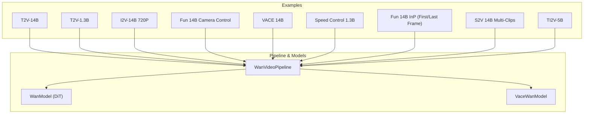
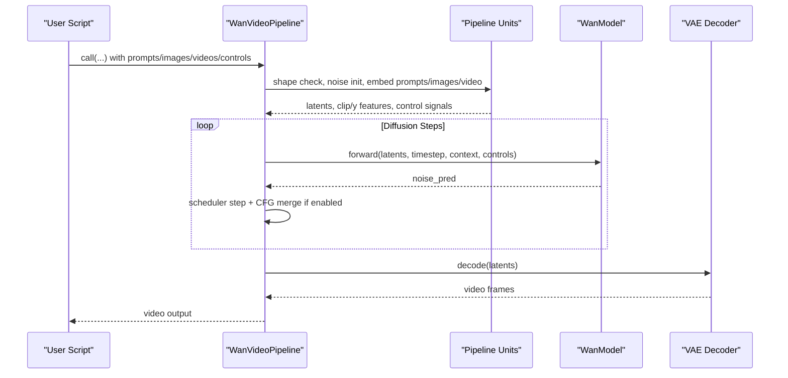
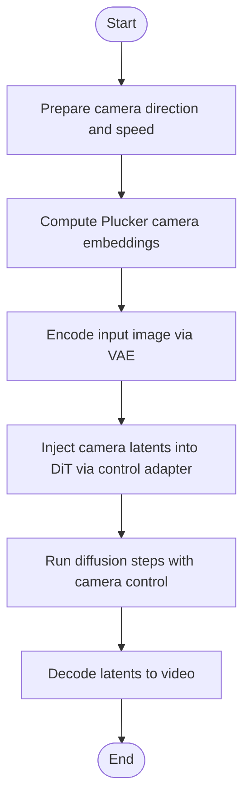
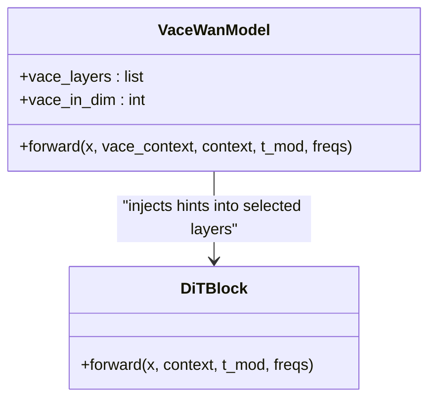
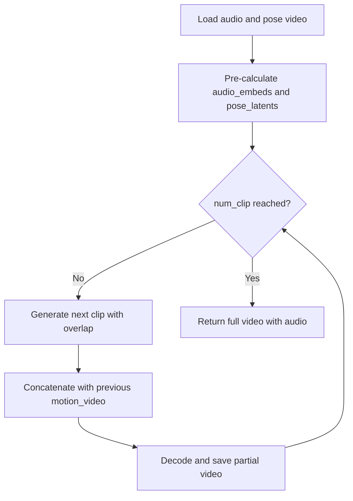
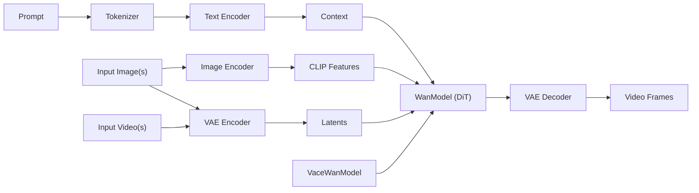

# WanVideo Model Examples

<cite>
**Referenced Files in This Document**
- [Wan2.1-T2V-14B.py](file://examples/wanvideo/model_inference/Wan2.1-T2V-14B.py)
- [Wan2.1-T2V-1.3B.py](file://examples/wanvideo/model_inference/Wan2.1-T2V-1.3B.py)
- [Wan2.1-I2V-14B-720P.py](file://examples/wanvideo/model_inference/Wan2.1-I2V-14B-720P.py)
- [Wan2.1-Fun-V1.1-14B-Control-Camera.py](file://examples/wanvideo/model_inference/Wan2.1-Fun-V1.1-14B-Control-Camera.py)
- [Wan2.1-VACE-14B.py](file://examples/wanvideo/model_inference/Wan2.1-VACE-14B.py)
- [Wan2.1-1.3b-speedcontrol-v1.py](file://examples/wanvideo/model_inference/Wan2.1-1.3b-speedcontrol-v1.py)
- [Wan2.1-Fun-V1.1-14B-InP.py](file://examples/wanvideo/model_inference/Wan2.1-Fun-V1.1-14B-InP.py)
- [Wan2.2-S2V-14B_multi_clips.py](file://examples/wanvideo/model_inference/Wan2.2-S2V-14B_multi_clips.py)
- [Wan2.2-TI2V-5B.py](file://examples/wanvideo/model_inference/Wan2.2-TI2V-5B.py)
- [wan_video.py](file://diffsynth/pipelines/wan_video.py)
- [wan_video_dit.py](file://diffsynth/models/wan_video_dit.py)
- [wan_video_vace.py](file://diffsynth/models/wan_video_vace.py)
</cite>

## Table of Contents
1. Introduction
2. Project Structure
3. Core Components
4. Architecture Overview
5. Detailed Component Analysis
6. Dependency Analysis
7. Performance Considerations
8. Troubleshooting Guide
9. Conclusion

## Introduction
This document provides practical, code-backed examples for the WanVideo model family across text-to-video, image-to-video, video editing, camera control, motion control, VACE (Video Action Control Editor), and Fun models. It also covers different model sizes (1.3B, 5B, 14B), speed control, inpainting-style generation with first/last frames, multi-clip generation, and training/distributed setup references. All examples are grounded in repository scripts and core pipeline/model implementations.

## Project Structure
The WanVideo examples live under examples/wanvideo/model_inference and demonstrate:
- Text-to-video pipelines for various model sizes
- Image-to-video and first-last-frame to video
- Camera control (dolly/jib-like directions)
- VACE conditioning via depth/reference inputs
- Speed control via motion bucket ID
- Multi-clip speech-to-video generation
- A 5B text/image-to-video variant

**Diagram sources**
- [wan_video.py](file://diffsynth/pipelines/wan_video.py)
- [wan_video_dit.py](file://diffsynth/models/wan_video_dit.py)
- [wan_video_vace.py](file://diffsynth/models/wan_video_vace.py)

**Section sources**
- [Wan2.1-T2V-14B.py](file://examples/wanvideo/model_inference/Wan2.1-T2V-14B.py)
- [Wan2.1-T2V-1.3B.py](file://examples/wanvideo/model_inference/Wan2.1-T2V-1.3B.py)
- [Wan2.1-I2V-14B-720P.py](file://examples/wanvideo/model_inference/Wan2.1-I2V-14B-720P.py)
- [Wan2.1-Fun-V1.1-14B-Control-Camera.py](file://examples/wanvideo/model_inference/Wan2.1-Fun-V1.1-14B-Control-Camera.py)
- [Wan2.1-VACE-14B.py](file://examples/wanvideo/model_inference/Wan2.1-VACE-14B.py)
- [Wan2.1-1.3b-speedcontrol-v1.py](file://examples/wanvideo/model_inference/Wan2.1-1.3b-speedcontrol-v1.py)
- [Wan2.1-Fun-V1.1-14B-InP.py](file://examples/wanvideo/model_inference/Wan2.1-Fun-V1.1-14B-InP.py)
- [Wan2.2-S2V-14B_multi_clips.py](file://examples/wanvideo/model_inference/Wan2.2-S2V-14B_multi_clips.py)
- [Wan2.2-TI2V-5B.py](file://examples/wanvideo/model_inference/Wan2.2-TI2V-5B.py)

## Core Components
- WanVideoPipeline orchestrates all features: prompt embedding, image/video conditioning, camera control, VACE, speed control, scheduling, CFG, decoding, and optional sequence parallelism.
- WanModel (DiT) is the core transformer backbone with attention variants and optional control adapters.
- VaceWanModel injects VACE context into DiT blocks for action/control guidance.

Key capabilities exposed by the pipeline:
- Text-to-video and image-to-video
- First/last frame to video (inpainting-style transitions)
- Video-to-video with denoising strength
- Camera control directions and speeds
- VACE via depth/reference videos or images
- Speed control via motion bucket ID
- Multi-clip generation for long sequences
- Unified sequence parallelism for large models

**Section sources**
- [wan_video.py](file://diffsynth/pipelines/wan_video.py)
- [wan_video_dit.py](file://diffsynth/models/wan_video_dit.py)
- [wan_video_vace.py](file://diffsynth/models/wan_video_vace.py)

## Architecture Overview
The inference flow integrates multiple units that prepare inputs, condition the model, run diffusion steps, and decode outputs.

**Diagram sources**
- [wan_video.py](file://diffsynth/pipelines/wan_video.py)
- [wan_video_dit.py](file://diffsynth/models/wan_video_dit.py)

## Detailed Component Analysis

### Text-to-Video (1.3B and 14B)
- 1.3B example demonstrates basic text-to-video and a follow-up video-to-video edit using denoising strength.
- 14B example shows high-quality text-to-video generation with tiled decoding.

Usage highlights:
- Initialize pipeline with ModelConfig entries for DiT, text encoder, and VAE.
- Provide prompt/negative_prompt, seed, and tiled=True for memory efficiency.
- Save results with fps and quality parameters.

**Section sources**
- [Wan2.1-T2V-1.3B.py](file://examples/wanvideo/model_inference/Wan2.1-T2V-1.3B.py)
- [Wan2.1-T2V-14B.py](file://examples/wanvideo/model_inference/Wan2.1-T2V-14B.py)

### Image-to-Video (14B 720P)
- Loads an input image and generates a video conditioned on both text and the image.
- Uses height/width and tiled decoding for stable performance at higher resolutions.

**Section sources**
- [Wan2.1-I2V-14B-720P.py](file://examples/wanvideo/model_inference/Wan2.1-I2V-14B-720P.py)

### Camera Control (Dolly/Jib-like Movements)
- Supports directional camera control such as Left, Up, etc., with adjustable speed.
- Internally computes Plucker embeddings and injects them through a control adapter.

**Diagram sources**
- [wan_video.py](file://diffsynth/pipelines/wan_video.py)
- [wan_video_dit.py](file://diffsynth/models/wan_video_dit.py)

**Section sources**
- [Wan2.1-Fun-V1.1-14B-Control-Camera.py](file://examples/wanvideo/model_inference/Wan2.1-Fun-V1.1-14B-Control-Camera.py)

### VACE (Video Action Control Editor)
- Accepts depth/reference videos or reference images to steer action and composition.
- Combines inactive/reactive latents and mask latents to form VACE context injected into DiT blocks.

**Diagram sources**
- [wan_video_vace.py](file://diffsynth/models/wan_video_vace.py)
- [wan_video_dit.py](file://diffsynth/models/wan_video_dit.py)

**Section sources**
- [Wan2.1-VACE-14B.py](file://examples/wanvideo/model_inference/Wan2.1-VACE-14B.py)

### Speed Control (Motion Bucket ID)
- Adjust perceived motion speed by setting motion_bucket_id.
- Demonstrated with two settings producing slower and faster motion.

**Section sources**
- [Wan2.1-1.3b-speedcontrol-v1.py](file://examples/wanvideo/model_inference/Wan2.1-1.3b-speedcontrol-v1.py)

### Inpainting-style Generation (First/Last Frame to Video)
- Generate dynamic content between a start image and optionally an end image.
- The pipeline constructs masked VAE latents to anchor first/last frames while synthesizing intermediate frames.

**Section sources**
- [Wan2.1-Fun-V1.1-14B-InP.py](file://examples/wanvideo/model_inference/Wan2.1-Fun-V1.1-14B-InP.py)

### Multi-Clip Speech-to-Video (S2V 14B)
- Pre-calculates audio and pose latents, then generates overlapping clips to produce longer videos.
- Uses overlap frames to ensure temporal continuity across clips.

**Diagram sources**
- [wan_video.py](file://diffsynth/pipelines/wan_video.py)

**Section sources**
- [Wan2.2-S2V-14B_multi_clips.py](file://examples/wanvideo/model_inference/Wan2.2-S2V-14B_multi_clips.py)

### 5B Text/Image-to-Video (TI2V-5B)
- Smaller model supporting both text-to-video and image-to-video with tiled decoding.
- Demonstrates flexible resolution and frame count configuration.

**Section sources**
- [Wan2.2-TI2V-5B.py](file://examples/wanvideo/model_inference/Wan2.2-TI2V-5B.py)

## Dependency Analysis
The pipeline composes several components:
- Text encoder and tokenizer for prompts
- Image encoder (optional) for CLIP features
- VAE for encoding/decoding
- DiT backbone with optional control adapters
- VACE module for action control
- Optional audio encoder for S2V

**Diagram sources**
- [wan_video.py](file://diffsynth/pipelines/wan_video.py)
- [wan_video_dit.py](file://diffsynth/models/wan_video_dit.py)
- [wan_video_vace.py](file://diffsynth/models/wan_video_vace.py)

**Section sources**
- [wan_video.py](file://diffsynth/pipelines/wan_video.py)

## Performance Considerations
- Tiled decoding reduces VRAM usage during VAE encode/decode.
- Unified Sequence Parallelism can be enabled for large models to distribute computation.
- Gradient checkpointing is used in training paths; inference benefits from efficient attention backends when available.
- Motion bucket ID allows tuning motion intensity without changing model weights.
- For long videos, multi-clip generation with overlap ensures smooth transitions while managing memory.

[No sources needed since this section provides general guidance]

## Troubleshooting Guide
Common issues and remedies:
- Out-of-memory errors: enable tiled decoding, reduce resolution/frames, or use unified sequence parallelism.
- Incorrect aspect ratio or frame count: ensure dimensions are multiples of required factors enforced by the pipeline.
- Camera control not applied: verify camera_control_direction and speed are set and input_image is provided where required.
- VACE artifacts: confirm masks and reference inputs match expected shapes and scales.

**Section sources**
- [wan_video.py](file://diffsynth/pipelines/wan_video.py)

## Conclusion
The WanVideo ecosystem offers a comprehensive suite of generation and editing capabilities across model sizes. By leveraging the pipeline’s modular units, users can combine text, images, videos, camera control, VACE, and speed control to create diverse, high-quality video content. Training and distributed configurations are supported through example scripts and accelerate configs in the repository.

[No sources needed since this section summarizes without analyzing specific files]