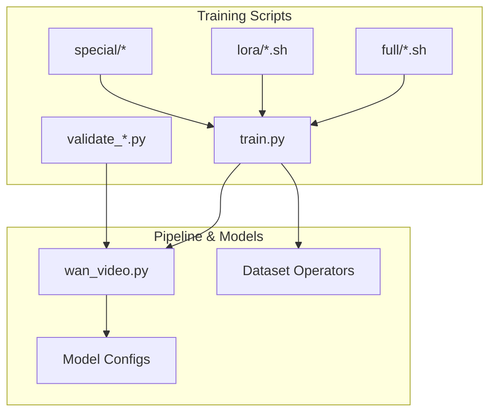
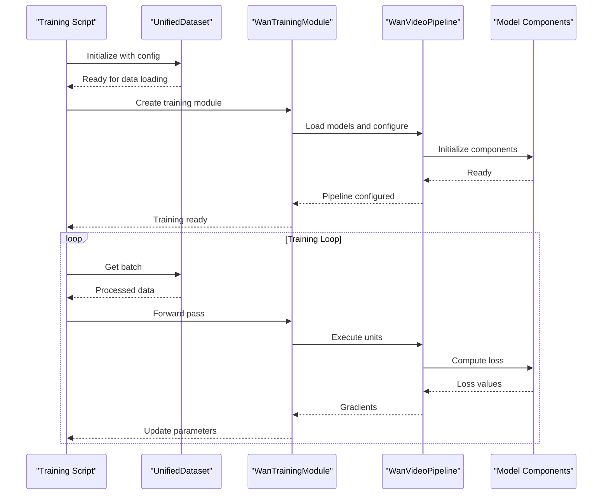
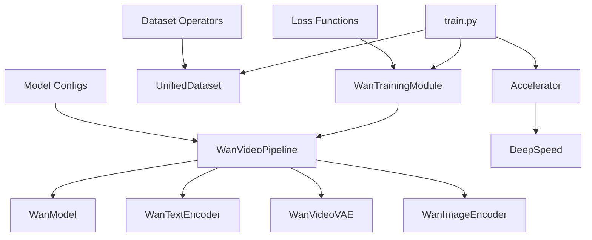

# WanVideo Training Examples

<cite>
**Referenced Files in This Document**
- [train.py](file://examples/wanvideo/model_training/train.py)
- [Wan2.1-T2V-14B.sh (full)](file://examples/wanvideo/model_training/full/Wan2.1-T2V-14B.sh)
- [Wan2.1-T2V-14B.sh (lora)](file://examples/wanvideo/model_training/lora/Wan2.1-T2V-14B.sh)
- [accelerate_config_zero3.yaml](file://examples/wanvideo/model_training/full/accelerate_config_zero3.yaml)
- [Wan2.1-Fun-14B-Control.sh (full)](file://examples/wanvideo/model_training/full/Wan2.1-Fun-14B-Control.sh)
- [Wan2.1-Fun-14B-Control.sh (lora)](file://examples/wanvideo/model_training/lora/Wan2.1-Fun-14B-Control.sh)
- [Wan2.1-I2V-14B-480P.sh (low VRAM)](file://examples/wanvideo/model_training/special/low_vram_training/Wan2.1-I2V-14B-480P.sh)
- [Wan2.1-I2V-14B-480P.sh (FP8)](file://examples/wanvideo/model_training/special/fp8_training/Wan2.1-I2V-14B-480P.sh)
- [Wan2.1-T2V-14B-NPU.sh](file://examples/wanvideo/model_training/special/npu_training/Wan2.1-T2V-14B-NPU.sh)
- [wan_video.py](file://diffsynth/pipelines/wan_video.py)
</cite>

## Table of Contents
1. [Introduction](#introduction)
2. [Project Structure](#project-structure)
3. [Core Components](#core-components)
4. [Architecture Overview](#architecture-overview)
5. [Detailed Component Analysis](#detailed-component-analysis)
6. [Dependency Analysis](#dependency-analysis)
7. [Performance Considerations](#performance-considerations)
8. [Troubleshooting Guide](#troubleshooting-guide)
9. [Conclusion](#conclusion)
10. [Appendices](#appendices)

## Introduction
This document provides comprehensive training guidance for WanVideo models, covering full fine-tuning, LoRA training, and distributed configurations. It includes examples for text-to-video (T2V), image-to-video (I2V), and Fun model variants, along with acceleration strategies for multi-GPU setups and optimization techniques for large-scale training. You will also find guidance on custom dataset preparation, hyperparameter tuning, checkpoint management, validation workflows, NPU training support, and low VRAM training strategies.

## Project Structure
The WanVideo training setup is organized under the examples directory with clear separation between full fine-tuning, LoRA fine-tuning, special configurations (NPU, FP8, low VRAM, split training), and validation scripts. The core training entry point is a unified script that supports multiple tasks and model variants through command-line arguments.

**Diagram sources**
- [train.py:1-191](file://examples/wanvideo/model_training/train.py#L1-L191)
- [wan_video.py:1-800](file://diffsynth/pipelines/wan_video.py#L1-L800)

**Section sources**
- [train.py:1-191](file://examples/wanvideo/model_training/train.py#L1-L191)
- [wan_video.py:1-800](file://diffsynth/pipelines/wan_video.py#L1-L800)

## Core Components
The training system centers around a unified training module that supports multiple WanVideo model variants and training modes. Key components include:

### Training Module Architecture
The `WanTrainingModule` class extends the base diffusion training framework to handle WanVideo-specific operations including data processing, loss computation, and model splitting for different training modes.

### Pipeline Integration
The system integrates with `WanVideoPipeline` which manages the complete inference and training pipeline for various WanVideo model types including T2V, I2V, Fun models, and specialized variants.

### Data Processing
Unified dataset handling with support for video, audio, and image inputs through configurable operators and preprocessing pipelines.

**Section sources**
- [train.py:9-112](file://examples/wanvideo/model_training/train.py#L9-L112)
- [wan_video.py:32-186](file://diffsynth/pipelines/wan_video.py#L32-L186)

## Architecture Overview
The WanVideo training architecture follows a modular design pattern that separates concerns between data loading, model processing, and training orchestration.

**Diagram sources**
- [train.py:127-191](file://examples/wanvideo/model_training/train.py#L127-L191)
- [wan_video.py:189-359](file://diffsynth/pipelines/wan_video.py#L189-L359)

## Detailed Component Analysis

### Training Script Analysis
The main training script provides a comprehensive interface for WanVideo model training with support for multiple tasks and configuration options.

#### Key Features:
- **Multi-task Support**: SFT (Supervised Fine-Tuning) and Direct Distillation
- **Flexible Model Loading**: Support for various WanVideo model variants
- **Gradient Checkpointing**: Memory optimization for large models
- **LoRA Integration**: Parameter-efficient fine-tuning capabilities
- **Mixed Precision**: FP8 and BF16 training support

#### Command Line Arguments:
The script accepts extensive configuration through argparse, including dataset paths, model specifications, training hyperparameters, and optimization settings.

**Section sources**
- [train.py:114-124](file://examples/wanvideo/model_training/train.py#L114-L124)
- [train.py:127-191](file://examples/wanvideo/model_training/train.py#L127-L191)

### Full Fine-tuning Configuration
Full fine-tuning scripts demonstrate complete model parameter updates with optimized configurations for different model sizes and variants.

#### Example: T2V 14B Full Fine-tuning
The script demonstrates proper configuration for large-scale training including:
- Accelerate configuration for multi-GPU setup
- Dataset path specification with metadata
- Model ID mapping for component files
- Learning rate and epoch configuration
- Checkpoint prefix removal for compatibility

**Section sources**
- [Wan2.1-T2V-14B.sh (full):1-15](file://examples/wanvideo/model_training/full/Wan2.1-T2V-14B.sh#L1-L15)

### LoRA Training Configuration
LoRA training scripts show parameter-efficient fine-tuning with targeted module updates and reduced memory requirements.

#### Example: T2V 14B LoRA Training
Key features include:
- Target module specification for efficient updates
- Rank configuration for capacity control
- Base model identification
- Optimized learning rates for LoRA training

**Section sources**
- [Wan2.1-T2V-14B.sh (lora):1-17](file://examples/wanvideo/model_training/lora/Wan2.1-T2V-14B.sh#L1-L17)

### Fun Model Training
Fun models support additional control inputs like control videos and reference images for enhanced conditioning.

#### Control Video Integration
The training scripts demonstrate how to handle additional input modalities through the `extra_inputs` parameter and corresponding data file keys.

**Section sources**
- [Wan2.1-Fun-14B-Control.sh (full):1-17](file://examples/wanvideo/model_training/full/Wan2.1-Fun-14B-Control.sh#L1-L17)
- [Wan2.1-Fun-14B-Control.sh (lora):1-19](file://examples/wanvideo/model_training/lora/Wan2.1-Fun-14B-Control.sh#L1-L19)

### Distributed Training Configuration
The accelerate configuration enables efficient multi-GPU training with DeepSpeed integration for large model training.

#### DeepSpeed Zero Stage 3
Configuration includes optimizer offloading, parameter sharding, and mixed precision training for optimal memory usage across multiple GPUs.

**Section sources**
- [accelerate_config_zero3.yaml:1-24](file://examples/wanvideo/model_training/full/accelerate_config_zero3.yaml#L1-L24)

### Low VRAM Training Strategies
Specialized configurations for training on limited GPU memory through model offloading, gradient checkpointing, and mixed precision techniques.

#### Two-Phase Training Approach
The low VRAM strategy employs a two-phase approach:
1. **Data Processing Phase**: Preprocess and cache intermediate representations
2. **Training Phase**: Train with optimized memory usage patterns

**Section sources**
- [Wan2.1-I2V-14B-480P.sh (low VRAM):1-41](file://examples/wanvideo/model_training/special/low_vram_training/Wan2.1-I2V-14B-480P.sh#L1-L41)

### FP8 Training Support
FP8 precision training reduces memory footprint while maintaining model quality through advanced quantization techniques.

#### Mixed Precision Strategy
The FP8 configuration applies different precision levels to different model components based on their sensitivity to quantization.

**Section sources**
- [Wan2.1-I2V-14B-480P.sh (FP8):1-18](file://examples/wanvideo/model_training/special/fp8_training/Wan2.1-I2V-14B-480P.sh#L1-L18)

### NPU Training Support
Dedicated configurations for training on NPU hardware with appropriate environment variables and initialization strategies.

#### NPU-Specific Optimizations
Environment variables are set to optimize memory allocation and CPU affinity for NPU devices.

**Section sources**
- [Wan2.1-T2V-14B-NPU.sh:1-18](file://examples/wanvideo/model_training/special/npu_training/Wan2.1-T2V-14B-NPU.sh#L1-L18)

## Dependency Analysis
The training system has well-defined dependencies between components that enable flexible configuration and efficient resource utilization.

**Diagram sources**
- [train.py:1-191](file://examples/wanvideo/model_training/train.py#L1-L191)
- [wan_video.py:1-800](file://diffsynth/pipelines/wan_video.py#L1-L800)

**Section sources**
- [train.py:1-191](file://examples/wanvideo/model_training/train.py#L1-L191)
- [wan_video.py:1-800](file://diffsynth/pipelines/wan_video.py#L1-L800)

## Performance Considerations
Several optimization strategies are available for improving training performance and reducing memory requirements:

### Memory Optimization Techniques
- **Gradient Checkpointing**: Trades compute for memory by recomputing activations during backpropagation
- **Model Offloading**: Moves inactive model components to CPU or disk storage
- **Mixed Precision**: Uses lower precision formats (BF16, FP8) for reduced memory usage
- **Batch Size Tuning**: Adjusts batch size based on available memory and desired throughput

### Distributed Training Optimization
- **DeepSpeed ZeRO**: Shards model states, gradients, and optimizer states across devices
- **Gradient Accumulation**: Simulates larger batch sizes through multiple forward-backward passes
- **Pipeline Parallelism**: Distributes model layers across multiple devices for very large models

### Data Loading Optimization
- **Prefetching**: Overlaps data loading with training computation
- **Caching**: Stores frequently accessed data in memory
- **Parallel Processing**: Uses multiple workers for data augmentation and preprocessing

## Troubleshooting Guide
Common issues and their solutions when training WanVideo models:

### Memory-Related Issues
- **Out of Memory Errors**: Reduce batch size, enable gradient checkpointing, or use model offloading
- **Slow Training**: Check data loading bottlenecks, optimize batch size, or use mixed precision
- **GPU Utilization**: Monitor GPU usage to identify memory leaks or inefficient operations

### Configuration Issues
- **Model Loading Failures**: Verify model paths and file permissions
- **Dataset Format Errors**: Ensure metadata format matches expected structure
- **Distributed Training Problems**: Check network connectivity and process synchronization

### Performance Issues
- **Low Throughput**: Optimize data loading pipeline and reduce preprocessing overhead
- **Poor Convergence**: Adjust learning rate schedule and check data quality
- **Instability**: Use gradient clipping and appropriate numerical precision

## Conclusion
The WanVideo training framework provides a comprehensive solution for training various video generation models with flexible configuration options for different hardware constraints and training objectives. The modular design enables easy extension to new model variants while maintaining consistent interfaces for data processing and training orchestration.

Key strengths include:
- Support for multiple model architectures (T2V, I2V, Fun models)
- Flexible training modes (full fine-tuning, LoRA, distillation)
- Comprehensive hardware support (GPU, NPU, multi-GPU setups)
- Advanced optimization techniques for memory-constrained environments
- Well-documented configuration examples for common use cases

## Appendices

### Custom Dataset Preparation
To prepare custom datasets for WanVideo training:

1. **Directory Structure**: Organize data with consistent naming conventions
2. **Metadata Format**: Create CSV files with required columns (video paths, prompts, etc.)
3. **Data Validation**: Ensure all media files are accessible and properly formatted
4. **Augmentation Pipeline**: Configure preprocessing operations for data enhancement

### Hyperparameter Tuning Guidelines
Recommended starting points for different training scenarios:

- **Full Fine-tuning**: Learning rate 1e-5 to 1e-4, batch size based on memory availability
- **LoRA Training**: Learning rate 1e-4 to 5e-4, rank 8-32 depending on task complexity
- **Distillation**: Lower learning rates (1e-5 to 1e-4) with careful temperature scheduling

### Checkpoint Management
Best practices for managing training checkpoints:

- **Regular Saving**: Save checkpoints at fixed intervals (every N steps or epochs)
- **Best Model Selection**: Track validation metrics to identify optimal checkpoints
- **Incremental Updates**: Use resume functionality for interrupted training sessions
- **Version Control**: Maintain separate directories for different experiments

### Validation Workflows
Implement comprehensive validation procedures:

- **Quality Metrics**: Use both automated metrics and human evaluation
- **Diverse Testing**: Validate on varied data distributions and edge cases
- **A/B Testing**: Compare different model versions systematically
- **Regression Testing**: Ensure new versions don't degrade performance on known tasks