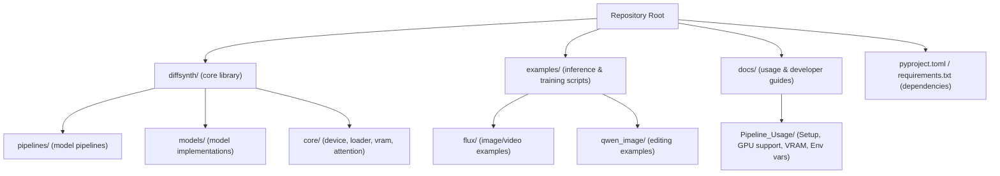
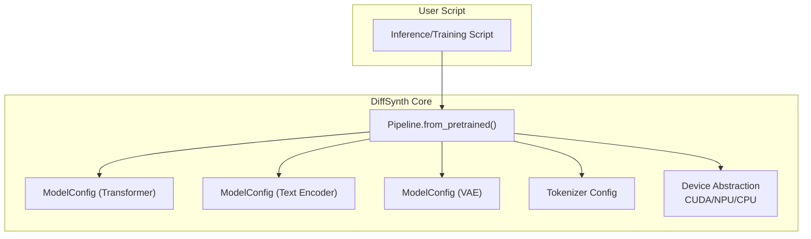

# Getting Started

<cite>
**Referenced Files in This Document**
- [README.md](file://README.md)
- [requirements.txt](file://requirements.txt)
- [setup.py](file://setup.py)
- [pyproject.toml](file://pyproject.toml)
- [docs/en/Pipeline_Usage/Setup.md](file://docs/en/Pipeline_Usage/Setup.md)
- [docs/en/Pipeline_Usage/GPU_support.md](file://docs/en/Pipeline_Usage/GPU_support.md)
- [docs/en/Pipeline_Usage/Environment_Variables.md](file://docs/en/Pipeline_Usage/Environment_Variables.md)
- [docs/en/Pipeline_Usage/VRAM_management.md](file://docs/en/Pipeline_Usage/VRAM_management.md)
- [docs/en/QA.md](file://docs/en/QA.md)
- [examples/flux/model_inference/FLUX.1-dev.py](file://examples/flux/model_inference/FLUX.1-dev.py)
- [examples/qwen_image/model_inference/Qwen-Image-Edit.py](file://examples/qwen_image/model_inference/Qwen-Image-Edit.py)
- [examples/flux/model_training/train.py](file://examples/flux/model_training/train.py)
- [diffsynth/core/device/npu_compatible_device.py](file://diffsynth/core/device/npu_compatible_device.py)
</cite>

## Table of Contents
1. [Introduction](#introduction)
2. [Project Structure](#project-structure)
3. [Core Components](#core-components)
4. [Architecture Overview](#architecture-overview)
5. [Detailed Component Analysis](#detailed-component-analysis)
6. [Dependency Analysis](#dependency-analysis)
7. [Performance Considerations](#performance-considerations)
8. [Troubleshooting Guide](#troubleshooting-guide)
9. [Conclusion](#conclusion)
10. [Appendices](#appendices)

## Introduction
This guide helps you set up ODTSR-edit quickly for inference, training, and development. It covers environment requirements, dependency installation, configuration options, hardware compatibility (GPU/NPU), step-by-step setup procedures, quick start examples, common issues, and verification steps. The project is built on top of DiffSynth-Studio; use the provided documentation paths to understand how models are loaded and run.

## Project Structure
At a high level:
- Core library code resides under diffsynth/.
- Example scripts for inference and training live under examples/.
- Documentation and usage guides are under docs/.
- Package metadata and dependencies are defined in pyproject.toml and requirements.txt.

[No sources needed since this diagram shows conceptual structure]

## Core Components
- Installation and packaging:
  - Install from source or PyPI as described in the Setup guide.
  - Python version requirement is specified in the project configuration.
- Hardware support:
  - NVIDIA GPU (CUDA), AMD GPU (ROCm), and Ascend NPU are supported with specific instructions.
- Environment variables:
  - Control model download behavior, base path, attention implementation, disk mapping buffer size, and download source.
- VRAM management:
  - CPU offload, FP8 quantization, dynamic VRAM management, and disk offload are available for low-memory setups.

Key references:
- Installation and device setup: [docs/en/Pipeline_Usage/Setup.md](file://docs/en/Pipeline_Usage/Setup.md)
- GPU/NPU support details: [docs/en/Pipeline_Usage/GPU_support.md](file://docs/en/Pipeline_Usage/GPU_support.md)
- Environment variables: [docs/en/Pipeline_Usage/Environment_Variables.md](file://docs/en/Pipeline_Usage/Environment_Variables.md)
- VRAM management strategies: [docs/en/Pipeline_Usage/VRAM_management.md](file://docs/en/Pipeline_Usage/VRAM_management.md)

**Section sources**
- [docs/en/Pipeline_Usage/Setup.md:1-54](file://docs/en/Pipeline_Usage/Setup.md#L1-L54)
- [docs/en/Pipeline_Usage/GPU_support.md:1-94](file://docs/en/Pipeline_Usage/GPU_support.md#L1-L94)
- [docs/en/Pipeline_Usage/Environment_Variables.md:1-39](file://docs/en/Pipeline_Usage/Environment_Variables.md#L1-L39)
- [docs/en/Pipeline_Usage/VRAM_management.md:1-206](file://docs/en/Pipeline_Usage/VRAM_management.md#L1-L206)

## Architecture Overview
The runtime architecture centers around Pipelines that load multiple ModelConfig components (transformer, text encoders, VAE, tokenizers). Device selection and availability detection are handled by a device abstraction layer supporting CUDA and NPU.

**Diagram sources**
- [examples/flux/model_inference/FLUX.1-dev.py:1-27](file://examples/flux/model_inference/FLUX.1-dev.py#L1-L27)
- [examples/qwen_image/model_inference/Qwen-Image-Edit.py:1-26](file://examples/qwen_image/model_inference/Qwen-Image-Edit.py#L1-L26)
- [diffsynth/core/device/npu_compatible_device.py:1-107](file://diffsynth/core/device/npu_compatible_device.py#L1-L107)

**Section sources**
- [examples/flux/model_inference/FLUX.1-dev.py:1-27](file://examples/flux/model_inference/FLUX.1-dev.py#L1-L27)
- [examples/qwen_image/model_inference/Qwen-Image-Edit.py:1-26](file://examples/qwen_image/model_inference/Qwen-Image-Edit.py#L1-L26)
- [diffsynth/core/device/npu_compatible_device.py:1-107](file://diffsynth/core/device/npu_compatible_device.py#L1-L107)

## Detailed Component Analysis

### Installation and Environment Setup
- Recommended installation from source:
  - Clone the repository and install in editable mode.
- Alternative installation from PyPI:
  - Use pip install diffsynth (may lag behind latest features).
- Python version:
  - Minimum required Python version is specified in the project configuration.
- Optional extras:
  - NPU extras for ARM/x86 and audio-related optional dependencies are available.

Steps:
1. Create a virtual environment with Python >= the minimum required version.
2. Install from source using the editable mode command shown in the Setup guide.
3. For NPU, follow the NPU-specific commands and install CANN as instructed.

Verification:
- After installation, import diffsynth without errors.
- Check device availability via the device abstraction utilities.

**Section sources**
- [docs/en/Pipeline_Usage/Setup.md:1-54](file://docs/en/Pipeline_Usage/Setup.md#L1-L54)
- [pyproject.toml:1-57](file://pyproject.toml#L1-L57)
- [setup.py:1-30](file://setup.py#L1-L30)
- [requirements.txt:1-43](file://requirements.txt#L1-L43)

### Hardware Compatibility (GPU and NPU)
- NVIDIA GPU:
  - Default support; no code changes required for sample scripts.
- AMD GPU:
  - Requires ROCm-enabled torch; most models run without changes.
- Ascend NPU:
  - Requires CANN installation and NPU-specific pip extras.
  - Replace "cuda" with "npu" in your code where applicable.
  - Special environment variables and parameters may be needed for optimal performance.

Verification:
- Use the device abstraction to detect available devices and backends.

**Section sources**
- [docs/en/Pipeline_Usage/GPU_support.md:1-94](file://docs/en/Pipeline_Usage/GPU_support.md#L1-L94)
- [diffsynth/core/device/npu_compatible_device.py:1-107](file://diffsynth/core/device/npu_compatible_device.py#L1-L107)

### Quick Start: Basic Inference
Two simple examples demonstrate running generation tasks:

- FLUX image generation:
  - Load pipeline with ModelConfig entries for transformer, text encoders, and VAE.
  - Generate an image from a prompt and save it.
- Qwen-Image editing:
  - Load pipeline with transformer, text encoder, VAE, and processor config.
  - Generate a base image and then edit it based on a prompt.

Steps:
1. Ensure models are downloaded or configured via environment variables.
2. Run the example script from the examples directory.
3. Verify output images are saved in the working directory.

**Section sources**
- [examples/flux/model_inference/FLUX.1-dev.py:1-27](file://examples/flux/model_inference/FLUX.1-dev.py#L1-L27)
- [examples/qwen_image/model_inference/Qwen-Image-Edit.py:1-26](file://examples/qwen_image/model_inference/Qwen-Image-Edit.py#L1-L26)

### Quick Start: Training
A training script demonstrates setting up a diffusion training module, loading datasets, and launching training tasks.

Steps:
1. Prepare dataset paths and metadata as expected by the UnifiedDataset.
2. Configure model paths/tokenizer paths and training options.
3. Launch training through the accelerator launcher used by the script.

Verification:
- Check logs and saved checkpoints in the output directory.

**Section sources**
- [examples/flux/model_training/train.py:1-194](file://examples/flux/model_training/train.py#L1-L194)

### Configuration Options (Environment Variables)
Control key behaviors via environment variables before importing diffsynth:
- Skip downloads, set model base path, choose attention implementation, adjust disk map buffer size, and select download source.

Best practices:
- Set variables in your shell or within Python prior to imports.
- Use local_model_path or DIFFSYNTH_MODEL_BASE_PATH to manage model storage locations.

**Section sources**
- [docs/en/Pipeline_Usage/Environment_Variables.md:1-39](file://docs/en/Pipeline_Usage/Environment_Variables.md#L1-L39)

### VRAM Management Strategies
For limited VRAM environments:
- CPU Offload: Move non-active components to CPU memory.
- FP8 Quantization: Store parameters in FP8 precision and convert temporarily for computation.
- Dynamic VRAM Management: Automatically split model layers between VRAM and memory based on vram_limit.
- Disk Offload: Lazy-load parameters directly from disk for extreme memory constraints.

Recommendations:
- Prefer sufficient VRAM for best speed.
- If memory is insufficient, use dynamic VRAM management or disk offload depending on available RAM and SSD speed.

**Section sources**
- [docs/en/Pipeline_Usage/VRAM_management.md:1-206](file://docs/en/Pipeline_Usage/VRAM_management.md#L1-L206)

## Dependency Analysis
Core dependencies include PyTorch, torchvision, transformers, safetensors, accelerate, peft, datasets, and others. Additional libraries support super-resolution, training metrics, and online inference.

```mermaid
graph TB
A["diffsynth package"] --> B["torch>=2.0.0"]
A --> C["torchvision"]
A --> D["transformers"]
A --> E["safetensors"]
A --> F["accelerate"]
A --> G["peft"]
A --> H["datasets"]
A --> I["imageio[imageio ffmpeg]"]
A --> J["einops"]
A --> K["sentencepiece"]
A --> L["protobuf"]
A --> M["modelscope"]
A --> N["ftfy"]
A --> O["pandas"]
A --> P["basicsr"]
A --> Q["opencv-python==4.7.0.72"]
A --> R["cupy-cuda12x"]
A --> S["lpips"]
A --> T["lightning"]
A --> U["pyiqa"]
A --> V["clean-fid"]
A --> W["matplotlib"]
A --> X["numpy<2.0.0"]
A --> Y["gradio"]
A --> Z["pillow_heif"]
A --> AA["pynvml"]
A --> AB["qwen_vl_utils"]
A --> AC["dashscope"]
```

**Diagram sources**
- [requirements.txt:1-43](file://requirements.txt#L1-L43)
- [pyproject.toml:1-57](file://pyproject.toml#L1-L57)

**Section sources**
- [requirements.txt:1-43](file://requirements.txt#L1-L43)
- [pyproject.toml:1-57](file://pyproject.toml#L1-L57)

## Performance Considerations
- Attention implementation: Choose among flash_attention variants, sage_attention, xformers, or pure torch based on environment and hardware.
- Precision: BF16 is commonly used; FP8 reduces VRAM but does not accelerate native computation on current hardware.
- VRAM limits: Tune vram_limit to balance speed and memory usage.
- Disk IO: When using disk offload, prefer fast SSDs to minimize latency.

[No sources needed since this section provides general guidance]

## Troubleshooting Guide
Common issues and resolutions:
- Batch size limitations: Larger batch sizes do not guarantee acceleration due to modern optimizations; use multi-GPU or gradient accumulation instead.
- Redundant parameters: Some models contain unused parameters; use find_unused_parameters when necessary.
- FP8 behavior: Native FP8 computation is not enabled; FP8 here reduces VRAM only.
- NPU specifics: Replace "cuda" with "npu", set environment variables like expandable_segments and CPU affinity, and enable model-specific flags if required.

Verification tips:
- Confirm device availability and backend selection via device utilities.
- Validate model downloads and paths using environment variables.

**Section sources**
- [docs/en/QA.md:1-36](file://docs/en/QA.md#L1-L36)
- [docs/en/Pipeline_Usage/GPU_support.md:1-94](file://docs/en/Pipeline_Usage/GPU_support.md#L1-L94)

## Conclusion
You now have the essentials to install ODTSR-edit, configure your environment, run inference and training, and optimize for your hardware. Use the provided examples and documentation links to explore advanced features like VRAM management and NPU acceleration.

[No sources needed since this section summarizes without analyzing specific files]

## Appendices

### Verification Checklist
- Import diffsynth successfully.
- Detect device type and backend correctly.
- Run a basic inference example and confirm output file creation.
- For training, verify logs and checkpoint outputs.

[No sources needed since this section provides general guidance]