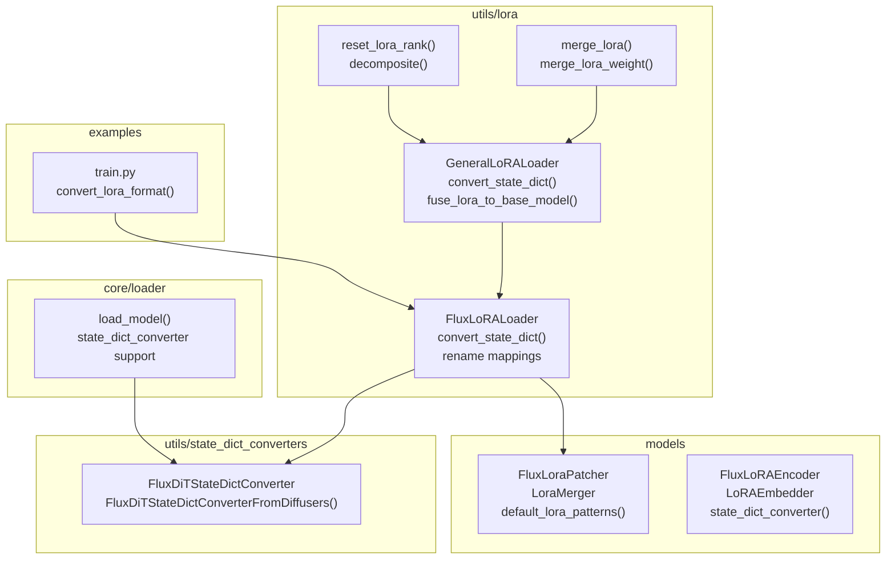
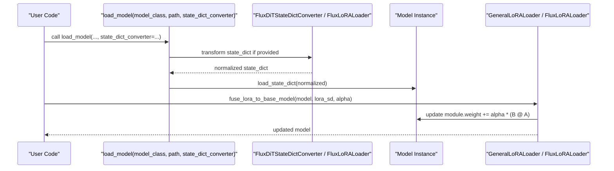
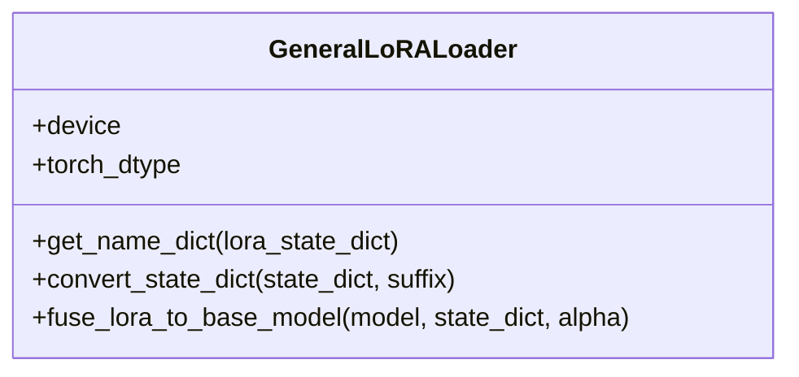
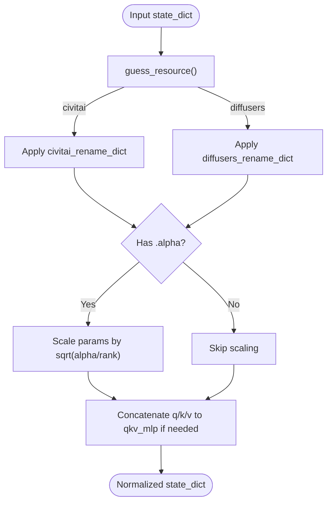
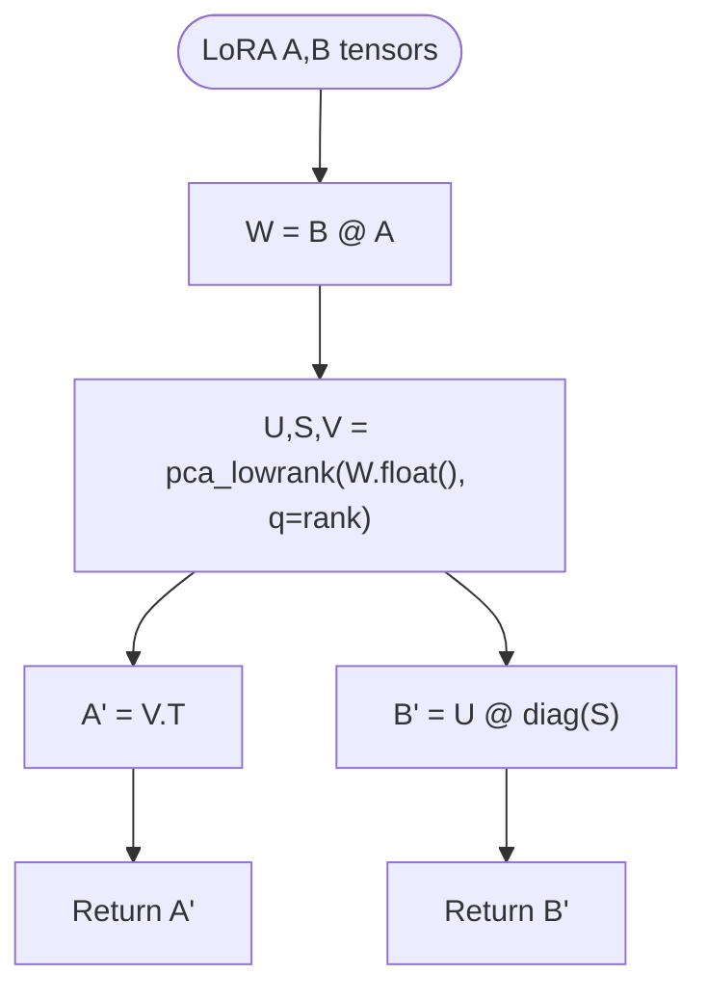
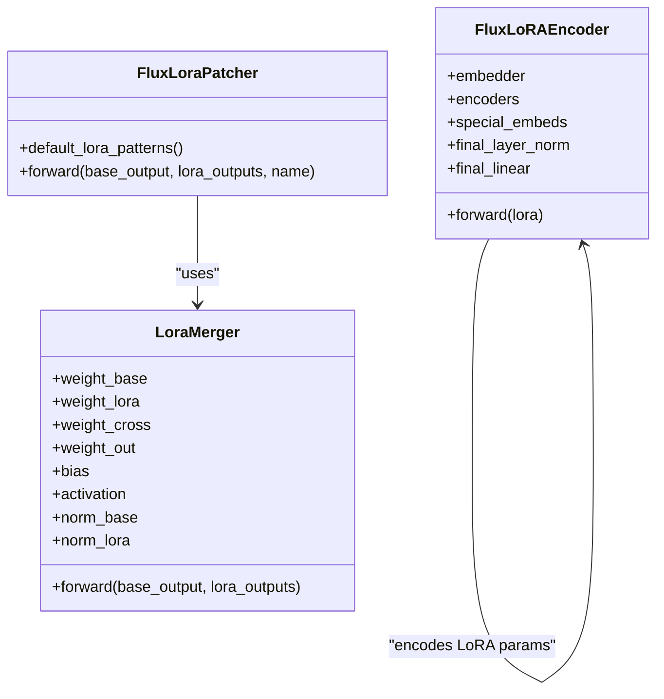
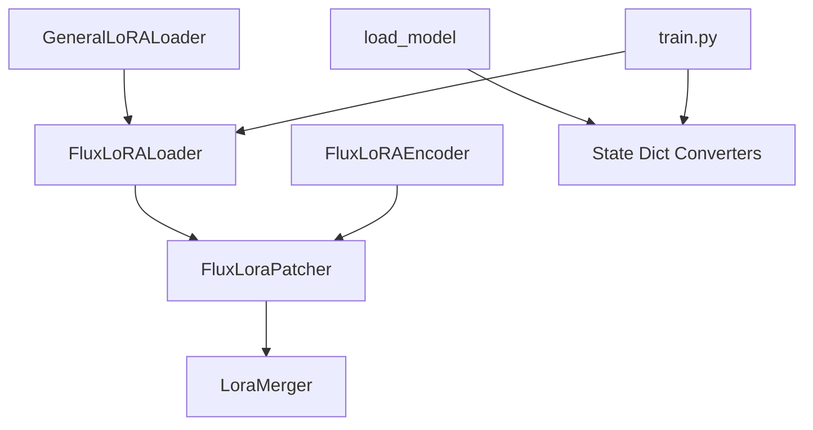

# Custom LoRA Development

<cite>
**Referenced Files in This Document**
- [__init__.py](file://diffsynth/utils/lora/__init__.py)
- [general.py](file://diffsynth/utils/lora/general.py)
- [flux.py](file://diffsynth/utils/lora/flux.py)
- [reset_rank.py](file://diffsynth/utils/lora/reset_rank.py)
- [merge.py](file://diffsynth/utils/lora/merge.py)
- [model.py](file://diffsynth/core/loader/model.py)
- [flux_lora_patcher.py](file://diffsynth/models/flux_lora_patcher.py)
- [flux_lora_encoder.py](file://diffsynth/models/flux_lora_encoder.py)
- [flux_dit.py](file://diffsynth/utils/state_dict_converters/flux_dit.py)
- [train.py](file://examples/flux/model_training/train.py)
</cite>

## Table of Contents
1. Introduction
2. Project Structure
3. Core Components
4. Architecture Overview
5. Detailed Component Analysis
6. Dependency Analysis
7. Performance Considerations
8. Troubleshooting Guide
9. Conclusion
10. Appendices

## Introduction
This document explains how to develop custom Low-Rank Adaptation (LoRA) modules and extensions within ODTSR-edit. It covers:
- Creating custom LoRA modules for new model architectures
- Implementing custom attention mechanisms with LoRA hooks
- Integrating with existing loaders, converters, and pipelines
- Using the LoRA registration system and state dictionary conversion utilities
- Adapting pretrained adapters via the reset_rank utility
- Testing strategies, debugging techniques, and performance profiling

The guidance is grounded in the repository’s LoRA utilities, model patchers, and training examples.

## Project Structure
ODTSR-edit organizes LoRA-related functionality across several modules:
- utils/lora: Generic loader, merging, and rank utilities; Flux-specific converter and loader
- models: Flux LoRA patcher and encoder components
- core/loader: Model loading pipeline supporting state dict converters
- utils/state_dict_converters: Model-specific state dict transformations
- examples: Training scripts demonstrating LoRA usage and format alignment

**Diagram sources**
- [general.py](file://diffsynth/utils/lora/general.py)
- [flux.py](file://diffsynth/utils/lora/flux.py)
- [merge.py](file://diffsynth/utils/lora/merge.py)
- [reset_rank.py](file://diffsynth/utils/lora/reset_rank.py)
- [flux_lora_patcher.py](file://diffsynth/models/flux_lora_patcher.py)
- [flux_lora_encoder.py](file://diffsynth/models/flux_lora_encoder.py)
- [flux_dit.py](file://diffsynth/utils/state_dict_converters/flux_dit.py)
- [train.py](file://examples/flux/model_training/train.py)

**Section sources**
- [__init__.py](file://diffsynth/utils/lora/__init__.py)
- [general.py](file://diffsynth/utils/lora/general.py)
- [flux.py](file://diffsynth/utils/lora/flux.py)
- [merge.py](file://diffsynth/utils/lora/merge.py)
- [reset_rank.py](file://diffsynth/utils/lora/reset_rank.py)
- [model.py](file://diffsynth/core/loader/model.py)
- [flux_lora_patcher.py](file://diffsynth/models/flux_lora_patcher.py)
- [flux_lora_encoder.py](file://diffsynth/models/flux_lora_encoder.py)
- [flux_dit.py](file://diffsynth/utils/state_dict_converters/flux_dit.py)
- [train.py](file://examples/flux/model_training/train.py)

## Core Components
- GeneralLoRALoader: Provides a generic interface to parse LoRA keys, convert between naming conventions, and fuse LoRA weights into base model layers.
- FluxLoRALoader: Extends the general loader with Diffusers/Civitai-to-internal mapping and alpha handling for Flux-style LoRA.
- merge_lora: Concatenates multiple LoRA weight sets along appropriate dimensions to produce a unified adapter.
- reset_lora_rank: Decomposes merged LoRA matrices using low-rank approximation to adjust ranks or adapt pretrained adapters.
- FluxLoraPatcher and FluxLoRAEncoder: Provide dynamic LoRA fusion patterns and an encoder that embeds LoRA parameters for advanced control.
- State Dict Converters: Transform external formats (e.g., Diffusers, Civitai) into internal representations expected by loaders and models.
- Model Loader Integration: load_model supports passing state_dict_converter to transform weights before loading.

**Section sources**
- [general.py](file://diffsynth/utils/lora/general.py)
- [flux.py](file://diffsynth/utils/lora/flux.py)
- [merge.py](file://diffsynth/utils/lora/merge.py)
- [reset_rank.py](file://diffsynth/utils/lora/reset_rank.py)
- [flux_lora_patcher.py](file://diffsynth/models/flux_lora_patcher.py)
- [flux_lora_encoder.py](file://diffsynth/models/flux_lora_encoder.py)
- [flux_dit.py](file://diffsynth/utils/state_dict_converters/flux_dit.py)
- [model.py](file://diffsynth/core/loader/model.py)

## Architecture Overview
The LoRA ecosystem integrates three main phases:
- Loading: load_model accepts a state_dict_converter to normalize external formats.
- Conversion: FluxLoRALoader.convert_state_dict maps source naming schemes to internal names and handles alpha scaling.
- Fusion: GeneralLoRALoader.fuse_lora_to_base_model applies LoRA updates to target modules.

**Diagram sources**
- [model.py](file://diffsynth/core/loader/model.py)
- [flux_dit.py](file://diffsynth/utils/state_dict_converters/flux_dit.py)
- [flux.py](file://diffsynth/utils/lora/flux.py)
- [general.py](file://diffsynth/utils/lora/general.py)

## Detailed Component Analysis

### GeneralLoRALoader
Responsibilities:
- Parse LoRA key naming conventions (.lora_A/.lora_B or .lora_down/.lora_up).
- Normalize state dicts to internal naming.
- Fuse LoRA weights into base model layers by computing alpha*(B@A) and adding to module.weight.

Key methods:
- get_name_dict: Maps target module names to LoRA A/B keys.
- convert_state_dict: Converts legacy alpha fields and standardizes suffixes.
- fuse_lora_to_base_model: Applies LoRA updates to matching modules.

Complexity considerations:
- Matrix multiplication B@A per matched layer; O(d*r) where d,r are inner dims.
- Handling 4D kernels by squeezing spatial dims before matmul.

**Diagram sources**
- [general.py](file://diffsynth/utils/lora/general.py)

**Section sources**
- [general.py](file://diffsynth/utils/lora/general.py)

### FluxLoRALoader and FluxLoRAConverter
Responsibilities:
- Detect source format (Diffusers vs Civitai) and apply rename mappings.
- Handle alpha inference from .alpha tensors when present.
- Consolidate separate q/k/v projections into combined qkv_mlp where required.
- Provide align_to_opensource_format and align_to_diffsynth_format for cross-format compatibility.

Key behaviors:
- guess_resource: Identifies source naming scheme.
- guess_block_id: Extracts block indices and normalizes placeholders.
- convert_state_dict: Applies renaming, alpha scaling, and concatenation logic.
- FluxLoRAConverter.align_to_opensource_format: Produces open-source compatible naming and alpha entries.

**Diagram sources**
- [flux.py](file://diffsynth/utils/lora/flux.py)

**Section sources**
- [flux.py](file://diffsynth/utils/lora/flux.py)

### Merge Utilities
Purpose:
- Combine multiple LoRA checkpoints into a single adapter by concatenating A matrices along dimension 0 and B matrices along dimension 1.
- Supports alpha weighting during merge.

Usage pattern:
- Collect LoRA dicts with consistent keys.
- Call merge_lora(loras, alpha) to obtain merged A/B pairs.

**Section sources**
- [merge.py](file://diffsynth/utils/lora/merge.py)

### Rank Adjustment Utility
Purpose:
- Adjust LoRA ranks or adapt pretrained adapters by decomposing B@A via PCA low-rank approximation.

Algorithm:
- Compute W = B @ A.
- Use torch.pca_lowrank(W, q=rank) to obtain U,S,V.
- Reconstruct A' = V^T, B' = U @ diag(S).

Use cases:
- Reduce memory footprint by lowering rank.
- Smoothly blend pretrained LoRA into new tasks.

**Diagram sources**
- [reset_rank.py](file://diffsynth/utils/lora/reset_rank.py)

**Section sources**
- [reset_rank.py](file://diffsynth/utils/lora/reset_rank.py)

### FluxLoraPatcher and FluxLoRAEncoder
FluxLoraPatcher:
- Defines default LoRA patterns for blocks and single_blocks.
- Uses LoraMerger to combine base outputs with LoRA outputs via learned gating.

FluxLoRAEncoder:
- Embeds LoRA parameters through LoRALayerBlock and projection heads.
- Encodes embeddings with CLIP-like layers and special tokens.

Integration:
- Patterns define which modules receive LoRA updates and their dimensions.
- Encoder can be used for downstream tasks like LoRA conditioning or selection.

**Diagram sources**
- [flux_lora_patcher.py](file://diffsynth/models/flux_lora_patcher.py)
- [flux_lora_encoder.py](file://diffsynth/models/flux_lora_encoder.py)

**Section sources**
- [flux_lora_patcher.py](file://diffsynth/models/flux_lora_patcher.py)
- [flux_lora_encoder.py](file://diffsynth/models/flux_lora_encoder.py)

### State Dict Converters
FluxDiTStateDictConverter:
- Renames keys from various sources to internal naming.
- Handles special concatenations (e.g., final_norm_out.linear) and qkv consolidation.

FluxDiTStateDictConverterFromDiffusers:
- Translates Diffusers naming to internal representation.
- Performs necessary tensor operations to match expected shapes.

Usage:
- Pass converter to load_model via state_dict_converter parameter.

**Section sources**
- [flux_dit.py](file://diffsynth/utils/state_dict_converters/flux_dit.py)
- [model.py](file://diffsynth/core/loader/model.py)

### Training Integration and Format Alignment
Training script demonstrates:
- Constructing a Flux training module with LoRA configuration.
- Optional alignment to open-source format via convert_lora_format.
- Logging with state_dict_converter to save aligned checkpoints.

Workflow:
- Initialize pipeline and switch to training mode with LoRA targets.
- Optionally convert saved LoRA weights to open-source naming and include alpha.

**Section sources**
- [train.py](file://examples/flux/model_training/train.py)

## Dependency Analysis
LoRA components depend on each other as follows:
- FluxLoRALoader extends GeneralLoRALoader.
- FluxLoraPatcher uses LoraMerger and relies on default_lora_patterns.
- FluxLoRAEncoder provides embedding of LoRA parameters.
- load_model integrates state_dict_converter for normalization.
- Training script optionally converts LoRA format for interoperability.

**Diagram sources**
- [general.py](file://diffsynth/utils/lora/general.py)
- [flux.py](file://diffsynth/utils/lora/flux.py)
- [flux_lora_patcher.py](file://diffsynth/models/flux_lora_patcher.py)
- [flux_lora_encoder.py](file://diffsynth/models/flux_lora_encoder.py)
- [model.py](file://diffsynth/core/loader/model.py)
- [train.py](file://examples/flux/model_training/train.py)

**Section sources**
- [general.py](file://diffsynth/utils/lora/general.py)
- [flux.py](file://diffsynth/utils/lora/flux.py)
- [flux_lora_patcher.py](file://diffsynth/models/flux_lora_patcher.py)
- [flux_lora_encoder.py](file://diffsynth/models/flux_lora_encoder.py)
- [model.py](file://diffsynth/core/loader/model.py)
- [train.py](file://examples/flux/model_training/train.py)

## Performance Considerations
- Matrix Multiplication Cost: Fusing LoRA involves B@A per matched layer; choose rank r to balance quality and speed.
- Memory Usage: Lower ranks reduce memory; use reset_lora_rank to compress pretrained LoRA.
- Dtype Handling: Ensure consistent dtypes during conversion and fusion to avoid casting overhead.
- VRAM Management: Use load_model with vram_config and DiskMap for large models; enable offloading where possible.
- Concatenation Overhead: Consolidating q/k/v projections reduces kernel launches but increases memory temporarily.

[No sources needed since this section provides general guidance]

## Troubleshooting Guide
Common issues and resolutions:
- Mismatched Key Names: Verify rename mappings in FluxLoRALoader and state dict converters.
- Alpha Scaling Errors: Check presence of .alpha and ensure correct sqrt scaling.
- Shape Mismatches After Concatenation: Confirm q/k/v consolidation logic matches model expectations.
- DeepSpeed ZeRO Stage 3: Use dedicated loading path in load_model to partition weights correctly.
- Debugging LoRA Application: Count updated modules via print statements in fuse_lora_to_base_model.

**Section sources**
- [model.py](file://diffsynth/core/loader/model.py)
- [flux.py](file://diffsynth/utils/lora/flux.py)
- [general.py](file://diffsynth/utils/lora/general.py)

## Conclusion
ODTSR-edit provides a robust framework for developing and integrating custom LoRA modules:
- Use GeneralLoRALoader as a baseline for new architectures.
- Extend with FluxLoRALoader patterns for complex models like Flux.
- Leverage state dict converters for cross-format compatibility.
- Employ reset_lora_rank to adapt and optimize pretrained adapters.
- Integrate with training pipelines and loaders seamlessly.

[No sources needed since this section summarizes without analyzing specific files]

## Appendices

### Step-by-Step: Implementing a Custom LoRA Type
1. Define target modules and naming conventions for your architecture.
2. Create a loader class extending GeneralLoRALoader:
   - Implement get_name_dict to map target names to A/B keys.
   - Override convert_state_dict if needed for alpha handling or suffix changes.
   - Use fuse_lora_to_base_model to apply updates.
3. If your model has unique structures (e.g., concatenated projections), implement conversion logic similar to FluxLoRALoader.
4. Register state dict converters for external formats.
5. Test with small datasets and verify updated module counts.

**Section sources**
- [general.py](file://diffsynth/utils/lora/general.py)
- [flux.py](file://diffsynth/utils/lora/flux.py)
- [flux_dit.py](file://diffsynth/utils/state_dict_converters/flux_dit.py)

### Step-by-Step: Handling Model-Specific Optimizations
- Identify modules requiring LoRA injection (attention, MLP, norms).
- Determine whether projections should be concatenated (q/k/v -> qkv_mlp).
- Implement alpha scaling based on .alpha or rank normalization.
- Validate shape consistency after conversions.

**Section sources**
- [flux.py](file://diffsynth/utils/lora/flux.py)
- [flux_dit.py](file://diffsynth/utils/state_dict_converters/flux_dit.py)

### Testing Strategies
- Unit tests for convert_state_dict: Verify key renaming and alpha scaling.
- Integration tests for fuse_lora_to_base_model: Check updated module count and output equivalence.
- End-to-end tests with training script: Ensure LoRA checkpoint loads and trains correctly.

**Section sources**
- [train.py](file://examples/flux/model_training/train.py)

### Debugging Techniques
- Print updated_num after fusion to confirm application.
- Inspect intermediate state dicts after conversion steps.
- Use dtype/device checks to catch mismatches early.

**Section sources**
- [general.py](file://diffsynth/utils/lora/general.py)
- [model.py](file://diffsynth/core/loader/model.py)

### Performance Profiling
- Profile matrix multiplications in fuse_lora_to_base_model.
- Measure memory usage before/after rank reduction with reset_lora_rank.
- Benchmark different rank values for quality-speed trade-offs.

[No sources needed since this section provides general guidance]