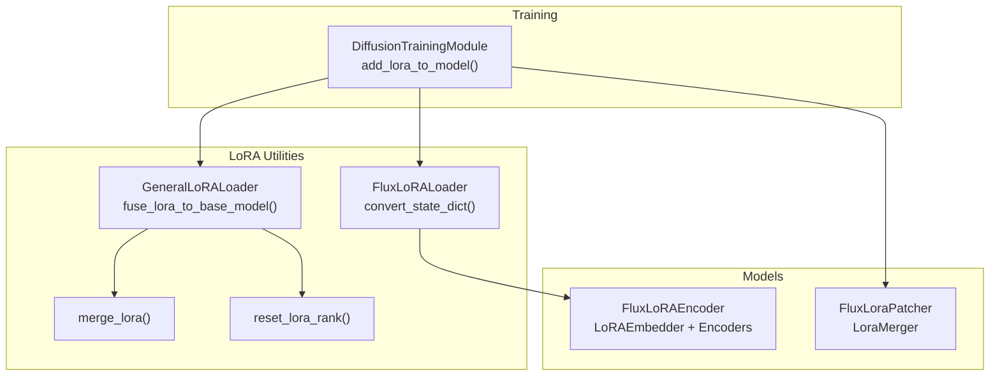
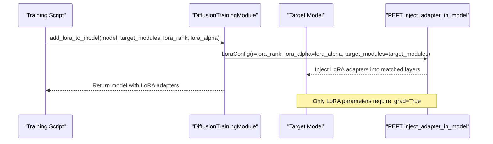
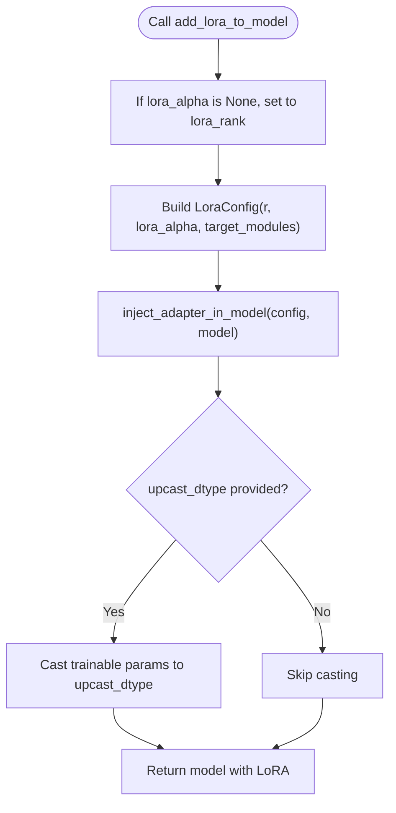
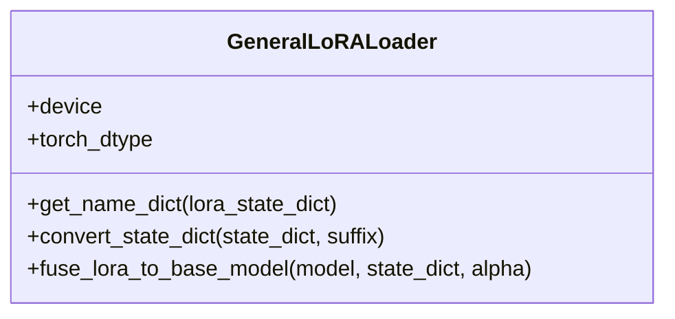
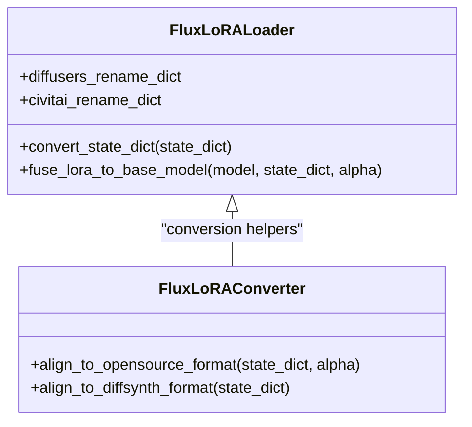
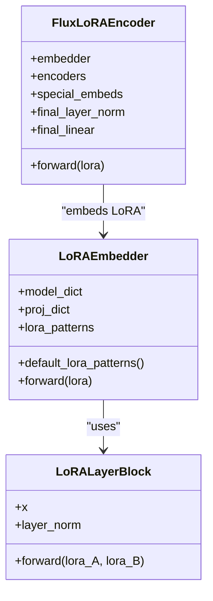
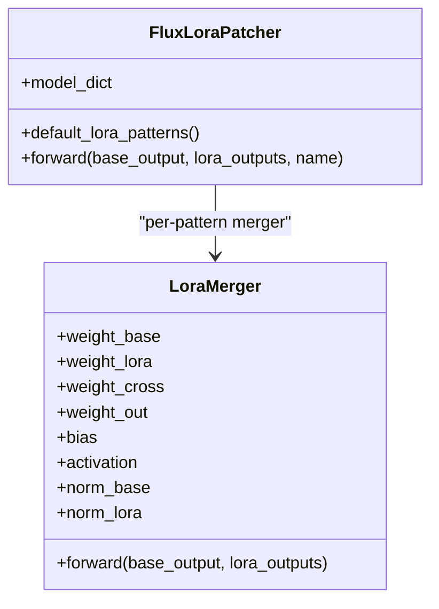
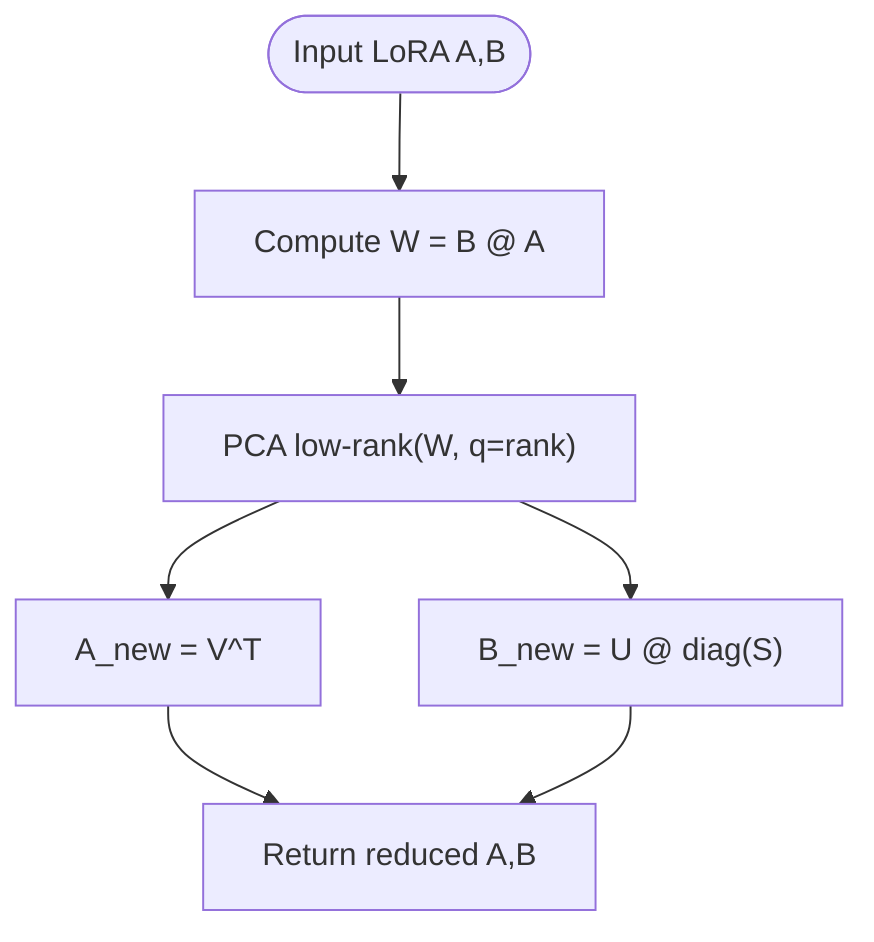
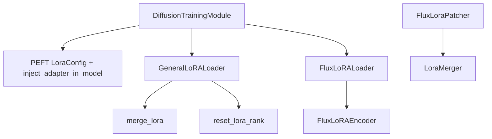

# LoRA Framework and Core Implementation

<cite>
**Referenced Files in This Document**
- [diffusion/training_module.py](file://diffusion/training_module.py)
- [utils/lora/general.py](file://utils/lora/general.py)
- [utils/lora/flux.py](file://utils/lora/flux.py)
- [utils/lora/merge.py](file://utils/lora/merge.py)
- [utils/lora/reset_rank.py](file://utils/lora/reset_rank.py)
- [models/flux_lora_encoder.py](file://models/flux_lora_encoder.py)
- [models/flux_lora_patcher.py](file://models/flux_lora_patcher.py)
</cite>

## Table of Contents
1. [Introduction](#introduction)
2. [Project Structure](#project-structure)
3. [Core Components](#core-components)
4. [Architecture Overview](#architecture-overview)
5. [Detailed Component Analysis](#detailed-component-analysis)
6. [Dependency Analysis](#dependency-analysis)
7. [Performance Considerations](#performance-considerations)
8. [Troubleshooting Guide](#troubleshooting-guide)
9. [Conclusion](#conclusion)
10. [Appendices](#appendices)

## Introduction
This document explains the core Low-Rank Adaptation (LoRA) framework implementation in ODTSR-edit. It covers parameter-efficient fine-tuning principles, rank selection strategies, adapter module design, and integration with PyTorch modules. It also details the forward pass, gradient computation, memory optimization techniques, and provides guidance for creating custom LoRA adapters, configuring rank and alpha parameters, integrating with different model architectures, and best practices for training.

## Project Structure
The LoRA functionality is implemented across utility loaders, patchers, encoders, and training utilities:
- General LoRA loader and fusion utilities
- Flux-specific loaders and converters
- LoRA encoder for embedding-based control
- Training module that injects LoRA via PEFT
- Rank reset and merging utilities

**Diagram sources**
- [diffusion/training_module.py:52-63](file://diffusion/training_module.py#L52-L63)
- [utils/lora/general.py:52-71](file://utils/lora/general.py#L52-L71)
- [utils/lora/flux.py:84-206](file://utils/lora/flux.py#L84-L206)
- [utils/lora/merge.py:11-21](file://utils/lora/merge.py#L11-L21)
- [utils/lora/reset_rank.py:11-20](file://utils/lora/reset_rank.py#L11-L20)
- [models/flux_lora_encoder.py:485-512](file://models/flux_lora_encoder.py#L485-L512)
- [models/flux_lora_patcher.py:273-306](file://models/flux_lora_patcher.py#L273-L306)

**Section sources**
- [diffusion/training_module.py:52-63](file://diffusion/training_module.py#L52-L63)
- [utils/lora/general.py:52-71](file://utils/lora/general.py#L52-L71)
- [utils/lora/flux.py:84-206](file://utils/lora/flux.py#L84-L206)
- [utils/lora/merge.py:11-21](file://utils/lora/merge.py#L11-L21)
- [utils/lora/reset_rank.py:11-20](file://utils/lora/reset_rank.py#L11-L20)
- [models/flux_lora_encoder.py:485-512](file://models/flux_lora_encoder.py#L485-L512)
- [models/flux_lora_patcher.py:273-306](file://models/flux_lora_patcher.py#L273-L306)

## Core Components
- DiffusionTrainingModule.add_lora_to_model: Injects LoRA adapters into a target model using PEFT’s LoraConfig and inject_adapter_in_model. Supports optional upcasting of trainable parameters to a specified dtype.
- GeneralLoRALoader: Provides name mapping and state dict conversion for standard LoRA formats, and fuses LoRA weights into base model weights.
- FluxLoRALoader: Extends general loader with Diffusers/Civitai naming conventions, alpha handling, and concatenation logic for q/k/v projections.
- FluxLoRAEncoder: Embeds LoRA weights through LoRAEmbedder and encodes them into a compact representation used by downstream components.
- merge_lora and reset_lora_rank: Utility functions to merge multiple LoRA checkpoints and reduce rank via PCA low-rank approximation.

Key responsibilities:
- Adapter injection and configuration during training
- State dict conversion and compatibility across sources
- Weight fusion for inference-time merging
- Rank reduction and checkpoint management

**Section sources**
- [diffusion/training_module.py:52-63](file://diffusion/training_module.py#L52-L63)
- [utils/lora/general.py:10-49](file://utils/lora/general.py#L10-L49)
- [utils/lora/flux.py:84-206](file://utils/lora/flux.py#L84-L206)
- [models/flux_lora_encoder.py:427-482](file://models/flux_lora_encoder.py#L427-L482)
- [utils/lora/merge.py:11-21](file://utils/lora/merge.py#L11-L21)
- [utils/lora/reset_rank.py:11-20](file://utils/lora/reset_rank.py#L11-L20)

## Architecture Overview
The LoRA architecture integrates at two levels:
- Training-time injection via PEFT: LoRA adapters are injected into selected target modules; gradients flow only through LoRA parameters.
- Inference-time fusion or dynamic merging: LoRA weights can be fused into base weights or merged dynamically per task.

**Diagram sources**
- [diffusion/training_module.py:52-63](file://diffusion/training_module.py#L52-L63)

## Detailed Component Analysis

### DiffusionTrainingModule LoRA Injection
- Purpose: Configure and inject LoRA adapters into a given model.
- Parameters:
  - target_modules: List or string specifying which modules to patch.
  - lora_rank: Rank r of LoRA matrices A and B.
  - lora_alpha: Scaling factor; defaults to rank if not provided.
  - upcast_dtype: Optional dtype for trainable parameters.
- Behavior:
  - Creates LoraConfig and calls inject_adapter_in_model.
  - Optionally upcasts trainable parameters to specified dtype.
  - Exposes helper methods to map state dicts and export trainable states.

**Diagram sources**
- [diffusion/training_module.py:52-63](file://diffusion/training_module.py#L52-L63)

**Section sources**
- [diffusion/training_module.py:52-63](file://diffusion/training_module.py#L52-L63)

### GeneralLoRALoader and Fusion
- Name mapping: Extracts target module names from LoRA keys and pairs lora_A and lora_B tensors.
- Conversion: Handles deprecated alpha fields and normalizes weight scaling by dividing by rank dimension.
- Fusion: Computes delta = alpha * (B @ A), handles both 2D and 4D cases, and adds delta to base weights.

**Diagram sources**
- [utils/lora/general.py:4-71](file://utils/lora/general.py#L4-L71)

**Section sources**
- [utils/lora/general.py:10-49](file://utils/lora/general.py#L10-L49)
- [utils/lora/general.py:52-71](file://utils/lora/general.py#L52-L71)

### FluxLoRALoader and Converters
- Naming conventions: Maps Diffusers and Civitai LoRA key patterns to internal naming.
- Alpha handling: Detects .alpha entries and computes effective scaling.
- Concatenation logic: Merges separate q/k/v projections into combined qkv_mlp where required.

**Diagram sources**
- [utils/lora/flux.py:5-206](file://utils/lora/flux.py#L5-L206)
- [utils/lora/flux.py:209-303](file://utils/lora/flux.py#L209-L303)

**Section sources**
- [utils/lora/flux.py:84-206](file://utils/lora/flux.py#L84-L206)
- [utils/lora/flux.py:209-303](file://utils/lora/flux.py#L209-L303)

### FluxLoRAEncoder and LoRAEmbedder
- LoRAEmbedder: For each LoRA pattern, multiplies input x with lora_A and lora_B, applies LayerNorm, then projects to a fixed embedding dimension.
- FluxLoRAEncoder: Stacks special embeddings with LoRA embeddings, passes through CLIP-like encoder layers, and outputs a compact representation.

**Diagram sources**
- [models/flux_lora_encoder.py:415-482](file://models/flux_lora_encoder.py#L415-L482)
- [models/flux_lora_encoder.py:485-512](file://models/flux_lora_encoder.py#L485-L512)

**Section sources**
- [models/flux_lora_encoder.py:415-482](file://models/flux_lora_encoder.py#L415-L482)
- [models/flux_lora_encoder.py:485-512](file://models/flux_lora_encoder.py#L485-L512)

### FluxLoraPatcher and LoraMerger
- LoraMerger: Combines base output and multiple LoRA outputs with learned gating and normalization.
- FluxLoraPatcher: Registers mergers for each LoRA pattern and routes base and LoRA outputs accordingly.

**Diagram sources**
- [models/flux_lora_patcher.py:250-306](file://models/flux_lora_patcher.py#L250-L306)

**Section sources**
- [models/flux_lora_patcher.py:250-306](file://models/flux_lora_patcher.py#L250-L306)

### Rank Reset and Merge Utilities
- reset_lora_rank: Decomposes B@A via PCA low-rank approximation to reduce rank while preserving dominant directions.
- merge_lora: Concatenates A matrices along dim=0 and B matrices along dim=1 to combine multiple LoRA checkpoints.

**Diagram sources**
- [utils/lora/reset_rank.py:3-9](file://utils/lora/reset_rank.py#L3-L9)

**Section sources**
- [utils/lora/reset_rank.py:11-20](file://utils/lora/reset_rank.py#L11-L20)
- [utils/lora/merge.py:11-21](file://utils/lora/merge.py#L11-L21)

## Dependency Analysis
LoRA components interact as follows:
- Training module depends on PEFT for adapter injection.
- General and Flux loaders depend on state dict conventions and provide fusion utilities.
- Encoder and patcher modules consume LoRA weights for embedding and dynamic merging.
- Rank reset and merge utilities operate on LoRA checkpoints independently.

**Diagram sources**
- [diffusion/training_module.py:52-63](file://diffusion/training_module.py#L52-L63)
- [utils/lora/general.py:52-71](file://utils/lora/general.py#L52-L71)
- [utils/lora/flux.py:84-206](file://utils/lora/flux.py#L84-L206)
- [models/flux_lora_encoder.py:485-512](file://models/flux_lora_encoder.py#L485-L512)
- [models/flux_lora_patcher.py:273-306](file://models/flux_lora_patcher.py#L273-L306)

**Section sources**
- [diffusion/training_module.py:52-63](file://diffusion/training_module.py#L52-L63)
- [utils/lora/general.py:52-71](file://utils/lora/general.py#L52-L71)
- [utils/lora/flux.py:84-206](file://utils/lora/flux.py#L84-L206)
- [models/flux_lora_encoder.py:485-512](file://models/flux_lora_encoder.py#L485-L512)
- [models/flux_lora_patcher.py:273-306](file://models/flux_lora_patcher.py#L273-L306)

## Performance Considerations
- Parameter efficiency: Only LoRA matrices (A and B) are trained, significantly reducing VRAM and compute compared to full fine-tuning.
- Dtype upcasting: Use upcast_dtype for trainable parameters to improve numerical stability without increasing overall memory footprint.
- Fusion vs dynamic: Fusing LoRA into base weights reduces runtime overhead but increases VRAM temporarily; dynamic merging allows switching tasks without reloading weights.
- Rank selection: Lower ranks reduce memory and compute but may limit capacity; higher ranks increase expressiveness at higher cost.
- Memory optimization: Utilize offloading and FP8 modes when available; clear parameters after use to free VRAM.

[No sources needed since this section provides general guidance]

## Troubleshooting Guide
- Key mismatch warnings: When loading LoRA checkpoints, unexpected keys indicate naming mismatches; ensure correct converter/loader is used.
- Alpha handling: Deprecated alpha fields are normalized by rank dimension; verify scaling behavior matches expectations.
- Target module detection: If no LoRA targets are found, auto-detection may need adjustment; specify target_modules explicitly.
- Fusion errors: Ensure tensor shapes match expected dimensions (2D vs 4D) before fusion; squeeze unnecessary dims if needed.

**Section sources**
- [diffusion/training_module.py:247-254](file://diffusion/training_module.py#L247-L254)
- [utils/lora/general.py:44-46](file://utils/lora/general.py#L44-L46)
- [utils/lora/general.py:60-68](file://utils/lora/general.py#L60-L68)

## Conclusion
ODTSR-edit’s LoRA framework provides robust support for parameter-efficient fine-tuning through PEFT integration, flexible state dict conversion, and efficient weight fusion. The modular design enables easy extension to new architectures and supports advanced features like dynamic merging and rank reduction. Proper configuration of rank, alpha, and target modules ensures optimal performance and memory usage.

[No sources needed since this section summarizes without analyzing specific files]

## Appendices

### Best Practices for LoRA Training
- Learning rate scheduling: Use cosine or linear warmup schedules; start with moderate learning rates (e.g., 1e-4 to 5e-4).
- Weight decay: Apply small weight decay (e.g., 1e-2) to LoRA parameters to prevent overfitting.
- Regularization: Consider dropout within LoRA layers if supported; otherwise rely on data augmentation and early stopping.
- Gradient accumulation: Use gradient accumulation to simulate larger batch sizes when VRAM is limited.
- Mixed precision: Enable mixed precision training and upcast trainable parameters to fp32/bf16 for stability.

[No sources needed since this section provides general guidance]