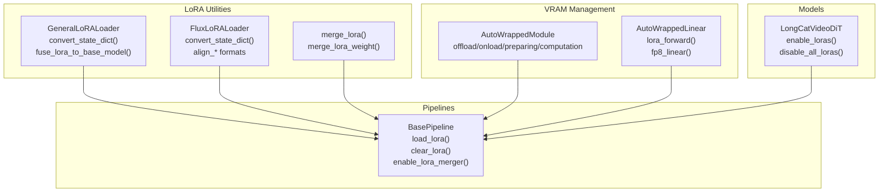
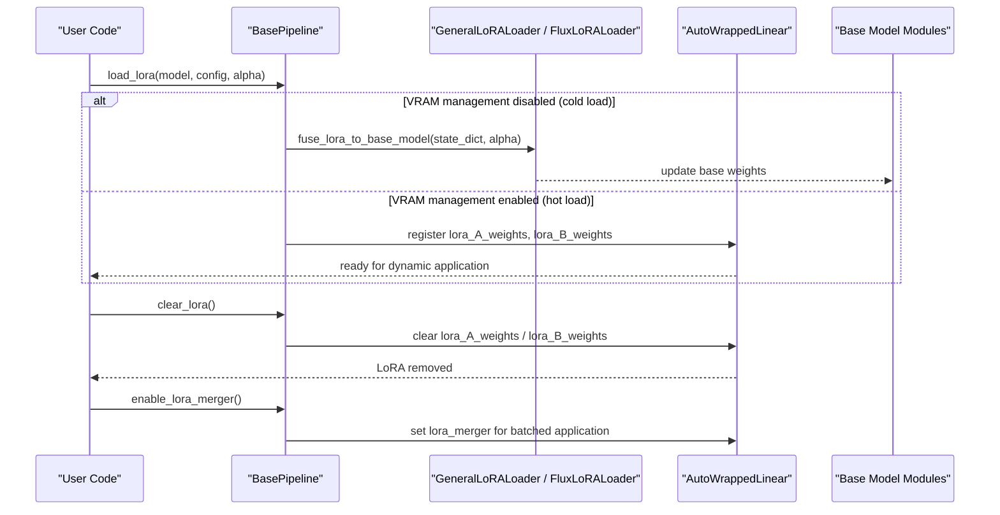
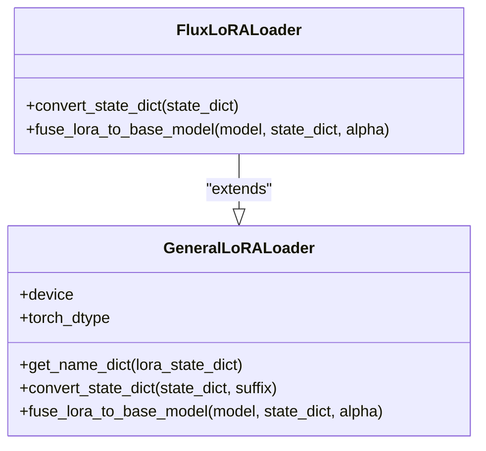
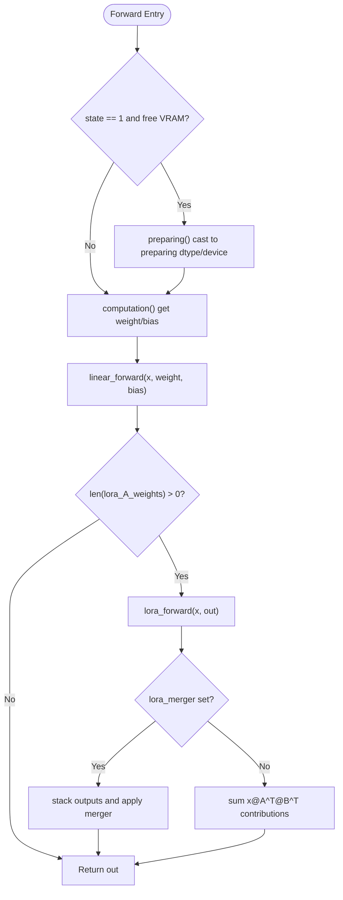
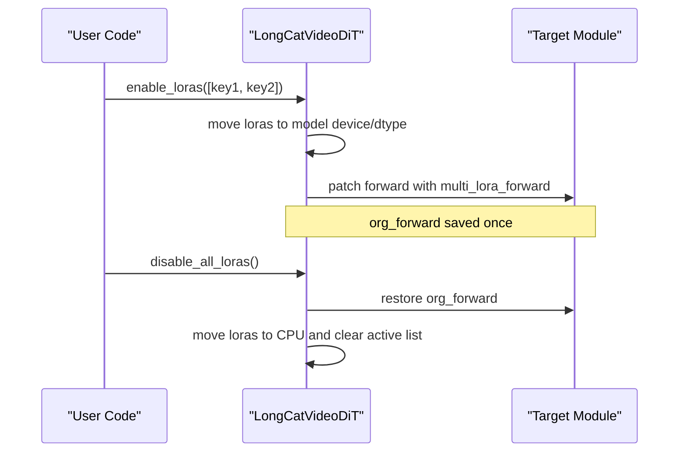
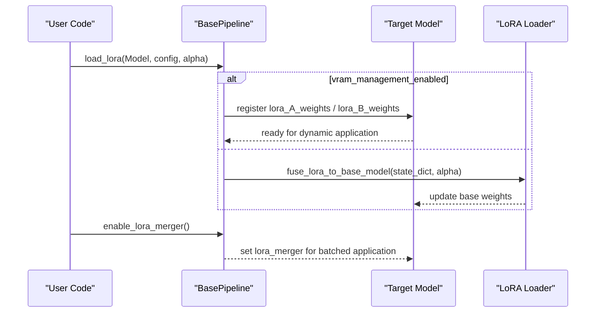
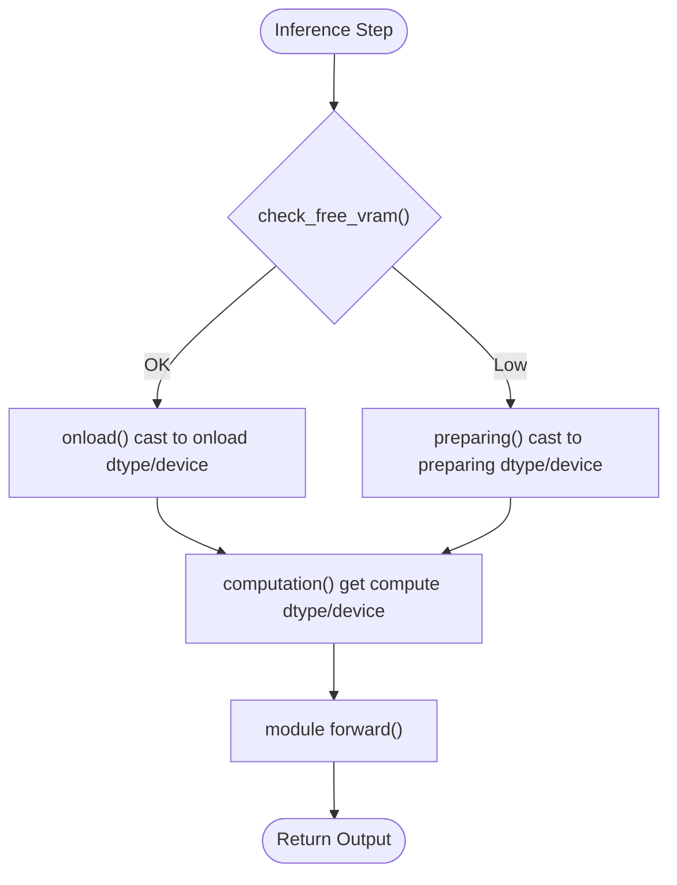
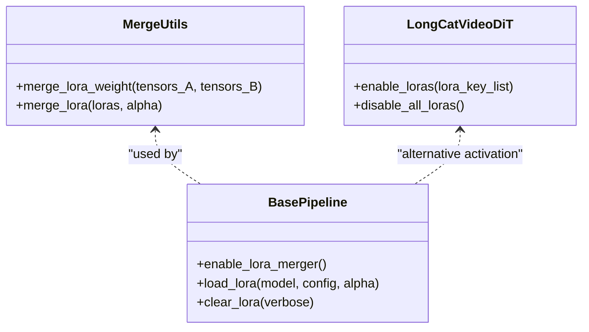
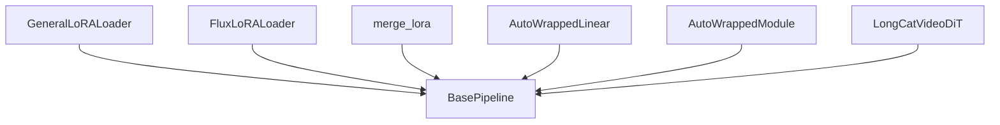

# LoRA Inference and Deployment

<cite>
**Referenced Files in This Document**
- [base_pipeline.py](file://diffsynth/diffusion/base_pipeline.py)
- [general.py](file://diffsynth/utils/lora/general.py)
- [flux.py](file://diffsynth/utils/lora/flux.py)
- [merge.py](file://diffsynth/utils/lora/merge.py)
- [layers.py](file://diffsynth/core/vram/layers.py)
- [longcat_video_dit.py](file://diffsynth/models/longcat_video_dit.py)
- [FLUX.1-dev-LoRA-Fusion.py](file://examples/flux/model_inference/FLUX.1-dev-LoRA-Fusion.py)
- [FLUX.1-dev-LoRA-Fusion_low_vram.py](file://examples/flux/model_inference_low_vram/FLUX.1-dev-LoRA-Fusion.py)
- [VRAM_management.md](file://docs/en/Pipeline_Usage/VRAM_management.md)
- [QA.md](file://docs/en/QA.md)
</cite>

## Table of Contents
1. [Introduction](#introduction)
2. [Project Structure](#project-structure)
3. [Core Components](#core-components)
4. [Architecture Overview](#architecture-overview)
5. [Detailed Component Analysis](#detailed-component-analysis)
6. [Dependency Analysis](#dependency-analysis)
7. [Performance Considerations](#performance-considerations)
8. [Troubleshooting Guide](#troubleshooting-guide)
9. [Conclusion](#conclusion)
10. [Appendices](#appendices)

## Introduction
This document explains how to perform LoRA inference and deploy LoRA-enabled models in ODTSR-edit (DiffSynth). It covers loading and applying trained LoRA adapters during inference, dynamic switching between different LoRA weights, memory optimization techniques for low VRAM environments, integration with various pipelines and model types, handling multiple LoRA combinations, runtime parameter adjustment, production deployment patterns, concurrency, and troubleshooting common issues such as memory constraints and performance bottlenecks.

## Project Structure
The LoRA functionality is implemented across utility loaders, VRAM management wrappers, and pipeline integration points:
- LoRA utilities provide generic and model-specific loaders and merging tools.
- VRAM management wraps modules to support offloading, dtype/device casting, and optional disk offload.
- Pipelines integrate LoRA loading, activation, and clearing.
- Example scripts demonstrate both standard and low-VRAM inference with LoRA fusion and hot-loading.

**Diagram sources**
- [general.py:1-71](file://diffsynth/utils/lora/general.py#L1-L71)
- [flux.py:1-303](file://diffsynth/utils/lora/flux.py#L1-L303)
- [merge.py:1-21](file://diffsynth/utils/lora/merge.py#L1-L21)
- [layers.py:1-480](file://diffsynth/core/vram/layers.py#L1-L480)
- [base_pipeline.py:61-94](file://diffsynth/diffusion/base_pipeline.py#L61-L94)
- [base_pipeline.py:277-305](file://diffsynth/diffusion/base_pipeline.py#L277-L305)
- [longcat_video_dit.py:697-756](file://diffsynth/models/longcat_video_dit.py#L697-L756)

**Section sources**
- [base_pipeline.py:61-94](file://diffsynth/diffusion/base_pipeline.py#L61-L94)
- [base_pipeline.py:277-305](file://diffsynth/diffusion/base_pipeline.py#L277-L305)
- [general.py:1-71](file://diffsynth/utils/lora/general.py#L1-L71)
- [flux.py:1-303](file://diffsynth/utils/lora/flux.py#L1-L303)
- [merge.py:1-21](file://diffsynth/utils/lora/merge.py#L1-L21)
- [layers.py:1-480](file://diffsynth/core/vram/layers.py#L1-L480)
- [longcat_video_dit.py:697-756](file://diffsynth/models/longcat_video_dit.py#L697-L756)

## Core Components
- GeneralLoRALoader: Converts state dicts from various formats into a unified naming scheme and fuses LoRA weights into base model parameters when cold-loading.
- FluxLoRALoader: Extends the general loader with format alignment for FLUX-style checkpoints (e.g., diffusers/Civitai naming), alpha handling, and concatenation logic for QKV/MLP projections.
- merge_lora: Concatenates multiple LoRA A/B weight tensors to produce a single merged LoRA set for efficient application.
- AutoWrappedLinear/AutoWrappedModule: Wraps modules to enable dynamic dtype/device casting, VRAM-aware preloading, and optional disk offload; includes an optimized lora_forward path that applies one or more LoRA adapters without modifying base weights.
- BasePipeline: Provides load_lora(), clear_lora(), and enable_lora_merger() to integrate LoRA into pipelines, supporting both cold-fusion and hot-loading modes depending on VRAM management configuration.
- LongCatVideoDiT: Demonstrates multi-LoRA activation at runtime by patching module forward functions and summing LoRA outputs.

**Section sources**
- [general.py:1-71](file://diffsynth/utils/lora/general.py#L1-L71)
- [flux.py:1-303](file://diffsynth/utils/lora/flux.py#L1-L303)
- [merge.py:1-21](file://diffsynth/utils/lora/merge.py#L1-L21)
- [layers.py:271-436](file://diffsynth/core/vram/layers.py#L271-L436)
- [base_pipeline.py:277-305](file://diffsynth/diffusion/base_pipeline.py#L277-L305)
- [longcat_video_dit.py:697-756](file://diffsynth/models/longcat_video_dit.py#L697-L756)

## Architecture Overview
LoRA inference can operate in two modes:
- Cold Loading (fusion): LoRA weights are fused into base model parameters for maximum speed; cannot be cleared dynamically.
- Hot Loading (dynamic): LoRA weights remain separate and are applied per-forward via wrapped modules; supports dynamic switching and unloading.

**Diagram sources**
- [base_pipeline.py:277-305](file://diffsynth/diffusion/base_pipeline.py#L277-L305)
- [general.py:52-71](file://diffsynth/utils/lora/general.py#L52-L71)
- [layers.py:417-436](file://diffsynth/core/vram/layers.py#L417-L436)

## Detailed Component Analysis

### GeneralLoRALoader and FluxLoRALoader
- GeneralLoRALoader.convert_state_dict(): Normalizes LoRA keys from different naming conventions (e.g., .lora_up/.lora_down vs .lora_A/.lora_B), handles deprecated alpha fields, and produces standardized keys for downstream use.
- GeneralLoRALoader.fuse_lora_to_base_model(): Computes LoRA deltas (alpha * B @ A) and adds them to base weights; supports both linear and convolutional kernels by reshaping 4D weights.
- FluxLoRALoader.convert_state_dict(): Detects source format (diffusers/Civitai), renames keys accordingly, merges Q/K/V projections into combined tensors, and adjusts alpha scaling.

**Diagram sources**
- [general.py:1-71](file://diffsynth/utils/lora/general.py#L1-L71)
- [flux.py:1-303](file://diffsynth/utils/lora/flux.py#L1-L303)

**Section sources**
- [general.py:1-71](file://diffsynth/utils/lora/general.py#L1-L71)
- [flux.py:1-303](file://diffsynth/utils/lora/flux.py#L1-L303)

### AutoWrappedLinear and VRAM-Aware LoRA Application
- AutoWrappedLinear maintains lists of LoRA A/B weights and applies them in forward via lora_forward(). When a merger is enabled, it stacks intermediate outputs and uses a merger function to combine them efficiently.
- The wrapper supports dtype/device casting for offload/onload/preparing/computation phases and integrates FP8 linear paths when computation_dtype is float8.

**Diagram sources**
- [layers.py:417-436](file://diffsynth/core/vram/layers.py#L417-L436)
- [layers.py:429-436](file://diffsynth/core/vram/layers.py#L429-L436)

**Section sources**
- [layers.py:271-436](file://diffsynth/core/vram/layers.py#L271-L436)

### Multi-LoRA Activation and Dynamic Switching
- LongCatVideoDiT.enable_loras(): Activates a list of LoRA keys, moves their weights to model device/dtype, groups by target module, and patches module.forward to sum LoRA outputs with original forward results.
- disable_all_loras(): Restores original forward functions and moves LoRA weights back to CPU, clearing active flags.

**Diagram sources**
- [longcat_video_dit.py:697-756](file://diffsynth/models/longcat_video_dit.py#L697-L756)

**Section sources**
- [longcat_video_dit.py:697-756](file://diffsynth/models/longcat_video_dit.py#L697-L756)

### Pipeline Integration and LoRA Fusion/Merging
- BasePipeline.load_lora(): Chooses between fusion (cold load) and registration (hot load) based on whether VRAM management is enabled for the target model.
- BasePipeline.clear_lora(): Clears registered LoRA weights from all wrapped modules.
- BasePipeline.enable_lora_merger(): Enables batched LoRA application using a merger function to reduce overhead when multiple LoRAs are active.

**Diagram sources**
- [base_pipeline.py:277-305](file://diffsynth/diffusion/base_pipeline.py#L277-L305)

**Section sources**
- [base_pipeline.py:277-305](file://diffsynth/diffusion/base_pipeline.py#L277-L305)

### Low VRAM Modes and Disk Offload
- VRAM management allows configuring offload/onload/preparing/computation dtypes and devices independently.
- Disk offload enables lazy loading of parameters from disk per layer call, suitable for extreme memory constraints; requires fast SSD.
- Examples show bfloat16 computation with float8 offload to CPU, and setting global vram_limit to constrain GPU usage.

**Diagram sources**
- [layers.py:65-70](file://diffsynth/core/vram/layers.py#L65-L70)
- [layers.py:150-176](file://diffsynth/core/vram/layers.py#L150-L176)
- [VRAM_management.md:139-141](file://docs/en/Pipeline_Usage/VRAM_management.md#L139-L141)

**Section sources**
- [layers.py:1-480](file://diffsynth/core/vram/layers.py#L1-L480)
- [VRAM_management.md:139-141](file://docs/en/Pipeline_Usage/VRAM_management.md#L139-L141)

### Multiple LoRA Combinations and Runtime Adjustment
- merge_lora(): Concatenates multiple LoRA A/B tensors along appropriate dimensions to create a single merged LoRA set; useful for combining effects before application.
- BasePipeline.enable_lora_merger(): Allows batched application of multiple LoRAs through a merger function, reducing repeated matrix multiplications.
- LongCatVideoDiT.enable_loras(): Supports activating multiple LoRA sets simultaneously by patching module forward to sum contributions.

**Diagram sources**
- [merge.py:1-21](file://diffsynth/utils/lora/merge.py#L1-L21)
- [base_pipeline.py:277-305](file://diffsynth/diffusion/base_pipeline.py#L277-L305)
- [longcat_video_dit.py:697-756](file://diffsynth/models/longcat_video_dit.py#L697-L756)

**Section sources**
- [merge.py:1-21](file://diffsynth/utils/lora/merge.py#L1-L21)
- [base_pipeline.py:277-305](file://diffsynth/diffusion/base_pipeline.py#L277-L305)
- [longcat_video_dit.py:697-756](file://diffsynth/models/longcat_video_dit.py#L697-L756)

### Production Deployment Patterns and Concurrency
- Use hot-loading mode with VRAM management for dynamic switching between LoRA adapters per request.
- Enable lora_merger to batch multiple LoRAs efficiently within a single forward pass.
- For concurrent requests, instantiate separate pipeline instances per worker process or thread, each with its own model instance and VRAM-managed modules; avoid sharing mutable state across workers.
- Set vram_limit to cap GPU memory usage and prevent OOM under load.

[No sources needed since this section provides general guidance]

## Dependency Analysis
LoRA components depend on VRAM management wrappers and pipeline integration:
- GeneralLoRALoader and FluxLoRALoader rely on PyTorch tensor operations and state dict parsing.
- AutoWrappedLinear depends on dtype/device casting and optional FP8 linear routines.
- BasePipeline orchestrates loading and clearing, selecting fusion vs registration based on VRAM management flags.
- LongCatVideoDiT demonstrates runtime patching and multi-LoRA summation.

**Diagram sources**
- [general.py:1-71](file://diffsynth/utils/lora/general.py#L1-L71)
- [flux.py:1-303](file://diffsynth/utils/lora/flux.py#L1-L303)
- [merge.py:1-21](file://diffsynth/utils/lora/merge.py#L1-L21)
- [layers.py:271-436](file://diffsynth/core/vram/layers.py#L271-L436)
- [base_pipeline.py:277-305](file://diffsynth/diffusion/base_pipeline.py#L277-L305)
- [longcat_video_dit.py:697-756](file://diffsynth/models/longcat_video_dit.py#L697-L756)

**Section sources**
- [base_pipeline.py:277-305](file://diffsynth/diffusion/base_pipeline.py#L277-L305)
- [layers.py:271-436](file://diffsynth/core/vram/layers.py#L271-L436)

## Performance Considerations
- Prefer cold fusion for maximum throughput when LoRA does not need to be switched frequently; fused weights bypass extra matrix multiplications.
- Use hot-loading with VRAM management when dynamic switching is required; expect slower inference due to per-step LoRA application.
- Enable lora_merger to reduce overhead when applying multiple LoRAs simultaneously.
- Use lower precision offload (e.g., float8) and higher precision computation (e.g., bfloat16) to balance memory and accuracy.
- Set vram_limit to constrain GPU memory and avoid OOM under concurrent workloads.
- For extremely constrained environments, enable disk offload to lazily load parameters per layer call.

[No sources needed since this section provides general guidance]

## Troubleshooting Guide
- Memory constraints:
  - Reduce computation dtype or switch to float8 offload; ensure sufficient CPU/GPU memory headroom.
  - Enable disk offload if VRAM is insufficient even with offload strategies.
  - Set vram_limit to cap memory usage and prevent OOM.
- Performance bottlenecks:
  - If using hot-loading, consider enabling lora_merger to batch LoRA applications.
  - Avoid frequent clear_lora() calls; batch operations where possible.
  - Ensure LoRA keys match target modules; mismatches cause no updates and wasted time.
- Dynamic switching issues:
  - Verify VRAM management is enabled for the base model to allow hot-loading.
  - After disabling LoRAs, confirm org_forward is restored and LoRA weights moved to CPU.

**Section sources**
- [QA.md:30-36](file://docs/en/QA.md#L30-L36)
- [VRAM_management.md:139-141](file://docs/en/Pipeline_Usage/VRAM_management.md#L139-L141)
- [base_pipeline.py:277-305](file://diffsynth/diffusion/base_pipeline.py#L277-L305)
- [layers.py:65-70](file://diffsynth/core/vram/layers.py#L65-L70)

## Conclusion
ODTSR-edit provides robust LoRA inference capabilities through flexible loaders, VRAM-aware wrappers, and pipeline integrations. Users can choose between cold fusion for speed and hot-loading for dynamic switching, leverage merging for multiple LoRAs, and optimize memory with dtype/device configurations and disk offload. Proper configuration and awareness of trade-offs enable efficient deployment in production environments with concurrent requests.

[No sources needed since this section summarizes without analyzing specific files]

## Appendices

### Example Usage: Standard and Low-VRAM LoRA Fusion
- Standard inference with bfloat16 computation and CUDA offload/onload.
- Low-VRAM inference with float8 offload to CPU and bfloat16 computation on CUDA, plus vram_limit to cap GPU memory.

**Section sources**
- [FLUX.1-dev-LoRA-Fusion.py:1-39](file://examples/flux/model_inference/FLUX.1-dev-LoRA-Fusion.py#L1-L39)
- [FLUX.1-dev-LoRA-Fusion_low_vram.py:1-39](file://examples/flux/model_inference_low_vram/FLUX.1-dev-LoRA-Fusion.py#L1-L39)