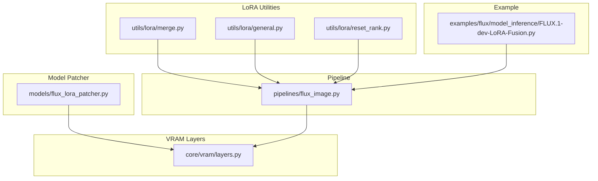
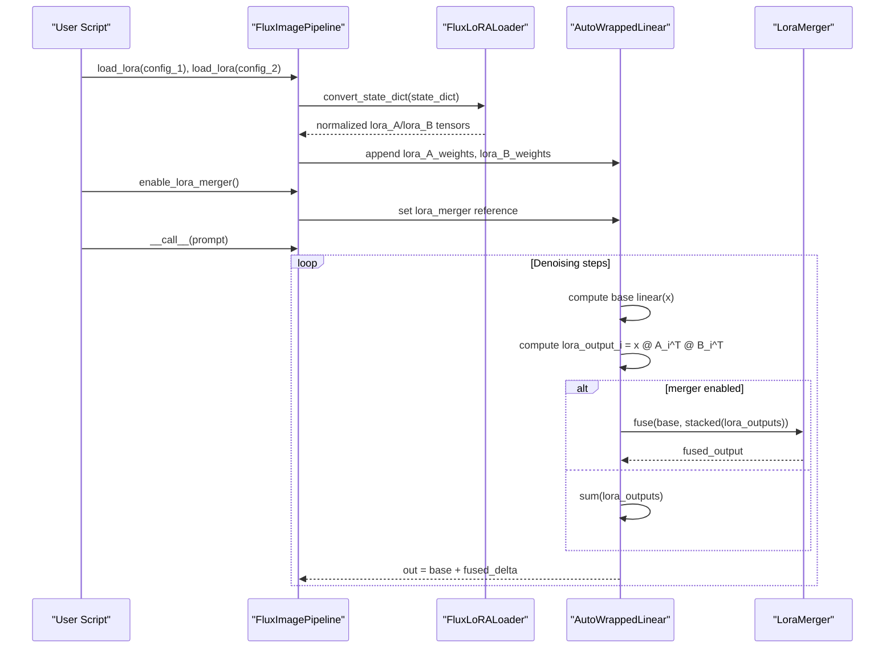
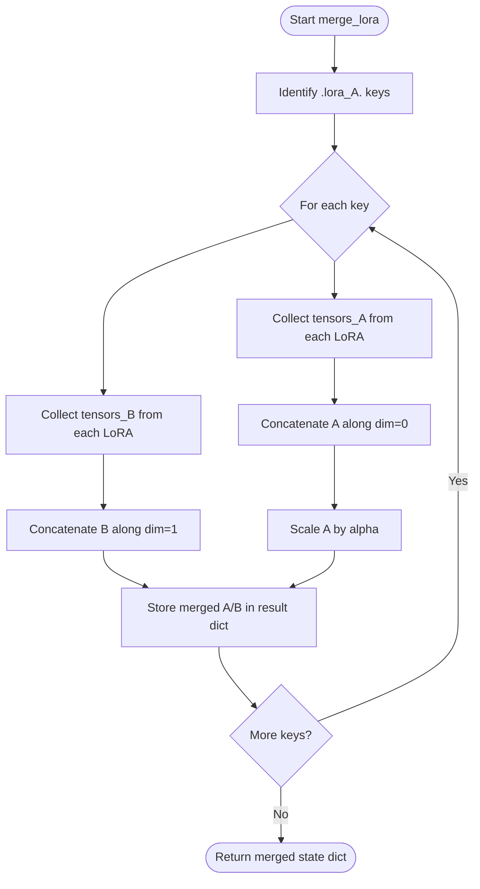
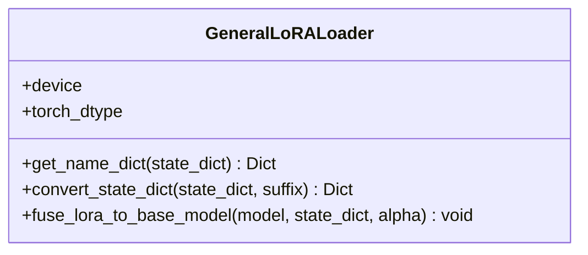
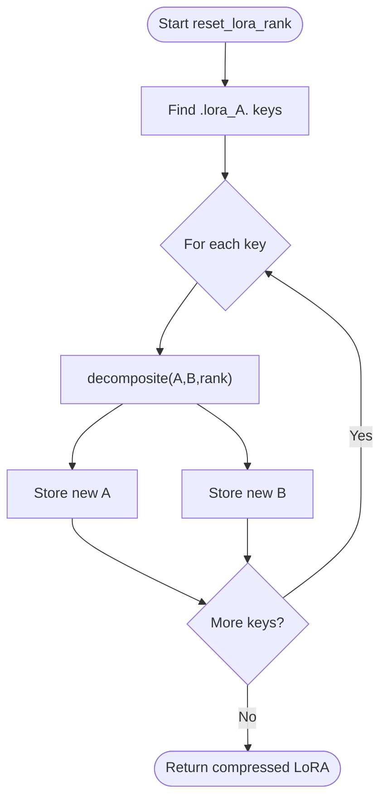
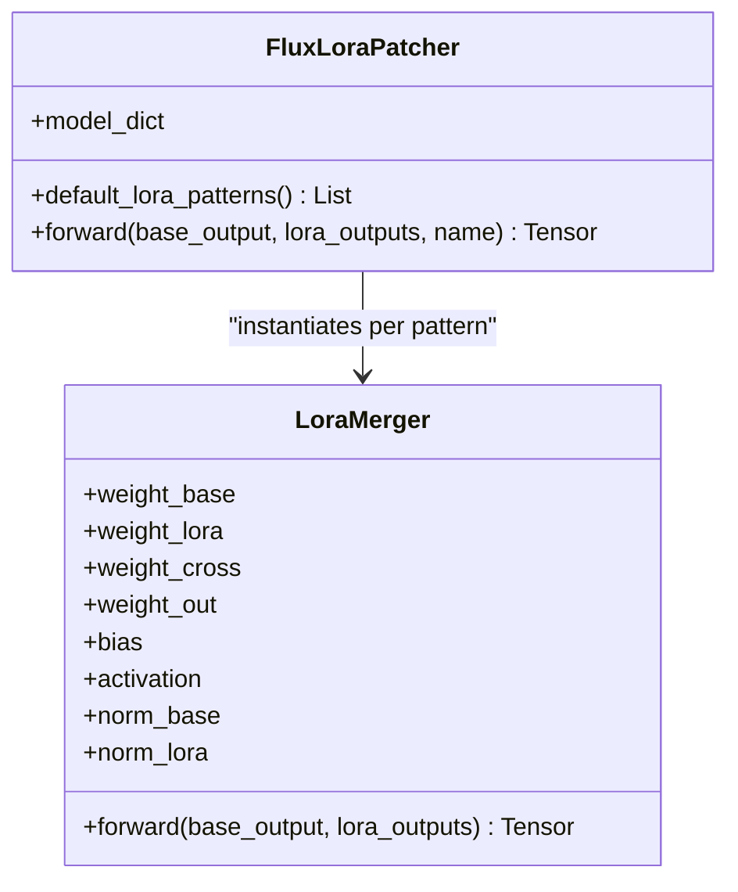
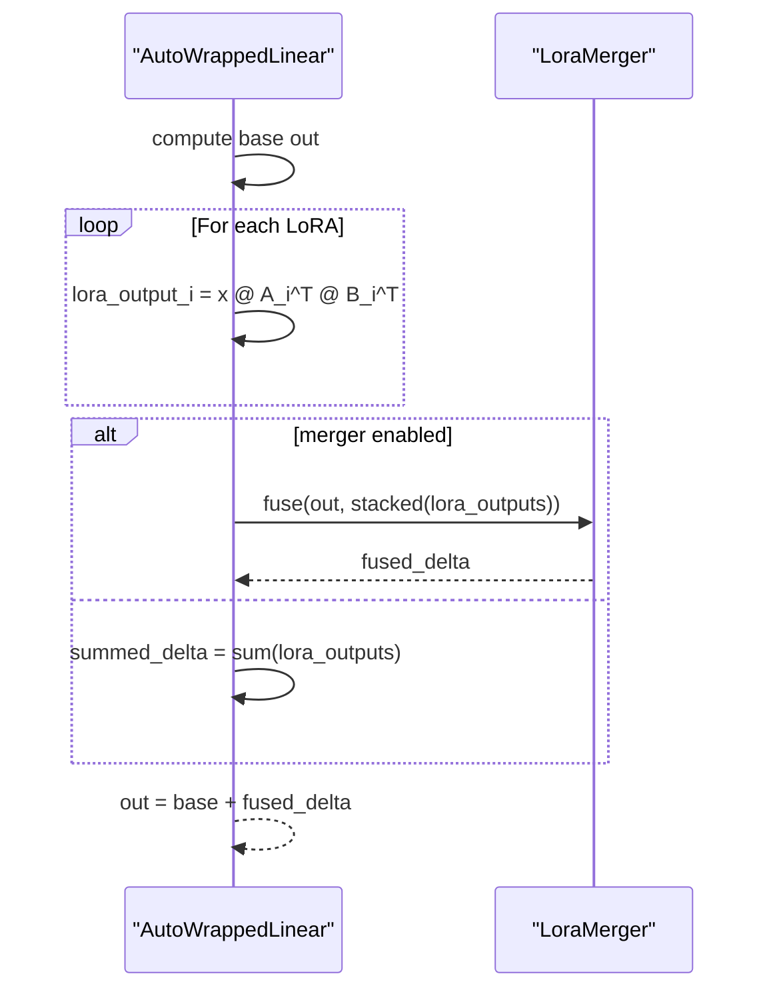
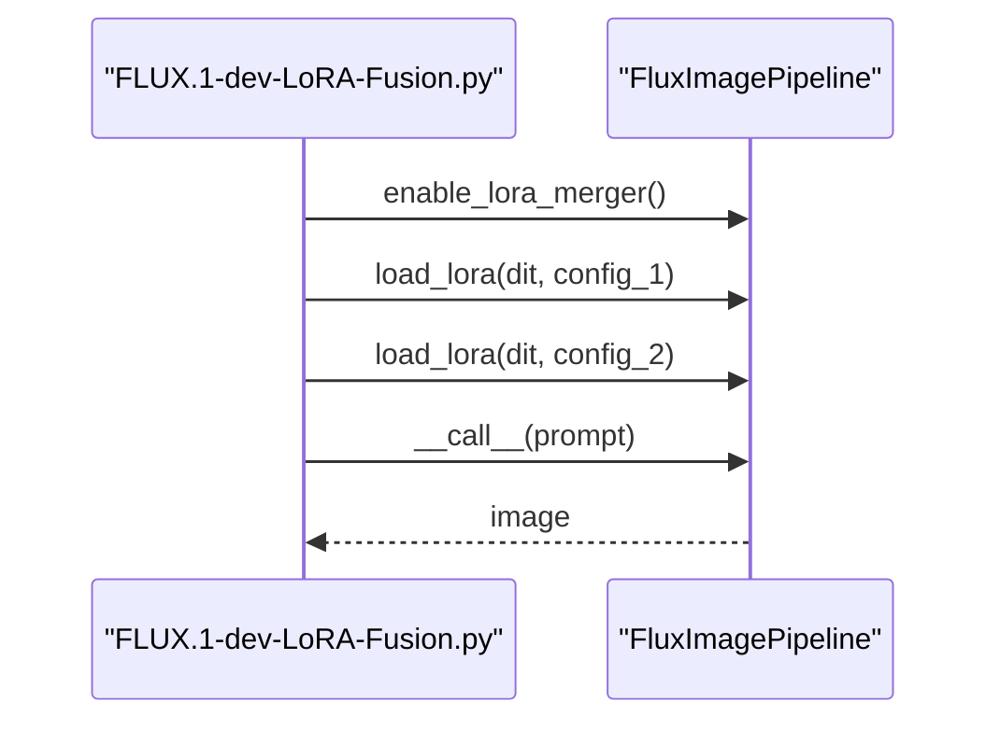
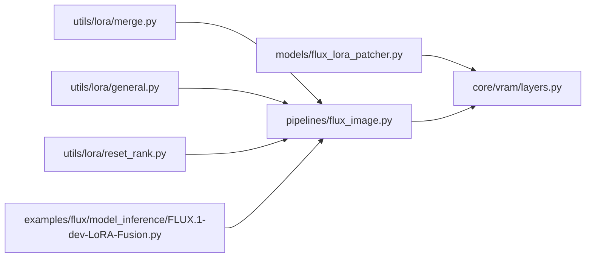

# LoRA Merging and Combination

<cite>
**Referenced Files in This Document**
- [merge.py](file://diffsynth/utils/lora/merge.py)
- [general.py](file://diffsynth/utils/lora/general.py)
- [reset_rank.py](file://diffsynth/utils/lora/reset_rank.py)
- [flux_lora_patcher.py](file://diffsynth/models/flux_lora_patcher.py)
- [layers.py](file://diffsynth/core/vram/layers.py)
- [flux_image.py](file://diffsynth/pipelines/flux_image.py)
- [FLUX.1-dev-LoRA-Fusion.py](file://examples/flux/model_inference/FLUX.1-dev-LoRA-Fusion.py)
</cite>

## Table of Contents
1. [Introduction](#introduction)
2. [Project Structure](#project-structure)
3. [Core Components](#core-components)
4. [Architecture Overview](#architecture-overview)
5. [Detailed Component Analysis](#detailed-component-analysis)
6. [Dependency Analysis](#dependency-analysis)
7. [Performance Considerations](#performance-considerations)
8. [Troubleshooting Guide](#troubleshooting-guide)
9. [Conclusion](#conclusion)

## Introduction
This document explains the LoRA merging capabilities in ODTSR-edit with a focus on both static weight fusion and dynamic runtime fusion. It covers:
- Mathematical foundations of LoRA merging, including weighted averaging and linear combination
- Utility functions for combining multiple LoRA adapters, handling conflicting parameters, and maintaining numerical stability
- Strategies for different use cases such as style blending, feature combination, and multi-task learning
- Practical examples of merging LoRAs from different models, adjusting merge weights, and validating merged results
- Common issues like parameter dimension mismatches and troubleshooting guidance

The implementation supports two complementary approaches:
- Static merging via utility functions that produce a single combined LoRA state dict
- Dynamic merging via a learnable LoraMerger module integrated into VRAM-managed layers at inference time

## Project Structure
LoRA-related functionality is organized under utils/lora and model-specific patchers:
- Utils layer provides general loaders, merging utilities, and rank reset tools
- Model-specific patcher defines a learnable merger used during inference
- Pipelines enable and wire up the merger to VRAM-managed layers
- Example scripts demonstrate end-to-end usage

**Diagram sources**
- [merge.py:1-21](file://diffsynth/utils/lora/merge.py#L1-L21)
- [general.py:1-71](file://diffsynth/utils/lora/general.py#L1-L71)
- [reset_rank.py:1-20](file://diffsynth/utils/lora/reset_rank.py#L1-L20)
- [flux_lora_patcher.py:250-307](file://diffsynth/models/flux_lora_patcher.py#L250-L307)
- [layers.py:300-480](file://diffsynth/core/vram/layers.py#L300-L480)
- [flux_image.py:109-118](file://diffsynth/pipelines/flux_image.py#L109-L118)
- [FLUX.1-dev-LoRA-Fusion.py:1-39](file://examples/flux/model_inference/FLUX.1-dev-LoRA-Fusion.py#L1-L39)

**Section sources**
- [merge.py:1-21](file://diffsynth/utils/lora/merge.py#L1-L21)
- [general.py:1-71](file://diffsynth/utils/lora/general.py#L1-L71)
- [reset_rank.py:1-20](file://diffsynth/utils/lora/reset_rank.py#L1-L20)
- [flux_lora_patcher.py:250-307](file://diffsynth/models/flux_lora_patcher.py#L250-L307)
- [layers.py:300-480](file://diffsynth/core/vram/layers.py#L300-L480)
- [flux_image.py:109-118](file://diffsynth/pipelines/flux_image.py#L109-L118)
- [FLUX.1-dev-LoRA-Fusion.py:1-39](file://examples/flux/model_inference/FLUX.1-dev-LoRA-Fusion.py#L1-L39)

## Core Components
- Static LoRA merging utilities:
  - Concatenation-based merging of A/B matrices across multiple LoRAs
  - Alpha scaling applied to the merged A matrix
- General LoRA loader:
  - Normalizes LoRA state dicts across naming conventions
  - Handles alpha compatibility and converts to internal format
- Rank reset utility:
  - Re-compresses merged LoRA weights using low-rank approximation
- Learnable LoRA merger (runtime):
  - Learns adaptive gating between base output and multiple LoRA outputs
- VRAM-managed layers:
  - Accumulate LoRA contributions per forward pass
  - Optionally apply the learnable merger when enabled

Key responsibilities:
- merge_lora: Combine multiple LoRA state dicts into one
- GeneralLoRALoader.convert_state_dict: Normalize and scale LoRA weights
- reset_lora_rank: Reduce rank of merged LoRA for memory efficiency
- LoraMerger: Adaptive fusion of base and multiple LoRA outputs
- AutoWrappedLinear.lora_forward: Apply LoRA deltas or merged outputs

**Section sources**
- [merge.py:5-20](file://diffsynth/utils/lora/merge.py#L5-L20)
- [general.py:37-49](file://diffsynth/utils/lora/general.py#L37-L49)
- [reset_rank.py:3-20](file://diffsynth/utils/lora/reset_rank.py#L3-L20)
- [flux_lora_patcher.py:250-307](file://diffsynth/models/flux_lora_patcher.py#L250-L307)
- [layers.py:417-427](file://diffsynth/core/vram/layers.py#L417-L427)

## Architecture Overview
The system supports two modes of LoRA combination:

1) Static Merge Mode
- Multiple LoRA state dicts are concatenated along appropriate dimensions
- The merged LoRA is applied as a single delta added to base weights

2) Dynamic Fusion Mode
- Each LoRA produces its own output per layer
- A learnable LoraMerger fuses these outputs with the base output using learned gates and norms

**Diagram sources**
- [flux_image.py:109-118](file://diffsynth/pipelines/flux_image.py#L109-L118)
- [layers.py:417-427](file://diffsynth/core/vram/layers.py#L417-L427)
- [flux_lora_patcher.py:250-307](file://diffsynth/models/flux_lora_patcher.py#L250-L307)

## Detailed Component Analysis

### Static LoRA Merging Utilities
- merge_lora_weight: Concatenates A matrices along dim=0 and B matrices along dim=1
- merge_lora: Iterates over keys, builds lists of A/B tensors, merges them, applies alpha scaling to A
- Behavior:
  - Assumes all LoRAs share the same key structure
  - Produces a single merged LoRA state dict suitable for loading once

Complexity:
- Time: O(N * d_a * r + N * r * d_b) for concatenations and scaling
- Space: O(N * d_a * r + N * r * d_b) for merged tensors

Use cases:
- Style blending by equal-weight concatenation
- Multi-task learning where each task contributes independent subspaces

**Diagram sources**
- [merge.py:5-20](file://diffsynth/utils/lora/merge.py#L5-L20)

**Section sources**
- [merge.py:5-20](file://diffsynth/utils/lora/merge.py#L5-L20)

### General LoRA Loader and Compatibility Handling
- get_name_dict: Maps target names to LoRA A/B keys, handles both “lora_up/lora_down” and “lora_A/lora_B” conventions
- convert_state_dict:
  - Detects legacy alpha fields and rescales down-weight accordingly
  - Outputs standardized keys with suffix “.weight”
- fuse_lora_to_base_model:
  - Computes delta = alpha * (B @ A) and adds to base weights
  - Supports 2D and 4D kernels by squeezing spatial dims

Numerical stability:
- Alpha normalization ensures consistent scaling across ranks
- Dtype/device casting before operations prevents precision loss

**Diagram sources**
- [general.py:4-71](file://diffsynth/utils/lora/general.py#L4-L71)

**Section sources**
- [general.py:10-49](file://diffsynth/utils/lora/general.py#L10-L49)
- [general.py:52-71](file://diffsynth/utils/lora/general.py#L52-L71)

### Rank Reset Utility
- decomposite: Uses PCA low-rank approximation to re-factor merged A/B matrices to a specified rank
- reset_lora_rank: Applies decomposition per key pair

Use cases:
- Post-merge compression to reduce memory footprint
- Stabilizing large merged LoRAs by limiting effective rank

**Diagram sources**
- [reset_rank.py:3-20](file://diffsynth/utils/lora/reset_rank.py#L3-L20)

**Section sources**
- [reset_rank.py:3-20](file://diffsynth/utils/lora/reset_rank.py#L3-L20)

### Learnable LoRA Merger (Runtime Fusion)
- LoraMerger:
  - Normalizes base and stacked LoRA outputs
  - Computes gate via sigmoid of a learned combination
  - Sums gated LoRA outputs and adds to base output
- FluxLoraPatcher:
  - Instantiates a merger per pattern (e.g., attention and FFN modules)
  - Provides default patterns for FLUX architecture

Benefits:
- Adapts fusion per-layer and per-feature channel
- Avoids manual tuning of global alpha; learns optimal blending

**Diagram sources**
- [flux_lora_patcher.py:250-307](file://diffsynth/models/flux_lora_patcher.py#L250-L307)

**Section sources**
- [flux_lora_patcher.py:250-307](file://diffsynth/models/flux_lora_patcher.py#L250-L307)

### VRAM-Managed Layer Integration
- AutoWrappedLinear maintains lists of LoRA A/B weights
- lora_forward:
  - Without merger: sums x @ A^T @ B^T contributions
  - With merger: stacks individual outputs and calls merger
- Pipeline enables merger by attaching the correct merger instance to matching layers

**Diagram sources**
- [layers.py:417-427](file://diffsynth/core/vram/layers.py#L417-L427)

**Section sources**
- [layers.py:300-480](file://diffsynth/core/vram/layers.py#L300-L480)

### Pipeline Usage and Example
- FluxImagePipeline.enable_lora_merger:
  - Requires VRAM management enabled
  - Attaches the corresponding merger to matched layers
- Example script demonstrates enabling merger and loading multiple LoRAs

**Diagram sources**
- [flux_image.py:109-118](file://diffsynth/pipelines/flux_image.py#L109-L118)
- [FLUX.1-dev-LoRA-Fusion.py:27-36](file://examples/flux/model_inference/FLUX.1-dev-LoRA-Fusion.py#L27-L36)

**Section sources**
- [flux_image.py:109-118](file://diffsynth/pipelines/flux_image.py#L109-L118)
- [FLUX.1-dev-LoRA-Fusion.py:1-39](file://examples/flux/model_inference/FLUX.1-dev-LoRA-Fusion.py#L1-L39)

## Dependency Analysis
- merge.py depends only on torch and typing
- general.py depends on torch and warnings
- reset_rank.py depends on torch
- flux_lora_patcher.py imports core loader utilities and defines merger classes
- layers.py integrates merger into VRAM-managed linear layers
- pipelines connect merger instances to layers based on naming patterns

**Diagram sources**
- [merge.py:1-21](file://diffsynth/utils/lora/merge.py#L1-L21)
- [general.py:1-71](file://diffsynth/utils/lora/general.py#L1-L71)
- [reset_rank.py:1-20](file://diffsynth/utils/lora/reset_rank.py#L1-L20)
- [flux_lora_patcher.py:250-307](file://diffsynth/models/flux_lora_patcher.py#L250-L307)
- [layers.py:300-480](file://diffsynth/core/vram/layers.py#L300-L480)
- [flux_image.py:109-118](file://diffsynth/pipelines/flux_image.py#L109-L118)
- [FLUX.1-dev-LoRA-Fusion.py:1-39](file://examples/flux/model_inference/FLUX.1-dev-LoRA-Fusion.py#L1-L39)

**Section sources**
- [merge.py:1-21](file://diffsynth/utils/lora/merge.py#L1-L21)
- [general.py:1-71](file://diffsynth/utils/lora/general.py#L1-L71)
- [reset_rank.py:1-20](file://diffsynth/utils/lora/reset_rank.py#L1-L20)
- [flux_lora_patcher.py:250-307](file://diffsynth/models/flux_lora_patcher.py#L250-L307)
- [layers.py:300-480](file://diffsynth/core/vram/layers.py#L300-L480)
- [flux_image.py:109-118](file://diffsynth/pipelines/flux_image.py#L109-L118)
- [FLUX.1-dev-LoRA-Fusion.py:1-39](file://examples/flux/model_inference/FLUX.1-dev-LoRA-Fusion.py#L1-L39)

## Performance Considerations
- Static merging:
  - Concatenation increases tensor sizes proportionally to the number of LoRAs
  - Suitable when you want to load once and avoid per-step overhead
- Dynamic fusion:
  - Adds per-step computation for stacking and gating
  - Can be more flexible and avoids manual alpha tuning
- Rank reset:
  - Reduces memory and improves cache locality after merging
  - Trade-off: potential information loss if rank is too low
- Numerical stability:
  - Ensure consistent dtype/device casting before matmul
  - Use alpha normalization to prevent overflow/underflow

[No sources needed since this section provides general guidance]

## Troubleshooting Guide
Common issues and resolutions:
- Parameter dimension mismatch:
  - Ensure all LoRAs have compatible shapes for concatenation
  - Verify A matrices align on dim=0 and B matrices on dim=1
- Missing keys or naming differences:
  - Use GeneralLoRALoader.convert_state_dict to normalize naming
  - Check for “lora_up/lora_down” vs “lora_A/lora_B” conventions
- Alpha incompatibility:
  - Legacy alpha fields are detected and handled with warning
  - Confirm expected scaling behavior after conversion
- VRAM management not enabled:
  - enable_lora_merger requires VRAM management to be active
  - Validate flags and configuration before enabling merger
- Rank reset artifacts:
  - If quality drops after reset_lora_rank, increase target rank
  - Monitor reconstruction error implicitly via downstream metrics

**Section sources**
- [general.py:37-49](file://diffsynth/utils/lora/general.py#L37-L49)
- [flux_image.py:109-118](file://diffsynth/pipelines/flux_image.py#L109-L118)
- [layers.py:417-427](file://diffsynth/core/vram/layers.py#L417-L427)
- [reset_rank.py:3-20](file://diffsynth/utils/lora/reset_rank.py#L3-L20)

## Conclusion
ODTSR-edit provides robust LoRA merging through both static and dynamic mechanisms:
- Static merging via concat-based utilities offers simplicity and one-time cost
- Dynamic fusion via LoraMerger enables adaptive, per-layer blending without manual tuning
- General loaders ensure compatibility across formats and alpha conventions
- Rank reset allows post-merge compression for efficiency
Choose the approach that best fits your use case: static merging for deployment simplicity or dynamic fusion for flexibility and performance trade-offs.

[No sources needed since this section summarizes without analyzing specific files]