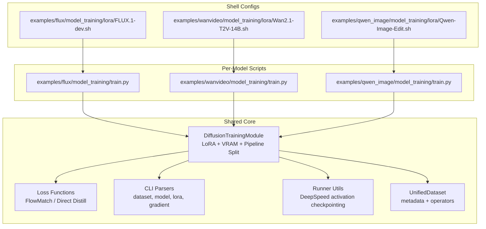
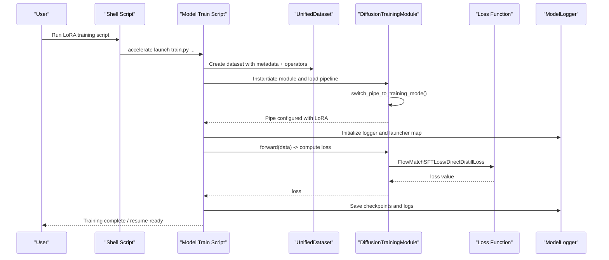
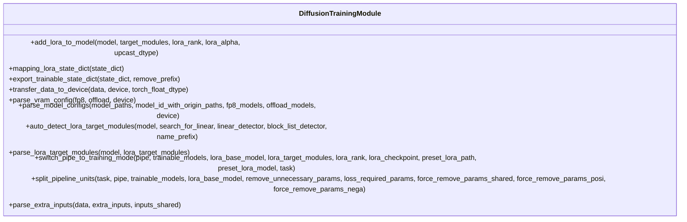
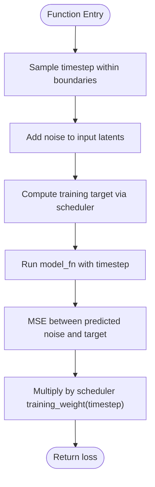
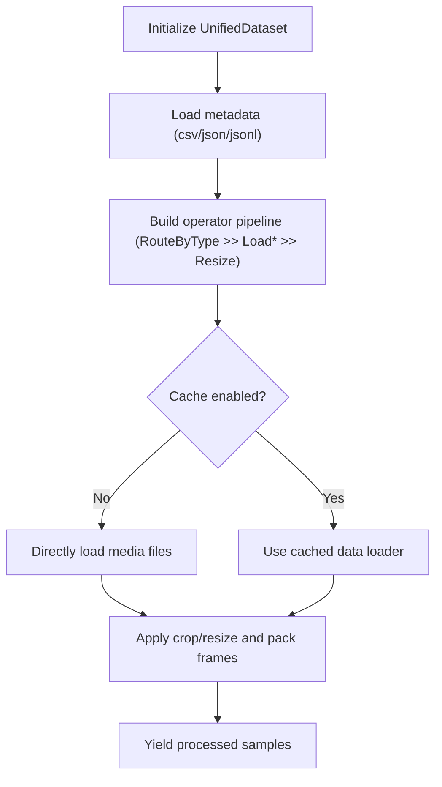
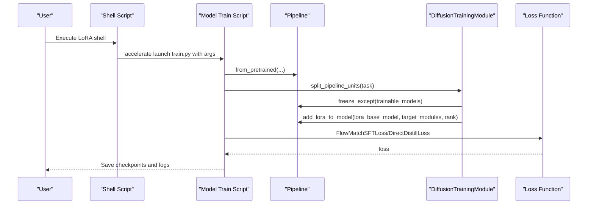
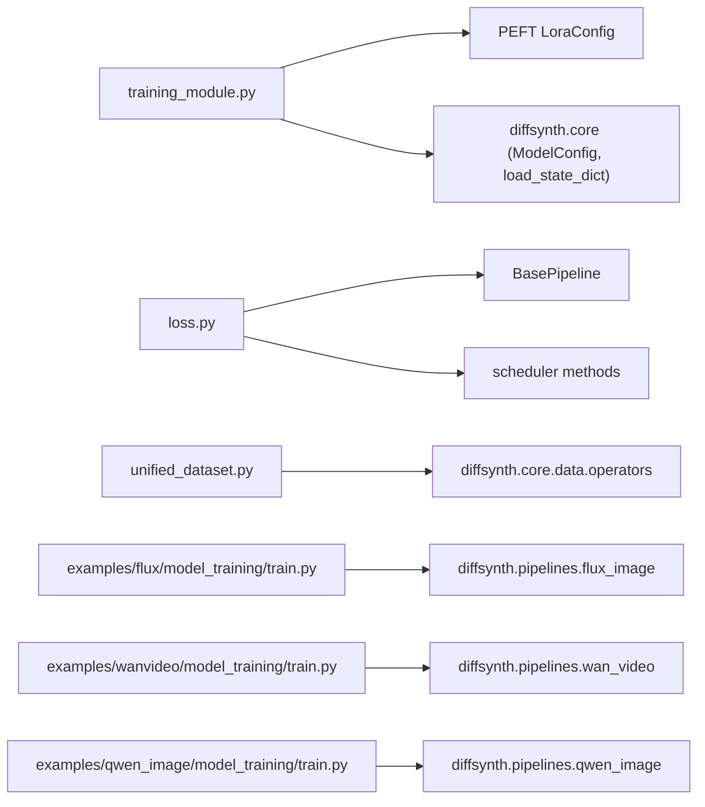

# LoRA Training and Fine-tuning

<cite>
**Referenced Files in This Document**
- [training_module.py](file://diffsynth/diffusion/training_module.py)
- [loss.py](file://diffsynth/diffusion/loss.py)
- [flow_match.py](file://diffsynth/diffusion/flow_match.py)
- [parsers.py](file://diffsynth/diffusion/parsers.py)
- [runner.py](file://diffsynth/diffusion/runner.py)
- [unified_dataset.py](file://diffsynth/core/data/unified_dataset.py)
- [data.md](file://docs/en/API_Reference/core/data.md)
- [train.py (FLUX)](file://examples/flux/model_training/train.py)
- [FLUX.1-dev.sh (LoRA)](file://examples/flux/model_training/lora/FLUX.1-dev.sh)
- [train.py (WanVideo)](file://examples/wanvideo/model_training/train.py)
- [Wan2.1-T2V-14B.sh (LoRA)](file://examples/wanvideo/model_training/lora/Wan2.1-T2V-14B.sh)
- [train.py (Qwen-Image)](file://examples/qwen_image/model_training/train.py)
- [Qwen-Image-Edit.sh (LoRA)](file://examples/qwen_image/model_training/lora/Qwen-Image-Edit.sh)
- [Model_Training.md](file://docs/en/Pipeline_Usage/Model_Training.md)
</cite>

## Table of Contents
1. [Introduction](#introduction)
2. [Project Structure](#project-structure)
3. [Core Components](#core-components)
4. [Architecture Overview](#architecture-overview)
5. [Detailed Component Analysis](#detailed-component-analysis)
6. [Dependency Analysis](#dependency-analysis)
7. [Performance Considerations](#performance-considerations)
8. [Troubleshooting Guide](#troubleshooting-guide)
9. [Conclusion](#conclusion)
10. [Appendices](#appendices)

## Introduction
This document explains how to train and fine-tune models with LoRA in ODTSR-edit across multiple model families, including FLUX, WanVideo, Qwen-Image, and others. It covers the end-to-end training pipeline: dataset preparation, data loading, loss computation, optimization strategies, and practical guidance for hyperparameter tuning, mixed precision, gradient accumulation, and monitoring progress. It also provides concrete examples for starting from scratch, resuming interrupted training, and best practices for dataset curation and evaluation during training.

## Project Structure
ODTSR-edit organizes training logic under a shared diffusion training framework and per-model training scripts:
- Shared training core:
  - DiffusionTrainingModule: LoRA injection, VRAM configuration, pipeline splitting, and device handling
  - Loss functions: FlowMatchSFTLoss, DirectDistillLoss, TrajectoryImitationLoss
  - Parsers: standardized CLI arguments for datasets, models, LoRA, gradients, and outputs
  - Runner utilities: DeepSpeed activation checkpointing initialization
- Unified dataset:
  - UnifiedDataset with default image/video operators and flexible metadata-driven loading
- Per-model training scripts:
  - examples/*/model_training/train.py implement model-specific pipelines and tasks
  - Shell scripts under examples/*/model_training/lora provide ready-to-run configurations

**Diagram sources**
- [training_module.py:30-303](file://diffsynth/diffusion/training_module.py#L30-L303)
- [loss.py:1-159](file://diffsynth/diffusion/loss.py#L1-L159)
- [parsers.py:48-70](file://diffsynth/diffusion/parsers.py#L48-L70)
- [runner.py:75-88](file://diffsynth/diffusion/runner.py#L75-L88)
- [unified_dataset.py:1-37](file://diffsynth/core/data/unified_dataset.py#L1-L37)
- [train.py (FLUX):1-194](file://examples/flux/model_training/train.py#L1-L194)
- [train.py (WanVideo)](file://examples/wanvideo/model_training/train.py)
- [train.py (Qwen-Image):34-174](file://examples/qwen_image/model_training/train.py#L34-L174)
- [FLUX.1-dev.sh (LoRA):1-18](file://examples/flux/model_training/lora/FLUX.1-dev.sh#L1-L18)
- [Wan2.1-T2V-14B.sh (LoRA):1-17](file://examples/wanvideo/model_training/lora/Wan2.1-T2V-14B.sh#L1-L17)
- [Qwen-Image-Edit.sh (LoRA):1-21](file://examples/qwen_image/model_training/lora/Qwen-Image-Edit.sh#L1-L21)

**Section sources**
- [training_module.py:30-303](file://diffsynth/diffusion/training_module.py#L30-L303)
- [loss.py:1-159](file://diffsynth/diffusion/loss.py#L1-L159)
- [parsers.py:48-70](file://diffsynth/diffusion/parsers.py#L48-L70)
- [runner.py:75-88](file://diffsynth/diffusion/runner.py#L75-L88)
- [unified_dataset.py:1-37](file://diffsynth/core/data/unified_dataset.py#L1-L37)
- [data.md:1-88](file://docs/en/API_Reference/core/data.md#L1-L88)
- [train.py (FLUX):1-194](file://examples/flux/model_training/train.py#L1-L194)
- [FLUX.1-dev.sh (LoRA):1-18](file://examples/flux/model_training/lora/FLUX.1-dev.sh#L1-L18)
- [train.py (WanVideo)](file://examples/wanvideo/model_training/train.py)
- [Wan2.1-T2V-14B.sh (LoRA):1-17](file://examples/wanvideo/model_training/lora/Wan2.1-T2V-14B.sh#L1-L17)
- [train.py (Qwen-Image):34-174](file://examples/qwen_image/model_training/train.py#L34-L174)
- [Qwen-Image-Edit.sh (LoRA):1-21](file://examples/qwen_image/model_training/lora/Qwen-Image-Edit.sh#L1-L21)

## Core Components
- DiffusionTrainingModule:
  - Adds LoRA adapters via PEFT and injects them into specified base modules
  - Parses VRAM configs for FP8 or offloading modes
  - Splits pipeline units for data processing vs training phases
  - Handles extra inputs (e.g., control signals) and device dtype casting
- Loss functions:
  - FlowMatchSFTLoss: standard flow-matching supervised fine-tuning
  - DirectDistillLoss: iterative distillation over scheduler timesteps
  - TrajectoryImitationLoss: trajectory alignment and regularization
- UnifiedDataset:
  - Metadata-driven dataset with operator pipelines for images/videos
  - Default operators support cropping, resizing, and multi-frame sequences
- CLI parsers:
  - Standardized arguments for dataset, model paths, LoRA targets/rank/checkpoints, gradient settings, and output paths

**Section sources**
- [training_module.py:30-303](file://diffsynth/diffusion/training_module.py#L30-L303)
- [loss.py:1-159](file://diffsynth/diffusion/loss.py#L1-L159)
- [unified_dataset.py:1-37](file://diffsynth/core/data/unified_dataset.py#L1-L37)
- [parsers.py:48-70](file://diffsynth/diffusion/parsers.py#L48-L70)

## Architecture Overview
The training workflow is orchestrated by per-model training scripts that instantiate DiffusionTrainingModule, build a UnifiedDataset, and launch either data preprocessing or training tasks using Accelerate. LoRA adapters are injected into target modules, and losses are computed through the selected task.

**Diagram sources**
- [train.py (FLUX):140-194](file://examples/flux/model_training/train.py#L140-L194)
- [training_module.py:214-283](file://diffsynth/diffusion/training_module.py#L214-L283)
- [loss.py:5-71](file://diffsynth/diffusion/loss.py#L5-L71)
- [unified_dataset.py:1-37](file://diffsynth/core/data/unified_dataset.py#L1-L37)

## Detailed Component Analysis

### DiffusionTrainingModule and LoRA Injection
- LoRA configuration:
  - Target modules can be auto-detected or explicitly provided
  - Rank and alpha are configurable; upcasting to model dtype is supported
  - Checkpoint loading supports mapping between different naming conventions
- VRAM management:
  - FP8 mode sets specific dtypes/devices for offload/onload/preparing/computation
  - Offload mode enables disk/CPU offloading with parameter clearing
- Pipeline splitting:
  - Data processing tasks remove unnecessary parameters and cache intermediate results
  - Training tasks split units to only include backward-required models

**Diagram sources**
- [training_module.py:30-303](file://diffsynth/diffusion/training_module.py#L30-L303)

**Section sources**
- [training_module.py:52-211](file://diffsynth/diffusion/training_module.py#L52-L211)
- [training_module.py:214-303](file://diffsynth/diffusion/training_module.py#L214-L303)

### Loss Computation and Scheduler Integration
- FlowMatchSFTLoss:
  - Samples a random timestep within boundaries
  - Adds noise to input latents and computes training target via scheduler
  - Computes MSE between predicted noise and target, weighted by scheduler
- DirectDistillLoss:
  - Iterates over scheduler timesteps to step latents and minimize difference to input latents
- Scheduler helpers:
  - Timestep generation for FLUX and Wan variants with shift parameters

**Diagram sources**
- [loss.py:5-28](file://diffsynth/diffusion/loss.py#L5-L28)
- [flow_match.py:20-51](file://diffsynth/diffusion/flow_match.py#L20-L51)

**Section sources**
- [loss.py:5-71](file://diffsynth/diffusion/loss.py#L5-L71)
- [flow_match.py:20-51](file://diffsynth/diffusion/flow_match.py#L20-L51)

### UnifiedDataset and Data Pipelines
- Metadata-driven loading:
  - Supports CSV/JSON/JSONL metadata files
  - Fields mapped to file keys for images/videos/audio
- Operator pipelines:
  - RouteByType selects loaders based on data type and extension
  - ImageCropAndResize enforces resolution constraints and division factors
- Caching:
  - Optional caching via LoadTorchPickle for faster repeated access

**Diagram sources**
- [unified_dataset.py:1-37](file://diffsynth/core/data/unified_dataset.py#L1-L37)
- [data.md:1-88](file://docs/en/API_Reference/core/data.md#L1-L88)

**Section sources**
- [unified_dataset.py:1-37](file://diffsynth/core/data/unified_dataset.py#L1-L37)
- [data.md:1-88](file://docs/en/API_Reference/core/data.md#L1-L88)

### Per-Model Training Scripts and Shell Configurations
- FLUX LoRA training:
  - Uses FluxImagePipeline and FlowMatchSFTLoss
  - Shell script downloads example dataset and launches accelerate training with LoRA targets on DiT blocks
- WanVideo LoRA training:
  - Targets q,k,v,o and ffn layers in DiT
  - Shell script configures height/width and model components
- Qwen-Image LoRA training:
  - Supports edit_image as extra input and uses gradient checkpointing
  - Shell script specifies transformer and text encoder/vae components

**Diagram sources**
- [train.py (FLUX):1-194](file://examples/flux/model_training/train.py#L1-L194)
- [FLUX.1-dev.sh (LoRA):1-18](file://examples/flux/model_training/lora/FLUX.1-dev.sh#L1-L18)
- [train.py (WanVideo)](file://examples/wanvideo/model_training/train.py)
- [Wan2.1-T2V-14B.sh (LoRA):1-17](file://examples/wanvideo/model_training/lora/Wan2.1-T2V-14B.sh#L1-L17)
- [train.py (Qwen-Image):34-174](file://examples/qwen_image/model_training/train.py#L34-L174)
- [Qwen-Image-Edit.sh (LoRA):1-21](file://examples/qwen_image/model_training/lora/Qwen-Image-Edit.sh#L1-L21)

**Section sources**
- [train.py (FLUX):1-194](file://examples/flux/model_training/train.py#L1-L194)
- [FLUX.1-dev.sh (LoRA):1-18](file://examples/flux/model_training/lora/FLUX.1-dev.sh#L1-L18)
- [train.py (WanVideo)](file://examples/wanvideo/model_training/train.py)
- [Wan2.1-T2V-14B.sh (LoRA):1-17](file://examples/wanvideo/model_training/lora/Wan2.1-T2V-14B.sh#L1-L17)
- [train.py (Qwen-Image):34-174](file://examples/qwen_image/model_training/train.py#L34-L174)
- [Qwen-Image-Edit.sh (LoRA):1-21](file://examples/qwen_image/model_training/lora/Qwen-Image-Edit.sh#L1-L21)

## Dependency Analysis
Key dependencies and relationships:
- training_module.py depends on PEFT for LoRA injection and on diffsynth.core for ModelConfig and state dict loading
- loss.py relies on BasePipeline and scheduler methods for timestep and target computation
- unified_dataset.py composes operators from diffsynth.core.data.operators
- per-model train scripts import diffsynth.pipelines.* and diffsynth.diffusion.* utilities

**Diagram sources**
- [training_module.py:1-10](file://diffsynth/diffusion/training_module.py#L1-L10)
- [loss.py:1-5](file://diffsynth/diffusion/loss.py#L1-L5)
- [unified_dataset.py:1-5](file://diffsynth/core/data/unified_dataset.py#L1-L5)
- [train.py (FLUX):1-5](file://examples/flux/model_training/train.py#L1-L5)
- [train.py (WanVideo)](file://examples/wanvideo/model_training/train.py)
- [train.py (Qwen-Image):1-5](file://examples/qwen_image/model_training/train.py#L1-L5)

**Section sources**
- [training_module.py:1-10](file://diffsynth/diffusion/training_module.py#L1-L10)
- [loss.py:1-5](file://diffsynth/diffusion/loss.py#L1-L5)
- [unified_dataset.py:1-5](file://diffsynth/core/data/unified_dataset.py#L1-L5)
- [train.py (FLUX):1-5](file://examples/flux/model_training/train.py#L1-L5)
- [train.py (WanVideo)](file://examples/wanvideo/model_training/train.py)
- [train.py (Qwen-Image):1-5](file://examples/qwen_image/model_training/train.py#L1-L5)

## Performance Considerations
- Mixed precision:
  - bfloat16 is commonly used for model loading and computation
  - FP8 mode available via parse_vram_config for non-trainable models
- Gradient checkpointing:
  - Enabled via CLI flags; optional CPU offloading supported
- DeepSpeed integration:
  - Activation checkpointing can be configured through accelerator DeepSpeed plugin
- Batch size and accumulation:
  - Use gradient_accumulation_steps to scale effective batch size
  - Adjust dataset_repeat to control steps per epoch
- VRAM management:
  - Offload models to disk/CPU when necessary
  - Clear parameters after use to reduce memory footprint

**Section sources**
- [training_module.py:110-160](file://diffsynth/diffusion/training_module.py#L110-L160)
- [runner.py:75-88](file://diffsynth/diffusion/runner.py#L75-L88)
- [Model_Training.md:303-347](file://docs/en/Pipeline_Usage/Model_Training.md#L303-L347)

## Troubleshooting Guide
Common issues and resolutions:
- LoRA key mismatch:
  - Ensure checkpoint naming matches expected format; mapping function handles differences
- Unused parameters in DDP:
  - Set find_unused_parameters=True for models with redundant parameters
- Data loading errors:
  - Verify metadata paths and file extensions; ensure base_path resolves relative paths
- Memory overflow:
  - Enable gradient checkpointing and/or offload models; reduce max_pixels or batch size
- Scheduler/timestep mismatches:
  - Confirm scheduler set_timesteps and training_target usage align with model family

**Section sources**
- [training_module.py:247-254](file://diffsynth/diffusion/training_module.py#L247-L254)
- [parsers.py:57-61](file://diffsynth/diffusion/parsers.py#L57-L61)
- [unified_dataset.py:1-37](file://diffsynth/core/data/unified_dataset.py#L1-L37)

## Conclusion
ODTSR-edit provides a robust, modular framework for LoRA training and fine-tuning across diverse model families. The shared DiffusionTrainingModule centralizes LoRA injection, VRAM management, and pipeline splitting, while per-model scripts tailor data loading and loss computation. With standardized CLI arguments, flexible dataset operators, and comprehensive shell configurations, users can efficiently train LoRA adapters from scratch, resume interrupted runs, and monitor progress. Adopting best practices for dataset curation, augmentation, and evaluation ensures stable and high-quality fine-tuning outcomes.

## Appendices

### Hyperparameter Tuning Guidelines
- Learning rate:
  - Start around 1e-4 for LoRA; adjust based on convergence behavior
- Batch size:
  - Increase effective batch size via gradient_accumulation_steps if GPU memory is limited
- LoRA rank and targets:
  - Rank 32 is common; target attention and feed-forward layers for DiT-based models
- Mixed precision:
  - Prefer bfloat16; enable FP8 for non-trainable components where supported
- Gradient checkpointing:
  - Enable for large models; consider offloading to CPU if needed

**Section sources**
- [parsers.py:48-70](file://diffsynth/diffusion/parsers.py#L48-L70)
- [training_module.py:52-110](file://diffsynth/diffusion/training_module.py#L52-L110)

### Examples: Training LoRA Adapters
- From scratch:
  - Use shell scripts under examples/*/model_training/lora to download datasets and launch training
- Resume interrupted training:
  - Provide --lora_checkpoint pointing to the last saved LoRA state
- Monitoring progress:
  - ModelLogger saves checkpoints and logs; configure output_path and save_steps

**Section sources**
- [FLUX.1-dev.sh (LoRA):1-18](file://examples/flux/model_training/lora/FLUX.1-dev.sh#L1-L18)
- [Wan2.1-T2V-14B.sh (LoRA):1-17](file://examples/wanvideo/model_training/lora/Wan2.1-T2V-14B.sh#L1-L17)
- [Qwen-Image-Edit.sh (LoRA):1-21](file://examples/qwen_image/model_training/lora/Qwen-Image-Edit.sh#L1-L21)

### Best Practices for Dataset Curation and Augmentation
- Metadata structure:
  - Include file paths and required fields; ensure consistent naming
- Operators:
  - Use ImageCropAndResize to enforce resolution constraints; apply time_division_factor for videos
- Caching:
  - Enable caching for repeated access to speed up training loops
- Evaluation:
  - Validate samples periodically; use separate validation sets and metrics

**Section sources**
- [data.md:1-88](file://docs/en/API_Reference/core/data.md#L1-L88)
- [unified_dataset.py:1-37](file://diffsynth/core/data/unified_dataset.py#L1-L37)