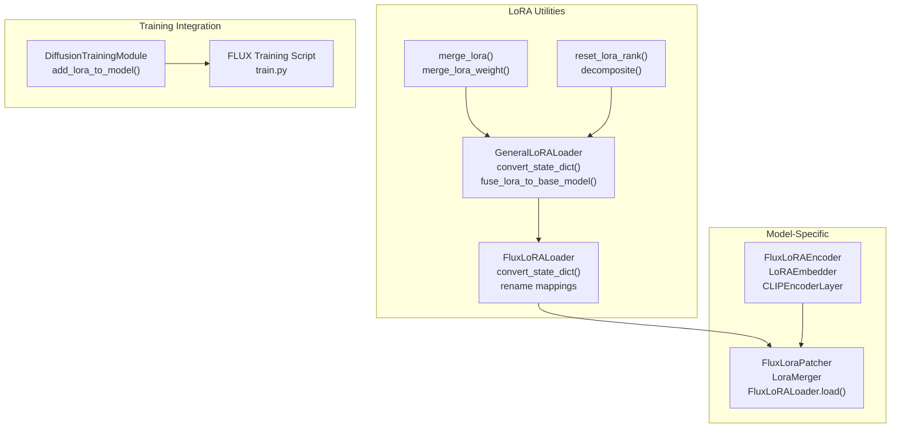
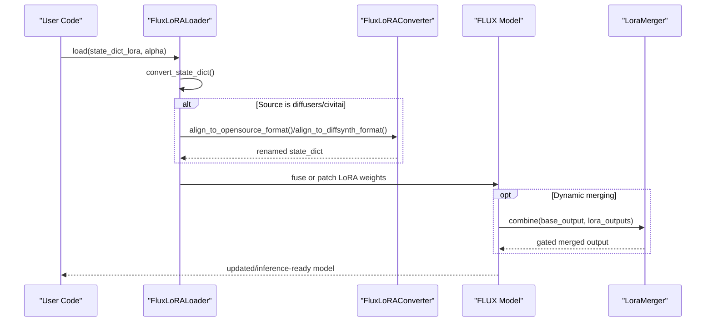
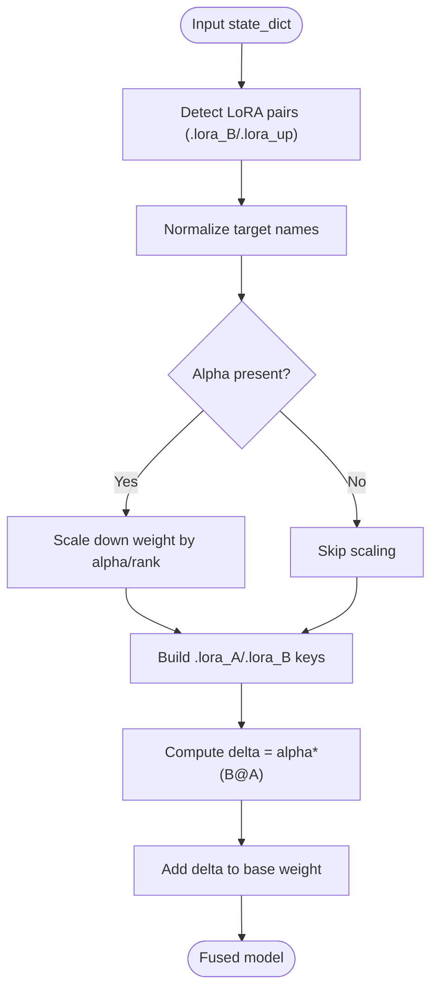
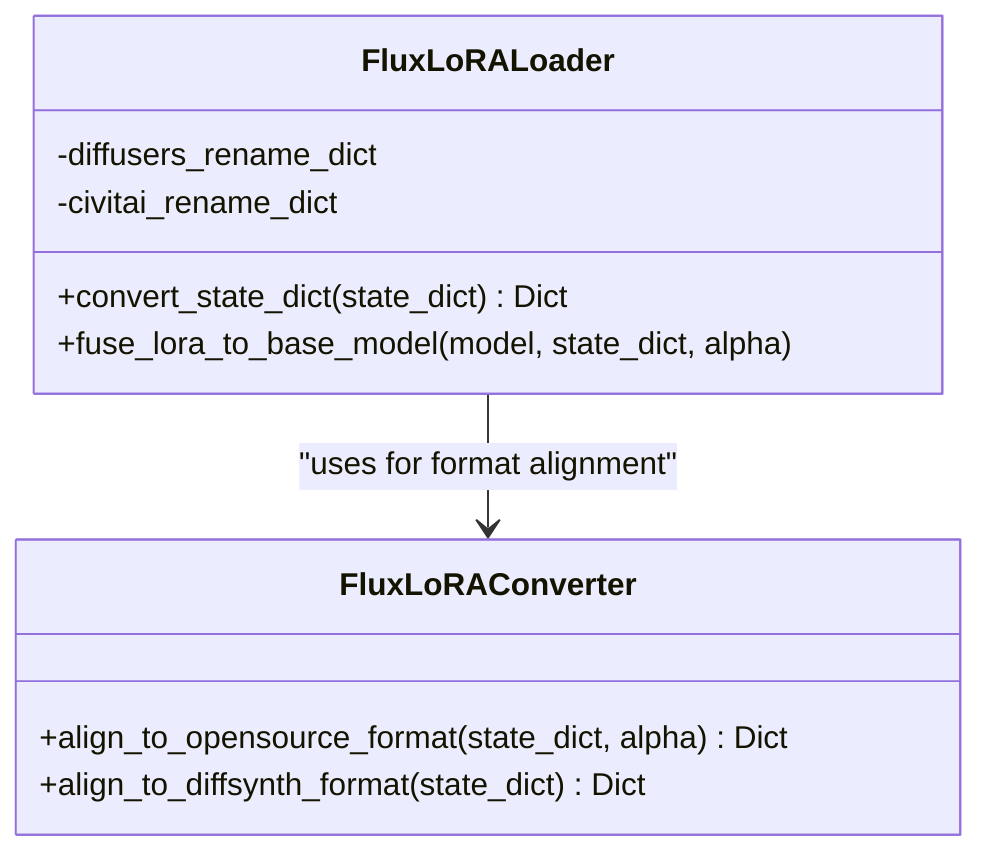
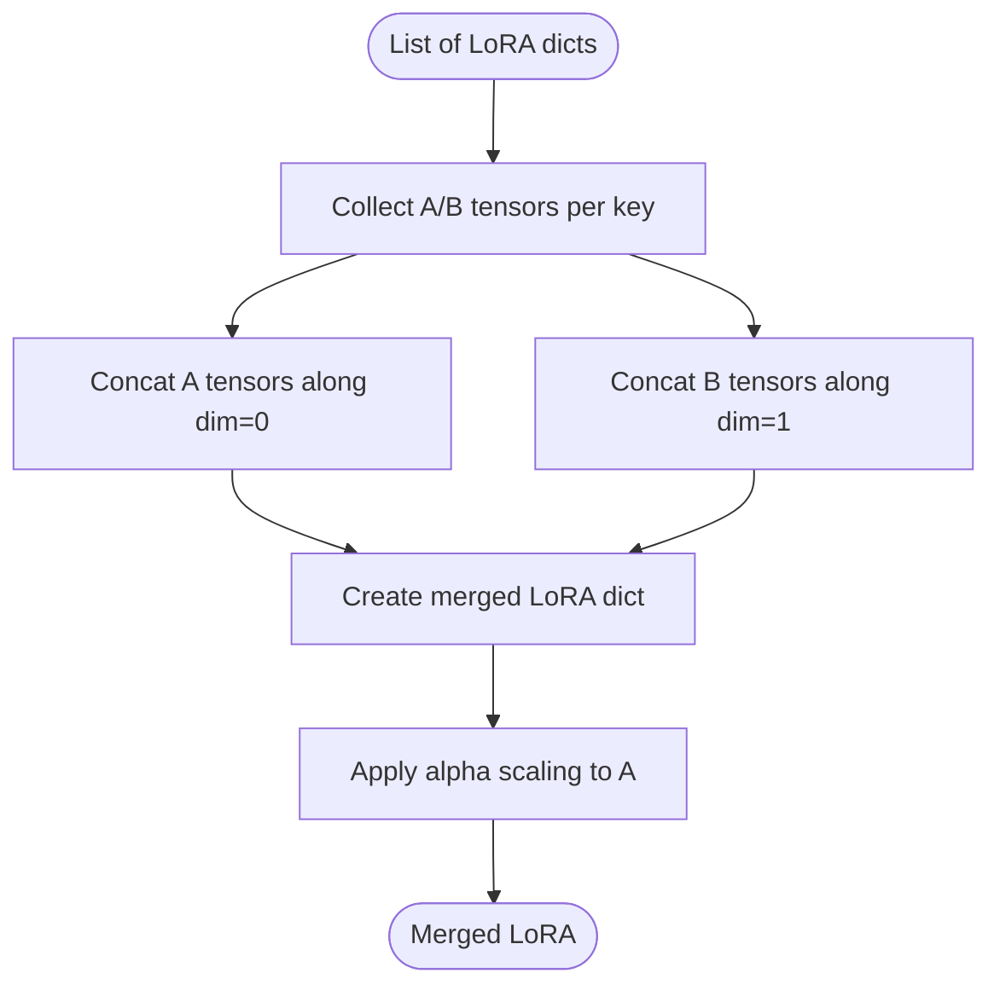
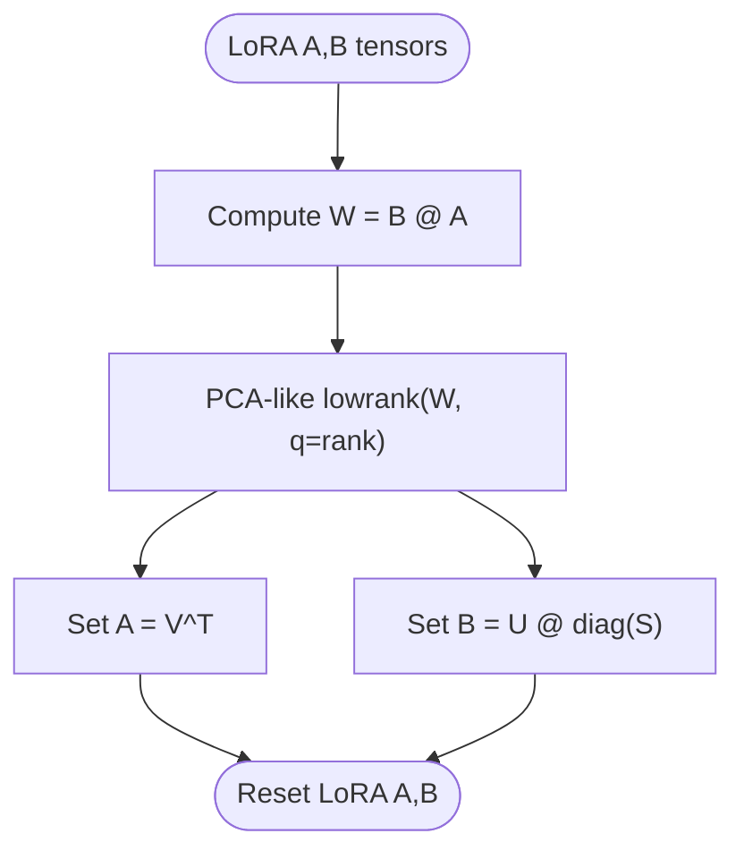
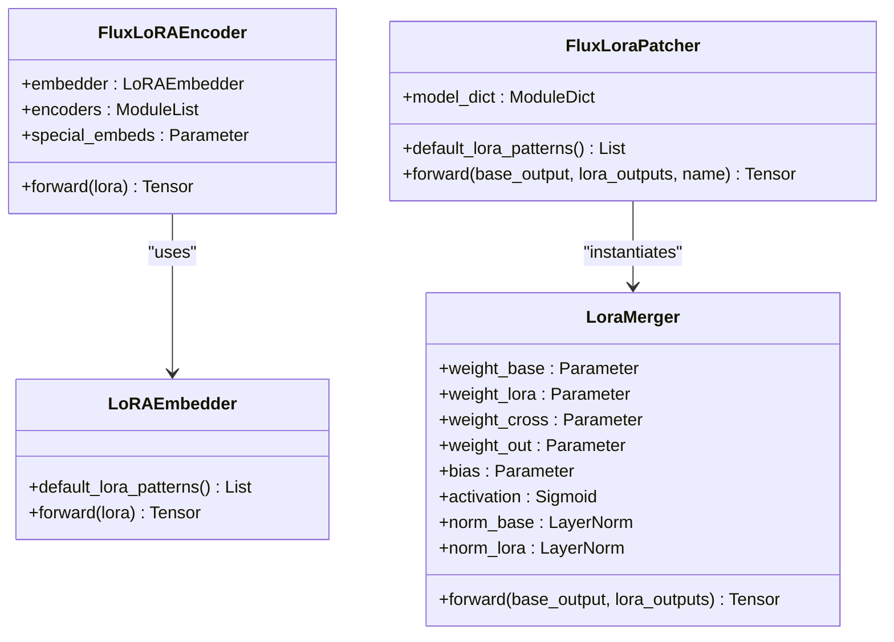
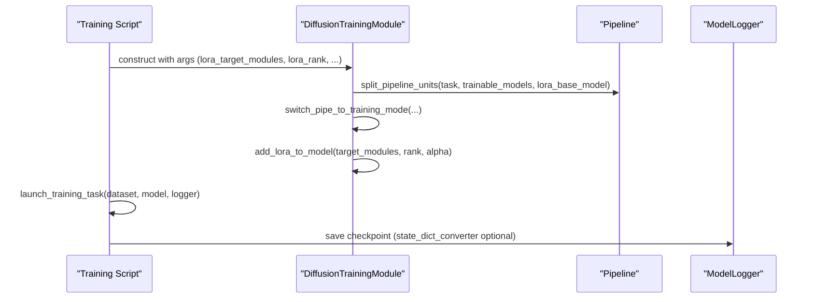
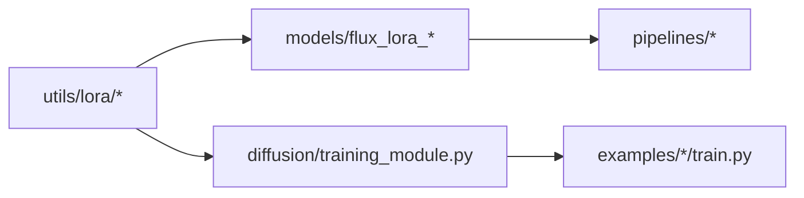

# LoRA and Fine-tuning

<cite>
**Referenced Files in This Document**
- [general.py](file://diffsynth/utils/lora/general.py)
- [flux.py](file://diffsynth/utils/lora/flux.py)
- [merge.py](file://diffsynth/utils/lora/merge.py)
- [reset_rank.py](file://diffsynth/utils/lora/reset_rank.py)
- [__init__.py](file://diffsynth/utils/lora/__init__.py)
- [flux_lora_encoder.py](file://diffsynth/models/flux_lora_encoder.py)
- [flux_lora_patcher.py](file://diffsynth/models/flux_lora_patcher.py)
- [training_module.py](file://diffsynth/diffusion/training_module.py)
- [train.py](file://examples/flux/model_training/train.py)
- [Differential_LoRA.md](file://docs/en/Training/Differential_LoRA.md)
</cite>

## Table of Contents
1. [Introduction](#introduction)
2. [Project Structure](#project-structure)
3. [Core Components](#core-components)
4. [Architecture Overview](#architecture-overview)
5. [Detailed Component Analysis](#detailed-component-analysis)
6. [Dependency Analysis](#dependency-analysis)
7. [Performance Considerations](#performance-considerations)
8. [Troubleshooting Guide](#troubleshooting-guide)
9. [Conclusion](#conclusion)
10. [Appendices](#appendices)

## Introduction
This document explains the LoRA (Low-Rank Adaptation) and fine-tuning capabilities in ODTSR-edit, focusing on parameter-efficient training, rank selection strategies, loading and merging LoRA weights, and model-specific implementations for FLUX models. It also provides practical guidance for training LoRA adapters, merging multiple LoRAs, and applying them during inference, along with best practices for dataset preparation, hyperparameter tuning, and evaluation.

## Project Structure
LoRA functionality is organized under a dedicated utilities package and model-specific modules:
- General LoRA loader and fusion utilities
- FLUX-specific loaders, converters, and patchers
- Rank reduction utilities and multi-LoRA merging helpers
- Training module integration using PEFT-based LoRA injection
- Example training scripts for FLUX

**Diagram sources**
- [general.py:1-71](file://diffsynth/utils/lora/general.py#L1-L71)
- [flux.py:1-303](file://diffsynth/utils/lora/flux.py#L1-L303)
- [merge.py:1-21](file://diffsynth/utils/lora/merge.py#L1-L21)
- [reset_rank.py:1-20](file://diffsynth/utils/lora/reset_rank.py#L1-L20)
- [flux_lora_encoder.py:1-522](file://diffsynth/models/flux_lora_encoder.py#L1-L522)
- [flux_lora_patcher.py:1-307](file://diffsynth/models/flux_lora_patcher.py#L1-L307)
- [training_module.py:1-200](file://diffsynth/diffusion/training_module.py#L1-L200)
- [train.py:1-194](file://examples/flux/model_training/train.py#L1-L194)

**Section sources**
- [general.py:1-71](file://diffsynth/utils/lora/general.py#L1-L71)
- [flux.py:1-303](file://diffsynth/utils/lora/flux.py#L1-L303)
- [merge.py:1-21](file://diffsynth/utils/lora/merge.py#L1-L21)
- [reset_rank.py:1-20](file://diffsynth/utils/lora/reset_rank.py#L1-L20)
- [flux_lora_encoder.py:1-522](file://diffsynth/models/flux_lora_encoder.py#L1-L522)
- [flux_lora_patcher.py:1-307](file://diffsynth/models/flux_lora_patcher.py#L1-L307)
- [training_module.py:1-200](file://diffsynth/diffusion/training_module.py#L1-L200)
- [train.py:1-194](file://examples/flux/model_training/train.py#L1-L194)

## Core Components
- GeneralLoRALoader: Converts various LoRA state dict formats to a unified naming scheme and fuses LoRA weights into base model layers. Supports alpha compatibility and 4D tensor handling.
- FluxLoRALoader: Extends general loader with FLUX-specific renaming for diffusers and Civitai formats, including block ID detection and alpha guessing.
- merge_lora: Concatenates A matrices across rows and B matrices across columns to merge multiple LoRAs into one.
- reset_lora_rank: Reduces LoRA rank via low-rank approximation (PCA-like decomposition).
- FluxLoRAEncoder and FluxLoraPatcher: Provide encoder-style embedding of LoRA parameters and dynamic patching/merging at runtime for FLUX models.
- DiffusionTrainingModule: Integrates PEFT-based LoRA injection into training pipelines, exporting trainable states and mapping keys.

Key responsibilities:
- Loading and conversion: general.py, flux.py
- Fusion and merging: general.py, merge.py
- Rank control: reset_rank.py
- Model-specific adaptation: flux_lora_encoder.py, flux_lora_patcher.py
- Training integration: training_module.py, train.py

**Section sources**
- [general.py:1-71](file://diffsynth/utils/lora/general.py#L1-L71)
- [flux.py:1-303](file://diffsynth/utils/lora/flux.py#L1-L303)
- [merge.py:1-21](file://diffsynth/utils/lora/merge.py#L1-L21)
- [reset_rank.py:1-20](file://diffsynth/utils/lora/reset_rank.py#L1-L20)
- [flux_lora_encoder.py:1-522](file://diffsynth/models/flux_lora_encoder.py#L1-L522)
- [flux_lora_patcher.py:1-307](file://diffsynth/models/flux_lora_patcher.py#L1-L307)
- [training_module.py:1-200](file://diffsynth/diffusion/training_module.py#L1-L200)

## Architecture Overview
The LoRA framework supports both static fusion (into base model weights) and dynamic patching (runtime combination), with FLUX-specific converters bridging different source formats.

**Diagram sources**
- [flux.py:84-206](file://diffsynth/utils/lora/flux.py#L84-L206)
- [flux_lora_patcher.py:123-247](file://diffsynth/models/flux_lora_patcher.py#L123-L247)
- [flux_lora_encoder.py:485-512](file://diffsynth/models/flux_lora_encoder.py#L485-L512)

## Detailed Component Analysis

### General LoRA Loader and Fusion
- Name mapping: Identifies LoRA pairs by suffixes (.lora_up/.lora_B and .lora_down/.lora_A), normalizes names, and handles deprecated alpha fields.
- Conversion: Produces standardized keys ending with ".lora_A.weight" and ".lora_B.weight".
- Fusion: Computes delta = alpha * (B @ A) and adds to base layer weights; supports 4D kernels by squeezing spatial dims.

**Diagram sources**
- [general.py:10-49](file://diffsynth/utils/lora/general.py#L10-L49)
- [general.py:52-71](file://diffsynth/utils/lora/general.py#L52-L71)

**Section sources**
- [general.py:10-49](file://diffsynth/utils/lora/general.py#L10-L49)
- [general.py:52-71](file://diffsynth/utils/lora/general.py#L52-L71)

### FLUX LoRA Loader and Converters
- Resource detection: Infers whether state dict originates from diffusers or Civitai based on key prefixes.
- Block ID extraction: Parses numeric identifiers to map block indices correctly.
- Alpha guessing: Derives effective alpha from stored .alpha tensors when available.
- Renaming maps: Comprehensive mappings for attention, MLP, and normalization layers across double/single blocks.
- QKV concatenation: Combines separate q/k/v projections into unified qkv tensors where required.

**Diagram sources**
- [flux.py:5-206](file://diffsynth/utils/lora/flux.py#L5-L206)
- [flux.py:209-303](file://diffsynth/utils/lora/flux.py#L209-L303)

**Section sources**
- [flux.py:5-206](file://diffsynth/utils/lora/flux.py#L5-L206)
- [flux.py:209-303](file://diffsynth/utils/lora/flux.py#L209-L303)

### Multi-LoRA Merging and Rank Reset
- Merging strategy: Concatenate all A matrices vertically and all B matrices horizontally to form a single large LoRA; applies global alpha scaling.
- Rank reset: Uses low-rank approximation to reduce rank while preserving the product B@A approximately.

**Diagram sources**
- [merge.py:5-21](file://diffsynth/utils/lora/merge.py#L5-L21)

**Diagram sources**
- [reset_rank.py:3-20](file://diffsynth/utils/lora/reset_rank.py#L3-L20)

**Section sources**
- [merge.py:5-21](file://diffsynth/utils/lora/merge.py#L5-L21)
- [reset_rank.py:3-20](file://diffsynth/utils/lora/reset_rank.py#L3-L20)

### FLUX LoRA Encoder and Patcher
- Encoder: Embeds LoRA parameters through pattern-matched blocks and projects them into a shared space; includes special embeddings and CLIP-style encoder layers.
- Patcher: Provides runtime merging via LoraMerger with learnable gating and normalization; supports dynamic activation of multiple LoRAs per module.

**Diagram sources**
- [flux_lora_encoder.py:427-512](file://diffsynth/models/flux_lora_encoder.py#L427-L512)
- [flux_lora_patcher.py:250-307](file://diffsynth/models/flux_lora_patcher.py#L250-L307)

**Section sources**
- [flux_lora_encoder.py:427-512](file://diffsynth/models/flux_lora_encoder.py#L427-L512)
- [flux_lora_patcher.py:250-307](file://diffsynth/models/flux_lora_patcher.py#L250-L307)

### Training Integration and Differential LoRA
- PEFT injection: add_lora_to_model uses peft.LoraConfig to inject LoRA adapters into target modules; supports upcasting trainable parameters.
- State export: Maps LoRA keys to default naming and exports only trainable parameters; supports prefix removal for clean checkpoints.
- Differential LoRA: Two-step training approach where LoRA 2 learns differences after integrating LoRA 1 into the base model.

**Diagram sources**
- [training_module.py:52-87](file://diffsynth/diffusion/training_module.py#L52-L87)
- [train.py:160-194](file://examples/flux/model_training/train.py#L160-L194)
- [Differential_LoRA.md:1-38](file://docs/en/Training/Differential_LoRA.md#L1-L38)

**Section sources**
- [training_module.py:52-87](file://diffsynth/diffusion/training_module.py#L52-L87)
- [train.py:160-194](file://examples/flux/model_training/train.py#L160-L194)
- [Differential_LoRA.md:1-38](file://docs/en/Training/Differential_LoRA.md#L1-L38)

## Dependency Analysis
LoRA components have clear separation of concerns:
- General utilities provide format-agnostic operations.
- FLUX-specific modules handle naming and structural differences.
- Training module integrates with PEFT and orchestrates data flow.

**Diagram sources**
- [__init__.py:1-3](file://diffsynth/utils/lora/__init__.py#L1-L3)
- [training_module.py:1-200](file://diffsynth/diffusion/training_module.py#L1-L200)
- [train.py:1-194](file://examples/flux/model_training/train.py#L1-L194)

**Section sources**
- [__init__.py:1-3](file://diffsynth/utils/lora/__init__.py#L1-L3)
- [training_module.py:1-200](file://diffsynth/diffusion/training_module.py#L1-L200)
- [train.py:1-194](file://examples/flux/model_training/train.py#L1-L194)

## Performance Considerations
- Rank selection: Lower ranks reduce memory and compute but may limit expressiveness; use reset_lora_rank to compress trained LoRAs.
- Fusion vs dynamic patching: Fusing LoRA into base weights removes runtime overhead but prevents clearing via clear_lora; dynamic patching allows flexible switching.
- Dtype handling: Ensure consistent dtypes for LoRA weights and inputs; upcast trainable parameters when needed.
- Memory management: Use gradient checkpointing and offloading options in training scripts to fit larger models.

[No sources needed since this section provides general guidance]

## Troubleshooting Guide
- Alpha warnings: If an alpha field is detected in non-DiffSynth-trained LoRAs, weights are scaled accordingly; verify expected behavior.
- Key mismatches: Ensure LoRA state dict keys match target module names; use convert_state_dict to normalize naming.
- Merging errors: Confirm compatible shapes for A/B tensors across LoRAs before merging; mismatched dimensions will cause concatenation failures.
- Rank reset quality: After decomposing, evaluate reconstruction error to ensure desired fidelity is maintained.

**Section sources**
- [general.py:43-46](file://diffsynth/utils/lora/general.py#L43-L46)
- [flux.py:113-121](file://diffsynth/utils/lora/flux.py#L113-L121)
- [merge.py:11-21](file://diffsynth/utils/lora/merge.py#L11-L21)
- [reset_rank.py:3-20](file://diffsynth/utils/lora/reset_rank.py#L3-L20)

## Conclusion
ODTSR-edit provides a robust LoRA framework supporting general loaders, FLUX-specific conversions, merging, and rank control. The training integration leverages PEFT for efficient fine-tuning, while differential LoRA enables learning differences between datasets. Users can choose between fused LoRAs for performance or dynamic patching for flexibility, with comprehensive tools for format compatibility and optimization.

[No sources needed since this section summarizes without analyzing specific files]

## Appendices

### Best Practices for LoRA Training
- Dataset preparation:
  - Use high-quality, representative samples aligned with target domain.
  - For differential LoRA, prepare paired images capturing desired changes.
- Hyperparameter tuning:
  - Start with moderate rank (e.g., 8–32) and adjust based on task complexity.
  - Set alpha equal to rank initially; tune if overfitting occurs.
  - Use gradient checkpointing and mixed precision to manage VRAM.
- Evaluation strategies:
  - Validate on held-out sets and measure visual fidelity and task-specific metrics.
  - Compare merged vs dynamic LoRA modes for performance trade-offs.

[No sources needed since this section provides general guidance]