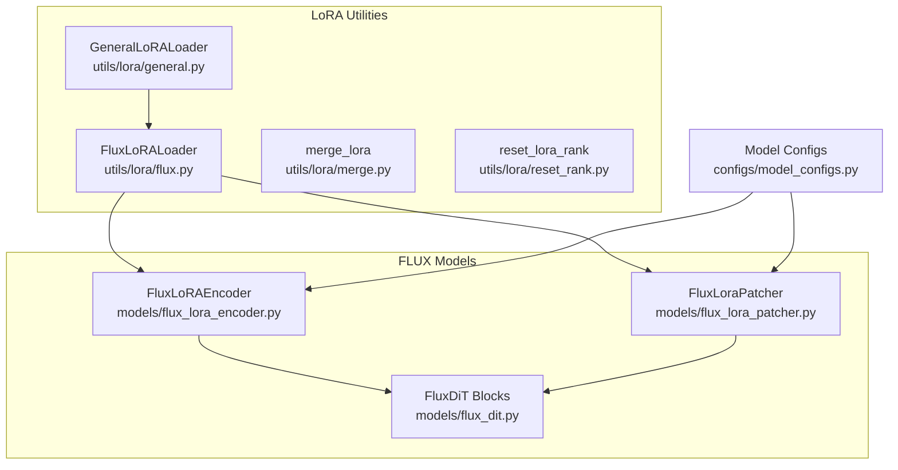
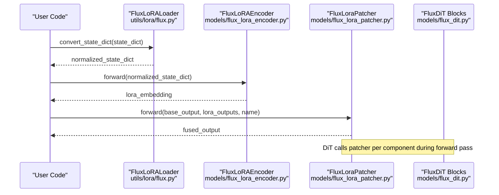
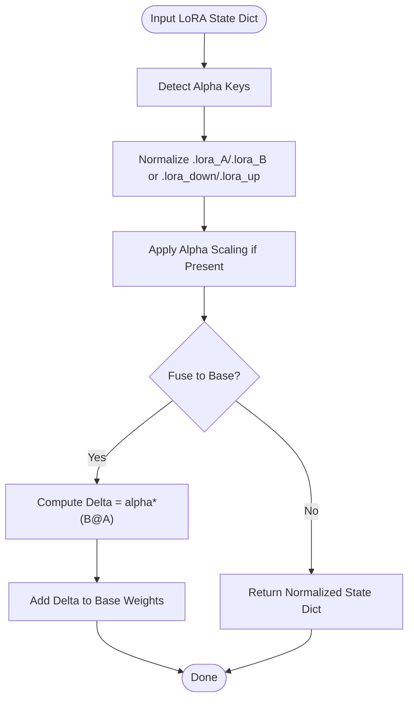
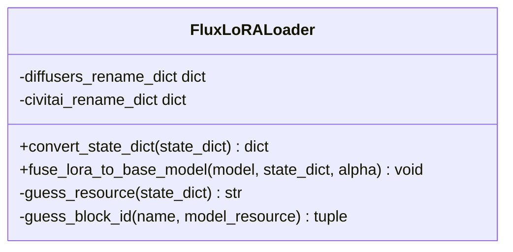
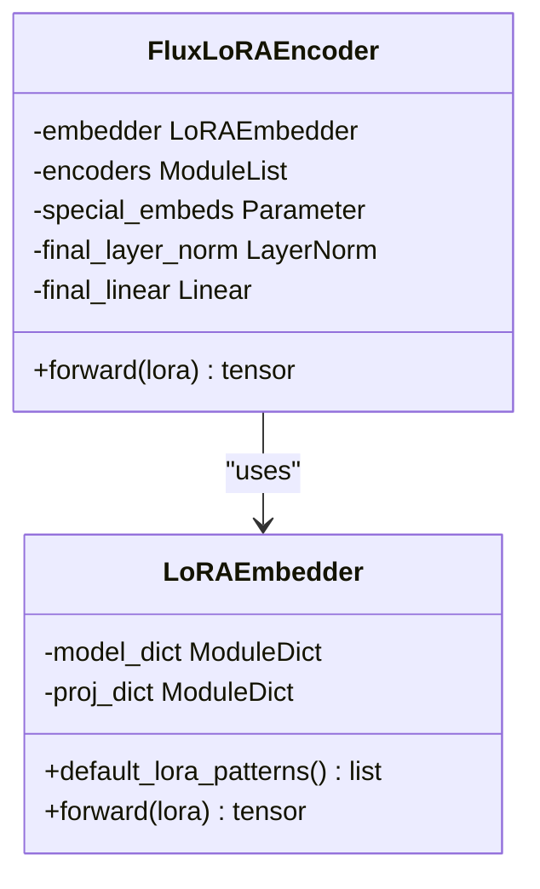
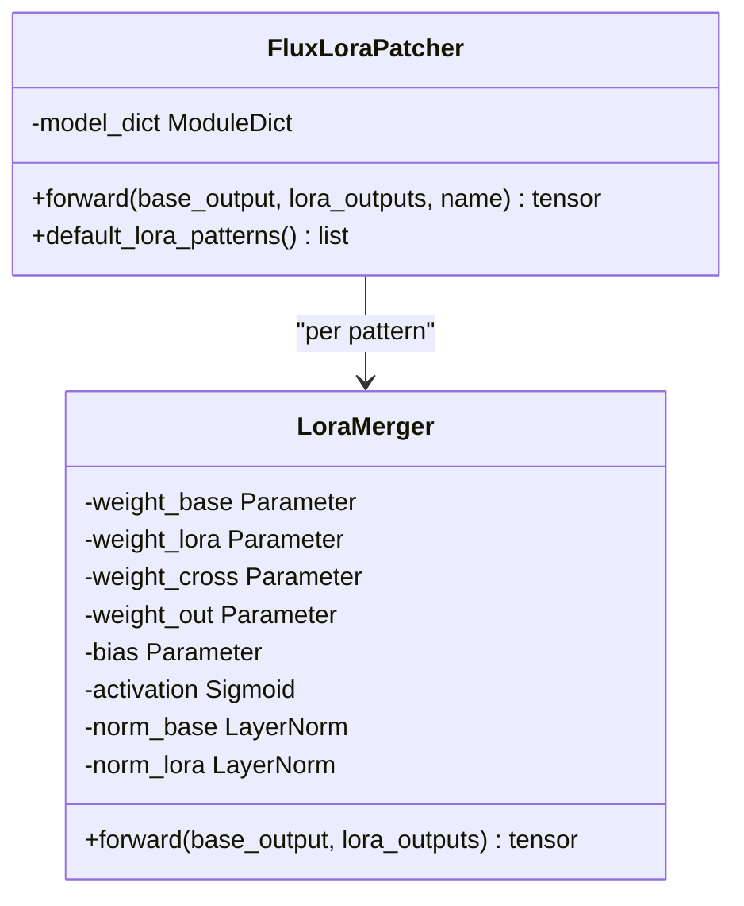
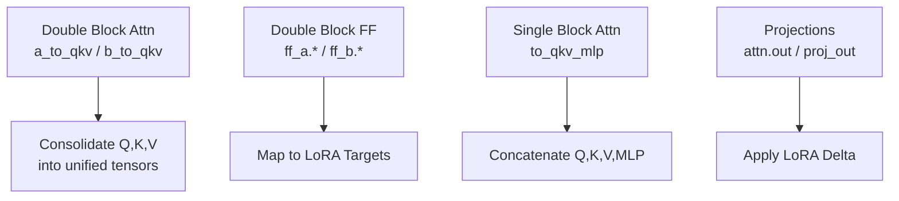
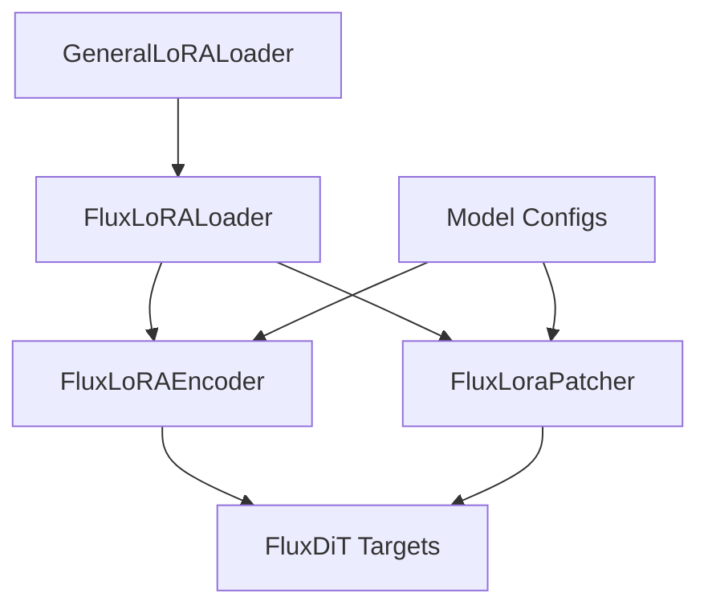

# Model-Specific LoRA Implementations

<cite>
**Referenced Files in This Document**
- [flux.py](file://diffsynth/utils/lora/flux.py)
- [general.py](file://diffsynth/utils/lora/general.py)
- [merge.py](file://diffsynth/utils/lora/merge.py)
- [reset_rank.py](file://diffsynth/utils/lora/reset_rank.py)
- [flux_lora_encoder.py](file://diffsynth/models/flux_lora_encoder.py)
- [flux_lora_patcher.py](file://diffsynth/models/flux_lora_patcher.py)
- [flux_dit.py](file://diffsynth/models/flux_dit.py)
- [model_configs.py](file://diffsynth/configs/model_configs.py)
</cite>

## Table of Contents
1. [Introduction](#introduction)
2. [Project Structure](#project-structure)
3. [Core Components](#core-components)
4. [Architecture Overview](#architecture-overview)
5. [Detailed Component Analysis](#detailed-component-analysis)
6. [Dependency Analysis](#dependency-analysis)
7. [Performance Considerations](#performance-considerations)
8. [Troubleshooting Guide](#troubleshooting-guide)
9. [Conclusion](#conclusion)
10. [Appendices](#appendices)

## Introduction
This document explains model-specific Low-Rank Adaptation (LoRA) implementations with a focus on FLUX models and other supported architectures. It details how LoRA adapters are customized for transformer blocks, attention mechanisms, and projection layers; documents the FLORA implementation for FLUX models including encoder LoRA, patcher integration, and architectural adaptations; and provides configuration options, parameter mapping strategies, compatibility requirements, examples of applying LoRA to different components, handling model-specific quirks, and performance optimization guidance.

## Project Structure
The repository organizes LoRA utilities under utils/lora and model-specific integrations under models. For FLUX:
- LoRA loaders and converters live in utils/lora (general loader, FLUX-specific loader, merging utilities).
- FLUX LoRA encoder and patcher modules reside in models.
- FLUX DiT defines the core transformer blocks where LoRA is applied.
- Model configurations register FLUX LoRA encoder and patcher as first-class components.

**Diagram sources**
- [flux.py:1-303](file://diffsynth/utils/lora/flux.py#L1-L303)
- [general.py:1-71](file://diffsynth/utils/lora/general.py#L1-L71)
- [merge.py:1-21](file://diffsynth/utils/lora/merge.py#L1-L21)
- [reset_rank.py:1-20](file://diffsynth/utils/lora/reset_rank.py#L1-L20)
- [flux_lora_encoder.py:1-522](file://diffsynth/models/flux_lora_encoder.py#L1-L522)
- [flux_lora_patcher.py:1-307](file://diffsynth/models/flux_lora_patcher.py#L1-L307)
- [flux_dit.py:1-200](file://diffsynth/models/flux_dit.py#L1-L200)
- [model_configs.py:410-450](file://diffsynth/configs/model_configs.py#L410-L450)

**Section sources**
- [flux.py:1-303](file://diffsynth/utils/lora/flux.py#L1-L303)
- [general.py:1-71](file://diffsynth/utils/lora/general.py#L1-L71)
- [flux_lora_encoder.py:1-522](file://diffsynth/models/flux_lora_encoder.py#L1-L522)
- [flux_lora_patcher.py:1-307](file://diffsynth/models/flux_lora_patcher.py#L1-L307)
- [flux_dit.py:1-200](file://diffsynth/models/flux_dit.py#L1-L200)
- [model_configs.py:410-450](file://diffsynth/configs/model_configs.py#L410-L450)

## Core Components
- GeneralLoRALoader: Base class that normalizes LoRA state dicts across naming conventions (.lora_A/.lora_B or .lora_down/.lora_up), handles alpha scaling, and fuses LoRA weights into base model parameters.
- FluxLoRALoader: Extends the general loader with FLUX-specific rename mappings for diffusers and Civitai formats, block ID extraction, alpha inference, and concatenation of Q/K/V projections into unified qkv tensors.
- FluxLoRAEncoder: A specialized encoder that consumes LoRA weights from multiple FLUX components, projects them through learnable blocks and type-specific linear projections, and outputs a compact embedding used by the pipeline.
- FluxLoraPatcher: A runtime patcher that merges base outputs with LoRA outputs per component using a gated fusion mechanism, enabling dynamic LoRA application without weight mutation.
- merge_lora and reset_lora_rank: Utilities to concatenate multiple LoRAs and reduce rank via low-rank decomposition for storage or deployment efficiency.

**Section sources**
- [general.py:1-71](file://diffsynth/utils/lora/general.py#L1-L71)
- [flux.py:1-303](file://diffsynth/utils/lora/flux.py#L1-L303)
- [flux_lora_encoder.py:415-522](file://diffsynth/models/flux_lora_encoder.py#L415-L522)
- [flux_lora_patcher.py:250-307](file://diffsynth/models/flux_lora_patcher.py#L250-L307)
- [merge.py:1-21](file://diffsynth/utils/lora/merge.py#L1-L21)
- [reset_rank.py:1-20](file://diffsynth/utils/lora/reset_rank.py#L1-L20)

## Architecture Overview
The FLUX LoRA system integrates at two levels:
- Weight-level fusion via FluxLoRALoader: Converts external LoRA formats into DiffSynth’s internal naming, infers alpha, and optionally fuses into base weights.
- Runtime fusion via FluxLoraPatcher: Applies LoRA outputs additively with gating per component, preserving base model weights and enabling flexible mixing.

**Diagram sources**
- [flux.py:84-206](file://diffsynth/utils/lora/flux.py#L84-L206)
- [flux_lora_encoder.py:472-482](file://diffsynth/models/flux_lora_encoder.py#L472-L482)
- [flux_lora_patcher.py:305-306](file://diffsynth/models/flux_lora_patcher.py#L305-L306)
- [flux_dit.py:45-148](file://diffsynth/models/flux_dit.py#L45-L148)

## Detailed Component Analysis

### General LoRA Loader
- Purpose: Normalize LoRA state dicts across naming schemes, handle deprecated alpha keys, and fuse LoRA into base weights.
- Key behaviors:
  - get_name_dict maps target module names to pairs of lora_A/lora_B keys.
  - convert_state_dict standardizes suffixes and applies alpha scaling when present.
  - fuse_lora_to_base_model computes weight_lora = alpha * (B @ A) and adds to base weights.

**Diagram sources**
- [general.py:10-71](file://diffsynth/utils/lora/general.py#L10-L71)

**Section sources**
- [general.py:1-71](file://diffsynth/utils/lora/general.py#L1-L71)

### FLUX LoRA Loader
- Purpose: Convert FLUX LoRA state dicts from diffusers and Civitai formats into DiffSynth’s internal naming, infer alpha, and consolidate Q/K/V projections.
- Key behaviors:
  - guess_resource detects source format based on key prefixes.
  - guess_block_id extracts block indices and replaces placeholders.
  - diffusers_rename_dict and civitai_rename_dict map source keys to target keys.
  - concat logic merges separate Q/K/V into unified qkv tensors for both double and single blocks.

**Diagram sources**
- [flux.py:5-206](file://diffsynth/utils/lora/flux.py#L5-L206)

**Section sources**
- [flux.py:1-303](file://diffsynth/utils/lora/flux.py#L1-L303)

### FLORA Implementation: FluxLoRAEncoder
- Purpose: Encode LoRA weights from many FLUX components into a compact representation consumed by the pipeline.
- Key behaviors:
  - LoRAEmbedder builds per-pattern LoRA blocks and type-specific projections.
  - default_lora_patterns enumerates all targeted components (double blocks and single blocks).
  - Forward concatenates projected embeddings and passes through encoder layers.

**Diagram sources**
- [flux_lora_encoder.py:427-482](file://diffsynth/models/flux_lora_encoder.py#L427-L482)
- [flux_lora_encoder.py:485-512](file://diffsynth/models/flux_lora_encoder.py#L485-L512)

**Section sources**
- [flux_lora_encoder.py:415-522](file://diffsynth/models/flux_lora_encoder.py#L415-L522)

### FLORA Implementation: FluxLoraPatcher
- Purpose: Dynamically merge base outputs with LoRA outputs per component using a learned gating mechanism.
- Key behaviors:
  - LoraMerger normalizes base and LoRA outputs, computes a gate via sigmoid, and combines them.
  - FluxLoraPatcher registers mergers for each pattern and routes inputs by name.

**Diagram sources**
- [flux_lora_patcher.py:250-307](file://diffsynth/models/flux_lora_patcher.py#L250-L307)

**Section sources**
- [flux_lora_patcher.py:1-307](file://diffsynth/models/flux_lora_patcher.py#L1-L307)

### FLUX DiT Integration Points
- Attention and MLP layers in FluxJointTransformerBlock and FluxSingleAttention define the targets for LoRA:
  - Double blocks: attn.a_to_qkv, attn.b_to_qkv, attn.a_to_out, attn.b_to_out, ff_a.*, ff_b.*, norm1_a.linear, norm1_b.linear.
  - Single blocks: to_qkv_mlp, proj_out, norm.linear.
- LoRA loaders map external keys to these targets and consolidate Q/K/V projections accordingly.

**Diagram sources**
- [flux_dit.py:45-148](file://diffsynth/models/flux_dit.py#L45-L148)
- [flux.py:127-206](file://diffsynth/utils/lora/flux.py#L127-L206)

**Section sources**
- [flux_dit.py:1-200](file://diffsynth/models/flux_dit.py#L1-L200)
- [flux.py:1-303](file://diffsynth/utils/lora/flux.py#L1-L303)

## Dependency Analysis
- FluxLoRALoader depends on GeneralLoRALoader for normalization and fusion.
- FluxLoRAEncoder and FluxLoraPatcher depend on pattern definitions that enumerate FLUX components.
- Model configs register FluxLoRAEncoder and FluxLoraPatcher as named model classes for loading and VRAM management.

**Diagram sources**
- [flux.py:1-303](file://diffsynth/utils/lora/flux.py#L1-L303)
- [flux_lora_encoder.py:1-522](file://diffsynth/models/flux_lora_encoder.py#L1-L522)
- [flux_lora_patcher.py:1-307](file://diffsynth/models/flux_lora_patcher.py#L1-L307)
- [model_configs.py:410-450](file://diffsynth/configs/model_configs.py#L410-L450)

**Section sources**
- [flux.py:1-303](file://diffsynth/utils/lora/flux.py#L1-L303)
- [flux_lora_encoder.py:1-522](file://diffsynth/models/flux_lora_encoder.py#L1-L522)
- [flux_lora_patcher.py:1-307](file://diffsynth/models/flux_lora_patcher.py#L1-L307)
- [model_configs.py:410-450](file://diffsynth/configs/model_configs.py#L410-L450)

## Performance Considerations
- Rank reduction: Use reset_lora_rank to compress LoRA matrices via PCA-based decomposition for smaller footprint and faster I/O.
- Merging LoRAs: Use merge_lora to combine multiple LoRAs into a single set of A/B matrices, reducing runtime overhead.
- Fusion vs. Patching:
  - Fusion (fuse_lora_to_base_model) eliminates runtime LoRA computation but makes LoRA irreversible without re-loading base weights.
  - Patching (FluxLoraPatcher) keeps base weights intact and allows dynamic switching/mixing of LoRAs at the cost of additional compute per layer.
- Alpha handling: Ensure consistent alpha scaling across loaders; some formats store alpha separately and require sqrt(rank) normalization.

[No sources needed since this section provides general guidance]

## Troubleshooting Guide
- Missing keys after conversion: Verify that the input state dict matches expected patterns (diffusers or Civitai). The loader will return unchanged state dicts if no resource is detected.
- Shape mismatches in Q/K/V consolidation: Ensure that separate Q/K/V LoRA weights exist for diffusers-style files; the loader constructs concatenated tensors and may create zero-initialized placeholders if missing.
- Alpha warnings: If alpha keys are present, the loader warns and adjusts weights; confirm training setup to avoid unintended scaling.
- Fused LoRA irreversibility: After fusion, clear_lora cannot remove LoRA; reload base model if you need to revert changes.

**Section sources**
- [flux.py:99-110](file://diffsynth/utils/lora/flux.py#L99-L110)
- [flux.py:182-246](file://diffsynth/utils/lora/flux.py#L182-L246)
- [general.py:43-49](file://diffsynth/utils/lora/general.py#L43-L49)
- [general.py:70-71](file://diffsynth/utils/lora/general.py#L70-L71)

## Conclusion
The FLUX LoRA system provides robust support for adapting transformer blocks, attention mechanisms, and projection layers through standardized loaders, encoders, and patchers. By supporting multiple source formats, consolidating projections, and offering both fused and patched application modes, it enables flexible and efficient fine-tuning workflows. Proper configuration, alpha handling, and rank management are essential for optimal performance and compatibility.

[No sources needed since this section summarizes without analyzing specific files]

## Appendices

### Configuration Options for Each Model Type
- FLUX double blocks: attn.a_to_qkv, attn.b_to_qkv, attn.a_to_out, attn.b_to_out, ff_a.*, ff_b.*, norm1_a.linear, norm1_b.linear.
- FLUX single blocks: to_qkv_mlp, proj_out, norm.linear.
- These patterns are enumerated in default_lora_patterns for both encoder and patcher.

**Section sources**
- [flux_lora_encoder.py:449-470](file://diffsynth/models/flux_lora_encoder.py#L449-L470)
- [flux_lora_patcher.py:284-303](file://diffsynth/models/flux_lora_patcher.py#L284-L303)

### Parameter Mapping Strategies
- Diffusers format: Keys start with transformer.transformer_blocks or transformer.single_transformer_blocks; loader maps to blocks.blockid.* and single_blocks.blockid.*.
- Civitai format: Keys use lora_unet_double_blocks_* and lora_unet_single_blocks_*; loader maps similarly with middle segment renaming.
- Alpha inference: When .alpha keys exist, scale downweights by sqrt(alpha/rank) before mapping.

**Section sources**
- [flux.py:99-125](file://diffsynth/utils/lora/flux.py#L99-L125)
- [flux.py:127-206](file://diffsynth/utils/lora/flux.py#L127-L206)

### Compatibility Requirements
- Input state dicts must contain paired LoRA weights (A/B or down/up).
- For diffusers-style files, ensure presence of separate Q/K/V LoRA weights; otherwise, placeholders are created.
- Model configs must register encoder and patcher classes for automatic loading and VRAM management.

**Section sources**
- [flux.py:182-246](file://diffsynth/utils/lora/flux.py#L182-L246)
- [model_configs.py:410-450](file://diffsynth/configs/model_configs.py#L410-L450)

### Examples of Applying LoRA to Different Model Components
- Transformer blocks: Map LoRA to ff_a and ff_b projections; ensure correct block IDs are extracted.
- Attention mechanisms: Consolidate Q/K/V LoRA weights into unified tensors; apply to a_to_qkv/b_to_qkv.
- Projection layers: Apply LoRA to attn.out and proj_out; verify shape alignment after concatenation.

**Section sources**
- [flux.py:127-206](file://diffsynth/utils/lora/flux.py#L127-L206)
- [flux_lora_encoder.py:449-470](file://diffsynth/models/flux_lora_encoder.py#L449-L470)
- [flux_lora_patcher.py:284-303](file://diffsynth/models/flux_lora_patcher.py#L284-L303)

### Handling Model-Specific Quirks
- Separate Q/K/V vs. unified qkv: Loader consolidates separate projections into unified tensors for both double and single blocks.
- Alpha normalization: Some formats store alpha separately; loader infers and scales accordingly.
- Placeholder creation: If certain projections are missing, zero-initialized tensors are created to maintain shapes.

**Section sources**
- [flux.py:182-246](file://diffsynth/utils/lora/flux.py#L182-L246)
- [flux.py:156-174](file://diffsynth/utils/lora/flux.py#L156-L174)

### Optimizing Performance for Each Architecture
- Use merged LoRAs to reduce runtime overhead.
- Prefer patcher mode for dynamic control; prefer fusion for static deployment.
- Reduce rank via PCA decomposition for storage and I/O efficiency.

**Section sources**
- [merge.py:11-21](file://diffsynth/utils/lora/merge.py#L11-L21)
- [reset_rank.py:11-20](file://diffsynth/utils/lora/reset_rank.py#L11-L20)