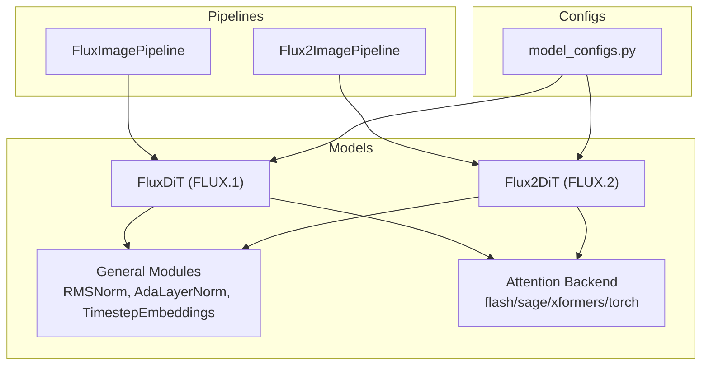
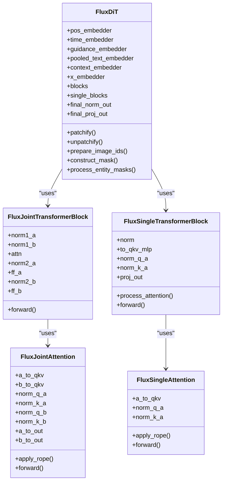
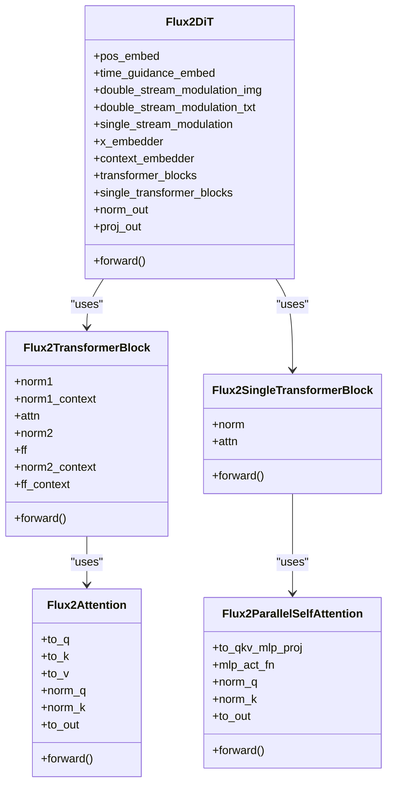
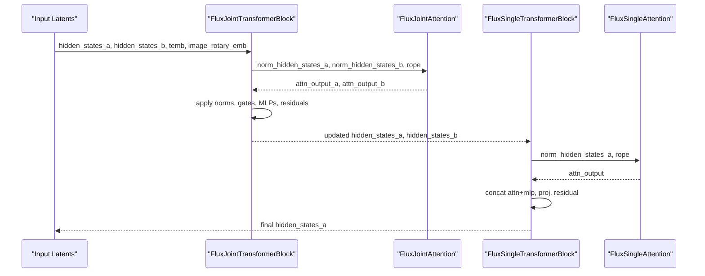
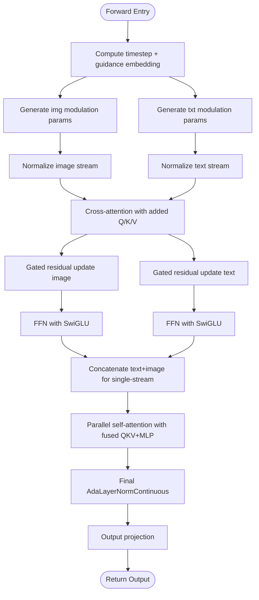
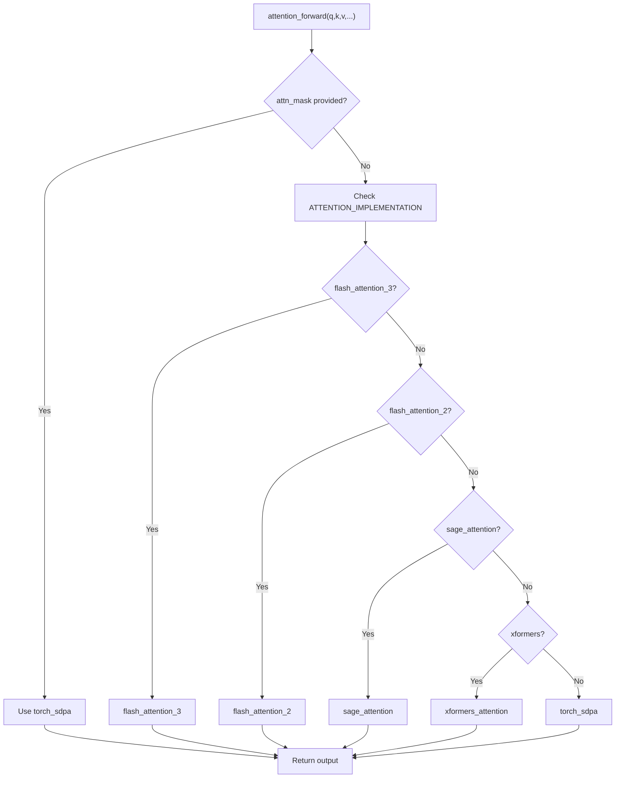
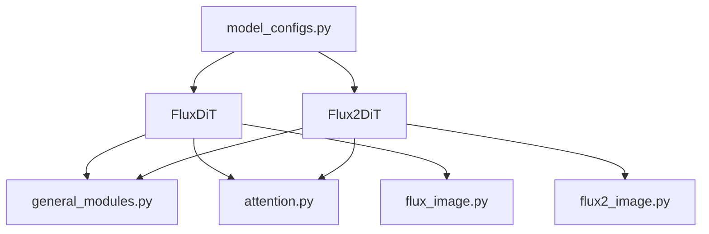

# DiT Components and Transformers

<cite>
**Referenced Files in This Document**
- [flux_dit.py](file://diffsynth/models/flux_dit.py)
- [flux2_dit.py](file://diffsynth/models/flux2_dit.py)
- [attention.py](file://diffsynth/core/attention/attention.py)
- [general_modules.py](file://diffsynth/models/general_modules.py)
- [model_configs.py](file://diffsynth/configs/model_configs.py)
- [FLUX.md](file://docs/en/Model_Details/FLUX.md)
- [FLUX2.md](file://docs/en/Model_Details/FLUX2.md)
- [flux_image.py](file://diffsynth/pipelines/flux_image.py)
- [flux2_image.py](file://diffsynth/pipelines/flux2_image.py)
</cite>

## Table of Contents
1. [Introduction](#introduction)
2. [Project Structure](#project-structure)
3. [Core Components](#core-components)
4. [Architecture Overview](#architecture-overview)
5. [Detailed Component Analysis](#detailed-component-analysis)
6. [Dependency Analysis](#dependency-analysis)
7. [Performance Considerations](#performance-considerations)
8. [Troubleshooting Guide](#troubleshooting-guide)
9. [Conclusion](#conclusion)
10. [Appendices](#appendices)

## Introduction
This document provides a comprehensive, code-grounded explanation of the FLUX Diffusion Transformer (DiT) components implemented in this repository. It covers transformer architecture, attention mechanisms, layer normalization, residual connections, and the differences between FLUX.1 and FLUX.2 DiT implementations. It also documents custom attention backends, memory-efficient operations, and optimization techniques, and includes guidance on how to instantiate and configure DiT blocks, modify attention heads, and extend transformer layers.

## Project Structure
The FLUX DiT components are primarily implemented under:
- diffsynth/models/flux_dit.py: FLUX.1 DiT with joint/single-stream transformer blocks and RoPE embeddings.
- diffsynth/models/flux2_dit.py: FLUX.2 DiT with double-stream and single-stream blocks, parallel self-attention, SwiGLU FFN, and advanced modulation.
- diffsynth/core/attention/attention.py: Unified attention backend selection and routing (FlashAttention 2/3, SageAttention, xFormers, torch SDPA).
- diffsynth/models/general_modules.py: Shared modules including timestep embeddings, RMSNorm, AdaLayerNorm variants.
- diffsynth/configs/model_configs.py: Model configuration entries for FLUX.1 and FLUX.2 series, including parameter overrides.
- diffsynth/pipelines/flux_image.py and flux2_image.py: High-level pipelines that orchestrate text encoders, VAEs, and DiTs.

**Diagram sources**
- [flux_dit.py:277-399](file://diffsynth/models/flux_dit.py#L277-L399)
- [flux2_dit.py:881-1054](file://diffsynth/models/flux2_dit.py#L881-L1054)
- [attention.py:108-122](file://diffsynth/core/attention/attention.py#L108-L122)
- [general_modules.py:80-147](file://diffsynth/models/general_modules.py#L80-L147)
- [model_configs.py:319-542](file://diffsynth/configs/model_configs.py#L319-L542)
- [flux_image.py:57-177](file://diffsynth/pipelines/flux_image.py#L57-L177)
- [flux2_image.py:21-71](file://diffsynth/pipelines/flux2_image.py#L21-L71)

**Section sources**
- [flux_dit.py:1-399](file://diffsynth/models/flux_dit.py#L1-L399)
- [flux2_dit.py:1-1054](file://diffsynth/models/flux2_dit.py#L1-L1054)
- [attention.py:1-122](file://diffsynth/core/attention/attention.py#L1-L122)
- [general_modules.py:1-147](file://diffsynth/models/general_modules.py#L1-L147)
- [model_configs.py:319-542](file://diffsynth/configs/model_configs.py#L319-L542)
- [flux_image.py:57-177](file://diffsynth/pipelines/flux_image.py#L57-L177)
- [flux2_image.py:21-71](file://diffsynth/pipelines/flux2_image.py#L21-L71)

## Core Components
- FluxDiT (FLUX.1):
  - Joint attention block mixing image and text tokens via concatenated Q/K/V streams.
  - Single-stream attention block for image-only tokens.
  - RoPE positional embeddings per axis; patchify/unpatchify for latent patches.
  - AdaLayerNorm and continuous modulation for conditioning.
- Flux2DiT (FLUX.2):
  - Double-stream transformer blocks with separate image and context streams, fused cross-attention.
  - Single-stream transformer blocks with parallel QKV+MLP projections and fused output projection.
  - Advanced RoPE generation and concatenation across text/image sequences.
  - Modulation networks producing shift/scale/gate parameters for each stream.
- Attention Backend:
  - Centralized attention_forward selects optimal backend based on availability and environment variables.
  - Supports FlashAttention 2/3, SageAttention, xFormers, and PyTorch SDPA.
- General Modules:
  - Timestep embeddings, RMSNorm, AdaLayerNorm variants used across both DiT versions.

**Section sources**
- [flux_dit.py:45-149](file://diffsynth/models/flux_dit.py#L45-L149)
- [flux_dit.py:152-259](file://diffsynth/models/flux_dit.py#L152-L259)
- [flux_dit.py:277-399](file://diffsynth/models/flux_dit.py#L277-L399)
- [flux2_dit.py:435-503](file://diffsynth/models/flux2_dit.py#L435-L503)
- [flux2_dit.py:560-631](file://diffsynth/models/flux2_dit.py#L560-L631)
- [flux2_dit.py:633-700](file://diffsynth/models/flux2_dit.py#L633-L700)
- [flux2_dit.py:702-793](file://diffsynth/models/flux2_dit.py#L702-L793)
- [flux2_dit.py:881-1054](file://diffsynth/models/flux2_dit.py#L881-L1054)
- [attention.py:108-122](file://diffsynth/core/attention/attention.py#L108-L122)
- [general_modules.py:80-147](file://diffsynth/models/general_modules.py#L80-L147)

## Architecture Overview
FLUX.1 uses a dual-path design:
- JointTransformerBlock processes concatenated image and text tokens with shared attention.
- SingleTransformerBlock processes image-only tokens with efficient self-attention.
- RoPE is applied to Q/K before scaled dot-product attention.
- AdaLayerNorm and continuous modulation inject time and guidance signals.

FLUX.2 introduces architectural improvements:
- Double-stream blocks maintain separate image and text streams with cross-attention and separate MLPs.
- Single-stream blocks fuse QKV and MLP input projections, then fuse output projections, reducing compute overhead.
- Modulation networks generate per-block shift/scale/gate parameters for both streams.
- RoPE is generated per-axis and concatenated across text/image tokens.

**Diagram sources**
- [flux_dit.py:277-399](file://diffsynth/models/flux_dit.py#L277-L399)
- [flux_dit.py:45-149](file://diffsynth/models/flux_dit.py#L45-L149)
- [flux_dit.py:152-259](file://diffsynth/models/flux_dit.py#L152-L259)

**Diagram sources**
- [flux2_dit.py:881-1054](file://diffsynth/models/flux2_dit.py#L881-L1054)
- [flux2_dit.py:702-793](file://diffsynth/models/flux2_dit.py#L702-L793)
- [flux2_dit.py:633-700](file://diffsynth/models/flux2_dit.py#L633-L700)
- [flux2_dit.py:435-503](file://diffsynth/models/flux2_dit.py#L435-L503)
- [flux2_dit.py:560-631](file://diffsynth/models/flux2_dit.py#L560-L631)

## Detailed Component Analysis

### FLUX.1 DiT: Joint and Single-Stream Blocks
- FluxJointAttention:
  - Projects image and text tokens into Q/K/V separately, normalizes Q/K with RMSNorm, concatenates streams, applies RoPE, and computes attention.
  - Supports optional IP-Adapter interaction by injecting additional features into image token outputs.
- FluxSingleAttention:
  - Processes image-only tokens with fused QKV projection, RMSNorm on Q/K, RoPE, and attention.
- FluxJointTransformerBlock:
  - Uses AdaLayerNorm to produce modulation parameters, applies joint attention, then two-layer MLPs with LayerNorm and residual connections.
- FluxSingleTransformerBlock:
  - Uses AdaLayerNormSingle to modulate, projects QKV and MLP inputs together, processes attention, applies GELU, concatenates outputs, and projects back with gating.

**Diagram sources**
- [flux_dit.py:108-149](file://diffsynth/models/flux_dit.py#L108-L149)
- [flux_dit.py:45-105](file://diffsynth/models/flux_dit.py#L45-L105)
- [flux_dit.py:205-259](file://diffsynth/models/flux_dit.py#L205-L259)
- [flux_dit.py:152-186](file://diffsynth/models/flux_dit.py#L152-L186)

**Section sources**
- [flux_dit.py:45-149](file://diffsynth/models/flux_dit.py#L45-L149)
- [flux_dit.py:152-259](file://diffsynth/models/flux_dit.py#L152-L259)
- [flux_dit.py:277-399](file://diffsynth/models/flux_dit.py#L277-L399)

### FLUX.2 DiT: Double-Stream and Parallel Self-Attention
- Flux2TransformerBlock:
  - Maintains separate image and context streams, applies modulation, performs cross-attention with added Q/K/V projections, and updates both streams with gated residuals and MLPs.
- Flux2SingleTransformerBlock:
  - Concatenates text and image tokens, applies modulation, runs parallel self-attention with fused QKV and MLP input projections, and fuses output projections.
- Flux2Attention and Flux2ParallelSelfAttention:
  - Provide modular attention processors supporting RoPE, QK normalization, and optional encoder-side projections.
- Modulation and Embeddings:
  - Flux2Modulation generates shift/scale/gate parameters per stream.
  - Flux2TimestepGuidanceEmbeddings combines timestep and guidance embeddings.

**Diagram sources**
- [flux2_dit.py:702-793](file://diffsynth/models/flux2_dit.py#L702-L793)
- [flux2_dit.py:633-700](file://diffsynth/models/flux2_dit.py#L633-L700)
- [flux2_dit.py:881-1054](file://diffsynth/models/flux2_dit.py#L881-L1054)

**Section sources**
- [flux2_dit.py:435-503](file://diffsynth/models/flux2_dit.py#L435-L503)
- [flux2_dit.py:560-631](file://diffsynth/models/flux2_dit.py#L560-L631)
- [flux2_dit.py:633-700](file://diffsynth/models/flux2_dit.py#L633-L700)
- [flux2_dit.py:702-793](file://diffsynth/models/flux2_dit.py#L702-L793)
- [flux2_dit.py:881-1054](file://diffsynth/models/flux2_dit.py#L881-L1054)

### Custom Attention Implementations and Memory-Efficient Operations
- attention_forward selects the best available backend:
  - FlashAttention 3 or 2 when installed.
  - SageAttention or xFormers if available.
  - Falls back to torch.nn.functional.scaled_dot_product_attention otherwise.
- The function supports pattern-based rearrangement for different tensor layouts and optional masks.

**Diagram sources**
- [attention.py:108-122](file://diffsynth/core/attention/attention.py#L108-L122)

**Section sources**
- [attention.py:1-122](file://diffsynth/core/attention/attention.py#L1-L122)

### Differences Between FLUX.1 and FLUX.2 DiT
- Architecture:
  - FLUX.1: Joint attention mixes image/text tokens; single-stream handles image-only tokens.
  - FLUX.2: Double-stream maintains separate image/text paths with cross-attention; single-stream fuses QKV and MLP projections for efficiency.
- Normalization and Modulation:
  - FLUX.1: AdaLayerNorm and AdaLayerNormSingle produce shift/scale/gate parameters.
  - FLUX.2: Flux2Modulation produces per-stream modulation parameters; separate modulation for double-stream image and text.
- Attention:
  - FLUX.1: Separate QKV projections per stream; RMSNorm on Q/K; RoPE applied before attention.
  - FLUX.2: Optional added Q/K/V for encoder side; QK normalization; RoPE applied per-axis and concatenated across streams.
- FFN:
  - FLUX.1: Two-layer MLP with GELU.
  - FLUX.2: SwiGLU-style activation with fused linear layers.
- Parameter Configurations:
  - FLUX.1 default: dim=3072, num_heads=24, num_blocks=19, single_blocks=38.
  - FLUX.2 configurable: attention_head_dim, num_attention_heads, num_layers, num_single_layers, mlp_ratio, axes_dims_rope, rope_theta, guidance_embeds.

**Section sources**
- [flux_dit.py:277-399](file://diffsynth/models/flux_dit.py#L277-L399)
- [flux2_dit.py:881-1054](file://diffsynth/models/flux2_dit.py#L881-L1054)
- [model_configs.py:319-542](file://diffsynth/configs/model_configs.py#L319-L542)

## Dependency Analysis
- FLUX.1 DiT depends on:
  - general_modules for timestep embeddings and normalization.
  - attention backend for efficient attention computation.
  - pipelines for orchestration and VRAM management.
- FLUX.2 DiT depends on:
  - general modules and attention backend similarly.
  - pipeline units for prompt embedding, image IDs, and noise initialization.
- Model configurations define instantiation parameters and state dict converters.

**Diagram sources**
- [flux_dit.py:277-399](file://diffsynth/models/flux_dit.py#L277-L399)
- [flux2_dit.py:881-1054](file://diffsynth/models/flux2_dit.py#L881-L1054)
- [attention.py:108-122](file://diffsynth/core/attention/attention.py#L108-L122)
- [general_modules.py:80-147](file://diffsynth/models/general_modules.py#L80-L147)
- [flux_image.py:57-177](file://diffsynth/pipelines/flux_image.py#L57-L177)
- [flux2_image.py:21-71](file://diffsynth/pipelines/flux2_image.py#L21-L71)
- [model_configs.py:319-542](file://diffsynth/configs/model_configs.py#L319-L542)

**Section sources**
- [flux_dit.py:277-399](file://diffsynth/models/flux_dit.py#L277-L399)
- [flux2_dit.py:881-1054](file://diffsynth/models/flux2_dit.py#L881-L1054)
- [attention.py:108-122](file://diffsynth/core/attention/attention.py#L108-L122)
- [general_modules.py:80-147](file://diffsynth/models/general_modules.py#L80-L147)
- [flux_image.py:57-177](file://diffsynth/pipelines/flux_image.py#L57-L177)
- [flux2_image.py:21-71](file://diffsynth/pipelines/flux2_image.py#L21-L71)
- [model_configs.py:319-542](file://diffsynth/configs/model_configs.py#L319-L542)

## Performance Considerations
- Attention Backend Selection:
  - Prefer FlashAttention 3/2 for speed and memory efficiency; fallback to xFormers or torch SDPA.
  - Environment variable DIFFSYNTH_ATTENTION_IMPLEMENTATION can force a specific backend.
- Gradient Checkpointing:
  - Both DiT implementations support gradient checkpointing to reduce memory usage during training.
- Parallel Projections:
  - FLUX.2’s parallel self-attention fuses QKV and MLP projections, reducing kernel launches and improving throughput.
- Modulation Efficiency:
  - Precomputing modulation parameters per timestep reduces repeated computations.
- VRAM Management:
  - Pipelines integrate VRAM-aware loading and offloading strategies for large models.

[No sources needed since this section provides general guidance]

## Troubleshooting Guide
- Attention Backend Issues:
  - If FlashAttention or xFormers are not installed, the system falls back to torch SDPA. Ensure dependencies are installed for optimal performance.
- Shape Mismatches:
  - Verify sequence lengths for text and image tokens; FLUX.2 requires consistent batch dimensions for concatenated streams.
- Modulation Parameters:
  - Ensure timestep and guidance tensors have correct shapes and dtypes; mismatches can cause broadcasting errors.
- VRAM Errors:
  - Enable VRAM management in pipelines and consider lower precision or tiling options for VAE stages.

**Section sources**
- [attention.py:1-122](file://diffsynth/core/attention/attention.py#L1-L122)
- [flux2_dit.py:966-1054](file://diffsynth/models/flux2_dit.py#L966-L1054)
- [flux_image.py:57-177](file://diffsynth/pipelines/flux_image.py#L57-L177)
- [flux2_image.py:21-71](file://diffsynth/pipelines/flux2_image.py#L21-L71)

## Conclusion
FLUX.1 and FLUX.2 DiT implementations provide robust transformer architectures for diffusion modeling. FLUX.1 emphasizes joint attention and single-stream processing with flexible modulation, while FLUX.2 advances efficiency through parallel projections, double-stream separation, and optimized attention backends. The unified attention backend ensures compatibility and performance across hardware configurations. Proper configuration and understanding of these components enable effective customization and extension of DiT blocks for research and production use.

[No sources needed since this section summarizes without analyzing specific files]

## Appendices

### How to Instantiate and Configure DiT Blocks
- FLUX.1 DiT:
  - Instantiate via model configs; adjust input_dim and num_blocks as needed.
  - Modify attention heads by changing num_attention_heads in block constructors.
- FLUX.2 DiT:
  - Configure attention_head_dim, num_attention_heads, num_layers, num_single_layers, and mlp_ratio.
  - Toggle guidance_embeds for models without guidance conditioning.

**Section sources**
- [model_configs.py:319-542](file://diffsynth/configs/model_configs.py#L319-L542)
- [flux_dit.py:277-399](file://diffsynth/models/flux_dit.py#L277-L399)
- [flux2_dit.py:881-1054](file://diffsynth/models/flux2_dit.py#L881-L1054)

### Code Examples for Custom Transformer Layers
- To add a custom attention head:
  - Replace the attention module in FluxJointAttention or FluxSingleAttention with a custom implementation that follows the same interface.
- To implement a custom FFN:
  - Substitute the MLP in FluxJointTransformerBlock or Flux2TransformerBlock with a new module using similar normalization and residual patterns.

[No sources needed since this section provides general guidance]