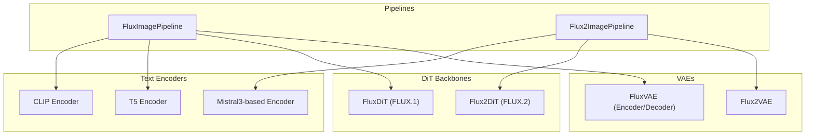
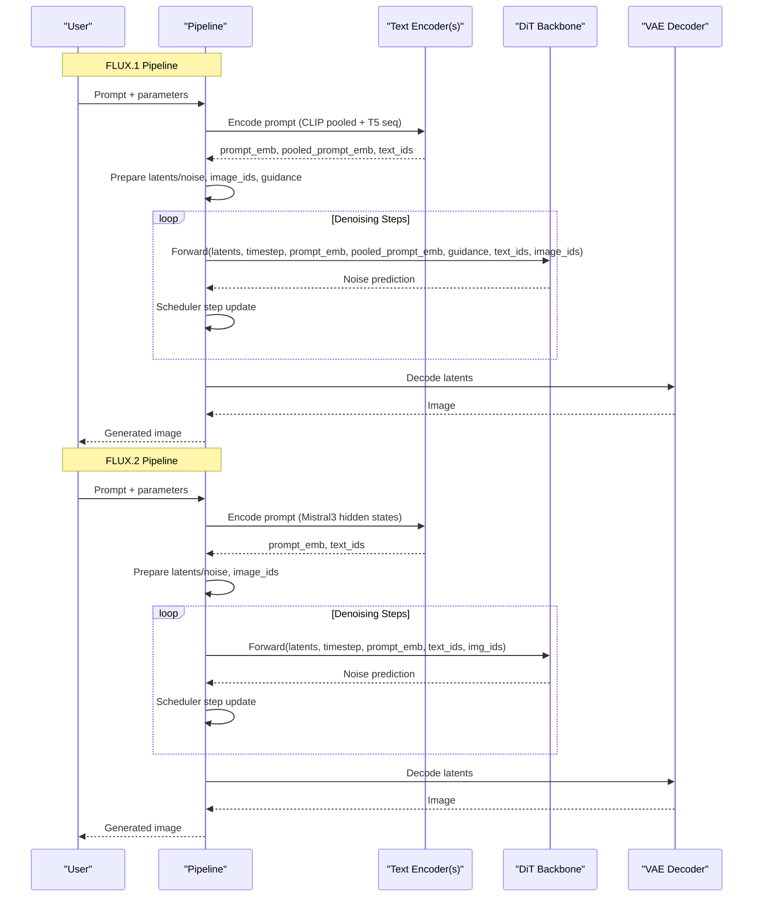
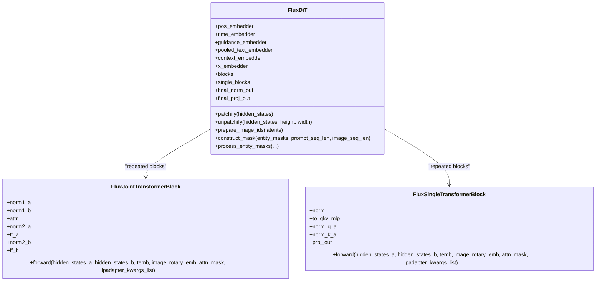
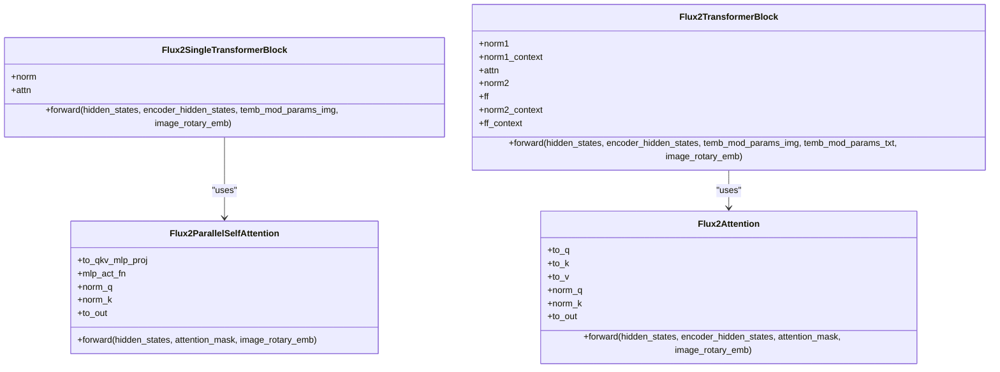
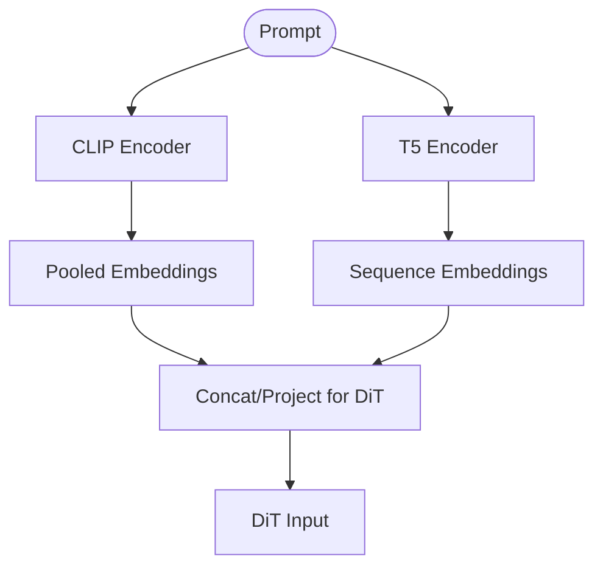
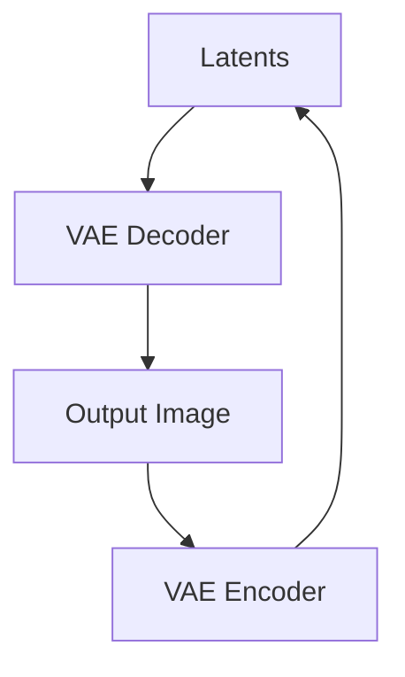
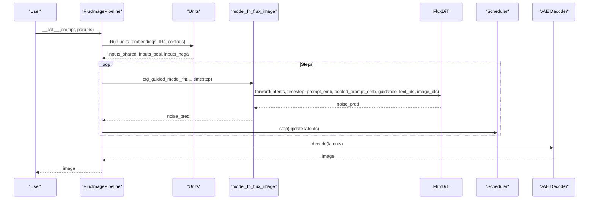
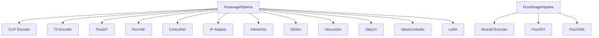

# FLUX Architecture Overview

<cite>
**Referenced Files in This Document**
- [flux_dit.py](file://diffsynth/models/flux_dit.py)
- [flux2_dit.py](file://diffsynth/models/flux2_dit.py)
- [flux_image.py](file://diffsynth/pipelines/flux_image.py)
- [flux2_image.py](file://diffsynth/pipelines/flux2_image.py)
- [flux_text_encoder_clip.py](file://diffsynth/models/flux_text_encoder_clip.py)
- [flux_text_encoder_t5.py](file://diffsynth/models/flux_text_encoder_t5.py)
- [flux_vae.py](file://diffsynth/models/flux_vae.py)
- [flux2_text_encoder.py](file://diffsynth/models/flux2_text_encoder.py)
- [flux2_vae.py](file://diffsynth/models/flux2_vae.py)
- [FLUX.md](file://docs/en/Model_Details/FLUX.md)
- [FLUX2.md](file://docs/en/Model_Details/FLUX2.md)
</cite>

## Table of Contents
1. Introduction
2. Project Structure
3. Core Components
4. Architecture Overview
5. Detailed Component Analysis
6. Dependency Analysis
7. Performance Considerations
8. Troubleshooting Guide
9. Conclusion

## Introduction
This document explains the FLUX models in ODTSR-edit with a focus on architecture, design principles, and data flow from text prompts through diffusion to image generation. It contrasts FLUX.1 and FLUX.2 architectures, details the DiT (Diffusion Transformer) blocks and attention mechanisms, and shows how text encoders and VAE components integrate into the pipelines. It also covers performance characteristics, memory usage patterns, and scalability considerations.

## Project Structure
The FLUX implementations are organized around:
- Pipelines that orchestrate inference steps and manage model loading
- DiT backbones for FLUX.1 and FLUX.2
- Text encoders (CLIP/T5 for FLUX.1; Mistral3-based for FLUX.2)
- VAEs for encoding/decoding latent space

**Diagram sources**
- [flux_image.py:57-106](file://diffsynth/pipelines/flux_image.py#L57-L106)
- [flux2_image.py:21-46](file://diffsynth/pipelines/flux2_image.py#L21-L46)
- [flux_dit.py:277-298](file://diffsynth/models/flux_dit.py#L277-L298)
- [flux2_dit.py:633-793](file://diffsynth/models/flux2_dit.py#L633-L793)
- [flux_text_encoder_clip.py:75-113](file://diffsynth/models/flux_text_encoder_clip.py#L75-L113)
- [flux_text_encoder_t5.py:5-44](file://diffsynth/models/flux_text_encoder_t5.py#L5-L44)
- [flux2_text_encoder.py:4-58](file://diffsynth/models/flux2_text_encoder.py#L4-L58)
- [flux_vae.py:296-435](file://diffsynth/models/flux_vae.py#L296-L435)
- [flux2_vae.py:1-120](file://diffsynth/models/flux2_vae.py#L1-L120)

**Section sources**
- [FLUX.md:53-146](file://docs/en/Model_Details/FLUX.md#L53-L146)
- [FLUX2.md:60-98](file://docs/en/Model_Details/FLUX2.md#L60-L98)

## Core Components
- FluxImagePipeline orchestrates FLUX.1 inference with units for prompt embedding, noise initialization, control signals (ControlNet, IP-Adapter), entity control, and more. It uses FlowMatchScheduler and integrates CLIP and T5 text encoders with FluxDiT and FluxVAE.
- Flux2ImagePipeline orchestrates FLUX.2 inference using a single text encoder (Mistral3-based), Flux2DiT, and Flux2VAE. It supports edit latents and different positional ID schemes.
- FluxDiT implements joint and single transformer blocks with RoPE embeddings, AdaLayerNorm variants, and patch/unpatch operations.
- Flux2DiT provides parallel self-attention blocks and fused QKV/MLP projections, with SwiGLU-style activations and advanced attention processors.
- Text encoders: CLIP pooled output plus T5 sequence outputs for FLUX.1; Mistral3 hidden states stacked for FLUX.2.
- VAEs: FLUX.1 uses separate encoder/decoder with tiled inference support; FLUX.2 uses a unified VAE module with extensive normalization and attention options.

**Section sources**
- [flux_image.py:57-106](file://diffsynth/pipelines/flux_image.py#L57-L106)
- [flux2_image.py:21-46](file://diffsynth/pipelines/flux2_image.py#L21-L46)
- [flux_dit.py:277-298](file://diffsynth/models/flux_dit.py#L277-L298)
- [flux2_dit.py:633-793](file://diffsynth/models/flux2_dit.py#L633-L793)
- [flux_text_encoder_clip.py:75-113](file://diffsynth/models/flux_text_encoder_clip.py#L75-L113)
- [flux_text_encoder_t5.py:5-44](file://diffsynth/models/flux_text_encoder_t5.py#L5-L44)
- [flux2_text_encoder.py:4-58](file://diffsynth/models/flux2_text_encoder.py#L4-L58)
- [flux_vae.py:296-435](file://diffsynth/models/flux_vae.py#L296-L435)
- [flux2_vae.py:1-120](file://diffsynth/models/flux2_vae.py#L1-L120)

## Architecture Overview
High-level data flow for FLUX.1 and FLUX.2:

**Diagram sources**
- [flux_image.py:180-291](file://diffsynth/pipelines/flux_image.py#L180-L291)
- [flux2_image.py:74-139](file://diffsynth/pipelines/flux2_image.py#L74-L139)
- [flux_dit.py:277-298](file://diffsynth/models/flux_dit.py#L277-L298)
- [flux2_dit.py:633-793](file://diffsynth/models/flux2_dit.py#L633-L793)
- [flux_vae.py:296-366](file://diffsynth/models/flux_vae.py#L296-L366)
- [flux2_vae.py:1-120](file://diffsynth/models/flux2_vae.py#L1-L120)

## Detailed Component Analysis

### FLUX.1 DiT (FluxDiT)
- Joint and Single Transformer Blocks:
  - FluxJointTransformerBlock processes two streams (e.g., text and image) via joint attention with RoPE and AdaLayerNorm conditioning.
  - FluxSingleTransformerBlock handles image-only stream with parallelized QKV/MLP projection and gated outputs.
- Positional Encoding:
  - RoPEEmbedding constructs multi-axis rotary embeddings for spatial positions.
- Patching:
  - patchify/unpatchify convert between patch tokens and latent grids.
- Entity Control and Masks:
  - construct_mask builds attention masks for multiple entities and global context.
- Conditioning:
  - Time and guidance embeddings via TimestepEmbeddings; pooled text embedder projects CLIP pooled features.

**Diagram sources**
- [flux_dit.py:108-149](file://diffsynth/models/flux_dit.py#L108-L149)
- [flux_dit.py:205-259](file://diffsynth/models/flux_dit.py#L205-L259)
- [flux_dit.py:277-298](file://diffsynth/models/flux_dit.py#L277-L298)

**Section sources**
- [flux_dit.py:45-105](file://diffsynth/models/flux_dit.py#L45-L105)
- [flux_dit.py:152-186](file://diffsynth/models/flux_dit.py#L152-L186)
- [flux_dit.py:277-298](file://diffsynth/models/flux_dit.py#L277-L298)
- [flux_dit.py:299-387](file://diffsynth/models/flux_dit.py#L299-L387)

### FLUX.2 DiT (Flux2DiT)
- Attention Modules:
  - Flux2Attention with optional added KV projections and RMSNorm on Q/K.
  - Flux2ParallelSelfAttention fuses QKV and MLP input/output projections for efficiency.
- Transformers:
  - Flux2SingleTransformerBlock applies modulation parameters and parallel attention.
  - Flux2TransformerBlock combines image and text streams with separate norms and FFNs.
- Activations:
  - Flux2SwiGLU and Flux2FeedForward use fused linear layers and SiLU gating.
- Rotary Embeddings:
  - get_1d_rotary_pos_embed and apply_rotary_emb provide flexible RoPE computation.

**Diagram sources**
- [flux2_dit.py:435-503](file://diffsynth/models/flux2_dit.py#L435-L503)
- [flux2_dit.py:560-631](file://diffsynth/models/flux2_dit.py#L560-L631)
- [flux2_dit.py:633-700](file://diffsynth/models/flux2_dit.py#L633-L700)
- [flux2_dit.py:702-793](file://diffsynth/models/flux2_dit.py#L702-L793)

**Section sources**
- [flux2_dit.py:325-365](file://diffsynth/models/flux2_dit.py#L325-L365)
- [flux2_dit.py:367-433](file://diffsynth/models/flux2_dit.py#L367-L433)
- [flux2_dit.py:505-558](file://diffsynth/models/flux2_dit.py#L505-L558)
- [flux2_dit.py:633-793](file://diffsynth/models/flux2_dit.py#L633-L793)

### Text Encoders
- FLUX.1:
  - CLIP encoder produces pooled embeddings and optionally hidden states.
  - T5 encoder returns sequence embeddings for long-context prompts.
- FLUX.2:
  - Mistral3-based encoder stacks intermediate hidden states across selected layers to form rich prompt representations.

**Diagram sources**
- [flux_text_encoder_clip.py:75-113](file://diffsynth/models/flux_text_encoder_clip.py#L75-L113)
- [flux_text_encoder_t5.py:5-44](file://diffsynth/models/flux_text_encoder_t5.py#L5-L44)
- [flux2_text_encoder.py:4-58](file://diffsynth/models/flux2_text_encoder.py#L4-L58)

**Section sources**
- [flux_text_encoder_clip.py:75-113](file://diffsynth/models/flux_text_encoder_clip.py#L75-L113)
- [flux_text_encoder_t5.py:5-44](file://diffsynth/models/flux_text_encoder_t5.py#L5-L44)
- [flux2_text_encoder.py:4-58](file://diffsynth/models/flux2_text_encoder.py#L4-L58)

### VAE Components
- FLUX.1 VAE:
  - Separate encoder and decoder with GroupNorm, ResnetBlocks, and attention blocks.
  - Supports tiled inference to reduce VRAM usage during encoding/decoding.
- FLUX.2 VAE:
  - Comprehensive module with ResnetBlock2D, Downsample2D, Upsample2D, and attention layers.
  - Extensive normalization options and activation mappings.

**Diagram sources**
- [flux_vae.py:296-366](file://diffsynth/models/flux_vae.py#L296-L366)
- [flux_vae.py:368-435](file://diffsynth/models/flux_vae.py#L368-L435)
- [flux2_vae.py:1-120](file://diffsynth/models/flux2_vae.py#L1-L120)

**Section sources**
- [flux_vae.py:296-435](file://diffsynth/models/flux_vae.py#L296-L435)
- [flux2_vae.py:1-120](file://diffsynth/models/flux2_vae.py#L1-L120)

### Pipeline Orchestration
- FLUX.1 Pipeline:
  - Units handle shape checking, noise initialization, prompt embedding (CLIP+T5), image IDs, guidance, Kontext, ControlNet, IP-Adapter, entity control, NexusGen, TeaCache, Flex, Step1X, ValueControl, LoRA encode.
  - Iterative denoising loop calls model_fn_flux_image which feeds DiT with all conditioning.
- FLUX.2 Pipeline:
  - Units handle shape checking, prompt embedding (Mistral3 or Qwen3), noise initialization, input/edit image embedding, and image IDs.
  - Iterative denoising loop calls model_fn_flux2 which concatenates edit latents if provided.

**Diagram sources**
- [flux_image.py:180-291](file://diffsynth/pipelines/flux_image.py#L180-L291)
- [flux_image.py:336-395](file://diffsynth/pipelines/flux_image.py#L336-L395)
- [flux_image.py:417-444](file://diffsynth/pipelines/flux_image.py#L417-L444)
- [flux_image.py:447-487](file://diffsynth/pipelines/flux_image.py#L447-L487)
- [flux_image.py:490-516](file://diffsynth/pipelines/flux_image.py#L490-L516)
- [flux_image.py:519-609](file://diffsynth/pipelines/flux_image.py#L519-L609)
- [flux_image.py:611-665](file://diffsynth/pipelines/flux_image.py#L611-L665)
- [flux_image.py:667-693](file://diffsynth/pipelines/flux_image.py#L667-L693)
- [flux_image.py:695-704](file://diffsynth/pipelines/flux_image.py#L695-L704)
- [flux_image.py:705-741](file://diffsynth/pipelines/flux_image.py#L705-L741)
- [flux_image.py:744-758](file://diffsynth/pipelines/flux_image.py#L744-L758)
- [flux_image.py:761-789](file://diffsynth/pipelines/flux_image.py#L761-L789)

**Section sources**
- [flux_image.py:57-106](file://diffsynth/pipelines/flux_image.py#L57-L106)
- [flux_image.py:180-291](file://diffsynth/pipelines/flux_image.py#L180-L291)
- [flux2_image.py:74-139](file://diffsynth/pipelines/flux2_image.py#L74-L139)

## Dependency Analysis
- FLUX.1 depends on:
  - Two text encoders (CLIP and T5)
  - FluxDiT with joint/single blocks
  - FluxVAE encoder/decoder
  - Optional modules: ControlNet, IP-Adapter, InfiniteYou, EliGen, NexusGen, Step1X, ValueController, LoRA
- FLUX.2 depends on:
  - Single Mistral3-based text encoder
  - Flux2DiT with parallel attention and fused projections
  - Flux2VAE

**Diagram sources**
- [flux_image.py:57-106](file://diffsynth/pipelines/flux_image.py#L57-L106)
- [flux2_image.py:21-46](file://diffsynth/pipelines/flux2_image.py#L21-L46)

**Section sources**
- [FLUX.md:53-146](file://docs/en/Model_Details/FLUX.md#L53-L146)
- [FLUX2.md:60-98](file://docs/en/Model_Details/FLUX2.md#L60-L98)

## Performance Considerations
- Memory Usage Patterns:
  - FLUX.1 VAE supports tiled inference to reduce peak VRAM during encoding/decoding.
  - FLUX.2 VAE includes extensive normalization and attention options that can be tuned for memory/performance trade-offs.
  - Both pipelines support gradient checkpointing and VRAM management strategies (offload/onload).
- Attention Efficiency:
  - FLUX.2 uses fused QKV/MLP projections and parallel attention to reduce compute overhead.
  - FLUX.1 employs joint attention with RoPE and optional IP-Adapter integration.
- Scalability:
  - FLUX.2’s Mistral3-based encoder stacks intermediate hidden states for richer representations but increases memory.
  - FLUX.1’s dual encoders (CLIP+T5) allow flexible context length tuning via T5 sequence length.
- Scheduler and Steps:
  - FlowMatchScheduler is used in both pipelines; number of steps impacts quality vs speed.
  - CFG guidance doubles compute when enabled.

[No sources needed since this section provides general guidance]

## Troubleshooting Guide
- Insufficient VRAM:
  - Enable tiled VAE inference for FLUX.1.
  - Use low VRAM configurations and VRAM management settings as documented in examples.
- Long Prompts:
  - Adjust T5 sequence length for FLUX.1 to balance context and memory.
  - For FLUX.2, ensure tokenizer and encoder configs match expected max lengths.
- Attention Errors:
  - Ensure PyTorch version supports scaled_dot_product_attention for FLUX.2 processors.
- Model Loading:
  - Verify model_configs and origin_file_pattern match repository structure.

**Section sources**
- [flux_vae.py:333-343](file://diffsynth/models/flux_vae.py#L333-L343)
- [flux2_dit.py:367-374](file://diffsynth/models/flux2_dit.py#L367-L374)
- [FLUX.md:106-146](file://docs/en/Model_Details/FLUX.md#L106-L146)
- [FLUX2.md:77-98](file://docs/en/Model_Details/FLUX2.md#L77-L98)

## Conclusion
FLUX.1 and FLUX.2 represent two generations of DiT-based image generation models within ODTSR-edit. FLUX.1 leverages dual text encoders and joint/single transformer blocks with robust control integrations, while FLUX.2 advances efficiency and representation power through fused projections, parallel attention, and a Mistral3-based encoder. The pipelines orchestrate these components with modular units, enabling flexible conditioning and scalable inference. Proper configuration of tiling, VRAM management, and attention backends ensures optimal performance across diverse hardware constraints.