# FLUX Models

<cite>
**Referenced Files in This Document**
- [flux_dit.py](file://diffsynth/models/flux_dit.py)
- [flux2_dit.py](file://diffsynth/models/flux2_dit.py)
- [flux_image.py](file://diffsynth/pipelines/flux_image.py)
- [flux2_image.py](file://diffsynth/pipelines/flux2_image.py)
- [flux_text_encoder_clip.py](file://diffsynth/models/flux_text_encoder_clip.py)
- [flux_text_encoder_t5.py](file://diffsynth/models/flux_text_encoder_t5.py)
- [flux_vae.py](file://diffsynth/models/flux_vae.py)
- [flux_controlnet.py](file://diffsynth/models/flux_controlnet.py)
- [flux_ipadapter.py](file://diffsynth/models/flux_ipadapter.py)
- [flux_infiniteyou.py](file://diffsynth/models/flux_infiniteyou.py)
- [flux_lora_encoder.py](file://diffsynth/models/flux_lora_encoder.py)
- [flux_lora_patcher.py](file://diffsynth/models/flux_lora_patcher.py)
</cite>

## Table of Contents
1. [Introduction](#introduction)
2. [Project Structure](#project-structure)
3. [Core Components](#core-components)
4. [Architecture Overview](#architecture-overview)
5. [Detailed Component Analysis](#detailed-component-analysis)
6. [Dependency Analysis](#dependency-analysis)
7. [Performance Considerations](#performance-considerations)
8. [Troubleshooting Guide](#troubleshooting-guide)
9. [Conclusion](#conclusion)
10. [Appendices](#appendices)

## Introduction
This document provides comprehensive documentation for the FLUX model implementations in ODTSR-edit, covering both FLUX.1 and FLUX.2 architectures. It explains DiT components, text encoders (CLIP and T5), VAE components, ControlNet integration, IP-Adapter support for image prompting, InfiniteYou capabilities for personalized generation, and LoRA encoder functionality. It also details the pipeline architecture for image generation, parameter configurations, and performance optimization techniques, with practical examples of inference using different control mechanisms and fine-tuning approaches.

## Project Structure
The FLUX implementation is organized into:
- Models: DiT backbones, text encoders, VAEs, ControlNet, IP-Adapter, InfiniteYou, and LoRA modules
- Pipelines: orchestration of units for prompt embedding, conditioning, denoising, and decoding
- Utilities: VRAM management, attention backends, gradient checkpointing, and LORA loaders

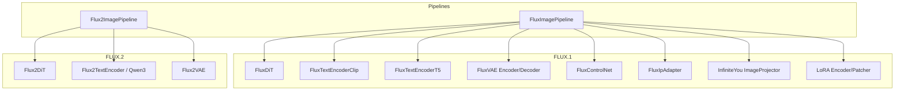

**Diagram sources**
- [flux_image.py:57-177](file://diffsynth/pipelines/flux_image.py#L57-L177)
- [flux2_image.py:21-71](file://diffsynth/pipelines/flux2_image.py#L21-L71)
- [flux_dit.py:277-399](file://diffsynth/models/flux_dit.py#L277-L399)
- [flux2_dit.py:435-800](file://diffsynth/models/flux2_dit.py#L435-L800)
- [flux_text_encoder_clip.py:75-113](file://diffsynth/models/flux_text_encoder_clip.py#L75-L113)
- [flux_text_encoder_t5.py:5-44](file://diffsynth/models/flux_text_encoder_t5.py#L5-L44)
- [flux_vae.py:296-452](file://diffsynth/models/flux_vae.py#L296-L452)
- [flux_controlnet.py:61-156](file://diffsynth/models/flux_controlnet.py#L61-L156)
- [flux_ipadapter.py:66-111](file://diffsynth/models/flux_ipadapter.py#L66-L111)
- [flux_infiniteyou.py:76-130](file://diffsynth/models/flux_infiniteyou.py#L76-L130)
- [flux_lora_encoder.py:485-522](file://diffsynth/models/flux_lora_encoder.py#L485-L522)
- [flux_lora_patcher.py:273-307](file://diffsynth/models/flux_lora_patcher.py#L273-L307)

**Section sources**
- [flux_image.py:57-177](file://diffsynth/pipelines/flux_image.py#L57-L177)
- [flux2_image.py:21-71](file://diffsynth/pipelines/flux2_image.py#L21-L71)

## Core Components
- FLUX.1 DiT: Joint and single transformer blocks with RoPE embeddings, AdaLayerNorm variants, and patchify/unpatchify operations. Supports entity masks, Kontext latents, and IP-Adapter injection via scaled dot-product attention.
- FLUX.2 DiT: Parallel self-attention blocks with fused QKV+MLP projections, SwiGLU activations, and efficient attention processors. Uses separate text/image streams with modulation parameters.
- Text Encoders: CLIP-based pooled embeddings and T5 sequence embeddings for FLUX.1; Mistral/Qwen3-style tokenization and multi-layer hidden states for FLUX.2.
- VAE: Encoder/decoder with tiled inference support to reduce memory usage during large-image processing.
- ControlNet: Adds condition-specific residual stacks aligned to DiT blocks, supporting multiple modes and inpainting masks.
- IP-Adapter: SigLIP vision encoder + MLP projector producing per-block K/V tokens injected into attention.
- InfiniteYou: Perceiver-style image projector enabling personalized identity guidance.
- LoRA: Encoder transforms LoRA weights into embeddings; patcher merges LoRA outputs with base outputs via gated fusion.

**Section sources**
- [flux_dit.py:45-149](file://diffsynth/models/flux_dit.py#L45-L149)
- [flux2_dit.py:325-631](file://diffsynth/models/flux2_dit.py#L325-L631)
- [flux_text_encoder_clip.py:75-113](file://diffsynth/models/flux_text_encoder_clip.py#L75-L113)
- [flux_text_encoder_t5.py:5-44](file://diffsynth/models/flux_text_encoder_t5.py#L5-L44)
- [flux_vae.py:296-452](file://diffsynth/models/flux_vae.py#L296-L452)
- [flux_controlnet.py:61-156](file://diffsynth/models/flux_controlnet.py#L61-L156)
- [flux_ipadapter.py:66-111](file://diffsynth/models/flux_ipadapter.py#L66-L111)
- [flux_infiniteyou.py:76-130](file://diffsynth/models/flux_infiniteyou.py#L76-L130)
- [flux_lora_encoder.py:485-522](file://diffsynth/models/flux_lora_encoder.py#L485-L522)
- [flux_lora_patcher.py:273-307](file://diffsynth/models/flux_lora_patcher.py#L273-L307)

## Architecture Overview
The pipelines orchestrate a modular unit chain that prepares inputs, embeds prompts/images, applies control signals, runs iterative denoising, and decodes final images.

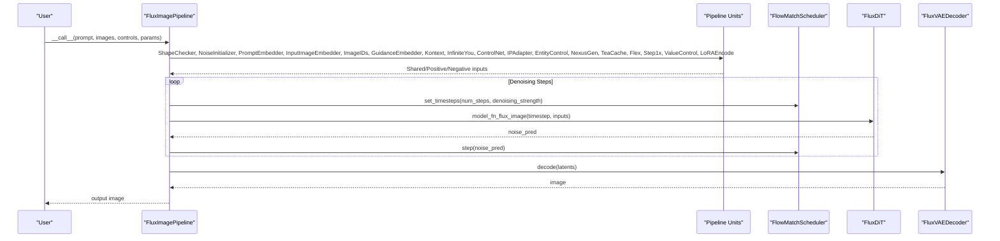

**Diagram sources**
- [flux_image.py:180-291](file://diffsynth/pipelines/flux_image.py#L180-L291)
- [flux_dit.py:277-399](file://diffsynth/models/flux_dit.py#L277-L399)
- [flux_vae.py:296-366](file://diffsynth/models/flux_vae.py#L296-L366)

**Section sources**
- [flux_image.py:180-291](file://diffsynth/pipelines/flux_image.py#L180-L291)

## Detailed Component Analysis

### FLUX.1 DiT (Diffusion Transformer)
- JointTransformerBlock: Dual-stream attention for text and image sequences, with RoPE and optional IP-Adapter injection.
- SingleTransformerBlock: Single-stream attention with fused QKV+MLP projection and gating.
- Positional Encoding: RoPE with axis-specific dimensions for spatial layout.
- Patchify/Unpatchify: Converts latent grids to patches for transformer input.
- Entity Control: Constructs attention masks based on entity masks to restrict cross-attention between regions.

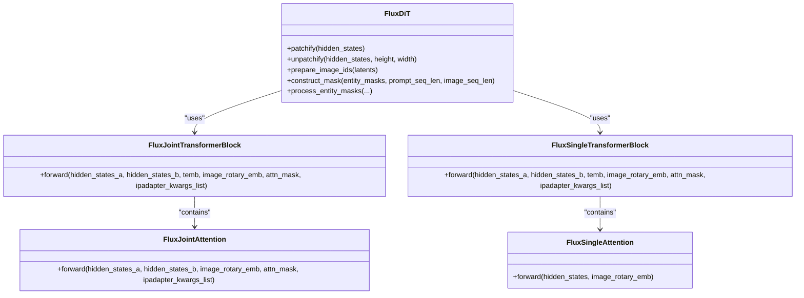

**Diagram sources**
- [flux_dit.py:45-149](file://diffsynth/models/flux_dit.py#L45-L149)
- [flux_dit.py:152-259](file://diffsynth/models/flux_dit.py#L152-L259)
- [flux_dit.py:277-399](file://diffsynth/models/flux_dit.py#L277-L399)

**Section sources**
- [flux_dit.py:45-149](file://diffsynth/models/flux_dit.py#L45-L149)
- [flux_dit.py:152-259](file://diffsynth/models/flux_dit.py#L152-L259)
- [flux_dit.py:277-399](file://diffsynth/models/flux_dit.py#L277-L399)

### FLUX.2 DiT
- Attention Processor: Efficient SDPA-based attention with QK normalization and optional added KV from encoder.
- Parallel Self-Attention: Fused QKV and MLP projections for speed and memory efficiency.
- FeedForward: SwiGLU activation with fused linear layers.
- Transformer Blocks: Separate image and context streams with modulation parameters for adaptive scaling/shifting/gating.

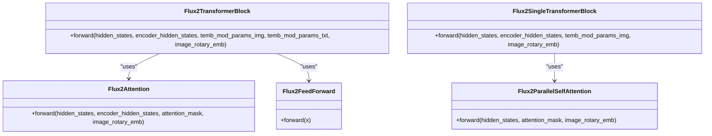

**Diagram sources**
- [flux2_dit.py:435-503](file://diffsynth/models/flux2_dit.py#L435-L503)
- [flux2_dit.py:560-631](file://diffsynth/models/flux2_dit.py#L560-L631)
- [flux2_dit.py:325-365](file://diffsynth/models/flux2_dit.py#L325-L365)
- [flux2_dit.py:702-793](file://diffsynth/models/flux2_dit.py#L702-L793)
- [flux2_dit.py:633-700](file://diffsynth/models/flux2_dit.py#L633-L700)

**Section sources**
- [flux2_dit.py:435-800](file://diffsynth/models/flux2_dit.py#L435-L800)

### Text Encoders (CLIP and T5)
- CLIP Encoder: Token embeddings, positional embeddings, stacked encoder layers with attention and FFN, returns pooled and last hidden states.
- T5 Encoder: Configured T5 encoder returning sequence embeddings for long-context prompts.

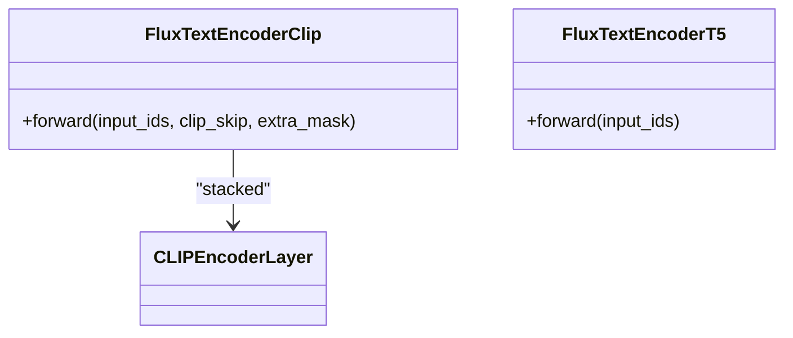

**Diagram sources**
- [flux_text_encoder_clip.py:75-113](file://diffsynth/models/flux_text_encoder_clip.py#L75-L113)
- [flux_text_encoder_t5.py:5-44](file://diffsynth/models/flux_text_encoder_t5.py#L5-L44)

**Section sources**
- [flux_text_encoder_clip.py:75-113](file://diffsynth/models/flux_text_encoder_clip.py#L75-L113)
- [flux_text_encoder_t5.py:5-44](file://diffsynth/models/flux_text_encoder_t5.py#L5-L44)

### VAE Components
- Encoder: Multi-scale downsampling with ResNet blocks and attention, outputs 16-channel latents with scaling and shifting.
- Decoder: Upsampling path with attention and ResNet blocks, supports tiled forward for low VRAM.

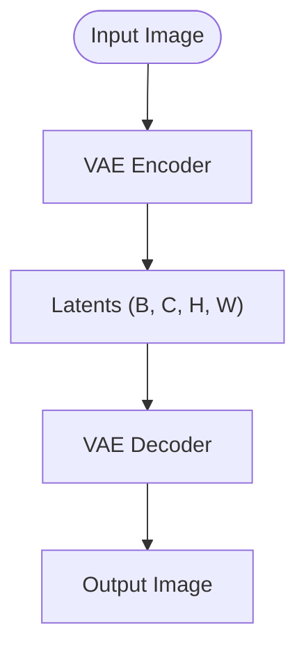

**Diagram sources**
- [flux_vae.py:368-452](file://diffsynth/models/flux_vae.py#L368-L452)
- [flux_vae.py:296-366](file://diffsynth/models/flux_vae.py#L296-L366)

**Section sources**
- [flux_vae.py:296-452](file://diffsynth/models/flux_vae.py#L296-L452)

### ControlNet Integration
- Condition Processing: Encodes control images through VAE encoder, optionally concatenates inpaint mask channels.
- Residual Stacks: Produces joint and single residual stacks aligned to DiT blocks, with mode embedding for different control types.

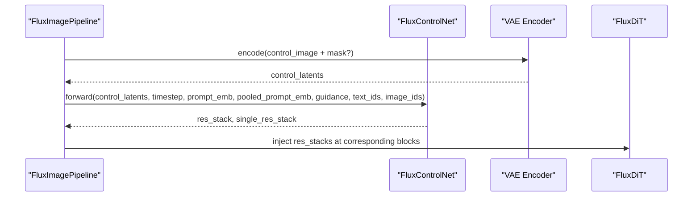

**Diagram sources**
- [flux_controlnet.py:61-156](file://diffsynth/models/flux_controlnet.py#L61-L156)
- [flux_image.py:447-487](file://diffsynth/pipelines/flux_image.py#L447-L487)

**Section sources**
- [flux_controlnet.py:61-156](file://diffsynth/models/flux_controlnet.py#L61-L156)
- [flux_image.py:447-487](file://diffsynth/pipelines/flux_image.py#L447-L487)

### IP-Adapter Support
- Image Encoder: SigLIP vision model extracts pooled features.
- MLP Projector: Projects features into per-block K/V tokens.
- Injection: Scaled dot-product attention adds IP-Adapter contributions to hidden states.

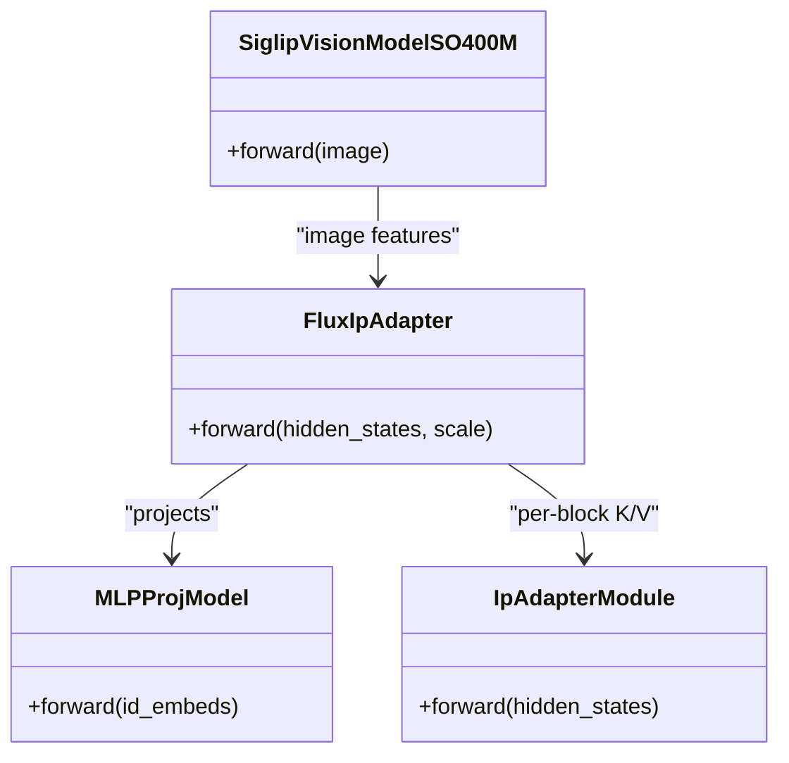

**Diagram sources**
- [flux_ipadapter.py:6-42](file://diffsynth/models/flux_ipadapter.py#L6-L42)
- [flux_ipadapter.py:43-89](file://diffsynth/models/flux_ipadapter.py#L43-L89)

**Section sources**
- [flux_ipadapter.py:66-111](file://diffsynth/models/flux_ipadapter.py#L66-L111)
- [flux_image.py:490-516](file://diffsynth/pipelines/flux_image.py#L490-L516)

### InfiniteYou Capabilities
- Image Projector: Perceiver-style architecture with learnable queries and attention layers to produce identity embeddings.
- Pipeline Unit: Prepares identity embeddings and guidance scaling for DiT modulation.

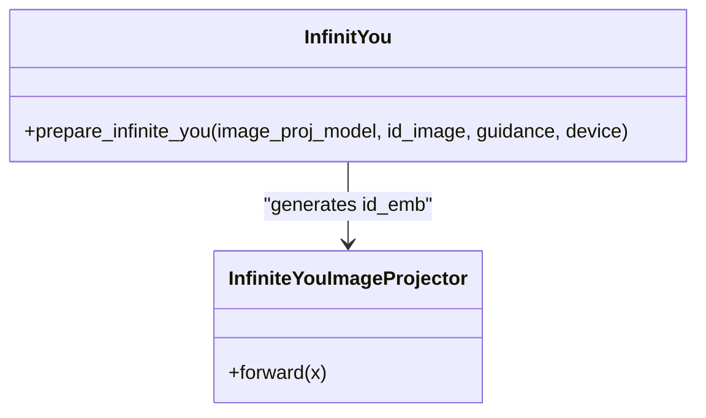

**Diagram sources**
- [flux_infiniteyou.py:76-130](file://diffsynth/models/flux_infiniteyou.py#L76-L130)
- [flux_image.py:744-758](file://diffsynth/pipelines/flux_image.py#L744-L758)

**Section sources**
- [flux_infiniteyou.py:76-130](file://diffsynth/models/flux_infiniteyou.py#L76-L130)
- [flux_image.py:744-758](file://diffsynth/pipelines/flux_image.py#L744-L758)

### LoRA Encoder and Patcher
- LoRA Encoder: Transforms LoRA weight pairs into embeddings via pattern-matched blocks and CLIP-like encoder.
- Patcher: Merges base and LoRA outputs using gated fusion per module type.

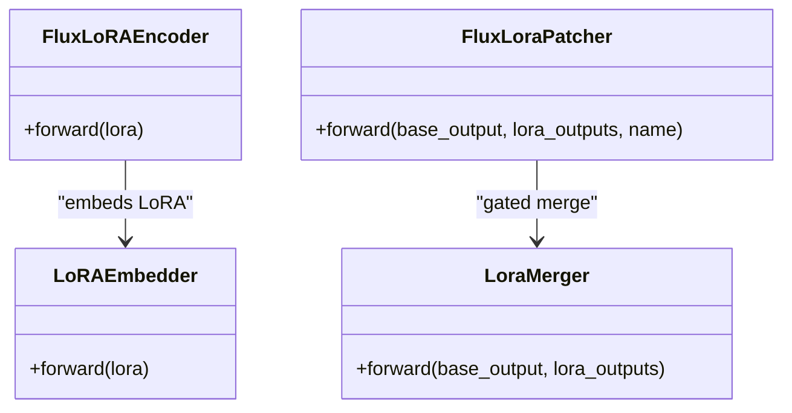

**Diagram sources**
- [flux_lora_encoder.py:427-512](file://diffsynth/models/flux_lora_encoder.py#L427-L512)
- [flux_lora_encoder.py:485-522](file://diffsynth/models/flux_lora_encoder.py#L485-L522)
- [flux_lora_patcher.py:250-307](file://diffsynth/models/flux_lora_patcher.py#L250-L307)

**Section sources**
- [flux_lora_encoder.py:485-522](file://diffsynth/models/flux_lora_encoder.py#L485-L522)
- [flux_lora_patcher.py:273-307](file://diffsynth/models/flux_lora_patcher.py#L273-L307)

### FLUX.2 Pipeline
- Prompt Embedding: Supports Mistral/Qwen3 tokenization and multi-layer hidden state stacking.
- Edit Images: Optional edit images concatenated with target latents and IDs.
- Denoising: Unified DiT call with embedded guidance and text/image IDs.

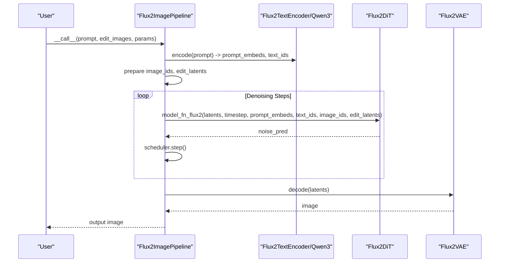

**Diagram sources**
- [flux2_image.py:74-139](file://diffsynth/pipelines/flux2_image.py#L74-L139)
- [flux2_dit.py:564-596](file://diffsynth/models/flux2_dit.py#L564-L596)

**Section sources**
- [flux2_image.py:74-139](file://diffsynth/pipelines/flux2_image.py#L74-L139)

## Dependency Analysis
Key dependencies and relationships:
- Pipelines depend on DiT, text encoders, VAE, ControlNet, IP-Adapter, InfiniteYou, and LoRA modules.
- DiT modules use shared utilities like RoPE, AdaLayerNorm, and attention backends.
- ControlNet aligns residual stacks to DiT block counts.
- IP-Adapter integrates per-block K/V tokens into attention.
- LoRA encoder and patcher operate on specific module patterns within DiT.

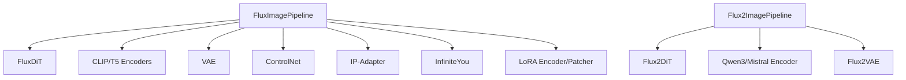

**Diagram sources**
- [flux_image.py:57-177](file://diffsynth/pipelines/flux_image.py#L57-L177)
- [flux2_image.py:21-71](file://diffsynth/pipelines/flux2_image.py#L21-L71)
- [flux_dit.py:277-399](file://diffsynth/models/flux_dit.py#L277-L399)
- [flux2_dit.py:435-800](file://diffsynth/models/flux2_dit.py#L435-L800)

**Section sources**
- [flux_image.py:57-177](file://diffsynth/pipelines/flux_image.py#L57-L177)
- [flux2_image.py:21-71](file://diffsynth/pipelines/flux2_image.py#L21-L71)

## Performance Considerations
- Tiled Inference: VAE encoder/decoder support tiling to reduce VRAM usage for large images.
- Gradient Checkpointing: Optional in DiT calls to trade compute for memory.
- Attention Backends: Use efficient SDPA or xformers where available.
- Model Compilation: DiT models marked as compilable for potential acceleration.
- VRAM Management: Automatic loading/unloading of models during pipeline execution.

[No sources needed since this section provides general guidance]

## Troubleshooting Guide
- VRAM Errors: Enable tiled inference and ensure models are loaded only when needed.
- Shape Mismatches: Verify height/width divisibility by 16 and correct latent sizes.
- ControlNet Alignment: Ensure residual stack lengths match DiT block counts; use alignment utilities if necessary.
- IP-Adapter Scale: Adjust scale parameter to balance influence of image prompts.
- LoRA Loading: Confirm correct resource format (diffusers/civitai) and alpha handling.

**Section sources**
- [flux_vae.py:333-343](file://diffsynth/models/flux_vae.py#L333-L343)
- [flux_image.py:294-311](file://diffsynth/pipelines/flux_image.py#L294-L311)
- [flux_controlnet.py:104-110](file://diffsynth/models/flux_controlnet.py#L104-L110)
- [flux_ipadapter.py:76-89](file://diffsynth/models/flux_ipadapter.py#L76-L89)
- [flux_lora_patcher.py:127-247](file://diffsynth/models/flux_lora_patcher.py#L127-L247)

## Conclusion
The FLUX implementations in ODTSR-edit provide a robust and extensible framework for high-quality image generation. The modular design allows seamless integration of ControlNet, IP-Adapter, InfiniteYou, and LoRA functionalities. With optimized attention backends, tiled inference, and VRAM management, these pipelines deliver strong performance across diverse use cases.

[No sources needed since this section summarizes without analyzing specific files]

## Appendices
- Practical Examples: Refer to example scripts in examples/flux/model_inference/ for various control mechanisms and fine-tuning approaches.
- Parameter Tuning: Adjust cfg_scale, embedded_guidance, num_inference_steps, and control strengths for desired outputs.
- Fine-Tuning: Use provided training scripts and accelerate configs for full or LoRA fine-tuning.

[No sources needed since this section provides general guidance]