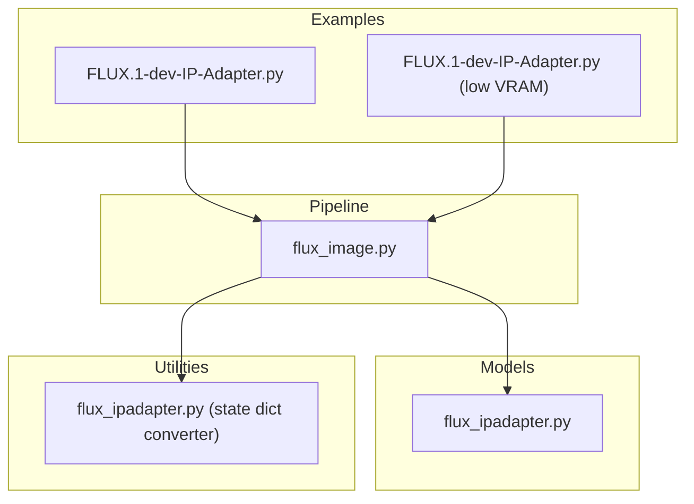
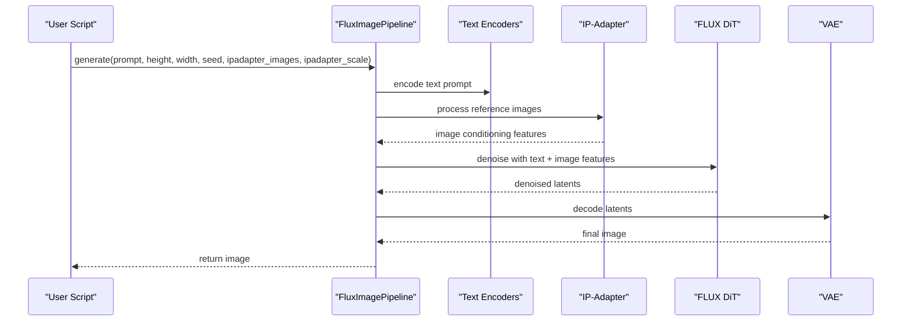
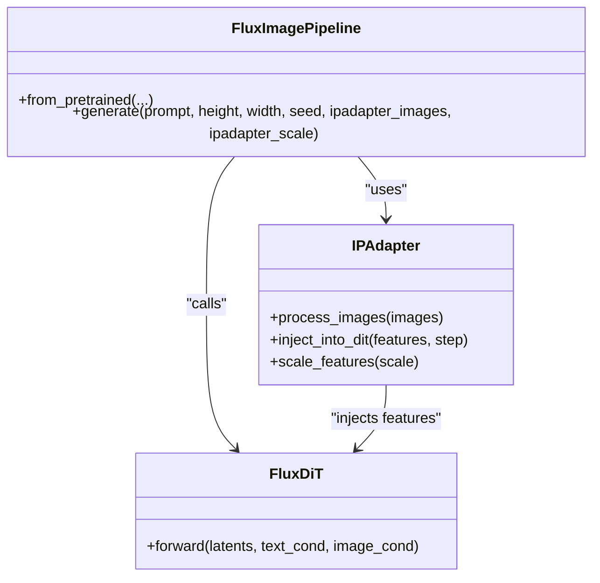
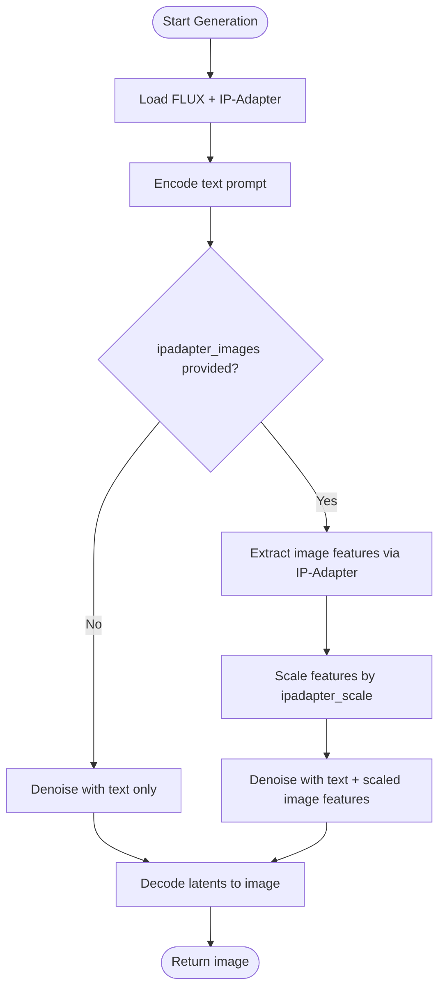
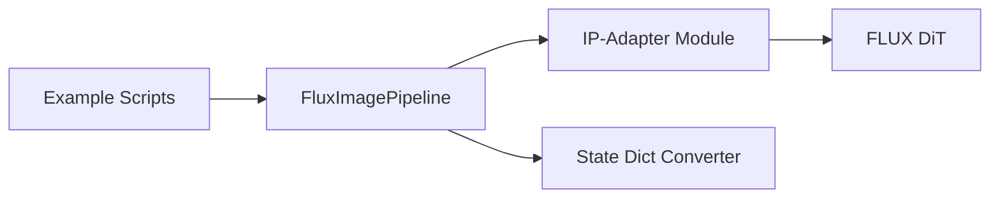

# IP-Adapter Support

<cite>
**Referenced Files in This Document**
- [FLUX.1-dev-IP-Adapter.py](file://examples/flux/model_inference/FLUX.1-dev-IP-Adapter.py)
- [FLUX.1-dev-IP-Adapter.py (low VRAM)](file://examples/flux/model_inference_low_vram/FLUX.1-dev-IP-Adapter.py)
- [flux_ipadapter.py](file://diffsynth/models/flux_ipadapter.py)
- [flux_ipadapter.py (state dict converter)](file://diffsynth/utils/state_dict_converters/flux_ipadapter.py)
- [flux_image.py](file://diffsynth/pipelines/flux_image.py)
</cite>

## Table of Contents
1. [Introduction](#introduction)
2. [Project Structure](#project-structure)
3. [Core Components](#core-components)
4. [Architecture Overview](#architecture-overview)
5. [Detailed Component Analysis](#detailed-component-analysis)
6. [Dependency Analysis](#dependency-analysis)
7. [Performance Considerations](#performance-considerations)
8. [Troubleshooting Guide](#troubleshooting-guide)
9. [Conclusion](#conclusion)
10. [Appendices](#appendices)

## Introduction
This document explains how IP-Adapter is integrated with FLUX models to enable image-based prompting and style transfer. It covers how reference images are processed into conditioning signals that influence the diffusion process, configuration options for controlling the strength of image conditioning, mixing text and image prompts, and optimization strategies for different use cases. Practical examples include style transfer, character consistency, and multi-image prompting scenarios.

## Project Structure
The IP-Adapter feature for FLUX is exposed through a pipeline entry point and supported by model components and utilities:
- Example scripts demonstrate usage patterns for both standard and low-VRAM inference.
- The pipeline orchestrates loading of FLUX components and the IP-Adapter weights.
- The IP-Adapter model module implements the image-conditioning logic.
- A state-dict converter supports weight handling for IP-Adapter.

**Diagram sources**
- [FLUX.1-dev-IP-Adapter.py:1-25](file://examples/flux/model_inference/FLUX.1-dev-IP-Adapter.py#L1-L25)
- [FLUX.1-dev-IP-Adapter.py (low VRAM):1-36](file://examples/flux/model_inference_low_vram/FLUX.1-dev-IP-Adapter.py#L1-L36)
- [flux_image.py](file://diffsynth/pipelines/flux_image.py)
- [flux_ipadapter.py](file://diffsynth/models/flux_ipadapter.py)
- [flux_ipadapter.py (state dict converter)](file://diffsynth/utils/state_dict_converters/flux_ipadapter.py)

**Section sources**
- [FLUX.1-dev-IP-Adapter.py:1-25](file://examples/flux/model_inference/FLUX.1-dev-IP-Adapter.py#L1-L25)
- [FLUX.1-dev-IP-Adapter.py (low VRAM):1-36](file://examples/flux/model_inference_low_vram/FLUX.1-dev-IP-Adapter.py#L1-L36)

## Core Components
- FluxImagePipeline: Entry point for FLUX image generation, including IP-Adapter support via parameters such as ipadapter_images and ipadapter_scale.
- IP-Adapter Model Module: Implements the image-conditioning pathway that transforms reference images into tokens/features injected into the FLUX DiT.
- State Dict Converter: Handles conversion/loading of IP-Adapter weights.

Key usage patterns:
- Provide a reference image via ipadapter_images to steer style or content.
- Control the influence of the reference image using ipadapter_scale.
- Combine text prompts with image conditioning for mixed control.

**Section sources**
- [FLUX.1-dev-IP-Adapter.py:1-25](file://examples/flux/model_inference/FLUX.1-dev-IP-Adapter.py#L1-L25)
- [FLUX.1-dev-IP-Adapter.py (low VRAM):1-36](file://examples/flux/model_inference_low_vram/FLUX.1-dev-IP-Adapter.py#L1-L36)
- [flux_ipadapter.py](file://diffsynth/models/flux_ipadapter.py)
- [flux_ipadapter.py (state dict converter)](file://diffsynth/utils/state_dict_converters/flux_ipadapter.py)

## Architecture Overview
At runtime, the pipeline loads FLUX components (text encoders, VAE, DiT) and the IP-Adapter weights. When generating an image, the pipeline:
- Encodes the text prompt(s).
- Processes one or more reference images through the IP-Adapter to produce conditioning features.
- Injects these features into the DiT during denoising steps to guide generation.
- Decodes the latent output to an image.

**Diagram sources**
- [FLUX.1-dev-IP-Adapter.py:1-25](file://examples/flux/model_inference/FLUX.1-dev-IP-Adapter.py#L1-L25)
- [flux_image.py](file://diffsynth/pipelines/flux_image.py)
- [flux_ipadapter.py](file://diffsynth/models/flux_ipadapter.py)

## Detailed Component Analysis

### IP-Adapter Model Module
Responsibilities:
- Accepts one or more reference images.
- Extracts features suitable for injection into the DiT layers.
- Scales the contribution of image features based on ipadapter_scale.

Implementation highlights:
- Integrates with the DiT forward pass to inject conditioning at appropriate layers.
- Supports multiple reference images by aggregating their features before injection.
- Works alongside text encoders to blend textual and visual guidance.

**Diagram sources**
- [flux_ipadapter.py](file://diffsynth/models/flux_ipadapter.py)
- [flux_image.py](file://diffsynth/pipelines/flux_image.py)

**Section sources**
- [flux_ipadapter.py](file://diffsynth/models/flux_ipadapter.py)

### Pipeline Integration and Usage
The example scripts show how to configure the pipeline with FLUX and IP-Adapter weights, then run generation with image conditioning.

Key parameters:
- ipadapter_images: list of PIL images or tensors used as references.
- ipadapter_scale: float controlling the strength of image conditioning (higher values increase influence).

Example workflow:
- Generate a base image from a text prompt.
- Use that image as a reference for subsequent generations with a new prompt, adjusting ipadapter_scale to balance text vs. image influence.

**Diagram sources**
- [FLUX.1-dev-IP-Adapter.py:1-25](file://examples/flux/model_inference/FLUX.1-dev-IP-Adapter.py#L1-L25)
- [FLUX.1-dev-IP-Adapter.py (low VRAM):1-36](file://examples/flux/model_inference_low_vram/FLUX.1-dev-IP-Adapter.py#L1-L36)

**Section sources**
- [FLUX.1-dev-IP-Adapter.py:1-25](file://examples/flux/model_inference/FLUX.1-dev-IP-Adapter.py#L1-L25)
- [FLUX.1-dev-IP-Adapter.py (low VRAM):1-36](file://examples/flux/model_inference_low_vram/FLUX.1-dev-IP-Adapter.py#L1-L36)

### State Dict Converter
Purpose:
- Converts and loads IP-Adapter weights into the expected format for the model module.
- Ensures compatibility between saved checkpoints and runtime expectations.

Usage:
- Automatically invoked when loading IP-Adapter weights via the pipeline’s model_configs.

**Section sources**
- [flux_ipadapter.py (state dict converter)](file://diffsynth/utils/state_dict_converters/flux_ipadapter.py)

## Dependency Analysis
The IP-Adapter integration depends on:
- FluxImagePipeline for orchestration and parameter handling.
- IP-Adapter model module for feature extraction and injection.
- State dict converter for weight compatibility.

**Diagram sources**
- [FLUX.1-dev-IP-Adapter.py:1-25](file://examples/flux/model_inference/FLUX.1-dev-IP-Adapter.py#L1-L25)
- [flux_image.py](file://diffsynth/pipelines/flux_image.py)
- [flux_ipadapter.py](file://diffsynth/models/flux_ipadapter.py)
- [flux_ipadapter.py (state dict converter)](file://diffsynth/utils/state_dict_converters/flux_ipadapter.py)

**Section sources**
- [FLUX.1-dev-IP-Adapter.py:1-25](file://examples/flux/model_inference/FLUX.1-dev-IP-Adapter.py#L1-L25)
- [flux_image.py](file://diffsynth/pipelines/flux_image.py)
- [flux_ipadapter.py](file://diffsynth/models/flux_ipadapter.py)
- [flux_ipadapter.py (state dict converter)](file://diffsynth/utils/state_dict_converters/flux_ipadapter.py)

## Performance Considerations
- Low VRAM mode: The low-VRAM example demonstrates configuring offload/onload dtypes and devices to reduce memory usage while maintaining performance.
- Mixed precision: Using bfloat16 for computation can improve speed and reduce memory footprint.
- Scaling factor tuning: Adjust ipadapter_scale to balance quality and compute; higher values may require more careful sampling settings.

Practical tips:
- For large images or high resolutions, consider reducing batch size or enabling VRAM management flags.
- Precompute and reuse reference image features if running multiple generations with the same references.

[No sources needed since this section provides general guidance]

## Troubleshooting Guide
Common issues and remedies:
- Missing IP-Adapter weights: Ensure the correct model_id and origin_file_pattern are specified in ModelConfig.
- Unexpected blending: If the output looks too dominated by the reference image, lower ipadapter_scale; if too weak, increase it.
- Memory errors: Switch to low-VRAM configuration and adjust dtype/device settings as shown in the low-VRAM example.
- Inconsistent results across runs: Fix the random seed to ensure reproducibility.

**Section sources**
- [FLUX.1-dev-IP-Adapter.py:1-25](file://examples/flux/model_inference/FLUX.1-dev-IP-Adapter.py#L1-L25)
- [FLUX.1-dev-IP-Adapter.py (low VRAM):1-36](file://examples/flux/model_inference_low_vram/FLUX.1-dev-IP-Adapter.py#L1-L36)

## Conclusion
IP-Adapter enables powerful image-based prompting and style transfer for FLUX models by injecting reference-derived features into the DiT. By combining text prompts with carefully tuned image conditioning, users can achieve consistent styles, character fidelity, and creative variations. The provided examples illustrate straightforward usage and low-VRAM optimizations for diverse deployment scenarios.

[No sources needed since this section summarizes without analyzing specific files]

## Appendices

### Practical Scenarios

- Style Transfer
  - Provide a single reference image to transfer its artistic style to new subjects.
  - Tune ipadapter_scale to balance style intensity with subject fidelity.

- Character Consistency
  - Use a reference portrait to maintain facial identity across varied scenes and poses.
  - Combine with descriptive text prompts to control context while preserving identity.

- Multi-Image Prompting
  - Supply multiple reference images to blend styles or combine attributes.
  - Aggregate features via IP-Adapter; adjust scale per image if needed by preprocessing.

[No sources needed since this section provides conceptual guidance]