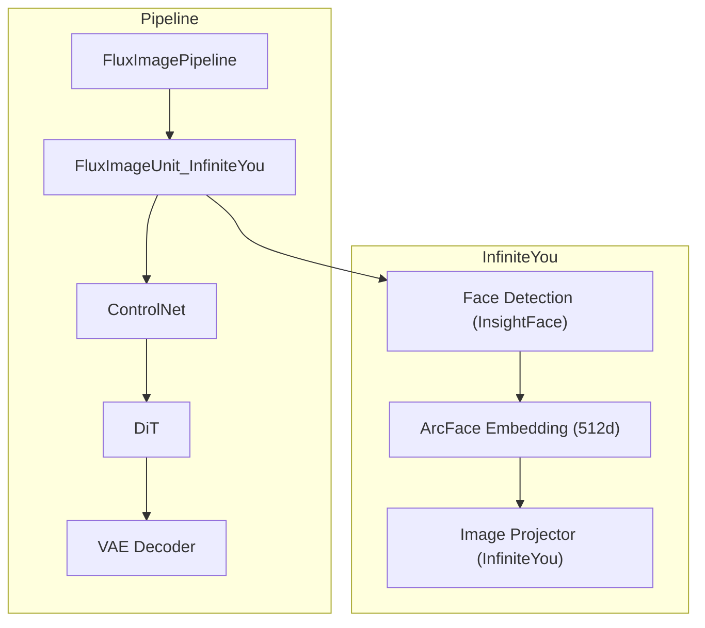
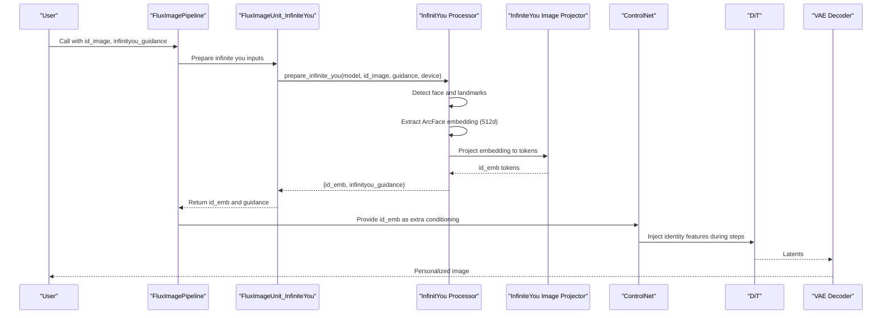
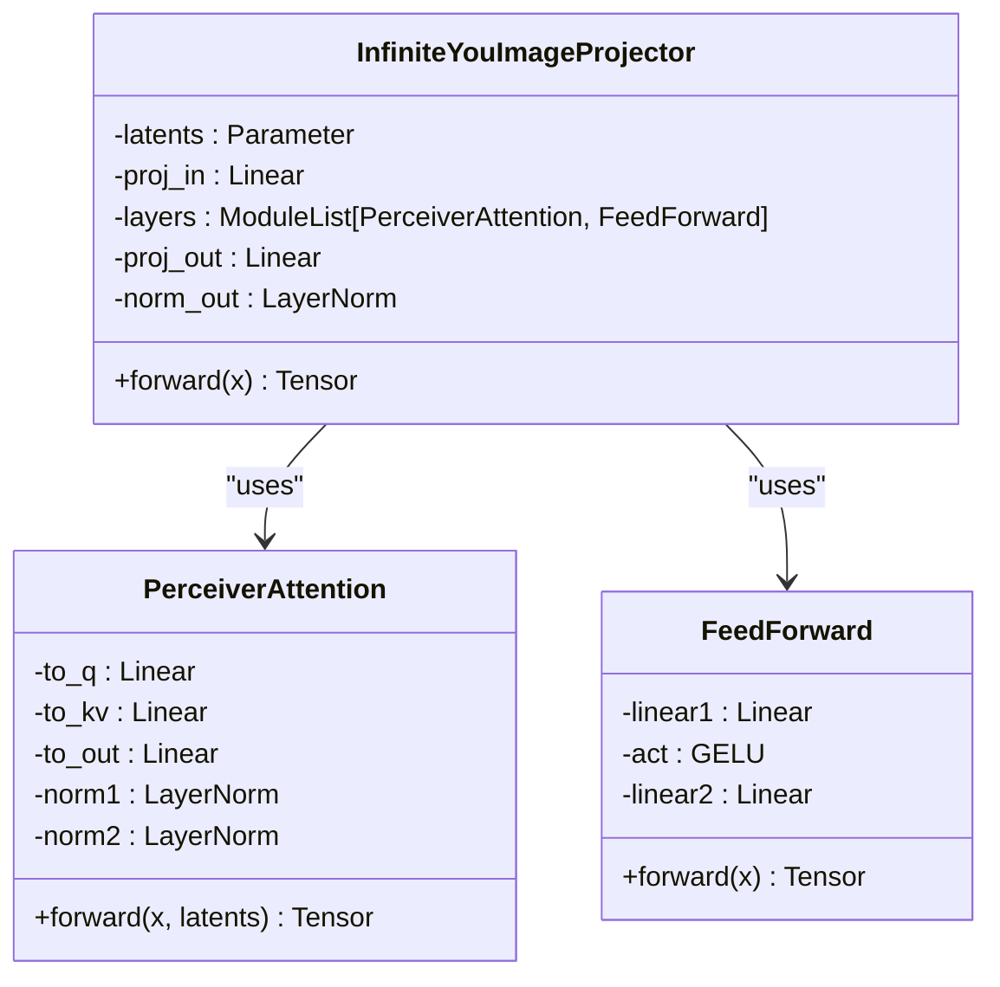
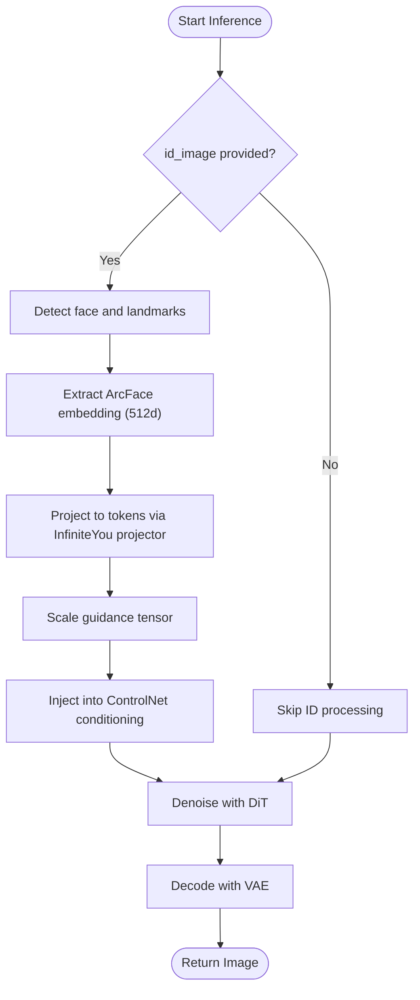
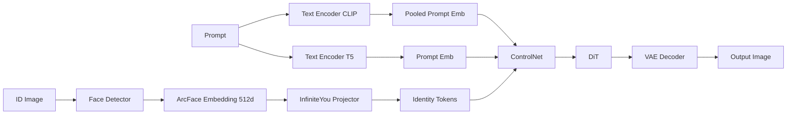

# InfiniteYou Personalization

<cite>
**Referenced Files in This Document**
- [flux_infiniteyou.py](file://diffsync/models/flux_infiniteyou.py)
- [flux_image.py](file://diffsync/pipelines/flux_image.py)
- [FLUX.1-dev-InfiniteYou.py](file://examples/flux/model_inference/FLUX.1-dev-InfiniteYou.py)
- [FLUX.1-dev-InfiniteYou_low_vram.py](file://examples/flux/model_inference_low_vram/FLUX.1-dev-InfiniteYou.py)
- [FLUX.1-dev-InfiniteYou_full.sh](file://examples/flux/model_training/full/FLUX.1-dev-InfiniteYou.sh)
- [FLUX.1-dev-InfiniteYou_lora.sh](file://examples/flux/model_training/lora/FLUX.1-dev-InfiniteYou.sh)
- [flux_infiniteyou_converter.py](file://diffsync/utils/state_dict_converters/flux_infiniteyou.py)
</cite>

## Table of Contents
1. Introduction
2. Project Structure
3. Core Components
4. Architecture Overview
5. Detailed Component Analysis
6. Dependency Analysis
7. Performance Considerations
8. Troubleshooting Guide
9. Conclusion
10. Appendices

## Introduction
This document explains the InfiniteYou personalization capability integrated into FLUX models within DiffSynth Studio. It covers how to generate personalized images from a reference face image, the embedding extraction pipeline, conditioning mechanisms, and configuration parameters that control personalization strength, diversity, and fidelity. Practical examples for inference and training (full fine-tuning and LoRA) are included, along with guidance on balancing personalization with generalization.

## Project Structure
InfiniteYou is implemented as an optional module in the FLUX image pipeline:
- A dedicated model component transforms a 512-d face embedding into a higher-dimensional projector output used by downstream conditioning.
- The pipeline orchestrates face detection, ArcFace embedding extraction, projection, and injection into ControlNet-based conditioning.
- Example scripts demonstrate both standard and low-VRAM inference flows.
- Training scripts show how to train or adapt the projector and ControlNet components.

**Diagram sources**
- [flux_image.py:744-839](file://diffsync/pipelines/flux_image.py#L744-L839)
- [flux_infiniteyou.py:76-116](file://diffsync/models/flux_infiniteyou.py#L76-L116)

**Section sources**
- [flux_image.py:57-177](file://diffsync/pipelines/flux_image.py#L57-L177)
- [FLUX.1-dev-InfiniteYou.py:1-61](file://examples/flux/model_inference/FLUX.1-dev-InfiniteYou.py#L1-L61)
- [FLUX.1-dev-InfiniteYou_low_vram.py:1-73](file://examples/flux/model_inference_low_vram/FLUX.1-dev-InfiniteYou.py#L1-L73)

## Core Components
- FluxImageUnit_InfiniteYou: Prepares identity embeddings and guidance scalar for each inference call.
- InfinitYou processor: Performs face detection, landmark alignment, ArcFace embedding extraction, and calls the image projector.
- InfiniteYouImageProjector: Maps a 512-d ArcFace embedding into a sequence of tokens consumed by ControlNet conditioning.
- ControlNet integration: Injects identity embeddings into the DiT via ControlNet branches during denoising.

Key responsibilities:
- Input validation and face detection robustness across multiple scales.
- Embedding normalization and dtype/device handling.
- Guidance scaling for personalization strength.
- Seamless integration with existing FLUX text/image conditioning.

**Section sources**
- [flux_image.py:744-839](file://diffsync/pipelines/flux_image.py#L744-L839)
- [flux_infiniteyou.py:76-116](file://diffsync/models/flux_infiniteyou.py#L76-L116)

## Architecture Overview
The InfiniteYou personalization flow integrates at two points:
- Preprocessing: Face detection and ArcFace embedding extraction, followed by projection into a token sequence.
- Conditioning: Identity tokens are injected into ControlNet alongside prompt embeddings and other controls.

**Diagram sources**
- [flux_image.py:744-839](file://diffsync/pipelines/flux_image.py#L744-L839)
- [flux_image.py:1000-1100](file://diffsync/pipelines/flux_image.py#L1000-L1100)

## Detailed Component Analysis

### InfiniteYou Image Projector
The projector converts a normalized 512-d ArcFace embedding into a fixed-length sequence of tokens. It uses learnable latents, attention layers, and feed-forward blocks to produce a high-dimensional representation suitable for ControlNet conditioning.

**Diagram sources**
- [flux_infiniteyou.py:76-116](file://diffsync/models/flux_infiniteyou.py#L76-L116)
- [flux_infiniteyou.py:28-74](file://diffsync/models/flux_infiniteyou.py#L28-L74)

**Section sources**
- [flux_infiniteyou.py:76-116](file://diffsync/models/flux_infiniteyou.py#L76-L116)

### Pipeline Integration and Conditioning
The pipeline unit prepares identity embeddings and passes them to ControlNet. During denoising, ControlNet injects these features into DiT blocks, enabling subject-specific generation while preserving prompt-driven composition.

**Diagram sources**
- [flux_image.py:744-839](file://diffsync/pipelines/flux_image.py#L744-L839)
- [flux_image.py:1000-1100](file://diffsync/pipelines/flux_image.py#L1000-L1100)

**Section sources**
- [flux_image.py:744-839](file://diffsync/pipelines/flux_image.py#L744-L839)
- [flux_image.py:1000-1100](file://diffsync/pipelines/flux_image.py#L1000-L1100)

### State Dict Converter
A converter maps external checkpoints to the internal projector state dict format, ensuring compatibility when loading pretrained weights.

**Section sources**
- [flux_infiniteyou_converter.py:1-2](file://diffsync/utils/state_dict_converters/flux_infiniteyou.py#L1-L2)

## Dependency Analysis
- External dependencies for face processing: InsightFace and facexlib for detection and recognition.
- Model components:
  - Text encoders (CLIP/T5), DiT, VAE, ControlNet, IP-Adapter (optional).
  - InfiniteYou projector and processor.
- Data flow:
  - Prompt -> text encoders -> prompt embeddings.
  - Reference image -> face detector -> ArcFace -> projector -> identity tokens.
  - Identity tokens -> ControlNet -> DiT -> VAE -> image.

**Diagram sources**
- [flux_image.py:57-177](file://diffsync/pipelines/flux_image.py#L57-L177)
- [flux_image.py:1000-1100](file://diffsync/pipelines/flux_image.py#L1000-L1100)

**Section sources**
- [flux_image.py:57-177](file://diffsync/pipelines/flux_image.py#L57-L177)
- [flux_image.py:1000-1100](file://diffsync/pipelines/flux_image.py#L1000-L1100)

## Performance Considerations
- Low-VRAM inference: Use float8 offloading/onload and bfloat16 computation to reduce memory footprint.
- Tiled decoding: Enables large outputs without exceeding VRAM.
- TeaCache: Optional step skipping based on similarity thresholds to accelerate inference.
- Gradient checkpointing: Reduces memory during training.

Recommendations:
- Prefer low-VRAM mode on constrained GPUs.
- Adjust num_inference_steps for quality vs speed trade-offs.
- Use tiled decoding for high-resolution outputs.

**Section sources**
- [FLUX.1-dev-InfiniteYou_low_vram.py:12-39](file://examples/flux/model_inference_low_vram/FLUX.1-dev-InfiniteYou.py#L12-L39)
- [flux_image.py:904-944](file://diffsync/pipelines/flux_image.py#L904-L944)

## Troubleshooting Guide
Common issues and resolutions:
- No face detected: Ensure the input ID image contains a clear, frontal face. Increase contrast or crop to focus on the face.
- Incorrect dtype/device: Confirm torch_dtype and device settings match your hardware; use bfloat16 on modern GPUs.
- VRAM overflow: Enable low-VRAM mode, reduce resolution, or enable tiled decoding.
- Weak personalization: Increase infinityou_guidance moderately; too high may degrade prompt adherence.
- Overfitting to identity: Reduce training epochs or LoRA rank; add regularization or more diverse prompts.

Validation checks:
- Verify face detection returns landmarks.
- Confirm ArcFace embedding shape and normalization.
- Inspect projected token dimensions before ControlNet injection.

**Section sources**
- [flux_image.py:808-839](file://diffsync/pipelines/flux_image.py#L808-L839)

## Conclusion
InfiniteYou enables robust, controllable personalization in FLUX models by extracting stable face embeddings and projecting them into tokens that condition ControlNet branches. With configurable guidance and efficient inference modes, users can balance fidelity to the reference identity with creative diversity driven by prompts. Training scripts support both full fine-tuning and lightweight LoRA adaptation for practical deployment.

## Appendices

### Configuration Parameters
- infinityou_id_image: Reference face image used for identity embedding extraction.
- infinityou_guidance: Scalar controlling personalization strength; typical range around 1.0–2.0.
- embedded_guidance: Global guidance parameter influencing overall generation behavior; default around 3.5.
- num_inference_steps: Number of denoising steps; higher improves quality but increases time.
- height/width: Output resolution; consider tiled decoding for large sizes.
- vram_config (low-VRAM): Offload/onload/computation dtypes and devices to manage memory usage.

Practical tips:
- Start with infinityou_guidance=1.0 and adjust upward if identity fidelity is insufficient.
- Keep embedded_guidance near default unless experimenting with style shifts.
- For consistent results, fix seed and use deterministic settings where possible.

**Section sources**
- [FLUX.1-dev-InfiniteYou.py:16-48](file://examples/flux/model_inference/FLUX.1-dev-InfiniteYou.py#L16-L48)
- [FLUX.1-dev-InfiniteYou_low_vram.py:27-59](file://examples/flux/model_inference_low_vram/FLUX.1-dev-InfiniteYou.py#L27-L59)

### Creating Personalized Models
Full fine-tuning:
- Dataset: Include image, controlnet_image, and infinityou_id_image columns.
- Trainable modules: controlnet and image_proj_model.
- Learning rate and epochs: Start with conservative values; monitor overfitting.

LoRA fine-tuning:
- Target modules: Attention and MLP projections within DiT.
- Rank selection: Higher rank captures more detail but risks overfitting.
- Alignment: Convert to open-source format for broader compatibility.

Balancing personalization and generalization:
- Use diverse prompts and subjects during training.
- Apply gradient checkpointing and moderate learning rates.
- Validate on unseen prompts to ensure generalization.

**Section sources**
- [FLUX.1-dev-InfiniteYou_full.sh:1-17](file://examples/flux/model_training/full/FLUX.1-dev-InfiniteYou.sh#L1-L17)
- [FLUX.1-dev-InfiniteYou_lora.sh:1-20](file://examples/flux/model_training/lora/FLUX.1-dev-InfiniteYou.sh#L1-L20)