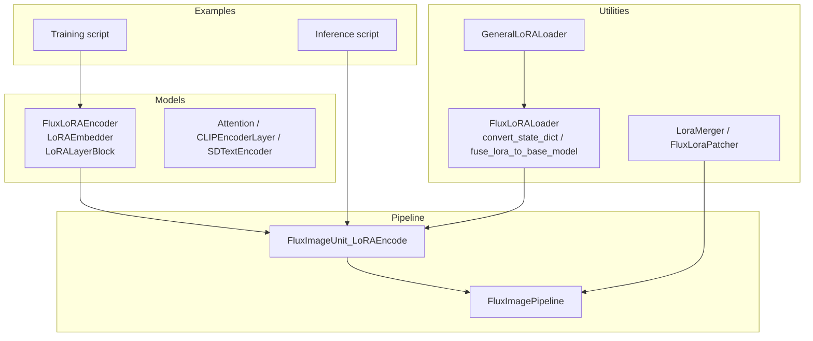
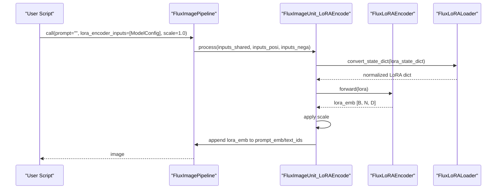
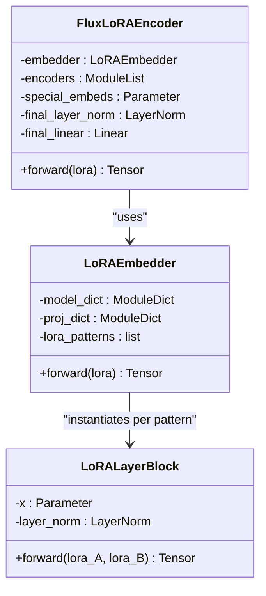
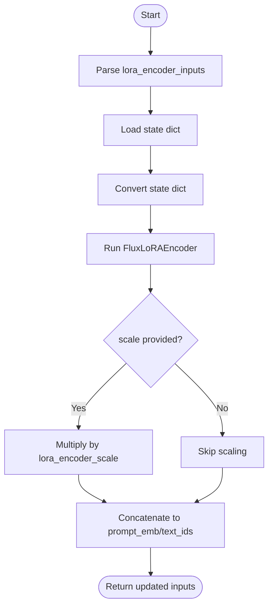
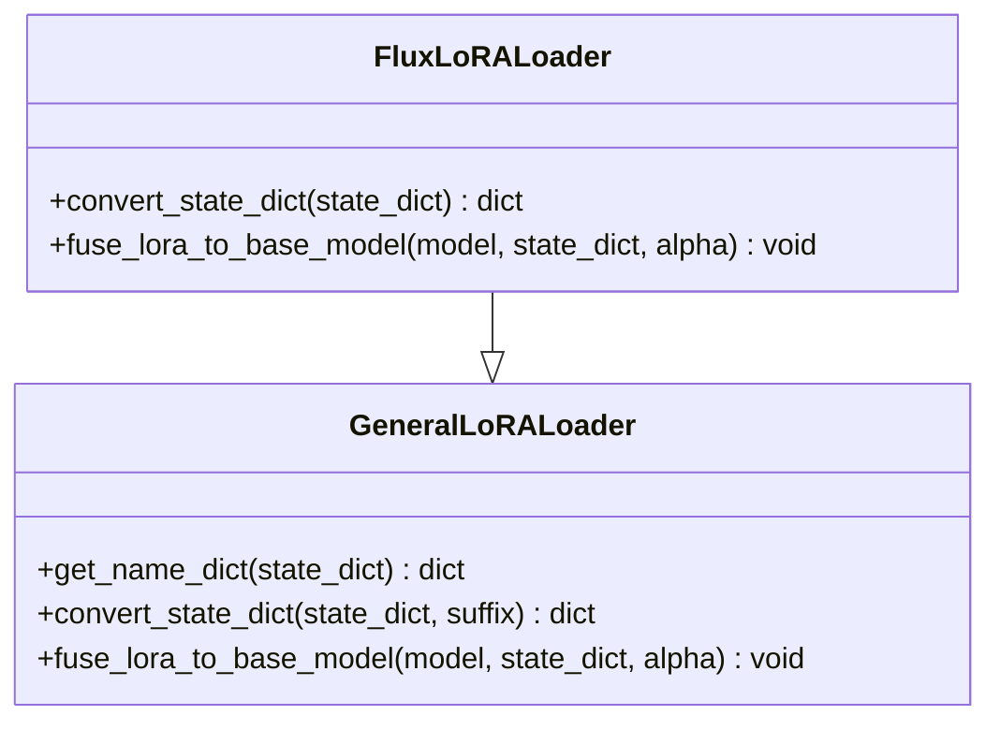
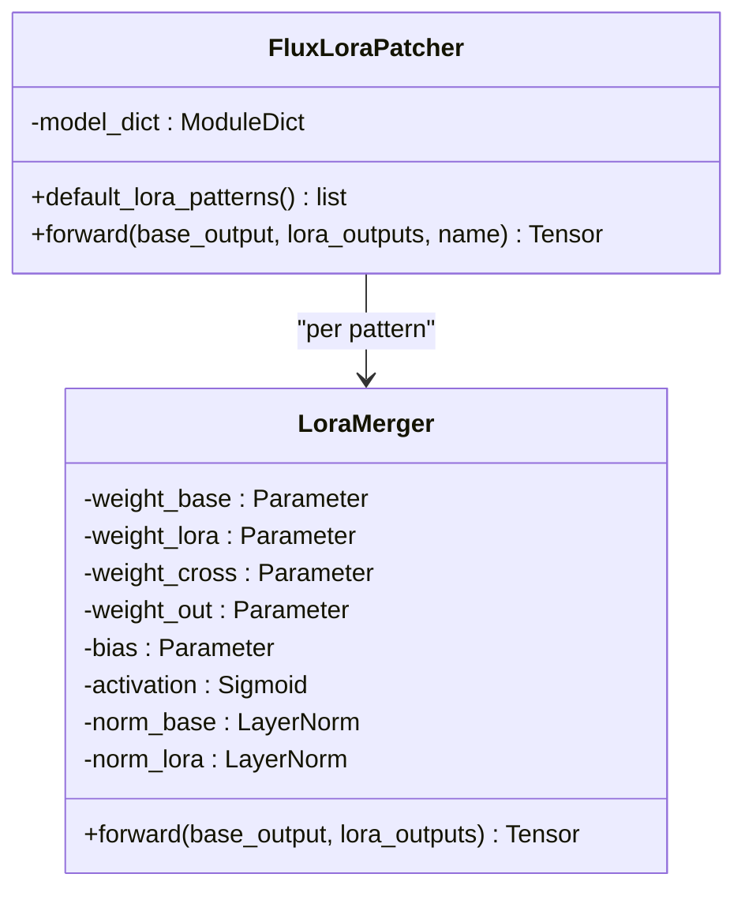
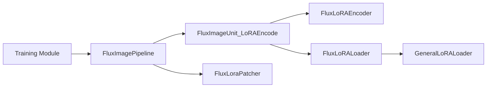

# LoRA Encoder

<cite>
**Referenced Files in This Document**
- [flux_lora_encoder.py](file://diffsynth/models/flux_lora_encoder.py)
- [flux_lora_patcher.py](file://diffsynth/models/flux_lora_patcher.py)
- [flux.py](file://diffsynth/utils/lora/flux.py)
- [general.py](file://diffsynth/utils/lora/general.py)
- [flux_image.py](file://diffsynth/pipelines/flux_image.py)
- [train.py](file://examples/flux/model_training/train.py)
- [FLUX.1-dev-LoRA-Encoder.sh](file://examples/flux/model_training/full/FLUX.1-dev-LoRA-Encoder.sh)
- [FLUX.1-dev-LoRA-Encoder.py](file://examples/flux/model_inference/FLUX.1-dev-LoRA-Encoder.py)
</cite>

## Table of Contents
1. Introduction
2. Project Structure
3. Core Components
4. Architecture Overview
5. Detailed Component Analysis
6. Dependency Analysis
7. Performance Considerations
8. Troubleshooting Guide
9. Conclusion
10. Appendices

## Introduction
This document explains the LoRA (Low-Rank Adaptation) encoder implementation for FLUX models. It covers how low-rank decomposition matrices are used to enable efficient fine-tuning, the encoder architecture that converts LoRA weights into prompt-conditioning embeddings, training procedures, and inference-time adaptation mechanisms. It also documents configuration options such as rank selection, learning rates, and regularization techniques, and provides practical examples for training custom LoRA adapters, merging multiple LoRAs, and optimizing for different tasks.

## Project Structure
The LoRA encoder feature spans model definitions, pipeline integration, utilities for loading and converting LoRA state dicts, and example scripts for training and inference.

**Diagram sources**
- [flux_lora_encoder.py:485-512](file://diffsynth/models/flux_lora_encoder.py#L485-L512)
- [flux_image.py:843-900](file://diffsynth/pipelines/flux_image.py#L843-L900)
- [flux.py:84-206](file://diffsynth/utils/lora/flux.py#L84-L206)
- [general.py:4-71](file://diffsynth/utils/lora/general.py#L4-L71)
- [flux_lora_patcher.py:273-307](file://diffsynth/models/flux_lora_patcher.py#L273-L307)

**Section sources**
- [flux_lora_encoder.py:1-522](file://diffsynth/models/flux_lora_encoder.py#L1-L522)
- [flux_image.py:57-108](file://diffsynth/pipelines/flux_image.py#L57-L108)
- [flux.py:1-303](file://diffsynth/utils/lora/flux.py#L1-L303)
- [general.py:1-71](file://diffsynth/utils/lora/general.py#L1-L71)
- [flux_lora_patcher.py:1-307](file://diffsynth/models/flux_lora_patcher.py#L1-L307)

## Core Components
- FluxLoRAEncoder: Encodes a set of LoRA weight tensors into a compact embedding sequence that is concatenated with text embeddings at inference time.
- LoRAEmbedder and LoRALayerBlock: Map LoRA parameters through per-pattern modules and projectors to produce embeddings per pattern; concatenates them into a single embedding tensor.
- FluxImageUnit_LoRAEncode: Pipeline unit that loads LoRA state dicts, converts them, runs the encoder, scales the result, and appends it to the positive prompt embedding.
- FluxLoRALoader and GeneralLoRALoader: Convert LoRA state dicts across formats (Civitai/Diffusers), fuse LoRA into base weights when needed, and handle alpha scaling.
- LoraMerger and FluxLoraPatcher: Provide learnable gating/merging of multiple LoRA outputs during DiT forward passes (when VRAM management is enabled).

Key responsibilities:
- Efficient parameterization via low-rank matrices (A/B) for targeted modules.
- Encoding LoRA weights into a token-like embedding stream.
- Seamless integration into the FLUX pipeline without modifying core DiT or text encoders.

**Section sources**
- [flux_lora_encoder.py:415-512](file://diffsynth/models/flux_lora_encoder.py#L415-L512)
- [flux_image.py:843-900](file://diffsynth/pipelines/flux_image.py#L843-L900)
- [flux.py:84-206](file://diffsynth/utils/lora/flux.py#L84-L206)
- [general.py:4-71](file://diffsynth/utils/lora/general.py#L4-L71)
- [flux_lora_patcher.py:250-307](file://diffsynth/models/flux_lora_patcher.py#L250-L307)

## Architecture Overview
At inference, the LoRA encoder transforms LoRA weights into a sequence of embeddings that are appended to the prompt embeddings. During training, LoRA adapters can be injected into target modules using PEFT, while the LoRA encoder itself can be trained to map LoRA weights to effective conditioning signals.

**Diagram sources**
- [flux_image.py:843-900](file://diffsynth/pipelines/flux_image.py#L843-L900)
- [flux_lora_encoder.py:485-512](file://diffsynth/models/flux_lora_encoder.py#L485-L512)
- [flux.py:84-206](file://diffsynth/utils/lora/flux.py#L84-L206)

## Detailed Component Analysis

### FluxLoRAEncoder and LoRAEmbedder
- LoRAEmbedder defines patterns for which LoRA modules are considered (e.g., attention Q/K/V projections, MLPs, normalization layers) and builds per-pattern blocks that compute a projection from LoRA A/B weights to an intermediate representation, then projects to a fixed dimension.
- FluxLoRAEncoder stacks these embeddings with special tokens, processes them through one or more CLIP-style encoder layers, and returns a short embedding sequence used to condition the DiT.

**Diagram sources**
- [flux_lora_encoder.py:485-512](file://diffsynth/models/flux_lora_encoder.py#L485-L512)
- [flux_lora_encoder.py:427-483](file://diffsynth/models/flux_lora_encoder.py#L427-L483)
- [flux_lora_encoder.py:415-425](file://diffsynth/models/flux_lora_encoder.py#L415-L425)

**Section sources**
- [flux_lora_encoder.py:415-512](file://diffsynth/models/flux_lora_encoder.py#L415-L512)

### FluxImageUnit_LoRAEncode (Inference-Time Integration)
- Parses lora_encoder_inputs (string path or ModelConfig), downloads if necessary, loads state dict, converts via FluxLoRALoader, and feeds to FluxLoRAEncoder.
- Optionally scales the resulting embedding by lora_encoder_scale before concatenating to the positive prompt embedding and corresponding text_ids.

**Diagram sources**
- [flux_image.py:843-900](file://diffsynth/pipelines/flux_image.py#L843-L900)

**Section sources**
- [flux_image.py:843-900](file://diffsynth/pipelines/flux_image.py#L843-L900)

### LoRA Loading and Conversion Utilities
- GeneralLoRALoader supports both .lora_A/.lora_B and .lora_down/.lora_up naming conventions, handles optional alpha keys, and fuses LoRA into base weights when required.
- FluxLoRALoader extends conversion logic for Diffusers/Civitai naming schemes, merges q/k/v components where needed, and aligns block indices.

**Diagram sources**
- [general.py:4-71](file://diffsynth/utils/lora/general.py#L4-L71)
- [flux.py:84-206](file://diffsynth/utils/lora/flux.py#L84-L206)

**Section sources**
- [general.py:4-71](file://diffsynth/utils/lora/general.py#L4-L71)
- [flux.py:84-206](file://diffsynth/utils/lora/flux.py#L84-L206)

### LoRA Merging for DiT (Optional)
- LoraMerger learns gating weights to combine base outputs with multiple LoRA outputs per module.
- FluxLoraPatcher instantiates mergers for each LoRA pattern and integrates them into wrapped linear layers when VRAM management is enabled.

**Diagram sources**
- [flux_lora_patcher.py:250-307](file://diffsynth/models/flux_lora_patcher.py#L250-L307)

**Section sources**
- [flux_lora_patcher.py:250-307](file://diffsynth/models/flux_lora_patcher.py#L250-L307)

## Dependency Analysis
- FluxImagePipeline orchestrates units including FluxImageUnit_LoRAEncode and holds references to lora_encoder and lora_patcher.
- FluxLoRAEncoder depends on LoRAEmbedder and simple transformer layers.
- FluxLoRALoader depends on GeneralLoRALoader and implements format-specific conversions.
- Training scripts use DiffusionTrainingModule to inject LoRA adapters into target modules via PEFT and optionally train the LoRA encoder.

**Diagram sources**
- [flux_image.py:57-108](file://diffsynth/pipelines/flux_image.py#L57-L108)
- [flux_image.py:843-900](file://diffsynth/pipelines/flux_image.py#L843-L900)
- [flux_lora_encoder.py:485-512](file://diffsynth/models/flux_lora_encoder.py#L485-L512)
- [flux.py:84-206](file://diffsynth/utils/lora/flux.py#L84-L206)
- [general.py:4-71](file://diffsynth/utils/lora/general.py#L4-L71)
- [flux_lora_patcher.py:273-307](file://diffsynth/models/flux_lora_patcher.py#L273-L307)

**Section sources**
- [flux_image.py:57-108](file://diffsynth/pipelines/flux_image.py#L57-L108)
- [flux_lora_encoder.py:485-512](file://diffsynth/models/flux_lora_encoder.py#L485-L512)
- [flux.py:84-206](file://diffsynth/utils/lora/flux.py#L84-L206)
- [general.py:4-71](file://diffsynth/utils/lora/general.py#L4-L71)
- [flux_lora_patcher.py:273-307](file://diffsynth/models/flux_lora_patcher.py#L273-L307)

## Performance Considerations
- Low-rank decomposition reduces trainable parameters significantly compared to full fine-tuning.
- Gradient checkpointing is available in training to reduce memory usage.
- Optional VRAM management enables dynamic offloading and fused operations; LoRA merging can be enabled when VRAM management is active.
- Using bfloat16 for model weights and data helps balance precision and speed.

[No sources needed since this section provides general guidance]

## Troubleshooting Guide
- Key mismatch when loading LoRA checkpoints: ensure correct naming convention (.lora_A/.lora_B or .lora_down/.lora_up) and use provided converters.
- Alpha handling: if an alpha key exists, the loader applies scaling; verify expected behavior for your LoRA source.
- Fusion vs. runtime injection: fused LoRA updates base weights permanently; runtime injection allows toggling via clear_lora().
- VRAM management dependency: enabling LoRA merger requires VRAM management to be active on DiT.

**Section sources**
- [general.py:4-71](file://diffsynth/utils/lora/general.py#L4-L71)
- [flux.py:84-206](file://diffsynth/utils/lora/flux.py#L84-L206)
- [flux_image.py:109-118](file://diffsynth/pipelines/flux_image.py#L109-L118)

## Conclusion
The LoRA encoder for FLUX provides a flexible and efficient mechanism to adapt large models with minimal parameters. By encoding LoRA weights into prompt-like embeddings and integrating them seamlessly into the pipeline, users can fine-tune and control generation with small adapter files. The framework supports multiple LoRA formats, optional fusion, and advanced merging strategies for multi-LoRA scenarios.

[No sources needed since this section summarizes without analyzing specific files]

## Appendices

### Configuration Options
- Rank selection: Controlled via PEFT LoraConfig r parameter during training; typical values range from 8 to 64 depending on task complexity.
- Learning rate: Set via training arguments; common starting points around 1e-5 to 1e-4 for LoRA fine-tuning.
- Regularization: Use gradient checkpointing and optional offloading; consider dropout within LoRA targets if customized.
- Scaling at inference: lora_encoder_scale controls activation intensity of LoRA embeddings.

**Section sources**
- [train.py:160-184](file://examples/flux/model_training/train.py#L160-L184)
- [flux_image.py:843-900](file://diffsynth/pipelines/flux_image.py#L843-L900)

### Practical Examples

#### Training a Custom LoRA Adapter
- Use the provided training script with dataset paths and model configs.
- Specify trainable_models to include the LoRA encoder and/or DiT modules.
- Configure lora_rank and lora_target_modules as needed.

**Section sources**
- [FLUX.1-dev-LoRA-Encoder.sh:1-17](file://examples/flux/model_training/full/FLUX.1-dev-LoRA-Encoder.sh#L1-L17)
- [train.py:160-184](file://examples/flux/model_training/train.py#L160-L184)

#### Inference with LoRA Encoder
- Load the pipeline with model configs including the LoRA encoder.
- Pass lora_encoder_inputs as a ModelConfig or string path.
- Adjust lora_encoder_scale to control strength.

**Section sources**
- [FLUX.1-dev-LoRA-Encoder.py:1-39](file://examples/flux/model_inference/FLUX.1-dev-LoRA-Encoder.py#L1-L39)
- [flux_image.py:843-900](file://diffsynth/pipelines/flux_image.py#L843-L900)

#### Merging Multiple LoRAs
- For runtime combination, enable LoRA merger via the pipeline when VRAM management is active; the merger learns gating weights per module.
- Alternatively, fuse LoRA weights into the base model using the loader’s fusion method.

**Section sources**
- [flux_image.py:109-118](file://diffsynth/pipelines/flux_image.py#L109-L118)
- [flux_lora_patcher.py:250-307](file://diffsynth/models/flux_lora_patcher.py#L250-L307)
- [general.py:52-71](file://diffsynth/utils/lora/general.py#L52-L71)