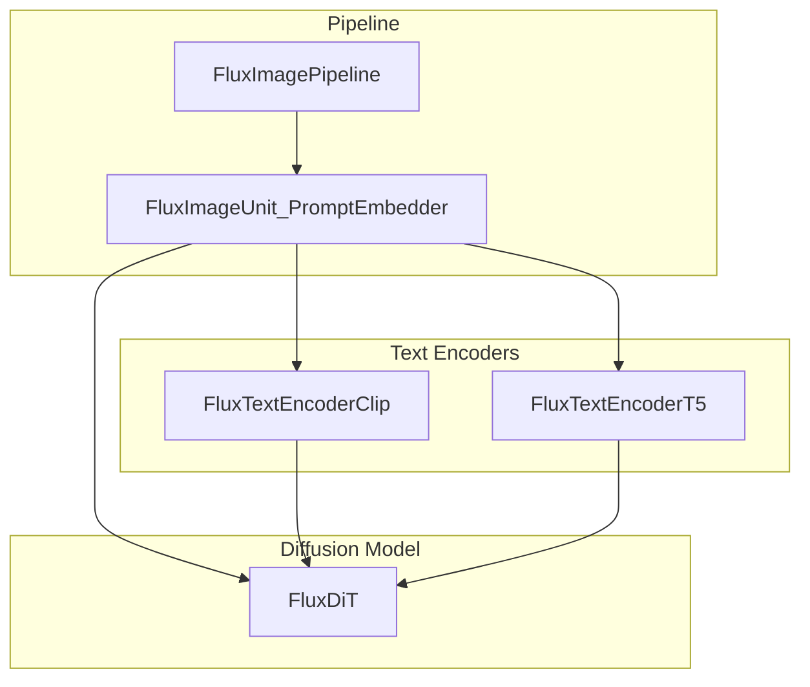
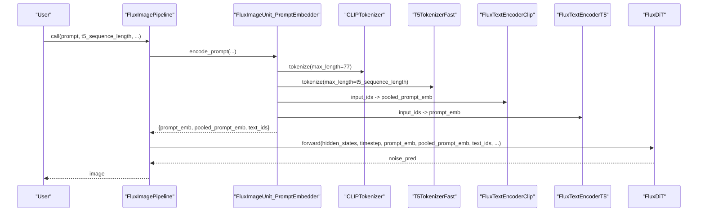
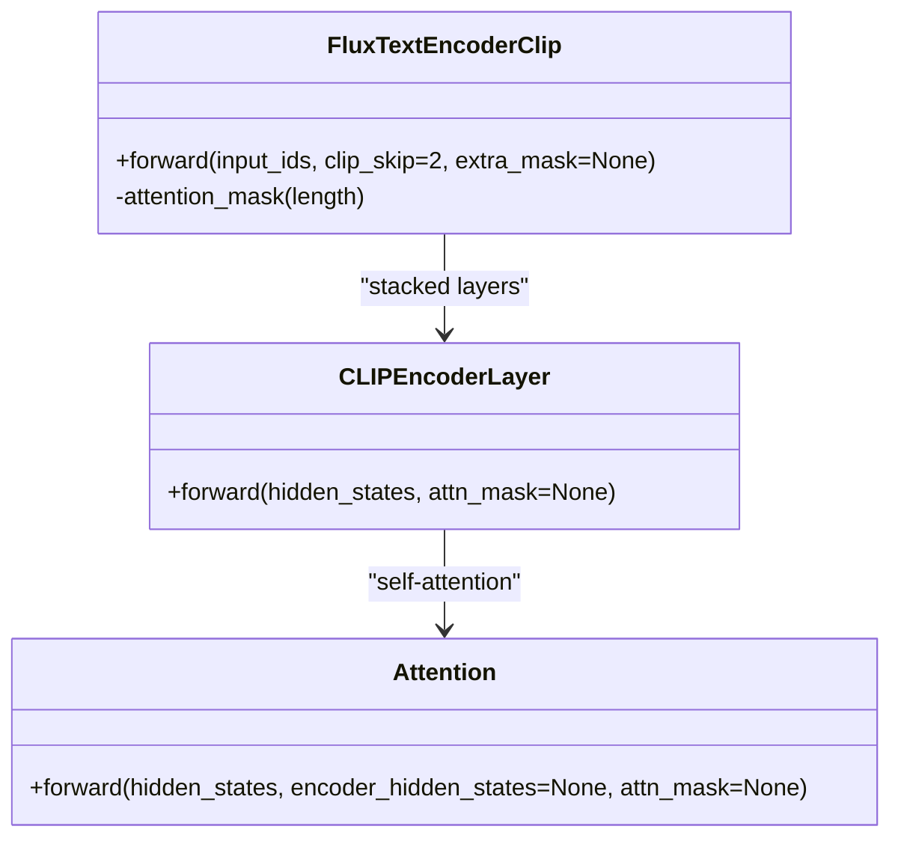
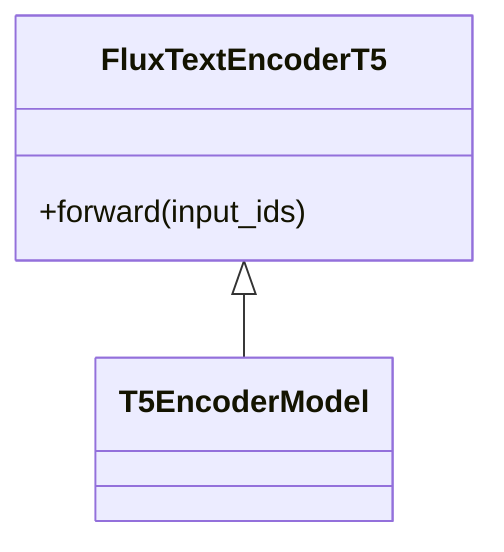
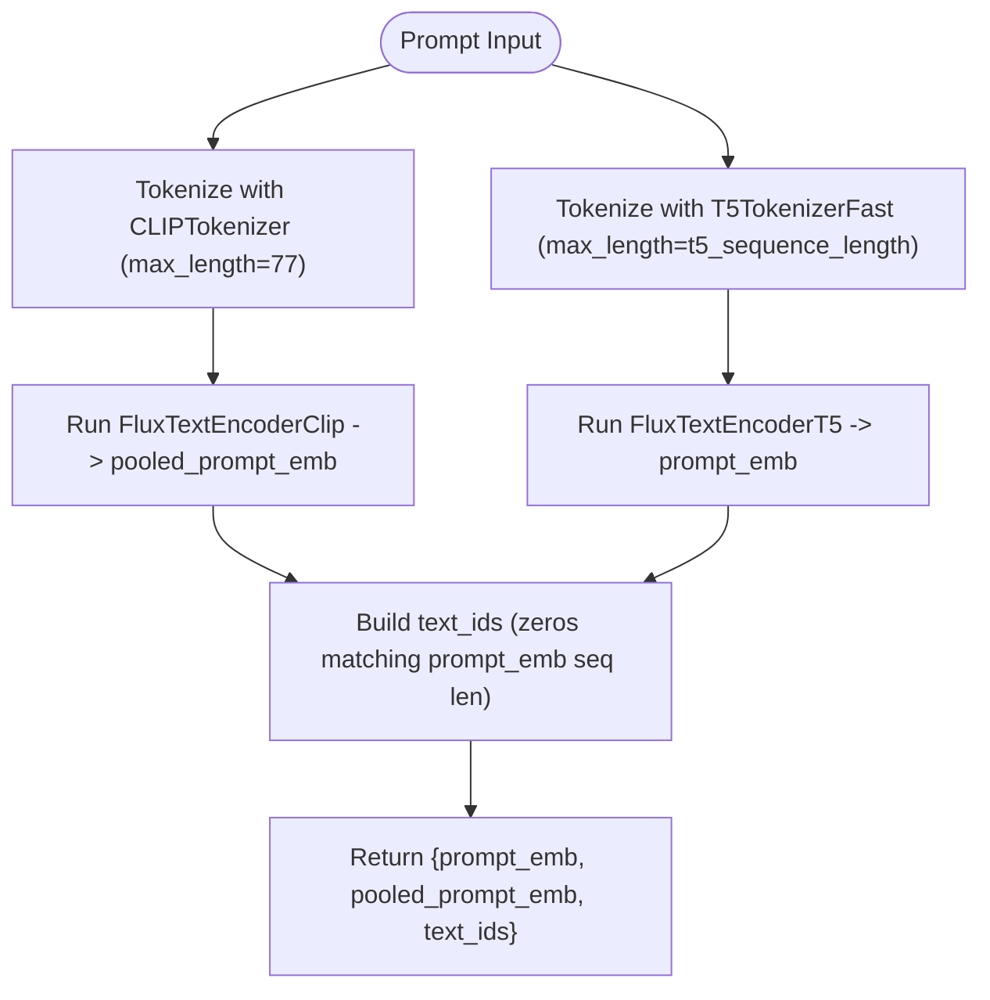
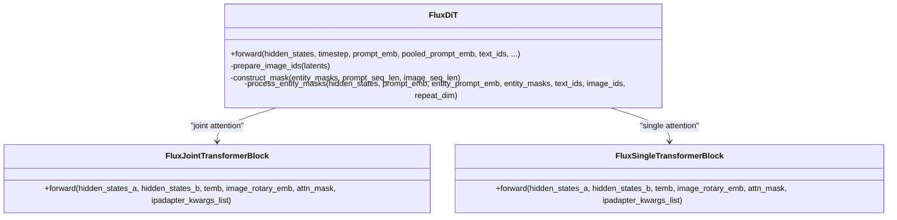
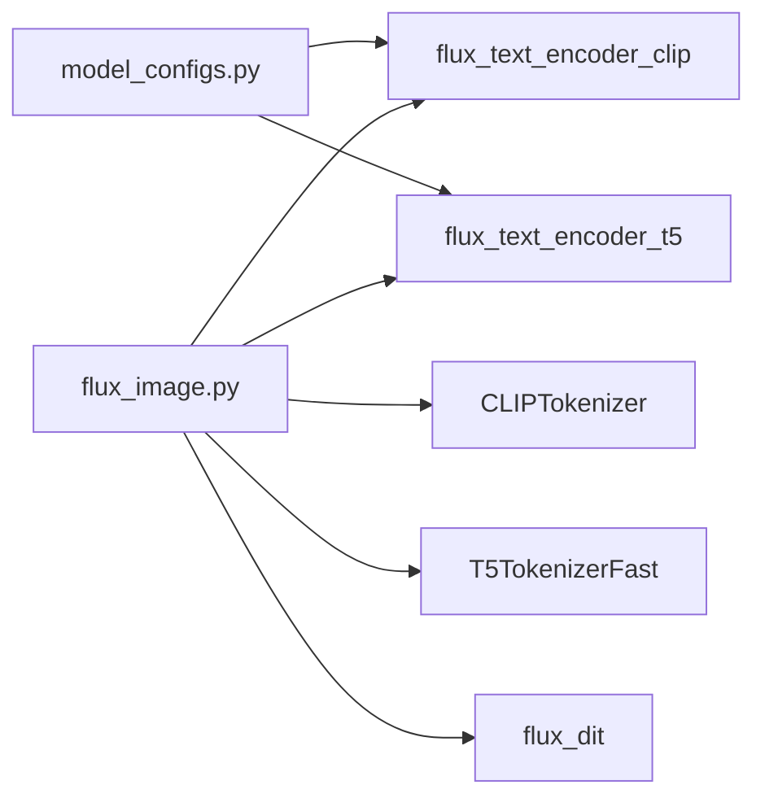

# Text Encoders (CLIP and T5)

<cite>
**Referenced Files in This Document**
- [flux_text_encoder_clip.py](file://diffsynth/models/flux_text_encoder_clip.py)
- [flux_text_encoder_t5.py](file://diffsynth/models/flux_text_encoder_t5.py)
- [flux_image.py](file://diffsynth/pipelines/flux_image.py)
- [flux_dit.py](file://diffsynth/models/flux_dit.py)
- [model_configs.py](file://diffsynth/configs/model_configs.py)
- [flux_text_encoder_clip_state_dict_converter.py](file://diffsynth/utils/state_dict_converters/flux_text_encoder_clip.py)
- [flux_text_encoder_t5_state_dict_converter.py](file://diffsynth/utils/state_dict_converters/flux_text_encoder_t5.py)
</cite>

## Table of Contents
1. [Introduction](#introduction)
2. [Project Structure](#project-structure)
3. [Core Components](#core-components)
4. [Architecture Overview](#architecture-overview)
5. [Detailed Component Analysis](#detailed-component-analysis)
6. [Dependency Analysis](#dependency-analysis)
7. [Performance Considerations](#performance-considerations)
8. [Troubleshooting Guide](#troubleshooting-guide)
9. [Conclusion](#conclusion)
10. [Appendices](#appendices)

## Introduction
This document explains the FLUX text encoder implementations that support both CLIP and T5 architectures, detailing how text prompts are tokenized, encoded into latent representations, and integrated with the diffusion process via cross-attention. It covers configuration options for different encoder sizes, prompt handling strategies, performance trade-offs between CLIP and T5 encoders, and provides guidance for customizing text processing pipelines or implementing alternative encoders.

## Project Structure
The FLUX pipeline integrates two text encoders:
- A CLIP-style encoder producing a pooled embedding used as global conditioning.
- A T5 encoder producing a sequence of contextual embeddings used for cross-attention within the DiT blocks.

**Diagram sources**
- [flux_image.py](file://diffsynth/pipelines/flux_image.py)
- [flux_text_encoder_clip.py](file://diffsynth/models/flux_text_encoder_clip.py)
- [flux_text_encoder_t5.py](file://diffsynth/models/flux_text_encoder_t5.py)
- [flux_dit.py](file://diffsynth/models/flux_dit.py)

**Section sources**
- [flux_image.py](file://diffsynth/pipelines/flux_image.py)
- [flux_text_encoder_clip.py](file://diffsynth/models/flux_text_encoder_clip.py)
- [flux_text_encoder_t5.py](file://diffsynth/models/flux_text_encoder_t5.py)
- [flux_dit.py](file://diffsynth/models/flux_dit.py)

## Core Components
- FluxTextEncoderClip: A compact transformer-based CLIP encoder that returns a pooled embedding and optionally hidden states.
- FluxTextEncoderT5: A T5 encoder wrapper returning per-token hidden states for cross-attention.
- FluxImageUnit_PromptEmbedder: Tokenizes prompts using CLIPTokenizer and T5TokenizerFast, runs both encoders, and prepares text_ids for positional encoding.
- FluxDiT: The diffusion transformer that consumes both pooled CLIP embeddings and T5 sequence embeddings through joint attention and context projection.

Key responsibilities:
- Prompt tokenization and truncation to fixed lengths.
- Encoder-specific forward passes yielding compatible embeddings.
- Construction of text_ids for RoPE-based positional encoding.
- Conditioning injection into DiT via linear projections and joint attention.

**Section sources**
- [flux_text_encoder_clip.py](file://diffsynth/models/flux_text_encoder_clip.py)
- [flux_text_encoder_t5.py](file://diffsynth/models/flux_text_encoder_t5.py)
- [flux_image.py](file://diffsynth/pipelines/flux_image.py)
- [flux_dit.py](file://diffsynth/models/flux_dit.py)

## Architecture Overview
The FLUX pipeline processes prompts through dual encoders and merges their outputs into the DiT model:

**Diagram sources**
- [flux_image.py](file://diffsynth/pipelines/flux_image.py)
- [flux_text_encoder_clip.py](file://diffsynth/models/flux_text_encoder_clip.py)
- [flux_text_encoder_t5.py](file://diffsynth/models/flux_text_encoder_t5.py)
- [flux_dit.py](file://diffsynth/models/flux_dit.py)

## Detailed Component Analysis

### CLIP Text Encoder (FluxTextEncoderClip)
- Architecture: Embedding layer + fixed position embeddings + stacked encoder layers with self-attention and MLP; final LayerNorm.
- Forward: Returns pooled embedding (selected by argmax over token IDs) and last hidden state; supports an optional attention mask override.
- Configuration: embed_dim, vocab_size, max_position_embeddings, num_encoder_layers, encoder_intermediate_size.
- State dict conversion: Maps original CLIP keys to internal names for compatibility.

**Diagram sources**
- [flux_text_encoder_clip.py](file://diffsynth/models/flux_text_encoder_clip.py)

**Section sources**
- [flux_text_encoder_clip.py](file://diffsynth/models/flux_text_encoder_clip.py)
- [flux_text_encoder_clip_state_dict_converter.py](file://diffsynth/utils/state_dict_converters/flux_text_encoder_clip.py)

### T5 Text Encoder (FluxTextEncoderT5)
- Architecture: Wraps T5EncoderModel with explicit configuration (vocab size, d_model, num_layers, etc.).
- Forward: Returns last_hidden_state (per-token embeddings) suitable for cross-attention.
- State dict conversion: Maps shared embedding weights appropriately.

**Diagram sources**
- [flux_text_encoder_t5.py](file://diffsynth/models/flux_text_encoder_t5.py)

**Section sources**
- [flux_text_encoder_t5.py](file://diffsynth/models/flux_text_encoder_t5.py)
- [flux_text_encoder_t5_state_dict_converter.py](file://diffsynth/utils/state_dict_converters/flux_text_encoder_t5.py)

### Prompt Embedding Pipeline (FluxImageUnit_PromptEmbedder)
- Tokenization: Uses CLIPTokenizer (max_length=77) and T5TokenizerFast (max_length=t5_sequence_length).
- Encoding: Calls both encoders to produce pooled_prompt_emb and prompt_emb; constructs text_ids as zeros matching T5 sequence length.
- Output: Provides prompt_emb, pooled_prompt_emb, and text_ids to the DiT.

**Diagram sources**
- [flux_image.py](file://diffsynth/pipelines/flux_image.py)
- [flux_text_encoder_clip.py](file://diffsynth/models/flux_text_encoder_clip.py)
- [flux_text_encoder_t5.py](file://diffsynth/models/flux_text_encoder_t5.py)

**Section sources**
- [flux_image.py](file://diffsynth/pipelines/flux_image.py)

### Diffusion Transformer Integration (FluxDiT)
- Inputs: Image latents, timestep, pooled CLIP embedding, T5 sequence embedding, and text_ids.
- Projections: Pooled CLIP embedding is projected via a sequential MLP; T5 sequence embedding is projected via a linear context_embedder.
- Joint Attention: Concatenates Q/K/V from both modalities, applies RoPE, and computes attention across combined sequences.
- Positional Encoding: text_ids and image_ids are concatenated and passed through RoPE embedding.

**Diagram sources**
- [flux_dit.py](file://diffsynth/models/flux_dit.py)

**Section sources**
- [flux_dit.py](file://diffsynth/models/flux_dit.py)

## Dependency Analysis
- Model configurations define how each component is loaded and converted:
  - flux_text_encoder_clip and flux_text_encoder_t5 entries specify model classes and state dict converters.
- Pipeline initialization loads tokenizers and encoders based on provided configs.

**Diagram sources**
- [model_configs.py](file://diffsynth/configs/model_configs.py)
- [flux_image.py](file://diffsynth/pipelines/flux_image.py)

**Section sources**
- [model_configs.py](file://diffsynth/configs/model_configs.py)
- [flux_image.py](file://diffsynth/pipelines/flux_image.py)

## Performance Considerations
- CLIP vs T5 trade-offs:
  - CLIP produces a single pooled vector (fast, low memory), but less detailed semantics.
  - T5 produces per-token embeddings (higher memory and compute), enabling richer cross-attention interactions.
- Sequence length:
  - T5 sequence length (t5_sequence_length) directly impacts memory and speed; larger values improve detail but increase cost.
- Precision:
  - Both encoders operate in bfloat16; ensure GPU supports BF16 for optimal performance.
- VRAM management:
  - Use pipeline VRAM management features to load/unload models during inference to reduce peak memory.

[No sources needed since this section provides general guidance]

## Troubleshooting Guide
- Tokenizer mismatch:
  - Ensure tokenizer_1_config and tokenizer_2_config point to correct repositories and files.
- Shape mismatches:
  - Verify prompt_emb and pooled_prompt_emb shapes align with DiT expectations; text_ids must match prompt_emb sequence length.
- State dict loading:
  - Confirm state dict converters are applied for CLIP and T5 encoders to map keys correctly.
- Memory errors:
  - Reduce t5_sequence_length or enable VRAM management; consider lower precision if supported.

**Section sources**
- [flux_image.py](file://diffsynth/pipelines/flux_image.py)
- [flux_text_encoder_clip_state_dict_converter.py](file://diffsynth/utils/state_dict_converters/flux_text_encoder_clip.py)
- [flux_text_encoder_t5_state_dict_converter.py](file://diffsynth/utils/state_dict_converters/flux_text_encoder_t5.py)

## Conclusion
The FLUX text encoder system combines a compact CLIP encoder for global conditioning and a powerful T5 encoder for detailed contextual information. The pipeline orchestrates tokenization, encoding, and integration into the DiT model via joint attention and positional encoding. Users can tune sequence lengths, leverage VRAM management, and extend the system with custom encoders or processors.

[No sources needed since this section summarizes without analyzing specific files]

## Appendices

### Customizing Text Processing Pipelines
- Replace tokenizers:
  - Swap CLIPTokenizer and T5TokenizerFast with custom tokenizers in FluxImageUnit_PromptEmbedder.
- Modify sequence lengths:
  - Adjust max_length for CLIP and t5_sequence_length for T5 to balance quality and performance.
- Add new encoders:
  - Implement a new encoder class similar to FluxTextEncoderClip/T5 and integrate it into the pipeline’s unit runner.

**Section sources**
- [flux_image.py](file://diffsynth/pipelines/flux_image.py)

### Implementing Alternative Encoders
- Follow the interface:
  - Accept input_ids and return embeddings compatible with DiT (pooled and/or sequence).
- Provide state dict converter:
  - Map external checkpoint keys to internal parameter names for seamless loading.

**Section sources**
- [flux_text_encoder_clip_state_dict_converter.py](file://diffsynth/utils/state_dict_converters/flux_text_encoder_clip.py)
- [flux_text_encoder_t5_state_dict_converter.py](file://diffsynth/utils/state_dict_converters/flux_text_encoder_t5.py)