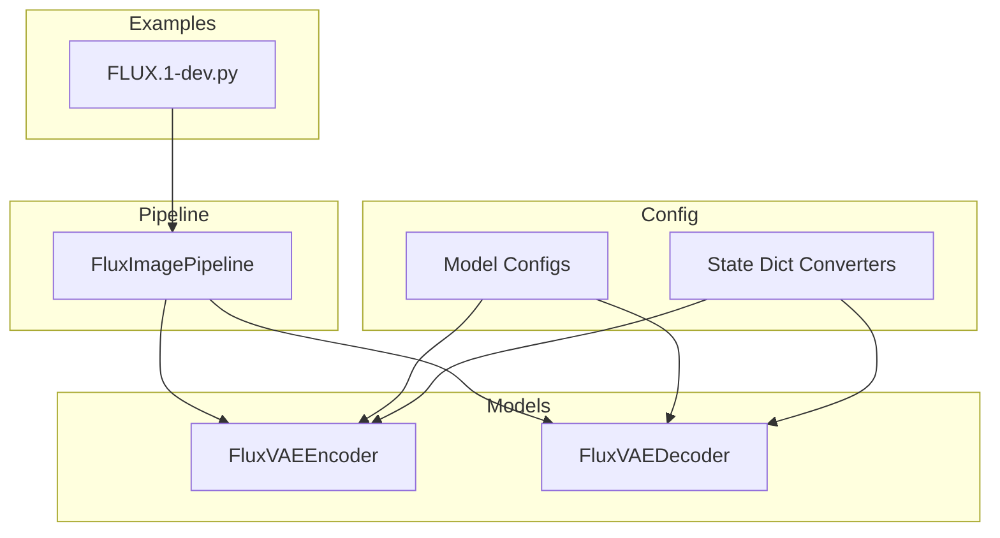
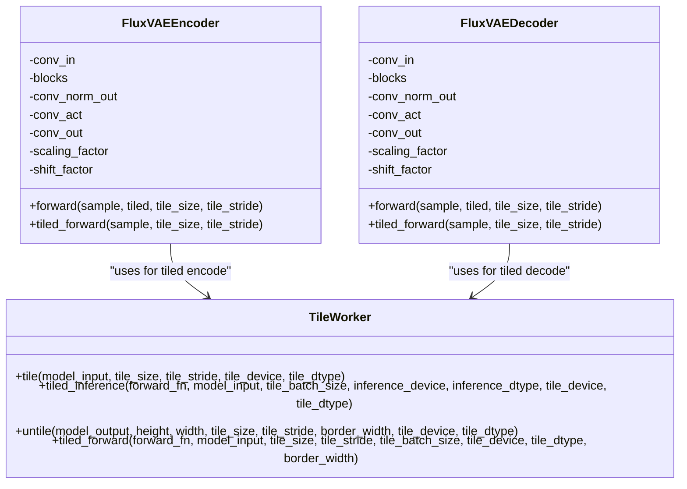
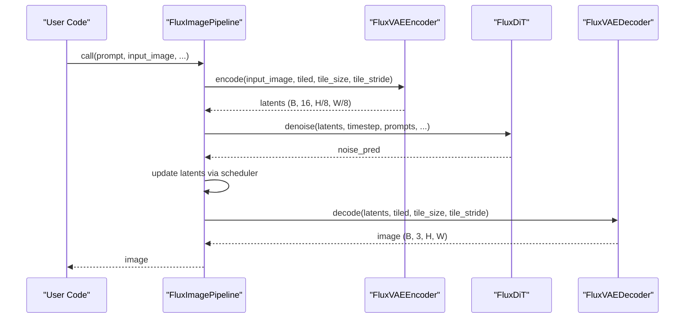
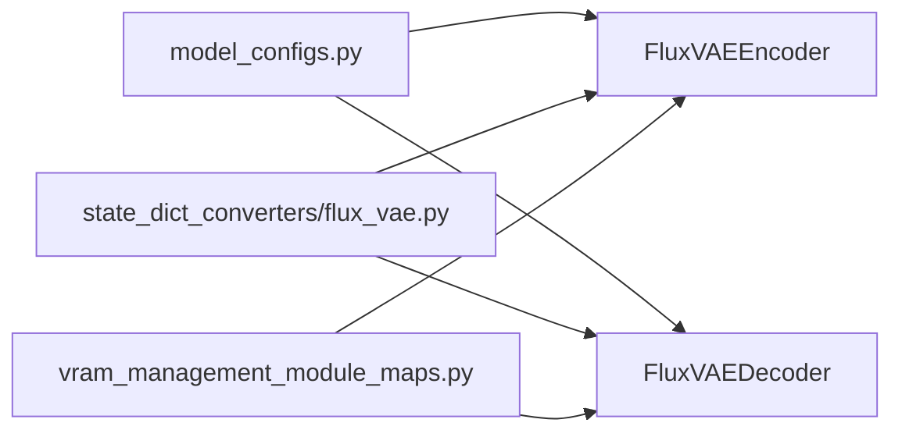

# VAE Component

<cite>
**Referenced Files in This Document**
- [flux_vae.py](file://diffsynth/models/flux_vae.py)
- [flux_image.py](file://diffsynth/pipelines/flux_image.py)
- [model_configs.py](file://diffsynth/configs/model_configs.py)
- [flux_vae_state_dict_converters.py](file://diffsynth/utils/state_dict_converters/flux_vae.py)
- [FLUX.1-dev.py](file://examples/flux/model_inference/FLUX.1-dev.py)
</cite>

## Table of Contents
1. [Introduction](#introduction)
2. [Project Structure](#project-structure)
3. [Core Components](#core-components)
4. [Architecture Overview](#architecture-overview)
5. [Detailed Component Analysis](#detailed-component-analysis)
6. [Dependency Analysis](#dependency-analysis)
7. [Performance Considerations](#performance-considerations)
8. [Troubleshooting Guide](#troubleshooting-guide)
9. [Conclusion](#conclusion)
10. [Appendices](#appendices)

## Introduction
This document explains the FLUX Variational Autoencoder (VAE) component used for latent space encoding and decoding within the DiffSynth framework. It covers the VAE architecture, compression ratios, integration with the diffusion pipeline, configuration parameters, latent space properties, reconstruction quality considerations, practical usage examples, memory optimization techniques, and performance tuning across different input resolutions.

## Project Structure
The FLUX VAE is implemented as two PyTorch modules: an encoder and a decoder. They are integrated into the FluxImagePipeline which orchestrates text encoders, the DiT model, and the VAE during inference. Model loading and state-dict conversion are configured centrally.

**Diagram sources**
- [flux_vae.py:296-434](file://diffsynth/models/flux_vae.py#L296-L434)
- [flux_image.py:57-177](file://diffsynth/pipelines/flux_image.py#L57-L177)
- [model_configs.py:350-361](file://diffsynth/configs/model_configs.py#L350-L361)
- [flux_vae_state_dict_converters.py:1-382](file://diffsynth/utils/state_dict_converters/flux_vae.py#L1-L382)
- [FLUX.1-dev.py:1-27](file://examples/flux/model_inference/FLUX.1-dev.py#L1-L27)

**Section sources**
- [flux_vae.py:1-452](file://diffsynth/models/flux_vae.py#L1-L452)
- [flux_image.py:57-177](file://diffsynth/pipelines/flux_image.py#L57-L177)
- [model_configs.py:350-361](file://diffsynth/configs/model_configs.py#L350-L361)
- [flux_vae_state_dict_converters.py:1-382](file://diffsynth/utils/state_dict_converters/flux_vae.py#L1-L382)
- [FLUX.1-dev.py:1-27](file://examples/flux/model_inference/FLUX.1-dev.py#L1-L27)

## Core Components
- FluxVAEEncoder: Encodes RGB images to a 16-channel latent representation. Uses GroupNorm, ResNet blocks, downsamplers, and a mid attention block. Applies scaling and shifting parameters during encode/decode.
- FluxVAEDecoder: Reconstructs images from 16-channel latents using ResNet blocks, upsamplers, and a mid attention block. Outputs 3-channel RGB images.
- TileWorker: Provides tiled forward pass utilities to reduce memory usage by splitting inputs into tiles, applying overlap blending, and reassembling outputs.

Key behaviors:
- Latent channels: 16
- Spatial compression factor: 8x (image H,W -> latent H/8, W/8)
- Scaling and shift factors applied consistently between encoder and decoder

**Section sources**
- [flux_vae.py:368-434](file://diffsynth/models/flux_vae.py#L368-L434)
- [flux_vae.py:296-366](file://diffsynth/models/flux_vae.py#L296-L366)
- [flux_vae.py:5-107](file://diffsynth/models/flux_vae.py#L5-L107)

## Architecture Overview
The FLUX VAE follows a symmetric encoder-decoder design with residual connections, group normalization, and attention at the bottleneck. The encoder reduces spatial resolution by three downsampling stages (factor 8 overall), while the decoder reconstructs via three upsampling stages. Attention blocks improve global coherence in both encoder and decoder.

**Diagram sources**
- [flux_vae.py:368-434](file://diffsynth/models/flux_vae.py#L368-L434)
- [flux_vae.py:296-366](file://diffsynth/models/flux_vae.py#L296-L366)
- [flux_vae.py:5-107](file://diffsynth/models/flux_vae.py#L5-L107)

## Detailed Component Analysis

### Encoder Analysis
- Input: RGB image tensor (B, 3, H, W)
- Preprocess: Convolutional projection to initial channels
- Blocks: Multiple ResNet blocks with GroupNorm and SiLU activations; downsamplers reduce spatial size by stride 2
- Mid-block: ResNet + VAEAttentionBlock + ResNet
- Output: conv_norm_out -> conv_act -> conv_out -> select first 16 channels -> apply shift and scale to produce latents (B, 16, H/8, W/8)

Latent properties:
- Channels: 16
- Spatial dimensions: H/8 x W/8
- Normalization: GroupNorm with eps=1e-6
- Activation: SiLU

Memory-efficient options:
- tiled=True enables TileWorker.tiled_forward to process overlapping tiles and blend results

**Section sources**
- [flux_vae.py:368-434](file://diffsynth/models/flux_vae.py#L368-L434)

### Decoder Analysis
- Input: Latent tensor (B, 16, H/8, W/8)
- Preprocess: Apply inverse scaling and shift, then convolutional projection
- Blocks: ResNet blocks with GroupNorm and SiLU; upsamplers increase spatial size by factor 2
- Mid-block: ResNet + VAEAttentionBlock + ResNet
- Output: conv_norm_out -> conv_act -> conv_out -> produces RGB image (B, 3, H, W)

Reconstruction flow:
- Inverse normalization consistent with encoder
- Upsampling restores original resolution
- Final 3-channel output matches input color space

Memory-efficient options:
- tiled=True uses TileWorker.tiled_forward for low-memory decoding

**Section sources**
- [flux_vae.py:296-366](file://diffsynth/models/flux_vae.py#L296-L366)

### Tiling Mechanism
TileWorker implements:
- tiling via torch.nn.Unfold to split input into overlapping patches
- per-tile forward computation with optional batched processing
- blending via mask-based fold to avoid seams
- dynamic adjustment of tile sizes based on I/O scaling

Parameters:
- tile_size: base patch size (default 64)
- tile_stride: step between tiles (default 32)
- tile_batch_size: number of tiles processed per iteration
- border_width: overlap region width for blending (default half stride)

**Section sources**
- [flux_vae.py:5-107](file://diffsynth/models/flux_vae.py#L5-L107)

### Integration with Diffusion Pipeline
FluxImagePipeline integrates the VAE as follows:
- During input image embedding, the encoder converts images to latents
- During generation, the decoder reconstructs images from final latents
- Tiling flags propagate through the pipeline to enable memory-efficient operations

Sequence of operations:
- Shape checking and noise initialization
- Optional input image encoding via VAE encoder
- DiT denoising loop
- VAE decoding to image

**Diagram sources**
- [flux_image.py:180-291](file://diffsynth/pipelines/flux_image.py#L180-L291)
- [flux_image.py:314-333](file://diffsynth/pipelines/flux_image.py#L314-L333)
- [flux_vae.py:368-434](file://diffsynth/models/flux_vae.py#L368-L434)
- [flux_vae.py:296-366](file://diffsynth/models/flux_vae.py#L296-L366)

**Section sources**
- [flux_image.py:180-291](file://diffsynth/pipelines/flux_image.py#L180-L291)

## Dependency Analysis
- Model configuration maps FluxVAEEncoder and FluxVAEDecoder to their classes and state dict converters
- State dict converters rename keys from external formats (e.g., diffusers) to internal naming conventions
- VRAM management module maps assign general VRAM config to VAE components

**Diagram sources**
- [model_configs.py:350-361](file://diffsynth/configs/model_configs.py#L350-L361)
- [flux_vae_state_dict_converters.py:1-382](file://diffsynth/utils/state_dict_converters/flux_vae.py#L1-L382)

**Section sources**
- [model_configs.py:350-361](file://diffsynth/configs/model_configs.py#L350-L361)
- [flux_vae_state_dict_converters.py:1-382](file://diffsynth/utils/state_dict_converters/flux_vae.py#L1-L382)

## Performance Considerations
- Use tiled=True for large images to cap memory usage; default tile_size=64, tile_stride=32 work well for most cases
- Adjust tile_batch_size in TileWorker.tiled_forward to balance throughput and memory
- Prefer bfloat16 dtype for faster inference when supported by hardware
- Avoid unnecessary device/dtype conversions inside loops; let TileWorker handle device placement
- For video or very high-resolution inputs, consider reducing tile_size or increasing overlap to minimize artifacts

[No sources needed since this section provides general guidance]

## Troubleshooting Guide
Common issues and remedies:
- Out-of-memory errors: Enable tiled mode and reduce tile_size; ensure tile_stride is set appropriately
- Reconstruction artifacts: Increase tile_overlap implicitly via smaller tile_stride; verify consistent scaling/shift parameters
- Mismatched shapes: Ensure input images are divisible by 8 (pipeline enforces this); check that latents have 16 channels
- Slow inference: Reduce tile_batch_size if GPU memory is constrained; use appropriate dtype (bf16/fp16)

**Section sources**
- [flux_vae.py:5-107](file://diffsynth/models/flux_vae.py#L5-L107)
- [flux_image.py:314-333](file://diffsynth/pipelines/flux_image.py#L314-L333)

## Conclusion
The FLUX VAE provides a robust, memory-efficient encoder-decoder pair for transforming images into compact 16-channel latents and back. Its tiled inference capability enables handling of high-resolution inputs without excessive memory consumption. Integrated seamlessly into the FluxImagePipeline, it supports flexible configuration and efficient operation across diverse use cases.

[No sources needed since this section summarizes without analyzing specific files]

## Appendices

### Practical Usage Examples
- Basic generation with VAE integration:
  - Load models including the VAE weights (ae.safetensors)
  - Call the pipeline with prompt and optional input image
  - The pipeline automatically encodes input images to latents and decodes final latents to images

- Tiled inference for large images:
  - Set tiled=True and adjust tile_size/tile_stride to control memory vs. quality trade-off

- Custom pipeline integration:
  - Instantiate FluxVAEEncoder and FluxVAEDecoder directly
  - Use forward(..., tiled=True, tile_size=..., tile_stride=...) for memory-efficient operations

**Section sources**
- [FLUX.1-dev.py:1-27](file://examples/flux/model_inference/FLUX.1-dev.py#L1-L27)
- [flux_image.py:180-291](file://diffsynth/pipelines/flux_image.py#L180-L291)
- [flux_vae.py:333-347](file://diffsynth/models/flux_vae.py#L333-L347)
- [flux_vae.py:401-415](file://diffsynth/models/flux_vae.py#L401-L415)