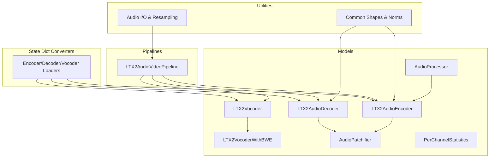
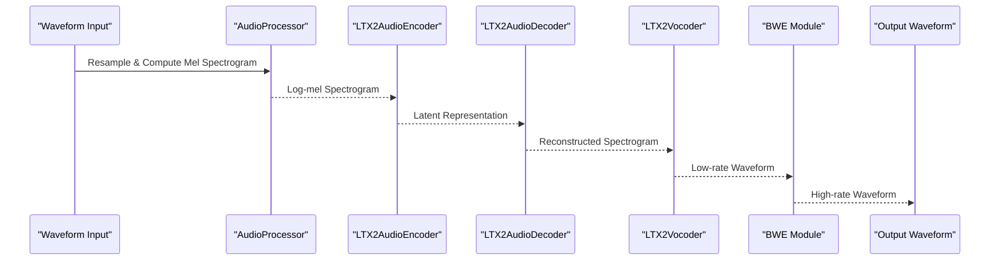
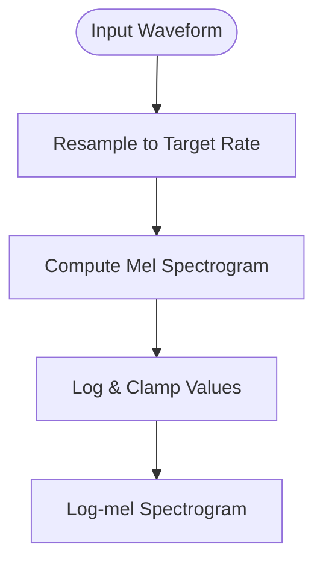
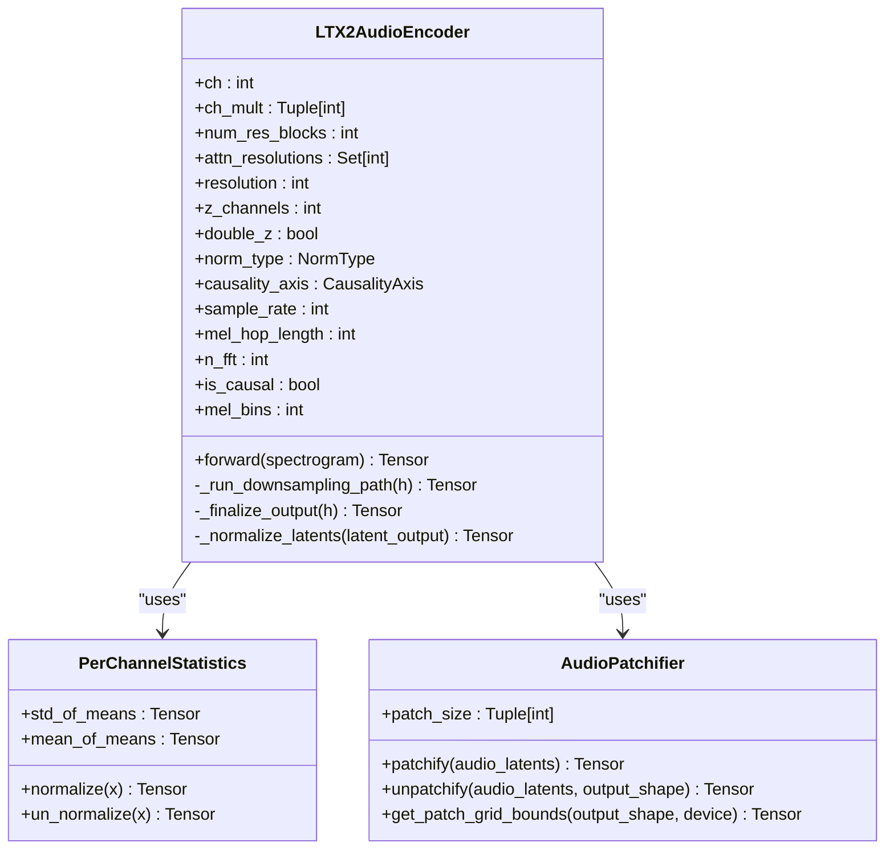
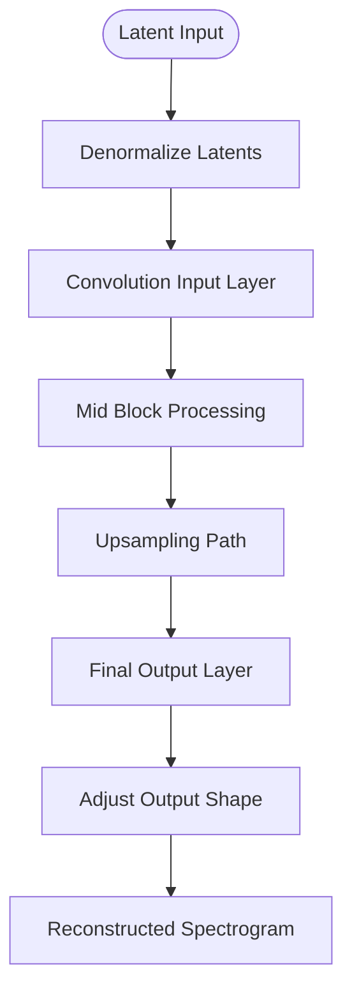
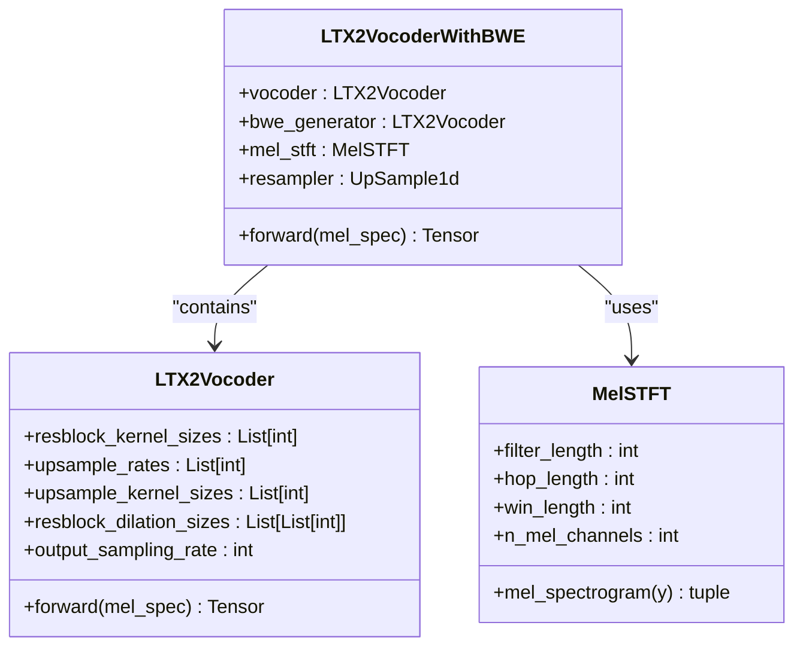
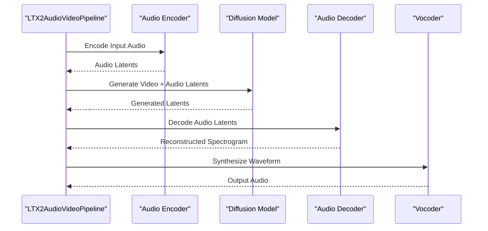
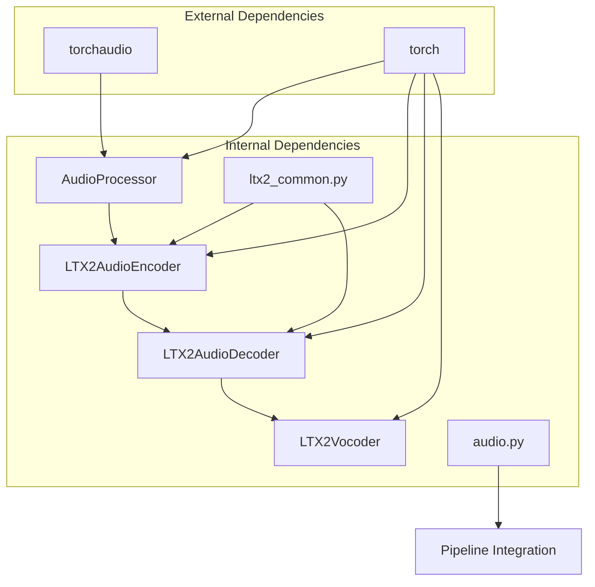

# Audio VAE Implementation

<cite>
**Referenced Files in This Document**
- [ltx2_audio_vae.py](file://diffsynth/models/ltx2_audio_vae.py)
- [audio.py](file://diffsynth/utils/data/audio.py)
- [ltx2_common.py](file://diffsynth/models/ltx2_common.py)
- [ltx2_audio_video.py](file://diffsynth/pipelines/ltx2_audio_video.py)
- [ltx2_audio_vae.py](file://diffsynth/utils/state_dict_converters/ltx2_audio_vae.py)
</cite>

## Table of Contents
1. [Introduction](#introduction)
2. [Project Structure](#project-structure)
3. [Core Components](#core-components)
4. [Architecture Overview](#architecture-overview)
5. [Detailed Component Analysis](#detailed-component-analysis)
6. [Dependency Analysis](#dependency-analysis)
7. [Performance Considerations](#performance-considerations)
8. [Troubleshooting Guide](#troubleshooting-guide)
9. [Conclusion](#conclusion)
10. [Appendices](#appendices)

## Introduction
This document provides comprehensive documentation for the LTX2 Audio VAE, a Variational Autoencoder designed for audio latent space processing within the LTX-2 pipeline. It covers the encoder-decoder architecture, audio-specific latent representations, compression ratios, and reconstruction quality considerations. It also documents the audio preprocessing pipeline, spectrogram handling, integration with the main diffusion model, configuration options for different audio formats, sampling rates, and quality settings. Examples of encoding/decoding workflows and performance optimization techniques are included to help users implement and optimize audio processing effectively.

## Project Structure
The LTX2 Audio VAE is implemented as part of the DiffSynth framework, organized into models, utilities, pipelines, and state dict converters:
- Models: Core VAE components (encoder, decoder, vocoder), common shapes and normalization utilities.
- Utilities: Audio I/O, resampling, and conversion helpers.
- Pipelines: Integration points for audio/video generation, including audio encoding/decoding steps.
- State Dict Converters: Utilities for loading/saving model weights.

**Diagram sources**
- [ltx2_audio_vae.py:12-100](file://diffsynth/models/ltx2_audio_vae.py#L12-L100)
- [ltx2_audio_vae.py:873-1060](file://diffsynth/models/ltx2_audio_vae.py#L873-L1060)
- [ltx2_audio_vae.py:1062-1280](file://diffsynth/models/ltx2_audio_vae.py#L1062-L1280)
- [ltx2_audio_vae.py:1541-1686](file://diffsynth/models/ltx2_audio_vae.py#L1541-L1686)
- [ltx2_audio_vae.py:1767-1873](file://diffsynth/models/ltx2_audio_vae.py#L1767-L1873)
- [audio.py:1-109](file://diffsynth/utils/data/audio.py#L1-L109)
- [ltx2_common.py:95-158](file://diffsynth/models/ltx2_common.py#L95-L158)
- [ltx2_audio_video.py:28-78](file://diffsynth/pipelines/ltx2_audio_video.py#L28-L78)
- [ltx2_audio_vae.py:1-33](file://diffsynth/utils/state_dict_converters/ltx2_audio_vae.py#L1-L33)

**Section sources**
- [ltx2_audio_vae.py:12-100](file://diffsynth/models/ltx2_audio_vae.py#L12-L100)
- [audio.py:1-109](file://diffsynth/utils/data/audio.py#L1-L109)
- [ltx2_common.py:95-158](file://diffsynth/models/ltx2_common.py#L95-L158)
- [ltx2_audio_video.py:28-78](file://diffsynth/pipelines/ltx2_audio_video.py#L28-L78)
- [ltx2_audio_vae.py:1-33](file://diffsynth/utils/state_dict_converters/ltx2_audio_vae.py#L1-L33)

## Core Components
- AudioProcessor: Converts waveforms to log-mel spectrograms with optional resampling.
- AudioPatchifier: Handles patching/unpatching of audio latents and computes temporal bounds.
- PerChannelStatistics: Normalizes/denormalizes latent representations per channel.
- LTX2AudioEncoder: Compresses spectrograms into latent representations using downsampling paths, residual blocks, and attention.
- LTX2AudioDecoder: Reconstructs spectrograms from latents via upsampling path and residual blocks.
- LTX2Vocoder: Synthesizes waveforms from mel spectrograms using BigVGAN-style architecture.
- LTX2VocoderWithBWE: Extends vocoder with bandwidth extension for higher sample rate output.

Key configuration parameters include sample rate, mel hop length, FFT size, number of mel bins, causal convolution axis, and normalization type.

**Section sources**
- [ltx2_audio_vae.py:12-64](file://diffsynth/models/ltx2_audio_vae.py#L12-L64)
- [ltx2_audio_vae.py:67-261](file://diffsynth/models/ltx2_audio_vae.py#L67-L261)
- [ltx2_audio_vae.py:814-830](file://diffsynth/models/ltx2_audio_vae.py#L814-L830)
- [ltx2_audio_vae.py:873-1060](file://diffsynth/models/ltx2_audio_vae.py#L873-L1060)
- [ltx2_audio_vae.py:1062-1280](file://diffsynth/models/ltx2_audio_vae.py#L1062-L1280)
- [ltx2_audio_vae.py:1541-1686](file://diffsynth/models/ltx2_audio_vae.py#L1541-L1686)
- [ltx2_audio_vae.py:1767-1873](file://diffsynth/models/ltx2_audio_vae.py#L1767-L1873)

## Architecture Overview
The LTX2 Audio VAE follows an encoder-decoder structure with specialized audio processing:
- Input waveform → AudioProcessor → Log-mel spectrogram → LTX2AudioEncoder → Latent representation
- Latent representation → LTX2AudioDecoder → Reconstructed spectrogram → LTX2Vocoder → Waveform
- Optional BWE module enhances high-frequency content for higher sample rate output.

**Diagram sources**
- [ltx2_audio_vae.py:12-64](file://diffsynth/models/ltx2_audio_vae.py#L12-L64)
- [ltx2_audio_vae.py:873-1060](file://diffsynth/models/ltx2_audio_vae.py#L873-L1060)
- [ltx2_audio_vae.py:1062-1280](file://diffsynth/models/ltx2_audio_vae.py#L1062-L1280)
- [ltx2_audio_vae.py:1541-1686](file://diffsynth/models/ltx2_audio_vae.py#L1541-L1686)
- [ltx2_audio_vae.py:1767-1873](file://diffsynth/models/ltx2_audio_vae.py#L1767-L1873)

## Detailed Component Analysis

### AudioProcessor
- Resamples input waveform to target sample rate if needed.
- Computes log-mel spectrogram using torchaudio transforms.
- Supports configurable FFT size, hop length, and mel bins.

**Diagram sources**
- [ltx2_audio_vae.py:40-64](file://diffsynth/models/ltx2_audio_vae.py#L40-L64)

**Section sources**
- [ltx2_audio_vae.py:12-64](file://diffsynth/models/ltx2_audio_vae.py#L12-L64)

### LTX2AudioEncoder
- Uses downsampling path with residual blocks and attention.
- Applies per-channel statistics normalization to latent outputs.
- Configurable causal convolutions for streaming compatibility.

**Diagram sources**
- [ltx2_audio_vae.py:873-1060](file://diffsynth/models/ltx2_audio_vae.py#L873-L1060)
- [ltx2_audio_vae.py:814-830](file://diffsynth/models/ltx2_audio_vae.py#L814-L830)
- [ltx2_audio_vae.py:67-261](file://diffsynth/models/ltx2_audio_vae.py#L67-L261)

**Section sources**
- [ltx2_audio_vae.py:873-1060](file://diffsynth/models/ltx2_audio_vae.py#L873-L1060)

### LTX2AudioDecoder
- Symmetric decoder mirroring encoder structure.
- Denormalizes latents using per-channel statistics.
- Adjusts output shape for variable-length audio processing.

**Diagram sources**
- [ltx2_audio_vae.py:1062-1280](file://diffsynth/models/ltx2_audio_vae.py#L1062-L1280)

**Section sources**
- [ltx2_audio_vae.py:1062-1280](file://diffsynth/models/ltx2_audio_vae.py#L1062-L1280)

### LTX2Vocoder and BWE
- BigVGAN-style vocoder synthesizes waveforms from mel spectrograms.
- BWE module extends bandwidth for higher sample rate output.
- Uses anti-aliased resampling with kaiser-sinc filters.

**Diagram sources**
- [ltx2_audio_vae.py:1541-1686](file://diffsynth/models/ltx2_audio_vae.py#L1541-L1686)
- [ltx2_audio_vae.py:1767-1873](file://diffsynth/models/ltx2_audio_vae.py#L1767-L1873)
- [ltx2_audio_vae.py:1689-1765](file://diffsynth/models/ltx2_audio_vae.py#L1689-L1765)

**Section sources**
- [ltx2_audio_vae.py:1541-1686](file://diffsynth/models/ltx2_audio_vae.py#L1541-L1686)
- [ltx2_audio_vae.py:1767-1873](file://diffsynth/models/ltx2_audio_vae.py#L1767-L1873)

### Pipeline Integration
The LTX2AudioVideoPipeline integrates audio processing with video generation:
- Audio encoding during input processing
- Audio latent generation during noise initialization
- Audio decoding and vocoder synthesis during output generation

**Diagram sources**
- [ltx2_audio_video.py:28-78](file://diffsynth/pipelines/ltx2_audio_video.py#L28-L78)
- [ltx2_audio_video.py:380-400](file://diffsynth/pipelines/ltx2_audio_video.py#L380-L400)
- [ltx2_audio_video.py:244-250](file://diffsynth/pipelines/ltx2_audio_video.py#L244-L250)

**Section sources**
- [ltx2_audio_video.py:28-78](file://diffsynth/pipelines/ltx2_audio_video.py#L28-L78)
- [ltx2_audio_video.py:380-400](file://diffsynth/pipelines/ltx2_audio_video.py#L380-L400)
- [ltx2_audio_video.py:244-250](file://diffsynth/pipelines/ltx2_audio_video.py#L244-L250)

## Dependency Analysis
The LTX2 Audio VAE has clear dependency relationships:
- AudioProcessor depends on torchaudio for signal processing
- Encoder/Decoder depend on common normalization and causality utilities
- Vocoder uses anti-aliased resampling components
- Pipeline integrates all components for end-to-end processing

**Diagram sources**
- [ltx2_audio_vae.py:1-10](file://diffsynth/models/ltx2_audio_vae.py#L1-L10)
- [ltx2_common.py:1-20](file://diffsynth/models/ltx2_common.py#L1-L20)
- [audio.py:1-10](file://diffsynth/utils/data/audio.py#L1-L10)

**Section sources**
- [ltx2_audio_vae.py:1-10](file://diffsynth/models/ltx2_audio_vae.py#L1-L10)
- [ltx2_common.py:1-20](file://diffsynth/models/ltx2_common.py#L1-L20)
- [audio.py:1-10](file://diffsynth/utils/data/audio.py#L1-L10)

## Performance Considerations
- **Causal Convolutions**: Enable streaming-compatible processing without lookahead
- **Per-channel Statistics**: Improve numerical stability and training convergence
- **Anti-aliased Resampling**: Reduces artifacts during sample rate conversion
- **Memory Optimization**: Use appropriate data types (bfloat16) and device placement
- **Batch Processing**: Optimize batch sizes for memory-constrained environments
- **Parallel Processing**: Leverage parallel execution of independent residual blocks

## Troubleshooting Guide
Common issues and solutions:
- **Shape Mismatch**: Ensure consistent tensor dimensions throughout pipeline
- **Memory Errors**: Reduce batch size or use gradient checkpointing
- **Audio Quality Issues**: Check sample rate consistency and mel spectrogram parameters
- **Causality Problems**: Verify causal padding configurations for streaming applications
- **Loading Issues**: Use appropriate state dict converters for model weights

**Section sources**
- [ltx2_audio_vae.py:1-33](file://diffsynth/utils/state_dict_converters/ltx2_audio_vae.py#L1-L33)

## Conclusion
The LTX2 Audio VAE provides a robust framework for audio latent space processing with efficient encoder-decoder architecture, flexible configuration options, and seamless integration with the LTX-2 diffusion pipeline. The implementation supports various audio formats, sampling rates, and quality settings while maintaining computational efficiency through causal processing and optimized resampling techniques.

## Appendices

### Configuration Options
- **Audio Processing**: sample_rate, mel_hop_length, n_fft, mel_bins
- **Encoder/Decoder**: ch, ch_mult, num_res_blocks, attn_resolutions, resolution, z_channels
- **Normalization**: norm_type (GROUP/PIXEL), causality_axis
- **Vocoder**: resblock_kernel_sizes, upsample_rates, upsample_kernel_sizes, activation functions

### Example Workflows
- **Audio Encoding**: Waveform → AudioProcessor → LTX2AudioEncoder → Latents
- **Audio Decoding**: Latents → LTX2AudioDecoder → Spectrogram → LTX2Vocoder → Waveform
- **High-Quality Output**: Add BWE module for extended frequency range

**Section sources**
- [ltx2_audio_vae.py:880-902](file://diffsynth/models/ltx2_audio_vae.py#L880-L902)
- [ltx2_audio_vae.py:1069-1087](file://diffsynth/models/ltx2_audio_vae.py#L1069-L1087)
- [ltx2_audio_vae.py:1565-1578](file://diffsynth/models/ltx2_audio_vae.py#L1565-L1578)