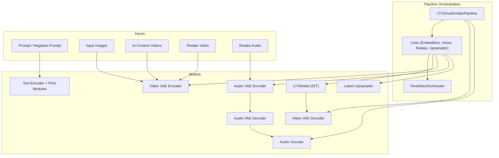
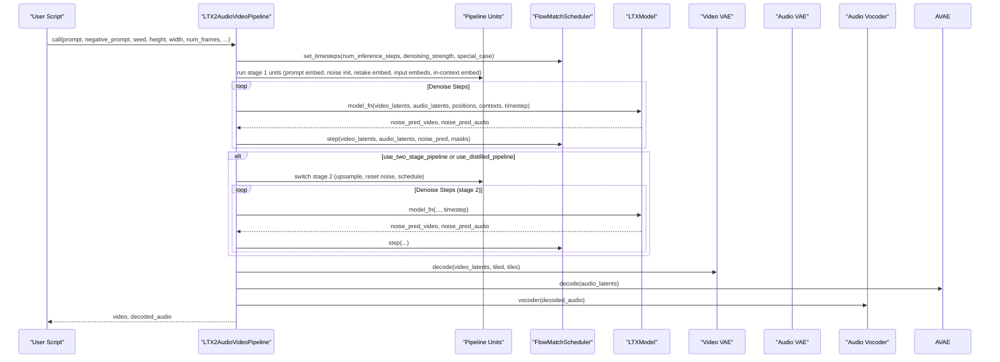
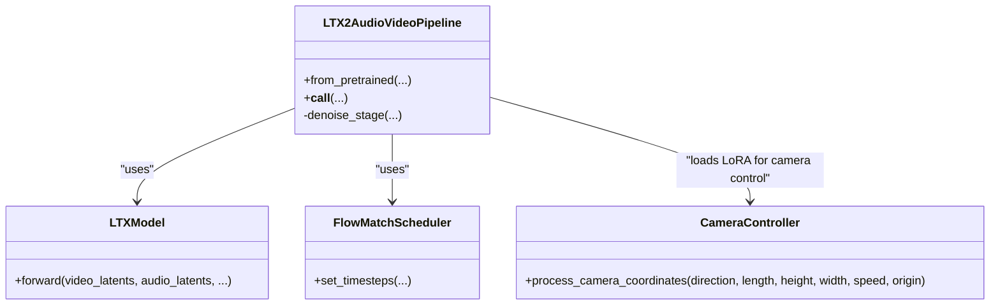
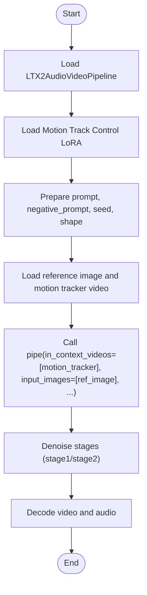
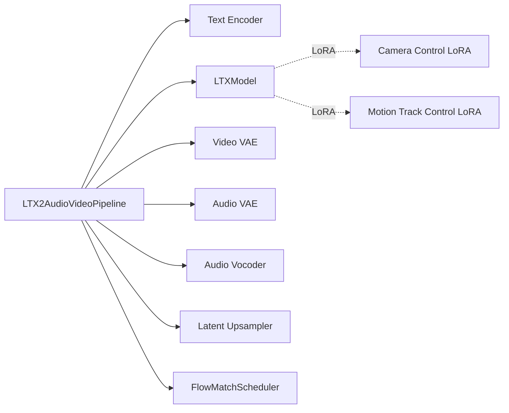

# Audio-Video Pipeline

<cite>
**Referenced Files in This Document**
- [ltx2_audio_video.py](file://diffsynth/pipelines/ltx2_audio_video.py)
- [flow_match.py](file://diffsynth/diffusion/flow_match.py)
- [ltx2_dit.py](file://diffsynth/models/ltx2_dit.py)
- [ltx2_common.py](file://diffsynth/models/ltx2_common.py)
- [LTX-2-T2AV-OneStage.py](file://examples/ltx2/model_inference/LTX-2-T2AV-OneStage.py)
- [LTX-2-T2AV-TwoStage.py](file://examples/ltx2/model_inference/LTX-2-T2AV-TwoStage.py)
- [LTX-2-T2AV-DistilledPipeline.py](file://examples/ltx2/model_inference/LTX-2-T2AV-DistilledPipeline.py)
- [LTX-2-T2AV-Camera-Control-Dolly-In.py](file://examples/ltx2/model_inference/LTX-2-T2AV-Camera-Control-Dolly-In.py)
- [LTX-2.3-T2AV-IC-LoRA-Motion-Track-Control.py](file://examples/ltx2/model_inference/LTX-2.3-T2AV-IC-LoRA-Motion-Track-Control.py)
- [wan_video_camera_controller.py](file://diffsynth/models/wan_video_camera_controller.py)
- [wan_video_motion_controller.py](file://diffsynth/models/wan_video_motion_controller.py)
- [LTX-2.md](file://docs/en/Model_Details/LTX-2.md)
</cite>

## Table of Contents
1. [Introduction](#introduction)
2. [Project Structure](#project-structure)
3. [Core Components](#core-components)
4. [Architecture Overview](#architecture-overview)
5. [Detailed Component Analysis](#detailed-component-analysis)
6. [Dependency Analysis](#dependency-analysis)
7. [Performance Considerations](#performance-considerations)
8. [Troubleshooting Guide](#troubleshooting-guide)
9. [Conclusion](#conclusion)
10. [Appendices](#appendices)

## Introduction
This document explains the LTX2 audio-video pipeline that orchestrates end-to-end text-to-audio-video generation, image-to-audio-video, and audio-to-video workflows. It covers:
- Two-stage generation for high-resolution output
- Distilled pipelines for faster inference
- Camera control integration via LoRA adapters
- Motion tracking capabilities through in-context video conditioning
- Parameter tuning options and workflow customization
- Practical examples for one-stage, two-stage, and distilled modes
- Guidance to optimize parameters under different hardware constraints

## Project Structure
The LTX2 audio-video pipeline is implemented as a modular DiffSynth pipeline with:
- A central orchestration class that composes processing units (embedders, noise initializers, retake embedders, upscaler, scheduler steps)
- A flow-matching scheduler tailored for LTX-2
- DiT-based diffusion model for joint audio-video denoising
- VAE encoders/decoders for video and audio, plus an audio vocoder
- Optional upsampler for stage 2 refinement
- Example scripts demonstrating different generation modes and controls

**Diagram sources**
- [ltx2_audio_video.py:28-249](file://diffsynth/pipelines/ltx2_audio_video.py#L28-L249)
- [flow_match.py:175-200](file://diffsynth/diffusion/flow_match.py#L175-L200)
- [ltx2_dit.py:1-200](file://diffsynth/models/ltx2_dit.py#L1-L200)
- [ltx2_common.py:8-158](file://diffsynth/models/ltx2_common.py#L8-L158)

**Section sources**
- [ltx2_audio_video.py:28-249](file://diffsynth/pipelines/ltx2_audio_video.py#L28-L249)
- [LTX-2.md:92-114](file://docs/en/Model_Details/LTX-2.md#L92-L114)

## Core Components
- LTX2AudioVideoPipeline: Orchestrates inputs, stages, and decoding; manages VRAM-aware loading and LoRA switching between stages.
- FlowMatchScheduler: Provides LTX-2 specific timestep schedules, including special cases for stage 2 and distilled stage 1.
- LTXModel (DiT): Joint audio-video denoiser that accepts patchified latents, positional embeddings, and optional reference/in-context conditions.
- Video/Audio VAEs: Encode/decode pixel frames and mel-spectrograms into/from latent spaces.
- Latent Upsampler: Refines video latents in stage 2 for higher resolution.
- Text Encoder + Post Modules: Convert prompts into separate video/audio contexts.

Key responsibilities:
- Stage selection and CFG handling (distilled vs two-stage)
- Shape validation and resizing for divisibility constraints
- Conditioning via images, retakes, and in-context videos
- Patchification/unpatchification and position embedding management
- Scheduler timesteps and stepwise denoising updates

**Section sources**
- [ltx2_audio_video.py:28-249](file://diffsynth/pipelines/ltx2_audio_video.py#L28-L249)
- [flow_match.py:175-200](file://diffsynth/diffusion/flow_match.py#L175-L200)
- [ltx2_dit.py:1-200](file://diffsynth/models/ltx2_dit.py#L1-L200)
- [ltx2_common.py:8-158](file://diffsynth/models/ltx2_common.py#L8-L158)

## Architecture Overview
The pipeline executes a staged denoising process:
- Stage 1: Generate base latents conditioned on prompt, images, retakes, and in-context videos.
- Stage 2 (optional): Switch to higher resolution, optionally apply stage 2 LoRA, upsample latents, reinitialize noise, and refine outputs.
- Decoding: Decode video latents via video VAE decoder; decode audio latents via audio VAE decoder and vocoder.

**Diagram sources**
- [ltx2_audio_video.py:149-249](file://diffsynth/pipelines/ltx2_audio_video.py#L149-L249)
- [flow_match.py:175-200](file://diffsynth/diffusion/flow_match.py#L175-L200)

**Section sources**
- [ltx2_audio_video.py:149-249](file://diffsynth/pipelines/ltx2_audio_video.py#L149-L249)
- [LTX-2.md:92-114](file://docs/en/Model_Details/LTX-2.md#L92-L114)

## Detailed Component Analysis

### LTX2AudioVideoPipeline Orchestration
- Initializes scheduler and component references
- Defines unit sequences for stage 1 and stage 2
- Handles CFG scale adjustments for distilled mode
- Executes denoise_stage loops per scheduler timesteps
- Loads decoders and vocoder post-denoising

Key behaviors:
- Distilled pipeline forces two-stage behavior and disables CFG by setting cfg_scale=1.0
- Two-stage requires stage 2 LoRA and upsampler to be present
- Shape checker enforces divisibility rules (32 for single-stage, 64 for two-stage)

**Section sources**
- [ltx2_audio_video.py:28-148](file://diffsynth/pipelines/ltx2_audio_video.py#L28-L148)
- [ltx2_audio_video.py:252-296](file://diffsynth/pipelines/ltx2_audio_video.py#L252-L296)

### FlowMatchScheduler for LTX-2
- Special-case schedules:
  - stage2: fixed short sigma sequence for refinement
  - ditilled_stage1: tailored early sigmas for distilled first stage
- Dynamic shift based on sequence length for general case

Usage:
- set_timesteps called with special_case depending on pipeline mode
- Timesteps drive stepwise denoising updates

**Section sources**
- [flow_match.py:175-200](file://diffsynth/diffusion/flow_match.py#L175-L200)

### LTXModel (DiT) Integration
- Accepts patchified video and audio latents
- Supports first-frame conditioning via replacement and masking
- Appends reference frames and in-context video latents
- Computes joint audio-video noise predictions

Positional embeddings:
- Video positions normalized by frame rate
- Audio positions derived from mel spectrogram grid

**Section sources**
- [ltx2_dit.py:1-200](file://diffsynth/models/ltx2_dit.py#L1-L200)
- [ltx2_audio_video.py:648-732](file://diffsynth/pipelines/ltx2_audio_video.py#L648-L732)

### Shape and Latent Management
- VideoPixelShape and VideoLatentShape define conversions between pixel and latent dimensions
- SpatioTemporalScaleFactors govern down/upscaling factors
- AudioLatentShape maps duration to mel bins and frames

These structures ensure consistent tensor shapes across encoding, patchifying, and decoding.

**Section sources**
- [ltx2_common.py:8-158](file://diffsynth/models/ltx2_common.py#L8-L158)

### Conditioning Units
- PromptEmbedder: tokenizes and encodes prompts into separate video/audio contexts
- NoiseInitializer: generates random noise and positional grids
- InputImagesEmbedder: applies first-frame replacement and reference frame conditioning
- InContextVideoEmbedder: encodes and scales in-context videos for guidance
- Retake Embedders: encode user-provided video/audio segments and build denoise masks for regions

**Section sources**
- [ltx2_audio_video.py:298-589](file://diffsynth/pipelines/ltx2_audio_video.py#L298-L589)

### Stage 2 Control and Upsampling
- SwitchStage2 adjusts resolution, clears context, and loads stage 2 LoRA unless distilled mode
- SetScheduleStage2 resets scheduler and re-adds noise at stage start
- LatentsUpsampler normalizes statistics and applies spatial upsampling

**Section sources**
- [ltx2_audio_video.py:591-646](file://diffsynth/pipelines/ltx2_audio_video.py#L591-L646)

### Camera Control Integration
- Camera control LoRAs are loaded onto the DiT to influence motion semantics
- Examples demonstrate dolly-in/out/left/right/jib-up/down/static camera movements
- The underlying camera coordinate generation utilities can produce Plücker embeddings for pose-guided control

**Diagram sources**
- [ltx2_audio_video.py:28-249](file://diffsynth/pipelines/ltx2_audio_video.py#L28-L249)
- [wan_video_camera_controller.py:46-59](file://diffsynth/models/wan_video_camera_controller.py#L46-L59)

**Section sources**
- [LTX-2-T2AV-Camera-Control-Dolly-In.py:31-34](file://examples/ltx2/model_inference/LTX-2-T2AV-Camera-Control-Dolly-In.py#L31-L34)
- [wan_video_camera_controller.py:184-207](file://diffsynth/models/wan_video_camera_controller.py#L184-L207)

### Motion Tracking Capabilities
- Motion tracking LoRA integrates with in-context video conditioning
- Reference frames and motion trajectories guide generation
- Users supply a reference image and a motion tracker video; the pipeline uses them as in-context conditions

**Diagram sources**
- [LTX-2.3-T2AV-IC-LoRA-Motion-Track-Control.py:28-64](file://examples/ltx2/model_inference/LTX-2.3-T2AV-IC-LoRA-Motion-Track-Control.py#L28-L64)

**Section sources**
- [LTX-2.3-T2AV-IC-LoRA-Motion-Track-Control.py:28-64](file://examples/ltx2/model_inference/LTX-2.3-T2AV-IC-LoRA-Motion-Track-Control.py#L28-L64)

## Dependency Analysis
- Pipeline depends on:
  - Text encoder and tokenizer for prompt embedding
  - DiT for joint audio-video denoising
  - Video and audio VAEs for encoding/decoding
  - Audio vocoder for waveform synthesis
  - Optional upsampler for stage 2 refinement
  - FlowMatchScheduler for timestep scheduling
- External LoRAs:
  - Camera control LoRAs modify DiT behavior
  - Motion track control LoRA enhances in-context conditioning

**Diagram sources**
- [ltx2_audio_video.py:28-249](file://diffsynth/pipelines/ltx2_audio_video.py#L28-L249)
- [flow_match.py:175-200](file://diffsynth/diffusion/flow_match.py#L175-L200)

**Section sources**
- [ltx2_audio_video.py:28-249](file://diffsynth/pipelines/ltx2_audio_video.py#L28-L249)

## Performance Considerations
- Use tiled VAE decoding/encoding to reduce VRAM usage at minor quality cost
- Adjust tile sizes and overlaps to balance memory and speed
- For low VRAM environments, enable VRAM management and offload models appropriately
- Reduce num_inference_steps for faster inference when acceptable
- Distilled pipeline reduces steps and CFG overhead for speed
- Two-stage pipeline increases resolution but requires more VRAM and time

Recommendations:
- Single-stage: fewer steps, lower resolution, minimal VRAM
- Two-stage: higher resolution, needs upsampler and stage 2 LoRA
- Distilled: fastest path, CFG disabled automatically

**Section sources**
- [LTX-2.md:107-114](file://docs/en/Model_Details/LTX-2.md#L107-L114)
- [LTX-2-T2AV-DistilledPipeline.py:45-55](file://examples/ltx2/model_inference/LTX-2-T2AV-DistilledPipeline.py#L45-L55)
- [LTX-2-T2AV-TwoStage.py:66-76](file://examples/ltx2/model_inference/LTX-2-T2AV-TwoStage.py#L66-L76)

## Troubleshooting Guide
Common issues and resolutions:
- Two-stage requested without stage 2 LoRA or upsampler: ensure both are provided during pipeline initialization
- Distilled pipeline requests CFG disable: cfg_scale is forced to 1.0; do not override manually
- Shape errors: ensure height/width divisible by 32 (single-stage) or 64 (two-stage); num_frames must satisfy 8k+1 constraint
- Insufficient VRAM: enable tiled decoding, adjust tile sizes, and leverage VRAM management settings

Validation checks:
- PipelineChecker validates mode requirements
- ShapeChecker enforces divisibility and computes stage 2 dimensions
- Upsampler presence required for stage 2

**Section sources**
- [ltx2_audio_video.py:252-296](file://diffsynth/pipelines/ltx2_audio_video.py#L252-L296)
- [ltx2_audio_video.py:591-646](file://diffsynth/pipelines/ltx2_audio_video.py#L591-L646)

## Conclusion
The LTX2 audio-video pipeline provides a flexible, modular framework for generating synchronized audio and video content. It supports multiple generation modes (one-stage, two-stage, distilled), integrates camera control and motion tracking via LoRAs, and offers robust parameter tuning for diverse hardware constraints. By leveraging tiled decoding, VRAM management, and appropriate stage selection, users can achieve high-quality results efficiently.

## Appendices

### Generation Mode Examples
- One-stage: straightforward text-to-audio-video generation
- Two-stage: high-resolution output using upsampler and stage 2 LoRA
- Distilled: fast inference with reduced steps and CFG disabled

**Section sources**
- [LTX-2-T2AV-OneStage.py:24-36](file://examples/ltx2/model_inference/LTX-2-T2AV-OneStage.py#L24-L36)
- [LTX-2-T2AV-TwoStage.py:24-39](file://examples/ltx2/model_inference/LTX-2-T2AV-TwoStage.py#L24-L39)
- [LTX-2-T2AV-DistilledPipeline.py:15-29](file://examples/ltx2/model_inference/LTX-2-T2AV-DistilledPipeline.py#L15-L29)

### Camera Movement Controls
- Load camera control LoRA and specify movement type in prompt
- Supported motions include dolly-in/out/left/right and jib-up/down/static

**Section sources**
- [LTX-2-T2AV-Camera-Control-Dolly-In.py:31-34](file://examples/ltx2/model_inference/LTX-2-T2AV-Camera-Control-Dolly-In.py#L31-L34)

### Integration with External Motion Controllers
- Provide in-context videos and reference images to guide motion
- Motion track control LoRA enhances trajectory adherence

**Section sources**
- [LTX-2.3-T2AV-IC-LoRA-Motion-Track-Control.py:28-64](file://examples/ltx2/model_inference/LTX-2.3-T2AV-IC-LoRA-Motion-Track-Control.py#L28-L64)