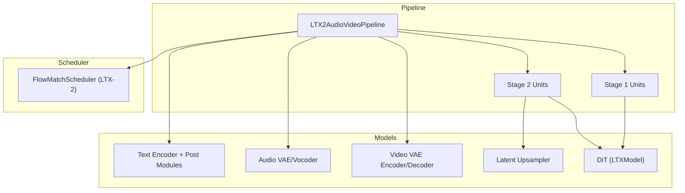
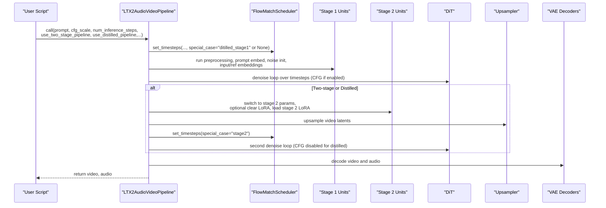
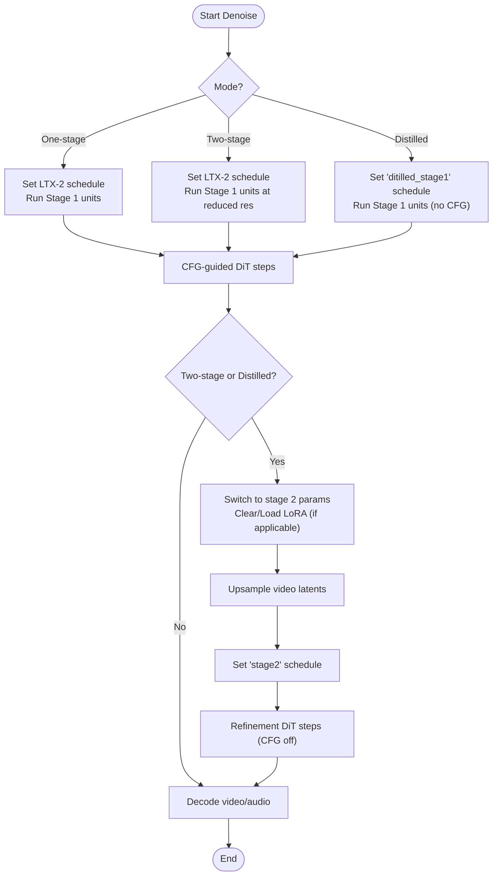
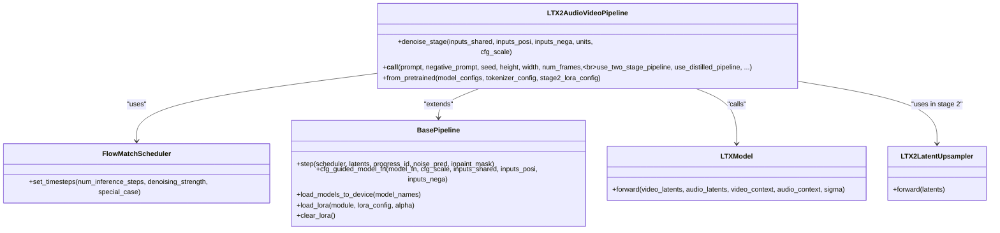

# Generation Modes and Workflows

<cite>
**Referenced Files in This Document**
- [ltx2_audio_video.py](file://diffsynth/pipelines/ltx2_audio_video.py)
- [flow_match.py](file://diffsynth/diffusion/flow_match.py)
- [base_pipeline.py](file://diffsynth/diffusion/base_pipeline.py)
- [LTX-2-T2AV-OneStage.py](file://examples/ltx2/model_inference/LTX-2-T2AV-OneStage.py)
- [LTX-2-T2AV-TwoStage.py](file://examples/ltx2/model_inference/LTX-2-T2AV-TwoStage.py)
- [LTX-2-T2AV-DistilledPipeline.py](file://examples/ltx2/model_inference/LTX-2-T2AV-DistilledPipeline.py)
- [ltx2_dit.py](file://diffsynth/models/ltx2_dit.py)
- [ltx2_upsampler.py](file://diffsynth/models/ltx2_upsampler.py)
</cite>

## Table of Contents
1. Introduction
2. Project Structure
3. Core Components
4. Architecture Overview
5. Detailed Component Analysis
6. Dependency Analysis
7. Performance Considerations
8. Troubleshooting Guide
9. Conclusion

## Introduction
This document explains the generation modes supported by the LTX2 pipeline for text-to-audio-video synthesis: one-stage, two-stage with latent upsampling, and distilled pipeline mode. It details parameter differences, performance trade-offs, recommended use cases, and workflow differences across denoising stages, scheduler configuration, and model loading strategies. The goal is to help you choose the right mode based on hardware constraints and quality requirements.

## Project Structure
The LTX2 audio-video pipeline is implemented as a modular pipeline that composes multiple units for preprocessing, conditioning, denoising, and decoding. Examples demonstrate how to configure each generation mode via simple script parameters.

**Diagram sources**
- [ltx2_audio_video.py](file://diffsynth/pipelines/ltx2_audio_video.py)
- [flow_match.py](file://diffsynth/diffusion/flow_match.py)
- [ltx2_dit.py](file://diffsynth/models/ltx2_dit.py)
- [ltx2_upsampler.py](file://diffsynth/models/ltx2_upsampler.py)

**Section sources**
- [ltx2_audio_video.py](file://diffsynth/pipelines/ltx2_audio_video.py)
- [base_pipeline.py](file://diffsynth/diffusion/base_pipeline.py)

## Core Components
- LTX2AudioVideoPipeline orchestrates inputs, runs stage-specific units, and controls denoising loops.
- FlowMatchScheduler provides LTX-2 specific timestep schedules, including special cases for stage 2 and distilled stage 1.
- BasePipeline supplies common utilities such as CFG guidance, step updates, VRAM management, and LoRA handling.
- DiT (LTXModel) performs joint video-audio denoising with optional reference/in-context conditioning.
- Latent Upsampler increases spatial resolution of video latents in stage 2.
- Text encoder and post modules produce separate video/audio contexts from prompts.

Key responsibilities:
- One-stage: single denoising pass at target resolution.
- Two-stage: lower-resolution first pass followed by latent upsampling and refined denoising at higher resolution.
- Distilled: fast inference using a distilled DiT and specialized schedule; uses two-stage flow but without LoRA.

**Section sources**
- [ltx2_audio_video.py](file://diffsynth/pipelines/ltx2_audio_video.py)
- [flow_match.py](file://diffsynth/diffusion/flow_match.py)
- [base_pipeline.py](file://diffsynth/diffusion/base_pipeline.py)
- [ltx2_dit.py](file://diffsynth/models/ltx2_dit.py)
- [ltx2_upsampler.py](file://diffsynth/models/ltx2_upsampler.py)

## Architecture Overview
The pipeline supports three generation modes controlled by flags and parameters:

- One-stage: set use_two_stage_pipeline=False (default), no upsampler needed.
- Two-stage: set use_two_stage_pipeline=True; requires stage2_lora_config and an upsampler model.
- Distilled: set use_distilled_pipeline=True; forces two-stage behavior, disables CFG (cfg_scale=1.0), and skips LoRA loading.

**Diagram sources**
- [ltx2_audio_video.py](file://diffsynth/pipelines/ltx2_audio_video.py)
- [flow_match.py](file://diffsynth/diffusion/flow_match.py)

## Detailed Component Analysis

### One-Stage Generation
- Purpose: Basic text-to-audio-video synthesis at the requested resolution in a single denoising pass.
- Parameters:
  - use_two_stage_pipeline=False (default)
  - use_distilled_pipeline=False (default)
  - cfg_scale typically > 1.0 (e.g., 3.0)
  - num_inference_steps as desired
  - height, width, num_frames must satisfy divisibility rules enforced by the pipeline
- Workflow:
  - Scheduler initialized with LTX-2 schedule.
  - Stage 1 units prepare prompts, noise, and any input/reference conditions.
  - Single denoising loop applies CFG-guided DiT steps.
  - Decode latents to video and audio.
- Model loading:
  - Requires DiT, text encoder/post modules, video/audio VAE decoders, and optionally encoders for input/reference processing.
  - No upsampler or stage 2 LoRA required.
- Use cases:
  - Fast prototyping, moderate quality needs, limited VRAM where full two-stage is not feasible.

Example usage path:
- [LTX-2-T2AV-OneStage.py](file://examples/ltx2/model_inference/LTX-2-T2AV-OneStage.py)

**Section sources**
- [ltx2_audio_video.py](file://diffsynth/pipelines/ltx2_audio_video.py)
- [LTX-2-T2AV-OneStage.py](file://examples/ltx2/model_inference/LTX-2-T2AV-OneStage.py)

### Two-Stage Generation with Latent Upsampling
- Purpose: Higher-quality output by generating coarse latents then refining at higher resolution.
- Parameters:
  - use_two_stage_pipeline=True
  - stage2_lora_config must be provided
  - stage2_spatial_upsample_factor controls stage 1 vs stage 2 resolution scaling
  - cfg_scale can be used in stage 1; stage 2 typically uses CFG=1.0
  - num_inference_steps may differ between stages
- Workflow:
  - Stage 1 runs at reduced resolution (height//factor, width//factor).
  - Switch to stage 2: update dimensions, clear or swap LoRA, optionally apply upsampler to video latents.
  - Reinitialize scheduler for stage 2 with special case.
  - Second denoising pass refines high-resolution latents.
  - Decode final video and audio.
- Model loading:
  - Requires upsampler model and stage 2 LoRA weights.
  - Video VAE encoder is used for input/reference embedding and normalization before upsampling.
- Use cases:
  - High-resolution outputs when VRAM allows loading both base DiT and stage 2 components.

Example usage path:
- [LTX-2-T2AV-TwoStage.py](file://examples/ltx2/model_inference/LTX-2-T2AV-TwoStage.py)

**Section sources**
- [ltx2_audio_video.py](file://diffsynth/pipelines/ltx2_audio_video.py)
- [LTX-2-T2AV-TwoStage.py](file://examples/ltx2/model_inference/LTX-2-T2AV-TwoStage.py)

### Distilled Pipeline Mode
- Purpose: Faster inference using a distilled DiT and a specialized schedule while maintaining two-stage refinement.
- Parameters:
  - use_distilled_pipeline=True
  - Forces use_two_stage_pipeline=True and sets cfg_scale=1.0 (no CFG)
  - Does not load stage 2 LoRA; clears LoRA before stage 2 if configured
  - Requires distilled DiT checkpoint (transformer_distilled.safetensors)
- Workflow:
  - Scheduler uses special_case="ditilled_stage1" for stage 1 timesteps.
  - Stage 1 runs with fewer steps and no CFG.
  - Stage 2 uses special_case="stage2" schedule; upsampler applied; no LoRA.
  - Decode final outputs.
- Model loading:
  - Uses distilled DiT instead of standard DiT.
  - Still requires text encoder/post modules, VAE decoders, and upsampler.
- Use cases:
  - Real-time or latency-sensitive applications where speed is prioritized over maximum fidelity.

Example usage path:
- [LTX-2-T2AV-DistilledPipeline.py](file://examples/ltx2/model_inference/LTX-2-T2AV-DistilledPipeline.py)

**Section sources**
- [ltx2_audio_video.py](file://diffsynth/pipelines/ltx2_audio_video.py)
- [LTX-2-T2AV-DistilledPipeline.py](file://examples/ltx2/model_inference/LTX-2-T2AV-DistilledPipeline.py)

### Denoising Stages and Scheduler Configuration
- Scheduler template: LTX-2 with special cases:
  - Normal: dynamic shift based on sequence length.
  - stage2: fixed short schedule for refinement.
  - ditilled_stage1: very short schedule optimized for distilled models.
- CFG behavior:
  - Enabled in one-stage and stage 1 of two-stage (cfg_scale > 1.0).
  - Disabled in distilled mode (cfg_scale=1.0) and typically in stage 2.
- Step updates:
  - BasePipeline.step blends inpaint masks when present and advances latents per scheduler.

**Diagram sources**
- [flow_match.py](file://diffsynth/diffusion/flow_match.py)
- [ltx2_audio_video.py](file://diffsynth/pipelines/ltx2_audio_video.py)
- [base_pipeline.py](file://diffsynth/diffusion/base_pipeline.py)

**Section sources**
- [flow_match.py](file://diffsynth/diffusion/flow_match.py)
- [ltx2_audio_video.py](file://diffsynth/pipelines/ltx2_audio_video.py)
- [base_pipeline.py](file://diffsynth/diffusion/base_pipeline.py)

### Model Loading Strategies
- One-stage:
  - Load DiT, text encoder/post modules, video/audio VAE decoders.
  - Optional encoders for input/reference processing.
- Two-stage:
  - Additionally load upsampler and stage 2 LoRA.
  - Clear LoRA before stage 2 if configured; otherwise hotload stage 2 LoRA.
- Distilled:
  - Load distilled DiT instead of standard DiT.
  - Skip LoRA loading; ensure upsampler is available.

VRAM management:
- BasePipeline supports offloading/onloading modules dynamically during execution.
- PipelineUnitRunner manages unit dependencies and model lifecycles.

**Section sources**
- [ltx2_audio_video.py](file://diffsynth/pipelines/ltx2_audio_video.py)
- [base_pipeline.py](file://diffsynth/diffusion/base_pipeline.py)

## Dependency Analysis

**Diagram sources**
- [ltx2_audio_video.py](file://diffsynth/pipelines/ltx2_audio_video.py)
- [flow_match.py](file://diffsynth/diffusion/flow_match.py)
- [base_pipeline.py](file://diffsynth/diffusion/base_pipeline.py)
- [ltx2_dit.py](file://diffsynth/models/ltx2_dit.py)
- [ltx2_upsampler.py](file://diffsynth/models/ltx2_upsampler.py)

**Section sources**
- [ltx2_audio_video.py](file://diffsynth/pipelines/ltx2_audio_video.py)
- [base_pipeline.py](file://diffsynth/diffusion/base_pipeline.py)

## Performance Considerations
- One-stage:
  - Fewer model calls; lower VRAM than two-stage.
  - Quality depends on cfg_scale and number of steps.
- Two-stage:
  - Higher quality due to refinement; increased VRAM and compute.
  - Requires upsampler and stage 2 LoRA; careful memory management recommended.
- Distilled:
  - Fastest inference; fewer steps and no CFG.
  - Suitable for real-time or constrained environments; slight quality trade-off compared to two-stage.

Recommendations:
- Choose one-stage for quick iterations or low VRAM setups.
- Choose two-stage for production-quality outputs when VRAM permits.
- Choose distilled for latency-sensitive applications or batch processing where speed matters most.

[No sources needed since this section provides general guidance]

## Troubleshooting Guide
Common issues and resolutions:
- Two-stage without upsampler or LoRA:
  - Error raised if upsampler is missing or stage2_lora_config is not set.
  - Ensure both are provided when enabling two-stage.
- Distilled mode CFG:
  - CFG is automatically disabled; do not set cfg_scale > 1.0.
- Shape constraints:
  - Height/width must be divisible by 32 for one-stage and 64 for two-stage after scaling; pipeline auto-resizes with warnings.
- VRAM pressure:
  - Enable VRAM management; rely on dynamic offload/onload in BasePipeline.

**Section sources**
- [ltx2_audio_video.py](file://diffsynth/pipelines/ltx2_audio_video.py)
- [base_pipeline.py](file://diffsynth/diffusion/base_pipeline.py)

## Conclusion
The LTX2 pipeline offers flexible generation modes tailored to different quality and performance needs. One-stage provides simplicity and efficiency, two-stage delivers higher fidelity through latent upsampling and refinement, and distilled mode accelerates inference for time-critical tasks. Selecting the appropriate mode hinges on your hardware capabilities, desired output quality, and latency constraints. Proper scheduler configuration and model loading strategies are essential to achieving optimal results across all modes.

[No sources needed since this section summarizes without analyzing specific files]