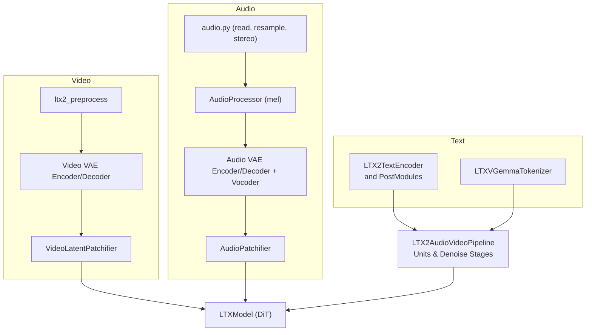
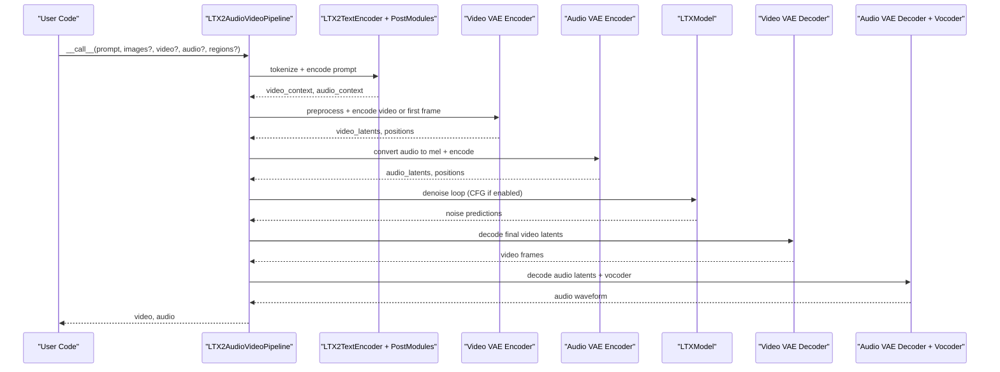
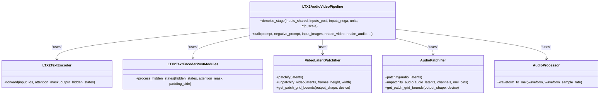

# Input Processing and Embedding

<cite>
**Referenced Files in This Document**
- [ltx2_text_encoder.py](file://diffsynth/models/ltx2_text_encoder.py)
- [ltx2_audio_video.py](file://diffsynth/pipelines/ltx2_audio_video.py)
- [audio.py](file://diffsynth/utils/data/audio.py)
- [media_io_ltx2.py](file://diffsynth/utils/data/media_io_ltx2.py)
- [ltx2_video_vae.py](file://diffsynth/models/ltx2_video_vae.py)
- [ltx2_audio_vae.py](file://diffsynth/models/ltx2_audio_vae.py)
- [LTX-2.3-T2AV-OneStage.py](file://examples/ltx2/model_inference/LTX-2.3-T2AV-OneStage.py)
- [LTX-2.3-I2AV-OneStage.py](file://examples/ltx2/model_inference/LTX-2.3-I2AV-OneStage.py)
- [LTX-2.3-A2V-TwoStage.py](file://examples/ltx2/model_inference/LTX-2.3-A2V-TwoStage.py)
- [LTX-2.3-T2AV-TwoStage-Retake.py](file://examples/ltx2/model_inference/LTX-2.3-T2AV-TwoStage-Retake.py)
</cite>

## Table of Contents
1. [Introduction](#introduction)
2. [Project Structure](#project-structure)
3. [Core Components](#core-components)
4. [Architecture Overview](#architecture-overview)
5. [Detailed Component Analysis](#detailed-component-analysis)
6. [Dependency Analysis](#dependency-analysis)
7. [Performance Considerations](#performance-considerations)
8. [Troubleshooting Guide](#troubleshooting-guide)
9. [Conclusion](#conclusion)
10. [Appendices](#appendices)

## Introduction
This document explains how the LTX-2 pipeline processes multiple input modalities: text prompts, images, video, and audio. It covers prompt embedding via LTX2TextEncoder, image conditioning through first-frame and reference frame handling, video retaking with region-based control, and audio conditioning for audio-to-video generation. You will find preprocessing steps, format requirements, parameter tuning options, and practical examples showing how to combine different inputs effectively.

## Project Structure
The input processing is implemented across a few key modules:
- Text encoding and post-processing: LTX2TextEncoder and related modules
- Pipeline orchestration and units for each modality
- Audio utilities for reading, resampling, and stereo conversion
- Media I/O helpers for image/video preprocessing
- Video and audio VAEs for latent encoding/decoding and patchification

**Diagram sources**
- [ltx2_text_encoder.py:11-87](file://diffsynth/models/ltx2_text_encoder.py#L11-L87)
- [ltx2_audio_video.py:28-148](file://diffsynth/pipelines/ltx2_audio_video.py#L28-L148)
- [media_io_ltx2.py:34-44](file://diffsynth/utils/data/media_io_ltx2.py#L34-L44)
- [ltx2_video_vae.py:18-159](file://diffsynth/models/ltx2_video_vae.py#L18-L159)
- [ltx2_audio_vae.py:12-65](file://diffsynth/models/ltx2_audio_vae.py#L12-L65)
- [audio.py:31-87](file://diffsynth/utils/data/audio.py#L31-L87)

**Section sources**
- [ltx2_audio_video.py:28-148](file://diffsynth/pipelines/ltx2_audio_video.py#L28-L148)
- [ltx2_text_encoder.py:11-87](file://diffsynth/models/ltx2_text_encoder.py#L11-L87)
- [ltx2_video_vae.py:18-159](file://diffsynth/models/ltx2_video_vae.py#L18-L159)
- [ltx2_audio_vae.py:12-65](file://diffsynth/models/ltx2_audio_vae.py#L12-L65)
- [audio.py:31-87](file://diffsynth/utils/data/audio.py#L31-L87)
- [media_io_ltx2.py:34-44](file://diffsynth/utils/data/media_io_ltx2.py#L34-L44)

## Core Components
- LTX2TextEncoder and LTX2TextEncoderPostModules: Convert text into separate video and audio contexts used by the DiT model.
- LTX2AudioVideoPipeline: Orchestrates all units for prompt embedding, noise initialization, input embeddings (video/audio/images), retake logic, and denoising stages.
- Video VAE and Patchifier: Encode/decode video frames to latents and compute spatio-temporal coordinates.
- Audio Processor and VAE: Convert waveforms to log-mel spectrograms, encode to audio latents, and decode back to waveform via vocoder.
- Utilities: Image/video preprocessing and audio I/O/resampling.

Key responsibilities:
- Prompt embedding: Tokenization → hidden states → per-modality projections → connectors → binary masks.
- Image conditioning: First-frame replacement and reference frame appending with position-aware timestamps.
- Video retaking: Region-based masking over time to selectively regenerate segments.
- Audio conditioning: Waveform → mel → audio latents; optional region-based masking for partial regeneration.

**Section sources**
- [ltx2_text_encoder.py:406-463](file://diffsynth/models/ltx2_text_encoder.py#L406-L463)
- [ltx2_audio_video.py:298-327](file://diffsynth/pipelines/ltx2_audio_video.py#L298-L327)
- [ltx2_audio_video.py:473-540](file://diffsynth/pipelines/ltx2_audio_video.py#L473-L540)
- [ltx2_audio_video.py:402-427](file://diffsynth/pipelines/ltx2_audio_video.py#L402-L427)
- [ltx2_audio_video.py:430-470](file://diffsynth/pipelines/ltx2_audio_video.py#L430-L470)
- [ltx2_video_vae.py:18-159](file://diffsynth/models/ltx2_video_vae.py#L18-L159)
- [ltx2_audio_vae.py:12-65](file://diffsynth/models/ltx2_audio_vae.py#L12-L65)

## Architecture Overview
The pipeline composes modular units that transform raw inputs into model-ready tensors and then iteratively denoise them.

**Diagram sources**
- [ltx2_audio_video.py:168-249](file://diffsynth/pipelines/ltx2_audio_video.py#L168-L249)
- [ltx2_audio_video.py:298-327](file://diffsynth/pipelines/ltx2_audio_video.py#L298-L327)
- [ltx2_audio_video.py:473-540](file://diffsynth/pipelines/ltx2_audio_video.py#L473-L540)
- [ltx2_audio_video.py:430-470](file://diffsynth/pipelines/ltx2_audio_video.py#L430-L470)
- [ltx2_audio_video.py:648-731](file://diffsynth/pipelines/ltx2_audio_video.py#L648-L731)

## Detailed Component Analysis

### Text Prompts and Embedding
- Tokenization uses a Gemma-compatible tokenizer configured for left padding and max length.
- The text encoder returns hidden states across layers; post-modules normalize and project these into separate video and audio contexts.
- Connectors apply 1D transformer blocks with rotary positional encodings and optional learnable registers to handle padded tokens.
- Binary masks are derived from attention masks to zero out padded positions in the final embeddings.

Key parameters and behavior:
- max_length: maximum token sequence length for tokenizer.
- padding_side: left padding for chat-style prompts.
- separated_audio_video: whether to use separate projection heads for video vs. audio contexts.
- num_layers_gemma, embedding_dim_gemma: shape of multi-layer hidden state aggregation.
- Connector configuration: attention_head_dim, num_attention_heads, num_layers, rope_type, double_precision_rope.

Practical usage:
- Provide a natural language prompt; negative_prompt is supported and used for CFG guidance.
- Ensure prompt length fits within max_length; longer prompts may be truncated.

**Section sources**
- [ltx2_text_encoder.py:90-151](file://diffsynth/models/ltx2_text_encoder.py#L90-L151)
- [ltx2_text_encoder.py:406-463](file://diffsynth/models/ltx2_text_encoder.py#L406-L463)
- [ltx2_text_encoder.py:277-403](file://diffsynth/models/ltx2_text_encoder.py#L277-L403)
- [ltx2_audio_video.py:298-327](file://diffsynth/pipelines/ltx2_audio_video.py#L298-L327)

### Image Inputs: First Frame and Reference Frames
- Images are resized to target resolution and normalized before encoding.
- If an image index equals 0, its latent replaces the corresponding video segment (first-frame conditioning).
- For other indices, image latents are appended as reference frames with computed temporal positions aligned to frame_rate.
- Strength controls how strongly the first frame influences the output; denoise mask blends original noise with provided latents.

Format and preprocessing:
- PIL.Image objects are expected; they are resized to (width, height).
- Normalization follows standard pixel scaling before VAE encoding.

Parameters:
- input_images: list of PIL images.
- input_images_indexes: unique frame indices where images should be applied.
- input_images_strength: blending strength for first-frame replacement.

Example usage:
- Provide a single image at index 0 to set the first frame exactly.
- Provide additional images at later indices to guide specific frames.

**Section sources**
- [ltx2_audio_video.py:473-540](file://diffsynth/pipelines/ltx2_audio_video.py#L473-L540)
- [media_io_ltx2.py:34-44](file://diffsynth/utils/data/media_io_ltx2.py#L34-L44)
- [ltx2_audio_video.py:648-700](file://diffsynth/pipelines/ltx2_audio_video.py#L648-L700)

### Video Inputs and Retaking with Region-Based Control
- Optional input videos can be encoded directly to latents to initialize the diffusion process (video-to-video).
- Retake functionality allows selective regeneration of specific time regions while preserving others.
- Regions are specified as start/end times in seconds; masks are constructed using patch grid bounds and unpatchify operations.

Processing steps:
- Resize retake video frames to target resolution.
- Encode to video latents.
- Build denoise_mask_video based on retake_video_regions; masked regions are regenerated, others are preserved.

Parameters:
- retake_video: list of PIL frames representing the source video.
- retake_video_regions: list of (start_time, end_time) tuples in seconds.
- tiled, tile_size_in_pixels, tile_overlap_in_pixels: tiling options for memory efficiency.

Example usage:
- Provide a short clip and specify time intervals to retake; non-specified intervals remain unchanged.

**Section sources**
- [ltx2_audio_video.py:402-427](file://diffsynth/pipelines/ltx2_audio_video.py#L402-L427)
- [ltx2_video_vae.py:18-159](file://diffsynth/models/ltx2_video_vae.py#L18-L159)

### Audio Inputs and Conditioning for Audio-to-Video
- Audio waveforms are converted to log-mel spectrograms using a configurable processor.
- Mel features are encoded into audio latents; decoding uses an audio VAE decoder followed by a vocoder to produce waveform output.
- Audio retaking supports region-based control similar to video, enabling partial regeneration of audio segments.

Processing steps:
- Read audio file and optionally resample to target sample rate.
- Convert to stereo if needed.
- Transform waveform to mel spectrogram.
- Encode to audio latents; generate positions for time alignment.
- Apply denoise_mask_audio for retake regions.

Parameters:
- retake_audio: tuple (waveform, sample_rate).
- audio_sample_rate: sample rate of the provided waveform.
- retake_audio_regions: list of (start_time, end_time) tuples in seconds.

Example usage:
- Provide an audio clip and desired duration; the pipeline generates synchronized video conditioned on this audio.

**Section sources**
- [ltx2_audio_vae.py:12-65](file://diffsynth/models/ltx2_audio_vae.py#L12-L65)
- [ltx2_audio_video.py:430-470](file://diffsynth/pipelines/ltx2_audio_video.py#L430-L470)
- [audio.py:31-87](file://diffsynth/utils/data/audio.py#L31-L87)

### In-Context Video Control
- Additional context videos can be provided to influence generation beyond the first frame.
- Context videos are resized and padded to match target dimensions and frame count.
- Latents and positions are concatenated with main video latents during denoising.

Parameters:
- in_context_videos: list of lists of PIL frames.
- in_context_downsample_factor: spatial downsampling factor for context.

Usage:
- Supply one or more context sequences to guide motion and style.

**Section sources**
- [ltx2_audio_video.py:543-588](file://diffsynth/pipelines/ltx2_audio_video.py#L543-L588)

### Two-Stage Pipeline and Upsampling
- Stage 1 runs at lower resolution; stage 2 upsamples latents and refines details.
- Switching stages adjusts height/width, clears certain conditions, and optionally loads a LoRA for refinement.
- Scheduler timesteps are reconfigured for stage 2.

Parameters:
- use_two_stage_pipeline: enable two-stage mode.
- stage2_spatial_upsample_factor: upscaling factor for stage 2.
- clear_lora_before_state_two: toggle to clear LoRA weights between stages.

**Section sources**
- [ltx2_audio_video.py:591-645](file://diffsynth/pipelines/ltx2_audio_video.py#L591-L645)

## Dependency Analysis
The pipeline orchestrates several components with clear separation of concerns:
- Text encoding depends on the Gemma tokenizer and post-modules.
- Video and audio encoders depend on their respective VAEs and patchifiers.
- The DiT model consumes concatenated latents and contexts along with timestep information.
- Utilities provide robust media I/O and audio processing.

**Diagram sources**
- [ltx2_audio_video.py:28-148](file://diffsynth/pipelines/ltx2_audio_video.py#L28-L148)
- [ltx2_text_encoder.py:11-87](file://diffsynth/models/ltx2_text_encoder.py#L11-L87)
- [ltx2_text_encoder.py:406-463](file://diffsynth/models/ltx2_text_encoder.py#L406-L463)
- [ltx2_video_vae.py:18-159](file://diffsynth/models/ltx2_video_vae.py#L18-L159)
- [ltx2_audio_vae.py:12-65](file://diffsynth/models/ltx2_audio_vae.py#L12-L65)

**Section sources**
- [ltx2_audio_video.py:28-148](file://diffsynth/pipelines/ltx2_audio_video.py#L28-L148)
- [ltx2_text_encoder.py:11-87](file://diffsynth/models/ltx2_text_encoder.py#L11-L87)
- [ltx2_video_vae.py:18-159](file://diffsynth/models/ltx2_video_vae.py#L18-L159)
- [ltx2_audio_vae.py:12-65](file://diffsynth/models/ltx2_audio_vae.py#L12-L65)

## Performance Considerations
- Tiled decoding: Enable tiled=True and adjust tile sizes/overlaps to reduce VRAM usage during video decoding.
- Two-stage pipeline: Lower initial resolution reduces computation; stage 2 upsampler refines details efficiently.
- Gradient checkpointing: Optional flags in model_fn allow reduced memory footprint during training or heavy inference.
- Audio sample rate: Resampling to the processor’s expected rate avoids unnecessary conversions.

[No sources needed since this section provides general guidance]

## Troubleshooting Guide
Common issues and resolutions:
- Shape mismatches: Ensure height/width are divisible by required factors (32 for one-stage, 64 for two-stage). Use the pipeline’s shape checker unit to auto-adjust.
- Unique indexes: input_images_indexes must be unique; duplicates raise errors.
- Missing models: Two-stage pipeline requires stage2_lora_config and upsampler; ensure they are loaded.
- Audio backend: Only torchcodec backend is supported for read/save; verify environment setup.

**Section sources**
- [ltx2_audio_video.py:275-295](file://diffsynth/pipelines/ltx2_audio_video.py#L275-L295)
- [ltx2_audio_video.py:252-273](file://diffsynth/pipelines/ltx2_audio_video.py#L252-L273)
- [audio.py:55-87](file://diffsynth/utils/data/audio.py#L55-L87)

## Conclusion
The LTX-2 pipeline offers a comprehensive, modular approach to multimodal input processing. Text prompts are embedded into separate video and audio contexts, images condition first frames and reference points, video retaking supports precise temporal control, and audio conditioning enables synchronized audio-to-video generation. By leveraging tiled decoding, two-stage refinement, and robust utilities, users can achieve high-quality results while managing memory efficiently.

[No sources needed since this section summarizes without analyzing specific files]

## Appendices

### Practical Examples

- Text-to-audio-video (one-stage):
  - Provide a prompt and negative prompt; generate video and audio without additional inputs.
  - See example script path for full usage.

- Image-to-audio-video (first frame):
  - Provide a PIL image at index 0 to set the first frame; strength controls blending.
  - See example script path for full usage.

- Audio-to-video:
  - Provide an audio waveform and sample rate; generate video synchronized with audio.
  - See example script path for full usage.

- Video retaking with regions:
  - Provide a source video and specify time intervals to regenerate; non-specified intervals remain unchanged.
  - See example script path for full usage.

**Section sources**
- [LTX-2.3-T2AV-OneStage.py:16-57](file://examples/ltx2/model_inference/LTX-2.3-T2AV-OneStage.py#L16-L57)
- [LTX-2.3-I2AV-OneStage.py:17-55](file://examples/ltx2/model_inference/LTX-2.3-I2AV-OneStage.py#L17-L55)
- [LTX-2.3-A2V-TwoStage.py:17-66](file://examples/ltx2/model_inference/LTX-2.3-A2V-TwoStage.py#L17-L66)
- [LTX-2.3-T2AV-TwoStage-Retake.py:18-77](file://examples/ltx2/model_inference/LTX-2.3-T2AV-TwoStage-Retake.py#L18-L77)