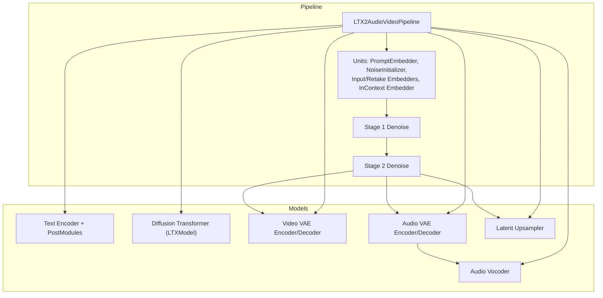
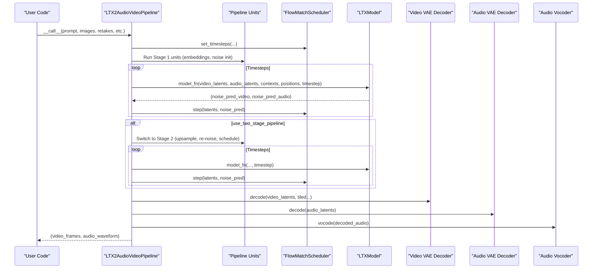
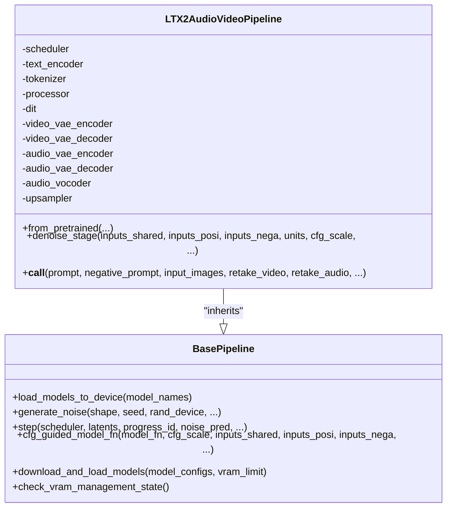
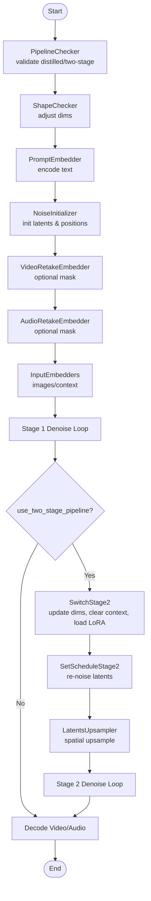
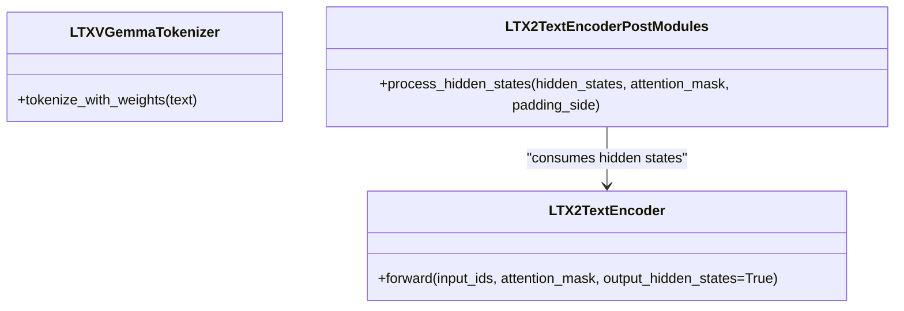
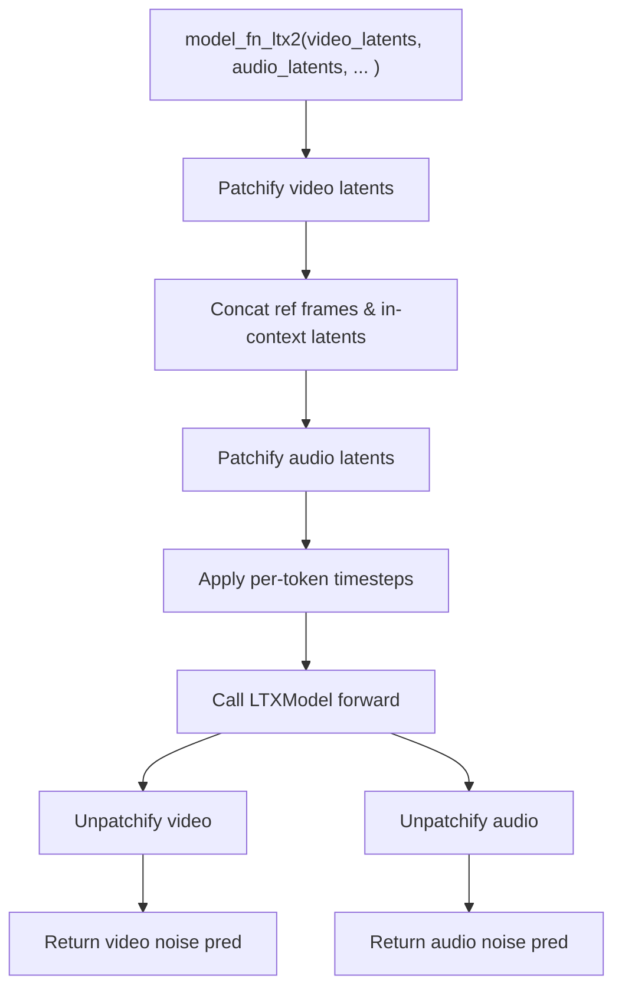
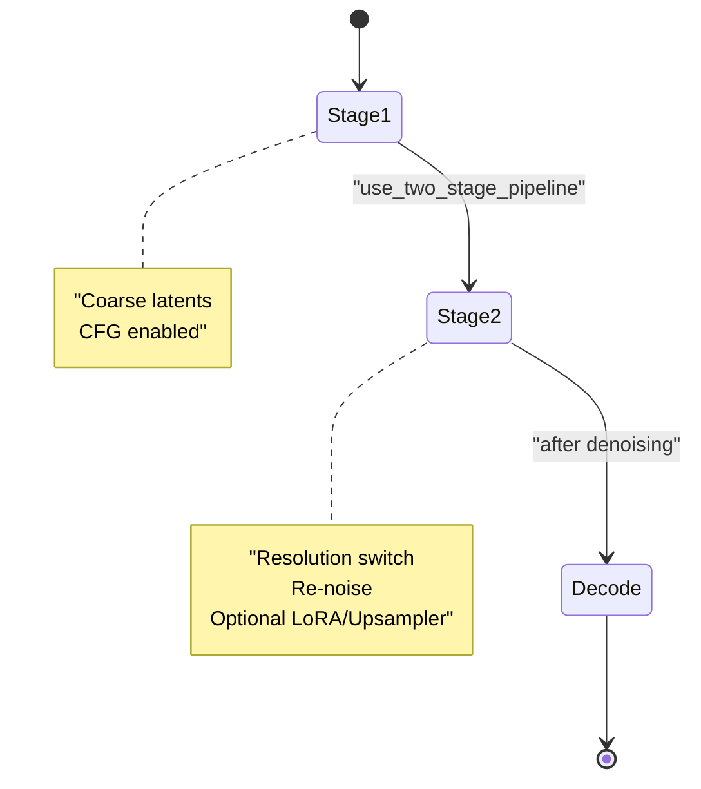
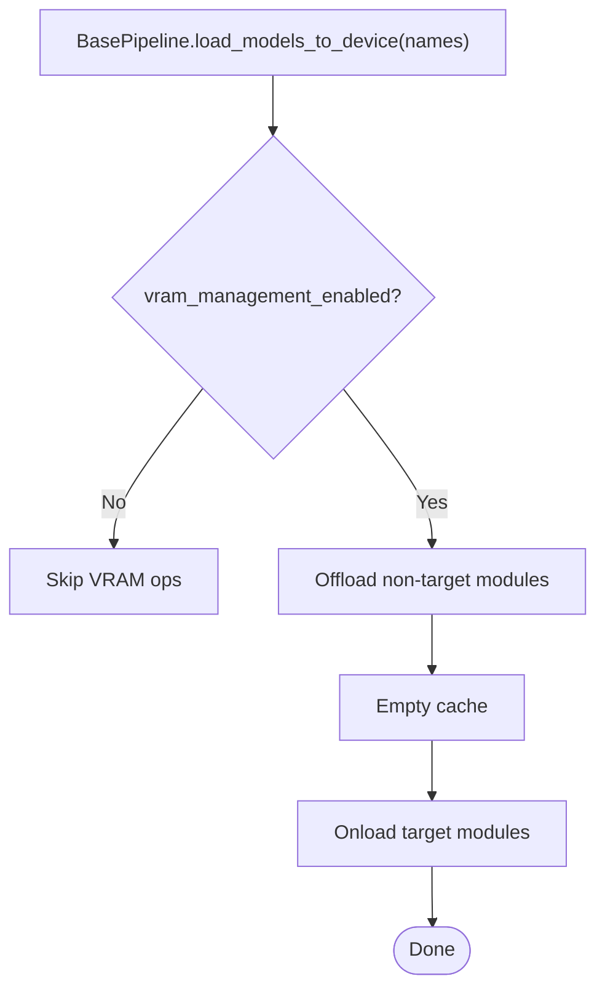
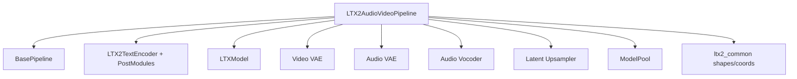

# Pipeline Overview and Architecture

<cite>
**Referenced Files in This Document**
- [ltx2_audio_video.py](file://diffsynth/pipelines/ltx2_audio_video.py)
- [base_pipeline.py](file://diffsynth/diffusion/base_pipeline.py)
- [ltx2_common.py](file://diffsynth/models/ltx2_common.py)
- [ltx2_text_encoder.py](file://diffsynth/models/ltx2_text_encoder.py)
- [ltx2_dit.py](file://diffsynth/models/ltx2_dit.py)
- [ltx2_audio_vae.py](file://diffsynth/models/ltx2_audio_vae.py)
- [ltx2_video_vae.py](file://diffsynth/models/ltx2_video_vae.py)
- [model_loader.py](file://diffsynth/models/model_loader.py)
- [LTX-2-T2AV-DistilledPipeline.py](file://examples/ltx2/model_inference/LTX-2-T2AV-DistilledPipeline.py)
- [LTX-2-T2AV-TwoStage.py](file://examples/ltx2/model_inference/LTX-2-T2AV-TwoStage.py)
</cite>

## Table of Contents
1. [Introduction](#introduction)
2. [Project Structure](#project-structure)
3. [Core Components](#core-components)
4. [Architecture Overview](#architecture-overview)
5. [Detailed Component Analysis](#detailed-component-analysis)
6. [Dependency Analysis](#dependency-analysis)
7. [Performance Considerations](#performance-considerations)
8. [Troubleshooting Guide](#troubleshooting-guide)
9. [Conclusion](#conclusion)
10. [Appendices](#appendices)

## Introduction
This document provides a comprehensive overview of the LTX2 audio-video pipeline, focusing on the LTX2AudioVideoPipeline class as the unified interface for text-to-audio-video generation. It explains how the pipeline orchestrates multiple processing units (text encoders, VAEs, diffusion transformer, and upscaler), describes the two-stage generation approach, distilled pipeline optimization, and VRAM management integration. The content is structured to be accessible to beginners while offering technical depth for experienced developers.

## Project Structure
The LTX2 audio-video pipeline is implemented under the pipelines module and integrates with model components from the models module. Key files include:
- Pipeline orchestration and units: ltx2_audio_video.py
- Base pipeline utilities and unit runner: base_pipeline.py
- Shared data structures and helpers: ltx2_common.py
- Text encoder and post-processing: ltx2_text_encoder.py
- Diffusion transformer: ltx2_dit.py
- Audio VAE and vocoder: ltx2_audio_vae.py
- Video VAE: ltx2_video_vae.py
- Model loading and VRAM-aware wrappers: model_loader.py
- Example scripts demonstrating usage: examples/ltx2/model_inference/*.py



**Diagram sources**
- [ltx2_audio_video.py:28-148](file://diffsynth/pipelines/ltx2_audio_video.py#L28-L148)
- [base_pipeline.py:61-188](file://diffsynth/diffusion/base_pipeline.py#L61-L188)
- [model_loader.py:7-114](file://diffsynth/models/model_loader.py#L7-L114)

**Section sources**
- [ltx2_audio_video.py:28-148](file://diffsynth/pipelines/ltx2_audio_video.py#L28-L148)
- [base_pipeline.py:61-188](file://diffsynth/diffusion/base_pipeline.py#L61-L188)
- [model_loader.py:7-114](file://diffsynth/models/model_loader.py#L7-L114)

## Core Components
- LTX2AudioVideoPipeline: Unified entry point that initializes scheduler, text encoder/tokenizer/processor, diffusion transformer, video/audio VAEs, audio vocoder, and latent upsampler. It defines stage-specific unit lists and runs denoising stages.
- BasePipeline: Provides shared utilities including device handling, shape checks, preprocessing, noise generation, step scheduling, CFG guidance, LoRA loading/clearing, model download/loading via ModelPool, and VRAM-aware model lifecycle control.
- PipelineUnit and Unit Runner: Modular processing steps that transform inputs, manage model lifecycles, and support separate CFG branches when needed.
- Data Structures: VideoPixelShape, VideoLatentShape, AudioLatentShape, SpatioTemporalScaleFactors, Patchifier protocol, and coordinate mapping utilities ensure consistent shapes and positional metadata across modalities.

Key responsibilities:
- Initialization and model loading: from_pretrained orchestrates downloading and fetching models into named slots.
- Two-stage generation: Stage 1 produces coarse latents; Stage 2 optionally applies upsampling and refined denoising.
- Distilled pipeline: Forces two-stage behavior and disables CFG by setting cfg_scale=1.0.
- VRAM management: Offload/onload modules per computation phase to minimize peak memory.

**Section sources**
- [ltx2_audio_video.py:28-148](file://diffsynth/pipelines/ltx2_audio_video.py#L28-L148)
- [base_pipeline.py:61-188](file://diffsynth/diffusion/base_pipeline.py#L61-L188)
- [ltx2_common.py:8-158](file://diffsynth/models/ltx2_common.py#L8-L158)

## Architecture Overview
The pipeline composes modular units to prepare conditioning, initialize noise, embed inputs (images, videos, audio), and run iterative denoising through the diffusion transformer. Conditioning includes text prompts, reference frames, in-context videos, and retake regions. After denoising, video and audio are decoded and vocoded respectively.



**Diagram sources**
- [ltx2_audio_video.py:149-249](file://diffsynth/pipelines/ltx2_audio_video.py#L149-L249)
- [base_pipeline.py:321-341](file://diffsynth/diffusion/base_pipeline.py#L321-L341)

**Section sources**
- [ltx2_audio_video.py:149-249](file://diffsynth/pipelines/ltx2_audio_video.py#L149-L249)
- [base_pipeline.py:321-341](file://diffsynth/diffusion/base_pipeline.py#L321-L341)

## Detailed Component Analysis

### LTX2AudioVideoPipeline Class
- Initialization sets division factors for height/width/time, configures FlowMatchScheduler, and registers all component attributes (text encoder, tokenizer, processor, DIT, VAEs, vocoder, upsampler).
- from_pretrained downloads and loads models via ModelPool, assigns them to named attributes, and enables VRAM management if supported.
- denoise_stage executes a list of units then iteratively calls the CFG-guided model function and updates latents using the scheduler step.
- __call__ constructs inputs_posi/nega/shared, runs Stage 1 units, optionally runs Stage 2 units, decodes outputs, and returns video frames and audio waveform.



**Diagram sources**
- [ltx2_audio_video.py:28-148](file://diffsynth/pipelines/ltx2_audio_video.py#L28-L148)
- [base_pipeline.py:61-188](file://diffsynth/diffusion/base_pipeline.py#L61-L188)

**Section sources**
- [ltx2_audio_video.py:28-148](file://diffsynth/pipelines/ltx2_audio_video.py#L28-L148)
- [base_pipeline.py:61-188](file://diffsynth/diffusion/base_pipeline.py#L61-L188)

### Pipeline Units
- LTX2AudioVideoUnit_PipelineChecker: Enforces distilled/two-stage constraints and adjusts cfg_scale accordingly.
- LTX2AudioVideoUnit_ShapeChecker: Ensures dimensions divisible by required factors; computes stage_2 dimensions when applicable.
- LTX2AudioVideoUnit_PromptEmbedder: Tokenizes and encodes prompts via text encoder and post-modules to produce video/audio contexts.
- LTX2AudioVideoUnit_NoiseInitializer: Generates initial noise and positional coordinates for both modalities based on shapes and frame rate.
- LTX2AudioVideoUnit_InputVideoEmbedder / InputImagesEmbedder / InContextVideoEmbedder: Encode reference or contextual inputs into latents and compute masks/positions.
- LTX2AudioVideoUnit_VideoRetakeEmbedder / AudioRetakeEmbedder: Handle partial retaking with region-based masks and regenerate noise where needed.
- Stage 2 units: SwitchStage2 (resolution change, clear context, apply LoRA), SetScheduleStage2 (re-noise at new schedule), LatentsUpsampler (spatial upsample).



**Diagram sources**
- [ltx2_audio_video.py:252-646](file://diffsynth/pipelines/ltx2_audio_video.py#L252-L646)

**Section sources**
- [ltx2_audio_video.py:252-646](file://diffsynth/pipelines/ltx2_audio_video.py#L252-L646)

### Text Encoder and Post-Processing
- LTX2TextEncoder wraps Gemma3ForConditionalGeneration with specific configuration for sliding/full attention layers and multimodal token indices.
- LTXVGemmaTokenizer handles tokenization and attention weights for prompt encoding.
- LTX2TextEncoderPostModules aggregates hidden states across layers and projects to modality-specific embeddings (video/audio) using connector blocks.



**Diagram sources**
- [ltx2_text_encoder.py:11-151](file://diffsynth/models/ltx2_text_encoder.py#L11-L151)
- [ltx2_text_encoder.py:406-464](file://diffsynth/models/ltx2_text_encoder.py#L406-L464)

**Section sources**
- [ltx2_text_encoder.py:11-151](file://diffsynth/models/ltx2_text_encoder.py#L11-L151)
- [ltx2_text_encoder.py:406-464](file://diffsynth/models/ltx2_text_encoder.py#L406-L464)

### Diffusion Transformer (LTXModel)
- The model function model_fn_ltx2 patches video and audio latents, merges reference/in-context conditions, applies patchified timesteps, and invokes the diffusion transformer. Outputs are unpatchified back to dense latents.
- LTXModel implements multi-modal transformer blocks with RoPE, AdaLN, and cross-modality attention mechanisms.



**Diagram sources**
- [ltx2_audio_video.py:648-732](file://diffsynth/pipelines/ltx2_audio_video.py#L648-L732)
- [ltx2_dit.py:465-554](file://diffsynth/models/ltx2_dit.py#L465-L554)

**Section sources**
- [ltx2_audio_video.py:648-732](file://diffsynth/pipelines/ltx2_audio_video.py#L648-L732)
- [ltx2_dit.py:465-554](file://diffsynth/models/ltx2_dit.py#L465-L554)

### VAEs and Audio Processing
- Video VAE: Encodes/decodes video latents with spatial/temporal scale factors and supports tiled decoding for memory efficiency.
- Audio VAE: Converts waveforms to log-mel spectrograms, encodes/decodes mel latents, and uses a vocoder to synthesize waveform.
- Patchifiers: VideoLatentPatchifier and AudioPatchifier handle patch/unpatch operations and compute coordinate bounds for positional embeddings.

```mermaid
classDiagram
class VideoLatentPatchifier {
+patchify(latents)
+unpatchify(latents, output_shape)
+get_patch_grid_bounds(output_shape, device)
}
class AudioPatchifier {
+patchify(audio_latents)
+unpatchify(audio_latents, output_shape)
+get_patch_grid_bounds(output_shape, device)
}
class AudioProcessor {
+waveform_to_mel(waveform, sample_rate)
}
class LTX2VideoEncoder / LTX2VideoDecoder
class LTX2AudioEncoder / LTX2AudioDecoder
class LTX2Vocoder
VideoLatentPatchifier --> LTX2VideoEncoder : "coordinates"
VideoLatentPatchifier --> LTX2VideoDecoder : "coordinates"
AudioPatchifier --> LTX2AudioEncoder : "coordinates"
AudioPatchifier --> LTX2AudioDecoder : "coordinates"
AudioProcessor --> LTX2AudioEncoder : "mel input"
```

**Diagram sources**
- [ltx2_video_vae.py:18-160](file://diffsynth/models/ltx2_video_vae.py#L18-L160)
- [ltx2_audio_vae.py:12-261](file://diffsynth/models/ltx2_audio_vae.py#L12-L261)

**Section sources**
- [ltx2_video_vae.py:18-160](file://diffsynth/models/ltx2_video_vae.py#L18-L160)
- [ltx2_audio_vae.py:12-261](file://diffsynth/models/ltx2_audio_vae.py#L12-L261)

### Two-Stage Generation and Distilled Pipeline
- Two-stage pipeline: Stage 1 generates coarse latents; Stage 2 switches resolution, clears context, optionally applies LoRA, re-noises latents, and performs refined denoising. An optional latent upsampler increases spatial resolution before Stage 2.
- Distilled pipeline: Forces two-stage mode and disables classifier-free guidance (cfg_scale=1.0) to accelerate inference while maintaining quality.



**Diagram sources**
- [ltx2_audio_video.py:252-646](file://diffsynth/pipelines/ltx2_audio_video.py#L252-L646)

**Section sources**
- [ltx2_audio_video.py:252-646](file://diffsynth/pipelines/ltx2_audio_video.py#L252-L646)

### VRAM Management Integration
- BasePipeline.load_models_to_device offloads non-active modules and onload active ones when VRAM management is enabled.
- ModelPool auto_load_model detects model types and applies VRAM-aware wrapping (AutoWrappedModule) based on configuration maps.
- Examples demonstrate explicit vram_config settings for offload/onload devices and dtypes.



**Diagram sources**
- [base_pipeline.py:157-180](file://diffsynth/diffusion/base_pipeline.py#L157-L180)
- [model_loader.py:19-49](file://diffsynth/models/model_loader.py#L19-L49)

**Section sources**
- [base_pipeline.py:157-180](file://diffsynth/diffusion/base_pipeline.py#L157-L180)
- [model_loader.py:19-49](file://diffsynth/models/model_loader.py#L19-L49)

## Dependency Analysis
The pipeline depends on:
- BasePipeline for core utilities and unit runner.
- Model components: text encoder/post-modules, diffusion transformer, video/audio VAEs, vocoder, and upsampler.
- Data structures for consistent shapes and coordinates.
- ModelPool for dynamic model loading and VRAM-aware wrapping.



**Diagram sources**
- [ltx2_audio_video.py:28-148](file://diffsynth/pipelines/ltx2_audio_video.py#L28-L148)
- [base_pipeline.py:61-188](file://diffsynth/diffusion/base_pipeline.py#L61-L188)
- [model_loader.py:7-114](file://diffsynth/models/model_loader.py#L7-L114)
- [ltx2_common.py:8-158](file://diffsynth/models/ltx2_common.py#L8-L158)

**Section sources**
- [ltx2_audio_video.py:28-148](file://diffsynth/pipelines/ltx2_audio_video.py#L28-L148)
- [base_pipeline.py:61-188](file://diffsynth/diffusion/base_pipeline.py#L61-L188)
- [model_loader.py:7-114](file://diffsynth/models/model_loader.py#L7-L114)
- [ltx2_common.py:8-158](file://diffsynth/models/ltx2_common.py#L8-L158)

## Performance Considerations
- Use tiled decoding for large videos to reduce memory spikes.
- Enable distilled pipeline for faster inference without CFG overhead.
- Configure VRAM management to offload unused modules between stages.
- Compile compilable models (e.g., DIT) via BasePipeline.compile_pipeline to reduce runtime overhead.
- Adjust num_inference_steps and denoising_strength to balance quality and speed.

[No sources needed since this section provides general guidance]

## Troubleshooting Guide
Common issues and resolutions:
- Two-stage pipeline requested but missing stage2_lora_config or upsampler: Ensure these are provided when enabling two-stage mode.
- Distilled pipeline requires two-stage: The pipeline automatically enforces this and disables CFG.
- VRAM errors: Verify vram_config and enable VRAM management; ensure offload/onload devices are correctly set.
- Shape mismatches: Confirm height/width divisible by required factors and num_frames satisfies time_division_factor.

**Section sources**
- [ltx2_audio_video.py:252-272](file://diffsynth/pipelines/ltx2_audio_video.py#L252-L272)
- [base_pipeline.py:97-114](file://diffsynth/diffusion/base_pipeline.py#L97-L114)

## Conclusion
The LTX2AudioVideoPipeline offers a robust, modular architecture for unified audio-video generation. Its two-stage design, distilled optimization, and VRAM-aware model lifecycle enable high-quality results with efficient resource usage. By leveraging standardized data structures and flexible conditioning inputs, it supports diverse workflows from text-to-audio-video to image/video-informed generation.

[No sources needed since this section summarizes without analyzing specific files]

## Appendices

### Usage Examples
- Distilled pipeline example demonstrates setting use_distilled_pipeline=True and configuring model configs for repackaged checkpoints.
- Two-stage pipeline example shows enabling use_two_stage_pipeline=True and providing stage2_lora_config.

**Section sources**
- [LTX-2-T2AV-DistilledPipeline.py:1-63](file://examples/ltx2/model_inference/LTX-2-T2AV-DistilledPipeline.py#L1-L63)
- [LTX-2-T2AV-TwoStage.py:1-84](file://examples/ltx2/model_inference/LTX-2-T2AV-TwoStage.py#L1-L84)