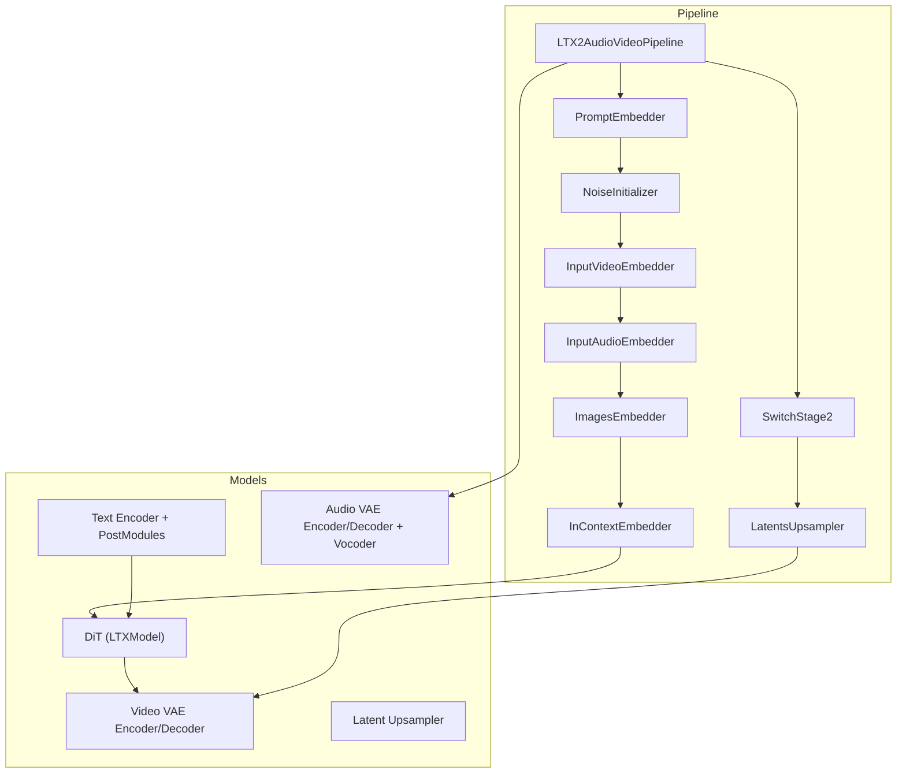
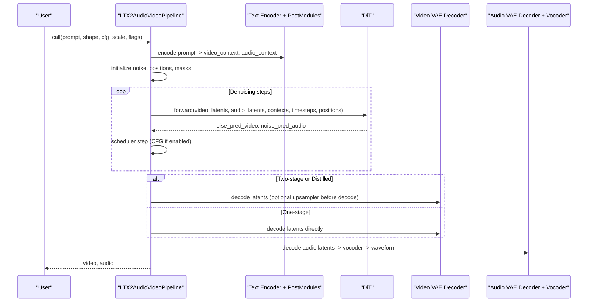
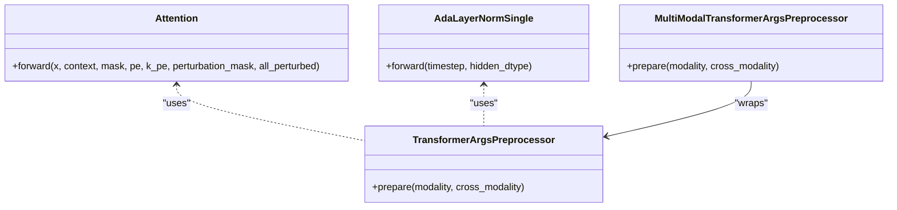
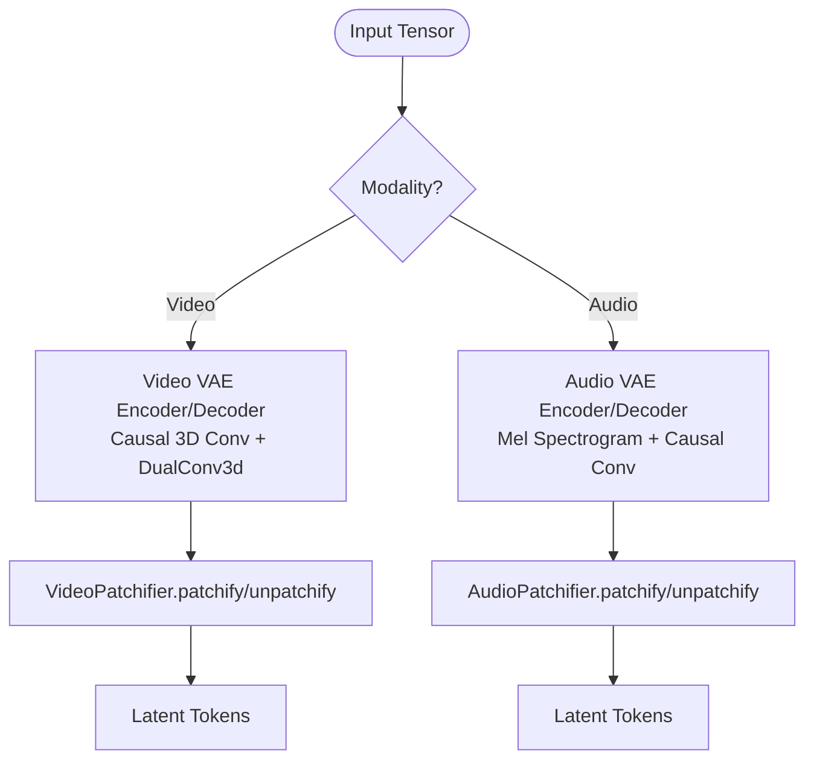
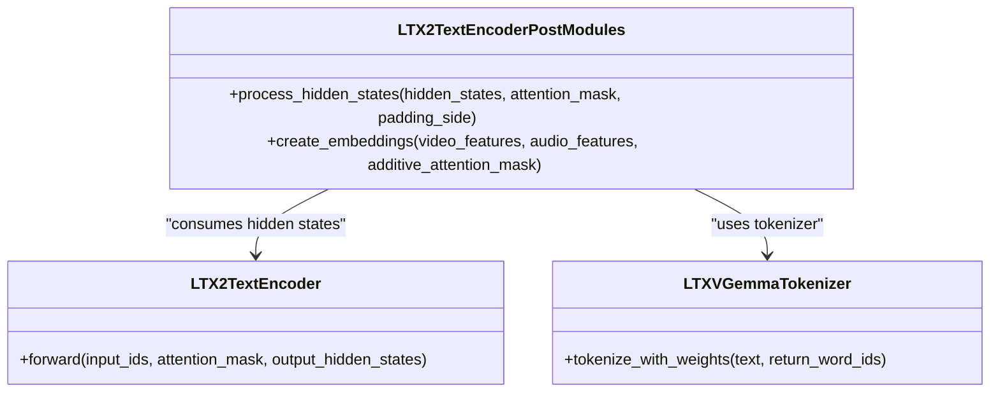
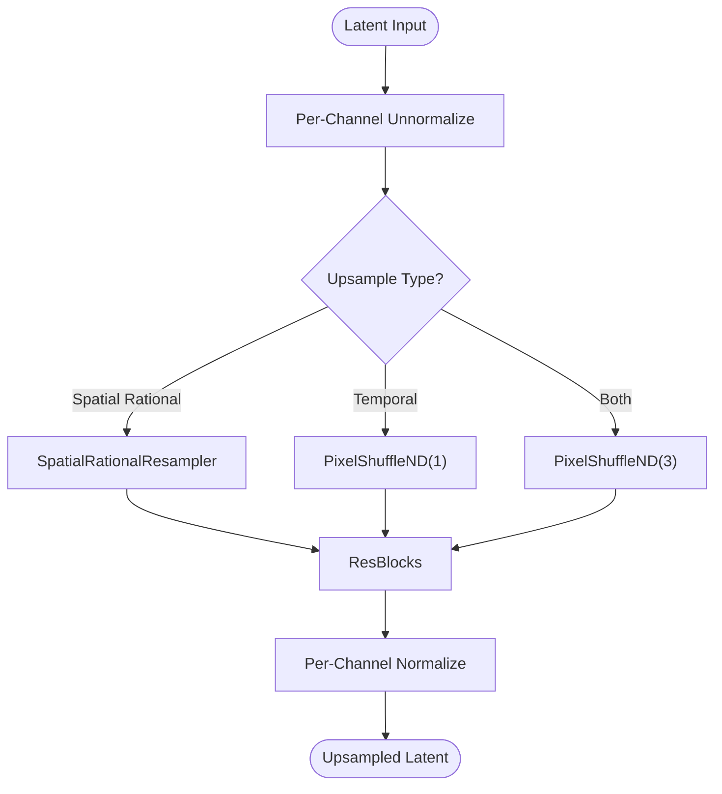
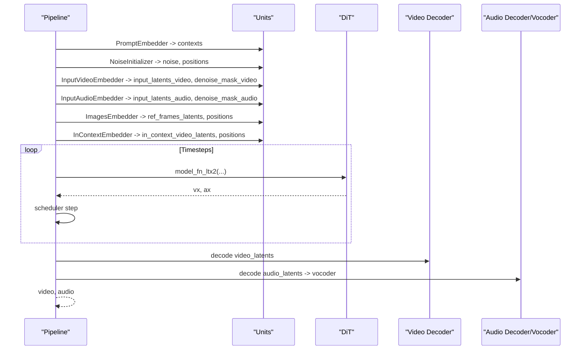
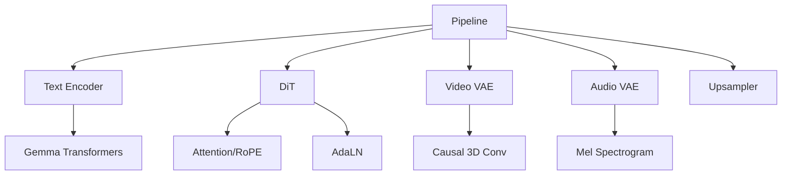

# LTX2 Audio-Video Models

<cite>
**Referenced Files in This Document**
- [ltx2_audio_video.py](file://diffsynth/pipelines/ltx2_audio_video.py)
- [ltx2_dit.py](file://diffsynth/models/ltx2_dit.py)
- [ltx2_text_encoder.py](file://diffsynth/models/ltx2_text_encoder.py)
- [ltx2_video_vae.py](file://diffsynth/models/ltx2_video_vae.py)
- [ltx2_audio_vae.py](file://diffsynth/models/ltx2_audio_vae.py)
- [ltx2_upsampler.py](file://diffsynth/models/ltx2_upsampler.py)
- [ltx2_common.py](file://diffsynth/models/ltx2_common.py)
- [LTX-2-T2AV-OneStage.py](file://examples/ltx2/model_inference/LTX-2-T2AV-OneStage.py)
- [LTX-2-T2AV-TwoStage.py](file://examples/ltx2/model_inference/LTX-2-T2AV-TwoStage.py)
- [LTX-2-T2AV-DistilledPipeline.py](file://examples/ltx2/model_inference/LTX-2-T2AV-DistilledPipeline.py)
- [LTX-2-T2AV-Camera-Control-Static.py](file://examples/ltx2/model_inference/LTX-2-T2AV-Camera-Control-Static.py)
</cite>

## Table of Contents
1. [Introduction](#introduction)
2. [Project Structure](#project-structure)
3. [Core Components](#core-components)
4. [Architecture Overview](#architecture-overview)
5. [Detailed Component Analysis](#detailed-component-analysis)
6. [Dependency Analysis](#dependency-analysis)
7. [Performance Considerations](#performance-considerations)
8. [Troubleshooting Guide](#troubleshooting-guide)
9. [Conclusion](#conclusion)
10. [Appendices](#appendices)

## Introduction
This document explains the LTX2 audio-video model implementations for multimodal content generation. It covers the DiT-based architecture that jointly processes video and audio, specialized VAEs for each modality, text encoder integration, and upsampling capabilities. It also documents the unified pipeline for generating synchronized audio-video content, camera control features via LoRA, motion tracking integration through conditioning, two-stage generation workflows, distilled pipelines for faster inference, and configuration options for resolution and quality settings.

## Project Structure
The LTX2 implementation is organized into:
- Pipeline orchestration and units for preprocessing, conditioning, denoising, and decoding
- DiT backbone for joint audio-video diffusion
- Text encoder and post-processing modules for prompt embeddings
- Video and audio VAEs with patchifiers and causal/3D convolutions
- Latent upsampler for spatial/temporal refinement
- Shared data structures and utilities for shapes and normalization

**Diagram sources**
- [ltx2_audio_video.py:28-249](file://diffsynth/pipelines/ltx2_audio_video.py#L28-L249)
- [ltx2_dit.py:1-200](file://diffsynth/models/ltx2_dit.py#L1-L200)
- [ltx2_text_encoder.py:11-120](file://diffsynth/models/ltx2_text_encoder.py#L11-L120)
- [ltx2_video_vae.py:18-160](file://diffsynth/models/ltx2_video_vae.py#L18-L160)
- [ltx2_audio_vae.py:12-120](file://diffsynth/models/ltx2_audio_vae.py#L12-L120)
- [ltx2_upsampler.py:182-296](file://diffsynth/models/ltx2_upsampler.py#L182-L296)

**Section sources**
- [ltx2_audio_video.py:28-249](file://diffsynth/pipelines/ltx2_audio_video.py#L28-L249)
- [ltx2_common.py:8-158](file://diffsynth/models/ltx2_common.py#L8-L158)

## Core Components
- Unified pipeline orchestrates stages, conditioning, and decoding for synchronized audio-video outputs
- DiT backbone performs joint audio-video denoising with cross-modal attention and RoPE positional encoding
- Text encoder produces separate video and audio contexts from prompts using Gemma-based encoders
- Video VAE uses 3D causal convolutions and per-channel statistics; audio VAE uses mel-spectrogram processing and causal convolutions
- Latent upsampler supports rational spatial scaling and optional temporal upscaling
- Common data structures define pixel/latent shapes and scale factors for consistent coordinate mapping

**Section sources**
- [ltx2_audio_video.py:28-249](file://diffsynth/pipelines/ltx2_audio_video.py#L28-L249)
- [ltx2_dit.py:465-554](file://diffsynth/models/ltx2_dit.py#L465-L554)
- [ltx2_text_encoder.py:11-120](file://diffsynth/models/ltx2_text_encoder.py#L11-L120)
- [ltx2_video_vae.py:182-351](file://diffsynth/models/ltx2_video_vae.py#L182-L351)
- [ltx2_audio_vae.py:12-120](file://diffsynth/models/ltx2_audio_vae.py#L12-L120)
- [ltx2_upsampler.py:149-179](file://diffsynth/models/ltx2_upsampler.py#L149-L179)
- [ltx2_common.py:8-158](file://diffsynth/models/ltx2_common.py#L8-L158)

## Architecture Overview
The LTX2 system integrates a text encoder, a DiT transformer for joint audio-video diffusion, and modality-specific VAEs. The pipeline composes multiple units to prepare inputs, generate noise, apply conditioning (first frame, reference frames, in-context videos), and perform CFG-guided denoising. Two-stage generation optionally applies an upsampler and stage-2 LoRA for higher resolution. Distilled pipelines use a specialized transformer and skip CFG.

**Diagram sources**
- [ltx2_audio_video.py:149-249](file://diffsynth/pipelines/ltx2_audio_video.py#L149-L249)
- [ltx2_text_encoder.py:406-463](file://diffsynth/models/ltx2_text_encoder.py#L406-L463)
- [ltx2_dit.py:465-554](file://diffsynth/models/ltx2_dit.py#L465-L554)
- [ltx2_video_vae.py:18-160](file://diffsynth/models/ltx2_video_vae.py#L18-L160)
- [ltx2_audio_vae.py:12-120](file://diffsynth/models/ltx2_audio_vae.py#L12-L120)

## Detailed Component Analysis

### DiT Architecture for Joint Audio-Video Processing
- Attention modules support interleaved or split RoPE types for spatio-temporal positioning
- AdaLN-single provides timestep conditioning with optional cross-attention parameters
- Transformer preprocessor prepares patchified latents, context, masks, and positional embeddings
- Multi-modal preprocessor extends preparation for cross-modality (audio-video) interactions
- Perturbation configs enable STG-style skipping of specific attention types during training/inference

**Diagram sources**
- [ltx2_dit.py:465-554](file://diffsynth/models/ltx2_dit.py#L465-L554)
- [ltx2_dit.py:239-266](file://diffsynth/models/ltx2_dit.py#L239-L266)
- [ltx2_dit.py:599-754](file://diffsynth/models/ltx2_dit.py#L599-L754)
- [ltx2_dit.py:756-800](file://diffsynth/models/ltx2_dit.py#L756-L800)

**Section sources**
- [ltx2_dit.py:465-554](file://diffsynth/models/ltx2_dit.py#L465-L554)
- [ltx2_dit.py:599-754](file://diffsynth/models/ltx2_dit.py#L599-L754)
- [ltx2_dit.py:756-800](file://diffsynth/models/ltx2_dit.py#L756-L800)

### Specialized VAEs for Audio and Video Modalities
- Video VAE uses 3D causal convolutions, dual conv3d blocks, and per-channel statistics normalization
- Audio VAE converts waveforms to log-mel spectrograms, applies causal convolutions, and supports patchification for latent sequences
- Both VAEs provide patchifiers to map between dense tensors and token sequences for transformer consumption

**Diagram sources**
- [ltx2_video_vae.py:182-351](file://diffsynth/models/ltx2_video_vae.py#L182-L351)
- [ltx2_audio_vae.py:12-120](file://diffsynth/models/ltx2_audio_vae.py#L12-L120)
- [ltx2_audio_vae.py:67-120](file://diffsynth/models/ltx2_audio_vae.py#L67-L120)

**Section sources**
- [ltx2_video_vae.py:182-351](file://diffsynth/models/ltx2_video_vae.py#L182-L351)
- [ltx2_audio_vae.py:12-120](file://diffsynth/models/ltx2_audio_vae.py#L12-L120)

### Text Encoder Integration
- Uses Gemma-based conditional generation with sliding/full attention layers
- Post-modules aggregate multi-layer hidden states into separate video and audio embeddings
- Tokenizer wrapper ensures correct padding and attention masks for left-padded prompts

**Diagram sources**
- [ltx2_text_encoder.py:11-120](file://diffsynth/models/ltx2_text_encoder.py#L11-L120)
- [ltx2_text_encoder.py:406-463](file://diffsynth/models/ltx2_text_encoder.py#L406-L463)
- [ltx2_text_encoder.py:90-151](file://diffsynth/models/ltx2_text_encoder.py#L90-L151)

**Section sources**
- [ltx2_text_encoder.py:11-120](file://diffsynth/models/ltx2_text_encoder.py#L11-L120)
- [ltx2_text_encoder.py:406-463](file://diffsynth/models/ltx2_text_encoder.py#L406-L463)

### Upsampling Capabilities
- Supports rational spatial resampling with PixelShuffle and blur downsampling
- Optional temporal upscaling by shuffling along the time dimension
- Normalization using per-channel statistics from the video encoder for stable upsampling

**Diagram sources**
- [ltx2_upsampler.py:149-179](file://diffsynth/models/ltx2_upsampler.py#L149-L179)
- [ltx2_upsampler.py:182-296](file://diffsynth/models/ltx2_upsampler.py#L182-L296)

**Section sources**
- [ltx2_upsampler.py:149-179](file://diffsynth/models/ltx2_upsampler.py#L149-L179)
- [ltx2_upsampler.py:182-296](file://diffsynth/models/ltx2_upsampler.py#L182-L296)

### Unified Pipeline for Synchronized Audio-Video Generation
- Composes units for prompt embedding, noise initialization, input conditioning (video/audio/images/in-context), and CFG-guided denoising
- Supports first-frame replacement, reference frames, and in-context video conditioning
- Decodes video and audio separately after denoising, ensuring synchronization via shared timing metadata

**Diagram sources**
- [ltx2_audio_video.py:298-589](file://diffsynth/pipelines/ltx2_audio_video.py#L298-L589)
- [ltx2_audio_video.py:648-732](file://diffsynth/pipelines/ltx2_audio_video.py#L648-L732)

**Section sources**
- [ltx2_audio_video.py:298-589](file://diffsynth/pipelines/ltx2_audio_video.py#L298-L589)
- [ltx2_audio_video.py:648-732](file://diffsynth/pipelines/ltx2_audio_video.py#L648-L732)

### Camera Control Features
- Camera control is enabled by loading specific LoRA weights into the DiT
- Examples demonstrate static camera control and various dolly/jib motions
- Works with two-stage pipelines and distilled configurations

**Section sources**
- [LTX-2-T2AV-Camera-Control-Static.py:31-34](file://examples/ltx2/model_inference/LTX-2-T2AV-Camera-Control-Static.py#L31-L34)

### Motion Tracking Integration
- Motion tracking can be integrated via in-context video conditioning and reference frame latents
- Positions are computed using patch grid bounds and scaled by frame rate and downsample factors
- Masks allow selective denoising regions based on time intervals

**Section sources**
- [ltx2_audio_video.py:543-589](file://diffsynth/pipelines/ltx2_audio_video.py#L543-L589)
- [ltx2_audio_video.py:402-428](file://diffsynth/pipelines/ltx2_audio_video.py#L402-L428)

### Two-Stage Generation Processes
- Stage 1 generates lower-resolution latents; Stage 2 applies upsampler and optional LoRA for refinement
- Resolution constraints ensure divisibility by required factors (32 for one-stage, 64 for two-stage)
- Distilled pipelines bypass CFG and use specialized transformer checkpoints

**Section sources**
- [ltx2_audio_video.py:275-296](file://diffsynth/pipelines/ltx2_audio_video.py#L275-L296)
- [ltx2_audio_video.py:591-646](file://diffsynth/pipelines/ltx2_audio_video.py#L591-L646)
- [LTX-2-T2AV-TwoStage.py:24-39](file://examples/ltx2/model_inference/LTX-2-T2AV-TwoStage.py#L24-L39)
- [LTX-2-T2AV-DistilledPipeline.py:15-29](file://examples/ltx2/model_inference/LTX-2-T2AV-DistilledPipeline.py#L15-L29)

### Distilled Pipelines for Faster Inference
- Use distilled transformer checkpoints and disable CFG guidance
- Automatically set two-stage pipeline behavior and adjust scheduling
- Maintain high quality with reduced inference steps

**Section sources**
- [ltx2_audio_video.py:260-272](file://diffsynth/pipelines/ltx2_audio_video.py#L260-L272)
- [LTX-2-T2AV-DistilledPipeline.py:46-55](file://examples/ltx2/model_inference/LTX-2-T2AV-DistilledPipeline.py#L46-L55)

### Configuration Options for Resolution and Quality
- Height, width, num_frames, frame_rate control output dimensions and duration
- Tiling parameters manage VRAM usage during encoding/decoding
- CFG scale controls guidance strength; distilled pipelines set it to 1.0
- Two-stage pipeline enables higher resolution through upsampling

**Section sources**
- [ltx2_audio_video.py:168-249](file://diffsynth/pipelines/ltx2_audio_video.py#L168-L249)
- [LTX-2-T2AV-OneStage.py:47-58](file://examples/ltx2/model_inference/LTX-2-T2AV-OneStage.py#L47-L58)
- [LTX-2-T2AV-TwoStage.py:66-76](file://examples/ltx2/model_inference/LTX-2-T2AV-TwoStage.py#L66-L76)

## Dependency Analysis
The LTX2 system exhibits clear separation between pipeline orchestration, model components, and utility functions. Key dependencies include:
- Pipeline depends on text encoder, DiT, VAEs, and upsampler
- DiT relies on attention mechanisms, RoPE, and AdaLN
- Text encoder uses Gemma-based transformers and tokenizer
- VAEs depend on causal convolutions and patchifiers
- Common data structures ensure consistent shape handling across modalities

**Diagram sources**
- [ltx2_audio_video.py:28-249](file://diffsynth/pipelines/ltx2_audio_video.py#L28-L249)
- [ltx2_dit.py:465-554](file://diffsynth/models/ltx2_dit.py#L465-L554)
- [ltx2_text_encoder.py:11-120](file://diffsynth/models/ltx2_text_encoder.py#L11-L120)
- [ltx2_video_vae.py:182-351](file://diffsynth/models/ltx2_video_vae.py#L182-L351)
- [ltx2_audio_vae.py:12-120](file://diffsynth/models/ltx2_audio_vae.py#L12-L120)

**Section sources**
- [ltx2_audio_video.py:28-249](file://diffsynth/pipelines/ltx2_audio_video.py#L28-L249)
- [ltx2_dit.py:465-554](file://diffsynth/models/ltx2_dit.py#L465-L554)
- [ltx2_text_encoder.py:11-120](file://diffsynth/models/ltx2_text_encoder.py#L11-L120)
- [ltx2_video_vae.py:182-351](file://diffsynth/models/ltx2_video_vae.py#L182-L351)
- [ltx2_audio_vae.py:12-120](file://diffsynth/models/ltx2_audio_vae.py#L12-L120)

## Performance Considerations
- Tiled encoding/decoding reduces VRAM usage for large resolutions
- Gradient checkpointing can be enabled for memory-efficient training
- Distilled pipelines reduce inference steps and skip CFG for faster generation
- Causal convolutions maintain temporal consistency while limiting computational overhead
- Per-channel statistics normalization ensures stable upsampling without additional compute

[No sources needed since this section provides general guidance]

## Troubleshooting Guide
Common issues and solutions:
- Shape mismatches: Ensure height/width are divisible by required factors (32 for one-stage, 64 for two-stage)
- Missing models: Verify all required components are loaded (text encoder, DiT, VAEs, upsampler)
- CFG conflicts: Distilled pipelines automatically disable CFG; manual CFG scaling may cause artifacts
- Memory errors: Enable tiled mode and adjust tile sizes; use VRAM management configurations
- Audio-video sync issues: Verify frame rate and timing calculations in position mappings

**Section sources**
- [ltx2_audio_video.py:275-296](file://diffsynth/pipelines/ltx2_audio_video.py#L275-L296)
- [ltx2_audio_video.py:260-272](file://diffsynth/pipelines/ltx2_audio_video.py#L260-L272)

## Conclusion
The LTX2 audio-video model provides a comprehensive framework for multimodal content generation. Its DiT architecture enables joint processing of video and audio, while specialized VAEs handle modality-specific transformations. The unified pipeline supports flexible conditioning, camera control, and motion tracking. Two-stage generation and distilled pipelines offer trade-offs between quality and speed. Proper configuration of resolution, tiling, and guidance parameters ensures optimal performance across different hardware constraints.

[No sources needed since this section summarizes without analyzing specific files]

## Appendices

### Example Usage Patterns
- One-stage generation for standard resolution outputs
- Two-stage generation for high-resolution results with upsampling
- Distilled pipelines for faster inference with reduced steps
- Camera control LoRA for cinematic camera movements

**Section sources**
- [LTX-2-T2AV-OneStage.py:24-36](file://examples/ltx2/model_inference/LTX-2-T2AV-OneStage.py#L24-L36)
- [LTX-2-T2AV-TwoStage.py:24-39](file://examples/ltx2/model_inference/LTX-2-T2AV-TwoStage.py#L24-L39)
- [LTX-2-T2AV-DistilledPipeline.py:15-29](file://examples/ltx2/model_inference/LTX-2-T2AV-DistilledPipeline.py#L15-L29)
- [LTX-2-T2AV-Camera-Control-Static.py:31-34](file://examples/ltx2/model_inference/LTX-2-T2AV-Camera-Control-Static.py#L31-L34)