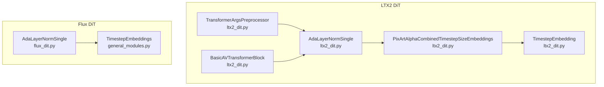
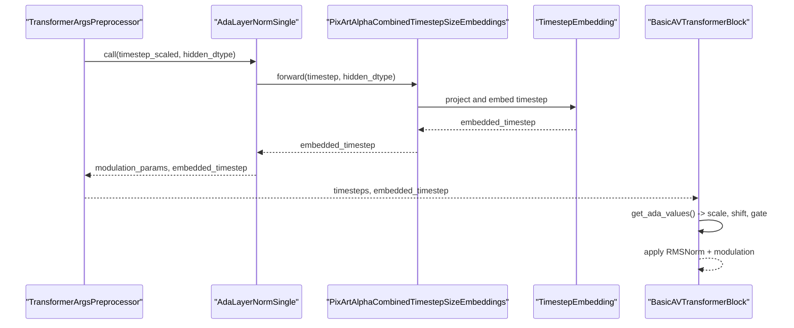
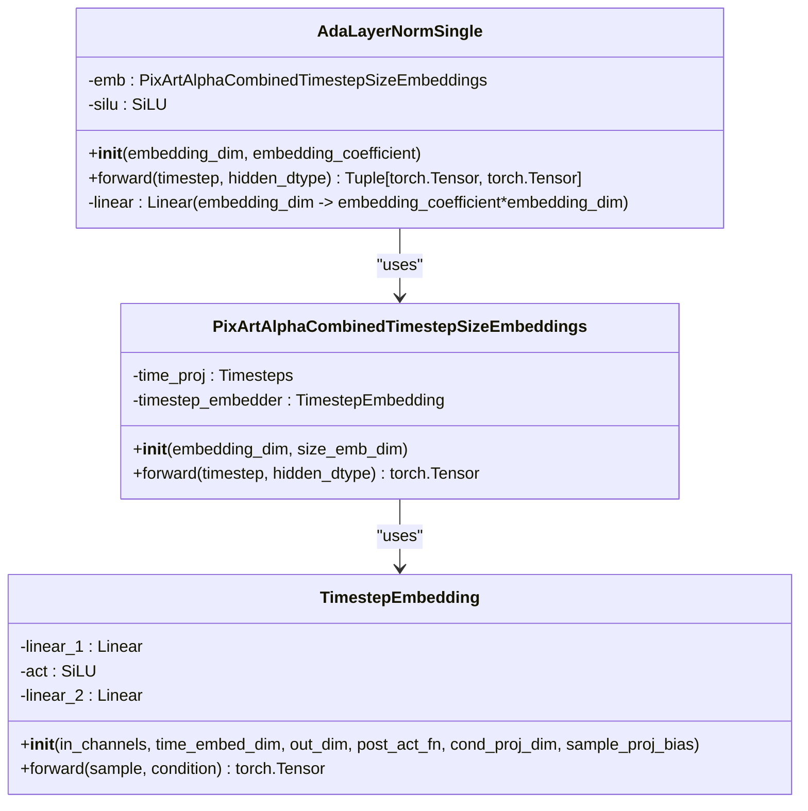
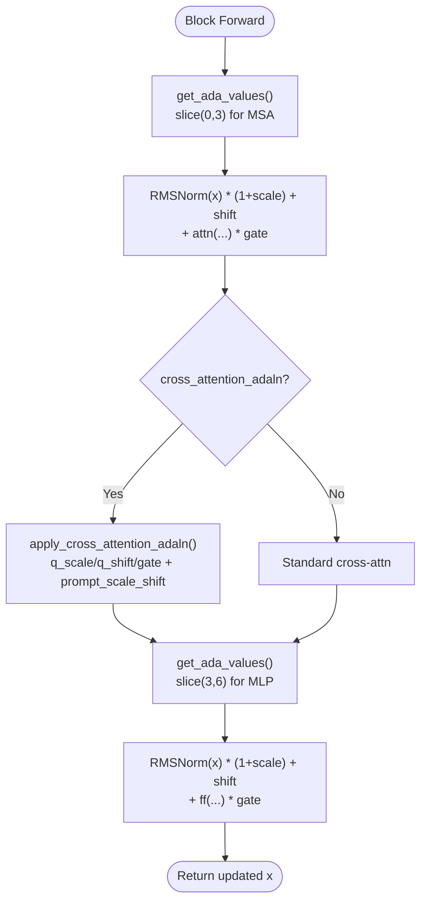
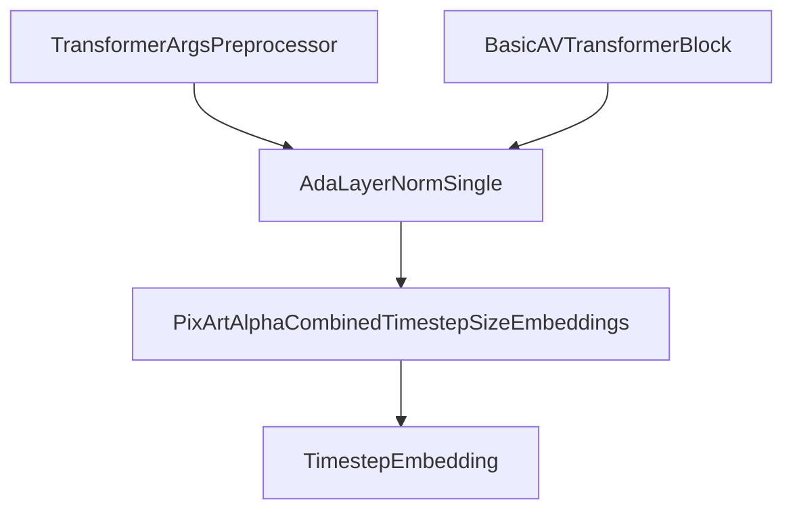

# AdaLN-Single Normalization

<cite>
**Referenced Files in This Document**
- [ltx2_dit.py](file://diffsynth/models/ltx2_dit.py)
- [flux_dit.py](file://diffsynth/models/flux_dit.py)
- [general_modules.py](file://diffsynth/models/general_modules.py)
</cite>

## Table of Contents
1. [Introduction](#introduction)
2. [Project Structure](#project-structure)
3. [Core Components](#core-components)
4. [Architecture Overview](#architecture-overview)
5. [Detailed Component Analysis](#detailed-component-analysis)
6. [Dependency Analysis](#dependency-analysis)
7. [Performance Considerations](#performance-considerations)
8. [Troubleshooting Guide](#troubleshooting-guide)
9. [Conclusion](#conclusion)
10. [Appendices](#appendices)

## Introduction
This document explains the AdaLayerNormSingle (adaLN-single) implementation used in LTX2 DiT. It details how this module extends PixArt-Alpha’s approach by combining timestep and size embeddings, how embedding coefficients control the number of parameters for different attention types, and how scale, shift, and gate parameters are generated for adaptive normalization. It also documents integration with TimestepEmbedding and PixArtAlphaCombinedTimestepSizeEmbeddings classes and provides configuration examples for various attention scenarios.

## Project Structure
The adaLN-single implementation resides primarily in the LTX2 DiT model file, with supporting components for timestep embeddings and related utilities. The Flux DiT contains a separate, simpler version of AdaLayerNormSingle used in a different architecture.

**Diagram sources**
- [ltx2_dit.py:239-266](file://diffsynth/models/ltx2_dit.py#L239-L266)
- [ltx2_dit.py:126-152](file://diffsynth/models/ltx2_dit.py#L126-L152)
- [ltx2_dit.py:65-105](file://diffsynth/models/ltx2_dit.py#L65-L105)
- [ltx2_dit.py:599-754](file://diffsynth/models/ltx2_dit.py#L599-L754)
- [ltx2_dit.py:875-1221](file://diffsynth/models/ltx2_dit.py#L875-L1221)
- [flux_dit.py:189-202](file://diffsynth/models/flux_dit.py#L189-L202)
- [general_modules.py:80-101](file://diffsynth/models/general_modules.py#L80-L101)

**Section sources**
- [ltx2_dit.py:239-266](file://diffsynth/models/ltx2_dit.py#L239-L266)
- [flux_dit.py:189-202](file://diffsynth/models/flux_dit.py#L189-L202)
- [general_modules.py:80-101](file://diffsynth/models/general_modules.py#L80-L101)

## Core Components
- AdaLayerNormSingle (LTX2): Produces per-token modulation parameters from combined timestep-size embeddings; supports configurable embedding coefficients to accommodate different attention pathways.
- PixArtAlphaCombinedTimestepSizeEmbeddings: Encodes timesteps into a fixed-dimensional vector using sinusoidal projections and MLPs; used as the conditioning source for AdaLayerNormSingle.
- TimestepEmbedding: MLP that projects sinusoidal timestep features into the target dimension.
- TransformerArgsPreprocessor: Prepares timestep embeddings and feeds them to AdaLayerNormSingle during transformer preprocessing.
- BasicAVTransformerBlock: Uses AdaLayerNormSingle outputs to generate scale, shift, and gate parameters for self-attention, cross-attention, and feed-forward modules.

Key responsibilities:
- Embedding generation: Convert scalar timesteps into rich feature vectors.
- Parameter generation: Map embeddings to scale, shift, and gate tensors for normalization.
- Coefficient management: Control the number of parameters based on attention type (self vs. cross).

**Section sources**
- [ltx2_dit.py:239-266](file://diffsynth/models/ltx2_dit.py#L239-L266)
- [ltx2_dit.py:126-152](file://diffsynth/models/ltx2_dit.py#L126-L152)
- [ltx2_dit.py:65-105](file://diffsynth/models/ltx2_dit.py#L65-L105)
- [ltx2_dit.py:599-754](file://diffsynth/models/ltx2_dit.py#L599-L754)
- [ltx2_dit.py:875-1221](file://diffsynth/models/ltx2_dit.py#L875-L1221)

## Architecture Overview
The LTX2 DiT uses adaLN-single to modulate normalization layers within transformer blocks. The flow is:
1. Timesteps are projected via PixArtAlphaCombinedTimestepSizeEmbeddings.
2. AdaLayerNormSingle transforms these embeddings into a sequence of modulation parameters.
3. Transformer blocks consume these parameters to compute scale, shift, and gate values for self-attention, cross-attention, and MLP layers.

**Diagram sources**
- [ltx2_dit.py:599-754](file://diffsynth/models/ltx2_dit.py#L599-L754)
- [ltx2_dit.py:239-266](file://diffsynth/models/ltx2_dit.py#L239-L266)
- [ltx2_dit.py:126-152](file://diffsynth/models/ltx2_dit.py#L126-L152)
- [ltx2_dit.py:65-105](file://diffsynth/models/ltx2_dit.py#L65-L105)
- [ltx2_dit.py:875-1221](file://diffsynth/models/ltx2_dit.py#L875-L1221)

## Detailed Component Analysis

### AdaLayerNormSingle (LTX2)
- Purpose: Generate modulation parameters (scale, shift, gate) conditioned on timestep embeddings.
- Inputs: timestep tensor and optional hidden dtype.
- Outputs: modulation parameters and the underlying embedded timestep.
- Embedding coefficient: Controls the total number of output channels produced by the linear layer. For base cases, it produces 6 * dim (shift_msa, scale_msa, gate_msa, shift_mlp, scale_mlp, gate_mlp). If cross-attention AdaLN is enabled, an additional 3 * dim is added for cross-attention modulation.

**Diagram sources**
- [ltx2_dit.py:239-266](file://diffsynth/models/ltx2_dit.py#L239-L266)
- [ltx2_dit.py:126-152](file://diffsynth/models/ltx2_dit.py#L126-L152)
- [ltx2_dit.py:65-105](file://diffsynth/models/ltx2_dit.py#L65-L105)

**Section sources**
- [ltx2_dit.py:239-266](file://diffsynth/models/ltx2_dit.py#L239-L266)
- [ltx2_dit.py:126-152](file://diffsynth/models/ltx2_dit.py#L126-L152)
- [ltx2_dit.py:65-105](file://diffsynth/models/ltx2_dit.py#L65-L105)

### Embedding Coefficient System
- Base parameters: 6 per block (shift_msa, scale_msa, gate_msa, shift_mlp, scale_mlp, gate_mlp).
- Cross-attention parameters: Additional 3 per block when cross_attention_adaln is True (shift_q, scale_q, gate_q).
- Utility function adaln_embedding_coefficient computes total parameters based on whether cross-attention AdaLN is enabled.

Configuration examples:
- Video-only self-attention and MLP: embedding_coefficient = 6.
- With cross-attention AdaLN: embedding_coefficient = 9.
- Audio-video cross-attention uses separate AdaLN instances with specific coefficients for scale-shift and gate pathways.

**Section sources**
- [ltx2_dit.py:229-237](file://diffsynth/models/ltx2_dit.py#L229-L237)
- [ltx2_dit.py:1368-1369](file://diffsynth/models/ltx2_dit.py#L1368-L1369)
- [ltx2_dit.py:1381-1382](file://diffsynth/models/ltx2_dit.py#L1381-L1382)
- [ltx2_dit.py:1408-1409](file://diffsynth/models/ltx2_dit.py#L1408-L1409)
- [ltx2_dit.py:1428-1446](file://diffsynth/models/ltx2_dit.py#L1428-L1446)

### Integration with Transformer Blocks
- BasicAVTransformerBlock consumes timesteps and embedded_timestep to derive scale, shift, and gate values for:
  - Self-attention (MSA)
  - Text cross-attention (CA)
  - Feed-forward (MLP)
  - Audio-video cross-attention pathways
- get_ada_values slices the modulation parameters according to attention type and applies RMSNorm-based modulation.

**Diagram sources**
- [ltx2_dit.py:875-1221](file://diffsynth/models/ltx2_dit.py#L875-L1221)

**Section sources**
- [ltx2_dit.py:875-1221](file://diffsynth/models/ltx2_dit.py#L875-L1221)

### Comparison with Flux DiT AdaLayerNormSingle
- Flux DiT’s AdaLayerNormSingle is simpler: it takes a precomputed embedding and directly generates scale, shift, and gate for LayerNorm without combined timestep-size embeddings.
- LTX2’s version integrates PixArtAlphaCombinedTimestepSizeEmbeddings to produce richer conditioning signals.

**Section sources**
- [flux_dit.py:189-202](file://diffsynth/models/flux_dit.py#L189-L202)

## Dependency Analysis
- AdaLayerNormSingle depends on PixArtAlphaCombinedTimestepSizeEmbeddings, which in turn uses TimestepEmbedding.
- TransformerArgsPreprocessor orchestrates timestep scaling and passes results to AdaLayerNormSingle.
- BasicAVTransformerBlock consumes outputs from AdaLayerNormSingle to modulate attention and MLP layers.

**Diagram sources**
- [ltx2_dit.py:599-754](file://diffsynth/models/ltx2_dit.py#L599-L754)
- [ltx2_dit.py:239-266](file://diffsynth/models/ltx2_dit.py#L239-L266)
- [ltx2_dit.py:126-152](file://diffsynth/models/ltx2_dit.py#L126-L152)
- [ltx2_dit.py:65-105](file://diffsynth/models/ltx2_dit.py#L65-L105)
- [ltx2_dit.py:875-1221](file://diffsynth/models/ltx2_dit.py#L875-L1221)

**Section sources**
- [ltx2_dit.py:599-754](file://diffsynth/models/ltx2_dit.py#L599-L754)
- [ltx2_dit.py:239-266](file://diffsynth/models/ltx2_dit.py#L239-L266)
- [ltx2_dit.py:126-152](file://diffsynth/models/ltx2_dit.py#L126-L152)
- [ltx2_dit.py:65-105](file://diffsynth/models/ltx2_dit.py#L65-L105)
- [ltx2_dit.py:875-1221](file://diffsynth/models/ltx2_dit.py#L875-L1221)

## Performance Considerations
- Embedding computation: Sinusoidal timestep projection followed by MLPs adds minimal overhead but enables rich conditioning.
- Modulation parameter generation: Linear projection with SiLU activation is lightweight; slicing and broadcasting are efficient.
- Memory usage: Separate AdaLN instances for different attention pathways increase parameter count; ensure appropriate coefficient selection to balance performance and memory.
- Gradient checkpointing: Can be enabled in transformer blocks to reduce memory at the cost of compute.

[No sources needed since this section provides general guidance]

## Troubleshooting Guide
- Incorrect embedding_coefficient: Ensure the coefficient matches the attention configuration (6 for base, 9 if cross-attention AdaLN is enabled).
- Shape mismatches: Verify that timestep tensors are properly scaled and reshaped before passing to AdaLayerNormSingle.
- Cross-attention AdaLN not applied: Confirm cross_attention_adaln flag is set and corresponding prompt_scale_shift_table is provided.
- Numerical stability: Use appropriate eps values in RMSNorm and LayerNorm to avoid instability.

**Section sources**
- [ltx2_dit.py:229-237](file://diffsynth/models/ltx2_dit.py#L229-L237)
- [ltx2_dit.py:599-754](file://diffsynth/models/ltx2_dit.py#L599-L754)
- [ltx2_dit.py:875-1221](file://diffsynth/models/ltx2_dit.py#L875-L1221)

## Conclusion
AdaLayerNormSingle in LTX2 DiT extends PixArt-Alpha’s approach by integrating combined timestep-size embeddings through PixArtAlphaCombinedTimestepSizeEmbeddings and TimestepEmbedding. The embedding coefficient system allows flexible configuration for different attention types, enabling precise control over scale, shift, and gate parameters. This design enhances adaptability and performance in multimodal diffusion transformers.

[No sources needed since this section summarizes without analyzing specific files]

## Appendices

### Configuration Examples
- Video-only self-attention and MLP: Set embedding_coefficient to 6 in AdaLayerNormSingle initialization.
- With cross-attention AdaLN: Set embedding_coefficient to 9 to include cross-attention modulation parameters.
- Audio-video cross-attention: Use separate AdaLayerNormSingle instances with coefficients tailored for scale-shift and gate pathways.

**Section sources**
- [ltx2_dit.py:1381-1382](file://diffsynth/models/ltx2_dit.py#L1381-L1382)
- [ltx2_dit.py:1408-1409](file://diffsynth/models/ltx2_dit.py#L1408-L1409)
- [ltx2_dit.py:1428-1446](file://diffsynth/models/ltx2_dit.py#L1428-L1446)