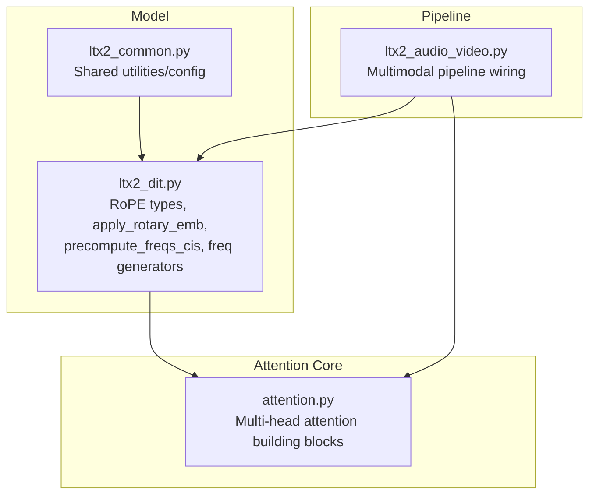
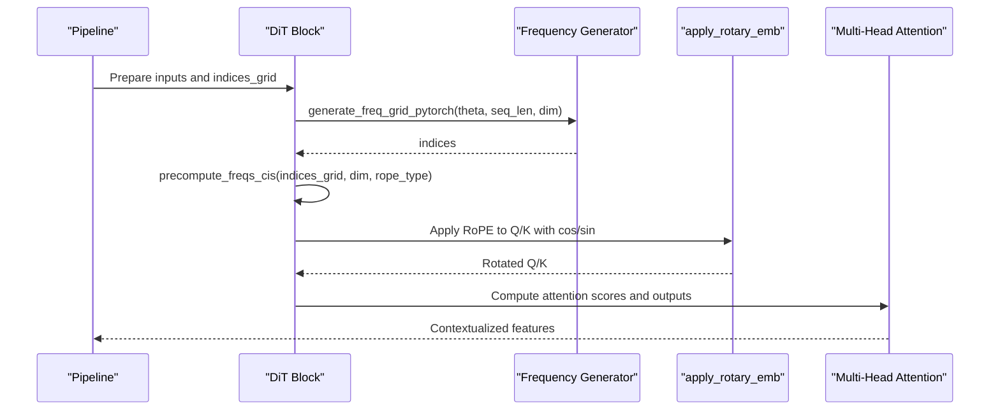
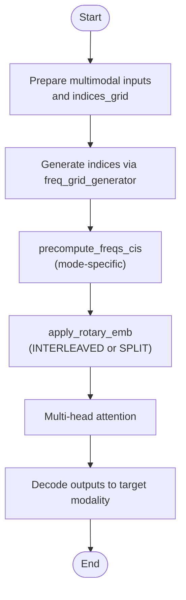
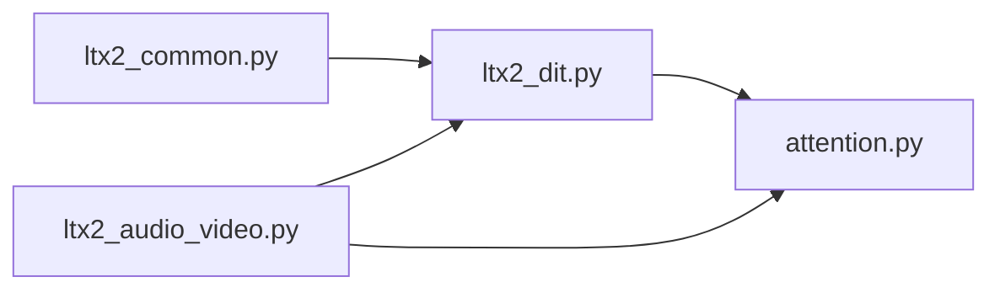

# Attention Mechanisms and RoPE Implementations

<cite>
**Referenced Files in This Document**
- [ltx2_dit.py](file://diffsynth/models/ltx2_dit.py)
- [ltx2_common.py](file://diffsynth/models/ltx2_common.py)
- [attention.py](file://diffsynth/core/attention/attention.py)
- [ltx2_audio_video.py](file://diffsynth/pipelines/ltx2_audio_video.py)
</cite>

## Table of Contents
1. [Introduction](#introduction)
2. [Project Structure](#project-structure)
3. [Core Components](#core-components)
4. [Architecture Overview](#architecture-overview)
5. [Detailed Component Analysis](#detailed-component-analysis)
6. [Dependency Analysis](#dependency-analysis)
7. [Performance Considerations](#performance-considerations)
8. [Troubleshooting Guide](#troubleshooting-guide)
9. [Conclusion](#conclusion)
10. [Appendices](#appendices)

## Introduction
This document explains the attention mechanisms and Rotary Positional Encoding (RoPE) implementations used in LTX2 DiT. It focuses on two RoPE variants—INTERLEAVED and SPLIT—and details how they encode temporal and spatial positions differently within the multimodal processing pipeline. We also cover frequency grid generation, the precompute_freqs_cis routine, and practical guidance for choosing between RoPE modes based on use cases and performance characteristics.

## Project Structure
LTX2 DiT’s RoPE and attention logic are primarily implemented in the model module, with supporting utilities and integration points across common modules, attention core, and pipelines. The key files involved are:
- Model implementation containing RoPE types, apply_rotary_emb, frequency computation, and helpers
- Common utilities that may provide shared components or configuration
- Core attention implementation used by transformer blocks
- Pipeline orchestration that wires text, image, audio, and video through the DiT

**Diagram sources**
- [ltx2_dit.py](file://diffsynth/models/ltx2_dit.py)
- [ltx2_common.py](file://diffsynth/models/ltx2_common.py)
- [attention.py](file://diffsynth/core/attention/attention.py)
- [ltx2_audio_video.py](file://diffsynth/pipelines/ltx2_audio_video.py)

**Section sources**
- [ltx2_dit.py](file://diffsynth/models/ltx2_dit.py)
- [ltx2_common.py](file://diffsynth/models/ltx2_common.py)
- [attention.py](file://diffsynth/core/attention/attention.py)
- [ltx2_audio_video.py](file://diffsynth/pipelines/ltx2_audio_video.py)

## Core Components
- LTXRopeType enum defines the two supported RoPE modes: INTERLEAVED and SPLIT.
- apply_rotary_emb dispatches to mode-specific functions based on the selected RoPE type.
- Frequency grid generation is handled by a configurable generator (default PyTorch-based), producing indices for positional encoding.
- precompute_freqs_cis computes cos/sin frequency tensors tailored to the chosen RoPE mode and supports optional padding and middle-index grids.
- Helper routines split or interleave frequencies to match multi-head attention layouts.

Key responsibilities:
- Mode selection and dispatching
- Frequency grid creation per dimension (temporal/spatial)
- Broadcasting and reshaping for efficient attention application
- Padding handling for sequence alignment

**Section sources**
- [ltx2_dit.py](file://diffsynth/models/ltx2_dit.py)

## Architecture Overview
The RoPE mechanism integrates into the DiT attention layers as follows:
- The pipeline prepares indices_grid representing positions along temporal and spatial axes.
- precompute_freqs_cis generates frequency tensors (cos/sin) according to the selected RoPE mode.
- apply_rotary_emb applies the appropriate rotation to query/key tensors before computing attention scores.
- Multi-head attention uses these rotated representations to compute context-aware interactions across time and space.

**Diagram sources**
- [ltx2_dit.py](file://diffsynth/models/ltx2_dit.py)
- [attention.py](file://diffsynth/core/attention/attention.py)
- [ltx2_audio_video.py](file://diffsynth/pipelines/ltx2_audio_video.py)

## Detailed Component Analysis

### RoPE Modes: INTERLEAVED vs SPLIT
- INTERLEAVED mode interleaves pairs of dimensions during rotation, suitable when positional information should be mixed across adjacent channels.
- SPLIT mode splits the feature dimension into halves and rotates each half independently, preserving separation between paired components.

Behavior differences:
- INTERLEAVED applies rotation by pairing adjacent elements and rotating them together.
- SPLIT handles potential shape mismatches by reshaping input tensors to align with 4D frequency tensors, then performs rotation on split halves.

Use cases:
- INTERLEAVED is often preferred for compact representation and when channel-wise mixing benefits modeling.
- SPLIT can be advantageous when maintaining explicit separation between paired components improves interpretability or stability.

**Section sources**
- [ltx2_dit.py](file://diffsynth/models/ltx2_dit.py)

### apply_rotary_emb Function
Responsibilities:
- Accepts input tensor and precomputed frequency pair (cos, sin).
- Dispatches to mode-specific rotary embedding function based on rope_type.
- Raises an error if an invalid rope_type is provided.

Operational flow:
- Validate rope_type against supported modes.
- Call either apply_interleaved_rotary_emb or apply_split_rotary_emb.
- Return rotated tensor aligned with original shape.

**Section sources**
- [ltx2_dit.py](file://diffsynth/models/ltx2_dit.py)

### Frequency Grid Generation and precompute_freqs_cis
Frequency generation steps:
- Generate base indices using a frequency grid generator (default PyTorch-based).
- Convert indices_grid to fractional positions relative to max_pos per dimension.
- Compute raw frequencies via linear scaling and broadcasting.
- Transform raw frequencies into cos/sin pairs tailored to the selected RoPE mode.
- Optionally pad sequences to align with attention heads.

Mode-specific transformations:
- For SPLIT: reshape and swap axes to match (B, H, T, D//2) layout.
- For INTERLEAVED: repeat-interleave dimensions to produce (B, H, T, D) layout.

Parameters:
- indices_grid: position indices across dimensions (e.g., temporal and spatial).
- dim: feature dimension for frequency computation.
- out_dtype: output precision.
- theta: scaling factor for frequency progression.
- max_pos: maximum positions per dimension; defaults provided if not specified.
- num_attention_heads: number of heads for reshaping.
- rope_type: selects INTERLEAVED or SPLIT behavior.
- freq_grid_generator: pluggable generator for indices.

**Section sources**
- [ltx2_dit.py](file://diffsynth/models/ltx2_dit.py)

### Temporal vs Spatial Positional Handling
- indices_grid encodes positions along multiple axes; typically includes temporal and spatial coordinates.
- Fractional positions normalize indices by max_pos, enabling consistent frequency scaling across dimensions.
- The resulting frequencies are broadcasted appropriately for multi-head attention, ensuring temporal and spatial contexts are encoded distinctly yet coherently.

Practical implications:
- Temporal positions capture motion and sequence dynamics.
- Spatial positions capture scene structure and local relationships.
- Combining both enables rich multimodal reasoning across time and space.

**Section sources**
- [ltx2_dit.py](file://diffsynth/models/ltx2_dit.py)

### Integration with Multimodal Processing Pipeline
The pipeline orchestrates text, image, audio, and video inputs through the DiT:
- Inputs are tokenized and projected into latent spaces.
- Indices_grid is constructed from frame and patch coordinates.
- precompute_freqs_cis produces mode-specific cos/sin tensors.
- apply_rotary_emb rotates Q/K before attention scoring.
- Outputs are decoded back to modalities.

**Diagram sources**
- [ltx2_audio_video.py](file://diffsynth/pipelines/ltx2_audio_video.py)
- [ltx2_dit.py](file://diffsynth/models/ltx2_dit.py)

**Section sources**
- [ltx2_audio_video.py](file://diffsynth/pipelines/ltx2_audio_video.py)
- [ltx2_dit.py](file://diffsynth/models/ltx2_dit.py)

## Dependency Analysis
Dependencies among components:
- ltx2_dit.py depends on torch operations and provides RoPE utilities.
- attention.py implements multi-head attention used by DiT blocks.
- ltx2_common.py may supply shared utilities or configurations referenced by the model.
- ltx2_audio_video.py orchestrates data flow and invokes DiT with RoPE-enabled attention.

**Diagram sources**
- [ltx2_dit.py](file://diffsynth/models/ltx2_dit.py)
- [attention.py](file://diffsynth/core/attention/attention.py)
- [ltx2_common.py](file://diffsynth/models/ltx2_common.py)
- [ltx2_audio_video.py](file://diffsynth/pipelines/ltx2_audio_video.py)

**Section sources**
- [ltx2_dit.py](file://diffsynth/models/ltx2_dit.py)
- [attention.py](file://diffsynth/core/attention/attention.py)
- [ltx2_common.py](file://diffsynth/models/ltx2_common.py)
- [ltx2_audio_video.py](file://diffsynth/pipelines/ltx2_audio_video.py)

## Performance Considerations
- Memory usage: SPLIT mode may require additional reshaping operations when input dimensions differ from frequency shapes, potentially increasing temporary memory.
- Computation cost: Both modes perform element-wise rotations; INTERLEAVED involves stacking/unstacking pairs, while SPLIT splits halves and rotates independently.
- Broadcasting efficiency: Ensure indices_grid and max_pos are aligned with batch and head dimensions to minimize unnecessary broadcasts.
- Padding: When pad_size > 0, padding tokens are added to cos/sin tensors; this can affect attention masking and should be accounted for in sequence lengths.

Optimization tips:
- Use contiguous tensors where possible to improve memory access patterns.
- Avoid excessive reshapes by planning indices_grid shapes upfront.
- Select rope_type based on empirical results for your dataset and task.

[No sources needed since this section provides general guidance]

## Troubleshooting Guide
Common issues and resolutions:
- Invalid rope_type: Ensure rope_type is set to INTERLEAVED or SPLIT; otherwise, an error will be raised.
- Shape mismatches: Verify that input_tensor ndim matches expectations for SPLIT mode; if not, internal reshaping occurs but may impact performance.
- Padding artifacts: Check pad_size and ensure attention masks exclude padded regions correctly.
- Frequency scaling: Adjust theta and max_pos to match expected position ranges; incorrect scaling can degrade positional encoding quality.

Debugging steps:
- Inspect indices_grid shapes and values to confirm correct temporal/spatial indexing.
- Print intermediate cos/sin shapes to verify broadcasting compatibility.
- Validate attention masks after padding to avoid unintended interactions.

**Section sources**
- [ltx2_dit.py](file://diffsynth/models/ltx2_dit.py)

## Conclusion
LTX2 DiT offers two RoPE implementations—INTERLEAVED and SPLIT—that encode temporal and spatial positions differently to suit various modeling needs. The apply_rotary_emb function centralizes mode selection, while precompute_freqs_cis and frequency generators enable flexible, scalable positional encoding. Proper configuration of indices_grid, max_pos, and rope_type ensures optimal performance and accuracy in multimodal tasks.

[No sources needed since this section summarizes without analyzing specific files]

## Appendices
- Practical examples:
  - Use INTERLEAVED when channel-wise mixing enhances feature representation, such as in dense prediction tasks.
  - Use SPLIT when maintaining explicit separation between paired components aids stability or interpretability, such as in certain video generation scenarios.
- Parameter tuning:
  - theta controls frequency progression; larger values extend the range of captured positions.
  - max_pos should reflect the maximum expected temporal and spatial extents.
  - num_attention_heads must align with model architecture for correct reshaping.

[No sources needed since this section provides general guidance]