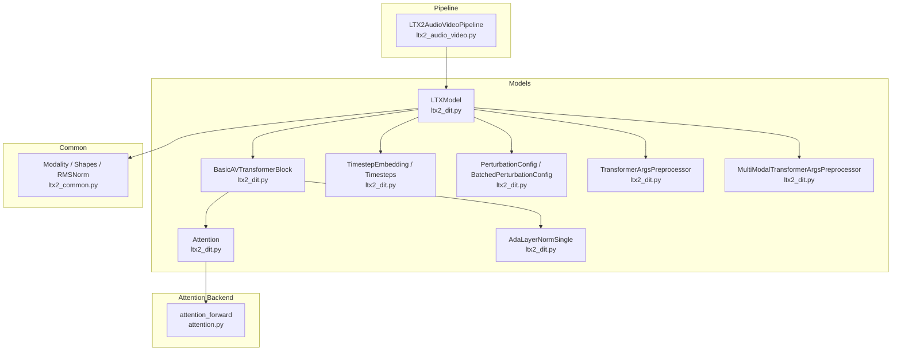
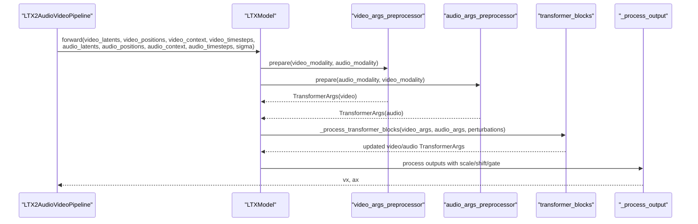
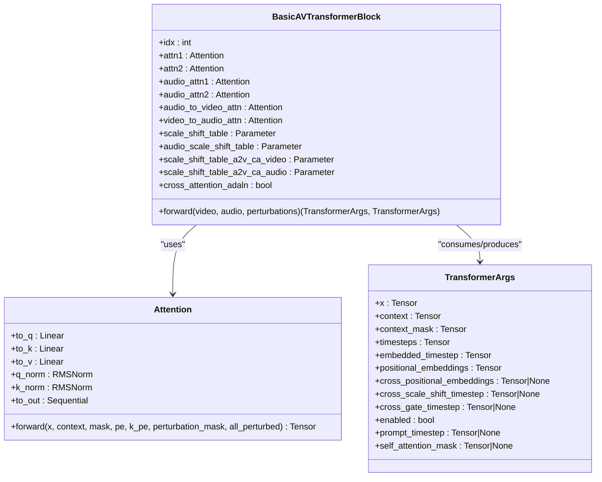
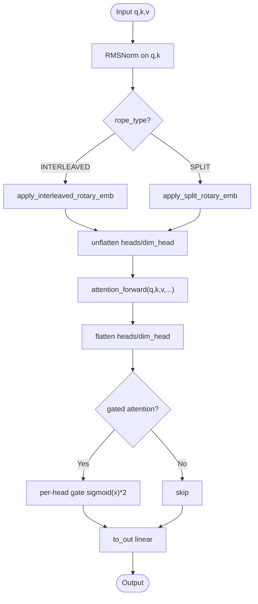
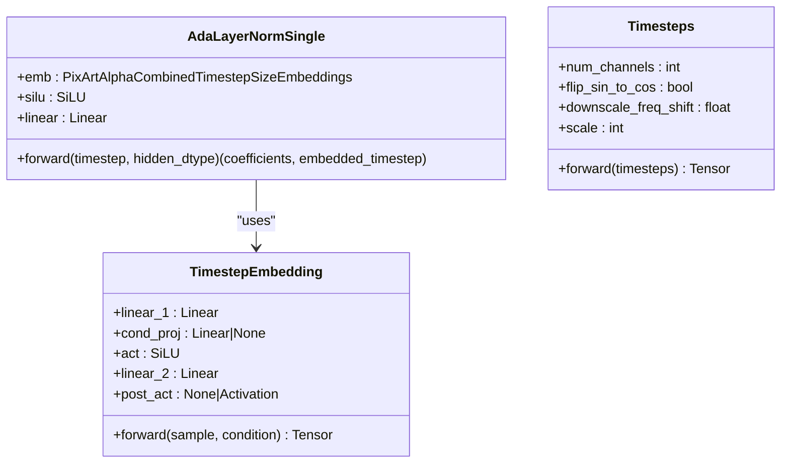
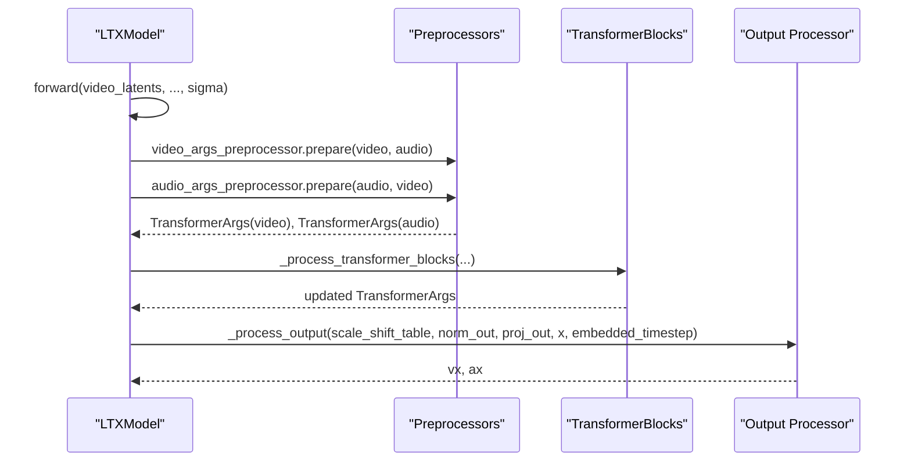
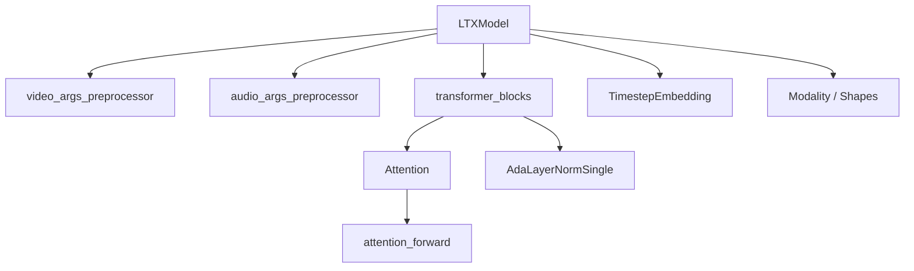

# LTX2 DiT Architecture

<cite>
**Referenced Files in This Document**
- [ltx2_dit.py](file://diffsynth/models/ltx2_dit.py)
- [ltx2_common.py](file://diffsynth/models/ltx2_common.py)
- [attention.py](file://diffsynth/core/attention/attention.py)
- [ltx2_audio_video.py](file://diffsynth/pipelines/ltx2_audio_video.py)
</cite>

## Table of Contents
1. [Introduction](#introduction)
2. [Project Structure](#project-structure)
3. [Core Components](#core-components)
4. [Architecture Overview](#architecture-overview)
5. [Detailed Component Analysis](#detailed-component-analysis)
6. [Dependency Analysis](#dependency-analysis)
7. [Performance Considerations](#performance-considerations)
8. [Troubleshooting Guide](#troubleshooting-guide)
9. [Conclusion](#conclusion)
10. [Appendices](#appendices)

## Introduction
This document provides a comprehensive, code-grounded description of the LTX2 Diffusion Transformer (DiT) architecture for joint audio-video processing. It focuses on multimodal transformer blocks, attention mechanisms with interleaved and split RoPE, AdaLN-single normalization, timestep embeddings, and perturbation systems for Spatio-Temporal Guidance (STG). It also documents the TransformerArgsPreprocessor and MultiModalTransformerArgsPreprocessor classes that prepare inputs for different modalities and orchestrate cross-modal attention between audio and video streams. Practical configuration examples are included to illustrate how to set attention types, perturbation configurations, and positional embedding strategies.

## Project Structure
The LTX2 DiT implementation is primarily contained within:
- diffsynth/models/ltx2_dit.py: Core DiT model, transformer blocks, attention, RoPE, AdaLN-single, timesteps, perturbations, preprocessors
- diffsynth/models/ltx2_common.py: Shared data structures (Modality, shapes), normalization utilities
- diffsynth/core/attention/attention.py: Attention backend selection and implementations
- diffsynth/pipelines/ltx2_audio_video.py: Pipeline orchestrating preprocessing, denoising, and decoding for audio-video generation

**Diagram sources**
- [ltx2_dit.py:875-1221](file://diffsynth/models/ltx2_dit.py#L875-L1221)
- [ltx2_dit.py:1278-1684](file://diffsynth/models/ltx2_dit.py#L1278-L1684)
- [ltx2_common.py:248-283](file://diffsynth/models/ltx2_common.py#L248-L283)
- [attention.py:108-122](file://diffsynth/core/attention/attention.py#L108-L122)
- [ltx2_audio_video.py:648-732](file://diffsynth/pipelines/ltx2_audio_video.py#L648-L732)

**Section sources**
- [ltx2_dit.py:1-1684](file://diffsynth/models/ltx2_dit.py#L1-L1684)
- [ltx2_common.py:1-389](file://diffsynth/models/ltx2_common.py#L1-L389)
- [attention.py:1-122](file://diffsynth/core/attention/attention.py#L1-L122)
- [ltx2_audio_video.py:1-732](file://diffsynth/pipelines/ltx2_audio_video.py#L1-L732)

## Core Components
- LTXModel: The main DiT module that initializes video/audio branches, cross-attention modules, preprocessors, and stacked transformer blocks. It supports AudioVideo, VideoOnly, and AudioOnly modes.
- BasicAVTransformerBlock: Multimodal block implementing self-attention per modality, text cross-attention, and bidirectional audio-video cross-attention with STG-aware perturbation masking.
- Attention: Self/cross attention layer with optional gated attention and RoPE support; delegates computation to attention_forward which selects an optimized backend.
- AdaLayerNormSingle: PixArt-style single-vector AdaLN that produces scale/shift/gate parameters from timestep embeddings.
- TimestepEmbedding/Timesteps: Sinusoidal timestep embeddings combined with optional conditioning projection.
- PerturbationConfig/BatchedPerturbationConfig: STG mechanism to selectively skip certain attention computations across blocks and batches.
- TransformerArgsPreprocessor/MultiModalTransformerArgsPreprocessor: Prepare per-modality inputs (patchify, timestep embeds, positional embeddings, masks) and augment with cross-modal information when needed.

**Section sources**
- [ltx2_dit.py:1278-1684](file://diffsynth/models/ltx2_dit.py#L1278-L1684)
- [ltx2_dit.py:875-1221](file://diffsynth/models/ltx2_dit.py#L875-L1221)
- [ltx2_dit.py:465-554](file://diffsynth/models/ltx2_dit.py#L465-L554)
- [ltx2_dit.py:239-266](file://diffsynth/models/ltx2_dit.py#L239-L266)
- [ltx2_dit.py:65-124](file://diffsynth/models/ltx2_dit.py#L65-L124)
- [ltx2_dit.py:154-226](file://diffsynth/models/ltx2_dit.py#L154-L226)
- [ltx2_dit.py:599-754](file://diffsynth/models/ltx2_dit.py#L599-L754)
- [ltx2_dit.py:756-863](file://diffsynth/models/ltx2_dit.py#L756-L863)

## Architecture Overview
At inference/training time, the pipeline prepares noisy latents and positions for both video and audio, constructs Modality objects, and passes them through LTXModel. Each transformer block performs:
- Per-modality self-attention with RoPE
- Text cross-attention with optional AdaLN modulation
- Bidirectional audio-video cross-attention with separate AdaLN modulation and STG perturbation masks
- MLP feed-forward with AdaLN modulation

**Diagram sources**
- [ltx2_audio_video.py:648-732](file://diffsynth/pipelines/ltx2_audio_video.py#L648-L732)
- [ltx2_dit.py:1675-1684](file://diffsynth/models/ltx2_dit.py#L1675-L1684)
- [ltx2_dit.py:1582-1603](file://diffsynth/models/ltx2_dit.py#L1582-L1603)
- [ltx2_dit.py:1605-1673](file://diffsynth/models/ltx2_dit.py#L1605-L1673)

## Detailed Component Analysis

### TransformerArgsPreprocessor
Purpose:
- Patchifies latent tokens via patchify_proj
- Produces timestep embeddings using AdaLayerNormSingle
- Projects context (text) if caption_projection is provided
- Prepares attention masks and self-attention bias
- Generates positional embeddings using precompute_freqs_cis with configurable rope_type (interleaved/split)
- Returns a TransformerArgs object containing all necessary tensors for a single modality

Key methods:
- _prepare_timestep: scales timesteps and calls adaln to produce scale/shift/gate vectors and embedded_timestep
- _prepare_context: projects and reshapes context
- _prepare_attention_mask: converts boolean mask to additive log-space bias
- _prepare_self_attention_mask: transforms [0,1] mask into head-broadcastable log-space bias
- _prepare_positional_embeddings: computes RoPE frequencies based on rope_type and max_pos
- prepare: orchestrates above steps and returns TransformerArgs

Configuration highlights:
- rope_type controls interleaved vs split RoPE
- double_precision_rope toggles numpy vs pytorch frequency grid generator
- use_middle_indices_grid affects 3D position handling

**Section sources**
- [ltx2_dit.py:599-754](file://diffsynth/models/ltx2_dit.py#L599-L754)

### MultiModalTransformerArgsPreprocessor
Purpose:
- Extends TransformerArgsPreprocessor to handle cross-modal information
- Computes cross-position embeddings for the other modality (e.g., audio positions for video cross-attn)
- Produces cross-scale-shift and cross-gate timestep embeddings using dedicated AdaLN modules
- Validates batch consistency for cross-modality sigma

Key behaviors:
- Uses simple_preprocessor.prepare(modality) to get base TransformerArgs
- If cross_modality is provided, augments TransformerArgs with cross_positional_embeddings and cross_scale_shift_timestep/cross_gate_timestep
- Supports different max_pos for cross PE and middle-index usage for temporal-only dimensions

**Section sources**
- [ltx2_dit.py:756-863](file://diffsynth/models/ltx2_dit.py#L756-L863)

### BasicAVTransformerBlock
Responsibilities:
- Self-attention per modality with RMSNorm + AdaLN modulation
- Text cross-attention with optional cross_attention_adaln modulation
- Bidirectional audio-video cross-attention with separate AdaLN modulation per direction
- STG perturbation masking to skip specific attention types per block and batch
- MLP feed-forward with AdaLN modulation

Cross-modal attention details:
- audio_to_video_attn: Q from video, K,V from audio
- video_to_audio_attn: Q from audio, K,V from video
- Separate scale/shift/gate tables for each direction and for cross-attn vs self-attn
- Perturbation masks can zero out contributions for selected attention types

Perturbation system:
- PerturbationType enumerates SKIP_A2V_CROSS_ATTN, SKIP_V2A_CROSS_ATTN, SKIP_VIDEO_SELF_ATTN, SKIP_AUDIO_SELF_ATTN
- PerturbationConfig holds list of Perturbation entries with type and optional blocks
- BatchedPerturbationConfig generates masks per batch and checks any/all conditions

**Diagram sources**
- [ltx2_dit.py:875-1221](file://diffsynth/models/ltx2_dit.py#L875-L1221)
- [ltx2_dit.py:582-597](file://diffsynth/models/ltx2_dit.py#L582-L597)

**Section sources**
- [ltx2_dit.py:875-1221](file://diffsynth/models/ltx2_dit.py#L875-L1221)
- [ltx2_dit.py:154-226](file://diffsynth/models/ltx2_dit.py#L154-L226)

### Attention Mechanisms and RoPE
Attention:
- Implements self/cross attention with RMSNorm on Q/K, linear projections, optional per-head gating
- Delegates computation to attention_forward which chooses backend (flash attention, xformers, sage, torch SDPA)
- Supports additive self-attention mask and perturbation masks

RoPE:
- LTXRopeType enum: INTERLEAVED vs SPLIT
- apply_rotary_emb dispatches to interleaved or split implementations
- precompute_freqs_cis generates cos/sin frequencies based on indices_grid, theta, max_pos, and rope_type
- Interleaved repeats cos/sin along feature dim; Split pads and reshapes for multi-head compatibility

**Diagram sources**
- [ltx2_dit.py:465-554](file://diffsynth/models/ltx2_dit.py#L465-L554)
- [ltx2_dit.py:268-463](file://diffsynth/models/ltx2_dit.py#L268-L463)
- [attention.py:108-122](file://diffsynth/core/attention/attention.py#L108-L122)

**Section sources**
- [ltx2_dit.py:465-554](file://diffsynth/models/ltx2_dit.py#L465-L554)
- [ltx2_dit.py:268-463](file://diffsynth/models/ltx2_dit.py#L268-L463)
- [attention.py:1-122](file://diffsynth/core/attention/attention.py#L1-L122)

### AdaLN-single and Timestep Embeddings
AdaLayerNormSingle:
- Combines PixArtAlphaCombinedTimestepSizeEmbeddings with a linear layer to produce multiple coefficients (scale/shift/gate)
- embedding_coefficient determines number of parameters per block (base 6, plus 3 for cross-attention AdaLN)

TimestepEmbedding/Timesteps:
- Timesteps wraps sinusoidal embedding generation
- TimestepEmbedding applies two linear layers with optional conditioning projection and activation

**Diagram sources**
- [ltx2_dit.py:239-266](file://diffsynth/models/ltx2_dit.py#L239-L266)
- [ltx2_dit.py:65-124](file://diffsynth/models/ltx2_dit.py#L65-L124)

**Section sources**
- [ltx2_dit.py:239-266](file://diffsynth/models/ltx2_dit.py#L239-L266)
- [ltx2_dit.py:65-124](file://diffsynth/models/ltx2_dit.py#L65-L124)

### Perturbation System for STG
PerturbationType:
- SKIP_A2V_CROSS_ATTN, SKIP_V2A_CROSS_ATTN, SKIP_VIDEO_SELF_ATTN, SKIP_AUDIO_SELF_ATTN

PerturbationConfig:
- Holds list of Perturbation with type and optional blocks
- is_perturbed(type, block) checks if a given attention type should be skipped at a block index

BatchedPerturbationConfig:
- Manages per-sample configs and generates masks
- mask(perturbation_type, block, device, dtype) returns per-sample mask
- mask_like broadcasts mask to tensor shape
- any_in_batch/all_in_batch helpers for conditional logic

Usage in BasicAVTransformerBlock:
- Masks applied to self-attention and cross-attention paths to implement STG ablations or guidance

**Section sources**
- [ltx2_dit.py:154-226](file://diffsynth/models/ltx2_dit.py#L154-L226)
- [ltx2_dit.py:1031-1221](file://diffsynth/models/ltx2_dit.py#L1031-L1221)

### LTXModel Forward Flow
Forward path:
- Constructs Modality objects for video and audio
- Initializes preprocessors based on model_type
- Calls _forward which prepares args, processes transformer blocks, and finalizes outputs
- Output processing applies scale/shift/gate modulation and projection

**Diagram sources**
- [ltx2_dit.py:1675-1684](file://diffsynth/models/ltx2_dit.py#L1675-L1684)
- [ltx2_dit.py:1625-1673](file://diffsynth/models/ltx2_dit.py#L1625-L1673)
- [ltx2_dit.py:1582-1603](file://diffsynth/models/ltx2_dit.py#L1582-L1603)

**Section sources**
- [ltx2_dit.py:1278-1684](file://diffsynth/models/ltx2_dit.py#L1278-L1684)

## Dependency Analysis
- LTXModel depends on:
  - TransformerArgsPreprocessor/MultiModalTransformerArgsPreprocessor for input preparation
  - BasicAVTransformerBlock stack for processing
  - Attention for self/cross attention operations
  - AdaLayerNormSingle and TimestepEmbedding for modulation
  - ltx2_common.Modality and shape utilities
- Attention backend selection is dynamic based on environment and availability
- Pipeline composes VAE encoders/decoders, text encoder, and LTXModel

**Diagram sources**
- [ltx2_dit.py:1278-1684](file://diffsynth/models/ltx2_dit.py#L1278-L1684)
- [attention.py:108-122](file://diffsynth/core/attention/attention.py#L108-L122)

**Section sources**
- [ltx2_dit.py:1278-1684](file://diffsynth/models/ltx2_dit.py#L1278-L1684)
- [attention.py:1-122](file://diffsynth/core/attention/attention.py#L1-L122)

## Performance Considerations
- Attention backend selection prioritizes flash attention variants, then sage/xformers, falling back to torch SDPA
- Gradient checkpointing can be enabled to trade compute for memory during training
- Double precision RoPE frequency generation can be toggled for numerical stability
- STG perturbation masks allow selective skipping of expensive attention paths

[No sources needed since this section provides general guidance]

## Troubleshooting Guide
Common issues and resolutions:
- Shape mismatches in cross-modality sigma: ensure same batch size and 1D tensor
- Invalid rope_type: must be INTERLEAVED or SPLIT
- Missing preprocessors initialization: ensure model_type enables required modalities
- Attention backend not available: check environment variables and installed packages

**Section sources**
- [ltx2_dit.py:806-811](file://diffsynth/models/ltx2_dit.py#L806-L811)
- [ltx2_dit.py:268-284](file://diffsynth/models/ltx2_dit.py#L268-L284)
- [ltx2_dit.py:1338-1354](file://diffsynth/models/ltx2_dit.py#L1338-L1354)
- [attention.py:30-45](file://diffsynth/core/attention/attention.py#L30-L45)

## Conclusion
The LTX2 DiT architecture provides a flexible and efficient framework for joint audio-video diffusion modeling. Its modular design separates input preprocessing, multimodal transformer blocks, and output processing, while supporting advanced features like RoPE variants, AdaLN-single modulation, and STG-based perturbation masking. The attention backend abstraction ensures optimal performance across different hardware and software environments.

[No sources needed since this section summarizes without analyzing specific files]

## Appendices

### Configuration Examples

#### Attention Types
- Configure rope_type in LTXModel constructor to choose between INTERLEAVED and SPLIT RoPE
- Enable per-head gating via apply_gated_attention parameter

#### Perturbation Configurations
- Create Perturbation objects specifying type and optional blocks
- Wrap in PerturbationConfig and BatchedPerturbationConfig for batched execution
- Use mask() and mask_like() to generate appropriate masks for attention paths

#### Positional Embedding Strategies
- Set positional_embedding_max_pos for video/audio modalities
- Toggle use_middle_indices_grid for temporal-only dimensions
- Choose double_precision_rope for numerical stability

[No sources needed since this section provides general guidance]