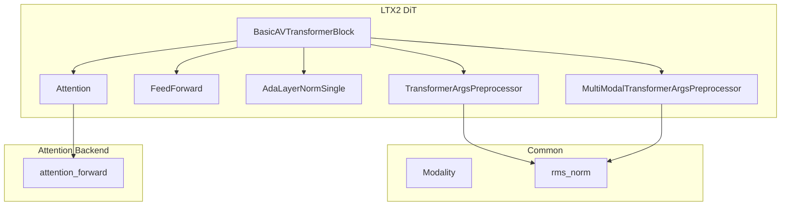
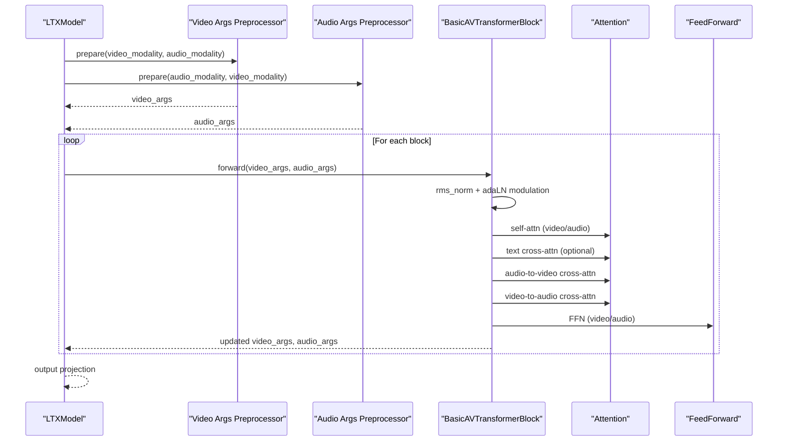
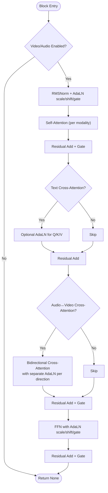
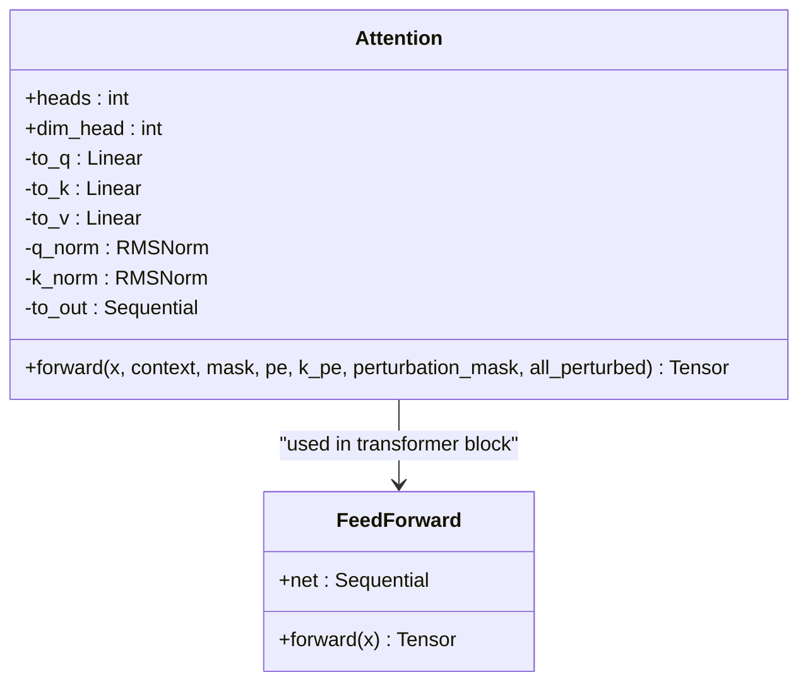
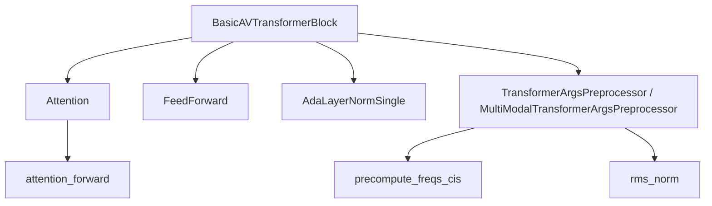

# Multimodal Transformer Blocks

<cite>
**Referenced Files in This Document**
- [ltx2_dit.py](file://diffsynth/models/ltx2_dit.py)
- [ltx2_common.py](file://diffsynth/models/ltx2_common.py)
- [attention.py](file://diffsynth/core/attention/attention.py)
</cite>

## Table of Contents
1. [Introduction](#introduction)
2. [Project Structure](#project-structure)
3. [Core Components](#core-components)
4. [Architecture Overview](#architecture-overview)
5. [Detailed Component Analysis](#detailed-component-analysis)
6. [Dependency Analysis](#dependency-analysis)
7. [Performance Considerations](#performance-considerations)
8. [Troubleshooting Guide](#troubleshooting-guide)
9. [Conclusion](#conclusion)

## Introduction
This document explains the multimodal transformer blocks used by LTX2 DiT for joint audio–video processing. It focuses on how each transformer layer integrates video and audio streams via self-attention, cross-modal attention, and adaptive normalization. You will learn the block structure, layer normalization strategies, modality integration within layers, and how to configure different attention types. Data flow through the transformer blocks is illustrated with diagrams and step-by-step explanations.

## Project Structure
The multimodal transformer blocks are implemented primarily in:
- diffsynth/models/ltx2_dit.py: Core transformer blocks, attention modules, preprocessing, and model orchestration.
- diffsynth/models/ltx2_common.py: Shared data structures (e.g., Modality), normalization utilities, and shape helpers.
- diffsynth/core/attention/attention.py: Attention backend selection and efficient implementations.

**Diagram sources**
- [ltx2_dit.py:875-1220](file://diffsynth/models/ltx2_dit.py#L875-L1220)
- [ltx2_dit.py:465-554](file://diffsynth/models/ltx2_dit.py#L465-L554)
- [ltx2_dit.py:1254-1264](file://diffsynth/models/ltx2_dit.py#L1254-L1264)
- [ltx2_dit.py:239-266](file://diffsynth/models/ltx2_dit.py#L239-L266)
- [ltx2_dit.py:599-754](file://diffsynth/models/ltx2_dit.py#L599-L754)
- [ltx2_dit.py:756-863](file://diffsynth/models/ltx2_dit.py#L756-L863)
- [ltx2_common.py:240-246](file://diffsynth/models/ltx2_common.py#L240-L246)
- [attention.py:108-122](file://diffsynth/core/attention/attention.py#L108-L122)

**Section sources**
- [ltx2_dit.py:875-1220](file://diffsynth/models/ltx2_dit.py#L875-L1220)
- [ltx2_common.py:240-246](file://diffsynth/models/ltx2_common.py#L240-L246)
- [attention.py:108-122](file://diffsynth/core/attention/attention.py#L108-L122)

## Core Components
- BasicAVTransformerBlock: The core multimodal transformer block that processes both video and audio tokens, performs self-attention per modality, text cross-attention, and bidirectional audio–video cross-attention.
- Attention: Multi-head attention with optional rotary positional embeddings and per-head gating; delegates to an efficient backend via attention_forward.
- FeedForward: MLP with a GELU approximation and projection.
- AdaLayerNormSingle: Adaptive layer norm conditioned on timestep embeddings; supports extra coefficients when cross-attention AdaLN is enabled.
- TransformerArgsPreprocessor and MultiModalTransformerArgsPreprocessor: Prepare inputs (patchify, timestep embedding, positional embeddings, masks) for single-modality or multimodal transformer blocks.
- Modality: Dataclass bundling latent tokens, timesteps, positions, context, and masks for a given modality.

Key responsibilities:
- Normalize inputs using RMS normalization before attention and FFN.
- Apply adaptive modulation (scale/shift/gate) based on timestep embeddings.
- Compute self-attention within each modality.
- Integrate text conditioning via cross-attention.
- Enable cross-modal interactions via audio-to-video and video-to-audio attention.
- Support perturbation-based ablation of specific attention paths.

**Section sources**
- [ltx2_dit.py:875-1220](file://diffsynth/models/ltx2_dit.py#L875-L1220)
- [ltx2_dit.py:465-554](file://diffsynth/models/ltx2_dit.py#L465-L554)
- [ltx2_dit.py:1254-1264](file://diffsynth/models/ltx2_dit.py#L1254-L1264)
- [ltx2_dit.py:239-266](file://diffsynth/models/ltx2_dit.py#L239-L266)
- [ltx2_dit.py:599-754](file://diffsynth/models/ltx2_dit.py#L599-L754)
- [ltx2_dit.py:756-863](file://diffsynth/models/ltx2_dit.py#L756-L863)
- [ltx2_common.py:249-283](file://diffsynth/models/ltx2_common.py#L249-L283)

## Architecture Overview
At a high level, LTX2 DiT stacks multiple BasicAVTransformerBlock layers. Each block takes two TransformerArgs (one for video, one for audio), applies intra-modality self-attention, optional text cross-attention, then bidirectional audio–video cross-attention, followed by modality-specific feed-forward networks. Outputs are returned as updated TransformerArgs.

**Diagram sources**
- [ltx2_dit.py:1625-1684](file://diffsynth/models/ltx2_dit.py#L1625-L1684)
- [ltx2_dit.py:1582-1603](file://diffsynth/models/ltx2_dit.py#L1582-L1603)
- [ltx2_dit.py:875-1220](file://diffsynth/models/ltx2_dit.py#L875-L1220)
- [ltx2_dit.py:465-554](file://diffsynth/models/ltx2_dit.py#L465-L554)
- [ltx2_dit.py:1254-1264](file://diffsynth/models/ltx2_dit.py#L1254-L1264)

## Detailed Component Analysis

### BasicAVTransformerBlock
Responsibilities:
- Intra-modality self-attention for video and audio.
- Text cross-attention with optional AdaLN modulation.
- Bidirectional audio–video cross-attention with separate AdaLN parameters per direction.
- Modality-specific feed-forward networks with AdaLN modulation.
- Perturbation-aware masking to skip certain attention paths during ablation.

Normalization strategy:
- RMS normalization is applied before each attention and FFN sublayer.
- AdaLN produces scale/shift/gate vectors from timestep embeddings; these modulate normalized activations.

Cross-modal interaction:
- Audio-to-video attention uses video tokens as queries and audio tokens as keys/values.
- Video-to-audio attention uses audio tokens as queries and video tokens as keys/values.
- Separate AdaLN parameters control scaling/shifting/gating for each cross-attention direction.

Data flow:
- Inputs: video_args.x and audio_args.x (patchified latents).
- Self-attention updates x with residual connections and gating.
- Cross-attention updates x with residual connections and gating.
- FFN updates x with residual connections and gating.
- Outputs: updated video_args.x and audio_args.x.

**Diagram sources**
- [ltx2_dit.py:1031-1220](file://diffsynth/models/ltx2_dit.py#L1031-L1220)

**Section sources**
- [ltx2_dit.py:875-1220](file://diffsynth/models/ltx2_dit.py#L875-L1220)

### Attention Module
Features:
- Multi-head attention with RMS normalization on Q and K.
- Rotary positional embeddings support (interleaved or split modes).
- Optional per-head gating for attention outputs.
- Delegates computation to an efficient backend via attention_forward.

Data flow:
- Input x (and optional context) projected to Q, K, V.
- Apply rotary embeddings if provided.
- Reshape to heads and compute attention via backend.
- Flatten heads back to sequence dimension and project to output.

**Diagram sources**
- [ltx2_dit.py:465-554](file://diffsynth/models/ltx2_dit.py#L465-L554)
- [ltx2_dit.py:1254-1264](file://diffsynth/models/ltx2_dit.py#L1254-L1264)

**Section sources**
- [ltx2_dit.py:465-554](file://diffsynth/models/ltx2_dit.py#L465-L554)
- [attention.py:108-122](file://diffsynth/core/attention/attention.py#L108-L122)

### AdaLayerNormSingle and Timestep Embeddings
Purpose:
- Generate adaptive scale/shift/gate parameters from timestep embeddings.
- Supports additional coefficients when cross-attention AdaLN is enabled.

Behavior:
- Timestep embeddings are computed via combined sinusoidal/timestep projection.
- Linear projection maps embedded timestep to multiple coefficient channels.
- Coefficients are sliced into scale/shift/gate for different sublayers.

**Section sources**
- [ltx2_dit.py:239-266](file://diffsynth/models/ltx2_dit.py#L239-L266)
- [ltx2_dit.py:107-152](file://diffsynth/models/ltx2_dit.py#L107-L152)

### TransformerArgsPreprocessor and MultiModalTransformerArgsPreprocessor
Responsibilities:
- Patchify input latents and project to transformer dimension.
- Compute timestep embeddings and optional prompt timestep embeddings.
- Prepare positional embeddings (ROPE frequencies) for self-attention.
- Convert attention masks to additive log-space bias where needed.
- For multimodal mode, generate cross-attention timestep embeddings and cross positional embeddings.

Multimodal specifics:
- Cross-attention timestep embeddings are scaled differently for audio–video cross attention.
- Cross positional embeddings use a 1D grid for audio tokens aligned with video temporal axis.

**Section sources**
- [ltx2_dit.py:599-754](file://diffsynth/models/ltx2_dit.py#L599-L754)
- [ltx2_dit.py:756-863](file://diffsynth/models/ltx2_dit.py#L756-L863)

### Modality Data Structure
Definition:
- Bundles latent tokens, sigma (timestep), timesteps, positions, context, masks, and enable flag.
- Used to pass structured inputs to preprocessors and transformer blocks.

**Section sources**
- [ltx2_common.py:249-283](file://diffsynth/models/ltx2_common.py#L249-L283)

## Dependency Analysis
The multimodal transformer blocks depend on:
- Attention backend selection and efficient implementations.
- Shared normalization utilities (RMS norm).
- Positional embedding generation (ROPE).
- Timestep embedding modules.

**Diagram sources**
- [ltx2_dit.py:875-1220](file://diffsynth/models/ltx2_dit.py#L875-L1220)
- [ltx2_dit.py:465-554](file://diffsynth/models/ltx2_dit.py#L465-L554)
- [ltx2_dit.py:1254-1264](file://diffsynth/models/ltx2_dit.py#L1254-L1264)
- [ltx2_dit.py:239-266](file://diffsynth/models/ltx2_dit.py#L239-L266)
- [ltx2_dit.py:599-754](file://diffsynth/models/ltx2_dit.py#L599-L754)
- [ltx2_dit.py:756-863](file://diffsynth/models/ltx2_dit.py#L756-L863)
- [attention.py:108-122](file://diffsynth/core/attention/attention.py#L108-L122)
- [ltx2_common.py:240-246](file://diffsynth/models/ltx2_common.py#L240-L246)

**Section sources**
- [ltx2_dit.py:875-1220](file://diffsynth/models/ltx2_dit.py#L875-L1220)
- [attention.py:108-122](file://diffsynth/core/attention/attention.py#L108-L122)
- [ltx2_common.py:240-246](file://diffsynth/models/ltx2_common.py#L240-L246)

## Performance Considerations
- Attention backend selection: The code automatically chooses the fastest available implementation (FlashAttention v3/v2, SageAttention, xFormers, or PyTorch SDPA). Masks force fallback to compatible backends.
- Gradient checkpointing: Transformer blocks can be wrapped with gradient checkpointing to reduce memory usage at the cost of slower training.
- ROPE precision: Double-precision ROPE generation can improve numerical stability but may increase compute.
- Perturbation masks: Selectively skipping attention paths reduces compute for ablation experiments.

[No sources needed since this section provides general guidance]

## Troubleshooting Guide
Common issues and resolutions:
- Masked attention falls back to slower backend: Ensure attention masks are compatible or disable them for maximum speed.
- Insufficient VRAM: Enable gradient checkpointing and consider lower batch sizes or tiled inference.
- Shape mismatches in cross-attention: Verify batch sizes and tensor dimensions for video and audio modalities match expectations.
- Incorrect rope_type: Use INTERLEAVED or SPLIT consistently with configuration; mismatched settings can cause errors.

**Section sources**
- [attention.py:108-122](file://diffsynth/core/attention/attention.py#L108-L122)
- [ltx2_dit.py:1572-1581](file://diffsynth/models/ltx2_dit.py#L1572-L1581)

## Conclusion
The LTX2 DiT multimodal transformer blocks integrate audio and video streams through carefully designed self-attention, text cross-attention, and bidirectional audio–video cross-attention. RMS normalization and adaptive layer normalization provide stable and flexible modulation across layers. The architecture supports efficient attention backends, configurable positional embeddings, and perturbation-based ablations. Understanding the block structure and data flow enables effective configuration and optimization for joint audio–video generation tasks.

[No sources needed since this section summarizes without analyzing specific files]