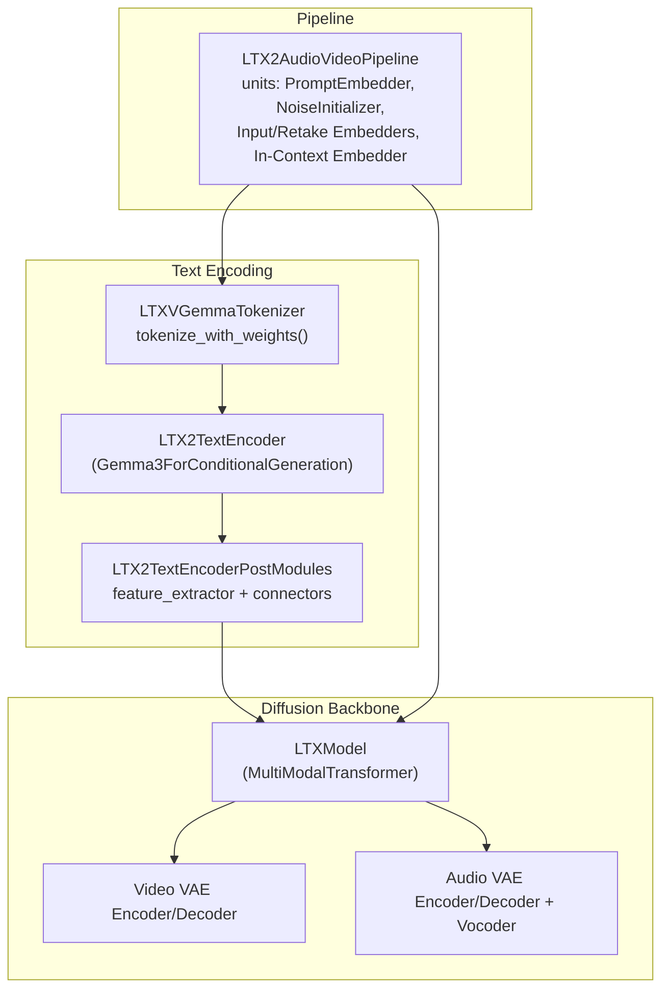
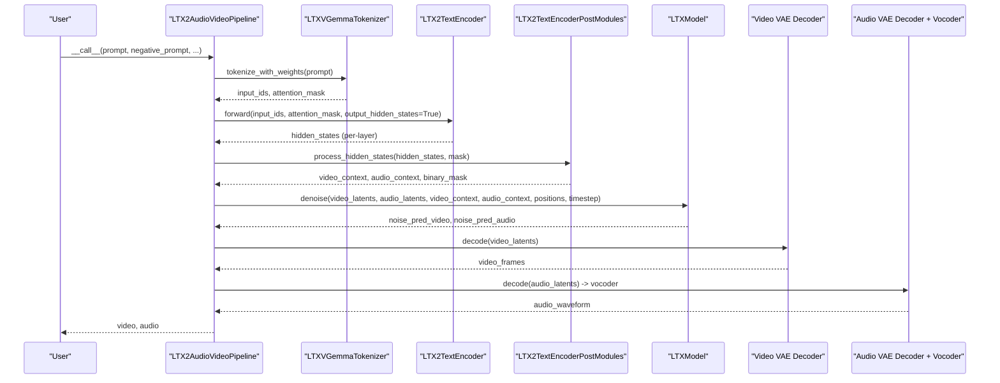
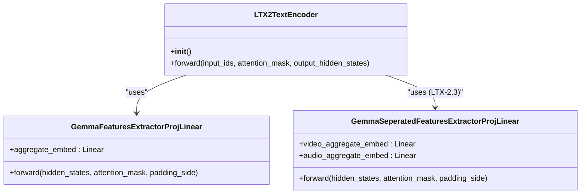
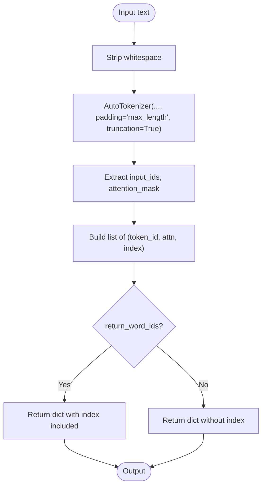
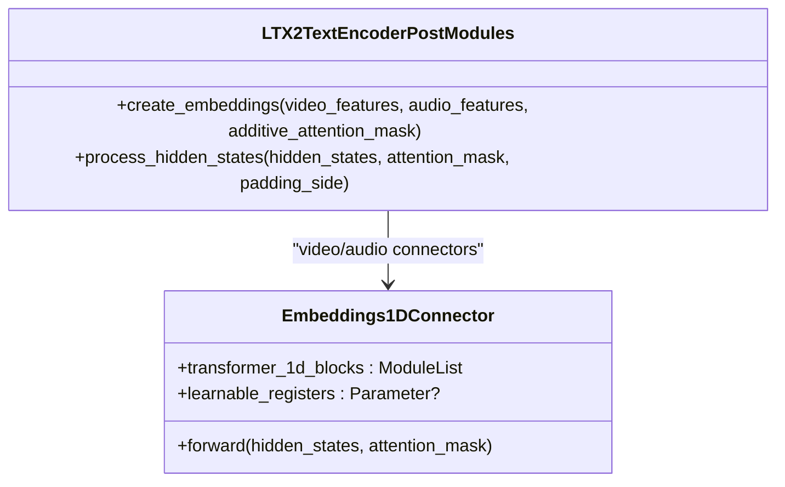
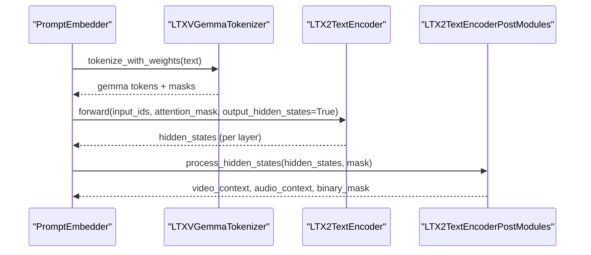
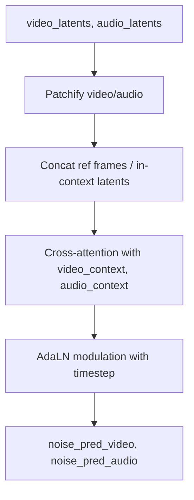
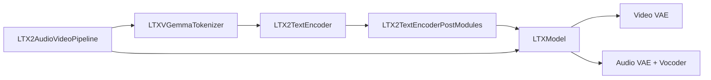

# Text Encoder Integration

<cite>
**Referenced Files in This Document**
- [ltx2_text_encoder.py](file://diffsynth/models/ltx2_text_encoder.py)
- [ltx2_audio_video.py](file://diffsynth/pipelines/ltx2_audio_video.py)
- [ltx2_dit.py](file://diffsynth/models/ltx2_dit.py)
- [ltx2_common.py](file://diffsynth/models/ltx2_common.py)
- [LTX-2.md](file://docs/en/Model_Details/LTX-2.md)
- [LTX-2.3-T2AV-OneStage.py](file://examples/ltx2/model_inference/LTX-2.3-T2AV-OneStage.py)
</cite>

## Table of Contents
1. [Introduction](#introduction)
2. [Project Structure](#project-structure)
3. [Core Components](#core-components)
4. [Architecture Overview](#architecture-overview)
5. [Detailed Component Analysis](#detailed-component-analysis)
6. [Dependency Analysis](#dependency-analysis)
7. [Performance Considerations](#performance-considerations)
8. [Troubleshooting Guide](#troubleshooting-guide)
9. [Conclusion](#conclusion)
10. [Appendices](#appendices)

## Introduction
This document explains the LTX2 text encoder integration that processes textual prompts for audio-video generation. It covers the transformer-based architecture, prompt embedding strategies, cross-modal conditioning mechanisms, and how textual information influences both video and audio modalities. It also documents the text preprocessing pipeline, tokenization strategies, configuration options for different text encoders, and practical examples of prompt engineering to achieve optimal results.

## Project Structure
The LTX2 text encoder is implemented as a Gemma-based model with specialized post-processing modules to produce separate video and audio contexts. The pipeline orchestrates text encoding, latent initialization, multi-modal conditioning, and denoising through a unified transformer backbone.

**Diagram sources**
- [ltx2_text_encoder.py:90-150](file://diffsynth/models/ltx2_text_encoder.py#L90-L150)
- [ltx2_text_encoder.py:406-464](file://diffsynth/models/ltx2_text_encoder.py#L406-L464)
- [ltx2_audio_video.py:298-328](file://diffsynth/pipelines/ltx2_audio_video.py#L298-L328)
- [ltx2_dit.py:1278-1641](file://diffsynth/models/ltx2_dit.py#L1278-L1641)

**Section sources**
- [ltx2_text_encoder.py:1-88](file://diffsynth/models/ltx2_text_encoder.py#L1-L88)
- [ltx2_audio_video.py:28-148](file://diffsynth/pipelines/ltx2_audio_video.py#L28-L148)
- [ltx2_dit.py:1278-1641](file://diffsynth/models/ltx2_dit.py#L1278-L1641)

## Core Components
- LTX2TextEncoder: A Gemma3-based conditional generation model configured for long sequences and multimodal tokens.
- LTXVGemmaTokenizer: Tokenizer wrapper ensuring left padding and consistent output format for downstream consumption.
- LTX2TextEncoderPostModules: Feature extractor and 1D connectors producing separate video and audio embeddings from Gemma hidden states.
- LTX2AudioVideoPipeline: Orchestrates text encoding, noise initialization, modality-specific conditioning, and diffusion steps.
- LTXModel: Multi-modal transformer backbone integrating video and audio latents with text context via cross-attention.

Key responsibilities:
- Text preprocessing and tokenization
- Hidden state aggregation across layers
- Modality-specific projection and positional encoding
- Cross-modal conditioning within the diffusion backbone

**Section sources**
- [ltx2_text_encoder.py:11-88](file://diffsynth/models/ltx2_text_encoder.py#L11-L88)
- [ltx2_text_encoder.py:90-150](file://diffsynth/models/ltx2_text_encoder.py#L90-L150)
- [ltx2_text_encoder.py:406-464](file://diffsynth/models/ltx2_text_encoder.py#L406-L464)
- [ltx2_audio_video.py:298-328](file://diffsynth/pipelines/ltx2_audio_video.py#L298-L328)
- [ltx2_dit.py:1278-1641](file://diffsynth/models/ltx2_dit.py#L1278-L1641)

## Architecture Overview
The LTX2 text encoder integrates with the diffusion pipeline to condition both video and audio generation. Prompts are tokenized, encoded by a Gemma3 transformer, then projected into separate video and audio contexts using learned connectors. These contexts are injected into the LTXModel via cross-attention during denoising.

**Diagram sources**
- [ltx2_audio_video.py:298-328](file://diffsynth/pipelines/ltx2_audio_video.py#L298-L328)
- [ltx2_audio_video.py:648-732](file://diffsynth/pipelines/ltx2_audio_video.py#L648-L732)
- [ltx2_text_encoder.py:406-464](file://diffsynth/models/ltx2_text_encoder.py#L406-L464)
- [ltx2_dit.py:1278-1641](file://diffsynth/models/ltx2_dit.py#L1278-L1641)

## Detailed Component Analysis

### LTX2TextEncoder (Gemma3-based)
- Extends Gemma3ForConditionalGeneration with a custom config optimized for long sequences and multimodal tokens.
- Uses sliding window and full attention patterns across layers, large vocab size, and extended position embeddings.
- Provides hidden states per layer for subsequent feature extraction.

**Diagram sources**
- [ltx2_text_encoder.py:11-88](file://diffsynth/models/ltx2_text_encoder.py#L11-L88)
- [ltx2_text_encoder.py:153-183](file://diffsynth/models/ltx2_text_encoder.py#L153-L183)
- [ltx2_text_encoder.py:185-217](file://diffsynth/models/ltx2_text_encoder.py#L185-L217)

**Section sources**
- [ltx2_text_encoder.py:11-88](file://diffsynth/models/ltx2_text_encoder.py#L11-L88)

### LTXVGemmaTokenizer
- Wraps AutoTokenizer with left padding and pad token fallback to eos.
- Returns structured tuples of (token_id, attention_mask), optionally including indices.
- Ensures compatibility with Gemma models and LTXV processing requirements.

**Diagram sources**
- [ltx2_text_encoder.py:90-150](file://diffsynth/models/ltx2_text_encoder.py#L90-L150)

**Section sources**
- [ltx2_text_encoder.py:90-150](file://diffsynth/models/ltx2_text_encoder.py#L90-L150)

### LTX2TextEncoderPostModules
- Aggregates per-layer hidden states with normalization and concatenation.
- Produces separate video and audio contexts via dedicated connectors.
- Supports two modes: shared features (LTX-2) and separated features (LTX-2.3).

**Diagram sources**
- [ltx2_text_encoder.py:406-464](file://diffsynth/models/ltx2_text_encoder.py#L406-L464)
- [ltx2_text_encoder.py:277-404](file://diffsynth/models/ltx2_text_encoder.py#L277-L404)

**Section sources**
- [ltx2_text_encoder.py:406-464](file://diffsynth/models/ltx2_text_encoder.py#L406-L464)
- [ltx2_text_encoder.py:277-404](file://diffsynth/models/ltx2_text_encoder.py#L277-L404)

### Prompt Embedding Pipeline Unit
- Converts prompt text to token IDs and masks.
- Calls text encoder with output_hidden_states=True.
- Processes hidden states to obtain video_context and audio_context.

**Diagram sources**
- [ltx2_audio_video.py:298-328](file://diffsynth/pipelines/ltx2_audio_video.py#L298-L328)
- [ltx2_text_encoder.py:406-464](file://diffsynth/models/ltx2_text_encoder.py#L406-L464)

**Section sources**
- [ltx2_audio_video.py:298-328](file://diffsynth/pipelines/ltx2_audio_video.py#L298-L328)

### Cross-Modal Conditioning in LTXModel
- Video and audio latents are patchified and combined with reference/in-context conditions.
- Text contexts are injected via cross-attention within transformer blocks.
- Timestep embeddings and adaptive modulation guide denoising.

**Diagram sources**
- [ltx2_audio_video.py:648-732](file://diffsynth/pipelines/ltx2_audio_video.py#L648-L732)
- [ltx2_dit.py:1278-1641](file://diffsynth/models/ltx2_dit.py#L1278-L1641)

**Section sources**
- [ltx2_audio_video.py:648-732](file://diffsynth/pipelines/ltx2_audio_video.py#L648-L732)
- [ltx2_dit.py:1278-1641](file://diffsynth/models/ltx2_dit.py#L1278-L1641)

## Dependency Analysis
- LTX2TextEncoder depends on Gemma3Config and transformers AutoTokenizer.
- LTX2TextEncoderPostModules uses 1D transformer blocks and RMSNorm utilities.
- Pipeline units orchestrate model loading and execution order.
- LTXModel integrates text contexts with video/audio latents via cross-attention.

**Diagram sources**
- [ltx2_text_encoder.py:11-88](file://diffsynth/models/ltx2_text_encoder.py#L11-L88)
- [ltx2_audio_video.py:298-328](file://diffsynth/pipelines/ltx2_audio_video.py#L298-L328)
- [ltx2_dit.py:1278-1641](file://diffsynth/models/ltx2_dit.py#L1278-L1641)

**Section sources**
- [ltx2_text_encoder.py:11-88](file://diffsynth/models/ltx2_text_encoder.py#L11-L88)
- [ltx2_audio_video.py:298-328](file://diffsynth/pipelines/ltx2_audio_video.py#L298-L328)
- [ltx2_dit.py:1278-1641](file://diffsynth/models/ltx2_dit.py#L1278-L1641)

## Performance Considerations
- Use bfloat16 precision for memory efficiency and speed.
- Enable VRAM management for dynamic loading/unloading of components.
- Prefer tiled inference for VAE decoding to reduce memory footprint.
- Adjust max_length in tokenizer to balance prompt length and performance.
- Two-stage pipelines can improve quality at higher resolutions but require additional memory.

[No sources needed since this section provides general guidance]

## Troubleshooting Guide
- If prompts are truncated or ignored, verify tokenizer max_length and ensure left padding is set.
- For mismatched shapes between video and audio latents, check frame rate and duration alignment.
- When CFG is disabled unexpectedly, confirm distilled pipeline settings override cfg_scale.
- Ensure stage2_lora_config is provided when using two-stage pipelines.

**Section sources**
- [ltx2_audio_video.py:252-273](file://diffsynth/pipelines/ltx2_audio_video.py#L252-L273)
- [ltx2_audio_video.py:591-613](file://diffsynth/pipelines/ltx2_audio_video.py#L591-L613)

## Conclusion
The LTX2 text encoder leverages a powerful Gemma3 transformer to extract rich textual representations, which are then projected into modality-specific contexts for video and audio generation. The pipeline ensures robust tokenization, efficient feature aggregation, and seamless cross-modal conditioning within a unified diffusion framework. Proper configuration of tokenizer parameters, pipeline stages, and VRAM management enables high-quality audio-video synthesis from textual prompts.

[No sources needed since this section summarizes without analyzing specific files]

## Appendices

### Prompt Engineering Examples
- Use descriptive, concise prompts focusing on key actions, subjects, and styles.
- Include temporal cues (e.g., “slowly,” “over time”) for motion control.
- Specify audio characteristics (e.g., “clear voice,” “background music”) for synchronized sound.
- Leverage negative prompts to suppress common artifacts and undesired content.

**Section sources**
- [LTX-2.md:94-114](file://docs/en/Model_Details/LTX-2.md#L94-L114)
- [LTX-2.3-T2AV-OneStage.py:39-40](file://examples/ltx2/model_inference/LTX-2.3-T2AV-OneStage.py#L39-L40)

### Configuration Options for Text Encoders
- Tokenizer max_length: Controls maximum sequence length for tokenization.
- Padding side: Left padding recommended for chat-style prompts.
- Model dtype: bfloat16 for balanced precision and memory usage.
- Two-stage vs one-stage: Two-stage improves resolution but requires more VRAM and LoRA configuration.

**Section sources**
- [ltx2_text_encoder.py:97-112](file://diffsynth/models/ltx2_text_encoder.py#L97-L112)
- [LTX-2.md:112-116](file://docs/en/Model_Details/LTX-2.md#L112-L116)