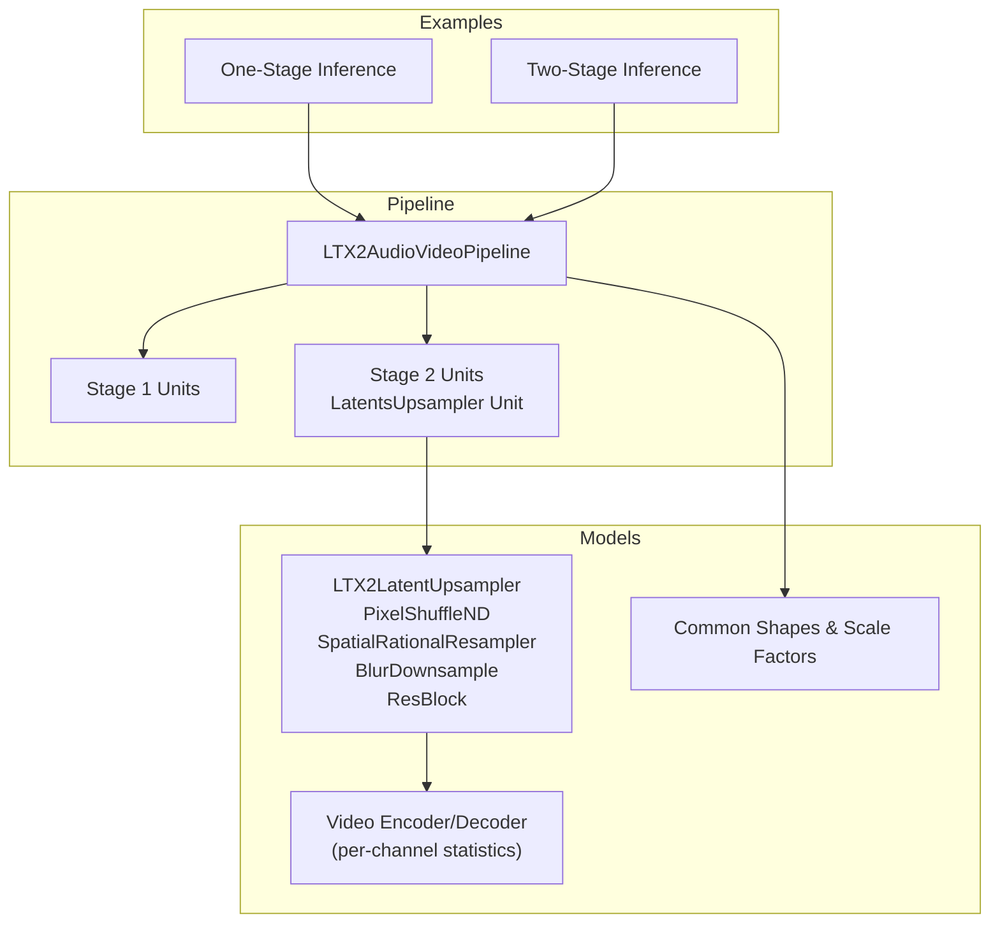
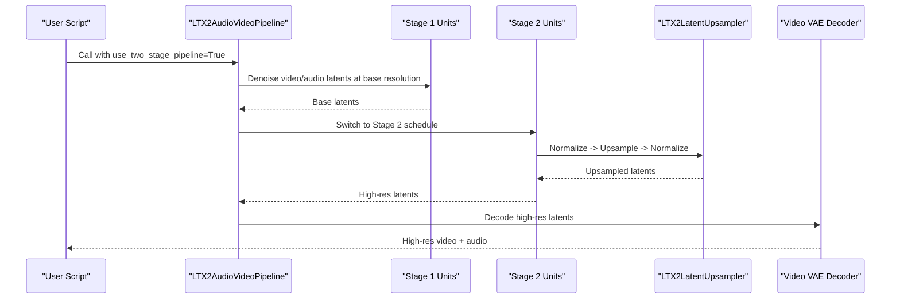
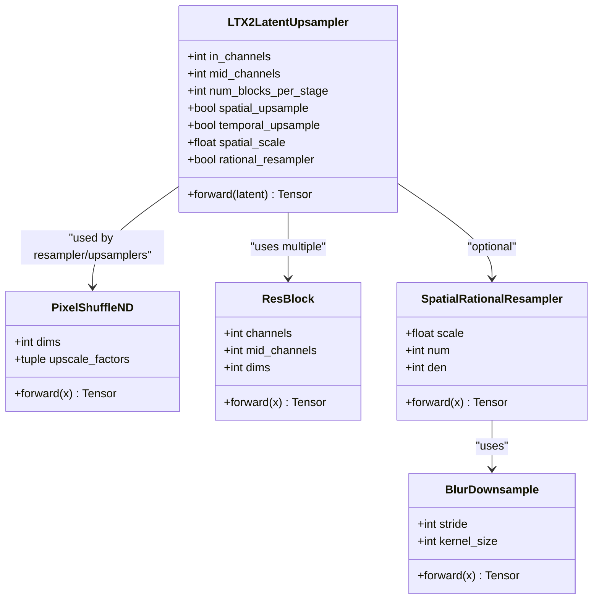
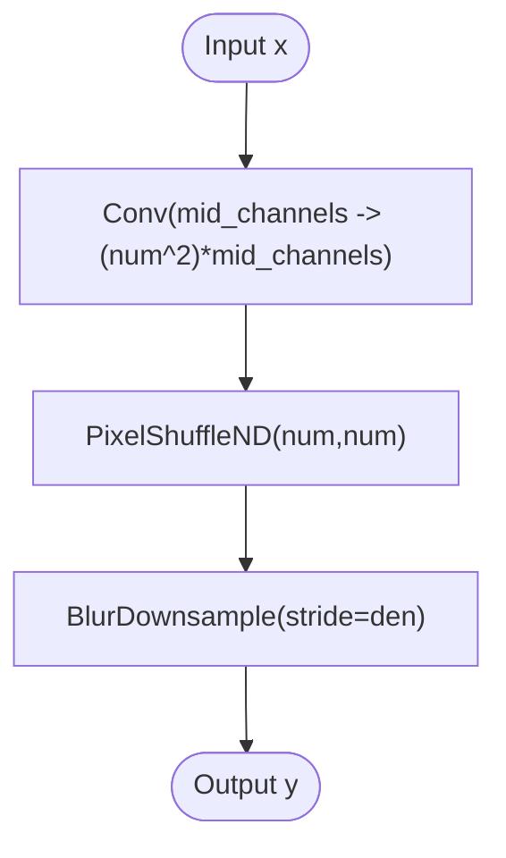
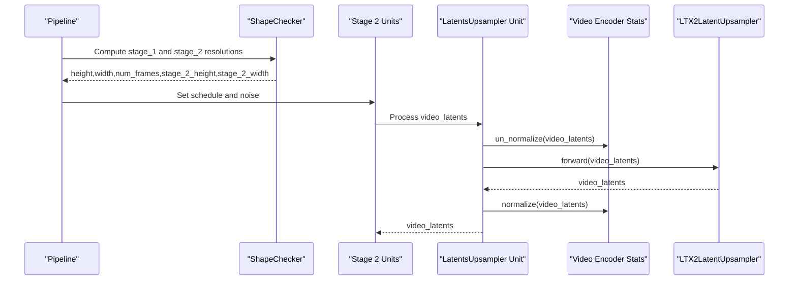
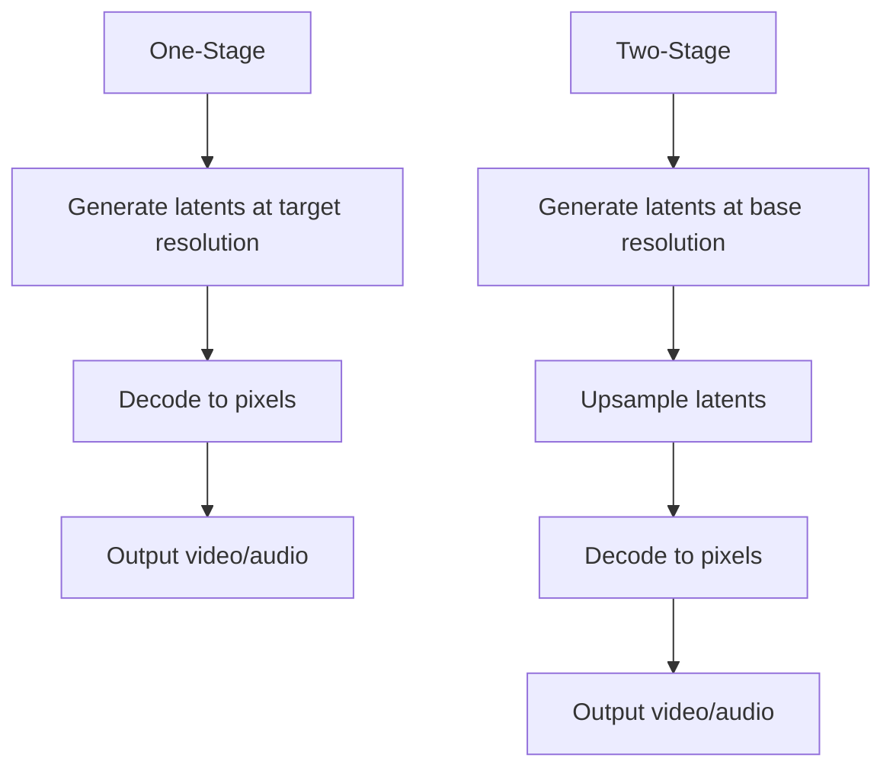
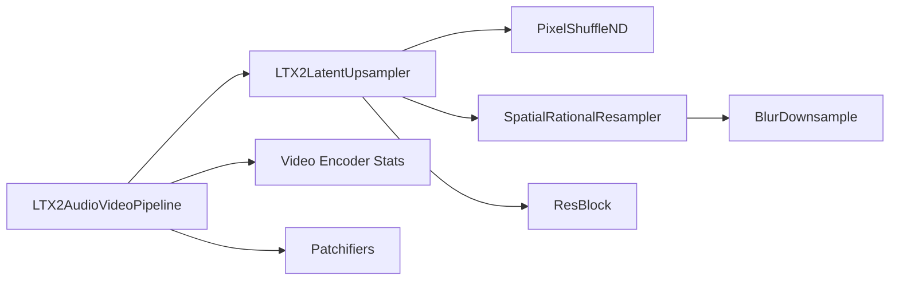

# Upsampling Module

<cite>
**Referenced Files in This Document**
- [ltx2_upsampler.py](file://diffsynth/models/ltx2_upsampler.py)
- [ltx2_audio_video.py](file://diffsynth/pipelines/ltx2_audio_video.py)
- [ltx2_common.py](file://diffsynth/models/ltx2_common.py)
- [LTX-2-T2AV-TwoStage.py](file://examples/ltx2/model_inference/LTX-2-T2AV-TwoStage.py)
- [LTX-2.3-T2AV-TwoStage.py](file://examples/ltx2/model_inference/LTX-2.3-T2AV-TwoStage.py)
- [LTX-2-T2AV-OneStage.py](file://examples/ltx2/model_inference/LTX-2-T2AV-OneStage.py)
- [LTX-2.md](file://docs/en/Model_Details/LTX-2.md)
</cite>

## Table of Contents
1. [Introduction](#introduction)
2. [Project Structure](#project-structure)
3. [Core Components](#core-components)
4. [Architecture Overview](#architecture-overview)
5. [Detailed Component Analysis](#detailed-component-analysis)
6. [Dependency Analysis](#dependency-analysis)
7. [Performance Considerations](#performance-considerations)
8. [Troubleshooting Guide](#troubleshooting-guide)
9. [Conclusion](#conclusion)
10. [Appendices](#appendices)

## Introduction
This document explains the LTX2 upsampling module that enhances resolution and quality of generated audio-video content. It covers super-resolution techniques, detail enhancement algorithms, integration points with the main generation pipeline, different upsampling strategies, quality vs speed trade-offs, configuration options for various output resolutions, example upscaling workflows, and performance optimization techniques for high-resolution outputs.

## Project Structure
The LTX2 upsampling functionality is implemented as a dedicated model component and integrated into the LTX2 audio-video pipeline through a two-stage workflow:
- Model implementation: spatial/temporal latent upsampler and supporting primitives
- Pipeline integration: stage selection, shape handling, normalization, and execution order
- Examples: one-stage (no upsampler) and two-stage (with upsampler) inference scripts
- Common utilities: scale factors and shapes used by VAE and patchifiers

**Diagram sources**
- [ltx2_upsampler.py:182-296](file://diffsynth/models/ltx2_upsampler.py#L182-L296)
- [ltx2_audio_video.py:28-78](file://diffsynth/pipelines/ltx2_audio_video.py#L28-L78)
- [ltx2_common.py:20-35](file://diffsynth/models/ltx2_common.py#L20-L35)

**Section sources**
- [ltx2_upsampler.py:1-314](file://diffsynth/models/ltx2_upsampler.py#L1-L314)
- [ltx2_audio_video.py:28-78](file://diffsynth/pipelines/ltx2_audio_video.py#L28-L78)
- [ltx2_common.py:20-35](file://diffsynth/models/ltx2_common.py#L20-L35)

## Core Components
- PixelShuffleND: N-dimensional pixel shuffle for temporal/spatial upsampling
- ResBlock: Convolutional residual block with group normalization and SiLU activation
- BlurDownsample: Anti-aliased integer-stride downsampling using a fixed binomial kernel
- SpatialRationalResampler: Learnable rational scaling via pixel shuffle + blur downsample
- LTX2LatentUpsampler: Configurable latent upsampler combining initial conv, res blocks, chosen upsampler, post-res blocks, and final conv
- upsample_video: Utility to normalize/un-normalize latents using per-channel statistics before/after upsampling

Key responsibilities:
- Provide flexible spatial and/or temporal upsampling in latent space
- Maintain numerical stability and anti-aliasing during resizing
- Integrate seamlessly with VAE normalization statistics

**Section sources**
- [ltx2_upsampler.py:8-58](file://diffsynth/models/ltx2_upsampler.py#L8-L58)
- [ltx2_upsampler.py:60-92](file://diffsynth/models/ltx2_upsampler.py#L60-L92)
- [ltx2_upsampler.py:94-140](file://diffsynth/models/ltx2_upsampler.py#L94-L140)
- [ltx2_upsampler.py:142-179](file://diffsynth/models/ltx2_upsampler.py#L142-L179)
- [ltx2_upsampler.py:182-296](file://diffsynth/models/ltx2_upsampler.py#L182-L296)
- [ltx2_upsampler.py:299-314](file://diffsynth/models/ltx2_upsampler.py#L299-L314)

## Architecture Overview
The LTX2 pipeline supports two modes:
- One-stage: Generate at target resolution directly without an explicit upsampler
- Two-stage: Generate at a lower resolution in Stage 1, then apply latent upsampling in Stage 2 before decoding

**Diagram sources**
- [ltx2_audio_video.py:168-249](file://diffsynth/pipelines/ltx2_audio_video.py#L168-L249)
- [ltx2_audio_video.py:591-646](file://diffsynth/pipelines/ltx2_audio_video.py#L591-L646)
- [ltx2_upsampler.py:299-314](file://diffsynth/models/ltx2_upsampler.py#L299-L314)

**Section sources**
- [ltx2_audio_video.py:168-249](file://diffsynth/pipelines/ltx2_audio_video.py#L168-L249)
- [ltx2_audio_video.py:591-646](file://diffsynth/pipelines/ltx2_audio_video.py#L591-L646)

## Detailed Component Analysis

### LTX2LatentUpsampler
Configurable latent upsampler that can perform:
- Spatial-only upsampling (via rational resampler or pixel shuffle)
- Temporal-only upsampling (pixel shuffle along time)
- Combined spatial+temporal upsampling (3D pixel shuffle)

Configuration parameters:
- in_channels: latent channels
- mid_channels: intermediate channel width
- num_blocks_per_stage: number of ResBlocks pre/post upsampling
- dims: 2D or 3D convolutions
- spatial_upsample: enable spatial upsampling
- temporal_upsample: enable temporal upsampling
- spatial_scale: supported values map to rational ratios
- rational_resampler: choose between learned rational resampler or classic pixel-shuffle path

**Diagram sources**
- [ltx2_upsampler.py:8-58](file://diffsynth/models/ltx2_upsampler.py#L8-L58)
- [ltx2_upsampler.py:60-92](file://diffsynth/models/ltx2_upsampler.py#L60-L92)
- [ltx2_upsampler.py:94-140](file://diffsynth/models/ltx2_upsampler.py#L94-L140)
- [ltx2_upsampler.py:142-179](file://diffsynth/models/ltx2_upsampler.py#L142-L179)
- [ltx2_upsampler.py:182-296](file://diffsynth/models/ltx2_upsampler.py#L182-L296)

**Section sources**
- [ltx2_upsampler.py:182-296](file://diffsynth/models/ltx2_upsampler.py#L182-L296)

### SpatialRationalResampler
Implements fully-learned rational scaling:
- Upsamples by factor num via pixel shuffle
- Anti-aliases by integer-stride downsampling with fixed binomial kernel
- Supported scales: 0.75, 1.5, 2.0, 4.0

**Diagram sources**
- [ltx2_upsampler.py:142-179](file://diffsynth/models/ltx2_upsampler.py#L142-L179)

**Section sources**
- [ltx2_upsampler.py:142-179](file://diffsynth/models/ltx2_upsampler.py#L142-L179)

### Integration with LTX2 Audio-Video Pipeline
- The pipeline defines two stages; Stage 2 includes a LatentsUpsampler unit
- Shape handling ensures divisibility constraints (e.g., multiples of 64 for two-stage)
- Normalization uses per-channel statistics from the video encoder before and after upsampling
- Optional LoRA loading for Stage 2 when not using distilled pipeline

**Diagram sources**
- [ltx2_audio_video.py:275-296](file://diffsynth/pipelines/ltx2_audio_video.py#L275-L296)
- [ltx2_audio_video.py:615-646](file://diffsynth/pipelines/ltx2_audio_video.py#L615-L646)
- [ltx2_upsampler.py:299-314](file://diffsynth/models/ltx2_upsampler.py#L299-L314)

**Section sources**
- [ltx2_audio_video.py:275-296](file://diffsynth/pipelines/ltx2_audio_video.py#L275-L296)
- [ltx2_audio_video.py:615-646](file://diffsynth/pipelines/ltx2_audio_video.py#L615-L646)

### Example Workflows
- One-stage: Direct generation at target resolution without upsampler
- Two-stage: Lower-resolution generation followed by latent upsampling and decoding

**Section sources**
- [LTX-2-T2AV-OneStage.py:1-66](file://examples/ltx2/model_inference/LTX-2-T2AV-OneStage.py#L1-L66)
- [LTX-2-T2AV-TwoStage.py:1-84](file://examples/ltx2/model_inference/LTX-2-T2AV-TwoStage.py#L1-L84)
- [LTX-2.3-T2AV-TwoStage.py:1-58](file://examples/ltx2/model_inference/LTX-2.3-T2AV-TwoStage.py#L1-L58)

## Dependency Analysis
- LTX2LatentUpsampler depends on:
  - PixelShuffleND for tensor rearrangement-based upsampling
  - SpatialRationalResampler for learned rational scaling
  - BlurDownsample for anti-aliasing
  - ResBlock for feature refinement
- Pipeline dependencies:
  - Video encoder’s per_channel_statistics for normalization
  - Patchifiers for coordinate mapping and tiling
  - Optional LoRA models for Stage 2

**Diagram sources**
- [ltx2_upsampler.py:182-296](file://diffsynth/models/ltx2_upsampler.py#L182-L296)
- [ltx2_audio_video.py:28-78](file://diffsynth/pipelines/ltx2_audio_video.py#L28-L78)

**Section sources**
- [ltx2_upsampler.py:182-296](file://diffsynth/models/ltx2_upsampler.py#L182-L296)
- [ltx2_audio_video.py:28-78](file://diffsynth/pipelines/ltx2_audio_video.py#L28-L78)

## Performance Considerations
- Resolution divisibility:
  - One-stage: height/width must be multiples of 32
  - Two-stage: height/width must be multiples of 64
- Tiling:
  - Enable tiled decoding to reduce VRAM usage with minor quality/time trade-offs
- Precision:
  - Use bfloat16 for computation to balance speed and memory
- Upsampling strategy:
  - Rational resampler provides learned scaling with anti-aliasing; classic pixel shuffle may be faster but less adaptive
- VRAM management:
  - Offload/onload strategies help run large models on limited GPU memory

[No sources needed since this section provides general guidance]

## Troubleshooting Guide
Common issues and resolutions:
- Missing upsampler in two-stage mode:
  - Ensure the upsampler model is loaded and provided in model_configs
- Incorrect resolution constraints:
  - For two-stage, ensure height/width are divisible by 64; for one-stage, divisible by 32
- No video latents before upsampling:
  - Verify Stage 1 completed successfully and produced video_latents
- VRAM errors:
  - Enable tiled decoding and VRAM management; reduce tile sizes if necessary

**Section sources**
- [ltx2_audio_video.py:252-273](file://diffsynth/pipelines/ltx2_audio_video.py#L252-L273)
- [ltx2_audio_video.py:275-296](file://diffsynth/pipelines/ltx2_audio_video.py#L275-L296)
- [ltx2_audio_video.py:629-646](file://diffsynth/pipelines/ltx2_audio_video.py#L629-L646)

## Conclusion
The LTX2 upsampling module provides flexible, efficient latent-space super-resolution for audio-video generation. By integrating with the two-stage pipeline, it enables high-quality high-resolution outputs while maintaining computational efficiency through tiling, precision control, and optimized upsampling strategies. Users can choose between one-stage simplicity and two-stage quality based on their requirements.

[No sources needed since this section summarizes without analyzing specific files]

## Appendices

### Configuration Options Summary
- LTX2LatentUpsampler parameters:
  - in_channels, mid_channels, num_blocks_per_stage, dims
  - spatial_upsample, temporal_upsample, spatial_scale, rational_resampler
- Pipeline parameters affecting upsampling:
  - use_two_stage_pipeline, stage2_spatial_upsample_factor
  - tiled, tile_size_in_pixels, tile_overlap_in_pixels, tile_size_in_frames, tile_overlap_in_frames
- Resolution constraints:
  - One-stage: multiples of 32
  - Two-stage: multiples of 64

**Section sources**
- [ltx2_upsampler.py:195-215](file://diffsynth/models/ltx2_upsampler.py#L195-L215)
- [ltx2_audio_video.py:275-296](file://diffsynth/pipelines/ltx2_audio_video.py#L275-L296)
- [LTX-2.md:103-114](file://docs/en/Model_Details/LTX-2.md#L103-L114)