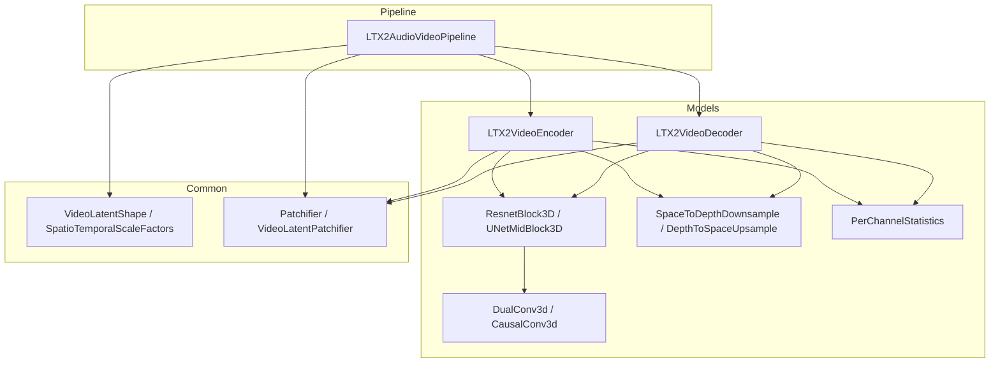
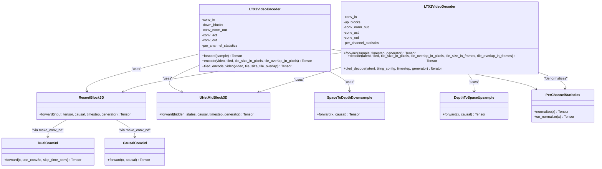
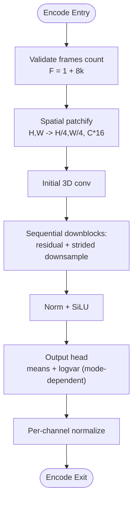
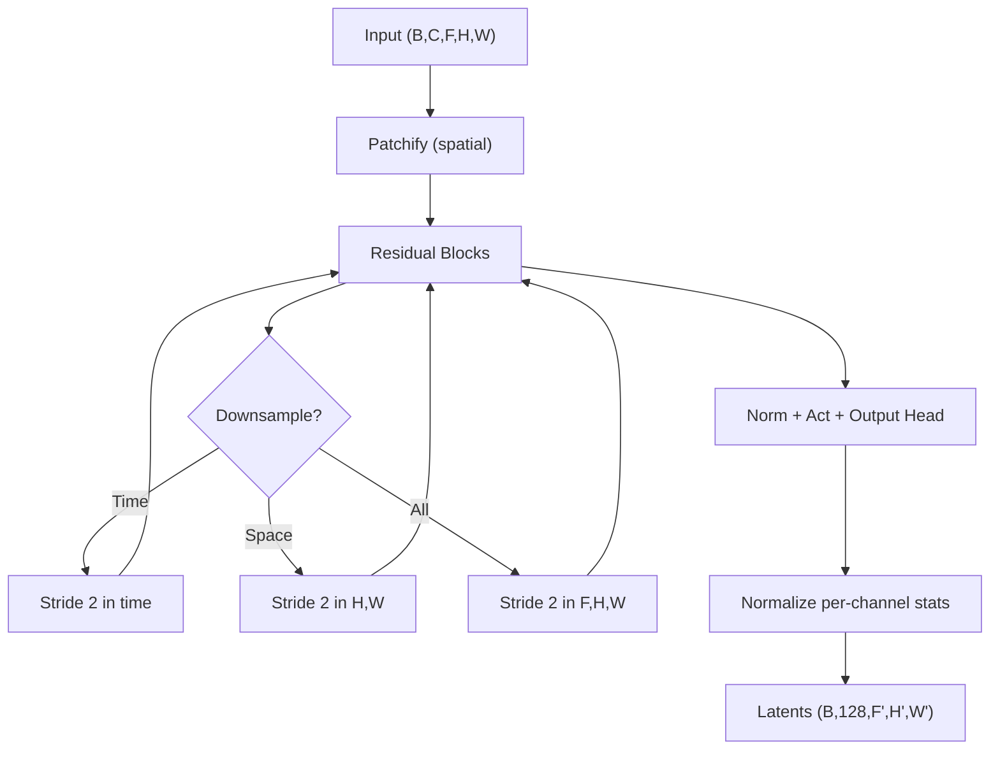
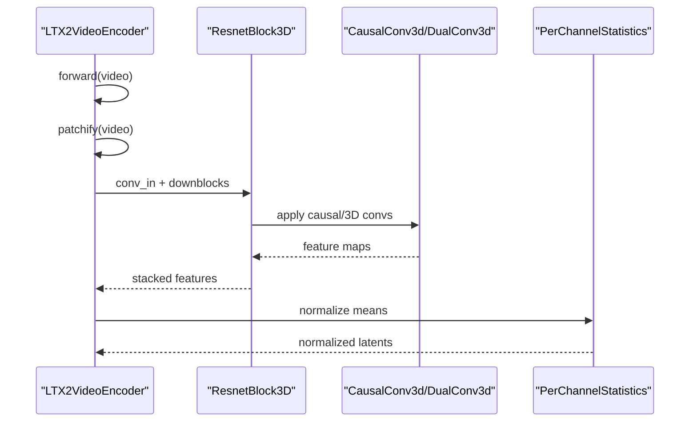
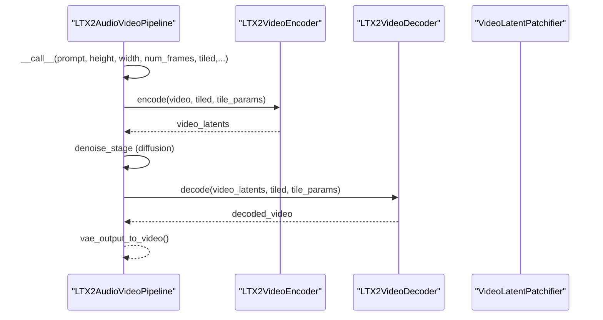
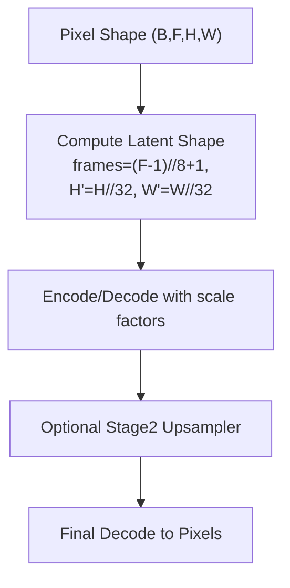
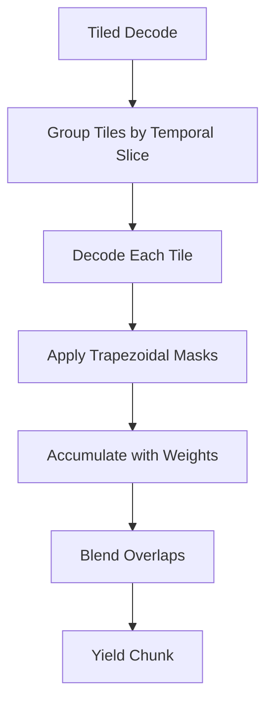
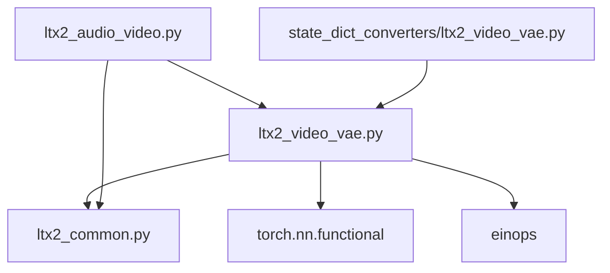

# Video VAE Implementation

<cite>
**Referenced Files in This Document**
- [ltx2_video_vae.py](file://diffsynth/models/ltx2_video_vae.py)
- [ltx2_common.py](file://diffsynth/models/ltx2_common.py)
- [ltx2_audio_video.py](file://diffsynth/pipelines/ltx2_audio_video.py)
- [ltx2_video_vae_converter.py](file://diffsynth/utils/state_dict_converters/ltx2_video_vae.py)
- [LTX-2.md](file://docs/en/Model_Details/LTX-2.md)
- [LTX-2-T2AV-OneStage.py](file://examples/ltx2/model_inference/LTX-2-T2AV-OneStage.py)
</cite>

## Table of Contents
1. [Introduction](#introduction)
2. [Project Structure](#project-structure)
3. [Core Components](#core-components)
4. [Architecture Overview](#architecture-overview)
5. [Detailed Component Analysis](#detailed-component-analysis)
6. [Dependency Analysis](#dependency-analysis)
7. [Performance Considerations](#performance-considerations)
8. [Troubleshooting Guide](#troubleshooting-guide)
9. [Conclusion](#conclusion)
10. [Appendices](#appendices)

## Introduction
This document provides a comprehensive technical guide to the LTX2 Video VAE optimized for video latent space operations. It explains the temporal-aware encoder-decoder architecture, compression strategies, frame interpolation and motion preservation techniques, integration with the LTX2 audio-video pipeline, resolution scaling support, and temporal consistency features. It also includes practical workflows for encoding/decoding videos, memory optimization strategies for long videos, and quality trade-offs between compression and fidelity.

## Project Structure
The LTX2 Video VAE is implemented as a pair of modules (encoder and decoder) with shared utilities for shapes, normalization, patching, and tiling. The pipeline integrates these components into an end-to-end generation workflow that supports image-, text-, and audio-conditioned video synthesis.

**Diagram sources**
- [ltx2_video_vae.py:1294-1492](file://diffsynth/models/ltx2_video_vae.py#L1294-L1492)
- [ltx2_video_vae.py:1752-1988](file://diffsynth/models/ltx2_video_vae.py#L1752-L1988)
- [ltx2_video_vae.py:181-351](file://diffsynth/models/ltx2_video_vae.py#L181-L351)
- [ltx2_video_vae.py:357-406](file://diffsynth/models/ltx2_video_vae.py#L357-L406)
- [ltx2_video_vae.py:825-939](file://diffsynth/models/ltx2_video_vae.py#L825-L939)
- [ltx2_video_vae.py:548-566](file://diffsynth/models/ltx2_video_vae.py#L548-L566)
- [ltx2_common.py:8-93](file://diffsynth/models/ltx2_common.py#L8-L93)
- [ltx2_common.py:302-357](file://diffsynth/models/ltx2_common.py#L302-L357)
- [ltx2_audio_video.py:28-78](file://diffsynth/pipelines/ltx2_audio_video.py#L28-L78)

**Section sources**
- [ltx2_video_vae.py:1294-1492](file://diffsynth/models/ltx2_video_vae.py#L1294-L1492)
- [ltx2_video_vae.py:1752-1988](file://diffsynth/models/ltx2_video_vae.py#L1752-L1988)
- [ltx2_common.py:8-93](file://diffsynth/models/ltx2_common.py#L8-L93)
- [ltx2_audio_video.py:28-78](file://diffsynth/pipelines/ltx2_audio_video.py#L28-L78)

## Core Components
- LTX2VideoEncoder: Encodes video frames into normalized latents with configurable variance modeling and per-channel statistics.
- LTX2VideoDecoder: Decodes latents back to video frames with optional timestep conditioning and residual upsampling.
- ResnetBlock3D and UNetMidBlock3D: Temporal-aware residual blocks supporting causal convolutions and optional noise/timestep conditioning.
- DualConv3d and CausalConv3d: Efficient separable 3D convolutions and causal temporal padding for temporal consistency.
- SpaceToDepthDownsample and DepthToSpaceUpsample: Strided down/up-sampling with residual connections.
- PerChannelStatistics: Dataset-wide normalization/denormalization buffers for stable latent distributions.
- VideoLatentPatchifier and common shape utilities: Patching and coordinate mapping for consistent spatio-temporal handling.

Key behaviors:
- Temporal stride of 8 and spatial stride of 32 yield a total compression factor of 8x temporally and 32x spatially.
- Encoder supports multiple log-variance modes (per-channel, uniform, constant, none).
- Decoder supports optional timestep conditioning via scale-shift modulation and noise injection.

**Section sources**
- [ltx2_video_vae.py:1294-1492](file://diffsynth/models/ltx2_video_vae.py#L1294-L1492)
- [ltx2_video_vae.py:1752-1988](file://diffsynth/models/ltx2_video_vae.py#L1752-L1988)
- [ltx2_video_vae.py:548-566](file://diffsynth/models/ltx2_video_vae.py#L548-L566)
- [ltx2_common.py:20-35](file://diffsynth/models/ltx2_common.py#L20-L35)

## Architecture Overview
The LTX2 Video VAE follows a symmetric encoder-decoder design with explicit control over temporal and spatial compression. The encoder uses a sequence of residual blocks and strided downsamplers to compress both time and space. The decoder reverses this process using depth-to-space upsamplers and residual blocks, optionally conditioned on timestep embeddings.

**Diagram sources**
- [ltx2_video_vae.py:1294-1492](file://diffsynth/models/ltx2_video_vae.py#L1294-L1492)
- [ltx2_video_vae.py:1752-1988](file://diffsynth/models/ltx2_video_vae.py#L1752-L1988)
- [ltx2_video_vae.py:568-736](file://diffsynth/models/ltx2_video_vae.py#L568-L736)
- [ltx2_video_vae.py:738-823](file://diffsynth/models/ltx2_video_vae.py#L738-L823)
- [ltx2_video_vae.py:181-351](file://diffsynth/models/ltx2_video_vae.py#L181-L351)
- [ltx2_video_vae.py:357-406](file://diffsynth/models/ltx2_video_vae.py#L357-L406)
- [ltx2_video_vae.py:825-939](file://diffsynth/models/ltx2_video_vae.py#L825-L939)
- [ltx2_video_vae.py:548-566](file://diffsynth/models/ltx2_video_vae.py#L548-L566)

## Detailed Component Analysis

### Temporal-Aware Encoder-Decoder
- Encoder path:
  - Initial spatial patchify reduces H,W by patch_size and increases channels.
  - Downblocks alternate residual blocks with strided downsamplers (time/space/all).
  - Final normalization and output head produce means and log-variance depending on mode.
  - Per-channel statistics normalize outputs for stable training/inference.
- Decoder path:
  - Inverse operations: residual blocks interleaved with depth-to-space upsamplers.
  - Optional timestep conditioning modulates activations via learned scale/shift tables.
  - Final unpatchify restores pixel dimensions.

**Diagram sources**
- [ltx2_video_vae.py:1430-1492](file://diffsynth/models/ltx2_video_vae.py#L1430-L1492)

**Section sources**
- [ltx2_video_vae.py:1294-1492](file://diffsynth/models/ltx2_video_vae.py#L1294-L1492)
- [ltx2_video_vae.py:1752-1988](file://diffsynth/models/ltx2_video_vae.py#L1752-L1988)

### Video Compression Strategies
- Spatial compression:
  - Patchify at input and unpatchify at output trades spatial resolution for channel depth.
  - Strided convolutions and SpaceToDepthDownsample reduce H,W by factors of 2 or 4.
- Temporal compression:
  - Strided convolutions along time dimension (stride=2) and SpaceToDepthDownsample reduce frames by factor of 2 per stage.
  - Overall temporal factor is 8x; spatial factor is 32x.
- Variance modeling:
  - Supports per-channel, uniform, constant, or no log-variance output. Uniform mode expands single logvar across channels to match means.

**Diagram sources**
- [ltx2_video_vae.py:1188-1292](file://diffsynth/models/ltx2_video_vae.py#L1188-L1292)
- [ltx2_video_vae.py:1430-1492](file://diffsynth/models/ltx2_video_vae.py#L1430-L1492)

**Section sources**
- [ltx2_video_vae.py:1188-1292](file://diffsynth/models/ltx2_video_vae.py#L1188-L1292)
- [ltx2_video_vae.py:1430-1492](file://diffsynth/models/ltx2_video_vae.py#L1430-L1492)

### Frame Interpolation Capabilities and Motion Preservation
- Causal convolutions ensure each frame depends only on past/current frames during encoding/decoding, preserving temporal causality.
- Symmetric padding (non-causal mode) allows future frame dependencies, potentially improving reconstruction but breaking strict causality.
- Residual connections and multi-scale downsampling help preserve motion details across scales.
- Tiling with trapezoidal blending ensures smooth transitions across tiles, reducing artifacts at boundaries.

**Diagram sources**
- [ltx2_video_vae.py:357-406](file://diffsynth/models/ltx2_video_vae.py#L357-L406)
- [ltx2_video_vae.py:568-736](file://diffsynth/models/ltx2_video_vae.py#L568-L736)
- [ltx2_video_vae.py:1430-1492](file://diffsynth/models/ltx2_video_vae.py#L1430-L1492)

**Section sources**
- [ltx2_video_vae.py:357-406](file://diffsynth/models/ltx2_video_vae.py#L357-L406)
- [ltx2_video_vae.py:568-736](file://diffsynth/models/ltx2_video_vae.py#L568-L736)

### Integration with Video Pipelines
- The LTX2AudioVideoPipeline loads and orchestrates the video VAE encoder/decoder alongside text encoders, diffusion transformer, and audio components.
- Shape checks enforce divisibility constraints (height/width divisible by 32 or 64 depending on pipeline stage).
- Tiling parameters are passed through to VAE encode/decode methods for memory-efficient processing.
- Latent coordinates and positions are computed using VideoLatentPatchifier and get_pixel_coords for consistent spatio-temporal alignment.

**Diagram sources**
- [ltx2_audio_video.py:168-249](file://diffsynth/pipelines/ltx2_audio_video.py#L168-L249)
- [ltx2_audio_video.py:363-378](file://diffsynth/pipelines/ltx2_audio_video.py#L363-L378)
- [ltx2_audio_video.py:2182-2206](file://diffsynth/models/ltx2_video_vae.py#L2182-L2206)

**Section sources**
- [ltx2_audio_video.py:168-249](file://diffsynth/pipelines/ltx2_audio_video.py#L168-L249)
- [ltx2_audio_video.py:363-378](file://diffsynth/pipelines/ltx2_audio_video.py#L363-L378)

### Resolution Scaling Support
- Default spatiotemporal scale factors: time=8, height=32, width=32.
- VideoLatentShape.from_pixel_shape computes latent dimensions from pixel dimensions using these factors.
- Upscaling in two-stage pipelines uses a separate latent upsampler before final decoding.

**Diagram sources**
- [ltx2_common.py:69-93](file://diffsynth/models/ltx2_common.py#L69-L93)
- [ltx2_audio_video.py:629-646](file://diffsynth/pipelines/ltx2_audio_video.py#L629-L646)

**Section sources**
- [ltx2_common.py:69-93](file://diffsynth/models/ltx2_common.py#L69-L93)
- [ltx2_audio_video.py:629-646](file://diffsynth/pipelines/ltx2_audio_video.py#L629-L646)

### Temporal Consistency Features
- Causal padding ensures no future frame leakage during convolutional operations.
- Trapezoidal blending masks across tiles prevent seams in overlapping regions.
- First-frame removal after temporal upsampling maintains consistent output shape regardless of causal mode.

**Diagram sources**
- [ltx2_video_vae.py:2022-2111](file://diffsynth/models/ltx2_video_vae.py#L2022-L2111)
- [ltx2_video_vae.py:941-978](file://diffsynth/models/ltx2_video_vae.py#L941-L978)

**Section sources**
- [ltx2_video_vae.py:2022-2111](file://diffsynth/models/ltx2_video_vae.py#L2022-L2111)
- [ltx2_video_vae.py:941-978](file://diffsynth/models/ltx2_video_vae.py#L941-L978)

## Dependency Analysis
The LTX2 Video VAE has clear internal dependencies and external integrations:

**Diagram sources**
- [ltx2_video_vae.py:1-13](file://diffsynth/models/ltx2_video_vae.py#L1-L13)
- [ltx2_audio_video.py:18-24](file://diffsynth/pipelines/ltx2_audio_video.py#L18-L24)
- [ltx2_video_vae_converter.py:1-25](file://diffsynth/utils/state_dict_converters/ltx2_video_vae.py#L1-L25)

**Section sources**
- [ltx2_video_vae.py:1-13](file://diffsynth/models/ltx2_video_vae.py#L1-L13)
- [ltx2_audio_video.py:18-24](file://diffsynth/pipelines/ltx2_audio_video.py#L18-L24)
- [ltx2_video_vae_converter.py:1-25](file://diffsynth/utils/state_dict_converters/ltx2_video_vae.py#L1-L25)

## Performance Considerations
- Memory efficiency:
  - Use tiled encoding/decoding for large videos to avoid OOM errors.
  - Adjust tile sizes and overlaps based on available VRAM.
- Computational efficiency:
  - DualConv3d separates spatial and temporal convolutions for faster computation.
  - Causal convolutions reduce temporal context requirements.
- Quality vs. speed trade-offs:
  - Non-causal mode may improve reconstruction quality but breaks temporal causality.
  - Larger tile sizes reduce overhead but increase memory usage.
  - Fewer inference steps speed up generation but may reduce fidelity.

[No sources needed since this section provides general guidance]

## Troubleshooting Guide
Common issues and solutions:
- Frame count validation:
  - Ensure input frames satisfy F = 1 + 8k constraint.
- Tile parameter validation:
  - Tile sizes must be divisible by VAE_SPATIAL_FACTOR (32).
  - Overlap must be less than tile size and divisible by 32.
- State dict conversion:
  - Use provided converters to handle different checkpoint formats.

**Section sources**
- [ltx2_video_vae.py:1439-1444](file://diffsynth/models/ltx2_video_vae.py#L1439-L1444)
- [ltx2_video_vae.py:1514-1521](file://diffsynth/models/ltx2_video_vae.py#L1514-L1521)
- [ltx2_video_vae_converter.py:1-25](file://diffsynth/utils/state_dict_converters/ltx2_video_vae.py#L1-L25)

## Conclusion
The LTX2 Video VAE provides a robust, efficient, and flexible framework for video latent space operations. Its temporal-aware architecture, combined with advanced tiling and normalization techniques, enables high-quality video generation while maintaining computational efficiency. The integration with the LTX2 pipeline supports various conditioning modalities and resolution scaling options, making it suitable for diverse applications in video synthesis and editing.

[No sources needed since this section summarizes without analyzing specific files]

## Appendices

### Example Workflows
- Basic encoding/decoding workflow:
  - Load pipeline with appropriate model configurations.
  - Call pipeline with desired parameters including tiled=True for memory efficiency.
  - Write output video/audio using provided utilities.

**Section sources**
- [LTX-2.md:21-57](file://docs/en/Model_Details/LTX-2.md#L21-L57)
- [LTX-2-T2AV-OneStage.py:24-66](file://examples/ltx2/model_inference/LTX-2-T2AV-OneStage.py#L24-L66)

### Memory Optimization Strategies
- Enable tiled encoding/decoding for long videos.
- Use appropriate tile sizes based on VRAM constraints.
- Leverage VRAM management features in the pipeline.
- Consider two-stage pipelines for higher resolutions.

**Section sources**
- [ltx2_audio_video.py:201-214](file://diffsynth/pipelines/ltx2_audio_video.py#L201-L214)
- [LTX-2.md:107-116](file://docs/en/Model_Details/LTX-2.md#L107-L116)

### Quality Trade-offs
- Compression ratio vs. fidelity:
  - Higher compression reduces memory but may lose fine details.
  - Lower compression preserves more detail but requires more resources.
- Causal vs. non-causal:
  - Causal ensures temporal consistency but may limit reconstruction quality.
  - Non-causal can improve quality but breaks causality.
- Tiling overlap:
  - Larger overlaps reduce boundary artifacts but increase computation.

[No sources needed since this section provides general guidance]