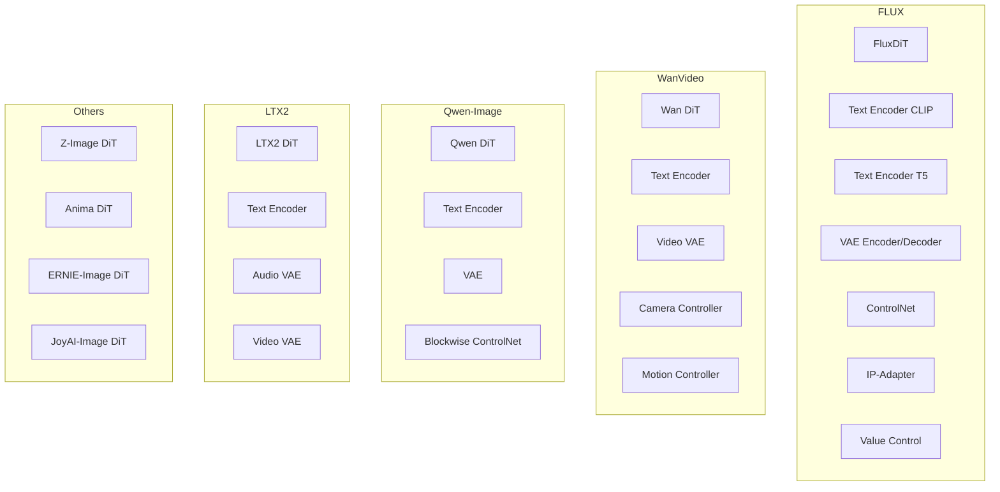
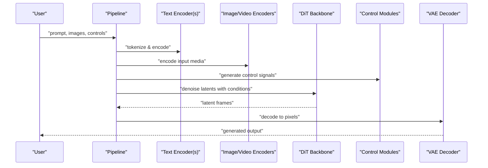
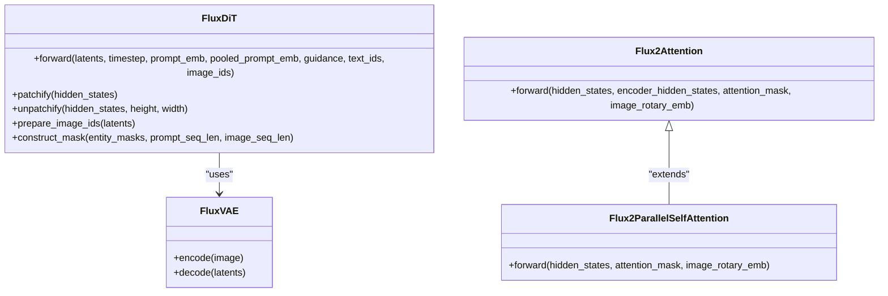
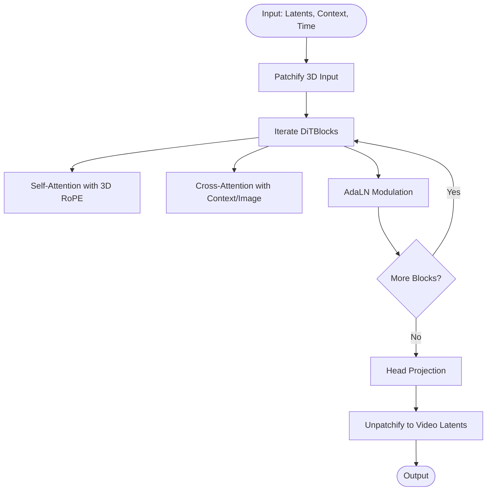
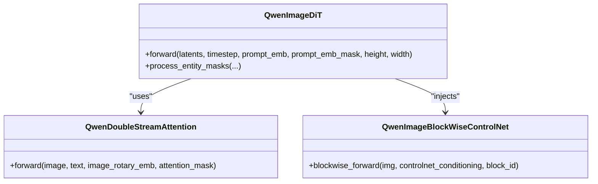
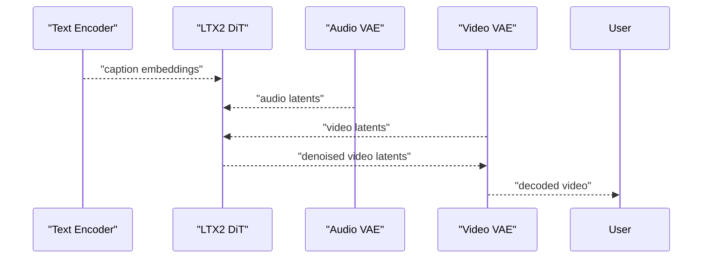
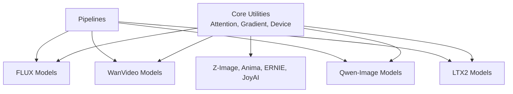

# Model Implementations

<cite>
**Referenced Files in This Document**
- [flux_dit.py](file://diffsynth/models/flux_dit.py)
- [flux2_dit.py](file://diffsynth/models/flux2_dit.py)
- [flux_vae.py](file://diffsynth/models/flux_vae.py)
- [flux_controlnet.py](file://diffsynth/models/flux_controlnet.py)
- [flux_text_encoder_clip.py](file://diffsynth/models/flux_text_encoder_clip.py)
- [flux_text_encoder_t5.py](file://diffsynth/models/flux_text_encoder_t5.py)
- [flux_value_control.py](file://diffsynth/models/flux_value_control.py)
- [flux_image.py](file://diffsynth/pipelines/flux_image.py)
- [wan_video_dit.py](file://diffsynth/models/wan_video_dit.py)
- [wan_video_camera_controller.py](file://diffsynth/models/wan_video_camera_controller.py)
- [wan_video_motion_controller.py](file://diffsynth/models/wan_video_motion_controller.py)
- [wan_video_text_encoder.py](file://diffsynth/models/wan_video_text_encoder.py)
- [wan_video_vae.py](file://diffsynth/models/wan_video_vae.py)
- [wan_video_animate_adapter.py](file://diffsynth/models/wan_video_animate_adapter.py)
- [wan_video_mot.py](file://diffsynth/models/wan_video_mot.py)
- [wan_video_vace.py](file://diffsynth/models/wan_video_vace.py)
- [wan_video_image_encoder.py](file://diffsynth/models/wan_video_image_encoder.py)
- [wan_video_dit_s2v.py](file://diffsynth/models/wan_video_dit_s2v.py)
- [qwen_image_dit.py](file://diffsynth/models/qwen_image_dit.py)
- [qwen_image_text_encoder.py](file://diffsynth/models/qwen_image_text_encoder.py)
- [qwen_image_vae.py](file://diffsynth/models/qwen_image_vae.py)
- [qwen_image_controlnet.py](file://diffsynth/models/qwen_image_controlnet.py)
- [ltx2_dit.py](file://diffsynth/models/ltx2_dit.py)
- [ltx2_audio_vae.py](file://diffsynth/models/ltx2_audio_vae.py)
- [ltx2_video_vae.py](file://diffsynth/models/ltx2_video_vae.py)
- [ltx2_text_encoder.py](file://diffsynth/models/ltx2_text_encoder.py)
- [ltx2_upsampler.py](file://diffsynth/models/ltx2_upsampler.py)
- [z_image_dit.py](file://diffsynth/models/z_image_dit.py)
- [z_image_text_encoder.py](file://diffsynth/models/z_image_text_encoder.py)
- [z_image_controlnet.py](file://diffsynth/models/z_image_controlnet.py)
- [anima_dit.py](file://diffsynth/models/anima_dit.py)
- [ernie_image_dit.py](file://diffsynth/models/ernie_image_dit.py)
- [ernie_image_text_encoder.py](file://diffsynth/models/ernie_image_text_encoder.py)
- [joyai_image_dit.py](file://diffsynth/models/joyai_image_dit.py)
- [joyai_image_text_encoder.py](file://diffsynth/models/joyai_image_text_encoder.py)
</cite>

## Table of Contents
1. Introduction
2. Project Structure
3. Core Components
4. Architecture Overview
5. Detailed Component Analysis
6. Dependency Analysis
7. Performance Considerations
8. Troubleshooting Guide
9. Conclusion

## Introduction
This document provides comprehensive documentation for all supported model implementations in ODTSR-edit, focusing on:
- FLUX.1 and FLUX.2 image models with text encoders, VAEs, and control mechanisms (ControlNet, IP-Adapter, value control).
- WanVideo video generation models including camera control and motion controllers.
- Qwen-Image models for image understanding and editing with ControlNet integration.
- LTX2 audio-video models with audio/video VAEs and DiT backbone.
- Z-Image, Anima, ERNIE-Image, and JoyAI-Image models.

For each model type, we explain architecture, supported features, configuration options, usage patterns, performance characteristics, and hardware requirements.

## Project Structure
The repository organizes models under diffsynth/models and pipelines under diffsynth/pipelines. Each model family typically includes:
- A DiT or transformer backbone
- Text/image encoders
- VAE encoder/decoder
- Optional control modules (ControlNet, adapters, motion/camera controllers)
- Pipeline orchestration that composes these components

**Diagram sources**
- [flux_dit.py:277-399](file://diffsynth/models/flux_dit.py#L277-L399)
- [flux2_dit.py:435-793](file://diffsynth/models/flux2_dit.py#L435-L793)
- [flux_vae.py:109-200](file://diffsynth/models/flux_vae.py#L109-L200)
- [wan_video_dit.py:338-552](file://diffsynth/models/wan_video_dit.py#L338-L552)
- [wan_video_camera_controller.py:8-60](file://diffsynth/models/wan_video_camera_controller.py#L8-L60)
- [qwen_image_dit.py:590-729](file://diffsynth/models/qwen_image_dit.py#L590-L729)
- [ltx2_dit.py:465-554](file://diffsynth/models/ltx2_dit.py#L465-L554)
- [z_image_dit.py:156-200](file://diffsynth/models/z_image_dit.py#L156-L200)
- [anima_dit.py:48-90](file://diffsynth/models/anima_dit.py#L48-L90)
- [ernie_image_dit.py:183-200](file://diffsynth/models/ernie_image_dit.py#L183-L200)
- [joyai_image_dit.py:90-109](file://diffsynth/models/joyai_image_dit.py#L90-L109)

**Section sources**
- [flux_image.py:57-177](file://diffsynth/pipelines/flux_image.py#L57-L177)

## Core Components
- FLUX.1/FLUX.2:
  - DiT backbones with joint/single-stream attention, RoPE embeddings, AdaLN modulation, and optional guidance embedders.
  - Text encoders: CLIP and T5 variants.
  - VAEs for latent encoding/decoding with tiled inference support.
  - Control mechanisms: ControlNet stacks, IP-Adapter cross-attention injection, value control encoders.
- WanVideo:
  - 3D DiT blocks with self/cross attention, 3D RoPE, time modulation, and optional image/context inputs.
  - Camera controller generating Plücker embeddings from camera poses; motion controller for temporal dynamics.
  - Text encoder and video VAE for conditioning and latent space modeling.
- Qwen-Image:
  - Double-stream DiT with separate image/text streams, 3D RoPE, and blockwise ControlNet for precise edits.
  - Text encoder and VAE for prompt and latent handling.
- LTX2:
  - Audio-video DiT with multimodal transformers, adaptive normalization, and spatio-temporal guidance perturbations.
  - Audio VAE (mel spectrogram patchifier), video VAE, and text encoder.
- Z-Image, Anima, ERNIE-Image, JoyAI-Image:
  - Specialized DiTs with RMSNorm/QK norms, SwiGLU feed-forward, and modality-specific positional embeddings.

**Section sources**
- [flux_dit.py:45-148](file://diffsynth/models/flux_dit.py#L45-L148)
- [flux2_dit.py:325-365](file://diffsynth/models/flux2_dit.py#L325-L365)
- [wan_video_dit.py:211-246](file://diffsynth/models/wan_video_dit.py#L211-L246)
- [qwen_image_dit.py:362-432](file://diffsynth/models/qwen_image_dit.py#L362-L432)
- [ltx2_dit.py:465-554](file://diffsynth/models/ltx2_dit.py#L465-L554)
- [z_image_dit.py:74-139](file://diffsynth/models/z_image_dit.py#L74-L139)
- [anima_dit.py:92-199](file://diffsynth/models/anima_dit.py#L92-L199)
- [ernie_image_dit.py:158-167](file://diffsynth/models/ernie_image_dit.py#L158-L167)
- [joyai_image_dit.py:123-159](file://diffsynth/models/joyai_image_dit.py#L123-L159)

## Architecture Overview
The system composes modular components into pipelines:
- Text/image tokenization and embedding
- Latent denoising via DiT backbones
- Conditioning through ControlNet/IP-Adapter/motion/camera controllers
- Reconstruction via VAE decoders

**Diagram sources**
- [flux_image.py:57-177](file://diffsynth/pipelines/flux_image.py#L57-L177)
- [wan_video_dit.py:510-552](file://diffsynth/models/wan_video_dit.py#L510-L552)
- [ltx2_dit.py:465-554](file://diffsynth/models/ltx2_dit.py#L465-L554)

## Detailed Component Analysis

### FLUX.1/FLUX.2 Models
- Architecture:
  - FluxDiT uses joint and single-stream transformer blocks with RoPE embeddings and AdaLN modulation.
  - Flux2 introduces parallel self-attention and fused QKV/MLP projections for efficiency.
- Text Encoders:
  - CLIP and T5 encoders provide textual context; pipeline orchestrates tokenizer selection and sequence length management.
- VAE:
  - Encoder/decoder with tiled inference to reduce memory footprint during large resolutions.
- Control Mechanisms:
  - ControlNet stacks produce residual maps injected into DiT layers.
  - IP-Adapter injects image-derived features via cross-attention.
  - Value control encoders modulate generation parameters.
- Configuration Options:
  - Guidance scale, timestep schedule, sequence lengths, tile sizes/strides, VRAM management flags.
- Usage Patterns:
  - Prompt-driven image generation, inpainting, style transfer, and multi-control composition.
- Performance Characteristics:
  - High resolution support with tiling; efficient attention backends (SDPA/Flash/Sage) when available.
  - VRAM optimization via gradient checkpointing and lazy loading.

**Diagram sources**
- [flux_dit.py:277-399](file://diffsynth/models/flux_dit.py#L277-L399)
- [flux2_dit.py:435-793](file://diffsynth/models/flux2_dit.py#L435-L793)
- [flux_vae.py:109-200](file://diffsynth/models/flux_vae.py#L109-L200)

**Section sources**
- [flux_dit.py:45-148](file://diffsynth/models/flux_dit.py#L45-L148)
- [flux2_dit.py:325-365](file://diffsynth/models/flux2_dit.py#L325-L365)
- [flux_vae.py:109-200](file://diffsynth/models/flux_vae.py#L109-L200)
- [flux_image.py:57-177](file://diffsynth/pipelines/flux_image.py#L57-L177)

### WanVideo Models
- Architecture:
  - 3D DiT blocks with self/cross attention, 3D RoPE, and time modulation; supports image/context inputs.
  - Optional music/audio injection and reference image/face conditioning via WanToDance modules.
- Camera Control:
  - Generates Plücker embeddings from camera poses; integrates via SimpleAdapter into DiT patches.
- Motion Controllers:
  - Temporal dynamics encoded via motion tokens and controllers; supports speed control and tracking.
- Text Encoder and Video VAE:
  - Text conditioning and latent space modeling for video sequences.
- Configuration Options:
  - Patch size, number of layers, heads, image input flags, control adapter enablement, dynamic FPS/unimodel toggles.
- Usage Patterns:
  - Text-to-video, image-to-video, controlled camera movements, and motion-guided generation.
- Performance Characteristics:
  - Efficient attention backends; gradient checkpointing; optional flash/sage attention for speed.

**Diagram sources**
- [wan_video_dit.py:211-246](file://diffsynth/models/wan_video_dit.py#L211-L246)
- [wan_video_dit.py:510-552](file://diffsynth/models/wan_video_dit.py#L510-L552)

**Section sources**
- [wan_video_dit.py:338-552](file://diffsynth/models/wan_video_dit.py#L338-L552)
- [wan_video_camera_controller.py:8-60](file://diffsynth/models/wan_video_camera_controller.py#L8-L60)

### Qwen-Image Models
- Architecture:
  - Double-stream DiT with separate image/text streams; 3D RoPE for spatial-temporal positioning.
  - Blockwise ControlNet enables localized edits by injecting per-block residuals.
- Text Encoder and VAE:
  - Text prompts encoded and integrated; VAE handles latent representations.
- Configuration Options:
  - Number of layers, RoPE scaling, additional timestep conditioning, mask-based entity control.
- Usage Patterns:
  - Image editing, inpainting, style transfer, and multi-condition control.
- Performance Characteristics:
  - Flash attention with FP8 option; cached RoPE frequencies for repeated shapes.

**Diagram sources**
- [qwen_image_dit.py:590-729](file://diffsynth/models/qwen_image_dit.py#L590-L729)
- [qwen_image_controlnet.py:29-57](file://diffsynth/models/qwen_image_controlnet.py#L29-L57)

**Section sources**
- [qwen_image_dit.py:362-432](file://diffsynth/models/qwen_image_dit.py#L362-L432)
- [qwen_image_controlnet.py:29-57](file://diffsynth/models/qwen_image_controlnet.py#L29-L57)

### LTX2 Audio-Video Models
- Architecture:
  - Multimodal DiT with adaptive normalization, spatio-temporal guidance perturbations, and interleaved/split RoPE.
  - Audio VAE converts waveforms to mel spectrograms and patches them; video VAE handles spatiotemporal latents.
- Text Encoder:
  - Caption projection and dropout for classifier-free guidance.
- Configuration Options:
  - Perturbation types/blocks, rope type (interleaved/split), timestep scaling, cross-modality settings.
- Usage Patterns:
  - Text-to-audio-video, image-to-audio-video, two-stage or distilled pipelines.
- Performance Characteristics:
  - Attention backends; gradient checkpointing; perturbation masks for controlled attention skipping.

**Diagram sources**
- [ltx2_dit.py:465-554](file://diffsynth/models/ltx2_dit.py#L465-L554)
- [ltx2_audio_vae.py:12-65](file://diffsynth/models/ltx2_audio_vae.py#L12-L65)

**Section sources**
- [ltx2_dit.py:465-554](file://diffsynth/models/ltx2_dit.py#L465-L554)
- [ltx2_audio_vae.py:12-65](file://diffsynth/models/ltx2_audio_vae.py#L12-L65)

### Z-Image Models
- Architecture:
  - DiT with RMSNorm/QK norms, SwiGLU feed-forward, and adaptive modulation.
  - Supports noise masking for mixed noisy/clean token selection.
- Configuration Options:
  - Layer count, head dimensions, modulation flags, noise mask handling.
- Usage Patterns:
  - Image generation/editing with flexible conditioning.
- Performance Characteristics:
  - Efficient attention; device-aware autocast for precision.

**Section sources**
- [z_image_dit.py:74-139](file://diffsynth/models/z_image_dit.py#L74-L139)

### Anima Models
- Architecture:
  - Video positional embeddings with learnable axes and 3D RoPE; supports FPS modulation and NTK extrapolation.
- Configuration Options:
  - Interpolation mode, head dimension, extrapolation ratios, FPS modulation toggle.
- Usage Patterns:
  - Video generation with temporal consistency and frame-rate awareness.

**Section sources**
- [anima_dit.py:92-199](file://diffsynth/models/anima_dit.py#L92-L199)

### ERNIE-Image Models
- Architecture:
  - Single-stream attention with RMSNorm/QK norm options; SwiGLU-like feed-forward; 3D positional embeddings.
- Configuration Options:
  - qk_norm type, dropout, bias settings, out dimensions.
- Usage Patterns:
  - Image generation/editing with robust normalization.

**Section sources**
- [ernie_image_dit.py:158-167](file://diffsynth/models/ernie_image_dit.py#L158-L167)

### JoyAI-Image Models
- Architecture:
  - Feed-forward with GELU approximations; PixArt-style text projection; timestep embeddings.
- Configuration Options:
  - Activation functions, dropout, final dropout, inner dimensions.
- Usage Patterns:
  - Image generation with caption conditioning.

**Section sources**
- [joyai_image_dit.py:123-159](file://diffsynth/models/joyai_image_dit.py#L123-L159)

## Dependency Analysis
- Model families share common core utilities:
  - Attention backends (SDPA, Flash, Sage)
  - Gradient checkpointing for memory efficiency
  - Device compatibility (NPU/GPU/CPU)
- Pipelines orchestrate component loading and VRAM management.

**Diagram sources**
- [flux_image.py:57-177](file://diffsynth/pipelines/flux_image.py#L57-L177)
- [wan_video_dit.py:1-28](file://diffsynth/models/wan_video_dit.py#L1-L28)
- [ltx2_dit.py:1-12](file://diffsynth/models/ltx2_dit.py#L1-L12)

**Section sources**
- [flux_image.py:57-177](file://diffsynth/pipelines/flux_image.py#L57-L177)

## Performance Considerations
- Attention Backends:
  - Prefer Flash Attention 2/3 or Sage Attention when available; fallback to SDPA.
- Memory Management:
  - Use tiled inference for VAEs and large images; enable gradient checkpointing for training/inference.
- Precision:
  - BFloat16/FP16 for speed; FP8 attention where supported (Qwen-Image).
- Hardware Requirements:
  - GPU recommended for real-time inference; NPU-compatible paths exist for specific devices.
- Scaling:
  - Sequence length and resolution impact memory; adjust tile sizes and strides accordingly.

[No sources needed since this section provides general guidance]

## Troubleshooting Guide
- Common Issues:
  - Out-of-memory errors: reduce batch size, enable tiling, or lower resolution.
  - Slow inference: ensure Flash/Sage attention is installed; verify dtype and device placement.
  - Control signal misalignment: check camera/motion controller outputs and patch sizes.
- Debugging Tips:
  - Inspect attention masks and RoPE frequency caches.
  - Validate tokenizer sequence lengths and padding.
  - Monitor VRAM usage and enable logging in pipelines.

**Section sources**
- [flux_vae.py:83-106](file://diffsynth/models/flux_vae.py#L83-L106)
- [wan_video_dit.py:30-63](file://diffsynth/models/wan_video_dit.py#L30-L63)
- [qwen_image_dit.py:14-39](file://diffsynth/models/qwen_image_dit.py#L14-L39)

## Conclusion
ODTSR-edit provides a rich set of model implementations across image and video domains. The modular architecture allows flexible composition of text/image encoders, DiT backbones, VAEs, and control mechanisms. By leveraging efficient attention backends, VRAM management, and precise positional embeddings, the system supports high-quality generation and editing tasks. Users can tailor configurations to their hardware and application needs while benefiting from consistent pipeline orchestration.

[No sources needed since this section summarizes without analyzing specific files]