# Other Model Implementations

<cite>
**Referenced Files in This Document**
- [z_image_dit.py](file://diffsynth/models/z_image_dit.py)
- [z_image.py](file://diffsynth/pipelines/z_image.py)
- [anima_dit.py](file://diffsynth/models/anima_dit.py)
- [anima_image.py](file://diffsynth/pipelines/anima_image.py)
- [ernie_image_dit.py](file://diffsynth/models/ernie_image_dit.py)
- [ernie_image.py](file://diffsynth/pipelines/ernie_image.py)
- [joyai_image_dit.py](file://diffsynth/models/joyai_image_dit.py)
- [joyai_image.py](file://diffsynth/pipelines/joyai_image.py)
- [mova_audio_dit.py](file://diffsynth/models/mova_audio_dit.py)
- [mova_audio_video.py](file://diffsynth/pipelines/mova_audio_video.py)
- [nexus_gen.py](file://diffsynth/models/nexus_gen.py)
- [step1x_connector.py](file://diffsynth/models/step1x_connector.py)
- [wav2vec.py](file://diffsynth/models/wav2vec.py)
</cite>

## Table of Contents
1. [Introduction](#introduction)
2. [Project Structure](#project-structure)
3. [Core Components](#core-components)
4. [Architecture Overview](#architecture-overview)
5. [Detailed Component Analysis](#detailed-component-analysis)
6. [Dependency Analysis](#dependency-analysis)
7. [Performance Considerations](#performance-considerations)
8. [Troubleshooting Guide](#troubleshooting-guide)
9. [Conclusion](#conclusion)

## Introduction
This document provides comprehensive documentation for additional model implementations in ODTSR-edit beyond the main families. It covers:
- Z-Image models for advanced image generation and editing
- Anima models for character-focused generation
- ERNIE-Image models for Chinese language understanding and text-to-image
- JoyAI-Image models for creative applications with multimodal conditioning
- MOVA models for audio-video synthesis with dual-tower coordination
- Nexus Gen for generative AI tasks via an autoregressive vision-language backbone
- Step1X connector for bridging embeddings between models
- Wav2Vec for audio processing and feature extraction

Each section explains architecture, unique features, supported use cases, and integration patterns within the ODTSR-edit framework.

## Project Structure
The relevant code is organized under diffsynth/models and diffsynth/pipelines:
- Models define core architectures (DiT blocks, encoders, VAEs, connectors).
- Pipelines orchestrate inference using BasePipeline units, schedulers, and VRAM management.

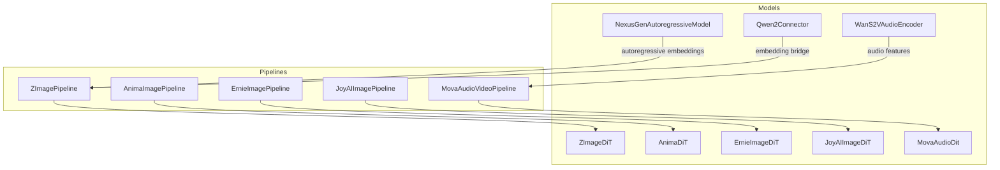

**Diagram sources**
- [z_image_dit.py:326-449](file://diffsynth/models/z_image_dit.py#L326-L449)
- [anima_dit.py:756-800](file://diffsynth/models/anima_dit.py#L756-L800)
- [ernie_image_dit.py:240-289](file://diffsynth/models/ernie_image_dit.py#L240-L289)
- [joyai_image_dit.py:491-548](file://diffsynth/models/joyai_image_dit.py#L491-L548)
- [mova_audio_dit.py:11-50](file://diffsynth/models/mova_audio_dit.py#L11-L50)
- [nexus_gen.py:5-115](file://diffsynth/models/nexus_gen.py#L5-L115)
- [step1x_connector.py:633-664](file://diffsynth/models/step1x_connector.py#L633-L664)
- [wav2vec.py:45-112](file://diffsynth/models/wav2vec.py#L45-L112)
- [z_image.py:27-92](file://diffsynth/pipelines/z_image.py#L27-L92)
- [anima_image.py:21-71](file://diffsynth/pipelines/anima_image.py#L21-L71)
- [ernie_image.py:21-65](file://diffsynth/pipelines/ernie_image.py#L21-L65)
- [joyai_image.py:15-63](file://diffsynth/pipelines/joyai_image.py#L15-L63)
- [mova_audio_video.py:25-113](file://diffsynth/pipelines/mova_audio_video.py#L25-L113)

**Section sources**
- [z_image.py:27-92](file://diffsynth/pipelines/z_image.py#L27-L92)
- [anima_image.py:21-71](file://diffsynth/pipelines/anima_image.py#L21-L71)
- [ernie_image.py:21-65](file://diffsynth/pipelines/ernie_image.py#L21-L65)
- [joyai_image.py:15-63](file://diffsynth/pipelines/joyai_image.py#L15-L63)
- [mova_audio_video.py:25-113](file://diffsynth/pipelines/mova_audio_video.py#L25-L113)

## Core Components
- Z-Image DiT: Patch-based transformer with RoPE, AdaLN modulation, optional SigLIP/Omni mode, ControlNet support, and image-to-LoRA style transfer.
- Anima DiT: Video-aware DiT with 3D positional embeddings, cross-attention to text, and VAE decoding for character-focused generation.
- ERNIE-Image DiT: Shared AdaLN block with 3D RoPE and joint image-text attention; optimized for Chinese prompts.
- JoyAI-Image DiT: Multimodal double-stream blocks with separate text/image modulations and flexible patching.
- MOVA Audio DiT: 1D frequency-domain DiT derived from Wan video DiT, aligned with a dual-tower bridge to video stream.
- Nexus Gen: Autoregressive Qwen2.5-VL wrapper generating image token embeddings conditioned on instruction and reference images.
- Step1X Connector: Embedding refiner projecting LLM-style embeddings into diffusion-friendly representations.
- Wav2Vec: Wav2Vec2-based encoder producing time-aligned audio features for motion/audio synchronization.

**Section sources**
- [z_image_dit.py:326-449](file://diffsynth/models/z_image_dit.py#L326-L449)
- [anima_dit.py:756-800](file://diffsynth/models/anima_dit.py#L756-L800)
- [ernie_image_dit.py:240-289](file://diffsynth/models/ernie_image_dit.py#L240-L289)
- [joyai_image_dit.py:491-548](file://diffsynth/models/joyai_image_dit.py#L491-L548)
- [mova_audio_dit.py:11-50](file://diffsynth/models/mova_audio_dit.py#L11-L50)
- [nexus_gen.py:5-115](file://diffsynth/models/nexus_gen.py#L5-L115)
- [step1x_connector.py:633-664](file://diffsynth/models/step1x_connector.py#L633-L664)
- [wav2vec.py:45-112](file://diffsynth/models/wav2vec.py#L45-L112)

## Architecture Overview
The pipelines implement a modular unit chain that prepares inputs, runs denoising steps with FlowMatchScheduler, and decodes latents through VAEs. Each model family integrates its specific DiT and supporting components.

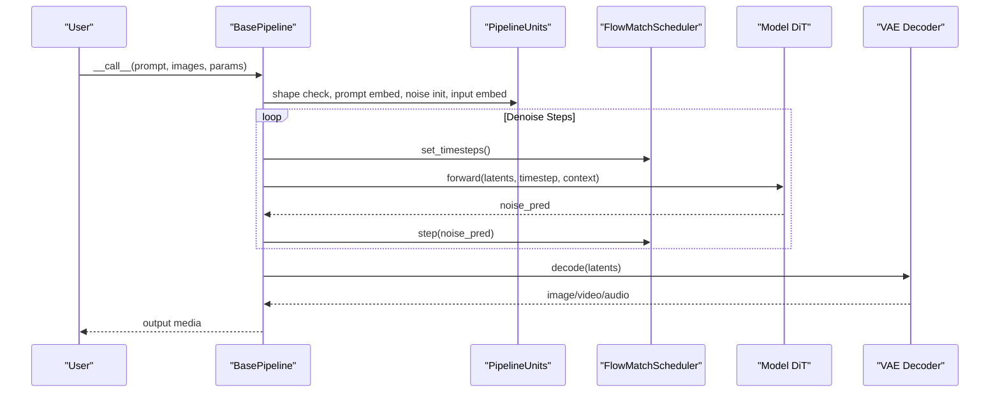

**Diagram sources**
- [z_image.py:94-166](file://diffsynth/pipelines/z_image.py#L94-L166)
- [anima_image.py:73-134](file://diffsynth/pipelines/anima_image.py#L73-L134)
- [ernie_image.py:66-118](file://diffsynth/pipelines/ernie_image.py#L66-L118)
- [joyai_image.py:64-131](file://diffsynth/pipelines/joyai_image.py#L64-L131)
- [mova_audio_video.py:114-198](file://diffsynth/pipelines/mova_audio_video.py#L114-L198)

## Detailed Component Analysis

### Z-Image Models
- Architecture: Patch embedding, RoPE per axis, AdaLN modulation, unified sequence combining latents and caption, optional SigLIP/Omni mode, ControlNet hints, and image-to-LoRA style injection.
- Unique Features: Per-token modulation for noisy/clean tokens, multi-stage refinement (noise_refiner/context_refiner), NPU patches for RMSNorm/RoPE.
- Use Cases: Text-to-image, image editing, inpainting, style transfer via image-to-LoRA, ControlNet-guided generation.
- Integration: ZImagePipeline orchestrates units for prompt encoding, VAE encoding, ControlNet preparation, and iterative denoising.

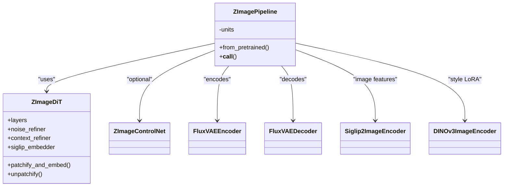

**Diagram sources**
- [z_image_dit.py:326-449](file://diffsynth/models/z_image_dit.py#L326-L449)
- [z_image.py:27-92](file://diffsynth/pipelines/z_image.py#L27-L92)

**Section sources**
- [z_image_dit.py:326-449](file://diffsynth/models/z_image_dit.py#L326-L449)
- [z_image.py:94-166](file://diffsynth/pipelines/z_image.py#L94-L166)
- [z_image.py:447-500](file://diffsynth/pipelines/z_image.py#L447-L500)
- [z_image.py:567-674](file://diffsynth/pipelines/z_image.py#L567-L674)

### Anima Models
- Architecture: 3D positional embeddings (learnable or RoPE), self/cross attention blocks with AdaLN modulation, GPT2-style MLP, final layer projection.
- Unique Features: Time-aware embeddings, optional FPS modulation, supports both image and short video sequences.
- Use Cases: Character-focused generation, consistent persona rendering, stylized portraits.
- Integration: AnimaImagePipeline uses ZImageTextEncoder and WanVideoVAE; denoising loop similar to other pipelines.

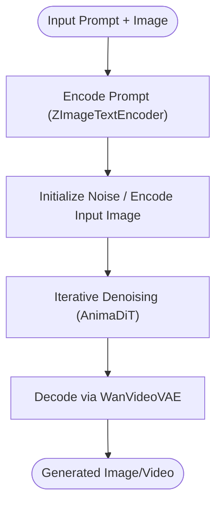

**Diagram sources**
- [anima_dit.py:756-800](file://diffsynth/models/anima_dit.py#L756-L800)
- [anima_image.py:73-134](file://diffsynth/pipelines/anima_image.py#L73-L134)

**Section sources**
- [anima_dit.py:756-800](file://diffsynth/models/anima_dit.py#L756-L800)
- [anima_image.py:73-134](file://diffsynth/pipelines/anima_image.py#L73-L134)

### ERNIE-Image Models
- Architecture: Shared AdaLN blocks, 3D RoPE, joint image-text attention, dynamic patch embedding, and continuous AdaLN at the final layer.
- Unique Features: Optimized for Chinese prompts, efficient single-stream attention processor, gradient checkpointing support.
- Use Cases: Chinese text-to-image, high-quality generation with strong textual alignment.
- Integration: ErnieImagePipeline handles tokenizer, text encoder, and FlowMatchScheduler; model function passes latents, timestep, and text embeddings.

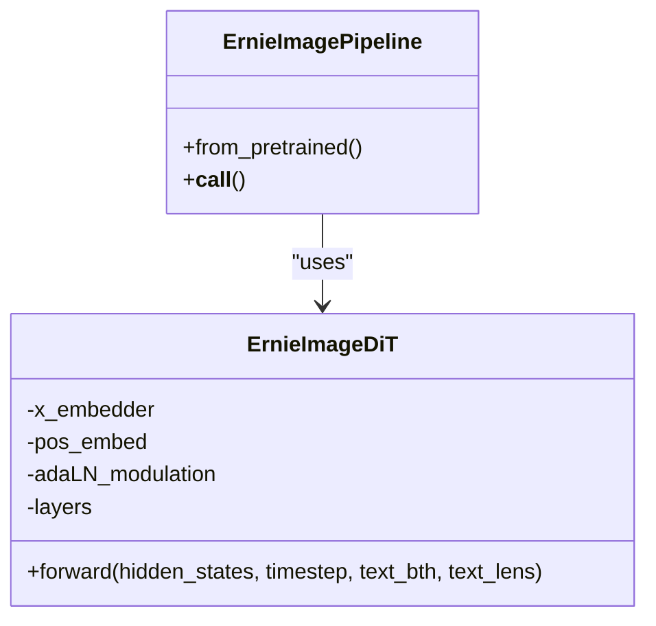

**Diagram sources**
- [ernie_image_dit.py:240-289](file://diffsynth/models/ernie_image_dit.py#L240-L289)
- [ernie_image.py:66-118](file://diffsynth/pipelines/ernie_image.py#L66-L118)

**Section sources**
- [ernie_image_dit.py:240-289](file://diffsynth/models/ernie_image_dit.py#L240-L289)
- [ernie_image.py:66-118](file://diffsynth/pipelines/ernie_image.py#L66-L118)

### JoyAI-Image Models
- Architecture: Double-stream blocks with separate text/image paths, each with independent AdaLN modulation, RoPE for visual tokens, and flexible patch sizes.
- Unique Features: Separate modulations for text and image streams, multi-item handling, tiled encoding for memory efficiency.
- Use Cases: Creative image editing, multi-image conditioning, high-resolution outputs with tiling.
- Integration: JoyAIImagePipeline manages processor, text encoder, and VAE; model function concatenates reference and target latents.

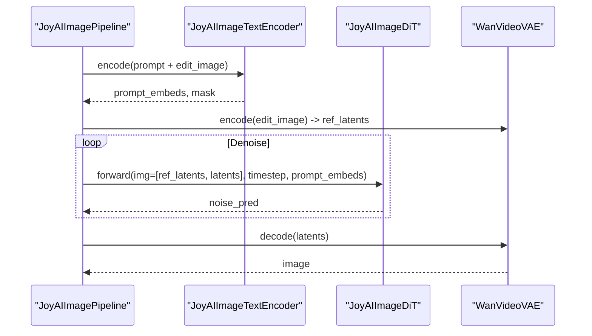

**Diagram sources**
- [joyai_image_dit.py:491-548](file://diffsynth/models/joyai_image_dit.py#L491-L548)
- [joyai_image.py:64-131](file://diffsynth/pipelines/joyai_image.py#L64-L131)

**Section sources**
- [joyai_image_dit.py:491-548](file://diffsynth/models/joyai_image_dit.py#L491-L548)
- [joyai_image.py:64-131](file://diffsynth/pipelines/joyai_image.py#L64-L131)

### MOVA Models (Audio-Video Synthesis)
- Architecture: Dual-tower setup with video DiT (WanModel) and audio DiT (MovaAudioDit), synchronized via DualTowerConditionalBridge; shared timestep and text context.
- Unique Features: Frequency-aligned RoPE across modalities, switchable low-noise video DiT, unified sequence parallelism option.
- Use Cases: Audio-driven video generation, lip-sync, motion-audio coherence.
- Integration: MovaAudioVideoPipeline coordinates both towers, VAEs, and text encoder; model function computes aligned frequencies and iterates blocks with optional interaction.

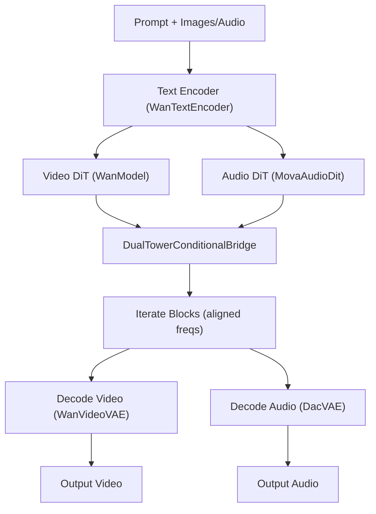

**Diagram sources**
- [mova_audio_dit.py:11-50](file://diffsynth/models/mova_audio_dit.py#L11-L50)
- [mova_audio_video.py:114-198](file://diffsynth/pipelines/mova_audio_video.py#L114-L198)

**Section sources**
- [mova_audio_dit.py:11-50](file://diffsynth/models/mova_audio_dit.py#L11-L50)
- [mova_audio_video.py:114-198](file://diffsynth/pipelines/mova_audio_video.py#L114-L198)

### Nexus Gen (Generative AI Tasks)
- Architecture: Wrapper around Qwen2.5-VL autoregressive model; constructs messages for editing/generation, processes images and text, and extracts image token embeddings.
- Unique Features: Supports editing with reference images, configurable max pixels, image token masking, and sliding window attention configuration.
- Use Cases: Instruction-based image generation/editing, vision-language reasoning, token-level control over generated content.
- Integration: Provides state_dict converter and processor loading; returns embeddings for downstream diffusion stages.

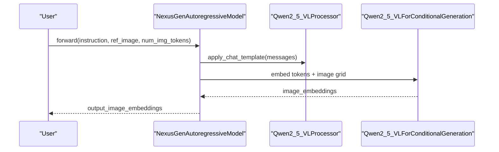

**Diagram sources**
- [nexus_gen.py:5-115](file://diffsynth/models/nexus_gen.py#L5-L115)

**Section sources**
- [nexus_gen.py:5-115](file://diffsynth/models/nexus_gen.py#L5-L115)

### Step1X Connector (Model Bridging)
- Architecture: SingleTokenRefiner with IndividualTokenRefinerBlock and CrossAttnBlock; projects LLM-style embeddings into diffusion-friendly space with AdaLN modulation.
- Unique Features: Optional cross-attention path, mask-aware pooling, zero-initialized modulation scales for stable training/inference.
- Use Cases: Bridge embeddings from large language models into diffusion pipelines, unify heterogeneous token spaces.
- Integration: Returns refined encoder_hidden_states and global projection for downstream modules.

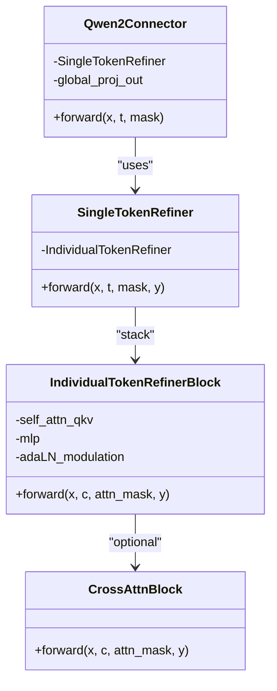

**Diagram sources**
- [step1x_connector.py:633-664](file://diffsynth/models/step1x_connector.py#L633-L664)
- [step1x_connector.py:478-545](file://diffsynth/models/step1x_connector.py#L478-L545)
- [step1x_connector.py:284-386](file://diffsynth/models/step1x_connector.py#L284-L386)

**Section sources**
- [step1x_connector.py:633-664](file://diffsynth/models/step1x_connector.py#L633-L664)
- [step1x_connector.py:478-545](file://diffsynth/models/step1x_connector.py#L478-L545)

### Wav2Vec (Audio Processing)
- Architecture: Wav2Vec2ForCTC encoder with configurable layers; linear interpolation to align audio frames to video rate; bucketing strategies for efficient batching.
- Unique Features: Multi-layer hidden states support, frame sampling indices, stride-based contextual windows, and batched embedding extraction.
- Use Cases: Audio feature extraction for motion/audio sync, speech-driven animation, temporal alignment with video frames.
- Integration: Provides methods to extract features, build buckets, and return per-inference batches aligned to target fps.

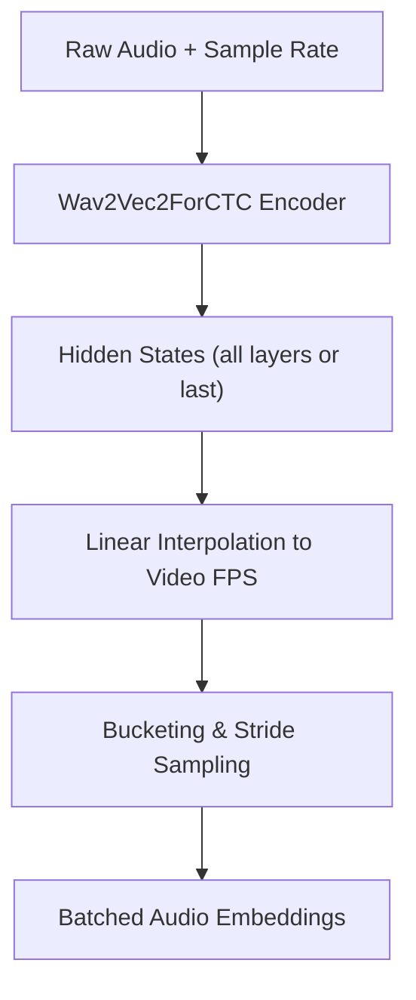

**Diagram sources**
- [wav2vec.py:45-112](file://diffsynth/models/wav2vec.py#L45-L112)
- [wav2vec.py:114-192](file://diffsynth/models/wav2vec.py#L114-L192)

**Section sources**
- [wav2vec.py:45-112](file://diffsynth/models/wav2vec.py#L45-L112)
- [wav2vec.py:114-192](file://diffsynth/models/wav2vec.py#L114-L192)

## Dependency Analysis
- Pipeline dependencies: Each pipeline composes text encoders, DiTs, VAEs, and optional ControlNet/bridges.
- Model dependencies: DiTs rely on attention utilities, gradient checkpointing, and device-specific patches.
- External integrations: Transformers for tokenizers/processors, Qwen2.5-VL for Nexus Gen, Wav2Vec2 for audio features.

```mermaid
graph TB
ZP["ZImagePipeline"] --> ZTE["ZImageTextEncoder"]
ZP --> ZDIT["ZImageDiT"]
ZP --> FVAE["FluxVAE"]
ZP --> CN["ZImageControlNet"]
ZP --> SIG["Siglip2/DINOv3"]
AP["AnimaImagePipeline"] --> ATE["ZImageTextEncoder"]
AP --> ADIT["AnimaDiT"]
AP --> WVAE["WanVideoVAE"]
EP["ErnieImagePipeline"] --> ETE["ErnieImageTextEncoder"]
EP --> EDIT["ErnieImageDiT"]
EP --> F2VAE["Flux2VAE"]
JP["JoyAIImagePipeline"] --> JTE["JoyAIImageTextEncoder"]
JP --> JDIT["JoyAIImageDiT"]
JP --> WVAE2["WanVideoVAE"]
MP["MovaAudioVideoPipeline"] --> WTE["WanTextEncoder"]
MP --> WVD["WanModel"]
MP --> MAD["MovaAudioDit"]
MP --> DTB["DualTowerConditionalBridge"]
MP --> WVAE3["WanVideoVAE"]
MP --> AVAE["DacVAE"]
NG["NexusGenAutoregressiveModel"] --> QVL["Qwen2_5_VL"]
SC["Qwen2Connector"] --> STR["SingleTokenRefiner"]
WV["WanS2VAudioEncoder"] --> W2V2["Wav2Vec2ForCTC"]
```

**Diagram sources**
- [z_image.py:27-92](file://diffsynth/pipelines/z_image.py#L27-L92)
- [anima_image.py:21-71](file://diffsynth/pipelines/anima_image.py#L21-L71)
- [ernie_image.py:21-65](file://diffsynth/pipelines/ernie_image.py#L21-L65)
- [joyai_image.py:15-63](file://diffsynth/pipelines/joyai_image.py#L15-L63)
- [mova_audio_video.py:25-113](file://diffsynth/pipelines/mova_audio_video.py#L25-L113)
- [nexus_gen.py:5-115](file://diffsynth/models/nexus_gen.py#L5-L115)
- [step1x_connector.py:633-664](file://diffsynth/models/step1x_connector.py#L633-L664)
- [wav2vec.py:45-112](file://diffsynth/models/wav2vec.py#L45-L112)

**Section sources**
- [z_image.py:27-92](file://diffsynth/pipelines/z_image.py#L27-L92)
- [anima_image.py:21-71](file://diffsynth/pipelines/anima_image.py#L21-L71)
- [ernie_image.py:21-65](file://diffsynth/pipelines/ernie_image.py#L21-L65)
- [joyai_image.py:15-63](file://diffsynth/pipelines/joyai_image.py#L15-L63)
- [mova_audio_video.py:25-113](file://diffsynth/pipelines/mova_audio_video.py#L25-L113)
- [nexus_gen.py:5-115](file://diffsynth/models/nexus_gen.py#L5-L115)
- [step1x_connector.py:633-664](file://diffsynth/models/step1x_connector.py#L633-L664)
- [wav2vec.py:45-112](file://diffsynth/models/wav2vec.py#L45-L112)

## Performance Considerations
- Gradient checkpointing: Enabled across DiTs to reduce memory usage during training/inference.
- NPU optimizations: Z-Image replaces RMSNorm and RoPE with fused operators for improved performance on NPUs.
- Tiled encoding/decoding: JoyAI and MOVA pipelines support tiling to handle high resolutions efficiently.
- Unified Sequence Parallel: MOVA pipeline can enable distributed sequence parallelism for long sequences.
- Batched audio features: Wav2Vec utilities provide bucketing strategies to optimize throughput.

[No sources needed since this section provides general guidance]

## Troubleshooting Guide
- Shape mismatches: Ensure height/width are divisible by pipeline division factors; pipelines enforce checks in units.
- Tokenizer issues: Verify tokenizer configs and download if necessary; some pipelines require multiple tokenizers.
- VRAM constraints: Use low-vram variants in examples; enable VRAM management and offloading where available.
- NPU compatibility: Disable NPU patches if encountering errors; verify device type and autocast settings.
- Audio-video alignment: Confirm fps and sample rate conversions; use provided interpolation and bucketing functions.

**Section sources**
- [z_image.py:676-690](file://diffsynth/pipelines/z_image.py#L676-L690)
- [mova_audio_video.py:57-113](file://diffsynth/pipelines/mova_audio_video.py#L57-L113)
- [wav2vec.py:30-43](file://diffsynth/models/wav2vec.py#L30-L43)

## Conclusion
ODTSR-edit provides a rich ecosystem of specialized models and pipelines for diverse generative tasks. Z-Image excels in advanced editing and style transfer, Anima focuses on character consistency, ERNIE-Image targets Chinese text alignment, JoyAI-Image enables creative multimodal conditioning, MOVA synchronizes audio and video, Nexus Gen offers autoregressive vision-language capabilities, Step1X bridges embedding spaces, and Wav2Vec ensures robust audio processing. The modular pipeline design ensures flexibility, scalability, and ease of integration across these model families.

[No sources needed since this section summarizes without analyzing specific files]