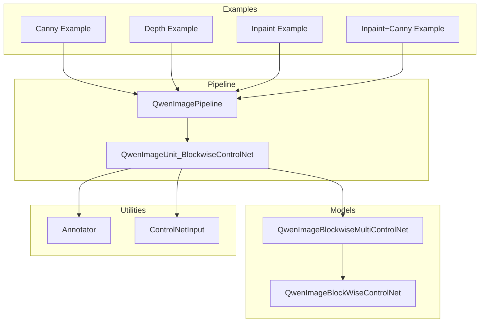
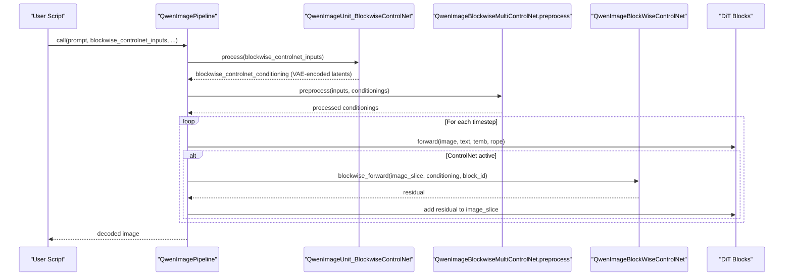
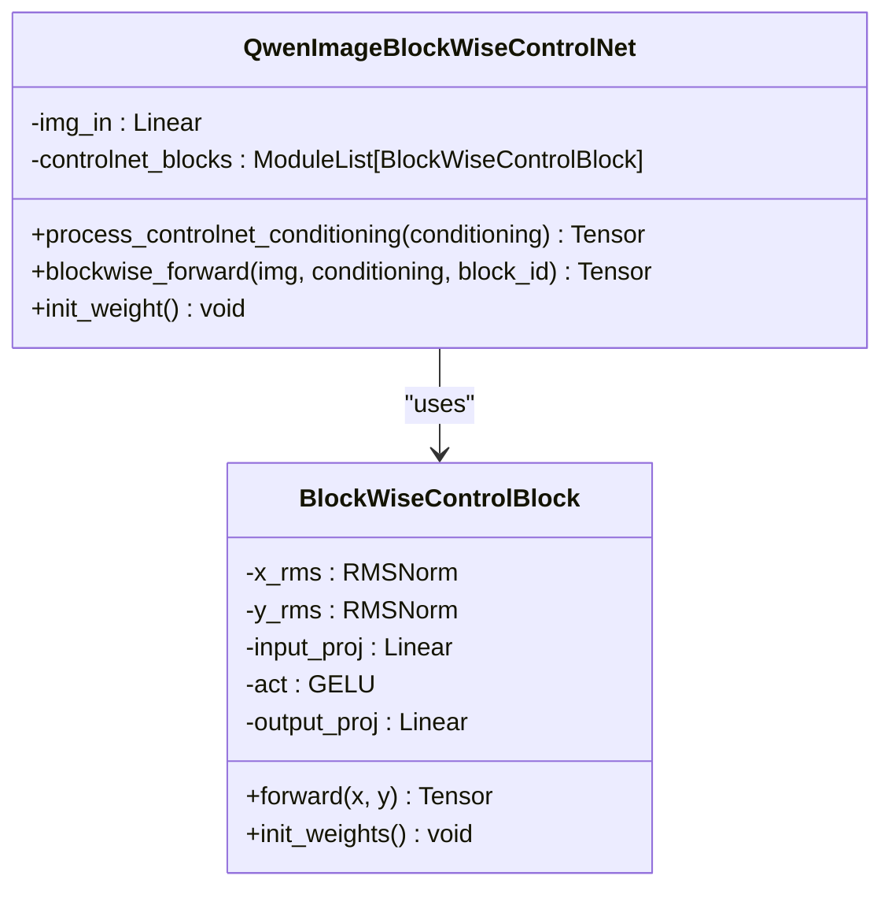
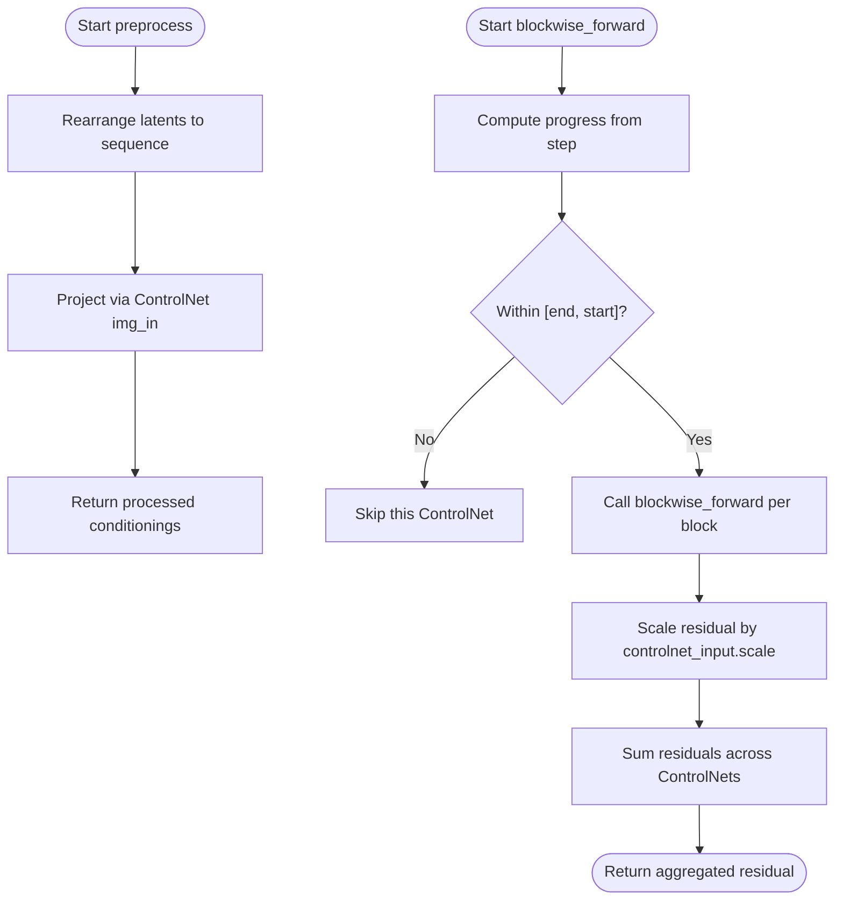
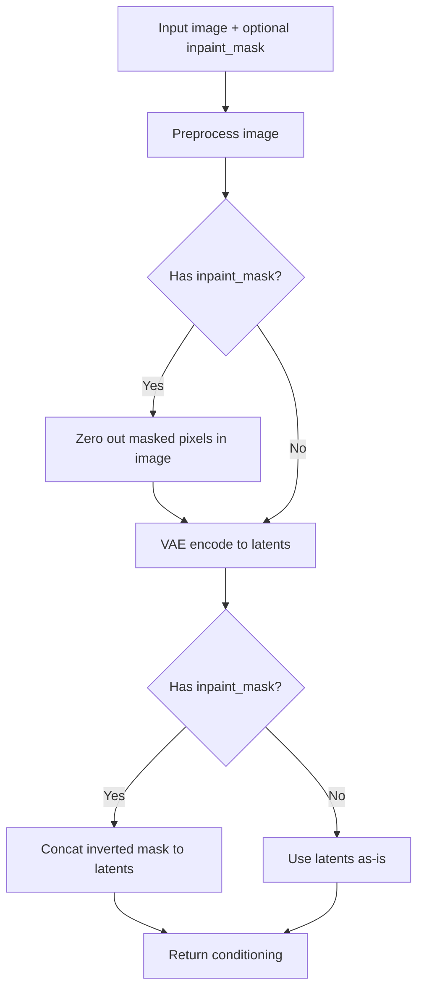
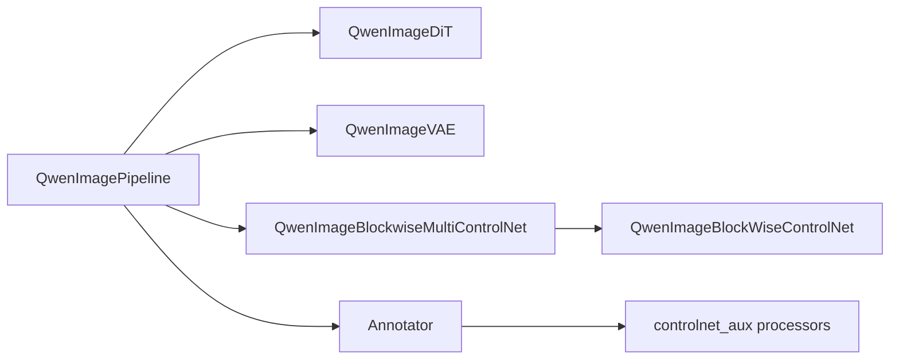

# ControlNet Integration

<cite>
**Referenced Files in This Document**
- [qwen_image_controlnet.py](file://diffsynth/models/qwen_image_controlnet.py)
- [annotator.py](file://diffsynth/utils/controlnet/annotator.py)
- [controlnet_input.py](file://diffsynth/utils/controlnet/controlnet_input.py)
- [qwen_image.py](file://diffsynth/pipelines/qwen_image.py)
- [Qwen-Image-Blockwise-ControlNet-Canny.py](file://examples/qwen_image/model_inference/Qwen-Image-Blockwise-ControlNet-Canny.py)
- [Qwen-Image-Blockwise-ControlNet-Depth.py](file://examples/qwen_image/model_inference/Qwen-Image-Blockwise-ControlNet-Depth.py)
- [Qwen-Image-Blockwise-ControlNet-Inpaint.py](file://examples/qwen_image/model_inference/Qwen-Image-Blockwise-ControlNet-Inpaint.py)
- [Qwen-Image-Blockwise-ControlNet-InpaintCanny.py](file://examples/qwen_image/model_inference/Qwen-Image-Blockwise-ControlNet-InpaintCanny.py)
- [Qwen-Image-Blockwise-ControlNet-Initialize.py](file://examples/qwen_image/model_training/scripts/Qwen-Image-Blockwise-ControlNet-Initialize.py)
- [Qwen-Image-Blockwise-ControlNet-Inpaint-Initialize.py](file://examples/qwen_image/model_training/scripts/Qwen-Image-Blockwise-ControlNet-Inpaint-Initialize.py)
- [general_modules.py](file://diffsynth/models/general_modules.py)
- [Qwen-Image.md](file://docs/en/Model_Details/Qwen-Image.md)
</cite>

## Table of Contents
1. Introduction
2. Project Structure
3. Core Components
4. Architecture Overview
5. Detailed Component Analysis
6. Dependency Analysis
7. Performance Considerations
8. Troubleshooting Guide
9. Conclusion
10. Appendices

## Introduction
This document explains the Qwen-Image Blockwise ControlNet integration for precise spatial control over image editing and generation. It covers:
- The blockwise ControlNet architecture that injects per-block conditioning into the DiT transformer blocks.
- Annotator modules for edge detection, depth estimation, normal maps, line art, pose, and more.
- Control signal processing, conditioning mechanisms, and multi-modal control inputs (images, masks).
- Practical usage examples for inpainting, structural editing with Canny/depth, and combined controls.
- Control strength parameters, blending strategies across steps, and performance optimization for real-time applications.
- Guidance for developing custom annotators and control conditions.

## Project Structure
The ControlNet integration spans model definitions, pipeline units, utilities, and example scripts:
- Model: a lightweight blockwise ControlNet module aligned with Qwen-Image DiT blocks.
- Pipeline: a dedicated unit to prepare ControlNet conditionings and inject them at each transformer block.
- Utilities: an annotator abstraction wrapping external processors and a dataclass for ControlNet inputs.
- Examples: ready-to-run inference scripts for Canny, Depth, Inpaint, and combined controls.

**Diagram sources**
- [qwen_image.py:25-198](file://diffsynth/pipelines/qwen_image.py#L25-L198)
- [qwen_image_controlnet.py:29-57](file://diffsynth/models/qwen_image_controlnet.py#L29-L57)
- [annotator.py:9-63](file://diffsynth/utils/controlnet/annotator.py#L9-L63)
- [controlnet_input.py:5-15](file://diffsynth/utils/controlnet/controlnet_input.py#L5-L15)
- [Qwen-Image-Blockwise-ControlNet-Canny.py:1-32](file://examples/qwen_image/model_inference/Qwen-Image-Blockwise-ControlNet-Canny.py#L1-L32)
- [Qwen-Image-Blockwise-ControlNet-Depth.py:1-33](file://examples/qwen_image/model_inference/Qwen-Image-Blockwise-ControlNet-Depth.py#L1-L33)
- [Qwen-Image-Blockwise-ControlNet-Inpaint.py:1-34](file://examples/qwen_image/model_inference/Qwen-Image-Blockwise-ControlNet-Inpaint.py#L1-L34)
- [Qwen-Image-Blockwise-ControlNet-InpaintCanny.py:1-50](file://examples/qwen_image/model_inference/Qwen-Image-Blockwise-ControlNet-InpaintCanny.py#L1-L50)

**Section sources**
- [qwen_image.py:25-198](file://diffsynth/pipelines/qwen_image.py#L25-L198)
- [qwen_image_controlnet.py:1-57](file://diffsynth/models/qwen_image_controlnet.py#L1-L57)
- [annotator.py:1-64](file://diffsynth/utils/controlnet/annotator.py#L1-L64)
- [controlnet_input.py:1-15](file://diffsynth/utils/controlnet/controlnet_input.py#L1-L15)

## Core Components
- QwenImageBlockWiseControlNet: A small network that projects ControlNet conditioning into the DiT feature space and provides per-block residual outputs via blockwise_forward.
- QwenImageBlockwiseMultiControlNet: Manages multiple ControlNet instances, preprocesses conditionings, and aggregates weighted residuals per block.
- QwenImageUnit_BlockwiseControlNet: Prepares ControlNet inputs by encoding images through the VAE, optionally applying inpaint masks, and producing latent conditionings.
- Annotator: Wraps external processors (e.g., Canny, Midas depth, HED soft edges, Lineart, OpenPose, NormalBae) and returns resized annotations compatible with ControlNet.
- ControlNetInput: Data container specifying which ControlNet model to use, scale, temporal schedule (start/end), and optional inpaint mask.

Key responsibilities:
- Conditioning preparation: VAE encode + optional mask handling.
- Per-block injection: Add scaled residuals from ControlNet to the noise branch features at each DiT block.
- Multi-control aggregation: Support multiple ControlNet models with independent scales and schedules.

**Section sources**
- [qwen_image_controlnet.py:6-57](file://diffsynth/models/qwen_image_controlnet.py#L6-L57)
- [qwen_image.py:200-227](file://diffsynth/pipelines/qwen_image.py#L200-L227)
- [qwen_image.py:523-564](file://diffsynth/pipelines/qwen_image.py#L523-L564)
- [annotator.py:9-63](file://diffsynth/utils/controlnet/annotator.py#L9-L63)
- [controlnet_input.py:5-15](file://diffsynth/utils/controlnet/controlnet_input.py#L5-L15)

## Architecture Overview
The blockwise ControlNet integrates directly into the Qwen-Image DiT transformer loop. At each transformer block, the ControlNet produces a residual conditioned on the input image (and optional mask), which is added back to the noise branch features before proceeding to the next block.

**Diagram sources**
- [qwen_image.py:100-198](file://diffsynth/pipelines/qwen_image.py#L100-L198)
- [qwen_image.py:523-564](file://diffsynth/pipelines/qwen_image.py#L523-L564)
- [qwen_image.py:200-227](file://diffsynth/pipelines/qwen_image.py#L200-L227)
- [qwen_image_controlnet.py:29-57](file://diffsynth/models/qwen_image_controlnet.py#L29-L57)

## Detailed Component Analysis

### Blockwise ControlNet Model
- Input projection: Maps ControlNet conditioning into the DiT feature dimension.
- Per-block residual: Each block applies RMSNorm, linear projections, GELU activation, and zero-initialized output projection to ensure stable training start.
- Initialization: Zero-initialization of output projections prevents early disruption of pretrained weights.

**Diagram sources**
- [qwen_image_controlnet.py:6-57](file://diffsynth/models/qwen_image_controlnet.py#L6-L57)
- [general_modules.py:104-121](file://diffsynth/models/general_modules.py#L104-L121)

**Section sources**
- [qwen_image_controlnet.py:6-57](file://diffsynth/models/qwen_image_controlnet.py#L6-L57)
- [general_modules.py:104-121](file://diffsynth/models/general_modules.py#L104-L121)

### Multi-Control Aggregation and Preprocessing
- Preprocess: Rearranges VAE latents to sequence format and projects via the selected ControlNet model.
- Blockwise forward: Computes progress-based activation using start/end fields; sums scaled residuals across all active ControlNets.

**Diagram sources**
- [qwen_image.py:210-227](file://diffsynth/pipelines/qwen_image.py#L210-L227)
- [controlnet_input.py:5-15](file://diffsynth/utils/controlnet/controlnet_input.py#L5-L15)

**Section sources**
- [qwen_image.py:200-227](file://diffsynth/pipelines/qwen_image.py#L200-L227)
- [controlnet_input.py:5-15](file://diffsynth/utils/controlnet/controlnet_input.py#L5-L15)

### ControlNet Conditioning Preparation
- Image preprocessing: Normalize and move to device.
- VAE encoding: Convert images to latent space.
- Inpaint mask handling: Optionally zero out masked regions in the image and concatenate inverted mask into latents to guide inpainting.

**Diagram sources**
- [qwen_image.py:531-564](file://diffsynth/pipelines/qwen_image.py#L531-L564)

**Section sources**
- [qwen_image.py:523-564](file://diffsynth/pipelines/qwen_image.py#L523-L564)

### Annotator Modules
Supported processor IDs include canny, depth, softedge, lineart, lineart_anime, openpose, normal, tile, none, inpaint. The Annotator class instantiates appropriate detectors from controlnet_aux and resizes outputs to match input resolution.

Usage pattern:
- Instantiate Annotator(processor_id="canny") or other supported types.
- Call Annotator(image) to get annotation map.
- Pass annotation map as ControlNetInput.image to the pipeline.

**Section sources**
- [annotator.py:9-63](file://diffsynth/utils/controlnet/annotator.py#L9-L63)

### Control Signal Processing and Conditioning Mechanisms
- Latent rearrangement: Converts VAE latents to token sequences for DiT consumption.
- RoPE alignment: Ensures positional embeddings align between noise and condition tokens when concatenating.
- Step-wise activation: Uses start/end to activate ControlNet only during specific phases of denoising.
- Strength scaling: Scales each ControlNet’s residual by controlnet_input.scale before summation.

**Section sources**
- [qwen_image.py:1117-1142](file://diffsynth/pipelines/qwen_image.py#L1117-L1142)
- [qwen_image.py:210-227](file://diffsynth/pipelines/qwen_image.py#L210-L227)

### Multi-Modal Control Inputs
- Single ControlNet: Provide one ControlNetInput with image or annotation.
- Multiple ControlNets: Combine different modalities (e.g., inpaint + Canny) by passing multiple ControlNetInput entries with distinct controlnet_id values.
- Inpainting: Supply both input_image and inpaint_mask; ControlNet conditioning includes masked image and concatenated mask latents.

**Section sources**
- [Qwen-Image-Blockwise-ControlNet-Inpaint.py:1-34](file://examples/qwen_image/model_inference/Qwen-Image-Blockwise-ControlNet-Inpaint.py#L1-L34)
- [Qwen-Image-Blockwise-ControlNet-InpaintCanny.py:1-50](file://examples/qwen_image/model_inference/Qwen-Image-Blockwise-ControlNet-InpaintCanny.py#L1-L50)

## Dependency Analysis
The ControlNet integration depends on:
- Qwen-Image DiT: Provides transformer blocks where residuals are injected.
- VAE: Encodes images to latent space for ControlNet conditioning.
- Text encoder/tokenizer: Used by the pipeline but not directly by ControlNet.
- External annotators: controlnet_aux processors for edge/depth/pose/normal extraction.

**Diagram sources**
- [qwen_image.py:25-198](file://diffsynth/pipelines/qwen_image.py#L25-L198)
- [qwen_image_controlnet.py:29-57](file://diffsynth/models/qwen_image_controlnet.py#L29-L57)
- [annotator.py:9-63](file://diffsynth/utils/controlnet/annotator.py#L9-L63)

**Section sources**
- [qwen_image.py:25-198](file://diffsynth/pipelines/qwen_image.py#L25-L198)
- [qwen_image_controlnet.py:29-57](file://diffsynth/models/qwen_image_controlnet.py#L29-L57)
- [annotator.py:9-63](file://diffsynth/utils/controlnet/annotator.py#L9-L63)

## Performance Considerations
- VRAM management: Use tiled VAE encoding/decoding to reduce memory footprint; enable vram_management_enabled in models if available.
- Gradient checkpointing: Enable gradient_checkpoint_forward in DiT blocks to trade compute for memory.
- FP8 attention: Optional enable_fp8_attention parameter reduces memory bandwidth requirements.
- Tiling: For large images, set tiled=True and tune tile_size/tile_stride to balance quality and speed.
- ControlNet activation window: Adjust start/end to limit ControlNet influence to critical steps, reducing computation.
- Mixed precision: Use torch.bfloat16 for faster inference on modern GPUs.

Practical tips:
- Prefer fewer ControlNets simultaneously; combine modalities judiciously.
- Reduce num_inference_steps for real-time demos while maintaining acceptable quality.
- Reuse Annotator instances to avoid reloading heavy detectors.

[No sources needed since this section provides general guidance]

## Troubleshooting Guide
Common issues and resolutions:
- Shape mismatches: Ensure height/width are multiples of 16; VAE encodes to 1/8 resolution.
- Mask artifacts: Verify inpaint_mask is normalized to [0,1] and resized to latent dimensions; blurred edges may help blending.
- No effect from ControlNet: Check controlnet_input.scale > 0 and that start/end cover current progress; verify controlnet_id matches loaded model index.
- Out-of-memory: Enable tiled mode, lower resolution, or reduce number of simultaneous ControlNets.
- Slow inference: Disable unnecessary annotators, reduce steps, or use low-vram variants.

**Section sources**
- [qwen_image.py:338-355](file://diffsynth/pipelines/qwen_image.py#L338-L355)
- [qwen_image.py:531-564](file://diffsynth/pipelines/qwen_image.py#L531-L564)
- [qwen_image.py:210-227](file://diffsynth/pipelines/qwen_image.py#L210-L227)

## Conclusion
The Qwen-Image Blockwise ControlNet provides a flexible, efficient mechanism for spatial control in image generation and editing. By injecting per-block residuals derived from VAE-encoded conditionings (with optional masks), it enables precise inpainting, structural editing, and multi-modal control. The modular design supports multiple annotators and easy extension for custom conditions, while pipeline-level optimizations make it suitable for real-time workflows.

[No sources needed since this section summarizes without analyzing specific files]

## Appendices

### Usage Examples

- Structural editing with Canny:
  - Load base Qwen-Image models plus the Canny ControlNet.
  - Provide a Canny edge map as ControlNetInput.image.
  - Generate edited image guided by edges.

- Depth-guided editing:
  - Load Depth ControlNet alongside base models.
  - Provide a depth map as ControlNetInput.image.
  - Generate results respecting depth structure.

- Inpainting:
  - Load Inpaint ControlNet.
  - Provide input_image and inpaint_mask; pass both to ControlNetInput.
  - Generate content within the masked region.

- Combined controls (Inpaint + Canny):
  - Load both Inpaint and Canny ControlNets.
  - Provide two ControlNetInput entries with distinct controlnet_id values.
  - Achieve fine-grained structural and regional edits simultaneously.

**Section sources**
- [Qwen-Image-Blockwise-ControlNet-Canny.py:1-32](file://examples/qwen_image/model_inference/Qwen-Image-Blockwise-ControlNet-Canny.py#L1-L32)
- [Qwen-Image-Blockwise-ControlNet-Depth.py:1-33](file://examples/qwen_image/model_inference/Qwen-Image-Blockwise-ControlNet-Depth.py#L1-L33)
- [Qwen-Image-Blockwise-ControlNet-Inpaint.py:1-34](file://examples/qwen_image/model_inference/Qwen-Image-Blockwise-ControlNet-Inpaint.py#L1-L34)
- [Qwen-Image-Blockwise-ControlNet-InpaintCanny.py:1-50](file://examples/qwen_image/model_inference/Qwen-Image-Blockwise-ControlNet-InpaintCanny.py#L1-L50)

### Developing Custom Annotators and Control Conditions
- Custom annotator:
  - Extend Annotator logic by adding a new processor_id branch and implementing __call__ to return a PIL image of the same size as input.
  - Ensure consistent normalization and resizing behavior.

- Custom ControlNet:
  - Implement a model compatible with QwenImageBlockWiseControlNet interface:
    - process_controlnet_conditioning(conditioning) -> projected tensor
    - blockwise_forward(img, conditioning, block_id) -> residual
  - Initialize weights with zero-initialized output projections to preserve pretrained stability.
  - Register the model under a unique controlnet_id and supply corresponding ControlNetInput entries.

- Training initialization:
  - Use provided initialization scripts to generate baseline state dicts for standard and inpaint variants.

**Section sources**
- [annotator.py:9-63](file://diffsynth/utils/controlnet/annotator.py#L9-L63)
- [qwen_image_controlnet.py:29-57](file://diffsynth/models/qwen_image_controlnet.py#L29-L57)
- [Qwen-Image-Blockwise-ControlNet-Initialize.py:1-14](file://examples/qwen_image/model_training/scripts/Qwen-Image-Blockwise-ControlNet-Initialize.py#L1-L14)
- [Qwen-Image-Blockwise-ControlNet-Inpaint-Initialize.py:1-13](file://examples/qwen_image/model_training/scripts/Qwen-Image-Blockwise-ControlNet-Inpaint-Initialize.py#L1-L13)

### Control Strength Parameters and Blending Strategies
- controlnet_input.scale: Controls the magnitude of ControlNet residuals; higher values increase adherence to the control signal.
- controlnet_input.start / controlnet_input.end: Define the denoising phase window where ControlNet is active; useful to focus control on early or late stages.
- Multi-ControlNet blending: Residuals from multiple ControlNets are summed after scaling; order does not matter due to additive nature.
- Inpaint mask blending: Inverted mask concatenated to latents ensures seamless blending at boundaries; optional blur improves transitions.

**Section sources**
- [controlnet_input.py:5-15](file://diffsynth/utils/controlnet/controlnet_input.py#L5-L15)
- [qwen_image.py:210-227](file://diffsynth/pipelines/qwen_image.py#L210-L227)
- [qwen_image.py:531-564](file://diffsynth/pipelines/qwen_image.py#L531-L564)

### Real-Time Optimization Checklist
- Use bfloat16 dtype and GPU acceleration.
- Enable tiled VAE operations for large images.
- Limit ControlNet count and restrict activation windows.
- Reduce num_inference_steps for interactive applications.
- Reuse annotator instances and precompute common conditionings.

[No sources needed since this section provides general guidance]