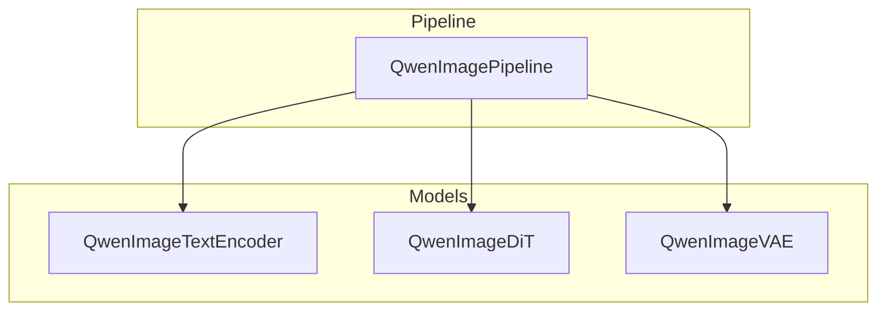
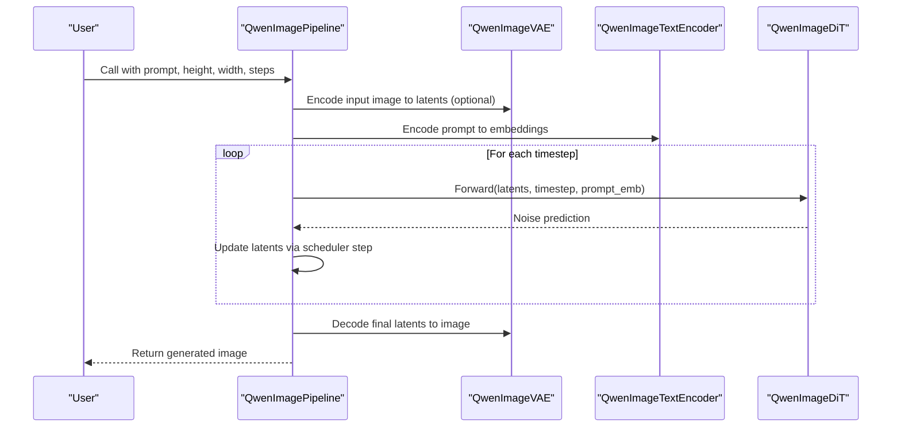
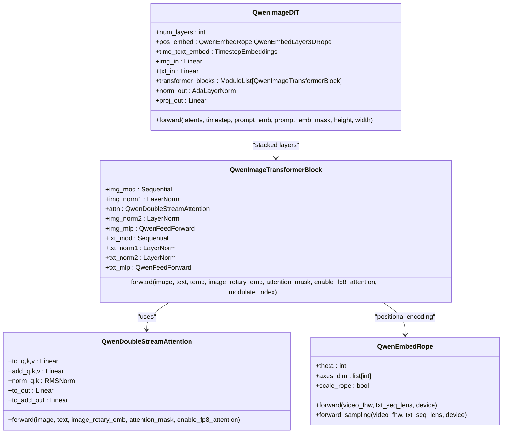
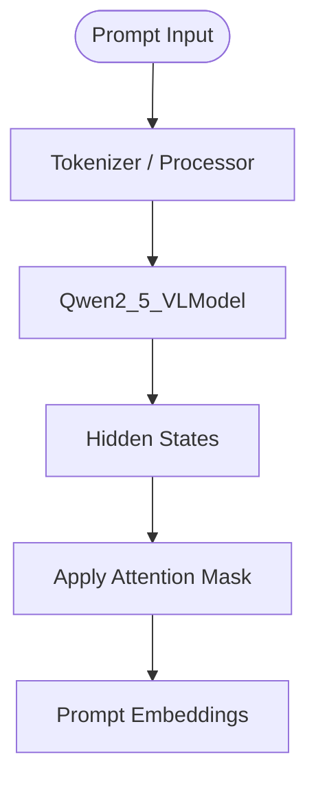
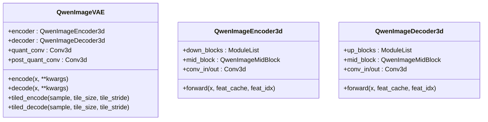
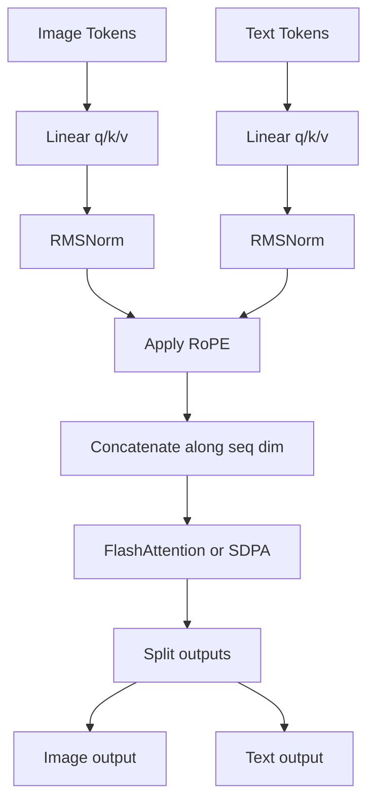
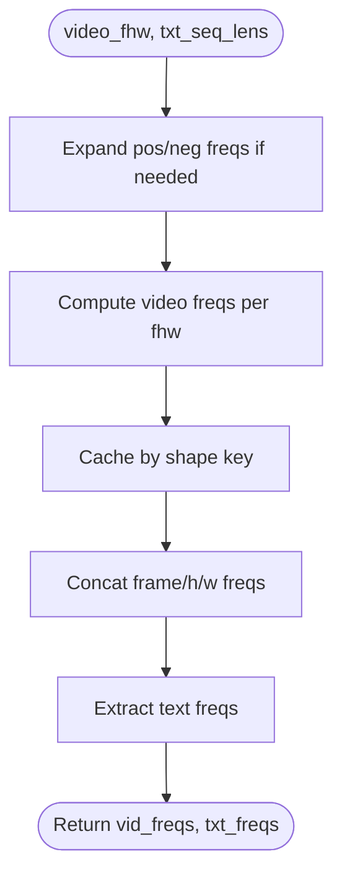
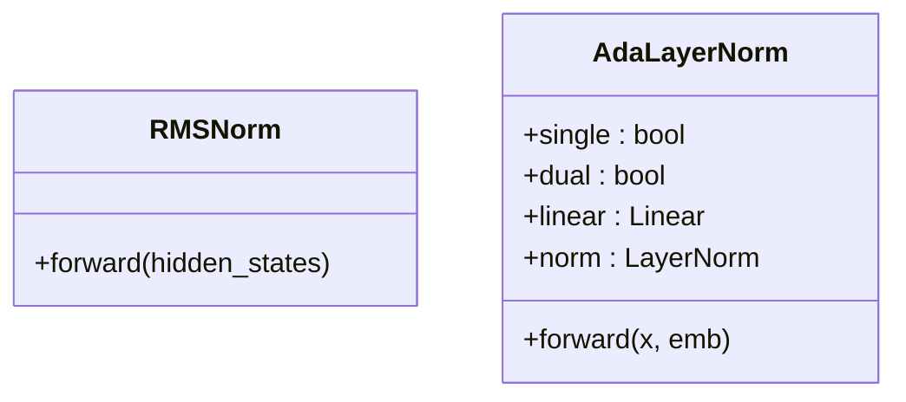
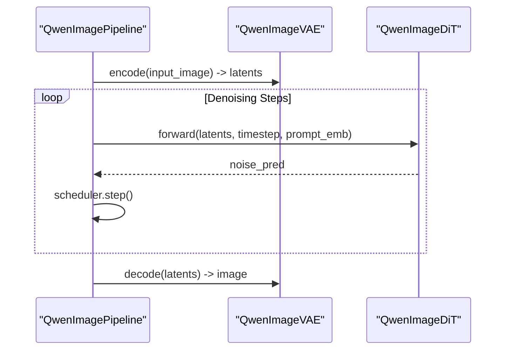
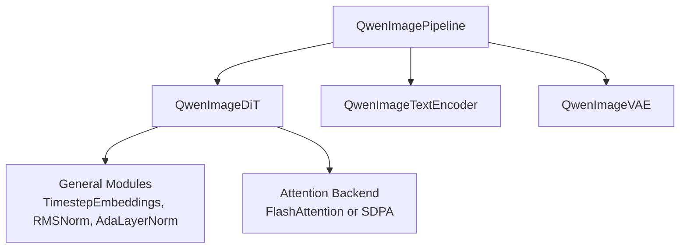

# Qwen-Image DiT Architecture

<cite>
**Referenced Files in This Document**
- [qwen_image_dit.py](file://diffsynth/models/qwen_image_dit.py)
- [qwen_image_vae.py](file://diffsynth/models/qwen_image_vae.py)
- [qwen_image_text_encoder.py](file://diffsynth/models/qwen_image_text_encoder.py)
- [general_modules.py](file://diffsynth/models/general_modules.py)
- [qwen_image.py](file://diffsynth/pipelines/qwen_image.py)
- [Qwen-Image.md](file://docs/en/Model_Details/Qwen-Image.md)
</cite>

## Table of Contents
1. [Introduction](#introduction)
2. [Project Structure](#project-structure)
3. [Core Components](#core-components)
4. [Architecture Overview](#architecture-overview)
5. [Detailed Component Analysis](#detailed-component-analysis)
6. [Dependency Analysis](#dependency-analysis)
7. [Performance Considerations](#performance-considerations)
8. [Troubleshooting Guide](#troubleshooting-guide)
9. [Conclusion](#conclusion)
10. [Appendices](#appendices)

## Introduction
This document provides a comprehensive technical overview of the Qwen-Image Diffusion Transformer (DiT) architecture as implemented in the repository. It explains the transformer-based design optimized for image generation, including attention mechanisms, normalization strategies, positional encoding schemes, and integration with text encoders and VAE components. It also covers memory optimization techniques, scaling properties, and practical guidance for configuration and performance tuning across different image resolutions.

## Project Structure
The Qwen-Image pipeline integrates three primary model components:
- Text Encoder: A large vision-language model used to encode prompts into dense embeddings.
- DiT Backbone: A transformer that processes image latents conditioned on text and timestep.
- VAE: An encoder-decoder that maps images to latent space and reconstructs images from latents.

**Diagram sources**
- [qwen_image.py:25-98](file://diffsynth/pipelines/qwen_image.py#L25-L98)
- [qwen_image_text_encoder.py:5-147](file://diffsynth/models/qwen_image_text_encoder.py#L5-L147)
- [qwen_image_dit.py:590-626](file://diffsynth/models/qwen_image_dit.py#L590-L626)
- [qwen_image_vae.py:643-709](file://diffsynth/models/qwen_image_vae.py#L643-L709)

**Section sources**
- [qwen_image.py:25-98](file://diffsynth/pipelines/qwen_image.py#L25-L98)
- [Qwen-Image.md:1-51](file://docs/en/Model_Details/Qwen-Image.md#L1-L51)

## Core Components
- QwenImageDiT: The core transformer backbone that processes image tokens and jointly attends to text tokens via a double-stream attention mechanism. It uses 3D RoPE for spatial-temporal positional encoding and AdaLayerNorm modulation based on timestep embeddings.
- QwenImageTextEncoder: Wraps a large vision-language model to produce prompt embeddings; supports multi-modal inputs when needed.
- QwenImageVAE: A 3D-aware encoder-decoder with causal convolutions and feature caching for efficient inference, plus tiled operations to reduce VRAM usage.
- General Modules: Timestep embedding, RMSNorm, and AdaLayerNorm utilities used throughout the DiT blocks.

Key responsibilities:
- Text encoding and masking for variable-length prompts.
- Latent tokenization and reconstruction through VAE.
- Transformer blocks with cross-attention between image and text tokens.
- Positional encoding via 3D RoPE for high-resolution images.
- Memory-efficient attention using FlashAttention or SDPA fallback.

**Section sources**
- [qwen_image_dit.py:1-120](file://diffsynth/models/qwen_image_dit.py#L1-L120)
- [qwen_image_text_encoder.py:5-147](file://diffsynth/models/qwen_image_text_encoder.py#L5-L147)
- [qwen_image_vae.py:1-120](file://diffsynth/models/qwen_image_vae.py#L1-L120)
- [general_modules.py:80-147](file://diffsynth/models/general_modules.py#L80-L147)

## Architecture Overview
The Qwen-Image DiT follows a diffusion-based pipeline:
- Input image is encoded by VAE to latents.
- Prompt is encoded by text encoder to embeddings.
- DiT iteratively denoises latents over timesteps, attending to text and applying timestep conditioning.
- Final latents are decoded by VAE to generate the image.

**Diagram sources**
- [qwen_image.py:100-197](file://diffsynth/pipelines/qwen_image.py#L100-L197)
- [qwen_image_dit.py:696-728](file://diffsynth/models/qwen_image_dit.py#L696-L728)
- [qwen_image_vae.py:732-754](file://diffsynth/models/qwen_image_vae.py#L732-L754)

**Section sources**
- [qwen_image.py:100-197](file://diffsynth/pipelines/qwen_image.py#L100-L197)
- [Qwen-Image.md:118-151](file://docs/en/Model_Details/Qwen-Image.md#L118-L151)

## Detailed Component Analysis

### QwenImageDiT: Transformer Backbone
- Double-stream attention: Image and text tokens are projected separately, normalized, optionally rotated via RoPE, concatenated, and processed with joint attention. Outputs are split back to image and text streams.
- Modulation: AdaLayerNorm-like modulation derived from timestep embeddings controls scale/shift/gate for both attention and MLP sublayers.
- Positional encoding: 3D RoPE generates per-axis frequencies for frame, height, and width dimensions, supporting dynamic resolution and long sequences.
- Attention backend: Uses FlashAttention when available; otherwise falls back to scaled dot-product attention. FP8 attention path is supported for speed/memory trade-offs.

**Diagram sources**
- [qwen_image_dit.py:590-626](file://diffsynth/models/qwen_image_dit.py#L590-L626)
- [qwen_image_dit.py:434-588](file://diffsynth/models/qwen_image_dit.py#L434-L588)
- [qwen_image_dit.py:362-432](file://diffsynth/models/qwen_image_dit.py#L362-L432)
- [qwen_image_dit.py:60-166](file://diffsynth/models/qwen_image_dit.py#L60-L166)

**Section sources**
- [qwen_image_dit.py:362-588](file://diffsynth/models/qwen_image_dit.py#L362-L588)
- [qwen_image_dit.py:590-626](file://diffsynth/models/qwen_image_dit.py#L590-L626)

### QwenImageTextEncoder: Prompt Embedding
- Wraps a large vision-language model configured for text-heavy tasks.
- Returns hidden states aligned with prompt tokens; masks handle variable sequence lengths.
- Supports optional pixel inputs for multimodal prompting in edit scenarios.

**Diagram sources**
- [qwen_image_text_encoder.py:5-147](file://diffsynth/models/qwen_image_text_encoder.py#L5-L147)
- [qwen_image.py:357-438](file://diffsynth/pipelines/qwen_image.py#L357-L438)

**Section sources**
- [qwen_image_text_encoder.py:5-147](file://diffsynth/models/qwen_image_text_encoder.py#L5-L147)
- [qwen_image.py:357-438](file://diffsynth/pipelines/qwen_image.py#L357-L438)

### QwenImageVAE: Latent Space and Reconstruction
- 3D-aware encoder-decoder with causal convolutions and feature caching for streaming/incremental decoding.
- Supports tiled encode/decode to reduce VRAM usage at the cost of minor artifacts and longer runtime.
- Normalization and residual blocks ensure stable training and reconstruction quality.

**Diagram sources**
- [qwen_image_vae.py:643-709](file://diffsynth/models/qwen_image_vae.py#L643-L709)
- [qwen_image_vae.py:345-451](file://diffsynth/models/qwen_image_vae.py#L345-L451)
- [qwen_image_vae.py:524-640](file://diffsynth/models/qwen_image_vae.py#L524-L640)

**Section sources**
- [qwen_image_vae.py:643-754](file://diffsynth/models/qwen_image_vae.py#L643-L754)

### Attention Mechanisms and Optimization
- Double-stream attention concatenates text and image tokens, applies separate projections and RMSNorm, optional RoPE rotation, then computes joint attention.
- FlashAttention integration accelerates computation and reduces memory footprint when available; FP8 path further optimizes precision/speed trade-offs.
- Fallback to PyTorch’s scaled_dot_product_attention ensures compatibility.

**Diagram sources**
- [qwen_image_dit.py:362-432](file://diffsynth/models/qwen_image_dit.py#L362-L432)
- [qwen_image_dit.py:14-39](file://diffsynth/models/qwen_image_dit.py#L14-L39)

**Section sources**
- [qwen_image_dit.py:14-39](file://diffsynth/models/qwen_image_dit.py#L14-L39)
- [qwen_image_dit.py:362-432](file://diffsynth/models/qwen_image_dit.py#L362-L432)

### Positional Encoding Schemes
- 3D RoPE generates frequency tensors for frame, height, and width axes, enabling consistent positional information across varying resolutions.
- Dynamic expansion and caching support long sequences and repeated shapes during sampling.

**Diagram sources**
- [qwen_image_dit.py:60-166](file://diffsynth/models/qwen_image_dit.py#L60-L166)
- [qwen_image_dit.py:228-341](file://diffsynth/models/qwen_image_dit.py#L228-L341)

**Section sources**
- [qwen_image_dit.py:60-166](file://diffsynth/models/qwen_image_dit.py#L60-L166)
- [qwen_image_dit.py:228-341](file://diffsynth/models/qwen_image_dit.py#L228-L341)

### Layer Normalization Strategies
- RMSNorm applied to query/key projections within attention for stability.
- AdaLayerNorm modulates both attention and MLP sublayers using timestep embeddings, enabling conditional control over features.

**Diagram sources**
- [general_modules.py:104-147](file://diffsynth/models/general_modules.py#L104-L147)

**Section sources**
- [general_modules.py:104-147](file://diffsynth/models/general_modules.py#L104-L147)

### Integration with VAE Components
- Pipeline orchestrates VAE encode/decode around DiT denoising steps.
- Tiled operations allow processing large images without exceeding VRAM limits.

**Diagram sources**
- [qwen_image.py:100-197](file://diffsynth/pipelines/qwen_image.py#L100-L197)
- [qwen_image_vae.py:732-754](file://diffsynth/models/qwen_image_vae.py#L732-L754)

**Section sources**
- [qwen_image.py:100-197](file://diffsynth/pipelines/qwen_image.py#L100-L197)
- [qwen_image_vae.py:732-754](file://diffsynth/models/qwen_image_vae.py#L732-L754)

## Dependency Analysis
The DiT module depends on general modules for time embeddings and normalization, and on attention implementations for efficient computation. The pipeline coordinates text encoding, VAE operations, and DiT forward passes.

**Diagram sources**
- [qwen_image_dit.py:590-626](file://diffsynth/models/qwen_image_dit.py#L590-L626)
- [general_modules.py:80-147](file://diffsynth/models/general_modules.py#L80-L147)
- [qwen_image.py:25-98](file://diffsynth/pipelines/qwen_image.py#L25-L98)

**Section sources**
- [qwen_image_dit.py:590-626](file://diffsynth/models/qwen_image_dit.py#L590-L626)
- [general_modules.py:80-147](file://diffsynth/models/general_modules.py#L80-L147)
- [qwen_image.py:25-98](file://diffsynth/pipelines/qwen_image.py#L25-L98)

## Performance Considerations
- Attention backend selection: FlashAttention provides significant speedups and lower memory usage; fallback to SDPA ensures compatibility.
- FP8 attention path: Optional quantization for faster inference with potential precision trade-offs.
- Tiled VAE operations: Reduce peak VRAM during encode/decode at the cost of minor artifacts and increased runtime.
- Gradient checkpointing: Can be enabled in training to reduce memory usage during backpropagation.
- Resolution scaling: 3D RoPE supports dynamic resolutions; ensure proper RoPE cache expansion for new sizes.

Practical tips:
- Use bfloat16 for computation dtype to balance speed and accuracy.
- Enable tiled VAE for very high-resolution images (>1024x1024).
- Adjust num_inference_steps and cfg_scale for quality vs. speed trade-offs.
- Monitor VRAM usage and consider offloading models when necessary.

[No sources needed since this section provides general guidance]

## Troubleshooting Guide
Common issues and resolutions:
- VRAM overflow during VAE encode/decode: Enable tiled mode and reduce tile size.
- Long prompts causing truncation: Ensure tokenizer max_length accommodates prompt length; warnings may indicate behavior outside training distribution.
- Slow inference: Verify FlashAttention availability; otherwise SDPA will be used. Consider reducing resolution or steps.
- Inconsistent RoPE positions: Ensure correct video_fhw and txt_seq_lens passed to positional encoder; cache keys must match shapes.

**Section sources**
- [qwen_image.py:357-438](file://diffsynth/pipelines/qwen_image.py#L357-L438)
- [qwen_image_vae.py:710-731](file://diffsynth/models/qwen_image_vae.py#L710-L731)
- [qwen_image_dit.py:94-121](file://diffsynth/models/qwen_image_dit.py#L94-L121)

## Conclusion
The Qwen-Image DiT architecture combines a powerful transformer backbone with efficient attention mechanisms, robust positional encoding, and seamless integration with text encoders and VAE components. Its design supports high-resolution image generation, scalable configurations, and memory optimizations suitable for diverse hardware constraints. By leveraging FlashAttention, FP8 paths, and tiled VAE operations, it achieves strong performance while maintaining flexibility for various use cases.

[No sources needed since this section summarizes without analyzing specific files]

## Appendices

### Model Configuration and Usage Examples
- Basic inference script demonstrates loading models and generating images from prompts.
- VRAM management configurations allow running on limited hardware by dynamically loading/offloading models.

Example references:
- [Qwen-Image.py:1-18](file://examples/qwen_image/model_inference/Qwen-Image.py#L1-L18)
- [Qwen-Image.md:23-51](file://docs/en/Model_Details/Qwen-Image.md#L23-L51)

**Section sources**
- [Qwen-Image.py:1-18](file://examples/qwen_image/model_inference/Qwen-Image.py#L1-L18)
- [Qwen-Image.md:23-51](file://docs/en/Model_Details/Qwen-Image.md#L23-L51)