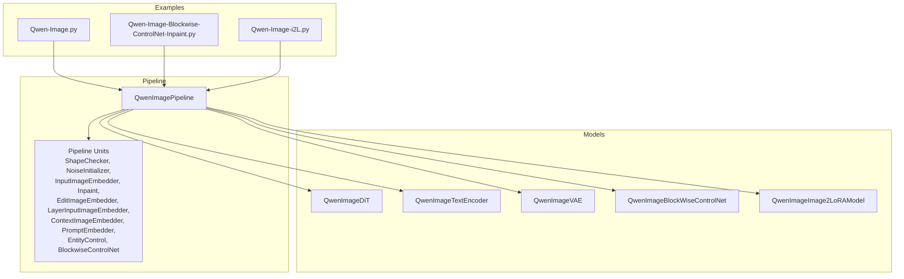
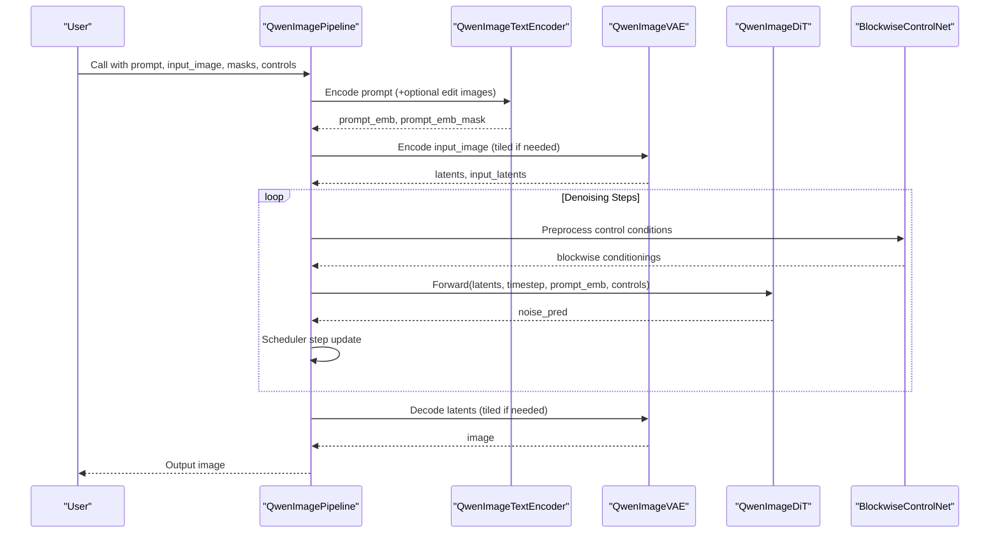
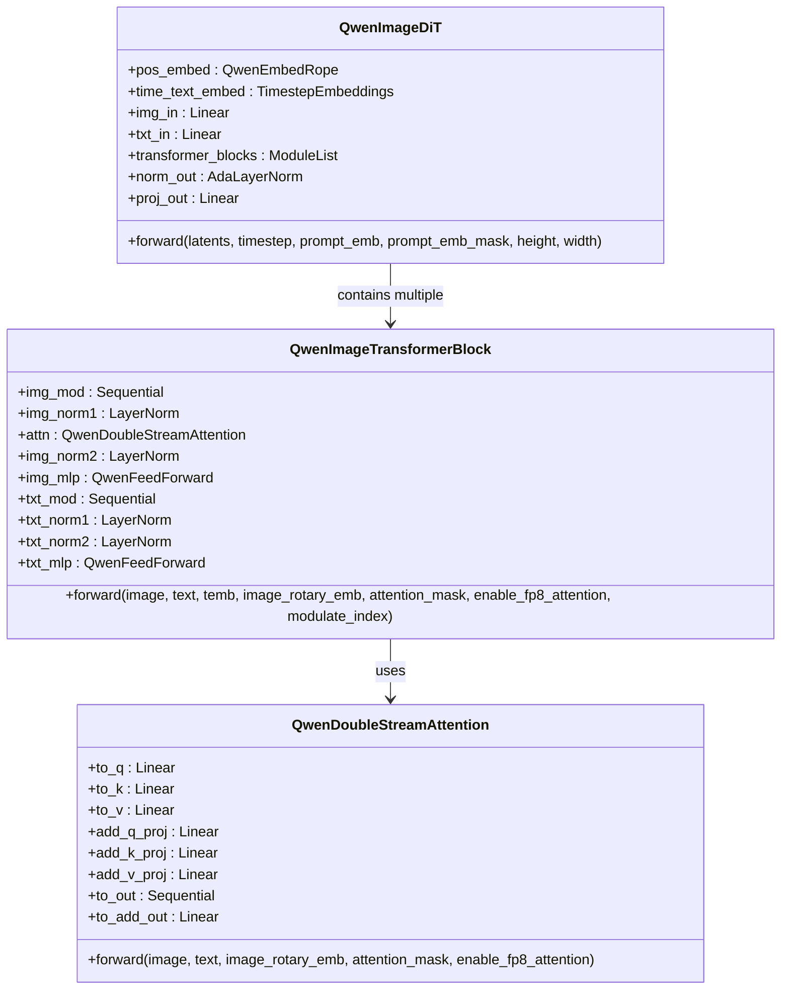
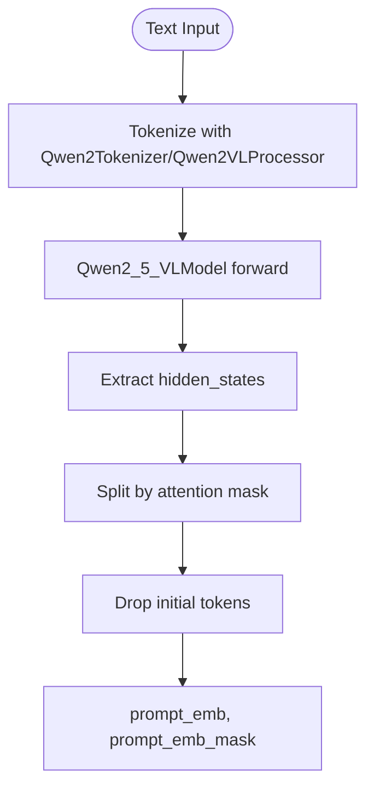
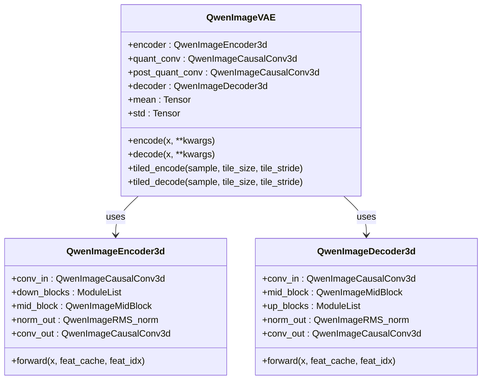
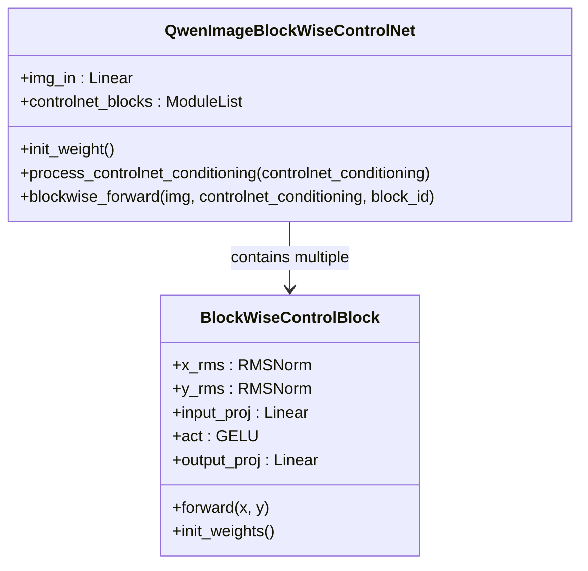
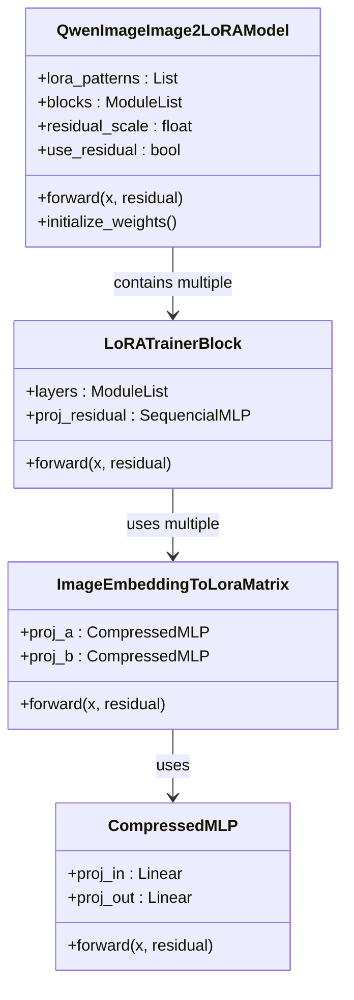
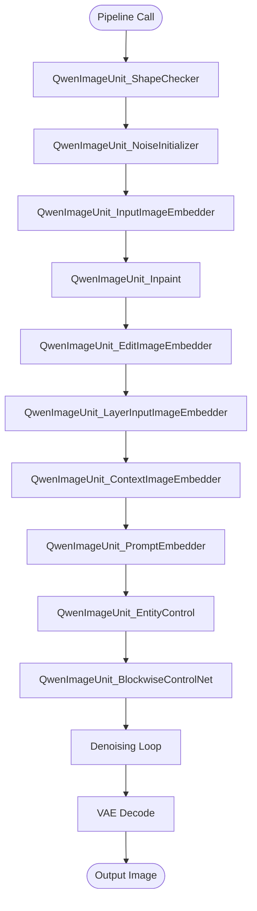
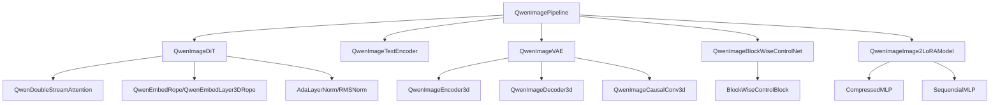

# Qwen-Image Models

<cite>
**Referenced Files in This Document**
- [qwen_image_dit.py](file://diffsynth/models/qwen_image_dit.py)
- [qwen_image_text_encoder.py](file://diffsynth/models/qwen_image_text_encoder.py)
- [qwen_image_vae.py](file://diffsynth/models/qwen_image_vae.py)
- [qwen_image_controlnet.py](file://diffsynth/models/qwen_image_controlnet.py)
- [qwen_image_image2lora.py](file://diffsynth/models/qwen_image_image2lora.py)
- [qwen_image.py](file://diffsynth/pipelines/qwen_image.py)
- [Qwen-Image.md](file://docs/en/Model_Details/Qwen-Image.md)
- [Qwen-Image.py](file://examples/qwen_image/model_inference/Qwen-Image.py)
- [Qwen-Image-Blockwise-ControlNet-Inpaint.py](file://examples/qwen_image/model_inference/Qwen-Image-Blockwise-ControlNet-Inpaint.py)
- [Qwen-Image-i2L.py](file://examples/qwen_image/model_inference/Qwen-Image-i2L.py)
</cite>

## Table of Contents
1. [Introduction](#introduction)
2. [Project Structure](#project-structure)
3. [Core Components](#core-components)
4. [Architecture Overview](#architecture-overview)
5. [Detailed Component Analysis](#detailed-component-analysis)
6. [Dependency Analysis](#dependency-analysis)
7. [Performance Considerations](#performance-considerations)
8. [Troubleshooting Guide](#troubleshooting-guide)
9. [Conclusion](#conclusion)
10. [Appendices](#appendices)

## Introduction
This document provides comprehensive documentation for the Qwen-Image model implementations focused on image understanding and editing. It details:
- The DiT architecture optimized for image processing with multimodal attention and 3D RoPE embeddings
- Text encoder integration for multimodal prompts and image-conditioned text encoding
- VAE components enabling latent space operations and tiled inference for high-resolution images
- ControlNet integration via blockwise conditioning for precise, localized edits
- Image-to-LoRA conversion capabilities to generate LoRA weights from reference images
- Complete pipeline orchestration for generation, editing, inpainting, and layered control workflows
- Practical examples, control mechanisms, and performance optimization techniques for high-resolution image processing

## Project Structure
The Qwen-Image implementation is organized into modular components under diffsynth/models and orchestrated by a unified pipeline:
- Model modules: DiT backbone, text encoder, VAE, blockwise ControlNet, and image-to-LoRA converters
- Pipeline: A unit-based pipeline that composes preprocessing, conditioning, denoising, and decoding steps
- Examples: Inference scripts demonstrating text-to-image, blockwise ControlNet inpainting, and image-to-LoRA workflows



**Diagram sources**
- [qwen_image.py:25-98](file://diffsynth/pipelines/qwen_image.py#L25-L98)
- [qwen_image_dit.py:590-728](file://diffsynth/models/qwen_image_dit.py#L590-L728)
- [qwen_image_text_encoder.py:5-146](file://diffsynth/models/qwen_image_text_encoder.py#L5-L146)
- [qwen_image_vae.py:643-754](file://diffsynth/models/qwen_image_vae.py#L643-L754)
- [qwen_image_controlnet.py:29-57](file://diffsynth/models/qwen_image_controlnet.py#L29-L57)
- [qwen_image_image2lora.py:74-129](file://diffsynth/models/qwen_image_image2lora.py#L74-L129)

**Section sources**
- [Qwen-Image.md:1-206](file://docs/en/Model_Details/Qwen-Image.md#L1-L206)
- [qwen_image.py:25-98](file://diffsynth/pipelines/qwen_image.py#L25-L98)

## Core Components
- QwenImageDiT: Diffusion transformer backbone with double-stream attention (image + text), 3D RoPE positional encodings, and efficient flash attention support
- QwenImageTextEncoder: Multimodal text encoder based on Qwen2_5_VL, producing hidden states for prompt conditioning
- QwenImageVAE: Causal 3D VAE with encoder/decoder blocks, RMS normalization, and tiled encode/decode for memory efficiency
- QwenImageBlockWiseControlNet: Blockwise ControlNet providing per-block conditioning signals for precise edits
- QwenImageImage2LoRAModel: Converts images into LoRA matrices through compressed MLPs and residual projections

Key responsibilities:
- DiT performs noise prediction over latents guided by text and optional control conditions
- Text encoder transforms prompts and optional image inputs into token embeddings
- VAE maps pixel-space images to/from latent representations
- Blockwise ControlNet injects spatially-aware conditioning at each transformer block
- Image-to-LoRA generates LoRA weights conditioned on reference images

**Section sources**
- [qwen_image_dit.py:362-588](file://diffsynth/models/qwen_image_dit.py#L362-L588)
- [qwen_image_text_encoder.py:5-146](file://diffsynth/models/qwen_image_text_encoder.py#L5-L146)
- [qwen_image_vae.py:345-640](file://diffsynth/models/qwen_image_vae.py#L345-L640)
- [qwen_image_controlnet.py:6-57](file://diffsynth/models/qwen_image_controlnet.py#L6-L57)
- [qwen_image_image2lora.py:4-129](file://diffsynth/models/qwen_image_image2lora.py#L4-L129)

## Architecture Overview
The Qwen-Image system follows a diffusion-based generative architecture:
- Latent space modeling via VAE
- Denoising process driven by DiT with multimodal conditioning
- Optional ControlNet signals injected per transformer block
- Text and image prompts encoded into embeddings for cross-attention
- Tiled inference for high-resolution images to manage VRAM



**Diagram sources**
- [qwen_image.py:100-197](file://diffsynth/pipelines/qwen_image.py#L100-L197)
- [qwen_image_dit.py:696-728](file://diffsynth/models/qwen_image_dit.py#L696-L728)
- [qwen_image_vae.py:732-754](file://diffsynth/models/qwen_image_vae.py#L732-L754)
- [qwen_image_controlnet.py:52-57](file://diffsynth/models/qwen_image_controlnet.py#L52-L57)

## Detailed Component Analysis

### DiT Architecture (QwenImageDiT)
The DiT backbone implements a dual-stream transformer with:
- Double-stream attention combining image and text tokens
- 3D RoPE positional encodings for spatio-temporal awareness
- Efficient flash attention with optional FP8 support
- Adaptive modulation via AdaLayerNorm and SiLU activations



**Diagram sources**
- [qwen_image_dit.py:590-728](file://diffsynth/models/qwen_image_dit.py#L590-L728)
- [qwen_image_dit.py:434-588](file://diffsynth/models/qwen_image_dit.py#L434-L588)
- [qwen_image_dit.py:362-432](file://diffsynth/models/qwen_image_dit.py#L362-L432)

**Section sources**
- [qwen_image_dit.py:14-39](file://diffsynth/models/qwen_image_dit.py#L14-L39)
- [qwen_image_dit.py:60-166](file://diffsynth/models/qwen_image_dit.py#L60-L166)
- [qwen_image_dit.py:228-341](file://diffsynth/models/qwen_image_dit.py#L228-L341)
- [qwen_image_dit.py:343-361](file://diffsynth/models/qwen_image_dit.py#L343-L361)
- [qwen_image_dit.py:362-432](file://diffsynth/models/qwen_image_dit.py#L362-L432)
- [qwen_image_dit.py:434-588](file://diffsynth/models/qwen_image_dit.py#L434-L588)
- [qwen_image_dit.py:590-728](file://diffsynth/models/qwen_image_dit.py#L590-L728)

### Text Encoder Integration (QwenImageTextEncoder)
The text encoder leverages Qwen2_5_VL for multimodal understanding:
- Supports both text-only and image-conditioned text encoding
- Produces hidden states for prompt embeddings
- Handles variable-length sequences with attention masks
- Integrates with processor for image-text tokenization



**Diagram sources**
- [qwen_image_text_encoder.py:5-146](file://diffsynth/models/qwen_image_text_encoder.py#L5-L146)
- [qwen_image.py:357-438](file://diffsynth/pipelines/qwen_image.py#L357-L438)

**Section sources**
- [qwen_image_text_encoder.py:5-146](file://diffsynth/models/qwen_image_text_encoder.py#L5-L146)
- [qwen_image.py:357-438](file://diffsynth/pipelines/qwen_image.py#L357-L438)

### VAE Components (QwenImageVAE)
The VAE enables latent space operations with causal 3D convolutions:
- Encoder-decoder architecture with residual blocks and attention
- RMS normalization for stable training
- Tiled encoding/decoding for high-resolution images
- Causal convolution with feature caching for temporal consistency



**Diagram sources**
- [qwen_image_vae.py:643-754](file://diffsynth/models/qwen_image_vae.py#L643-L754)
- [qwen_image_vae.py:345-451](file://diffsynth/models/qwen_image_vae.py#L345-L451)
- [qwen_image_vae.py:524-640](file://diffsynth/models/qwen_image_vae.py#L524-L640)

**Section sources**
- [qwen_image_vae.py:9-52](file://diffsynth/models/qwen_image_vae.py#L9-L52)
- [qwen_image_vae.py:55-79](file://diffsynth/models/qwen_image_vae.py#L55-L79)
- [qwen_image_vae.py:82-154](file://diffsynth/models/qwen_image_vae.py#L82-L154)
- [qwen_image_vae.py:157-200](file://diffsynth/models/qwen_image_vae.py#L157-L200)
- [qwen_image_vae.py:219-302](file://diffsynth/models/qwen_image_vae.py#L219-L302)
- [qwen_image_vae.py:305-342](file://diffsynth/models/qwen_image_vae.py#L305-L342)
- [qwen_image_vae.py:345-451](file://diffsynth/models/qwen_image_vae.py#L345-L451)
- [qwen_image_vae.py:454-521](file://diffsynth/models/qwen_image_vae.py#L454-L521)
- [qwen_image_vae.py:524-640](file://diffsynth/models/qwen_image_vae.py#L524-L640)
- [qwen_image_vae.py:643-754](file://diffsynth/models/qwen_image_vae.py#L643-L754)

### ControlNet Integration (Blockwise ControlNet)
Blockwise ControlNet provides per-transformer-block conditioning:
- Linear projection of control conditions into DiT dimensionality
- Per-block application with zero-initialized output projections
- Support for inpainting masks and other spatial controls



**Diagram sources**
- [qwen_image_controlnet.py:29-57](file://diffsynth/models/qwen_image_controlnet.py#L29-L57)
- [qwen_image_controlnet.py:6-27](file://diffsynth/models/qwen_image_controlnet.py#L6-L27)

**Section sources**
- [qwen_image_controlnet.py:6-27](file://diffsynth/models/qwen_image_controlnet.py#L6-L27)
- [qwen_image_controlnet.py:29-57](file://diffsynth/models/qwen_image_controlnet.py#L29-L57)

### Image-to-LoRA Conversion
Image-to-LoRA converts reference images into LoRA weights:
- Compressed MLPs project image embeddings to LoRA matrix dimensions
- Residual connections enhance representation capacity
- Multiple scales (style, coarse, fine) for different levels of detail



**Diagram sources**
- [qwen_image_image2lora.py:74-129](file://diffsynth/models/qwen_image_image2lora.py#L74-L129)
- [qwen_image_image2lora.py:49-72](file://diffsynth/models/qwen_image_image2lora.py#L49-L72)
- [qwen_image_image2lora.py:17-30](file://diffsynth/models/qwen_image_image2lora.py#L17-L30)
- [qwen_image_image2lora.py:4-15](file://diffsynth/models/qwen_image_image2lora.py#L4-L15)

**Section sources**
- [qwen_image_image2lora.py:4-15](file://diffsynth/models/qwen_image_image2lora.py#L4-L15)
- [qwen_image_image2lora.py:17-30](file://diffsynth/models/qwen_image_image2lora.py#L17-L30)
- [qwen_image_image2lora.py:32-47](file://diffsynth/models/qwen_image_image2lora.py#L32-L47)
- [qwen_image_image2lora.py:49-72](file://diffsynth/models/qwen_image_image2lora.py#L49-L72)
- [qwen_image_image2lora.py:74-129](file://diffsynth/models/qwen_image_image2lora.py#L74-L129)

### Pipeline Orchestration
The pipeline orchestrates all components through a unit-based architecture:
- Shape checking and validation
- Noise initialization
- Image embedding and inpainting preparation
- Prompt encoding with multimodal support
- Entity control for region-specific editing
- Blockwise ControlNet conditioning
- Denoising loop with CFG guidance
- VAE decoding with tiling support



**Diagram sources**
- [qwen_image.py:25-98](file://diffsynth/pipelines/qwen_image.py#L25-L98)
- [qwen_image.py:229-238](file://diffsynth/pipelines/qwen_image.py#L229-L238)
- [qwen_image.py:242-254](file://diffsynth/pipelines/qwen_image.py#L242-L254)
- [qwen_image.py:258-284](file://diffsynth/pipelines/qwen_image.py#L258-L284)
- [qwen_image.py:338-354](file://diffsynth/pipelines/qwen_image.py#L338-L354)
- [qwen_image.py:566-607](file://diffsynth/pipelines/qwen_image.py#L566-L607)
- [qwen_image.py:321-336](file://diffsynth/pipelines/qwen_image.py#L321-L336)
- [qwen_image.py:719-736](file://diffsynth/pipelines/qwen_image.py#L719-L736)
- [qwen_image.py:357-438](file://diffsynth/pipelines/qwen_image.py#L357-L438)
- [qwen_image.py:441-520](file://diffsynth/pipelines/qwen_image.py#L441-L520)
- [qwen_image.py:523-564](file://diffsynth/pipelines/qwen_image.py#L523-L564)

**Section sources**
- [qwen_image.py:25-98](file://diffsynth/pipelines/qwen_image.py#L25-L98)
- [qwen_image.py:100-197](file://diffsynth/pipelines/qwen_image.py#L100-L197)

## Dependency Analysis
The Qwen-Image system exhibits clear separation of concerns with minimal coupling:
- Pipeline depends on model interfaces but not internal implementations
- Models are self-contained with well-defined input/output contracts
- ControlNet integrates at specific transformer blocks without modifying core logic
- Image-to-LoRA operates independently of the main generation pipeline



**Diagram sources**
- [qwen_image.py:25-98](file://diffsynth/pipelines/qwen_image.py#L25-L98)
- [qwen_image_dit.py:362-588](file://diffsynth/models/qwen_image_dit.py#L362-L588)
- [qwen_image_vae.py:345-640](file://diffsynth/models/qwen_image_vae.py#L345-L640)
- [qwen_image_controlnet.py:6-57](file://diffsynth/models/qwen_image_controlnet.py#L6-L57)
- [qwen_image_image2lora.py:4-129](file://diffsynth/models/qwen_image_image2lora.py#L4-L129)

**Section sources**
- [qwen_image.py:25-98](file://diffsynth/pipelines/qwen_image.py#L25-L98)
- [qwen_image_dit.py:590-728](file://diffsynth/models/qwen_image_dit.py#L590-L728)
- [qwen_image_vae.py:643-754](file://diffsynth/models/qwen_image_vae.py#L643-L754)
- [qwen_image_controlnet.py:29-57](file://diffsynth/models/qwen_image_controlnet.py#L29-L57)
- [qwen_image_image2lora.py:74-129](file://diffsynth/models/qwen_image_image2lora.py#L74-L129)

## Performance Considerations
Several optimization techniques are implemented for high-resolution image processing:

### Memory Management
- Tiled VAE encoding/decoding reduces VRAM usage for large images
- Gradient checkpointing for memory-efficient training
- VRAM management with dynamic model loading/unloading
- Feature caching in causal convolutions for temporal consistency

### Computational Efficiency
- Flash attention with optional FP8 precision for faster computation
- Efficient RoPE caching for repeated positional encodings
- Batched processing of multiple images and prompts
- Optimized tensor reshaping and rearrangement operations

### High-Resolution Processing
- Dynamic resolution handling with 16-pixel divisibility constraints
- Automatic image resizing for optimal aspect ratios
- Tiling parameters (tile_size, tile_stride) for memory-constrained environments
- Progressive refinement through layered control mechanisms

**Section sources**
- [qwen_image_vae.py:710-730](file://diffsynth/models/qwen_image_vae.py#L710-L730)
- [qwen_image_dit.py:14-39](file://diffsynth/models/qwen_image_dit.py#L14-L39)
- [qwen_image_dit.py:94-120](file://diffsynth/models/qwen_image_dit.py#L94-L120)
- [qwen_image.py:140-148](file://diffsynth/pipelines/qwen_image.py#L140-L148)

## Troubleshooting Guide

### Common Issues and Solutions

**VRAM Exhaustion**
- Enable tiled VAE processing: `tiled=True` with appropriate `tile_size` and `tile_stride`
- Use low VRAM model configurations from example scripts
- Reduce batch size or image resolution
- Enable gradient checkpointing during training

**Memory Leaks**
- Ensure proper model cleanup after inference
- Clear intermediate tensors in custom pipelines
- Monitor GPU memory usage with profiling tools

**Quality Issues**
- Adjust CFG scale for better prompt adherence
- Tune denoising strength for image-to-image tasks
- Verify input image preprocessing and normalization
- Check prompt length limitations (model trained on ~512 tokens)

**ControlNet Problems**
- Validate mask formats and preprocessing
- Ensure control images match expected dimensions
- Check ControlNet weight scaling parameters
- Verify inpainting mask compatibility

**Section sources**
- [qwen_image.py:338-354](file://diffsynth/pipelines/qwen_image.py#L338-L354)
- [qwen_image.py:523-564](file://diffsynth/pipelines/qwen_image.py#L523-L564)
- [Qwen-Image.md:120-152](file://docs/en/Model_Details/Qwen-Image.md#L120-L152)

## Conclusion
The Qwen-Image implementation provides a comprehensive framework for image understanding and editing tasks. The modular architecture separates concerns effectively while maintaining flexibility for various use cases. Key strengths include:

- Robust DiT backbone with multimodal attention and efficient attention mechanisms
- Flexible text encoder supporting both text-only and image-conditioned prompts
- Memory-efficient VAE with tiled processing for high-resolution images
- Precise ControlNet integration for localized editing capabilities
- Innovative image-to-LoRA conversion for style transfer and content adaptation
- Comprehensive pipeline orchestration with extensive customization options

The system supports diverse workflows from simple text-to-image generation to complex editing tasks with multiple controls and conditioning mechanisms. Performance optimizations ensure practical deployment on consumer hardware while maintaining high-quality outputs.

## Appendices

### Example Workflows

#### Basic Text-to-Image Generation
```python
from diffsynth.pipelines.qwen_image import QwenImagePipeline, ModelConfig

pipe = QwenImagePipeline.from_pretrained(
    torch_dtype=torch.bfloat16,
    device="cuda",
    model_configs=[
        ModelConfig(model_id="Qwen/Qwen-Image", origin_file_pattern="transformer/diffusion_pytorch_model*.safetensors"),
        ModelConfig(model_id="Qwen/Qwen-Image", origin_file_pattern="text_encoder/model*.safetensors"),
        ModelConfig(model_id="Qwen/Qwen-Image", origin_file_pattern="vae/diffusion_pytorch_model.safetensors"),
    ],
    tokenizer_config=ModelConfig(model_id="Qwen/Qwen-Image", origin_file_pattern="tokenizer/"),
)
prompt = "a beautiful landscape"
image = pipe(prompt, seed=0, num_inference_steps=40)
image.save("image.jpg")
```

#### Blockwise ControlNet Inpainting
```python
from diffsynth.pipelines.qwen_image import QwenImagePipeline, ModelConfig, ControlNetInput

pipe = QwenImagePipeline.from_pretrained(
    torch_dtype=torch.bfloat16,
    device="cuda",
    model_configs=[
        ModelConfig(model_id="Qwen/Qwen-Image", origin_file_pattern="transformer/diffusion_pytorch_model*.safetensors"),
        ModelConfig(model_id="Qwen/Qwen-Image", origin_file_pattern="text_encoder/model*.safetensors"),
        ModelConfig(model_id="Qwen/Qwen-Image", origin_file_pattern="vae/diffusion_pytorch_model.safetensors"),
        ModelConfig(model_id="DiffSynth-Studio/Qwen-Image-Blockwise-ControlNet-Inpaint", origin_file_pattern="model.safetensors"),
    ],
    tokenizer_config=ModelConfig(model_id="Qwen/Qwen-Image", origin_file_pattern="tokenizer/"),
)
controlnet_image = Image.open("input.jpg").convert("RGB").resize((1328, 1328))
inpaint_mask = Image.open("mask.jpg").convert("RGB").resize((1328, 1328))
image = pipe(
    prompt, seed=0,
    input_image=controlnet_image, inpaint_mask=inpaint_mask,
    blockwise_controlnet_inputs=[ControlNetInput(image=controlnet_image, inpaint_mask=inpaint_mask)],
    num_inference_steps=40,
)
```

#### Image-to-LoRA Conversion
```python
from diffsynth.pipelines.qwen_image import QwenImagePipeline, ModelConfig, QwenImageUnit_Image2LoRAEncode, QwenImageUnit_Image2LoRADecode

pipe = QwenImagePipeline.from_pretrained(
    torch_dtype=torch.bfloat16,
    device="cuda",
    model_configs=[
        ModelConfig(model_id="DiffSynth-Studio/General-Image-Encoders", origin_file_pattern="SigLIP2-G384/model.safetensors"),
        ModelConfig(model_id="DiffSynth-Studio/General-Image-Encoders", origin_file_pattern="DINOv3-7B/model.safetensors"),
        ModelConfig(model_id="DiffSynth-Studio/Qwen-Image-i2L", origin_file_pattern="Qwen-Image-i2L-Style.safetensors"),
    ],
    processor_config=ModelConfig(model_id="Qwen/Qwen-Image-Edit", origin_file_pattern="processor/"),
)
images = [Image.open(f"style_{i}.jpg") for i in range(5)]
embs = QwenImageUnit_Image2LoRAEncode().process(pipe, image2lora_images=images)
lora = QwenImageUnit_Image2LoRADecode().process(pipe, **embs)["lora"]
save_file(lora, "model_style.safetensors")
```

**Section sources**
- [Qwen-Image.py:1-18](file://examples/qwen_image/model_inference/Qwen-Image.py#L1-L18)
- [Qwen-Image-Blockwise-ControlNet-Inpaint.py:1-34](file://examples/qwen_image/model_inference/Qwen-Image-Blockwise-ControlNet-Inpaint.py#L1-L34)
- [Qwen-Image-i2L.py:1-111](file://examples/qwen_image/model_inference/Qwen-Image-i2L.py#L1-L111)