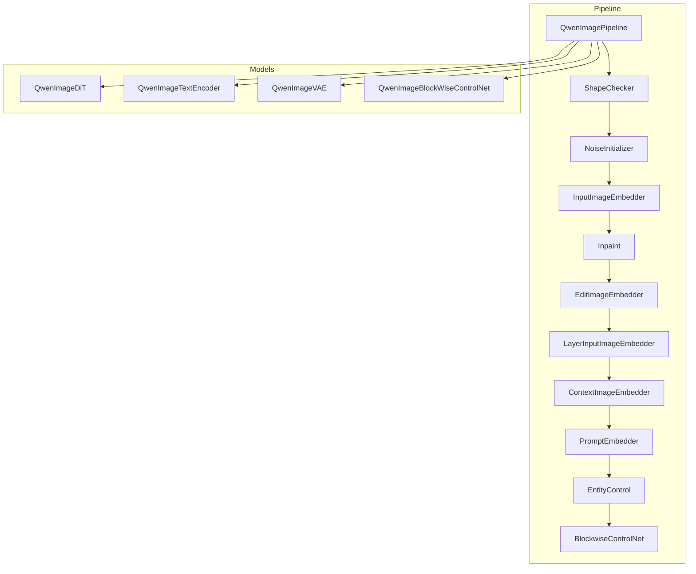
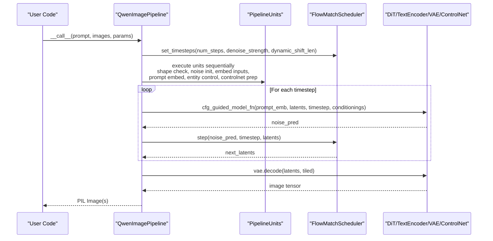
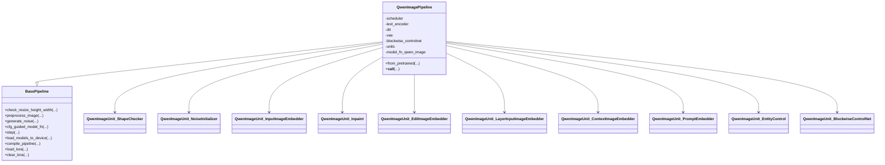
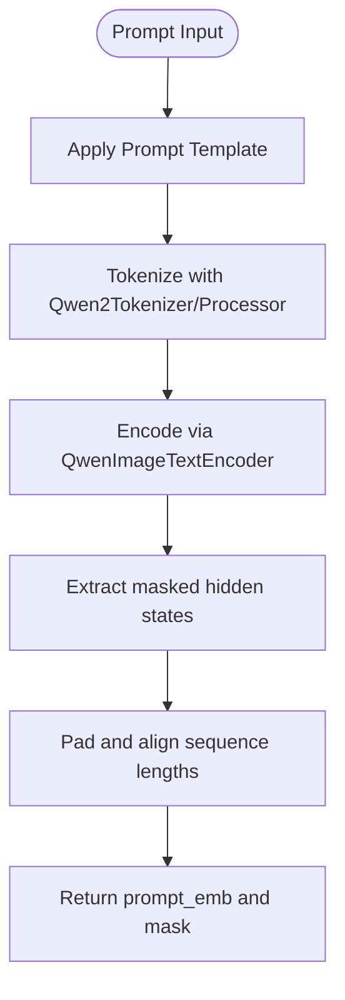
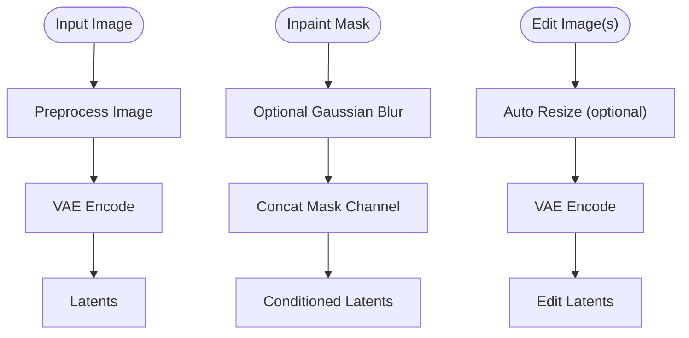
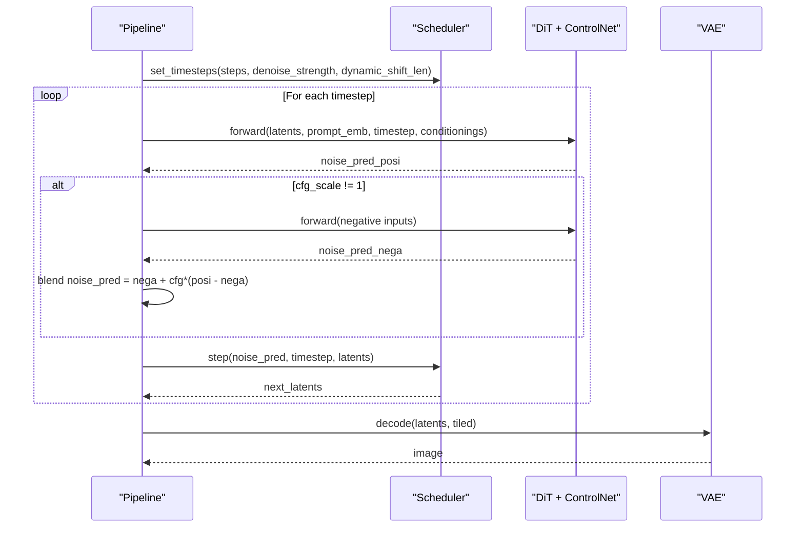
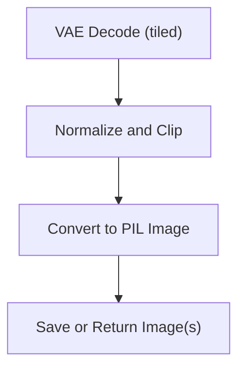
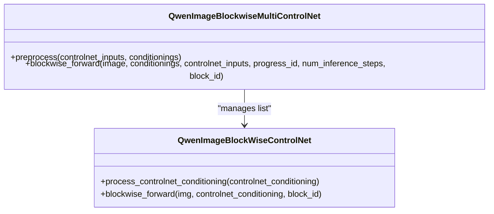
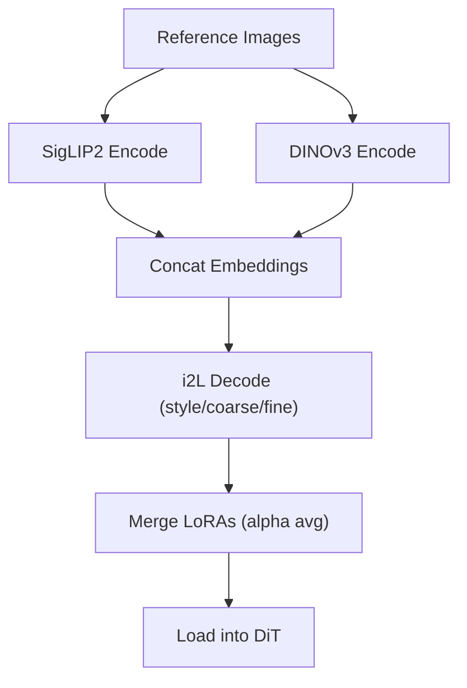
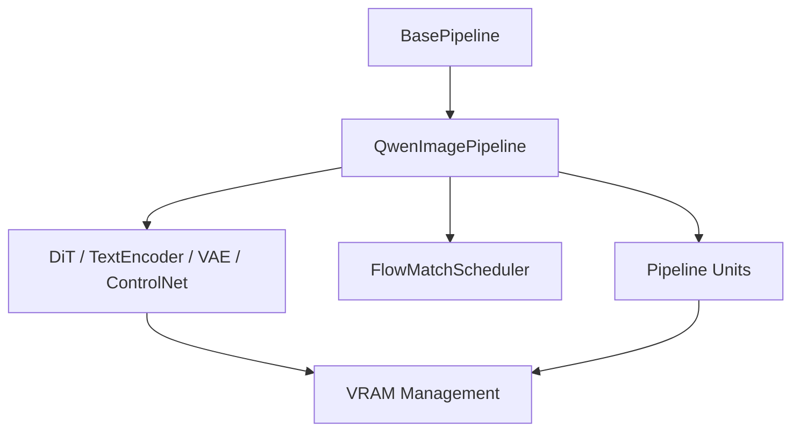

# Qwen-Image Pipeline

<cite>
**Referenced Files in This Document**
- [qwen_image.py](file://diffsynth/pipelines/qwen_image.py)
- [base_pipeline.py](file://diffusion/base_pipeline.py)
- [flow_match.py](file://diffusion/flow_match.py)
- [qwen_image_dit.py](file://models/qwen_image_dit.py)
- [qwen_image_text_encoder.py](file://models/qwen_image_text_encoder.py)
- [qwen_image_vae.py](file://models/qwen_image_vae.py)
- [qwen_image_controlnet.py](file://models/qwen_image_controlnet.py)
- [Qwen-Image.py](file://examples/qwen_image/model_inference/Qwen-Image.py)
- [Qwen-Image-Edit.py](file://examples/qwen_image/model_inference/Qwen-Image-Edit.py)
- [Qwen-Image-Layered.py](file://examples/qwen_image/model_inference/Qwen-Image-Layered.py)
- [Qwen-Image-i2L.py](file://examples/qwen_image/model_inference/Qwen-Image-i2L.py)
</cite>

## Table of Contents
1. [Introduction](#introduction)
2. [Project Structure](#project-structure)
3. [Core Components](#core-components)
4. [Architecture Overview](#architecture-overview)
5. [Detailed Component Analysis](#detailed-component-analysis)
6. [Dependency Analysis](#dependency-analysis)
7. [Performance Considerations](#performance-considerations)
8. [Troubleshooting Guide](#troubleshooting-guide)
9. [Conclusion](#conclusion)
10. [Appendices](#appendices)

## Introduction
This document provides comprehensive documentation for the Qwen-Image pipeline implementation within the DiffSynth framework. It explains the end-to-end workflow from input processing to output generation, covering text encoding, image conditioning, diffusion steps, and post-processing. It also documents configuration options, parameter scheduling, execution modes, advanced features such as batch processing, streaming inference, memory optimization techniques, common editing workflows, customization points, integration with external tools, error handling, progress monitoring, and debugging strategies.

## Project Structure
The Qwen-Image pipeline is implemented as a modular pipeline that composes several units (preprocessors, encoders, control modules, and decoders) orchestrated by a base pipeline runner. The core files include:
- Pipeline definition and unit orchestration
- Base pipeline utilities and VRAM management
- Scheduler for flow matching
- Model components: DiT transformer, text encoder, VAE, and blockwise ControlNet
- Example scripts demonstrating usage patterns

**Diagram sources**
- [qwen_image.py:25-59](file://diffsynth/pipelines/qwen_image.py#L25-L59)
- [base_pipeline.py:61-115](file://diffusion/base_pipeline.py#L61-L115)

**Section sources**
- [qwen_image.py:25-59](file://diffsynth/pipelines/qwen_image.py#L25-L59)
- [base_pipeline.py:61-115](file://diffusion/base_pipeline.py#L61-L115)

## Core Components
- QwenImagePipeline: Orchestrates the entire generation process, including scheduler setup, unit execution, CFG-guided denoising loop, and VAE decoding.
- BasePipeline: Provides shared utilities for preprocessing, device/dtype management, VRAM offloading/onloading, noise generation, step updates, CFG guidance, LoRA loading, model compilation, and unit graph splitting.
- FlowMatchScheduler: Implements time-step scheduling for flow-matching models, including Qwen-Image specific schedules and dynamic shift parameters.
- Models:
  - QwenImageDiT: Transformer-based diffusion backbone with dual-stream attention, RoPE embeddings, and optional type embedding for conditions.
  - QwenImageTextEncoder: Multimodal text encoder based on Qwen2.5-VL architecture, returning hidden states for prompt conditioning.
  - QwenImageVAE: Causal 3D VAE with tiled encode/decode support for memory efficiency.
  - QwenImageBlockWiseControlNet: Block-wise control module applied per DiT layer with scale modulation.

Key responsibilities:
- Input validation and shape normalization
- Text and image tokenization/embedding
- Conditioning via multiple inputs (edit images, context images, layer inputs, entity masks)
- Iterative denoising with CFG and optional inpainting blending
- Tiled decoding for high-resolution outputs
- Optional compilation and VRAM-aware execution

**Section sources**
- [qwen_image.py:25-197](file://diffsynth/pipelines/qwen_image.py#L25-L197)
- [base_pipeline.py:61-373](file://diffusion/base_pipeline.py#L61-L373)
- [flow_match.py:5-74](file://diffusion/flow_match.py#L5-L74)
- [qwen_image_dit.py:590-729](file://models/qwen_image_dit.py#L590-L729)
- [qwen_image_text_encoder.py:5-191](file://models/qwen_image_text_encoder.py#L5-L191)
- [qwen_image_vae.py:643-754](file://models/qwen_image_vae.py#L643-L754)
- [qwen_image_controlnet.py:29-57](file://models/qwen_image_controlnet.py#L29-L57)

## Architecture Overview
The Qwen-Image pipeline follows a unit-driven architecture where each unit encapsulates a specific transformation or computation. The pipeline composes these units into a directed acyclic graph, executes them in dependency order, and integrates model calls within a CFG-guided denoising loop.

**Diagram sources**
- [qwen_image.py:100-197](file://diffsynth/pipelines/qwen_image.py#L100-L197)
- [base_pipeline.py:321-340](file://diffusion/base_pipeline.py#L321-L340)
- [flow_match.py:214-236](file://diffusion/flow_match.py#L214-L236)

**Section sources**
- [qwen_image.py:100-197](file://diffsynth/pipelines/qwen_image.py#L100-L197)
- [base_pipeline.py:321-340](file://diffusion/base_pipeline.py#L321-L340)
- [flow_match.py:214-236](file://diffusion/flow_match.py#L214-L236)

## Detailed Component Analysis

### QwenImagePipeline and Unit Orchestration
- Initialization sets up the scheduler, model references, tokenizer/processor, and unit list.
- The main call configures timesteps, prepares shared/positive/negative inputs, runs units, performs CFG-guided denoising, and decodes final images.
- Units are executed via a runner that supports separate CFG branches and model-specific on-demand loading.

**Diagram sources**
- [qwen_image.py:25-59](file://diffsynth/pipelines/qwen_image.py#L25-L59)
- [base_pipeline.py:61-115](file://diffusion/base_pipeline.py#L61-L115)

**Section sources**
- [qwen_image.py:25-59](file://diffsynth/pipelines/qwen_image.py#L25-L59)
- [base_pipeline.py:61-115](file://diffusion/base_pipeline.py#L61-L115)

### Text Encoding and Prompt Handling
- Prompt templates are constructed and tokenized using Qwen2Tokenizer or Qwen2VLProcessor depending on whether edit images are provided.
- Hidden states are extracted and masked according to attention masks; sequences are padded to a uniform length.
- Entity control allows per-entity prompts and masks to constrain attention between prompts and image regions.

**Diagram sources**
- [qwen_image.py:357-439](file://diffsynth/pipelines/qwen_image.py#L357-L439)
- [qwen_image_text_encoder.py:148-191](file://models/qwen_image_text_encoder.py#L148-L191)

**Section sources**
- [qwen_image.py:357-439](file://diffsynth/pipelines/qwen_image.py#L357-L439)
- [qwen_image_text_encoder.py:148-191](file://models/qwen_image_text_encoder.py#L148-L191)

### Image Conditioning and Inpainting
- Input images are preprocessed and encoded via VAE to latents; if provided, inpaint masks are blurred and integrated into latent channels.
- Edit images can be auto-resized to target area while preserving aspect ratio; multi-image inputs supported.
- Context images and layer inputs are similarly encoded and passed as additional conditionings.

**Diagram sources**
- [qwen_image.py:258-319](file://diffsynth/pipelines/qwen_image.py#L258-L319)
- [qwen_image.py:338-355](file://diffsynth/pipelines/qwen_image.py#L338-L355)
- [qwen_image.py:566-607](file://diffsynth/pipelines/qwen_image.py#L566-L607)

**Section sources**
- [qwen_image.py:258-319](file://diffsynth/pipelines/qwen_image.py#L258-L319)
- [qwen_image.py:338-355](file://diffsynth/pipelines/qwen_image.py#L338-L355)
- [qwen_image.py:566-607](file://diffsynth/pipelines/qwen_image.py#L566-L607)

### Diffusion Steps and CFG Guidance
- The scheduler computes sigmas and timesteps tailored for Qwen-Image, supporting dynamic shift based on image sequence length.
- Each step applies CFG: positive and negative passes compute noise predictions, blended according to cfg_scale.
- Inpainting blends predicted noise with stabilized noise at current timestep using inpaint_mask.

**Diagram sources**
- [qwen_image.py:147-197](file://diffsynth/pipelines/qwen_image.py#L147-L197)
- [flow_match.py:214-236](file://diffusion/flow_match.py#L214-L236)
- [base_pipeline.py:321-340](file://diffusion/base_pipeline.py#L321-L340)

**Section sources**
- [qwen_image.py:147-197](file://diffsynth/pipelines/qwen_image.py#L147-L197)
- [flow_match.py:214-236](file://diffusion/flow_match.py#L214-L236)
- [base_pipeline.py:321-340](file://diffusion/base_pipeline.py#L321-L340)

### Post-Processing and Output Generation
- VAE decoding supports tiled mode to reduce memory pressure for large images.
- Outputs are converted from tensors to PIL Images; layered outputs return multiple images when layer_num is specified.

**Diagram sources**
- [qwen_image.py:188-197](file://diffsynth/pipelines/qwen_image.py#L188-L197)
- [base_pipeline.py:133-148](file://diffusion/base_pipeline.py#L133-L148)

**Section sources**
- [qwen_image.py:188-197](file://diffsynth/pipelines/qwen_image.py#L188-L197)
- [base_pipeline.py:133-148](file://diffusion/base_pipeline.py#L133-L148)

### Blockwise ControlNet Integration
- ControlNet conditionings are processed per controlnet_id and applied block-wise across DiT layers with temporal gating based on progress.
- Masks can be applied to control images before encoding, and concatenated into latents for inpainting-style control.

**Diagram sources**
- [qwen_image.py:200-227](file://diffsynth/pipelines/qwen_image.py#L200-L227)
- [qwen_image_controlnet.py:29-57](file://models/qwen_image_controlnet.py#L29-L57)

**Section sources**
- [qwen_image.py:200-227](file://diffsynth/pipelines/qwen_image.py#L200-L227)
- [qwen_image_controlnet.py:29-57](file://models/qwen_image_controlnet.py#L29-L57)

### Image-to-LoRA (i2L) Workflow
- Encodes reference images using SigLIP2 and DINOv3, optionally combining with Qwen VL embeddings.
- Decodes embeddings into LoRA weights via style/coarse/fine models; merges multiple LoRAs with alpha averaging.
- Enables style transfer and content bias injection into DiT via loaded LoRA.

**Diagram sources**
- [qwen_image.py:609-717](file://diffsynth/pipelines/qwen_image.py#L609-L717)
- [Qwen-Image-i2L.py:13-111](file://examples/qwen_image/model_inference/Qwen-Image-i2L.py#L13-L111)

**Section sources**
- [qwen_image.py:609-717](file://diffsynth/pipelines/qwen_image.py#L609-L717)
- [Qwen-Image-i2L.py:13-111](file://examples/qwen_image/model_inference/Qwen-Image-i2L.py#L13-L111)

## Dependency Analysis
The pipeline exhibits clear separation of concerns:
- BasePipeline provides shared functionality used by all pipelines.
- QwenImagePipeline composes units and models without tight coupling.
- Scheduler is independent and pluggable.
- Models are loaded via a model pool and can be offloaded/onloaded dynamically.

**Diagram sources**
- [base_pipeline.py:61-115](file://diffusion/base_pipeline.py#L61-L115)
- [qwen_image.py:25-59](file://diffsynth/pipelines/qwen_image.py#L25-L59)

**Section sources**
- [base_pipeline.py:61-115](file://diffusion/base_pipeline.py#L61-L115)
- [qwen_image.py:25-59](file://diffsynth/pipelines/qwen_image.py#L25-L59)

## Performance Considerations
- Tiled encoding/decoding reduces peak VRAM usage for high-resolution images.
- torch.compile can be enabled for repeated blocks (e.g., DiT transformer blocks) to accelerate inference.
- VRAM management automatically offloads unused models and clears GPU cache during execution.
- Dynamic shift scheduling adapts mu based on image sequence length for better convergence.
- CFG guidance adds an extra model pass when cfg_scale != 1; consider reducing steps or disabling CFG for speed.

[No sources needed since this section provides general guidance]

## Troubleshooting Guide
Common issues and resolutions:
- Shape mismatches: Ensure height/width are divisible by 16; the pipeline rounds up automatically but may print warnings.
- Long prompts: Exceeding trained token limits may cause unpredictable behavior; shorten prompts or adjust truncation.
- Memory errors: Enable tiled mode for VAE encode/decode; use VRAM management and lower resolution or batch size.
- CFG instability: Reduce cfg_scale or increase steps; verify negative prompt consistency.
- Progress monitoring: Use the provided progress bar callback to track timestep iterations.

**Section sources**
- [base_pipeline.py:97-115](file://diffusion/base_pipeline.py#L97-L115)
- [qwen_image.py:386-396](file://diffsynth/pipelines/qwen_image.py#L386-L396)
- [qwen_image.py:179-186](file://diffsynth/pipelines/qwen_image.py#L179-L186)

## Conclusion
The Qwen-Image pipeline offers a flexible, modular, and efficient framework for text-to-image and image editing tasks. Its unit-based design enables easy extension and customization, while built-in VRAM management and compilation support ensure performance on constrained hardware. With robust scheduling, CFG guidance, and advanced conditioning mechanisms, it supports a wide range of editing workflows and integrations.

[No sources needed since this section summarizes without analyzing specific files]

## Appendices

### Common Editing Workflows
- Basic generation: Provide a prompt and generate an image.
- Image editing: Supply an input image and a prompt describing edits; enable auto-resize to preserve aspect ratio.
- Layered generation: Provide an RGBA image and specify layer_num to extract layers.
- Style transfer: Use i2L to derive LoRA from reference images and apply to generation.

**Section sources**
- [Qwen-Image.py:1-18](file://examples/qwen_image/model_inference/Qwen-Image.py#L1-L18)
- [Qwen-Image-Edit.py:1-26](file://examples/qwen_image/model_inference/Qwen-Image-Edit.py#L1-L26)
- [Qwen-Image-Layered.py:1-37](file://examples/qwen_image/model_inference/Qwen-Image-Layered.py#L1-L37)
- [Qwen-Image-i2L.py:13-111](file://examples/qwen_image/model_inference/Qwen-Image-i2L.py#L13-L111)

### Advanced Features
- Batch processing: Pass lists of images to units that accept multiple inputs (e.g., edit_image, context_image).
- Streaming inference: Process images in tiles via VAE encode/decode to stream results with reduced memory.
- Memory optimization: Enable VRAM management, compile models, and use tiled operations.

**Section sources**
- [qwen_image.py:566-607](file://diffsynth/pipelines/qwen_image.py#L566-L607)
- [qwen_image_vae.py:710-731](file://models/qwen_image_vae.py#L710-L731)
- [base_pipeline.py:342-373](file://diffusion/base_pipeline.py#L342-L373)

### Custom Pipeline Modifications
- Add new units by subclassing PipelineUnit and registering in the units list.
- Modify model_fn_qwen_image to integrate custom conditionings or outputs.
- Extend scheduler settings via FlowMatchScheduler template selection.

**Section sources**
- [base_pipeline.py:14-59](file://diffusion/base_pipeline.py#L14-L59)
- [qwen_image.py:25-59](file://diffsynth/pipelines/qwen_image.py#L25-L59)
- [flow_match.py:5-17](file://diffusion/flow_match.py#L5-L17)