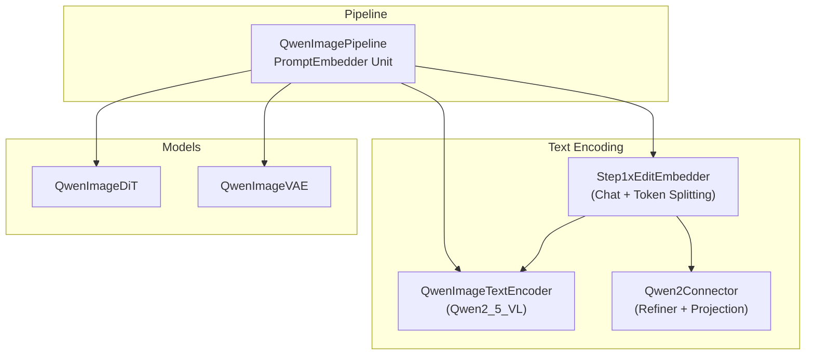
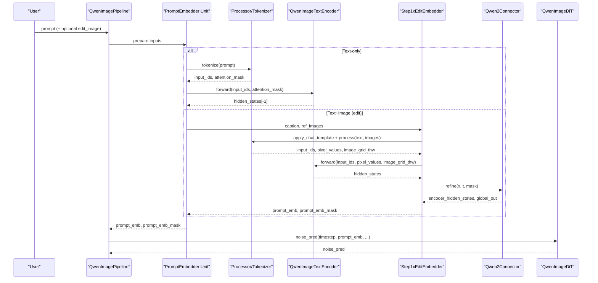
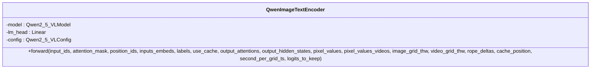
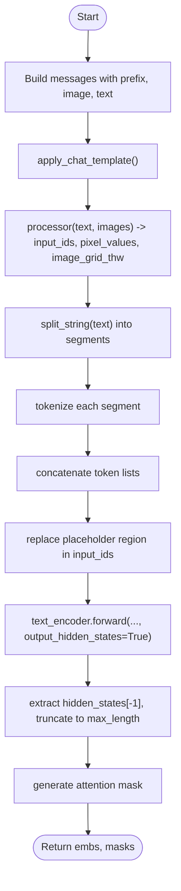
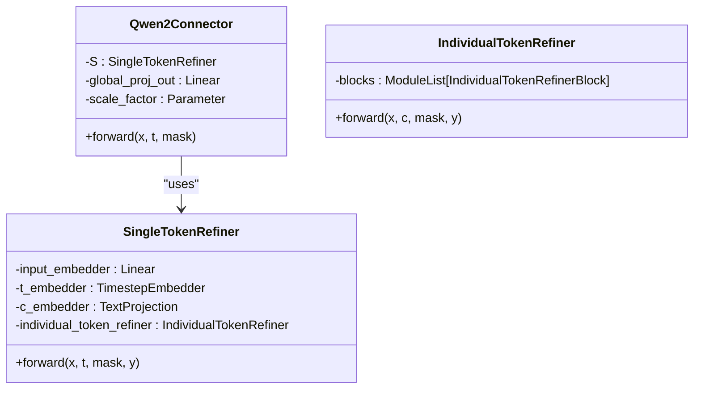
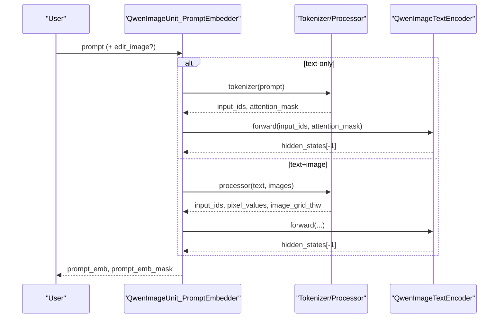
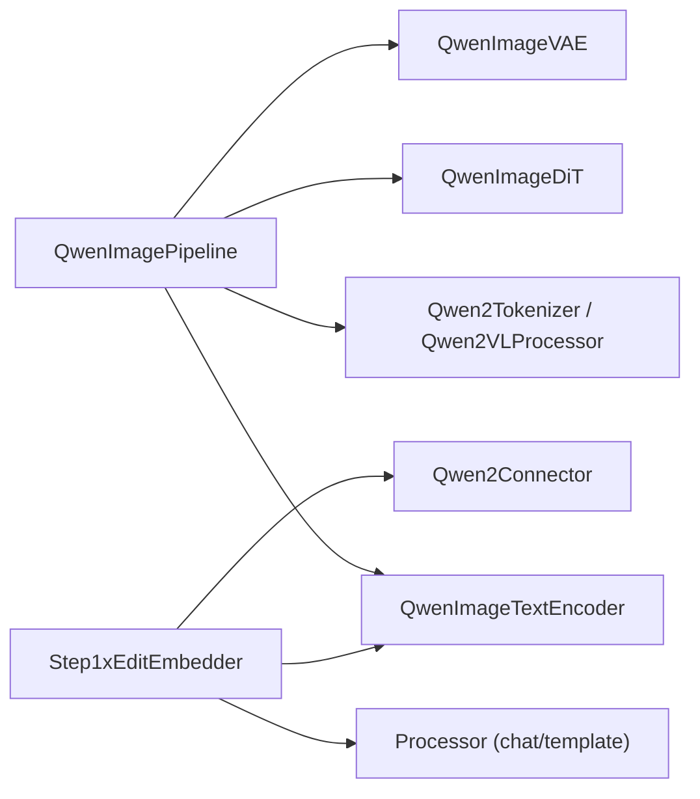

# Text Encoder Integration

<cite>
**Referenced Files in This Document**
- [qwen_image_text_encoder.py](file://diffsynth/models/qwen_image_text_encoder.py)
- [step1x_text_encoder.py](file://diffsynth/models/step1x_text_encoder.py)
- [step1x_connector.py](file://diffsynth/models/step1x_connector.py)
- [qwen_image.py](file://diffsynth/pipelines/qwen_image.py)
- [Qwen-Image.md](file://docs/en/Model_Details/Qwen-Image.md)
- [qwen_image_text_encoder.py (state dict converter)](file://diffsynth/utils/state_dict_converters/qwen_image_text_encoder.py)
- [Qwen-Image.py (example)](file://examples/qwen_image/model_inference/Qwen-Image.py)
- [Qwen-Image-Edit.py (example)](file://examples/qwen_image/model_inference/Qwen-Image-Edit.py)
</cite>

## Table of Contents
1. [Introduction](#introduction)
2. [Project Structure](#project-structure)
3. [Core Components](#core-components)
4. [Architecture Overview](#architecture-overview)
5. [Detailed Component Analysis](#detailed-component-analysis)
6. [Dependency Analysis](#dependency-analysis)
7. [Performance Considerations](#performance-considerations)
8. [Troubleshooting Guide](#troubleshooting-guide)
9. [Conclusion](#conclusion)
10. [Appendices](#appendices)

## Introduction
This document explains how Qwen-Image integrates a text encoder to convert natural language prompts into latent representations that guide image generation and editing. It covers the tokenizer configuration, embedding layers, transformer-based encoding architecture, and the integration with step1x text encoders for enhanced semantic understanding. It also provides guidance on prompt engineering, text conditioning parameters, multimodal fusion techniques, preprocessing, vocabulary management, and performance considerations for long prompts and multilingual support.

## Project Structure
The Qwen-Image text encoder integration is implemented across several modules:
- A wrapper around the Qwen2_5_VL model for text (and optional vision) encoding
- A step1x edit embedder that enhances prompts using a chat-style processor and multi-turn tokenization
- A connector module that refines and projects text embeddings for downstream DiT usage
- The pipeline orchestrating prompt processing, conditioning, and diffusion steps

**Diagram sources**
- [qwen_image.py:25-98](file://diffsynth/pipelines/qwen_image.py#L25-L98)
- [qwen_image_text_encoder.py:5-146](file://diffsynth/models/qwen_image_text_encoder.py#L5-L146)
- [step1x_text_encoder.py:7-26](file://diffsynth/models/step1x_text_encoder.py#L7-L26)
- [step1x_connector.py:633-664](file://diffsynth/models/step1x_connector.py#L633-L664)

**Section sources**
- [qwen_image.py:25-98](file://diffsynth/pipelines/qwen_image.py#L25-L98)
- [Qwen-Image.md:1-52](file://docs/en/Model_Details/Qwen-Image.md#L1-L52)

## Core Components
- QwenImageTextEncoder: Wraps Qwen2_5_VLModel for text encoding; returns hidden states used as prompt embeddings.
- Step1xEditEmbedder: Enhances user prompts via a chat template and multi-segment tokenization; outputs refined embeddings and masks.
- Qwen2Connector: Refines per-token embeddings and produces a global projection for DiT conditioning.
- Pipeline PromptEmbedder Units: Construct templates, tokenize, encode, split, and pad embeddings for positive/negative prompts.

Key responsibilities:
- Tokenizer and processor setup for text-only or text+image inputs
- Template-driven prompt formatting for consistent semantics
- Hidden-state extraction and masking for variable-length sequences
- Optional enhancement via step1x chat-based refinement

**Section sources**
- [qwen_image_text_encoder.py:5-146](file://diffsynth/models/qwen_image_text_encoder.py#L5-L146)
- [step1x_text_encoder.py:7-26](file://diffsynth/models/step1x_text_encoder.py#L7-L26)
- [step1x_connector.py:633-664](file://diffsynth/models/step1x_connector.py#L633-L664)
- [qwen_image.py:357-438](file://diffsynth/pipelines/qwen_image.py#L357-L438)

## Architecture Overview
The text encoder path transforms user prompts into sequence embeddings that condition the DiT during denoising. For editing tasks, a chat-based enhancer and token splitting refine the prompt before encoding.

**Diagram sources**
- [qwen_image.py:357-438](file://diffsynth/pipelines/qwen_image.py#L357-L438)
- [step1x_text_encoder.py:74-195](file://diffsynth/models/step1x_text_encoder.py#L74-L195)
- [step1x_connector.py:633-664](file://diffsynth/models/step1x_connector.py#L633-L664)
- [qwen_image_text_encoder.py:148-190](file://diffsynth/models/qwen_image_text_encoder.py#L148-L190)

## Detailed Component Analysis

### QwenImageTextEncoder
- Architecture: Wraps Qwen2_5_VLModel configured for text (with vision config present but not always used). Uses a large vocabulary and deep transformer stack.
- Embedding layer: Input tokens are embedded via the underlying model’s token embeddings; output is accessed through hidden_states.
- Forward behavior: Returns the last hidden state layer when output_hidden_states=True, which serves as prompt embeddings.

**Diagram sources**
- [qwen_image_text_encoder.py:5-146](file://diffsynth/models/qwen_image_text_encoder.py#L5-L146)

**Section sources**
- [qwen_image_text_encoder.py:5-146](file://diffsynth/models/qwen_image_text_encoder.py#L5-L146)

### Step1xEditEmbedder
- Purpose: Enhance prompts by applying a chat template and splitting long texts into segments for robust tokenization.
- Processing flow:
  - Build messages with system prefix, reference image, and user text
  - Apply chat template and process text/images into tensors
  - Split text into quoted segments to preserve structure
  - Concatenate tokens and replace the original placeholder region
  - Encode via QwenImageTextEncoder and extract hidden states
  - Return embeddings and masks truncated to max_length

**Diagram sources**
- [step1x_text_encoder.py:74-195](file://diffsynth/models/step1x_text_encoder.py#L74-L195)

**Section sources**
- [step1x_text_encoder.py:7-26](file://diffsynth/models/step1x_text_encoder.py#L7-L26)
- [step1x_text_encoder.py:74-195](file://diffsynth/models/step1x_text_encoder.py#L74-L195)

### Qwen2Connector
- Purpose: Refine per-token embeddings and produce a global representation for DiT conditioning.
- Components:
  - SingleTokenRefiner: MLP input embedder, timestep/context embedders, IndividualTokenRefiner blocks
  - Global projection: Mean pooling over masked tokens with learned scale factor
- Output: Refined encoder_hidden_states and a global vector

**Diagram sources**
- [step1x_connector.py:547-631](file://diffsynth/models/step1x_connector.py#L547-L631)
- [step1x_connector.py:633-664](file://diffsynth/models/step1x_connector.py#L633-L664)

**Section sources**
- [step1x_connector.py:547-631](file://diffsynth/models/step1x_connector.py#L547-L631)
- [step1x_connector.py:633-664](file://diffsynth/models/step1x_connector.py#L633-L664)

### Pipeline Prompt Embedding Units
- QwenImageUnit_PromptEmbedder:
  - Constructs system/user templates for text-only or text+image cases
  - Tokenizes with Qwen2Tokenizer or Qwen2VLProcessor
  - Encodes via QwenImageTextEncoder and extracts hidden states
  - Splits hidden states by attention mask and pads to uniform length
- QwenImageUnit_EntityControl:
  - Produces entity-level prompt embeddings and masks for fine-grained control

**Diagram sources**
- [qwen_image.py:357-438](file://diffsynth/pipelines/qwen_image.py#L357-L438)

**Section sources**
- [qwen_image.py:357-438](file://diffsynth/pipelines/qwen_image.py#L357-L438)
- [qwen_image.py:441-519](file://diffsynth/pipelines/qwen_image.py#L441-L519)

## Dependency Analysis
- QwenImagePipeline depends on:
  - QwenImageTextEncoder for text encoding
  - Qwen2Tokenizer and Qwen2VLProcessor for tokenization and multimodal processing
  - QwenImageDiT and QwenImageVAE for generation
- Step1xEditEmbedder depends on QwenImageTextEncoder and uses a processor for chat templating and multimodal inputs
- Qwen2Connector depends on internal building blocks (MLP, TimestepEmbedder, TextProjection, IndividualTokenRefiner)

**Diagram sources**
- [qwen_image.py:25-98](file://diffsynth/pipelines/qwen_image.py#L25-L98)
- [step1x_text_encoder.py:7-26](file://diffsynth/models/step1x_text_encoder.py#L7-L26)
- [step1x_connector.py:633-664](file://diffsynth/models/step1x_connector.py#L633-L664)

**Section sources**
- [qwen_image.py:25-98](file://diffsynth/pipelines/qwen_image.py#L25-L98)
- [step1x_text_encoder.py:7-26](file://diffsynth/models/step1x_text_encoder.py#L7-L26)
- [step1x_connector.py:633-664](file://diffsynth/models/step1x_connector.py#L633-L664)

## Performance Considerations
- Long prompts:
  - The text encoder supports very large max_position_embeddings; however, the pipeline warns if prompts exceed training limits (e.g., ~512 tokens), which may affect quality.
  - Step1xEditEmbedder splits text into segments to improve tokenization stability and reduce truncation risks.
- Multilingual support:
  - Vocabulary size indicates broad token coverage; ensure tokenizer/processor assets are downloaded correctly for non-English prompts.
- VRAM and memory:
  - Use bfloat16 computation dtype; consider tiled VAE decoding/encoding to reduce peak memory.
  - Enable VRAM management in the pipeline to offload models dynamically.
- Efficiency tips:
  - Reuse processors/tokenizers across calls
  - Avoid unnecessary image resizing; leverage auto-resize only when needed
  - Minimize attention mask operations by precomputing masks where possible

[No sources needed since this section provides general guidance]

## Troubleshooting Guide
- Unexpected behavior with long prompts:
  - Check token count warnings from the pipeline; shorten or split prompts.
- Missing tokenizer/processor files:
  - Ensure ModelConfig paths include tokenizer/ or processor/ directories; download if necessary.
- State dict loading issues:
  - Use the provided state dict converter to map keys appropriately for the text encoder.
- Multimodal inputs not recognized:
  - Verify that pixel_values and image_grid_thw are passed when using the processor for text+image cases.

**Section sources**
- [qwen_image.py:386-396](file://diffsynth/pipelines/qwen_image.py#L386-L396)
- [qwen_image_text_encoder.py (state dict converter):1-11](file://diffsynth/utils/state_dict_converters/qwen_image_text_encoder.py#L1-L11)

## Conclusion
The Qwen-Image text encoder integration leverages a powerful Qwen2_5_VL-based transformer to convert prompts into high-quality embeddings. The pipeline supports both text-only and multimodal (text+image) conditioning, with optional step1x enhancement for richer semantics. Proper tokenizer configuration, careful prompt engineering, and awareness of performance constraints are key to achieving reliable results across languages and long prompts.

[No sources needed since this section summarizes without analyzing specific files]

## Appendices

### Example Usage
- Basic text-to-image:
  - See example script for loading models and generating an image from a Chinese prompt.
- Image editing:
  - See example script demonstrating prompt-guided editing with optional auto-resize.

**Section sources**
- [Qwen-Image.py (example):1-18](file://examples/qwen_image/model_inference/Qwen-Image.py#L1-L18)
- [Qwen-Image-Edit.py (example):1-26](file://examples/qwen_image/model_inference/Qwen-Image-Edit.py#L1-L26)

### Prompt Engineering Guidelines
- Use descriptive, structured prompts focusing on color, shape, texture, spatial relationships, and object counts.
- For editing, clearly specify modifications while preserving original content where appropriate.
- When using multiple reference images, concatenate placeholders and instructions coherently.

**Section sources**
- [Qwen-Image.md:118-151](file://docs/en/Model_Details/Qwen-Image.md#L118-L151)
- [qwen_image.py:386-438](file://diffsynth/pipelines/qwen_image.py#L386-L438)

### Text Preprocessing and Vocabulary Management
- Tokenizer: Qwen2Tokenizer handles text tokenization with configurable max_length and padding/truncation.
- Processor: Qwen2VLProcessor manages chat templates and multimodal inputs (text + images).
- Vocabulary: Large vocab_size supports multilingual inputs; ensure correct asset downloads.

**Section sources**
- [qwen_image.py:32-88](file://diffsynth/pipelines/qwen_image.py#L32-L88)
- [qwen_image_text_encoder.py:9-146](file://diffsynth/models/qwen_image_text_encoder.py#L9-L146)