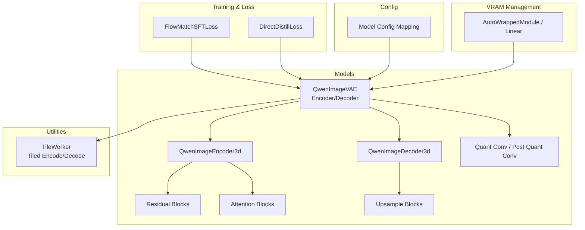
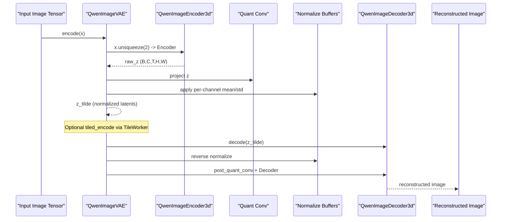
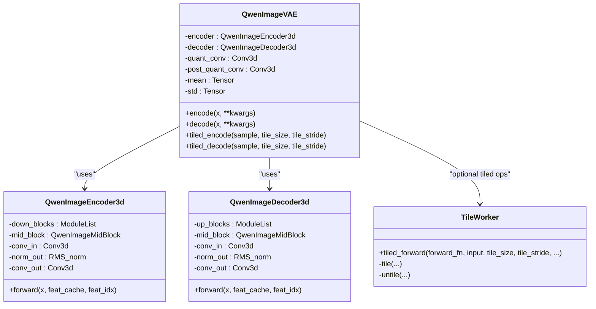
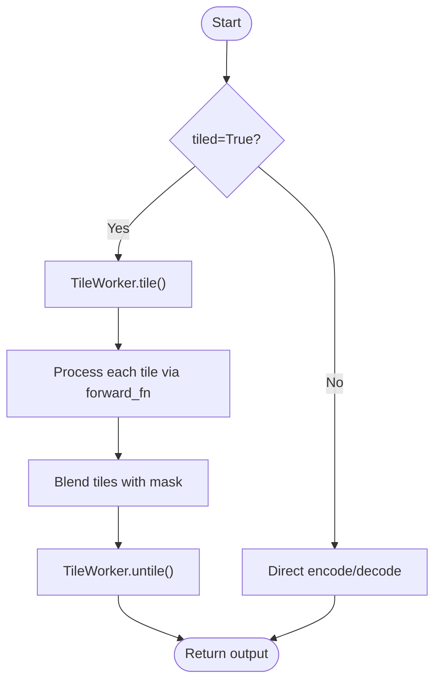
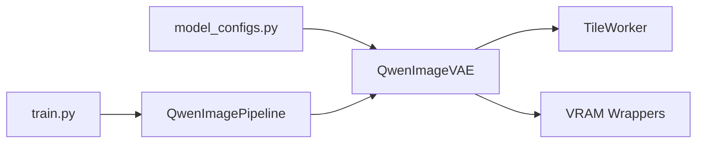

# VAE Components

<cite>
**Referenced Files in This Document**
- [qwen_image_vae.py](file://diffsynth/models/qwen_image_vae.py)
- [tiler.py](file://diffsynth/models/tiler.py)
- [loss.py](file://diffsynth/diffusion/loss.py)
- [train.py](file://examples/qwen_image/model_training/train.py)
- [model_configs.py](file://diffsynth/configs/model_configs.py)
- [layers.py](file://diffsynth/core/vram/layers.py)
</cite>

## Table of Contents
1. [Introduction](#introduction)
2. [Project Structure](#project-structure)
3. [Core Components](#core-components)
4. [Architecture Overview](#architecture-overview)
5. [Detailed Component Analysis](#detailed-component-analysis)
6. [Dependency Analysis](#dependency-analysis)
7. [Performance Considerations](#performance-considerations)
8. [Troubleshooting Guide](#troubleshooting-guide)
9. [Conclusion](#conclusion)
10. [Appendices](#appendices)

## Introduction
This document provides a comprehensive guide to the Qwen-Image Variational Autoencoder (VAE) components used for image latent space encoding and decoding within the DiffSynth-Studio framework. It explains the encoder-decoder architecture, compression behavior, reconstruction pipeline, memory-efficient inference options, and integration points with training and diffusion workflows. Practical guidance is included for latent manipulation, interpolation, resolution scaling, quantization strategies, and fine-tuning approaches compatible with this codebase.

## Project Structure
The Qwen-Image VAE implementation resides under the models package and integrates with tiling utilities for memory-efficient inference. Training scripts and loss functions are provided in examples and diffusion modules respectively. Configuration mappings register the VAE class for model loading.

**Diagram sources**
- [qwen_image_vae.py:643-754](file://diffsynth/models/qwen_image_vae.py#L643-L754)
- [tiler.py:5-95](file://diffsynth/models/tiler.py#L5-L95)
- [loss.py:5-71](file://diffsynth/diffusion/loss.py#L5-L71)
- [model_configs.py:19-20](file://diffsynth/configs/model_configs.py#L19-L20)
- [layers.py:88-198](file://diffsynth/core/vram/layers.py#L88-L198)

**Section sources**
- [qwen_image_vae.py:643-754](file://diffsynth/models/qwen_image_vae.py#L643-L754)
- [tiler.py:5-95](file://diffsynth/models/tiler.py#L5-L95)
- [loss.py:5-71](file://diffsynth/diffusion/loss.py#L5-L71)
- [model_configs.py:19-20](file://diffsynth/configs/model_configs.py#L19-L20)
- [layers.py:88-198](file://diffsynth/core/vram/layers.py#L88-L198)

## Core Components
- QwenImageVAE: Top-level module that composes encoder, decoder, and quant/post-quant convolutions. Provides encode/decode APIs and tiled variants for low VRAM usage.
- QwenImageEncoder3d: 3D causal convolutional encoder with residual blocks, attention blocks, and optional temporal downsampling. Outputs per-channel mean/std parameters after quantization projection.
- QwenImageDecoder3d: Symmetric decoder with residual blocks, upsampling blocks, and optional temporal upsampling. Reconstructs images from normalized latents.
- TileWorker: Tiling utility that splits inputs into overlapping tiles, processes them independently, and reassembles outputs with blending masks to reduce peak memory.
- VRAM management wrappers: AutoWrappedModule and AutoWrappedLinear enable dynamic offloading/onloading and FP8 computation paths to fit large models on limited VRAM.

Key behaviors:
- Latent normalization: The encoder applies learned per-channel mean/std buffers; decode reverses this normalization before post-quant convolution and decoding.
- Temporal dimension: Inputs are treated as sequences (batch, channels, time, height, width). For single images, time=1 is added automatically.
- Causal convolutions: Ensure no future-time leakage during sequence processing, important for streaming or chunked inference.

**Section sources**
- [qwen_image_vae.py:345-451](file://diffsynth/models/qwen_image_vae.py#L345-L451)
- [qwen_image_vae.py:524-640](file://diffsynth/models/qwen_image_vae.py#L524-L640)
- [qwen_image_vae.py:643-754](file://diffsynth/models/qwen_image_vae.py#L643-L754)
- [tiler.py:5-95](file://diffsynth/models/tiler.py#L5-L95)
- [layers.py:88-198](file://diffsynth/core/vram/layers.py#L88-L198)

## Architecture Overview
The Qwen-Image VAE follows an encoder-quantize-decode pattern with explicit normalization buffers and optional tiling for memory efficiency.

**Diagram sources**
- [qwen_image_vae.py:732-754](file://diffsynth/models/qwen_image_vae.py#L732-L754)
- [qwen_image_vae.py:345-451](file://diffsynth/models/qwen_image_vae.py#L345-L451)
- [qwen_image_vae.py:524-640](file://diffsynth/models/qwen_image_vae.py#L524-L640)

## Detailed Component Analysis

### QwenImageVAE Class
Responsibilities:
- Compose encoder, decoder, and quantization projections.
- Provide encode/decode methods with support for tiled operations.
- Maintain per-channel normalization buffers for stable latent distributions.

Implementation highlights:
- encode: Adds temporal dimension, runs encoder, projects through quant_conv, normalizes using stored mean/std, removes temporal dim.
- decode: Adds temporal dimension, denormalizes using stored mean/std, runs post_quant_conv, decodes, removes temporal dim.
- tiled_encode/tiled_decode: Delegate to TileWorker for memory-efficient processing.

Compression and latent shape:
- Default z_dim is 16; input images are encoded to latents with channel dimension 16.
- Spatial downsampling occurs across multiple stages; typical overall spatial reduction is determined by the number of downsample blocks and their modes (2D vs 3D).

Reconstruction quality:
- Quality depends on encoder depth, attention placement, and decoder upsampling strategy.
- Normalization buffers stabilize latent statistics and improve reconstruction fidelity.

Memory efficiency:
- Tiled encode/decode reduces peak memory at the cost of slight recomputation and minor boundary artifacts mitigated by blending masks.

**Section sources**
- [qwen_image_vae.py:643-754](file://diffsynth/models/qwen_image_vae.py#L643-L754)
- [tiler.py:5-95](file://diffsynth/models/tiler.py#L5-L95)

#### Class Diagram

**Diagram sources**
- [qwen_image_vae.py:643-754](file://diffsynth/models/qwen_image_vae.py#L643-L754)
- [qwen_image_vae.py:345-451](file://diffsynth/models/qwen_image_vae.py#L345-L451)
- [qwen_image_vae.py:524-640](file://diffsynth/models/qwen_image_vae.py#L524-L640)
- [tiler.py:5-95](file://diffsynth/models/tiler.py#L5-L95)

### Encoder and Decoder Building Blocks
- Residual blocks: Two causal 3D convolutions with RMS normalization and SiLU activations, plus dropout and shortcut connections. Support feature caching for efficient chunked inference.
- Attention blocks: Single-head self-attention applied per frame with scaled dot-product attention.
- Upsample/Downsample: 2D and 3D modes with causal temporal convolutions where applicable.

Complexity considerations:
- Residual blocks dominate compute; attention adds O((H*W)^2) per frame but is typically sparse due to small heads.
- Causal convolutions ensure no future leakage and allow streaming inference with feature caches.

**Section sources**
- [qwen_image_vae.py:82-154](file://diffsynth/models/qwen_image_vae.py#L82-L154)
- [qwen_image_vae.py:157-200](file://diffsynth/models/qwen_image_vae.py#L157-L200)
- [qwen_image_vae.py:219-302](file://diffsynth/models/qwen_image_vae.py#L219-L302)
- [qwen_image_vae.py:305-342](file://diffsynth/models/qwen_image_vae.py#L305-L342)

### Tiled Inference Pipeline

**Diagram sources**
- [tiler.py:71-95](file://diffsynth/models/tiler.py#L71-L95)
- [qwen_image_vae.py:710-730](file://diffsynth/models/qwen_image_vae.py#L710-L730)

**Section sources**
- [tiler.py:5-95](file://diffsynth/models/tiler.py#L5-L95)
- [qwen_image_vae.py:710-730](file://diffsynth/models/qwen_image_vae.py#L710-L730)

### VRAM Management Integration
- AutoWrappedModule wraps arbitrary modules to manage dtype/device states dynamically (offload/onload/preparing/computation).
- AutoWrappedLinear supports FP8 linear computations and LoRA merging paths.
- These wrappers can be enabled recursively to fit large VAEs on constrained GPUs.

Practical usage:
- Configure vram_config with offload_dtype/device, onload_dtype/device, preparing_dtype/device, computation_dtype/device, and vram_limit.
- Use enable_vram_management to wrap model layers according to a mapping.

**Section sources**
- [layers.py:88-198](file://diffsynth/core/vram/layers.py#L88-L198)
- [layers.py:271-436](file://diffsynth/core/vram/layers.py#L271-L436)
- [layers.py:439-480](file://diffsynth/core/vram/layers.py#L439-L480)

## Dependency Analysis
- Model registration: The VAE class is registered in model configs for automatic loading by pipelines.
- Training integration: Training scripts use DiffusionTrainingModule and FlowMatch losses; VAE can be trained alongside other units when specified.
- Tiling dependency: VAE encode/decode methods delegate to TileWorker when tiled mode is enabled.

**Diagram sources**
- [model_configs.py:19-20](file://diffsynth/configs/model_configs.py#L19-L20)
- [train.py:1-175](file://examples/qwen_image/model_training/train.py#L1-L175)
- [qwen_image_vae.py:643-754](file://diffsynth/models/qwen_image_vae.py#L643-L754)
- [tiler.py:5-95](file://diffsynth/models/tiler.py#L5-L95)
- [layers.py:88-198](file://diffsynth/core/vram/layers.py#L88-L198)

**Section sources**
- [model_configs.py:19-20](file://diffsynth/configs/model_configs.py#L19-L20)
- [train.py:1-175](file://examples/qwen_image/model_training/train.py#L1-L175)
- [qwen_image_vae.py:643-754](file://diffsynth/models/qwen_image_vae.py#L643-L754)
- [tiler.py:5-95](file://diffsynth/models/tiler.py#L5-L95)
- [layers.py:88-198](file://diffsynth/core/vram/layers.py#L88-L198)

## Performance Considerations
- Memory footprint:
  - Use tiled encode/decode to reduce peak VRAM; adjust tile_size and tile_stride based on available memory.
  - Enable VRAM management wrappers for dynamic offloading and FP8 computation paths.
- Compute efficiency:
  - Causal convolutions and feature caching reduce redundant computation in chunked inference.
  - Attention is single-head and applied per frame; consider reducing attn_scales if needed.
- Precision:
  - FP8 linear path is supported via AutoWrappedLinear; choose appropriate computation_dtype for speed/memory trade-offs.
- Reconstruction quality:
  - Tiling introduces slight boundary errors; default border_width is derived from tile_stride to mitigate artifacts.
  - Normalization buffers stabilize latent distribution and improve consistency across batches.

[No sources needed since this section provides general guidance]

## Troubleshooting Guide
Common issues and resolutions:
- Out-of-memory during encode/decode:
  - Enable tiled mode and reduce tile_size; increase tile_stride cautiously to maintain quality.
  - Use VRAM management wrappers to offload weights to disk/CPU and compute in FP8.
- Blurry reconstructions:
  - Verify normalization buffers are correctly loaded; check dtype/device alignment.
  - Inspect attention scales and residual block counts; deeper networks may improve detail retention.
- Artifacts at tile boundaries:
  - Increase border_width or adjust tile_stride; ensure consistent dtype/device across tiles.
- Training instability:
  - Confirm scheduler and timestep handling; ensure correct loss selection (FlowMatch vs Direct Distill).
  - Validate dataset preprocessing and image size constraints (multiples of 16 recommended).

**Section sources**
- [tiler.py:5-95](file://diffsynth/models/tiler.py#L5-L95)
- [layers.py:88-198](file://diffsynth/core/vram/layers.py#L88-L198)
- [loss.py:5-71](file://diffsynth/diffusion/loss.py#L5-L71)
- [train.py:1-175](file://examples/qwen_image/model_training/train.py#L1-L175)

## Conclusion
The Qwen-Image VAE provides a robust encoder-decoder architecture with causal 3D convolutions, attention, and flexible upsampling/downsampling. It supports memory-efficient tiled inference and integrates seamlessly with VRAM management tools. While the implementation focuses on deterministic reconstruction rather than probabilistic sampling, it offers strong practical performance for downstream diffusion tasks. Users can leverage tiling, precision options, and configuration tuning to balance speed, memory, and quality.

[No sources needed since this section summarizes without analyzing specific files]

## Appendices

### Latent Space Manipulation and Interpolation
- Interpolation:
  - Normalize latents using the stored mean/std, interpolate between two latent tensors, then denormalize and decode.
  - Keep batch and temporal dimensions aligned; interpolate per-channel to preserve structure.
- Editing:
  - Modify specific channels or regions in the latent tensor before decoding; combine with masks for localized edits.
- Resolution scaling:
  - Decode at higher resolution by adjusting input latent spatial dimensions via interpolation before decoding; ensure multiples of 16 for compatibility.

[No sources needed since this section provides general guidance]

### Quantization Options
- FP8 linear path:
  - Enabled via AutoWrappedLinear when computation_dtype is float8_e4m3fn or e4m3fnuz.
  - Scaling factors are computed per input to avoid overflow; bias is cast to bfloat16.
- Mixed precision:
  - Use bfloat16 for computation and float32 for accumulation where supported by hardware.

**Section sources**
- [layers.py:271-436](file://diffsynth/core/vram/layers.py#L271-L436)

### Compatibility with Image Formats
- The VAE operates on tensor inputs; common formats (PNG, JPEG) should be decoded to RGB tensors prior to encoding.
- Ensure pixel ranges and normalization match expectations; typical pipelines expect normalized inputs.

[No sources needed since this section provides general guidance]

### Fine-Tuning Guidance
- Trainable units:
  - Specify trainable_models to include vae along with other units (e.g., dit, text_encoder).
- Loss selection:
  - FlowMatchSFTLoss for standard supervised fine-tuning; DirectDistillLoss for distillation scenarios.
- Data preprocessing:
  - Use UnifiedDataset operators to crop/resize images to multiples of 16; handle list inputs for multi-image cases.

**Section sources**
- [train.py:1-175](file://examples/qwen_image/model_training/train.py#L1-L175)
- [loss.py:5-71](file://diffsynth/diffusion/loss.py#L5-L71)

### Integration with Diffusion Models
- The VAE encodes images to latents consumed by diffusion transformers; ensure consistent latent normalization and channel dimensions.
- Pipelines load VAE via model_configs; verify model_class mapping matches the intended VAE variant.

**Section sources**
- [model_configs.py:19-20](file://diffsynth/configs/model_configs.py#L19-L20)
- [qwen_image_vae.py:643-754](file://diffsynth/models/qwen_image_vae.py#L643-L754)