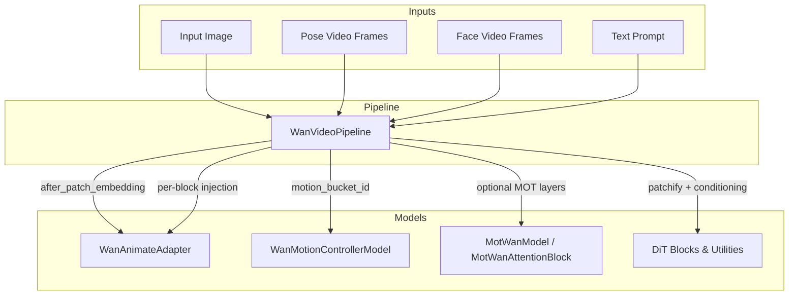
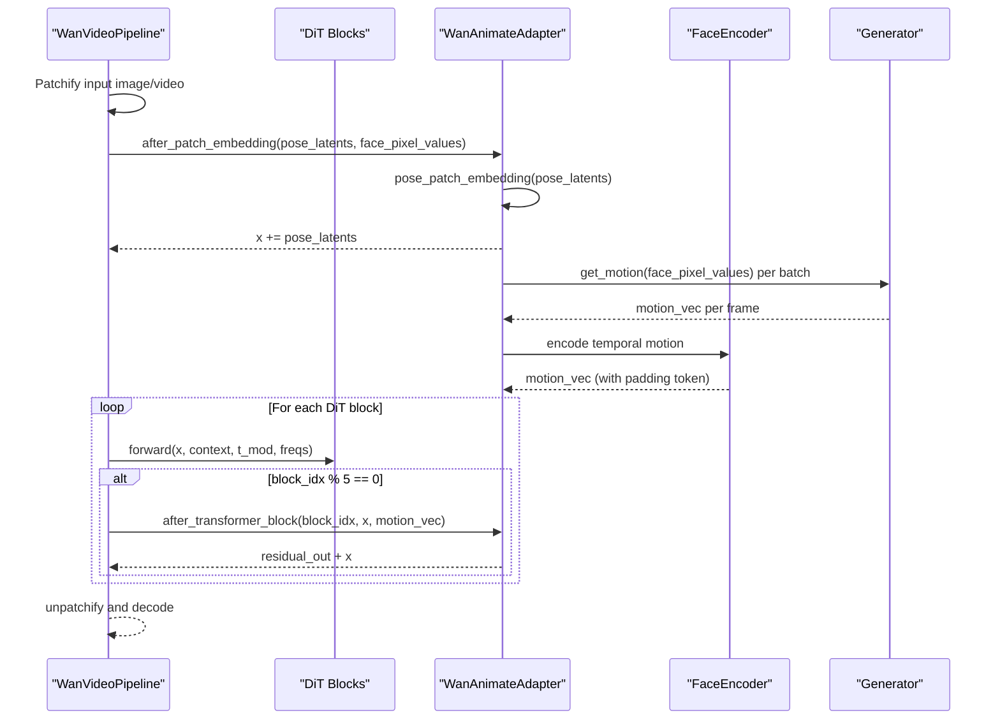
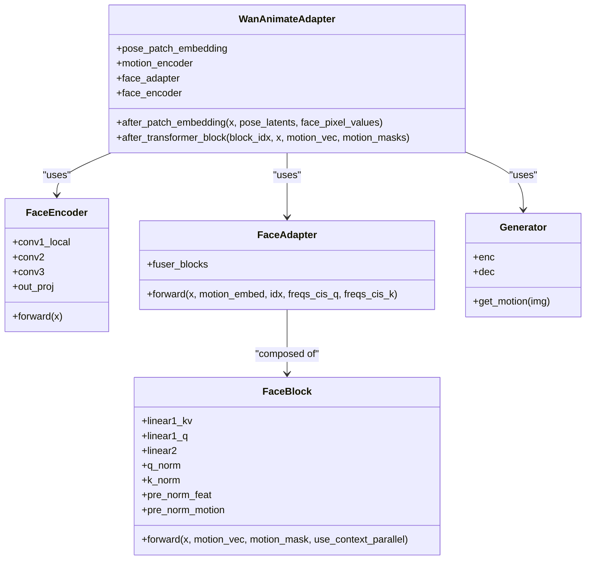
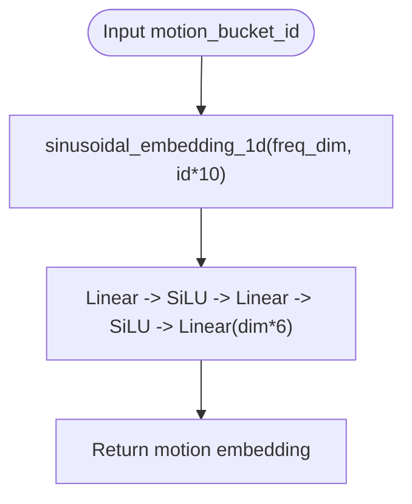
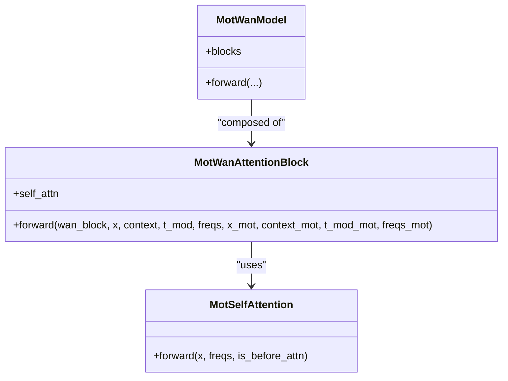
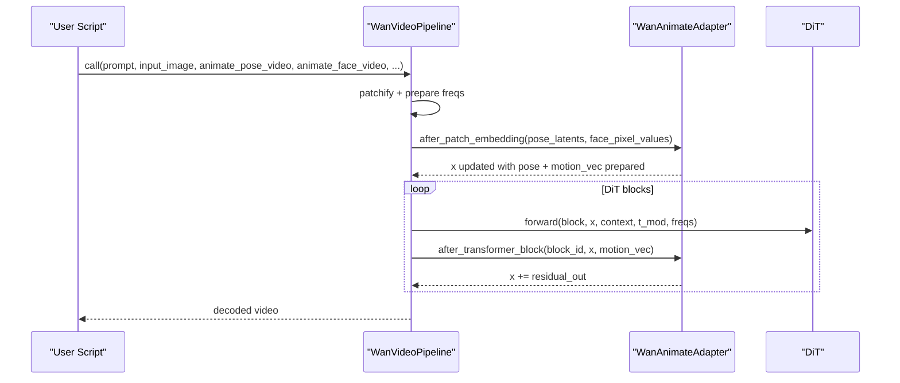
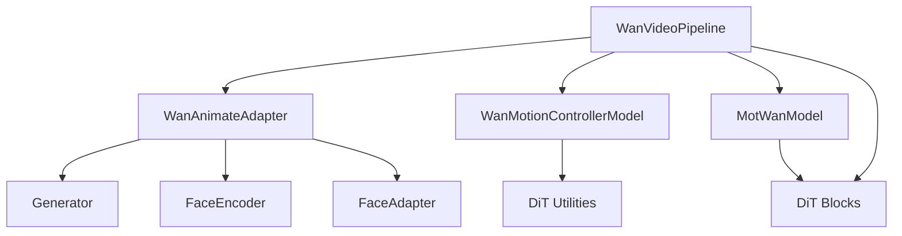

# Animate Adapters

<cite>
**Referenced Files in This Document**
- [wan_video_animate_adapter.py](file://diffsynth/models/wan_video_animate_adapter.py)
- [wan_video_motion_controller.py](file://diffsynth/models/wan_video_motion_controller.py)
- [wan_video_mot.py](file://diffsynth/models/wan_video_mot.py)
- [wan_video_dit.py](file://diffsynth/models/wan_video_dit.py)
- [wan_video.py](file://diffsynth/pipelines/wan_video.py)
- [wan_video_animate_adapter_state_dict_converter.py](file://diffsynth/utils/state_dict_converters/wan_video_animate_adapter.py)
- [Wan2.2-Animate-14B.py](file://examples/wanvideo/model_inference/Wan2.2-Animate-14B.py)
</cite>

## Table of Contents
1. [Introduction](#introduction)
2. [Project Structure](#project-structure)
3. [Core Components](#core-components)
4. [Architecture Overview](#architecture-overview)
5. [Detailed Component Analysis](#detailed-component-analysis)
6. [Dependency Analysis](#dependency-analysis)
7. [Performance Considerations](#performance-considerations)
8. [Troubleshooting Guide](#troubleshooting-guide)
9. [Conclusion](#conclusion)
10. [Appendices](#appendices)

## Introduction
This document explains the WanVideo animate adapters that enable character animation and facial expression control during video generation. It covers how animation signals are injected into the diffusion transformer, how pose estimation and facial landmark tracking are integrated, and how temporal coherence is enforced across frames. It also documents integration with motion controllers for synchronized body and facial animations, provides examples of animation data formats, and discusses performance optimization strategies for real-time synthesis while preserving quality.

## Project Structure
The animate adapter system is implemented as a set of modules that plug into the WanVideo pipeline:
- Model components:
  - Animate adapter (pose + face fusion and injection)
  - Motion controller (motion bucket embedding)
  - MOT attention blocks (optional motion-aware DiT extensions)
  - Core DiT utilities (attention, RoPE, modulation)
- Pipeline integration:
  - WanVideo pipeline orchestrates inputs, conditioning, and DiT forward passes
  - State dict converter filters adapter weights
- Example usage:
  - Inference script demonstrating pose and face video inputs

**Diagram sources**
- [wan_video.py:1416-1582](file://diffsynth/pipelines/wan_video.py#L1416-L1582)
- [wan_video_animate_adapter.py:615-651](file://diffsynth/models/wan_video_animate_adapter.py#L615-L651)
- [wan_video_motion_controller.py:7-28](file://diffsynth/models/wan_video_motion_controller.py#L7-L28)
- [wan_video_mot.py:94-170](file://diffsynth/models/wan_video_mot.py#L94-L170)
- [wan_video_dit.py:139-200](file://diffsynth/models/wan_video_dit.py#L139-L200)

**Section sources**
- [wan_video.py:200-360](file://diffsynth/pipelines/wan_video.py#L200-L360)
- [wan_video_animate_adapter.py:615-651](file://diffsynth/models/wan_video_animate_adapter.py#L615-L651)
- [wan_video_motion_controller.py:7-28](file://diffsynth/models/wan_video_motion_controller.py#L7-L28)
- [wan_video_mot.py:94-170](file://diffsynth/models/wan_video_mot.py#L94-L170)
- [wan_video_dit.py:139-200](file://diffsynth/models/wan_video_dit.py#L139-L200)

## Core Components
- WanAnimateAdapter: Encodes pose latents and face pixel sequences into motion vectors and injects them into the DiT via residual connections at selected blocks.
- FaceEncoder and FaceAdapter: Extract temporal facial motion features and fuse them with DiT hidden states using cross-attention-like mechanisms.
- Generator/EncoderApp/Direction: Encode appearance and motion from face frames to produce compact motion descriptors per frame.
- WanMotionControllerModel: Maps discrete motion bucket IDs to continuous embeddings used by other controllers or DiT modulations.
- MotWanModel/MotWanAttentionBlock: Optional motion-aware attention blocks that can be inserted into DiT for synchronized motion modeling.
- DiT utilities: Attention, RoPE, modulation, and optional flash/sage attention backends.

Key responsibilities:
- Pose latent injection after patch embedding
- Face motion encoding and temporal fusion
- Per-block adapter injection for temporal coherence
- Motion bucket embedding for speed/motion control

**Section sources**
- [wan_video_animate_adapter.py:67-115](file://diffsynth/models/wan_video_animate_adapter.py#L67-L115)
- [wan_video_animate_adapter.py:193-311](file://diffsynth/models/wan_video_animate_adapter.py#L193-L311)
- [wan_video_animate_adapter.py:511-613](file://diffsynth/models/wan_video_animate_adapter.py#L511-L613)
- [wan_video_motion_controller.py:7-28](file://diffsynth/models/wan_video_motion_controller.py#L7-L28)
- [wan_video_mot.py:22-92](file://diffsynth/models/wan_video_mot.py#L22-L92)
- [wan_video_dit.py:139-200](file://diffsynth/models/wan_video_dit.py#L139-L200)

## Architecture Overview
The animate adapter architecture integrates two primary signal streams:
- Pose stream: 3D pose latents are projected and added to the DiT sequence after patch embedding.
- Face stream: Frame-wise face pixels are encoded into motion vectors and fused into DiT hidden states at periodic blocks.

**Diagram sources**
- [wan_video.py:1416-1582](file://diffsynth/pipelines/wan_video.py#L1416-L1582)
- [wan_video_animate_adapter.py:623-651](file://diffsynth/models/wan_video_animate_adapter.py#L623-L651)
- [wan_video_animate_adapter.py:511-613](file://diffsynth/models/wan_video_animate_adapter.py#L511-L613)

## Detailed Component Analysis

### WanAnimateAdapter
Responsibilities:
- Inject pose latents into the DiT sequence after patch embedding
- Encode face pixel sequences into motion vectors
- Fuse motion vectors into DiT hidden states at periodic blocks

Implementation highlights:
- Pose projection uses a 3D convolution to align dimensions and stride
- Face motion encoding uses a generator that outputs per-frame motion descriptors
- Temporal fusion uses a face encoder with causal convolutions and normalization
- Residual injection occurs every 5 blocks to maintain temporal coherence

**Diagram sources**
- [wan_video_animate_adapter.py:615-651](file://diffsynth/models/wan_video_animate_adapter.py#L615-L651)
- [wan_video_animate_adapter.py:67-115](file://diffsynth/models/wan_video_animate_adapter.py#L67-L115)
- [wan_video_animate_adapter.py:193-311](file://diffsynth/models/wan_video_animate_adapter.py#L193-L311)
- [wan_video_animate_adapter.py:511-613](file://diffsynth/models/wan_video_animate_adapter.py#L511-L613)

**Section sources**
- [wan_video_animate_adapter.py:615-651](file://diffsynth/models/wan_video_animate_adapter.py#L615-L651)

### Motion Controller Integration
Responsibilities:
- Convert discrete motion bucket IDs into continuous embeddings
- Provide motion-related modulation signals for DiT or other controllers

Implementation highlights:
- Sinusoidal 1D positional embeddings scaled by bucket ID
- MLP projects to a high-dimensional modulation vector

**Diagram sources**
- [wan_video_motion_controller.py:7-28](file://diffsynth/models/wan_video_motion_controller.py#L7-L28)
- [wan_video_dit.py:70-74](file://diffsynth/models/wan_video_dit.py#L70-L74)

**Section sources**
- [wan_video_motion_controller.py:7-28](file://diffsynth/models/wan_video_motion_controller.py#L7-L28)

### MOT Attention Blocks (Optional)
Responsibilities:
- Extend DiT blocks with motion-aware self-attention
- Jointly attend over main sequence and motion sequence

Implementation highlights:
- Custom self-attention with RoPE applied to both modalities
- Concatenated attention over q/k/v from main and motion branches
- Gating and modulation similar to DiT blocks

**Diagram sources**
- [wan_video_mot.py:7-92](file://diffsynth/models/wan_video_mot.py#L7-L92)
- [wan_video_mot.py:94-170](file://diffsynth/models/wan_video_mot.py#L94-L170)

**Section sources**
- [wan_video_mot.py:22-92](file://diffsynth/models/wan_video_mot.py#L22-L92)
- [wan_video_mot.py:94-170](file://diffsynth/models/wan_video_mot.py#L94-L170)

### Pipeline Integration
Responsibilities:
- Orchestrate inputs, conditioning, and DiT forward passes
- Inject animate adapter signals at specific points
- Support multiple control modalities (camera, VACE, WanToDance)

Key integration points:
- After patch embedding: pose and face processing
- Per-block: residual injection from face adapter
- Motion bucket embedding for speed control

**Diagram sources**
- [wan_video.py:1416-1582](file://diffsynth/pipelines/wan_video.py#L1416-L1582)
- [wan_video_animate_adapter.py:623-651](file://diffsynth/models/wan_video_animate_adapter.py#L623-L651)

**Section sources**
- [wan_video.py:1400-1600](file://diffsynth/pipelines/wan_video.py#L1400-L1600)

## Dependency Analysis
- WanAnimateAdapter depends on:
  - torch.nn functional operations
  - einops for tensor rearrangement
  - Generator and FaceEncoder for motion encoding
- WanMotionControllerModel depends on:
  - sinusoidal_embedding_1d from DiT utilities
- MotWanModel depends on:
  - DiT blocks and utilities (RoPE, flash_attention)
- Pipeline depends on:
  - All model components and state dict converters

**Diagram sources**
- [wan_video_animate_adapter.py:615-651](file://diffsynth/models/wan_video_animate_adapter.py#L615-L651)
- [wan_video_motion_controller.py:7-28](file://diffsynth/models/wan_video_motion_controller.py#L7-L28)
- [wan_video_mot.py:94-170](file://diffsynth/models/wan_video_mot.py#L94-L170)
- [wan_video_dit.py:139-200](file://diffsynth/models/wan_video_dit.py#L139-L200)
- [wan_video.py:1416-1582](file://diffsynth/pipelines/wan_video.py#L1416-L1582)

**Section sources**
- [wan_video_animate_adapter.py:615-651](file://diffsynth/models/wan_video_animate_adapter.py#L615-L651)
- [wan_video_motion_controller.py:7-28](file://diffsynth/models/wan_video_motion_controller.py#L7-L28)
- [wan_video_mot.py:94-170](file://diffsynth/models/wan_video_mot.py#L94-L170)
- [wan_video_dit.py:139-200](file://diffsynth/models/wan_video_dit.py#L139-L200)
- [wan_video.py:1416-1582](file://diffsynth/pipelines/wan_video.py#L1416-L1582)

## Performance Considerations
- Batched face motion encoding: The adapter processes face frames in chunks to manage memory usage during motion encoding.
- Periodic adapter injection: Injecting motion signals every 5 blocks reduces computational overhead while maintaining temporal coherence.
- Flash/Sage attention fallbacks: The DiT utilities support multiple attention backends for optimal performance depending on available libraries.
- Gradient checkpointing: The pipeline supports gradient checkpointing for memory-efficient training/inference.
- VRAM management: Module maps allow selective loading/unloading of models during inference.

Optimization recommendations:
- Use tiled decoding for large resolutions
- Enable appropriate attention backend based on hardware
- Adjust batch size for face motion encoding based on GPU memory
- Utilize Teacache for caching intermediate computations when applicable

[No sources needed since this section provides general guidance]

## Troubleshooting Guide
Common issues and solutions:
- Missing adapter weights: Ensure state dict converter filters correct keys for adapter components
- Shape mismatches: Verify pose latents and face pixel values dimensions match expected formats
- Memory errors: Reduce batch size for face motion encoding or use lower resolution inputs
- Temporal inconsistencies: Check that adapter injection occurs at correct block intervals

Debugging steps:
- Validate input tensor shapes before calling adapter methods
- Monitor motion vector dimensions and ensure proper reshaping
- Verify that pose latents are properly projected and aligned with DiT sequence length

**Section sources**
- [wan_video_animate_adapter_state_dict_converter.py:1-6](file://diffsynth/utils/state_dict_converters/wan_video_animate_adapter.py#L1-L6)

## Conclusion
The WanVideo animate adapters provide a robust framework for character animation and facial expression control in video generation. By integrating pose estimation and facial landmark tracking through dedicated encoders and adapters, the system achieves temporal coherence and high-quality animation transfer. The modular design allows for flexible integration with motion controllers and other control modalities, while performance optimizations ensure efficient real-time synthesis.

## Appendices

### Animation Data Formats
- Pose videos: Sequence of images representing skeletal poses per frame
- Face videos: Sequence of cropped face regions for expression control
- Input images: Reference images for character identity preservation

### Example Usage
The example script demonstrates how to load the Wan2.2-Animate model and generate videos using pose and face video inputs.

**Section sources**
- [Wan2.2-Animate-14B.py:1-63](file://examples/wanvideo/model_inference/Wan2.2-Animate-14B.py#L1-L63)