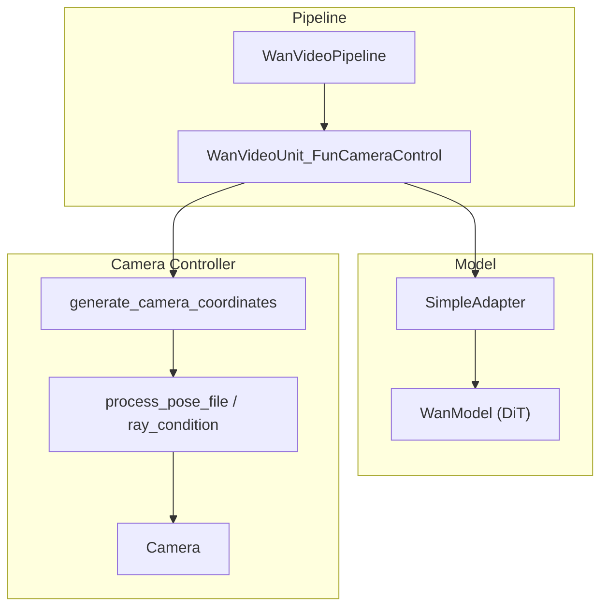
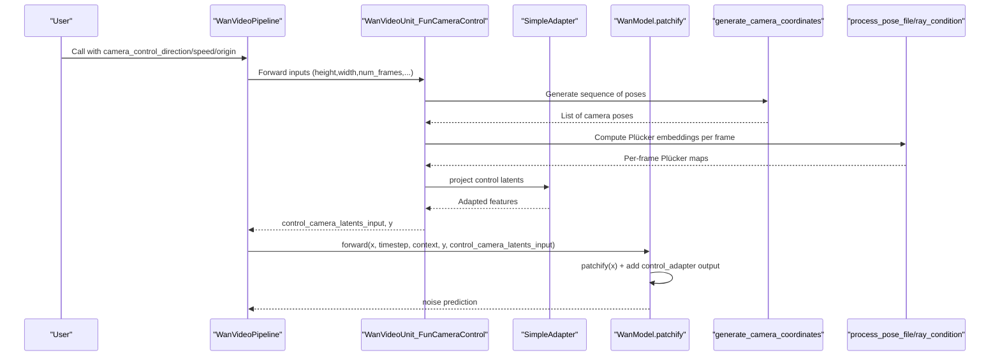
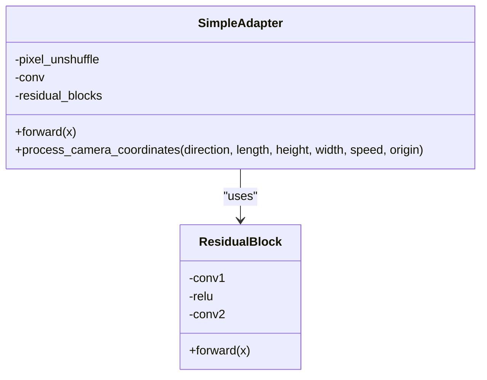
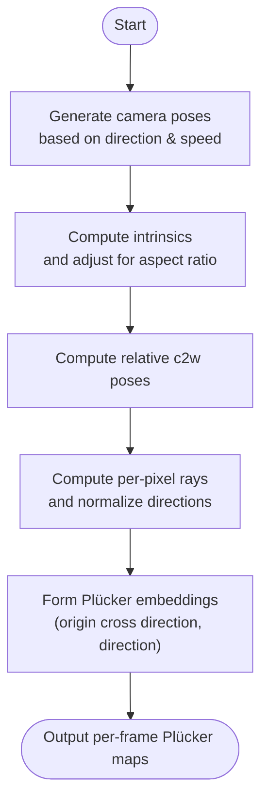
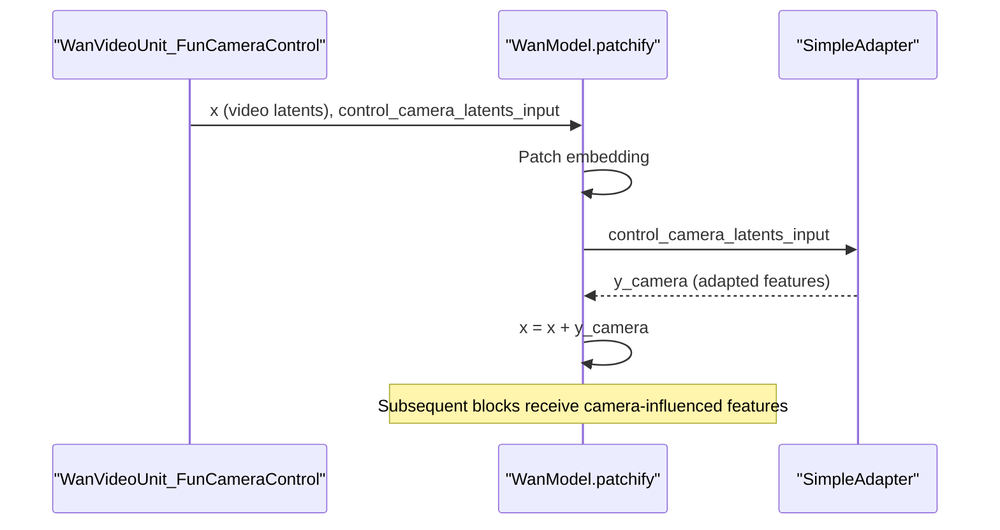
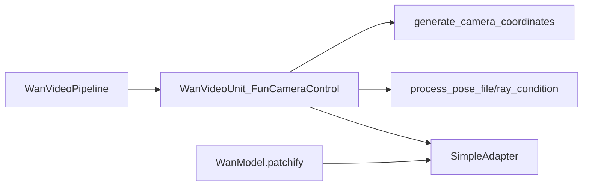

# Camera Controllers

<cite>
**Referenced Files in This Document**
- [wan_video_camera_controller.py](file://diffsynth/models/wan_video_camera_controller.py)
- [wan_video_dit.py](file://diffsynth/models/wan_video_dit.py)
- [wan_video.py](file://diffsynth/pipelines/wan_video.py)
</cite>

## Table of Contents
1. [Introduction](#introduction)
2. [Project Structure](#project-structure)
3. [Core Components](#core-components)
4. [Architecture Overview](#architecture-overview)
5. [Detailed Component Analysis](#detailed-component-analysis)
6. [Dependency Analysis](#dependency-analysis)
7. [Performance Considerations](#performance-considerations)
8. [Troubleshooting Guide](#troubleshooting-guide)
9. [Conclusion](#conclusion)
10. [Appendices](#appendices)

## Introduction
This document explains the WanVideo camera controllers that provide cinematic camera movement capabilities. It covers the SimpleAdapter implementation used to inject camera control into the DiT model, the camera parameter specifications (pan, tilt, zoom/dolly), and how spatial-temporal camera trajectories are modeled. It also details how camera controls integrate with the video generation pipeline through control latents and feature modulation, along with examples of movement patterns, shot compositions, multi-camera setups, precision considerations, temporal smoothness, and compatibility across resolutions and aspect ratios.

## Project Structure
The camera control system spans three primary files:
- Camera controller utilities and adapter: wan_video_camera_controller.py
- DiT model integration and patchify-time injection: wan_video_dit.py
- Pipeline unit for generating camera control latents and context: wan_video.py

**Diagram sources**
- [wan_video.py:583-630](file://diffsynth/pipelines/wan_video.py#L583-L630)
- [wan_video_dit.py:492-501](file://diffsynth/models/wan_video_dit.py#L492-L501)
- [wan_video_camera_controller.py:8-44](file://diffsynth/models/wan_video_camera_controller.py#L8-L44)

**Section sources**
- [wan_video.py:583-630](file://diffsynth/pipelines/wan_video.py#L583-L630)
- [wan_video_dit.py:492-501](file://diffsynth/models/wan_video_dit.py#L492-L501)
- [wan_video_camera_controller.py:8-44](file://diffsynth/models/wan_video_camera_controller.py#L8-L44)

## Core Components
- SimpleAdapter: A lightweight module that converts per-frame camera embeddings into a form compatible with DiT features. It uses pixel unshuffle, a 2D convolution, and residual blocks to map input channels to the DiT hidden dimension while preserving spatial-temporal structure.
- Camera trajectory generator: Produces sequences of camera poses based on direction tokens (e.g., Left, Right, Up, Down, In, Out) and speed, starting from an origin pose.
- Plücker embedding computation: Converts camera intrinsics and extrinsics into per-pixel Plücker coordinates, which encode ray directions and origins for each frame.
- Pipeline unit: Generates control_camera_latents_input and y (context) tensors that feed into the DiT forward pass.

Key responsibilities:
- Translate high-level camera instructions into temporally consistent Plücker embeddings.
- Encode these embeddings into control latents aligned with the DiT latent grid.
- Inject control signals into DiT via SimpleAdapter during patchification.

**Section sources**
- [wan_video_camera_controller.py:8-44](file://diffsynth/models/wan_video_camera_controller.py#L8-L44)
- [wan_video_camera_controller.py:184-206](file://diffsynth/models/wan_video_camera_controller.py#L184-L206)
- [wan_video_camera_controller.py:149-180](file://diffsynth/models/wan_video_camera_controller.py#L149-L180)
- [wan_video.py:583-630](file://diffsynth/pipelines/wan_video.py#L583-L630)
- [wan_video_dit.py:492-501](file://diffsynth/models/wan_video_dit.py#L492-L501)

## Architecture Overview
The camera control flow integrates at two points:
- Control latent generation: The pipeline unit computes control_camera_latents_input and y from camera parameters and optional reference image.
- Feature modulation: During DiT patchification, control latents are projected by SimpleAdapter and added to the initial patches, modulating subsequent attention and MLP layers via timestep-conditioned modulation.

**Diagram sources**
- [wan_video.py:583-630](file://diffsynth/pipelines/wan_video.py#L583-L630)
- [wan_video_dit.py:492-501](file://diffsynth/models/wan_video_dit.py#L492-L501)
- [wan_video_camera_controller.py:184-206](file://diffsynth/models/wan_video_camera_controller.py#L184-L206)
- [wan_video_camera_controller.py:149-180](file://diffsynth/models/wan_video_camera_controller.py#L149-L180)

## Detailed Component Analysis

### SimpleAdapter Implementation
SimpleAdapter transforms camera control embeddings into DiT-compatible features:
- Input shape handling: Reshapes batch × frames × channels × height × width into a 2D tensor for pixel-wise operations.
- Pixel Unshuffle: Reduces spatial dimensions by a factor of 8 to align with latent resolution.
- Convolution: Maps channel dimension to DiT hidden size.
- Residual Blocks: Extract robust features while maintaining gradient flow.
- Output reshaping: Restores batch × frames × channels × height × width ordering for downstream use.

**Diagram sources**
- [wan_video_camera_controller.py:8-44](file://diffsynth/models/wan_video_camera_controller.py#L8-L44)
- [wan_video_camera_controller.py:63-75](file://diffsynth/models/wan_video_camera_controller.py#L63-L75)

**Section sources**
- [wan_video_camera_controller.py:8-44](file://diffsynth/models/wan_video_camera_controller.py#L8-L44)
- [wan_video_camera_controller.py:63-75](file://diffsynth/models/wan_video_camera_controller.py#L63-L75)

### Camera Parameter Specifications and Trajectory Modeling
Supported directions include pan (Left, Right), tilt (Up, Down), and dolly (In, Out). The generator increments specific pose components based on direction and speed, producing a smooth sequence over num_frames. Origin defines the starting pose; default values are provided.

Plücker embeddings are computed from intrinsic parameters (fx, fy, cx, cy) and extrinsic matrices (c2w), yielding per-pixel ray directions and origins. Aspect ratio adjustments ensure correct scaling when original pose dimensions differ from sample dimensions.

**Diagram sources**
- [wan_video_camera_controller.py:184-206](file://diffsynth/models/wan_video_camera_controller.py#L184-L206)
- [wan_video_camera_controller.py:149-180](file://diffsynth/models/wan_video_camera_controller.py#L149-L180)

**Section sources**
- [wan_video_camera_controller.py:184-206](file://diffsynth/models/wan_video_camera_controller.py#L184-L206)
- [wan_video_camera_controller.py:149-180](file://diffsynth/models/wan_video_camera_controller.py#L149-L180)

### Integration with DiT via Control Latents and Modulation
During DiT patchification, control_camera_latents_input is projected by SimpleAdapter and added to the initial patches. This ensures camera motion influences all subsequent transformer blocks. Timestep-modulated modulation vectors further scale and shift features within each block, enabling fine-grained control over how strongly camera signals affect generation.

**Diagram sources**
- [wan_video_dit.py:492-501](file://diffsynth/models/wan_video_dit.py#L492-L501)
- [wan_video.py:583-630](file://diffsynth/pipelines/wan_video.py#L583-L630)

**Section sources**
- [wan_video_dit.py:492-501](file://diffsynth/models/wan_video_dit.py#L492-L501)
- [wan_video.py:583-630](file://diffsynth/pipelines/wan_video.py#L583-L630)

### Examples of Camera Movement Patterns and Shot Compositions
- Pan left/right: Horizontal translation of the viewpoint; useful for revealing environments or following subjects laterally.
- Tilt up/down: Vertical rotation; effective for emphasizing verticality or transitioning between foreground/background.
- Dolly in/out: Forward/backward movement; creates emphasis or reveals depth.
- Combined movements: E.g., LeftUp combines pan and tilt for dynamic diagonal framing.
- Multi-camera setups: By varying origin or speed per clip, one can simulate multiple viewpoints or cuts while maintaining temporal coherence.

These patterns are controlled via direction tokens and speed; longer sequences require careful speed tuning to avoid abrupt transitions.

[No sources needed since this section provides conceptual guidance]

### Precision, Temporal Smoothness, and Compatibility
- Precision: Plücker embeddings are computed in float32 and converted to the pipeline dtype; ensure consistent device placement to avoid casting issues.
- Temporal smoothness: Speed should be small enough to avoid discontinuities; consider smoothing functions if custom trajectories are needed beyond linear increments.
- Resolution and aspect ratio: process_pose_file adjusts intrinsics based on original vs. sample aspect ratios; maintain consistent height/width division factors enforced by the pipeline.

**Section sources**
- [wan_video.py:32-38](file://diffsynth/pipelines/wan_video.py#L32-L38)
- [wan_video_camera_controller.py:149-180](file://diffsynth/models/wan_video_camera_controller.py#L149-L180)

## Dependency Analysis
The camera control system has clear dependencies:
- Pipeline depends on the camera unit to produce control latents and context.
- Camera unit depends on trajectory generators and Plücker computations.
- DiT depends on SimpleAdapter to integrate control signals into patches.

**Diagram sources**
- [wan_video.py:583-630](file://diffsynth/pipelines/wan_video.py#L583-L630)
- [wan_video_dit.py:492-501](file://diffsynth/models/wan_video_dit.py#L492-L501)
- [wan_video_camera_controller.py:184-206](file://diffsynth/models/wan_video_camera_controller.py#L184-L206)

**Section sources**
- [wan_video.py:583-630](file://diffsynth/pipelines/wan_video.py#L583-L630)
- [wan_video_dit.py:492-501](file://diffsynth/models/wan_video_dit.py#L492-L501)
- [wan_video_camera_controller.py:184-206](file://diffsynth/models/wan_video_camera_controller.py#L184-L206)

## Performance Considerations
- Memory usage: Pixel unshuffle reduces spatial dimensions early, lowering memory footprint during convolution.
- Attention efficiency: Flash attention variants are available in the DiT; ensure compatibility flags are set appropriately.
- Tiling and decoding: Use tiled VAE decoding for large resolutions to reduce VRAM spikes.
- Gradient checkpointing: Enabled during training to save memory; not necessary during inference but can be toggled.

[No sources needed since this section provides general guidance]

## Troubleshooting Guide
Common issues and resolutions:
- Mismatched shapes: Ensure control_camera_latents_input matches expected DiT input dimensions; verify height/width division factors.
- Device mismatches: Cast tensors to the same device and dtype before concatenation or addition.
- Aspect ratio artifacts: Verify process_pose_file adjustments; check original_pose_width/height vs. sample dimensions.
- Temporal flicker: Reduce speed or apply smoothing to generated poses; validate direction combinations.

**Section sources**
- [wan_video.py:583-630](file://diffsynth/pipelines/wan_video.py#L583-L630)
- [wan_video_camera_controller.py:149-180](file://diffsynth/models/wan_video_camera_controller.py#L149-L180)

## Conclusion
WanVideo’s camera controllers enable precise, cinematic camera movements through Plücker-based spatial-temporal modeling and a lightweight SimpleAdapter that integrates seamlessly into the DiT pipeline. By controlling direction, speed, and origin, users can craft diverse shot compositions while maintaining temporal smoothness and resolution compatibility. Proper configuration and troubleshooting ensure robust performance across various scenarios.

[No sources needed since this section summarizes without analyzing specific files]

## Appendices
- Supported directions: Left, Right, Up, Down, LeftUp, LeftDown, RightUp, RightDown, In, Out.
- Default origin pose values are provided; customize for specific scene setups.
- For multi-camera setups, vary origin or speed per segment to simulate different viewpoints.

[No sources needed since this section provides supplementary information]