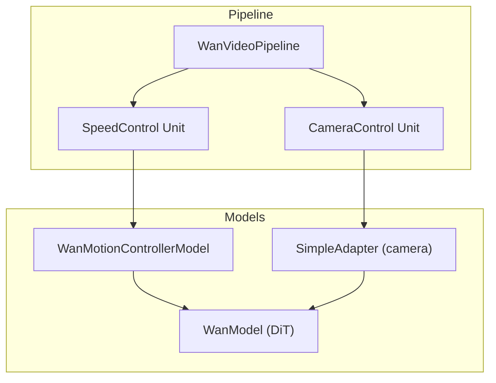
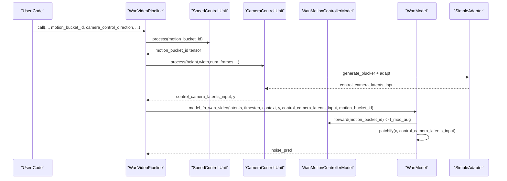
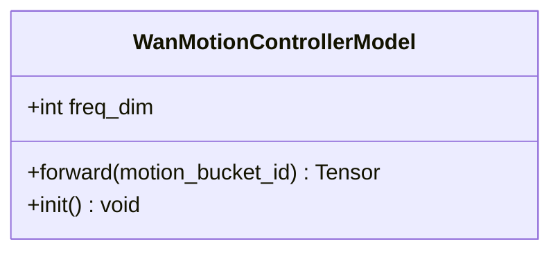
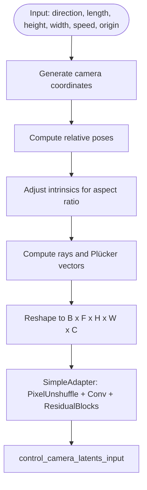
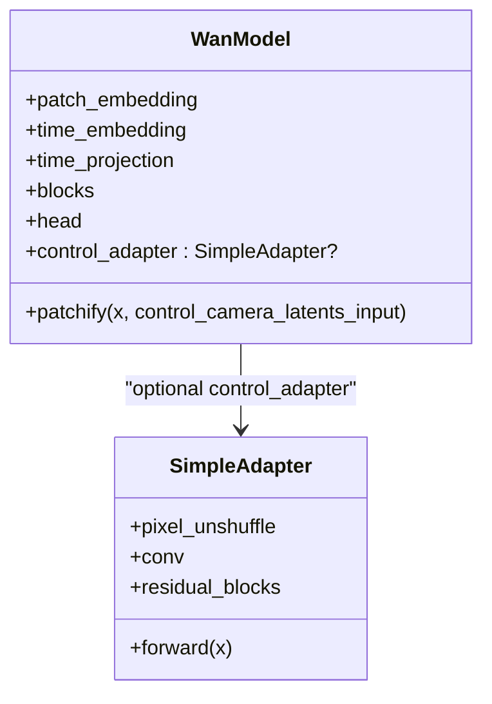
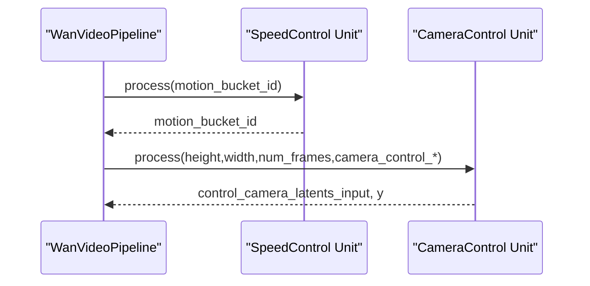
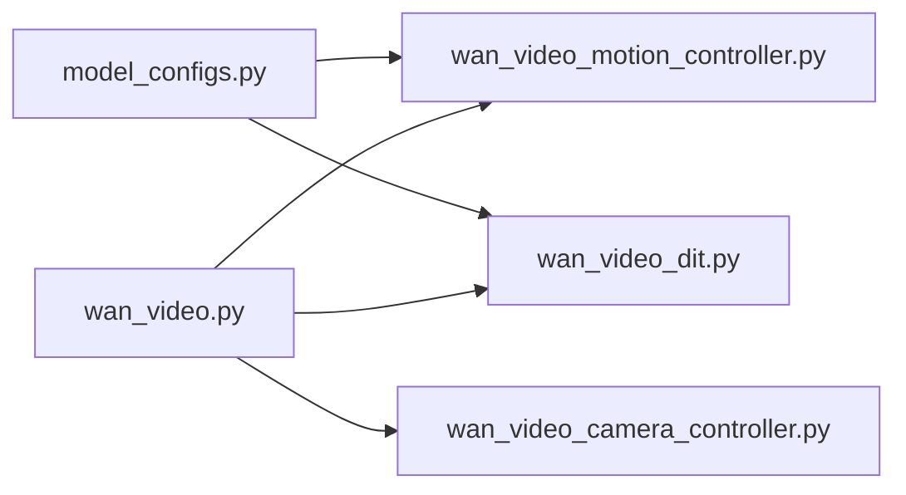

# Motion Controllers

<cite>
**Referenced Files in This Document**
- [wan_video_motion_controller.py](file://diffsynth/models/wan_video_motion_controller.py)
- [wan_video_camera_controller.py](file://diffsynth/models/wan_video_camera_controller.py)
- [wan_video_dit.py](file://diffsynth/models/wan_video_dit.py)
- [wan_video.py](file://diffsynth/pipelines/wan_video.py)
- [model_configs.py](file://diffsynth/configs/model_configs.py)
- [Wan2.1-Fun-V1.1-14B-Control-Camera.py](file://examples/wanvideo/model_inference/Wan2.1-Fun-V1.1-14B-Control-Camera.py)
- [Wan2.1-1.3b-speedcontrol-v1.py](file://examples/wanvideo/model_inference/Wan2.1-1.3b-speedcontrol-v1.py)
</cite>

## Table of Contents
1. [Introduction](#introduction)
2. [Project Structure](#project-structure)
3. [Core Components](#core-components)
4. [Architecture Overview](#architecture-overview)
5. [Detailed Component Analysis](#detailed-component-analysis)
6. [Dependency Analysis](#dependency-analysis)
7. [Performance Considerations](#performance-considerations)
8. [Troubleshooting Guide](#troubleshooting-guide)
9. [Conclusion](#conclusion)
10. [Appendices](#appendices)

## Introduction
This document explains the WanVideo motion controllers that enable dynamic scene generation and character movement control. It covers how temporal dynamics (speed/motion intensity), camera movements, and object trajectories are specified and integrated into the main DiT model via control adapters and motion conditioning mechanisms. Practical examples show how to specify motion parameters, tune controller settings, and combine multiple controls for complex choreography. Performance considerations include real-time control strategies and memory-efficient motion encoding.

## Project Structure
The motion control system spans three primary areas:
- Motion controller module for speed/motion intensity conditioning
- Camera controller module for generating Plücker ray embeddings from camera poses
- DiT integration through a control adapter and timestep modulation
- Pipeline orchestration that prepares inputs and injects control signals during inference

**Diagram sources**
- [wan_video.py:53-86](file://diffsynth/pipelines/wan_video.py#L53-L86)
- [wan_video_motion_controller.py:7-28](file://diffsynth/models/wan_video_motion_controller.py#L7-L28)
- [wan_video_camera_controller.py:8-44](file://diffsynth/models/wan_video_camera_controller.py#L8-L44)
- [wan_video_dit.py:338-423](file://diffsynth/models/wan_video_dit.py#L338-L423)

**Section sources**
- [wan_video.py:32-86](file://diffsynth/pipelines/wan_video.py#L32-L86)
- [wan_video_motion_controller.py:1-28](file://diffsynth/models/wan_video_motion_controller.py#L1-L28)
- [wan_video_camera_controller.py:1-44](file://diffsynth/models/wan_video_camera_controller.py#L1-L44)
- [wan_video_dit.py:338-423](file://diffsynth/models/wan_video_dit.py#L338-L423)

## Core Components
- Motion Controller (speed/motion intensity): A small MLP that maps a scalar motion bucket ID into a 6-channel modulation vector added to the timestep modulation.
- Camera Controller: Generates per-frame Plücker ray embeddings from camera pose sequences and adapts them to DiT feature space via a lightweight adapter.
- DiT Control Adapter: Optional branch in the DiT that accepts control latents (e.g., camera or other modalities) and adds them to patchified features.
- Pipeline Units: Prepare and inject control signals (motion bucket ID, camera Plücker embeddings, reference latents) into the diffusion loop.

Key responsibilities:
- Temporal dynamics: motion_bucket_id → t_mod augmentation
- Camera movement: direction/speed/origin → Plücker embedding → control_adapter → patchify addition
- Object trajectory: provided via control video or VAP/VACE pipelines (outside this scope but compatible with y/control_latents)

**Section sources**
- [wan_video_motion_controller.py:7-28](file://diffsynth/models/wan_video_motion_controller.py#L7-L28)
- [wan_video_camera_controller.py:8-44](file://diffsynth/models/wan_video_camera_controller.py#L8-L44)
- [wan_video_dit.py:415-423](file://diffsynth/models/wan_video_dit.py#L415-L423)
- [wan_video.py:583-631](file://diffsynth/pipelines/wan_video.py#L583-L631)

## Architecture Overview
The motion control architecture integrates at two points:
- Timestep modulation augmentation by the motion controller
- Patchified feature addition via the control adapter for camera-related latents

**Diagram sources**
- [wan_video.py:583-631](file://diffsynth/pipelines/wan_video.py#L583-L631)
- [wan_video.py:1276-1394](file://diffsynth/pipelines/wan_video.py#L1276-L1394)
- [wan_video_motion_controller.py:19-22](file://diffsynth/models/wan_video_motion_controller.py#L19-L22)
- [wan_video_camera_controller.py:46-59](file://diffsynth/models/wan_video_camera_controller.py#L46-L59)
- [wan_video_dit.py:492-501](file://diffsynth/models/wan_video_dit.py#L492-L501)

## Detailed Component Analysis

### Motion Controller (Speed/Motion Intensity)
- Purpose: Encode a discrete motion intensity bucket into a modulation vector that augments timestep conditioning.
- Implementation: Sinusoidal positional encoding on scaled bucket ID, passed through an MLP producing six channels (shift/scale/gate pairs).
- Integration: Added to the DiT’s timestep modulation before transformer blocks.

**Diagram sources**
- [wan_video_motion_controller.py:7-28](file://diffsynth/models/wan_video_motion_controller.py#L7-L28)

**Section sources**
- [wan_video_motion_controller.py:7-28](file://diffsynth/models/wan_video_motion_controller.py#L7-L28)
- [wan_video.py:1392-1394](file://diffsynth/pipelines/wan_video.py#L1392-L1394)

### Camera Controller (Plücker Embeddings and Adapter)
- Purpose: Convert camera pose sequences into spatially aligned Plücker ray embeddings and adapt them to DiT feature dimensions.
- Key steps:
  - Generate camera coordinates based on direction (Left/Right/Up/Down/In/Out) and speed.
  - Compute relative poses and intrinsic scaling.
  - Build Plücker embeddings per frame and reshape to match latent layout.
  - SimpleAdapter reduces spatial resolution and projects to DiT channel dimension; residual blocks refine features.

**Diagram sources**
- [wan_video_camera_controller.py:184-207](file://diffsynth/models/wan_video_camera_controller.py#L184-L207)
- [wan_video_camera_controller.py:92-147](file://diffsynth/models/wan_video_camera_controller.py#L92-L147)
- [wan_video_camera_controller.py:8-44](file://diffsynth/models/wan_video_camera_controller.py#L8-L44)

**Section sources**
- [wan_video_camera_controller.py:8-44](file://diffsynth/models/wan_video_camera_controller.py#L8-L44)
- [wan_video_camera_controller.py:92-147](file://diffsynth/models/wan_video_camera_controller.py#L92-L147)
- [wan_video_camera_controller.py:150-180](file://diffsynth/models/wan_video_camera_controller.py#L150-L180)
- [wan_video_camera_controller.py:184-207](file://diffsynth/models/wan_video_camera_controller.py#L184-L207)

### DiT Control Adapter and Patchify Integration
- Purpose: Inject control latents (e.g., camera) into the DiT feature stream after patching.
- Behavior: If enabled, control_adapter processes control_camera_latents_input and adds its output to each patch token before transformer processing.

**Diagram sources**
- [wan_video_dit.py:338-423](file://diffsynth/models/wan_video_dit.py#L338-L423)
- [wan_video_dit.py:492-501](file://diffsynth/models/wan_video_dit.py#L492-L501)
- [wan_video_camera_controller.py:8-44](file://diffsynth/models/wan_video_camera_controller.py#L8-L44)

**Section sources**
- [wan_video_dit.py:415-423](file://diffsynth/models/wan_video_dit.py#L415-L423)
- [wan_video_dit.py:492-501](file://diffsynth/models/wan_video_dit.py#L492-L501)

### Pipeline Units for Motion and Camera Control
- SpeedControl Unit: Validates and passes motion_bucket_id through the pipeline.
- CameraControl Unit: Produces control_camera_latents_input and ensures y is consistent with DiT expectations.

**Diagram sources**
- [wan_video.py:634-646](file://diffsynth/pipelines/wan_video.py#L634-L646)
- [wan_video.py:583-631](file://diffsynth/pipelines/wan_video.py#L583-L631)

**Section sources**
- [wan_video.py:634-646](file://diffsynth/pipelines/wan_video.py#L634-L646)
- [wan_video.py:583-631](file://diffsynth/pipelines/wan_video.py#L583-L631)

## Dependency Analysis
- Model configuration registers the motion controller and DiT variants with control adapter support.
- The pipeline orchestrates units and calls the model function that merges motion controller outputs into timestep modulation and applies camera control via patchify.

**Diagram sources**
- [model_configs.py:132-137](file://diffsynth/configs/model_configs.py#L132-L137)
- [wan_video.py:1276-1394](file://diffsynth/pipelines/wan_video.py#L1276-L1394)
- [wan_video_motion_controller.py:7-28](file://diffsynth/models/wan_video_motion_controller.py#L7-L28)
- [wan_video_dit.py:338-423](file://diffsynth/models/wan_video_dit.py#L338-L423)
- [wan_video_camera_controller.py:8-44](file://diffsynth/models/wan_video_camera_controller.py#L8-L44)

**Section sources**
- [model_configs.py:132-137](file://diffsynth/configs/model_configs.py#L132-L137)
- [wan_video.py:1276-1394](file://diffsynth/pipelines/wan_video.py#L1276-L1394)

## Performance Considerations
- Real-time motion control:
  - Use gradient checkpointing in DiT to reduce memory usage during long sequences.
  - Employ tiled decoding and sliding window processing for large frames/timesteps.
  - Leverage unified sequence parallelism where available to distribute attention computation.
- Memory-efficient motion encoding:
  - Motion controller is lightweight (small MLP); ensure it runs on the same device/dtype as DiT.
  - Camera Plücker embeddings are computed once per frame and adapted via a compact SimpleAdapter; avoid recomputation across denoising steps if possible.
  - Prefer fused operations and contiguous tensors to minimize overhead.
- Scheduler and guidance:
  - Tune cfg_scale and sigma_shift to balance fidelity and speed.
  - For high-resolution or long videos, consider Teacache-like caching to skip redundant computations when stable.

[No sources needed since this section provides general guidance]

## Troubleshooting Guide
- Motion bucket ID not applied:
  - Ensure motion_bucket_id is provided and motion_controller is loaded.
  - Verify model_fn_wan_video receives motion_bucket_id and that the condition to add modulation is met.
- Camera control has no effect:
  - Confirm camera_control_direction is set and control_adapter is enabled in DiT config.
  - Check that control_camera_latents_input shape matches DiT expectations and that y is correctly prepared.
- Shape mismatches:
  - Validate height, width, num_frames division factors and VAE upsampling factors.
  - Ensure tiled encoding/decoding parameters align with model requirements.

**Section sources**
- [wan_video.py:1392-1394](file://diffsynth/pipelines/wan_video.py#L1392-L1394)
- [wan_video.py:583-631](file://diffsynth/pipelines/wan_video.py#L583-L631)
- [wan_video_dit.py:492-501](file://diffsynth/models/wan_video_dit.py#L492-L501)

## Conclusion
WanVideo motion controllers provide a modular and efficient way to control temporal dynamics and camera movements during video generation. The motion controller augments timestep modulation for speed/intensity, while the camera controller generates Plücker embeddings adapted into DiT features. Together, they enable precise choreography and cinematic camera work within the diffusion pipeline. Proper configuration, parameter tuning, and performance optimizations allow scalable and responsive motion control for complex scenes.

[No sources needed since this section summarizes without analyzing specific files]

## Appendices

### Practical Examples and Usage Patterns
- Speed control example:
  - Provide motion_bucket_id to adjust perceived motion intensity.
  - Example script demonstrates slow vs fast motion by varying the bucket ID.
- Camera control example:
  - Specify camera_control_direction and camera_control_speed to produce dolly/pan/tilt effects.
  - Combine with input_image to drive image-to-video generation with controlled camera motion.

**Section sources**
- [Wan2.1-1.3b-speedcontrol-v1.py:20-34](file://examples/wanvideo/model_inference/Wan2.1-1.3b-speedcontrol-v1.py#L20-L34)
- [Wan2.1-Fun-V1.1-14B-Control-Camera.py:28-44](file://examples/wanvideo/model_inference/Wan2.1-Fun-V1.1-14B-Control-Camera.py#L28-L44)

### Controller Parameter Tuning Guidelines
- Motion bucket ID:
  - Lower values yield slower motion; higher values increase intensity.
  - Calibrate per prompt/content; typical range spans low to high buckets.
- Camera control:
  - Direction: Left/Right/Up/Down/In/Out combinations.
  - Speed: Small increments (e.g., 0.01) for subtle motion; larger values for dramatic effects.
  - Origin: Adjust initial pose to fit composition needs.
- Combining controls:
  - Use motion_bucket_id for global tempo and camera_control for framing.
  - Add reference images or control videos to constrain content while preserving motion.

**Section sources**
- [wan_video.py:583-631](file://diffsynth/pipelines/wan_video.py#L583-L631)
- [wan_video.py:634-646](file://diffsynth/pipelines/wan_video.py#L634-L646)
- [wan_video_camera_controller.py:184-207](file://diffsynth/models/wan_video_camera_controller.py#L184-L207)