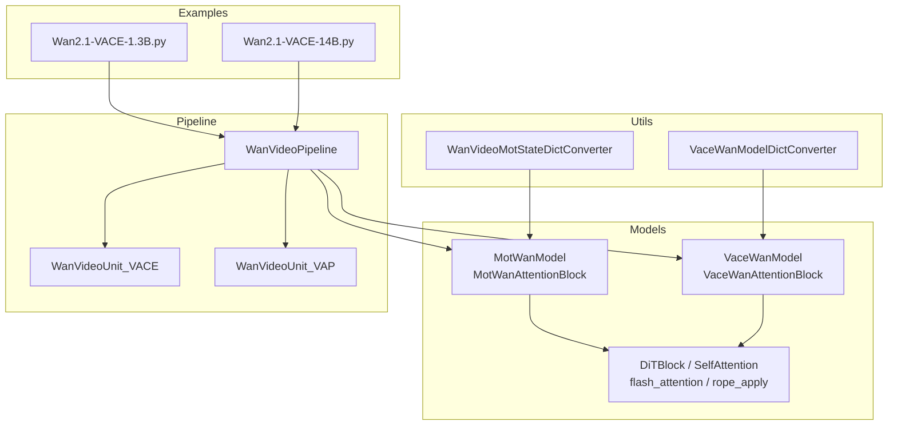
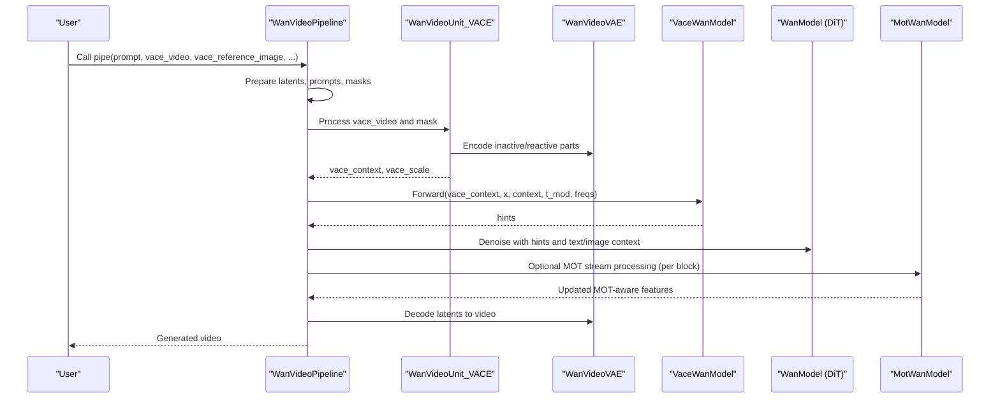
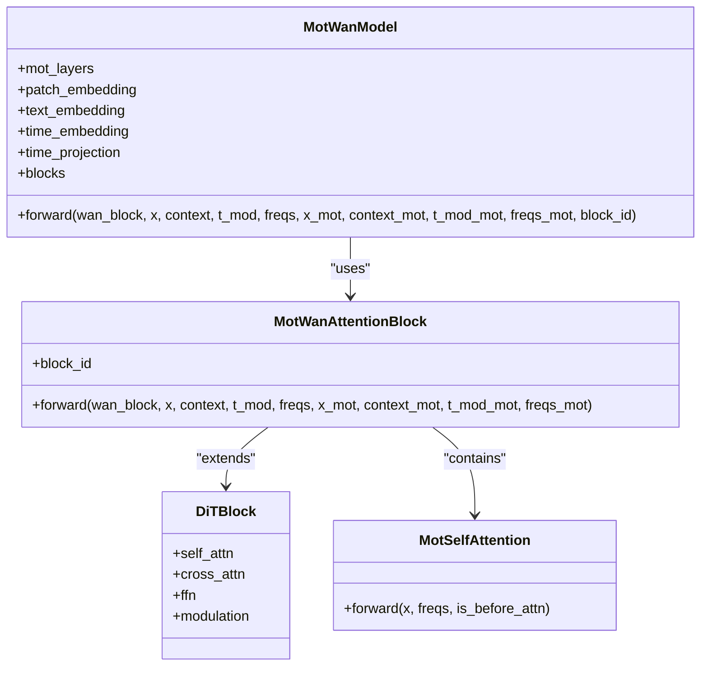
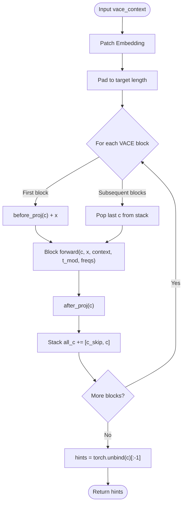
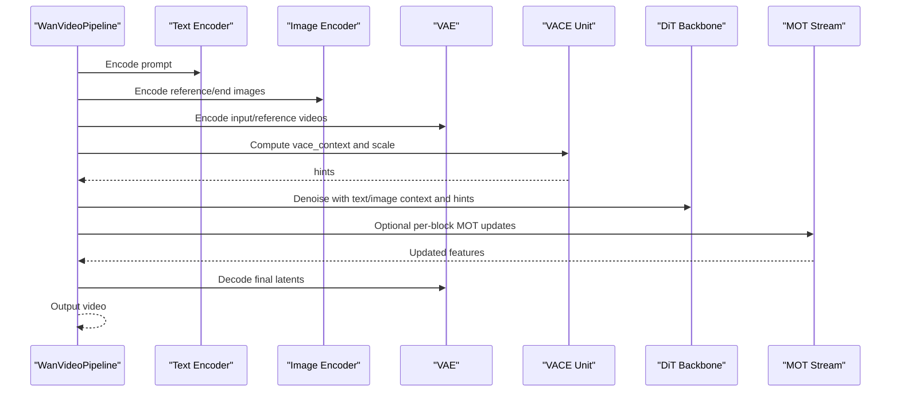
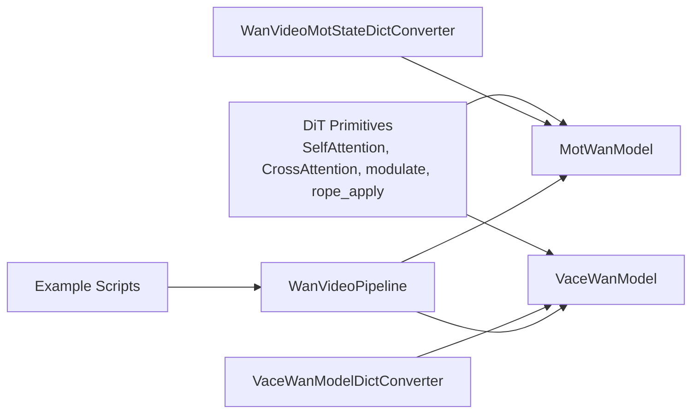

# Specialized Modules (MOT & VACE)

<cite>
**Referenced Files in This Document**
- [wan_video_mot.py](file://diffiffsynth/models/wan_video_mot.py)
- [wan_video_vace.py](file://diffiffsynth/models/wan_video_vace.py)
- [wan_video_dit.py](file://diffiffsynth/models/wan_video_dit.py)
- [wan_video.py](file://diffiffsynth/pipelines/wan_video.py)
- [wan_video_mot_state_dict_converter.py](file://diffiffsynth/utils/state_dict_converters/wan_video_mot.py)
- [wan_video_vace_state_dict_converter.py](file://diffiffsynth/utils/state_dict_converters/wan_video_vace.py)
- [Wan2.1-VACE-1.3B.py](file://examples/wanvideo/model_inference/Wan2.1-VACE-1.3B.py)
- [Wan2.1-VACE-14B.py](file://examples/wanvideo/model_inference/Wan2.1-VACE-14B.py)
- [Wan.md](file://docs/en/Model_Details/Wan.md)
</cite>

## Table of Contents
1. Introduction
2. Project Structure
3. Core Components
4. Architecture Overview
5. Detailed Component Analysis
6. Dependency Analysis
7. Performance Considerations
8. Troubleshooting Guide
9. Conclusion
10. Appendices

## Introduction
This document provides detailed documentation for two specialized WanVideo modules: MOT (Multiple Object Tracking) and VACE (Video Action Control Encoder). It explains how these modules integrate with the main video generation pipeline, their conditioning mechanisms, data flows, and usage patterns. The goal is to enable both technical and non-technical readers to understand and effectively use MOT and VACE for multi-object tracking across frames and action-conditioned video generation.

## Project Structure
The MOT and VACE modules are implemented as separate model components under the models directory and integrated into the WanVideoPipeline through dedicated pipeline units. State dict converters facilitate loading pretrained weights. Example scripts demonstrate practical usage of VACE with different model sizes.

**Diagram sources**
- [wan_video_mot.py:94-169](file://diffiffsynth/models/wan_video_mot.py#L94-L169)
- [wan_video_vace.py:27-74](file://diffiffsynth/models/wan_video_vace.py#L27-L74)
- [wan_video_dit.py:139-200](file://diffiffsynth/models/wan_video_dit.py#L139-L200)
- [wan_video.py:32-86](file://diffiffsynth/pipelines/wan_video.py#L32-L86)
- [wan_video_mot_state_dict_converter.py:1-79](file://diffiffsynth/utils/state_dict_converters/wan_video_mot.py#L1-L79)
- [wan_video_vace_state_dict_converter.py:1-4](file://diffiffsynth/utils/state_dict_converters/wan_video_vace.py#L1-L4)
- [Wan2.1-VACE-1.3B.py:1-54](file://examples/wanvideo/model_inference/Wan2.1-VACE-1.3B.py#L1-L54)
- [Wan2.1-VACE-14B.py:1-55](file://examples/wanvideo/model_inference/Wan2.1-VACE-14B.py#L1-L55)

**Section sources**
- [wan_video_mot.py:1-170](file://diffiffsynth/models/wan_video_mot.py#L1-L170)
- [wan_video_vace.py:1-75](file://diffiffsynth/models/wan_video_vace.py#L1-L75)
- [wan_video_dit.py:1-200](file://diffiffsynth/models/wan_video_dit.py#L1-L200)
- [wan_video.py:1-800](file://diffiffsynth/pipelines/wan_video.py#L1-L800)
- [wan_video_mot_state_dict_converter.py:1-79](file://diffiffsynth/utils/state_dict_converters/wan_video_mot.py#L1-L79)
- [wan_video_vace_state_dict_converter.py:1-4](file://diffiffsynth/utils/state_dict_converters/wan_video_vace.py#L1-L4)
- [Wan2.1-VACE-1.3B.py:1-54](file://examples/wanvideo/model_inference/Wan2.1-VACE-1.3B.py#L1-L54)
- [Wan2.1-VACE-14B.py:1-55](file://examples/wanvideo/model_inference/Wan2.1-VACE-14B.py#L1-L55)

## Core Components
- MotWanModel: A transformer-based module that augments the base DiT blocks with a parallel MOT stream to maintain object identity across frames. It includes a custom self-attention variant and integrates MOT features via joint attention with the main stream.
- VaceWanModel: An encoder that processes temporal control signals (e.g., depth or motion cues) and optional reference images to produce hints used by the generator for action-conditioned synthesis.
- Pipeline Integration: WanVideoPipeline orchestrates inputs, encodes them (text, image, video), and injects VACE hints during denoising. MOT is exposed via a dedicated unit and can be combined with other controls.

Key responsibilities:
- MOT: Joint self-attention between main latent stream and MOT stream; per-block modulation using time embeddings; 3D RoPE frequency computation for spatiotemporal positioning.
- VACE: Patch embedding of control sequences, stacking skip connections across layers, and producing hints injected into the generator.

**Section sources**
- [wan_video_mot.py:7-91](file://diffiffsynth/models/wan_video_mot.py#L7-L91)
- [wan_video_mot.py:94-169](file://diffiffsynth/models/wan_video_mot.py#L94-L169)
- [wan_video_vace.py:5-24](file://diffiffsynth/models/wan_video_vace.py#L5-L24)
- [wan_video_vace.py:27-74](file://diffiffsynth/models/wan_video_vace.py#L27-L74)
- [wan_video_dit.py:139-200](file://diffiffsynth/models/wan_video_dit.py#L139-L200)

## Architecture Overview
The overall architecture combines text/image/video encoders with the DiT backbone. VACE extracts action/control signals from input videos and reference images, while MOT maintains consistent object identities across frames. Both modules feed into the diffusion process to guide generation.

**Diagram sources**
- [wan_video.py:649-709](file://diffiffsynth/pipelines/wan_video.py#L649-L709)
- [wan_video_vace.py:53-74](file://diffiffsynth/models/wan_video_vace.py#L53-L74)
- [wan_video_mot.py:166-169](file://diffiffsynth/models/wan_video_mot.py#L166-L169)

## Detailed Component Analysis

### MOT Module Analysis
MOT introduces a parallel stream that runs alongside the main DiT blocks to preserve object identity over time. Key elements:
- MotSelfAttention: Extends standard self-attention to support split forward passes for pre-computation of q/k/v and output projection.
- MotWanAttentionBlock: Integrates MOT features by concatenating queries/keys/values from both streams and applying joint attention, then gating outputs back into each stream.
- MotWanModel: Selects specific DiT layers for MOT injection, computes 3D RoPE frequencies, and maps block IDs to MOT layers.

**Diagram sources**
- [wan_video_mot.py:7-91](file://diffiffsynth/models/wan_video_mot.py#L7-L91)
- [wan_video_mot.py:94-169](file://diffiffsynth/models/wan_video_mot.py#L94-L169)
- [wan_video_dit.py:139-200](file://diffiffsynth/models/wan_video_dit.py#L139-L200)

Processing logic highlights:
- Joint attention merges MOT and main stream tokens before computing attention scores.
- Modulation parameters are derived from time embeddings and applied separately to each stream.
- 3D RoPE frequencies are computed per frame-height-width dimensions for spatiotemporal encoding.

**Section sources**
- [wan_video_mot.py:7-91](file://diffiffsynth/models/wan_video_mot.py#L7-L91)
- [wan_video_mot.py:146-164](file://diffiffsynth/models/wan_video_mot.py#L146-L164)
- [wan_video_dit.py:94-100](file://diffiffsynth/models/wan_video_dit.py#L94-L100)

### VACE Module Analysis
VACE encodes temporal control signals and optional reference images to generate hints for action-conditioned generation. Key elements:
- VaceWanAttentionBlock: Adds before/after projections and accumulates skip connections across layers.
- VaceWanModel: Patches control sequences, pads to match target length, and stacks layer outputs as hints.

**Diagram sources**
- [wan_video_vace.py:5-24](file://diffiffsynth/models/wan_video_vace.py#L5-L24)
- [wan_video_vace.py:53-74](file://diffiffsynth/models/wan_video_vace.py#L53-L74)

Integration with pipeline:
- WanVideoUnit_VACE prepares vace_context by encoding inactive/reactive parts of control video and optionally concatenating reference image latents.
- Hints are passed to the DiT backbone during denoising to steer generation according to action/control signals.

**Section sources**
- [wan_video_vace.py:5-24](file://diffiffsynth/models/wan_video_vace.py#L5-L24)
- [wan_video_vace.py:53-74](file://diffiffsynth/models/wan_video_vace.py#L53-L74)
- [wan_video.py:649-709](file://diffiffsynth/pipelines/wan_video.py#L649-L709)

### Pipeline Integration and Conditioning
The WanVideoPipeline coordinates multiple units to prepare inputs and apply controls:
- Text and image encoders provide context.
- VACE unit produces hints from control videos and reference images.
- MOT unit can be enabled to maintain object identity across frames.
- DiT denoising uses combined context and hints to generate coherent video.

**Diagram sources**
- [wan_video.py:427-450](file://diffiffsynth/pipelines/wan_video.py#L427-L450)
- [wan_video.py:454-508](file://diffiffsynth/pipelines/wan_video.py#L454-L508)
- [wan_video.py:649-709](file://diffiffsynth/pipelines/wan_video.py#L649-L709)

**Section sources**
- [wan_video.py:32-86](file://diffiffsynth/pipelines/wan_video.py#L32-L86)
- [wan_video.py:427-450](file://diffiffsynth/pipelines/wan_video.py#L427-L450)
- [wan_video.py:649-709](file://diffiffsynth/pipelines/wan_video.py#L649-L709)

## Dependency Analysis
MOT and VACE depend on core DiT primitives for attention, normalization, and modulation. State dict converters map pretrained weights to the current architecture. Examples show how to load and run VACE-enabled pipelines.

**Diagram sources**
- [wan_video_dit.py:139-200](file://diffiffsynth/models/wan_video_dit.py#L139-L200)
- [wan_video_mot.py:94-169](file://diffiffsynth/models/wan_video_mot.py#L94-L169)
- [wan_video_vace.py:27-74](file://diffiffsynth/models/wan_video_vace.py#L27-L74)
- [wan_video_mot_state_dict_converter.py:1-79](file://diffiffsynth/utils/state_dict_converters/wan_video_mot.py#L1-L79)
- [wan_video_vace_state_dict_converter.py:1-4](file://diffiffsynth/utils/state_dict_converters/wan_video_vace.py#L1-L4)
- [wan_video.py:32-86](file://diffiffsynth/pipelines/wan_video.py#L32-L86)
- [Wan2.1-VACE-1.3B.py:1-54](file://examples/wanvideo/model_inference/Wan2.1-VACE-1.3B.py#L1-L54)
- [Wan2.1-VACE-14B.py:1-55](file://examples/wanvideo/model_inference/Wan2.1-VACE-14B.py#L1-L55)

**Section sources**
- [wan_video_dit.py:139-200](file://diffiffsynth/models/wan_video_dit.py#L139-L200)
- [wan_video_mot_state_dict_converter.py:1-79](file://diffiffsynth/utils/state_dict_converters/wan_video_mot.py#L1-L79)
- [wan_video_vace_state_dict_converter.py:1-4](file://diffiffsynth/utils/state_dict_converters/wan_video_vace.py#L1-L4)
- [wan_video.py:32-86](file://diffiffsynth/pipelines/wan_video.py#L32-L86)

## Performance Considerations
- Flash Attention: The codebase supports multiple flash attention implementations for efficient computation. Choose available backend based on environment.
- Gradient Checkpointing: VACE uses gradient checkpointing to reduce memory usage during training/inference.
- VRAM Management: Enable VRAM management for large models; tiled VAE decoding reduces memory footprint at minor quality cost.
- Unified Sequence Parallel: Multi-GPU acceleration via sequence parallelism improves throughput for large models.

Recommendations:
- Use tiled=True for VAE operations when VRAM is limited.
- Enable gradient checkpointing for long sequences.
- Leverage unified sequence parallel for multi-GPU setups.

[No sources needed since this section provides general guidance]

## Troubleshooting Guide
Common issues and resolutions:
- Missing or mismatched state dict keys: Ensure correct converter functions are used for MOT and VACE models.
- Insufficient VRAM: Enable VRAM management and tiled decoding; reduce resolution or number of frames.
- Incorrect VACE inputs: Verify vace_video and vace_video_mask shapes and preprocessing steps.

Checklist:
- Validate model configs and file patterns.
- Confirm device and dtype settings.
- Ensure proper preprocessing of control videos and masks.

**Section sources**
- [wan_video_mot_state_dict_converter.py:1-79](file://diffiffsynth/utils/state_dict_converters/wan_video_mot.py#L1-L79)
- [wan_video_vace_state_dict_converter.py:1-4](file://diffiffsynth/utils/state_dict_converters/wan_video_vace.py#L1-L4)
- [wan_video.py:184-186](file://diffiffsynth/pipelines/wan_video.py#L184-L186)

## Conclusion
MOT and VACE enhance WanVideo’s capabilities by enabling multi-object tracking and action-conditioned generation. Their integration within the pipeline allows flexible conditioning through control videos, reference images, and text prompts. Proper configuration and performance tuning ensure efficient and high-quality video synthesis.

[No sources needed since this section summarizes without analyzing specific files]

## Appendices

### Usage Examples
- VACE with 1.3B model: Demonstrates depth video control and reference image conditioning.
- VACE with 14B model: Shows similar usage with larger model capacity.

**Section sources**
- [Wan2.1-VACE-1.3B.py:1-54](file://examples/wanvideo/model_inference/Wan2.1-VACE-1.3B.py#L1-L54)
- [Wan2.1-VACE-14B.py:1-55](file://examples/wanvideo/model_inference/Wan2.1-VACE-14B.py#L1-L55)

### Model Lineage and Documentation
- Comprehensive overview of Wan series models and their variants, including VACE-enabled versions.

**Section sources**
- [Wan.md:1-306](file://docs/en/Model_Details/Wan.md#L1-L306)