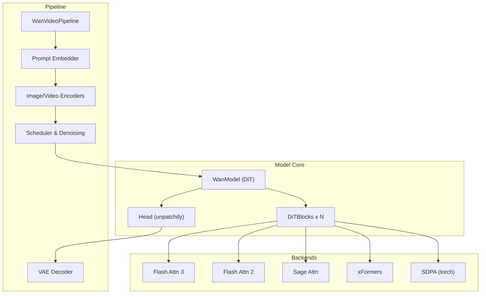
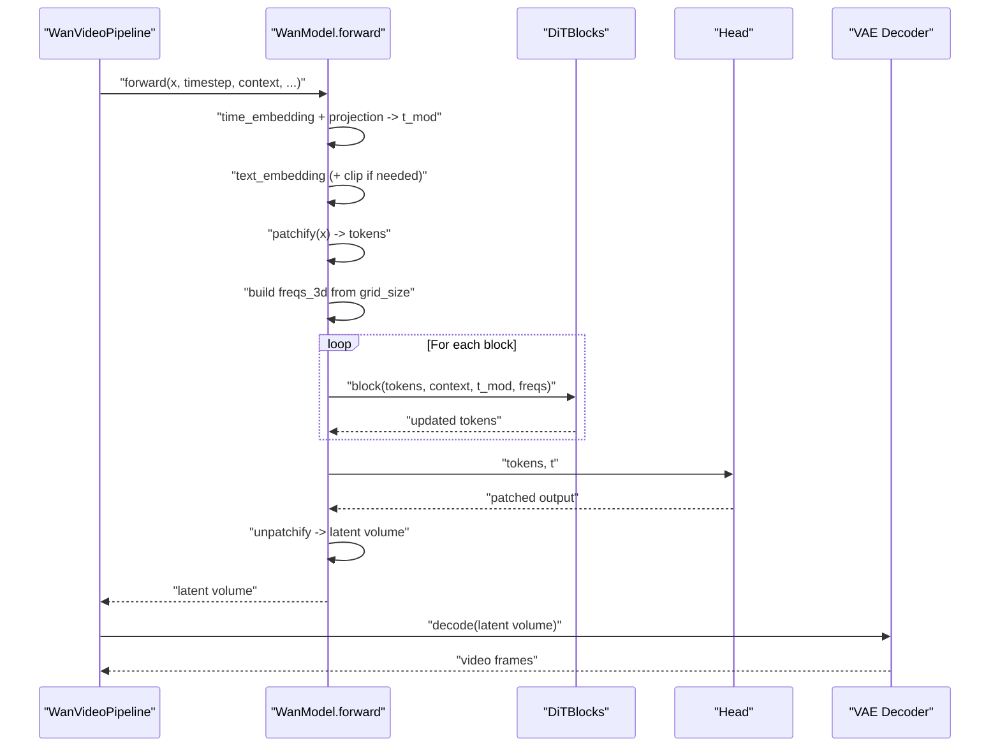
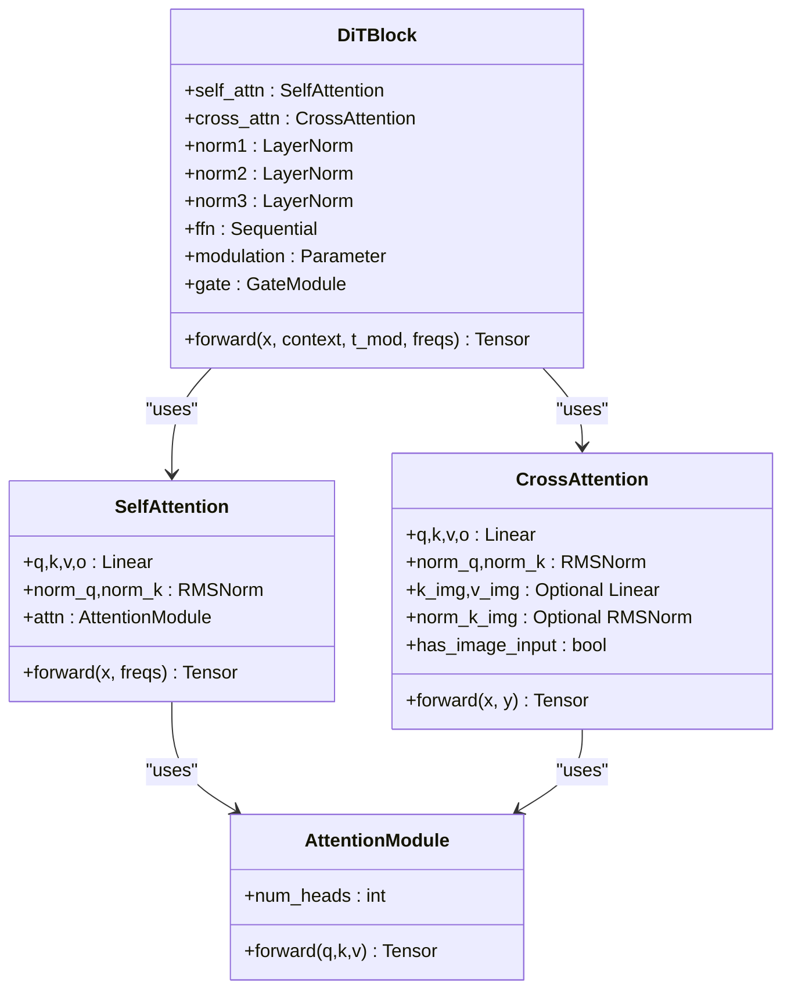
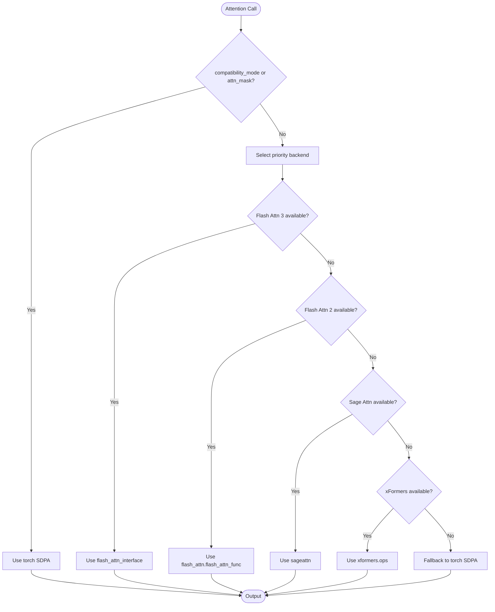
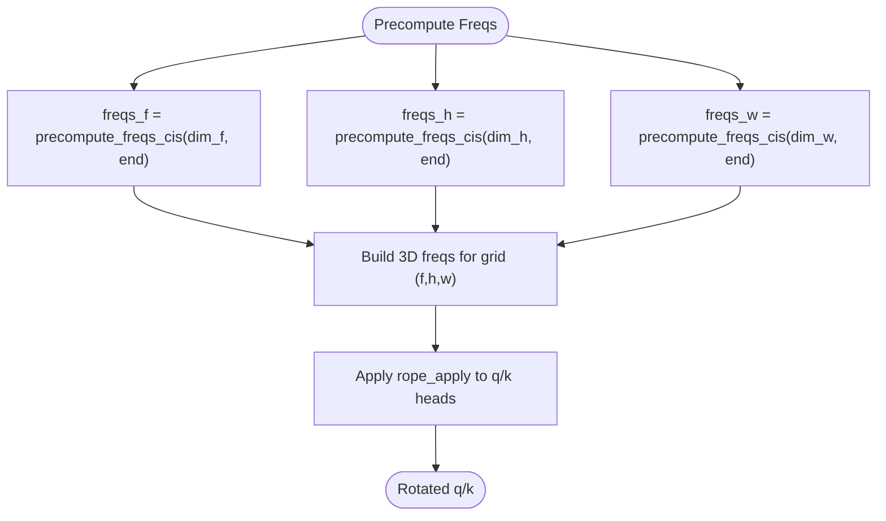
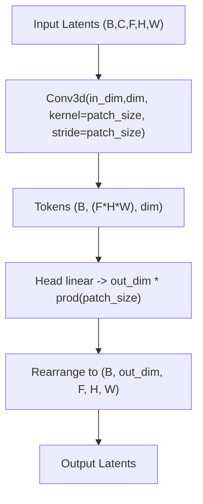
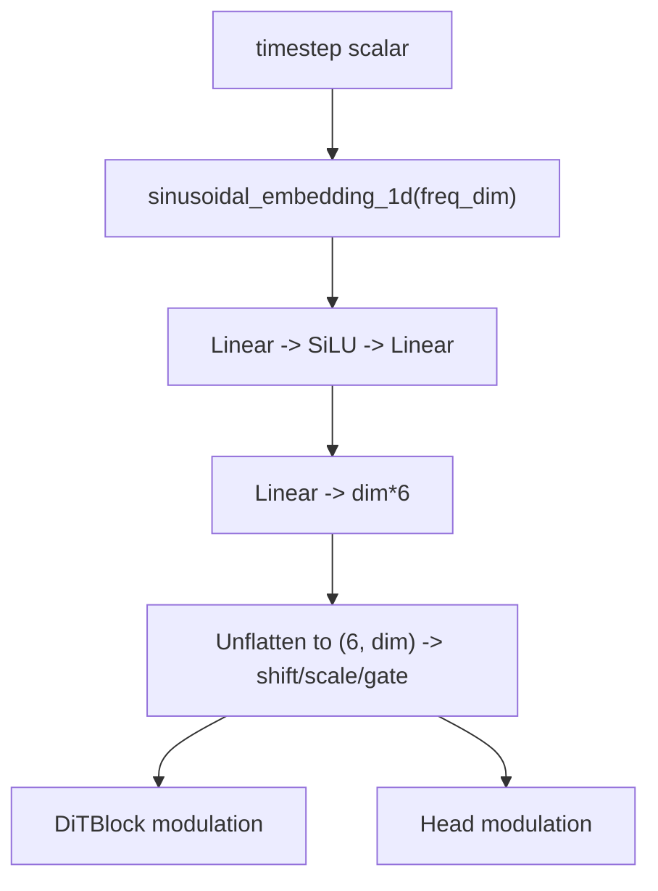
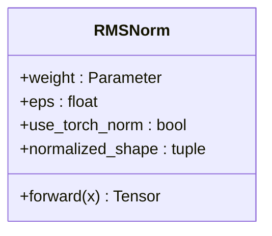
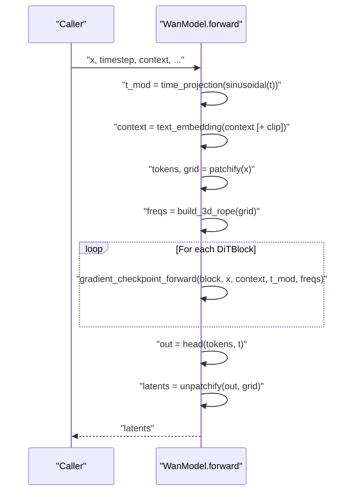
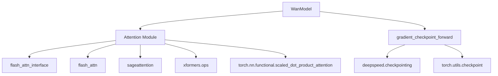

# WanVideo DiT Architecture

<cite>
**Referenced Files in This Document**
- [wan_video_dit.py](file://diffsynth/models/wan_video_dit.py)
- [attention.py](file://diffsynth/core/attention/attention.py)
- [gradient_checkpoint.py](file://diffsynth/core/gradient/gradient_checkpoint.py)
- [model_configs.py](file://diffsynth/configs/model_configs.py)
- [wan_video.py](file://diffsynth/pipelines/wan_video.py)
- [wan_video_vae.py](file://diffsynth/models/wan_video_vae.py)
</cite>

## Table of Contents
1. [Introduction](#introduction)
2. [Project Structure](#project-structure)
3. [Core Components](#core-components)
4. [Architecture Overview](#architecture-overview)
5. [Detailed Component Analysis](#detailed-component-analysis)
6. [Dependency Analysis](#dependency-analysis)
7. [Performance Considerations](#performance-considerations)
8. [Troubleshooting Guide](#troubleshooting-guide)
9. [Conclusion](#conclusion)
10. [Appendices](#appendices)

## Introduction
This document explains the WanVideo Diffusion Transformer (DiT) architecture for video generation. It focuses on:
- The DiTBlock with self-attention and cross-attention mechanisms
- 3D patch embedding for video tensors and unpatchification
- Time-step modulation via AdaLN-like conditioning
- Attention backends including Flash Attention 2/3, Sage Attention, and compatibility modes
- 3D Rotary Positional Embeddings (RoPE) for spatial-temporal positioning
- RMS normalization layers
- The complete forward pass from patchification to unpatchification
- Model configuration parameters, gradient checkpointing usage, and memory optimization techniques for large-scale video generation

## Project Structure
The WanVideo DiT is implemented as a modular pipeline that integrates text encoding, image/video encoders, a DiT backbone, and a VAE decoder. Key files include:
- DiT model and blocks: wan_video_dit.py
- Attention utilities and backend selection: attention.py
- Gradient checkpointing wrapper: gradient_checkpoint.py
- Model configurations for different variants: model_configs.py
- Pipeline orchestration and units: wan_video.py
- Video VAE components used by the pipeline: wan_video_vae.py

**Diagram sources**
- [wan_video.py](file://diffsynth/pipelines/wan_video.py)
- [wan_video_dit.py](file://diffsynth/models/wan_video_dit.py)
- [attention.py](file://diffsynth/core/attention/attention.py)

**Section sources**
- [wan_video.py](file://diffsynth/pipelines/wan_video.py)
- [wan_video_dit.py](file://diffsynth/models/wan_video_dit.py)
- [attention.py](file://diffsynth/core/attention/attention.py)

## Core Components
- DiTBlock: Combines multi-head self-attention, cross-attention with context (text/image), and an MLP with gated residuals. Uses time-step modulation per block.
- SelfAttention: Projects inputs to Q/K/V, applies RMSNorm to Q/K, then RoPE before attention.
- CrossAttention: Supports optional image tokens; uses RMSNorm on Q/K and can fuse image-specific K/V when enabled.
- Head: Final projection layer with modulation to produce patchified outputs.
- Patching: 3D Conv3d-based patch embedding and inverse rearrangement for unpatchification.
- Time-step Modulation: Sinusoidal embeddings projected into six modulation streams per block.
- RoPE: Precomputed 3D frequencies for frames, height, and width dimensions applied to Q/K.
- RMSNorm: Normalization with learnable scale and optional torch.nn.functional.rms_norm fallback.

**Section sources**
- [wan_video_dit.py](file://diffsynth/models/wan_video_dit.py)

## Architecture Overview
The WanModel orchestrates the full DiT forward pass:
- Text embedding and optional image embedding are concatenated into context.
- Input latents are patchified into tokens.
- 3D RoPE frequencies are constructed based on grid size.
- Each DiTBlock processes tokens with self-attention, cross-attention, and MLP, modulated by timestep.
- The Head projects tokens back to patch space, and unpatchification reconstructs the latent volume.

**Diagram sources**
- [wan_video.py](file://diffsynth/pipelines/wan_video.py)
- [wan_video_dit.py](file://diffsynth/models/wan_video_dit.py)

## Detailed Component Analysis

### DiTBlock: Self-Attention, Cross-Attention, and Modulation
- Inputs: token sequence x, context y, timestep modulation t_mod, and RoPE freqs.
- Steps:
  - Unpack six modulation streams (shift/scale/gate for MSA and MLP).
  - Apply RMSNorm to x, modulate, then self-attention with RoPE.
  - Add cross-attention with context (optional image tokens).
  - Apply RMSNorm, modulate, then MLP with gated residual.
- Output: updated token sequence.

**Diagram sources**
- [wan_video_dit.py](file://diffsynth/models/wan_video_dit.py)

**Section sources**
- [wan_video_dit.py](file://diffsynth/models/wan_video_dit.py)

### Attention Backends and Compatibility Modes
- Backend selection prioritizes Flash Attention 3 > Flash Attention 2 > Sage Attention > xFormers > SDPA (torch).
- Compatibility mode forces SDPA path even if faster backends are available.
- Reordering patterns differ between implementations; wrappers handle layout conversions.

**Diagram sources**
- [attention.py](file://diffsynth/core/attention/attention.py)
- [wan_video_dit.py](file://diffsynth/models/wan_video_dit.py)

**Section sources**
- [attention.py](file://diffsynth/core/attention/attention.py)
- [wan_video_dit.py](file://diffsynth/models/wan_video_dit.py)

### 3D RoPE for Spatial-Temporal Positioning
- Precompute 1D frequency tables for frame, height, and width dimensions.
- Concatenate along feature axis to form 3D RoPE per token.
- Apply complex multiplication to reshape Q/K heads.

**Diagram sources**
- [wan_video_dit.py](file://diffsynth/models/wan_video_dit.py)

**Section sources**
- [wan_video_dit.py](file://diffsynth/models/wan_video_dit.py)

### Patch Embedding and Unpatchification
- Patch embedding: 3D convolution with kernel=patch_size and stride=patch_size.
- Unpatchification: Rearrange tokens back to (B, C, F, H, W) using patch_size and grid_size.

**Diagram sources**
- [wan_video_dit.py](file://diffsynth/models/wan_video_dit.py)

**Section sources**
- [wan_video_dit.py](file://diffsynth/models/wan_video_dit.py)

### Time Step Modulation
- Sinusoidal 1D embedding of timestep passed through two-layer MLP to produce a vector.
- Projected into six channels (shift/scale/gate for MSA and MLP) and broadcast across sequences.
- Used to modulate normalized features in DiTBlock and Head.

**Diagram sources**
- [wan_video_dit.py](file://diffsynth/models/wan_video_dit.py)

**Section sources**
- [wan_video_dit.py](file://diffsynth/models/wan_video_dit.py)

### RMS Normalization Layers
- Custom RMSNorm with learnable weight and eps.
- Optional switch to use torch.nn.functional.rms_norm for compatibility.

**Diagram sources**
- [wan_video_dit.py](file://diffsynth/models/wan_video_dit.py)

**Section sources**
- [wan_video_dit.py](file://diffsynth/models/wan_video_dit.py)

### Complete Forward Pass Pipeline
- Inputs: video latents x, timestep, context (text and optional image).
- Steps:
  - Compute t_mod from timestep.
  - Encode text and optionally concatenate image embeddings.
  - Patchify x into tokens.
  - Build 3D RoPE frequencies from grid size.
  - Iterate through DiTBlocks with gradient checkpointing during training.
  - Project via Head and unpatchify to get latent volume.

**Diagram sources**
- [wan_video_dit.py](file://diffsynth/models/wan_video_dit.py)
- [gradient_checkpoint.py](file://diffsynth/core/gradient/gradient_checkpoint.py)

**Section sources**
- [wan_video_dit.py](file://diffsynth/models/wan_video_dit.py)
- [gradient_checkpoint.py](file://diffsynth/core/gradient/gradient_checkpoint.py)

## Dependency Analysis
- DiT depends on attention backends selected at runtime.
- Gradient checkpointing integrates with DeepSpeed or PyTorch’s checkpoint utility.
- Pipeline composes multiple units for prompt embedding, image/video encoding, control signals, and decoding.

**Diagram sources**
- [wan_video_dit.py](file://diffsynth/models/wan_video_dit.py)
- [attention.py](file://diffsynth/core/attention/attention.py)
- [gradient_checkpoint.py](file://diffsynth/core/gradient/gradient_checkpoint.py)

**Section sources**
- [wan_video_dit.py](file://diffsynth/models/wan_video_dit.py)
- [attention.py](file://diffsynth/core/attention/attention.py)
- [gradient_checkpoint.py](file://diffsynth/core/gradient/gradient_checkpoint.py)

## Performance Considerations
- Attention backend selection:
  - Prefer Flash Attention 3/2 for speed and memory efficiency.
  - Sage Attention provides an alternative when Flash is unavailable.
  - xFormers and SDPA serve as fallbacks.
- Gradient checkpointing:
  - Use deepspeed.checkpointing when configured; otherwise fall back to torch.utils.checkpoint.
  - Offloading option saves memory by saving activations on CPU.
- Memory optimization techniques:
  - Reduce batch size or sequence length.
  - Enable tiled VAE encode/decode to limit peak memory.
  - Use lower precision (bfloat16) where supported.
  - Disable unnecessary modules (e.g., image encoder) when not required.
  - Utilize unified sequence parallelism for very long sequences.

[No sources needed since this section provides general guidance]

## Troubleshooting Guide
- If attention fails due to unsupported backend:
  - Set environment variable to force a specific implementation or enable compatibility mode.
- If OOM occurs during DiT forward:
  - Enable gradient checkpointing and offload.
  - Reduce input resolution or number of frames.
  - Use tiled VAE operations.
- If RoPE shapes mismatch:
  - Ensure grid_size matches patchified token sequence length.
- If text/image embeddings shape mismatches:
  - Verify has_image_input and require_clip_embedding flags align with provided inputs.

**Section sources**
- [wan_video_dit.py](file://diffsynth/models/wan_video_dit.py)
- [attention.py](file://diffsynth/core/attention/attention.py)
- [gradient_checkpoint.py](file://diffsynth/core/gradient/gradient_checkpoint.py)

## Conclusion
The WanVideo DiT architecture combines efficient attention backends, 3D RoPE, and robust modulation to support high-quality video generation. Its modular design allows flexible configuration and integration with various encoders and control signals. With gradient checkpointing and memory optimizations, it scales to large video tasks while maintaining performance.

[No sources needed since this section summarizes without analyzing specific files]

## Appendices

### Model Configuration Parameters
Common parameters for WanModel variants include:
- dim: transformer dimension
- in_dim: input channel dimension (varies with image/control fusion)
- ffn_dim: feed-forward dimension
- out_dim: output channel dimension
- text_dim: text encoder embedding dimension
- freq_dim: timestep embedding dimension
- patch_size: 3D patch size (typically [1,2,2])
- num_heads: number of attention heads
- num_layers: number of DiTBlocks
- eps: numerical stability constant
- has_image_input: whether to accept image tokens
- has_image_pos_emb: whether to add positional embedding to image tokens
- require_vae_embedding / require_clip_embedding: toggles for additional inputs
- seperated_timestep: variant-specific flag
- fuse_vae_embedding_in_latents: variant-specific flag

Example configurations are defined in model_configs.py for multiple Wan models.

**Section sources**
- [model_configs.py](file://diffsynth/configs/model_configs.py)

### Gradient Checkpointing Usage
- During training, set use_gradient_checkpointing=True to wrap block forward passes.
- Optionally enable use_gradient_checkpointing_offload to save activations on CPU.
- Integration supports DeepSpeed checkpointing when configured.

**Section sources**
- [gradient_checkpoint.py](file://diffsynth/core/gradient/gradient_checkpoint.py)
- [wan_video_dit.py](file://diffsynth/models/wan_video_dit.py)

### Memory Optimization Techniques
- Use tiled VAE encode/decode to reduce peak memory.
- Lower precision (bfloat16) and disable unused modules.
- Adjust sequence length and batch size.
- Enable unified sequence parallelism for long sequences.

**Section sources**
- [wan_video.py](file://diffsynth/pipelines/wan_video.py)
- [wan_video_vae.py](file://diffsynth/models/wan_video_vae.py)