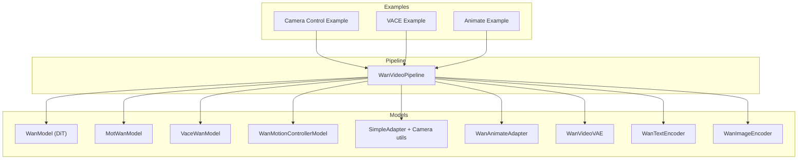
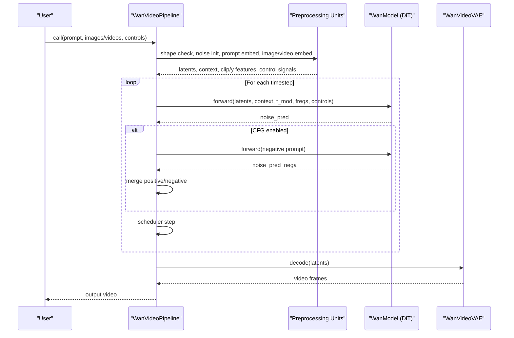
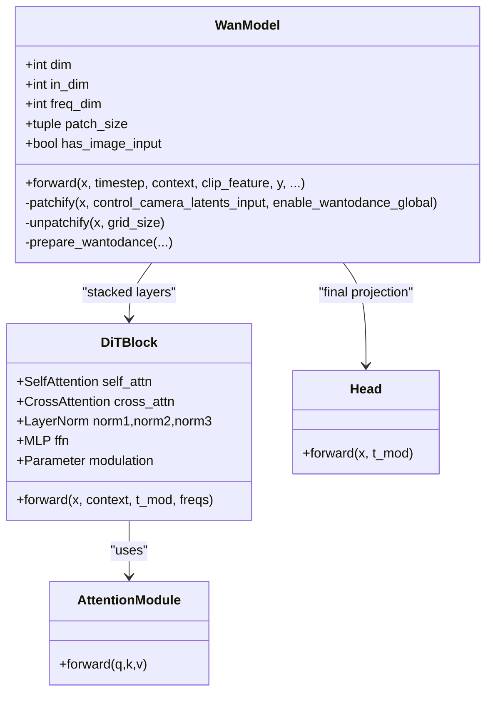
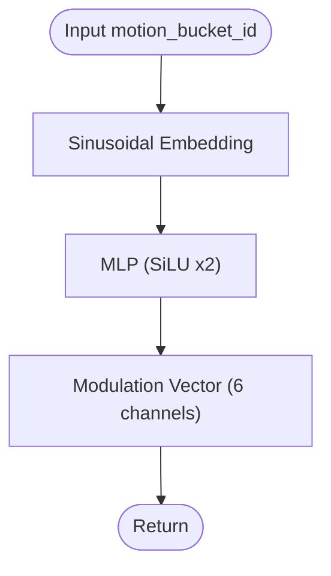
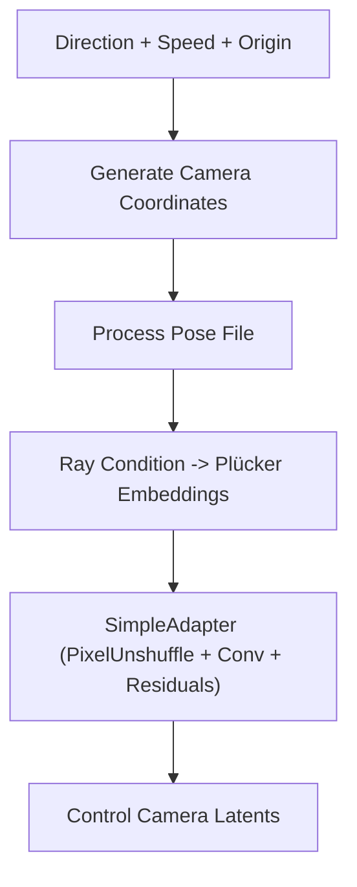
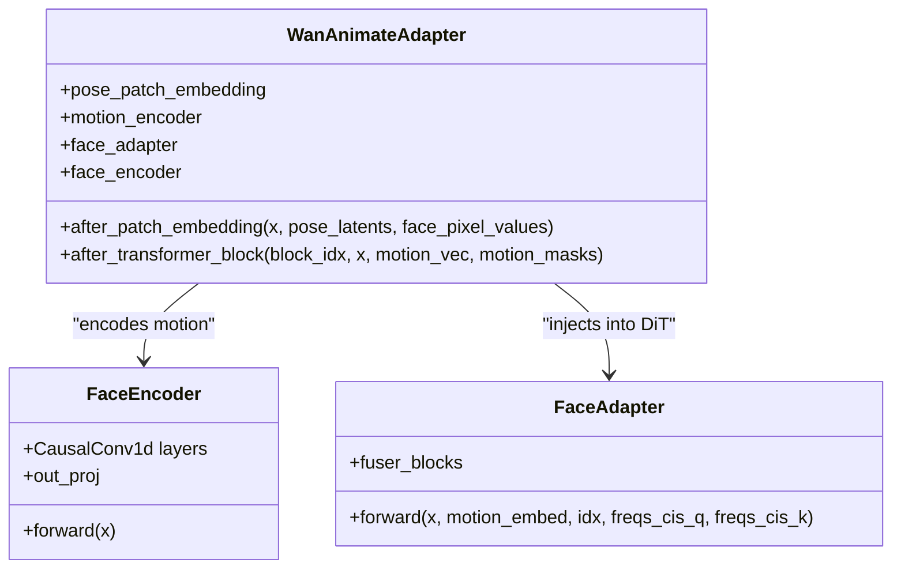
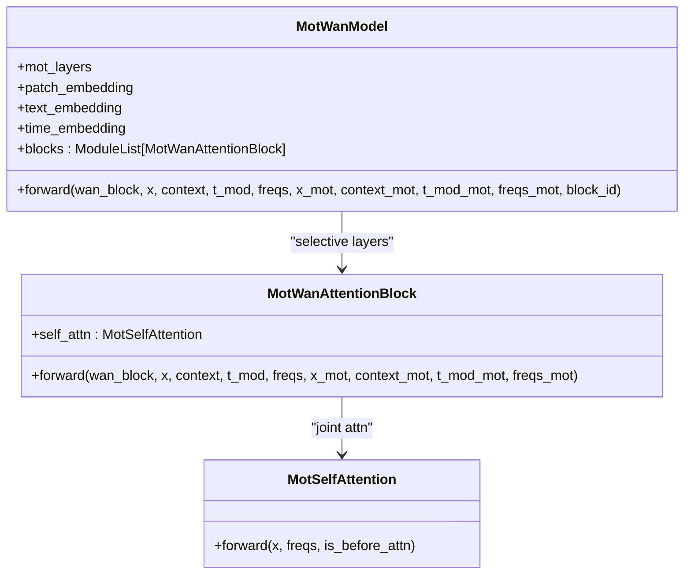
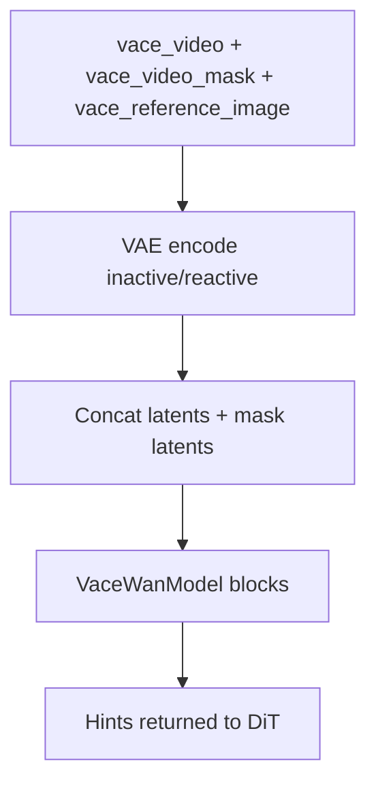
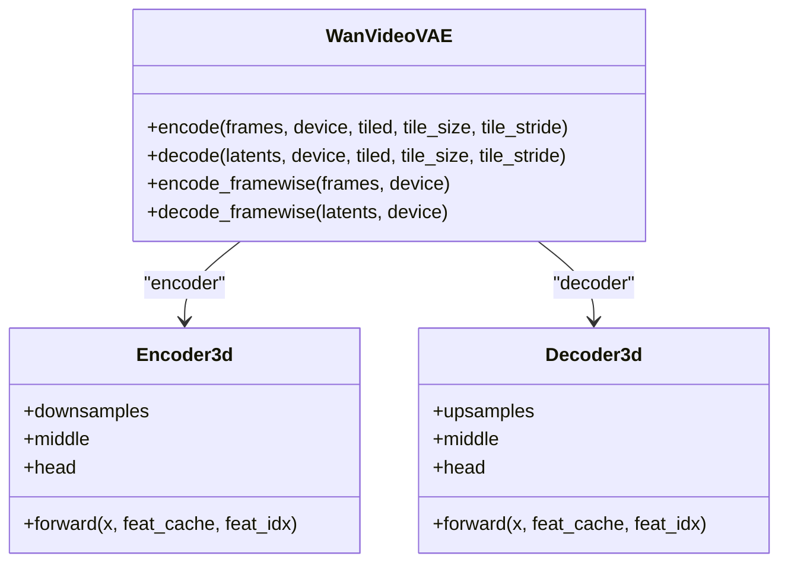
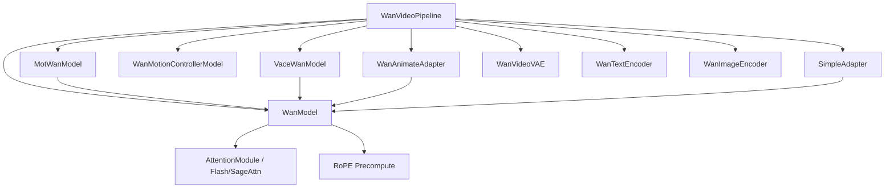

# WanVideo Models

<cite>
**Referenced Files in This Document**
- [wan_video_dit.py](file://diffsynth/models/wan_video_dit.py)
- [wan_video_motion_controller.py](file://diffsynth/models/wan_video_motion_controller.py)
- [wan_video_camera_controller.py](file://diffsynth/models/wan_video_camera_controller.py)
- [wan_video_animate_adapter.py](file://diffsynth/models/wan_video_animate_adapter.py)
- [wan_video_mot.py](file://diffsynth/models/wan_video_mot.py)
- [wan_video_vace.py](file://diffsynth/models/wan_video_vace.py)
- [wan_video_vae.py](file://diffsynth/models/wan_video_vae.py)
- [wan_video_text_encoder.py](file://diffsynth/models/wan_video_text_encoder.py)
- [wan_video_image_encoder.py](file://diffsynth/models/wan_video_image_encoder.py)
- [wan_video.py](file://diffsynth/pipelines/wan_video.py)
- [Wan2.1-Fun-V1.1-14B-Control-Camera.py](file://examples/wanvideo/model_inference/Wan2.1-Fun-V1.1-14B-Control-Camera.py)
- [Wan2.1-VACE-1.3B.py](file://examples/wanvideo/model_inference/Wan2.1-VACE-1.3B.py)
- [Wan2.2-Animate-14B.py](file://examples/wanvideo/model_inference/Wan2.2-Animate-14B.py)
- [Wan.md](file://docs/en/Model_Details/Wan.md)
</cite>

## Table of Contents
1. Introduction
2. Project Structure
3. Core Components
4. Architecture Overview
5. Detailed Component Analysis
6. Dependency Analysis
7. Performance Considerations
8. Troubleshooting Guide
9. Conclusion
10. Appendices

## Introduction
This document provides a comprehensive technical guide to the WanVideo model implementations focused on video generation. It explains the DiT-based video diffusion backbone, motion controllers for dynamic scene control, camera controllers for cinematic effects, animate adapters for character animation, and integrations with MOT (Multiple Object Tracking) and VACE (Video Action Control Encoder). It also details the end-to-end pipeline from text prompts to generated videos and includes practical examples for camera control, motion specification, and multi-modal inputs.

## Project Structure
The WanVideo implementation is organized into:
- Model components under diffsynth/models: DiT backbone, motion controller, camera controller, animate adapter, MOT/VACE modules, VAE, text/image encoders.
- Pipeline orchestration under diffsynth/pipelines: unit-based processing graph that wires inputs, controls, and denoising steps.
- Examples under examples/wanvideo/model_inference demonstrating usage patterns for camera control, VACE, and animate workflows.
- Documentation under docs/en/Model_Details/Wan.md describing lineage, parameters, and usage.

**Diagram sources**
- [wan_video.py](file://diffsynth/pipelines/wan_video.py)
- [wan_video_dit.py](file://diffsynth/models/wan_video_dit.py)
- [wan_video_motion_controller.py](file://diffsynth/models/wan_video_motion_controller.py)
- [wan_video_camera_controller.py](file://diffsynth/models/wan_video_camera_controller.py)
- [wan_video_animate_adapter.py](file://diffsynth/models/wan_video_animate_adapter.py)
- [wan_video_mot.py](file://diffsynth/models/wan_video_mot.py)
- [wan_video_vace.py](file://diffsynth/models/wan_video_vace.py)
- [wan_video_vae.py](file://diffsynth/models/wan_video_vae.py)
- [wan_video_text_encoder.py](file://diffsynth/models/wan_video_text_encoder.py)
- [wan_video_image_encoder.py](file://diffsynth/models/wan_video_image_encoder.py)

**Section sources**
- [Wan.md](file://docs/en/Model_Details/Wan.md)

## Core Components
- DiT Backbone (WanModel): A 3D patching transformer with self/cross attention, time modulation, and optional image conditioning. Supports gradient checkpointing and multiple attention backends.
- Motion Controller (WanMotionControllerModel): Maps motion bucket IDs to modulation vectors via sinusoidal embeddings and MLPs.
- Camera Controller (SimpleAdapter + utilities): Generates Plücker embeddings from camera trajectories and injects them into DiT via an adapter.
- Animate Adapter (WanAnimateAdapter): Encodes pose/face sequences and injects motion features into DiT blocks for character animation.
- MOT Integration (MotWanModel): Extends DiT blocks to jointly attend to main and MOT latents for multi-object consistency.
- VACE (VaceWanModel): Processes control/reference latents and masks to produce hints injected into the DiT process.
- VAE (WanVideoVAE): Causal 3D encoder/decoder for temporal-consistent video latent space.
- Text/Image Encoders: T5-style text encoder and CLIP-like image encoder for multimodal conditioning.

**Section sources**
- [wan_video_dit.py](file://diffsynth/models/wan_video_dit.py)
- [wan_video_motion_controller.py](file://diffsynth/models/wan_video_motion_controller.py)
- [wan_video_camera_controller.py](file://diffsynth/models/wan_video_camera_controller.py)
- [wan_video_animate_adapter.py](file://diffsynth/models/wan_video_animate_adapter.py)
- [wan_video_mot.py](file://diffsynth/models/wan_video_mot.py)
- [wan_video_vace.py](file://diffsynth/models/wan_video_vace.py)
- [wan_video_vae.py](file://diffsynth/models/wan_video_vae.py)
- [wan_video_text_encoder.py](file://diffsynth/models/wan_video_text_encoder.py)
- [wan_video_image_encoder.py](file://diffsynth/models/wan_video_image_encoder.py)

## Architecture Overview
The pipeline orchestrates preprocessing units, denoising iterations over timesteps, and decoding. Key flows:
- Inputs are normalized and encoded (text, images, videos, audio).
- Latents are initialized and optionally conditioned by VAE/CLIP features.
- Control signals (camera, motion, VACE, animate, MOT) are prepared and injected at appropriate stages.
- DiT denoises latents per timestep; CFG can be applied.
- VAE decodes final latents to pixel frames.

**Diagram sources**
- [wan_video.py](file://diffsynth/pipelines/wan_video.py)
- [wan_video_dit.py](file://diffsynth/models/wan_video_dit.py)
- [wan_video_vae.py](file://diffsynth/models/wan_video_vae.py)

**Section sources**
- [wan_video.py](file://diffsynth/pipelines/wan_video.py)

## Detailed Component Analysis

### DiT Backbone (WanModel)
- Patch embedding: 3D convolutional patching with optional global path.
- Time embedding: sinusoidal embedding projected to modulation parameters.
- Transformer blocks: Self-attention with RoPE, cross-attention with optional image tokens, gated residual connections, and modulated LayerNorms.
- Head: Modulated projection to patch-space residuals.
- Optional integrations: control adapter for camera latents, Wantodance music injection, reference image/face embeddings.

**Diagram sources**
- [wan_video_dit.py](file://diffsynth/models/wan_video_dit.py)

**Section sources**
- [wan_video_dit.py](file://diffsynth/models/wan_video_dit.py)

### Motion Controller
- Converts discrete motion_bucket_id to continuous modulation via sinusoidal embedding and MLP.
- Produces 6-channel modulation vector aligned with DiT block modulation scheme.

**Diagram sources**
- [wan_video_motion_controller.py](file://diffsynth/models/wan_video_motion_controller.py)

**Section sources**
- [wan_video_motion_controller.py](file://diffsynth/models/wan_video_motion_controller.py)

### Camera Controller
- Generates camera trajectory coordinates based on direction and speed.
- Computes Plücker embeddings from intrinsic/extrinsic parameters.
- SimpleAdapter reduces spatial dimensions and extracts features to inject into DiT patch stream.

**Diagram sources**
- [wan_video_camera_controller.py](file://diffsynth/models/wan_video_camera_controller.py)

**Section sources**
- [wan_video_camera_controller.py](file://diffsynth/models/wan_video_camera_controller.py)

### Animate Adapter
- Encodes pose/face sequences through causal convolutions and a motion encoder.
- Projects motion features into token space and pads a special token.
- Injects motion features into selected DiT blocks via FaceAdapter fuser blocks.

**Diagram sources**
- [wan_video_animate_adapter.py](file://diffsynth/models/wan_video_animate_adapter.py)

**Section sources**
- [wan_video_animate_adapter.py](file://diffsynth/models/wan_video_animate_adapter.py)

### MOT Integration (MotWanModel)
- Extends DiT blocks to compute joint self-attention across main and MOT latents.
- Maintains separate contexts and time modulations for MOT branch.
- Uses flash attention to fuse Q/K/V from both streams.

**Diagram sources**
- [wan_video_mot.py](file://diffsynth/models/wan_video_mot.py)

**Section sources**
- [wan_video_mot.py](file://diffsynth/models/wan_video_mot.py)

### VACE (Video Action Control Encoder)
- Takes control video and mask, optionally reference images, and produces stacked hints.
- Pads and concatenates inactive/reactive latents and mask latents.
- Feeds through VaceWanModel blocks with gradient checkpointing.

**Diagram sources**
- [wan_video_vace.py](file://diffsynth/models/wan_video_vace.py)

**Section sources**
- [wan_video_vace.py](file://diffsynth/models/wan_video_vace.py)

### VAE (WanVideoVAE)
- Causal 3D convolutions and attention for temporally consistent encoding/decoding.
- Supports tiled inference and feature caching for long sequences.
- Provides framewise decoding option for memory efficiency.

**Diagram sources**
- [wan_video_vae.py](file://diffsynth/models/wan_video_vae.py)

**Section sources**
- [wan_video_vae.py](file://diffsynth/models/wan_video_vae.py)

### Text and Image Encoders
- WanTextEncoder: T5-style encoder with relative positional bias and feed-forward gating.
- WanImageEncoder: Vision Transformer with attention pooling and optional interpolation for variable sequence lengths.

**Section sources**
- [wan_video_text_encoder.py](file://diffsynth/models/wan_video_text_encoder.py)
- [wan_video_image_encoder.py](file://diffsynth/models/wan_video_image_encoder.py)

## Dependency Analysis
Key dependencies and relationships:
- Pipeline depends on all model components and orchestrates data flow.
- DiT depends on attention utilities, RoPE, and optional control adapters.
- MOT and VACE extend DiT blocks selectively.
- Animate adapter injects motion features into DiT at specific block indices.
- Camera controller outputs Plücker embeddings consumed by DiT’s control adapter.

**Diagram sources**
- [wan_video.py](file://diffsynth/pipelines/wan_video.py)
- [wan_video_dit.py](file://diffsynth/models/wan_video_dit.py)
- [wan_video_mot.py](file://diffsynth/models/wan_video_mot.py)
- [wan_video_vace.py](file://diffsynth/models/wan_video_vace.py)
- [wan_video_animate_adapter.py](file://diffsynth/models/wan_video_animate_adapter.py)
- [wan_video_camera_controller.py](file://diffsynth/models/wan_video_camera_controller.py)

**Section sources**
- [wan_video.py](file://diffsynth/pipelines/wan_video.py)

## Performance Considerations
- Attention backends: The DiT uses a prioritized selection among Flash Attention v3/v2, SageAttention, or PyTorch SDPA fallback for optimal throughput.
- Gradient checkpointing: Enabled during training to reduce memory footprint.
- Tiled VAE: Reduces VRAM usage during encoding/decoding with minor quality trade-offs.
- Sequence parallelism: Unified sequence parallel can be enabled to scale across devices.
- Framewise decoding: Useful for very long sequences to avoid OOM.

[No sources needed since this section provides general guidance]

## Troubleshooting Guide
Common issues and resolutions:
- VRAM overflow: Enable tiled VAE, reduce tile size/stride, use framewise decoding, or lower resolution/frame count.
- Shape mismatches: Ensure height/width multiples of 16 and num_frames = 4k+1; verify VAE upsampling factors.
- CFG instability: Adjust cfg_scale; consider merging positive/negative predictions if supported.
- Camera control artifacts: Validate direction/speed parameters and origin; ensure input image matches target resolution.
- MOT/VACE integration errors: Check that MOT/VACE latents and contexts match expected shapes and are properly concatenated.

**Section sources**
- [wan_video.py](file://diffsynth/pipelines/wan_video.py)
- [wan_video_vae.py](file://diffsynth/models/wan_video_vae.py)
- [wan_video_camera_controller.py](file://diffsynth/models/wan_video_camera_controller.py)

## Conclusion
WanVideo provides a modular, high-performance video generation framework built around a DiT backbone with rich control interfaces. Motion controllers, camera controllers, animate adapters, MOT, and VACE integrate seamlessly into the pipeline, enabling precise cinematic and character-driven video synthesis. The system supports efficient inference strategies and scalable execution modes suitable for research and production.

[No sources needed since this section summarizes without analyzing specific files]

## Appendices

### Example: Camera Control Operations
- Use camera_control_direction and camera_control_speed to generate Plücker embeddings and inject them into DiT via the control adapter.
- Reference example demonstrates Left/Up directions with an input image.

**Section sources**
- [Wan2.1-Fun-V1.1-14B-Control-Camera.py](file://examples/wanvideo/model_inference/Wan2.1-Fun-V1.1-14B-Control-Camera.py)
- [wan_video_camera_controller.py](file://diffsynth/models/wan_video_camera_controller.py)
- [wan_video.py](file://diffsynth/pipelines/wan_video.py)

### Example: Motion Specification
- Provide motion_bucket_id to influence motion amplitude via the motion controller.
- Integrates with DiT modulation parameters for consistent temporal dynamics.

**Section sources**
- [wan_video_motion_controller.py](file://diffsynth/models/wan_video_motion_controller.py)
- [wan_video.py](file://diffsynth/pipelines/wan_video.py)

### Example: Multi-modal Input Handling (VACE)
- Combine depth/control video and reference images to steer action and appearance.
- VACE processes inactive/reactive latents and mask latents to produce hints.

**Section sources**
- [Wan2.1-VACE-1.3B.py](file://examples/wanvideo/model_inference/Wan2.1-VACE-1.3B.py)
- [wan_video_vace.py](file://diffsynth/models/wan_video_vace.py)
- [wan_video.py](file://diffsynth/pipelines/wan_video.py)

### Example: Character Animation
- Supply pose and face videos to animate a static image with detailed motion.
- Optionally apply local editing via inpaint/mask videos and LoRA relighting.

**Section sources**
- [Wan2.2-Animate-14B.py](file://examples/wanvideo/model_inference/Wan2.2-Animate-14B.py)
- [wan_video_animate_adapter.py](file://diffsynth/models/wan_video_animate_adapter.py)
- [wan_video.py](file://diffsynth/pipelines/wan_video.py)