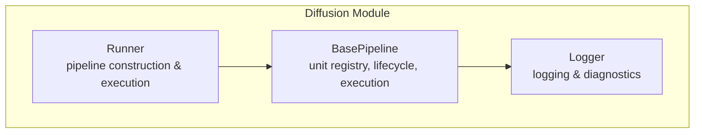
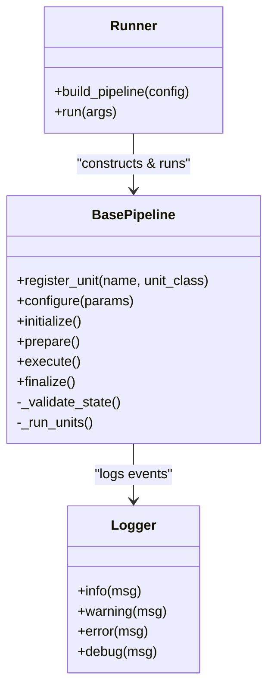
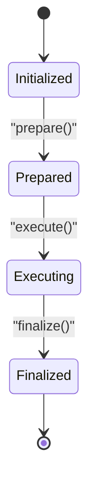
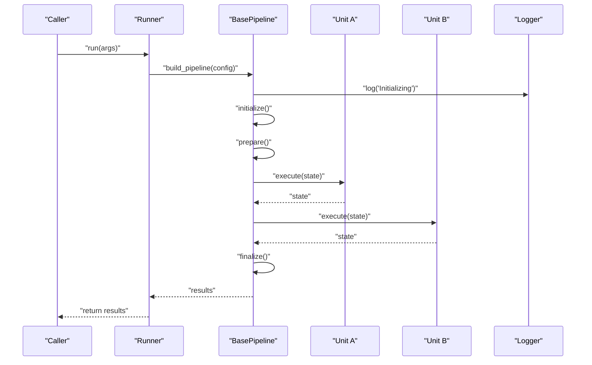
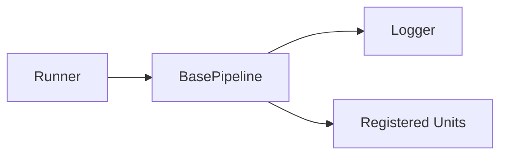

# Base Pipeline Architecture

<cite>
**Referenced Files in This Document**
- [base_pipeline.py](file://diffsynth/diffusion/base_pipeline.py)
- [runner.py](file://diffsynth/diffusion/runner.py)
- [logger.py](file://diffsynth/diffusion/logger.py)
</cite>

## Table of Contents
1. [Introduction](#introduction)
2. [Project Structure](#project-structure)
3. [Core Components](#core-components)
4. [Architecture Overview](#architecture-overview)
5. [Detailed Component Analysis](#detailed-component-analysis)
6. [Dependency Analysis](#dependency-analysis)
7. [Performance Considerations](#performance-considerations)
8. [Troubleshooting Guide](#troubleshooting-guide)
9. [Conclusion](#conclusion)

## Introduction
This document explains the base pipeline architecture used across ODTSR-edit diffusion pipelines. It focuses on the BasePipeline class design, unit management, state handling, and execution flow from initialization to result generation. It also covers how units are registered, configured, and executed; provides examples for basic setup, parameter configuration, and result processing; and highlights extensibility points, error handling, logging, and debugging capabilities.

## Project Structure
The base pipeline is implemented under the diffusion module with three key files:
- base_pipeline.py: Defines the BasePipeline class and core orchestration logic
- runner.py: Provides a high-level runner that constructs and executes pipelines
- logger.py: Centralized logging utilities used by the pipeline

**Diagram sources**
- [base_pipeline.py](file://diffsynth/diffusion/base_pipeline.py)
- [runner.py](file://diffsynth/diffusion/runner.py)
- [logger.py](file://diffsynth/diffusion/logger.py)

**Section sources**
- [base_pipeline.py](file://diffsynth/diffusion/base_pipeline.py)
- [runner.py](file://diffsynth/diffusion/runner.py)
- [logger.py](file://diffsynth/diffusion/logger.py)

## Core Components
- BasePipeline: Orchestrates the full pipeline lifecycle, manages a registry of units, handles state transitions, and drives execution.
- Runner: A convenience entry point that builds a pipeline instance, configures it, and runs it end-to-end.
- Logger: Provides consistent logging and diagnostic output throughout the pipeline lifecycle.

Key responsibilities:
- Unit registration and discovery
- Parameter resolution and validation
- State machine for lifecycle phases (init, prepare, execute, finalize)
- Execution loop over units with progress tracking
- Error propagation and cleanup

**Section sources**
- [base_pipeline.py](file://diffsynth/diffusion/base_pipeline.py)
- [runner.py](file://diffsynth/diffusion/runner.py)
- [logger.py](file://diffsynth/diffusion/logger.py)

## Architecture Overview
The pipeline follows a staged execution model where each stage is implemented as a “unit.” The BasePipeline maintains an ordered list of units and a state machine that ensures correct ordering and isolation between stages. The Runner abstracts away instantiation details and exposes a simple run interface.

**Diagram sources**
- [base_pipeline.py](file://diffsynth/diffusion/base_pipeline.py)
- [runner.py](file://diffsynth/diffusion/runner.py)
- [logger.py](file://diffsynth/diffusion/logger.py)

## Detailed Component Analysis

### BasePipeline Class Design
Responsibilities:
- Unit Registry: Stores named unit classes and instantiates them during execution.
- Lifecycle Management: Enforces a strict order of operations through state transitions.
- Execution Flow: Iterates through units, passing shared state between them.
- Configuration: Accepts parameters and resolves defaults, validating required fields.
- Extensibility: Hooks for custom units and optional pre/post steps.

Lifecycle states:
- Initialized: After construction and initial parameter validation
- Prepared: After resource allocation and data preparation
- Executing: During unit iteration
- Finalized: After cleanup and result assembly

**Diagram sources**
- [base_pipeline.py](file://diffsynth/diffusion/base_pipeline.py)

**Section sources**
- [base_pipeline.py](file://diffsynth/diffusion/base_pipeline.py)

### Unit Management
Units are discrete processing steps that can be:
- Data loaders
- Preprocessors
- Model inference steps
- Postprocessors
- Savers or exporters

Unit lifecycle within the pipeline:
- Registration: Units are registered by name and class reference
- Instantiation: Created during prepare() with resolved parameters
- Execution: Called in order during execute(), receiving and returning shared state
- Cleanup: Optional teardown hooks if needed

Best practices:
- Keep units stateless where possible; rely on shared state passed by the pipeline
- Validate inputs and raise descriptive errors
- Log progress and metrics at boundaries

**Section sources**
- [base_pipeline.py](file://diffsynth/diffusion/base_pipeline.py)

### State Handling and Execution Flow
Shared state is a dictionary-like object passed through all units. Typical keys include:
- Inputs (prompts, images, masks)
- Intermediate tensors or embeddings
- Metadata (timestamps, step counts)
- Outputs (final results, logs)

Execution flow:
1. Initialize pipeline with configuration
2. Prepare resources and instantiate units
3. Iterate through units, updating shared state
4. Finalize and assemble results

**Diagram sources**
- [base_pipeline.py](file://diffsynth/diffusion/base_pipeline.py)
- [runner.py](file://diffsynth/diffusion/runner.py)
- [logger.py](file://diffsynth/diffusion/logger.py)

**Section sources**
- [base_pipeline.py](file://diffsynth/diffusion/base_pipeline.py)
- [runner.py](file://diffsynth/diffusion/runner.py)

### Runner: High-Level Orchestration
The Runner encapsulates:
- Parsing command-line or programmatic arguments
- Building the pipeline instance from configuration
- Invoking the pipeline’s run method
- Returning results and handling top-level exceptions

Typical usage pattern:
- Construct Runner with a configuration dict or CLI args
- Call run() to execute the pipeline
- Capture and process returned results

**Section sources**
- [runner.py](file://diffsynth/diffusion/runner.py)

### Logging and Diagnostics
The Logger provides:
- Structured log levels (info, warning, error, debug)
- Consistent formatting across components
- Optional file or stream outputs

Integration points:
- Pipeline logs lifecycle events (init, prepare, execute, finalize)
- Units should log progress and errors
- Runner logs start/end and any top-level failures

**Section sources**
- [logger.py](file://diffsynth/diffusion/logger.py)

## Dependency Analysis
The pipeline has clear separation of concerns:
- Runner depends on BasePipeline for orchestration
- BasePipeline depends on Logger for diagnostics
- Units depend only on the shared state contract

**Diagram sources**
- [base_pipeline.py](file://diffsynth/diffusion/base_pipeline.py)
- [runner.py](file://diffsynth/diffusion/runner.py)
- [logger.py](file://diffsynth/diffusion/logger.py)

**Section sources**
- [base_pipeline.py](file://diffsynth/diffusion/base_pipeline.py)
- [runner.py](file://diffsynth/diffusion/runner.py)
- [logger.py](file://diffsynth/diffusion/logger.py)

## Performance Considerations
- Minimize shared state copies; prefer references to large tensors
- Batch unit operations when possible to reduce overhead
- Use lazy loading for heavy resources during prepare()
- Enable appropriate logging verbosity to avoid I/O bottlenecks
- Consider asynchronous execution for independent units if supported

[No sources needed since this section provides general guidance]

## Troubleshooting Guide
Common issues and resolutions:
- Missing unit registration: Ensure all required units are registered before prepare()
- Invalid parameters: Validate configuration early in initialize()
- State mismatches: Verify expected keys exist in shared state before use
- Resource leaks: Implement cleanup in finalize() and handle exceptions gracefully
- Logging not visible: Check logger configuration and output destinations

Error handling patterns:
- Raise descriptive exceptions with context
- Catch and wrap low-level errors with pipeline-level messages
- Roll back partial state changes on failure

Debugging tips:
- Enable debug-level logs for detailed traces
- Inspect shared state snapshots at unit boundaries
- Add timing logs around expensive units

**Section sources**
- [base_pipeline.py](file://diffsynth/diffusion/base_pipeline.py)
- [logger.py](file://diffsynth/diffusion/logger.py)

## Conclusion
The BasePipeline architecture provides a robust, extensible foundation for building complex diffusion workflows. By separating concerns into units, enforcing a clear lifecycle, and centralizing logging and error handling, it enables reliable and maintainable pipelines. The Runner simplifies usage while preserving flexibility for advanced customization.

[No sources needed since this section summarizes without analyzing specific files]