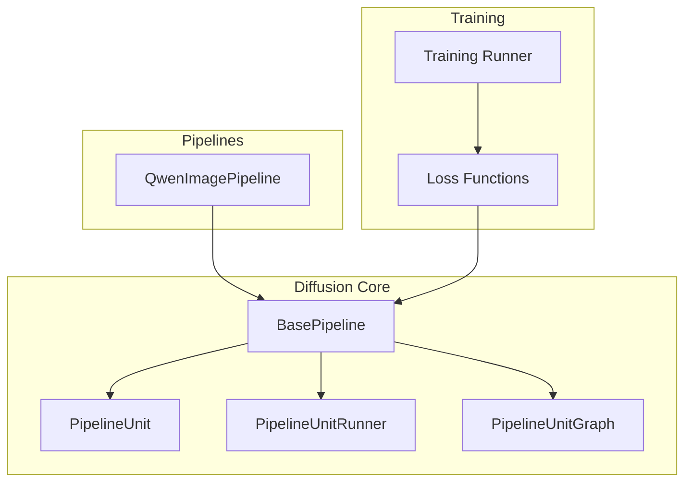
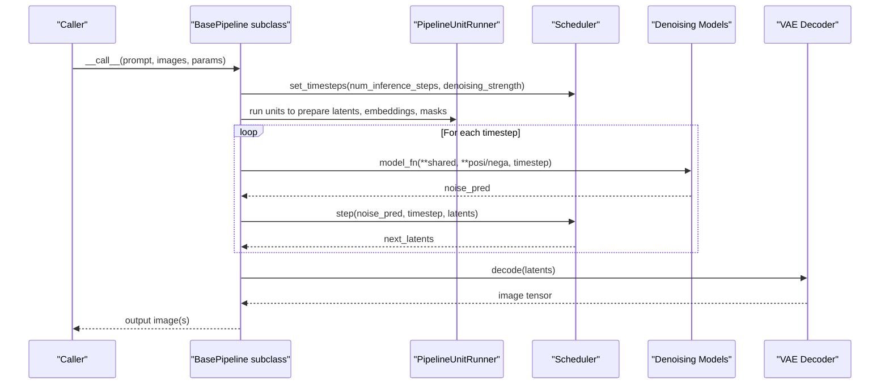
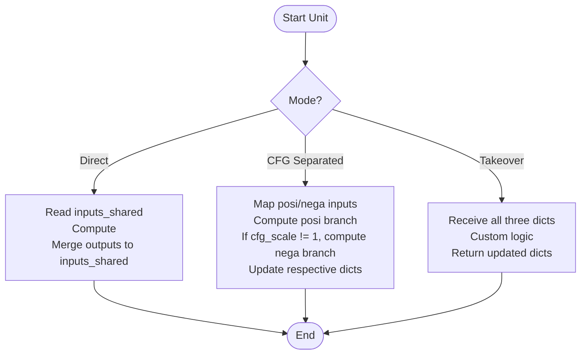
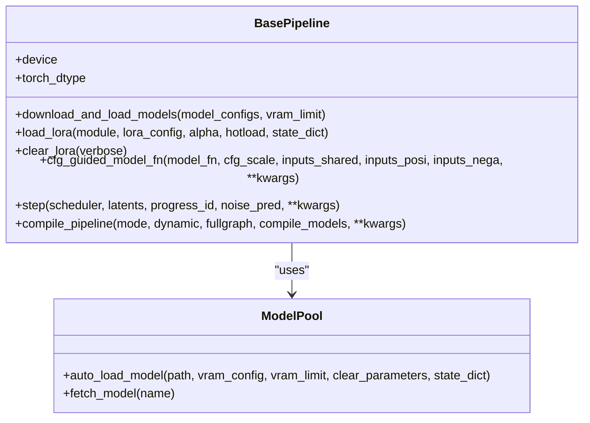
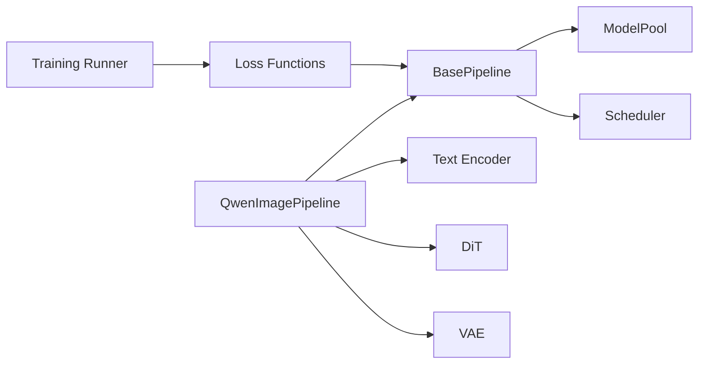

# Custom Pipeline Development

<cite>
**Referenced Files in This Document**
- [base_pipeline.py](file://diffsynth/diffusion/base_pipeline.py)
- [Building_a_Pipeline.md](file://docs/en/Developer_Guide/Building_a_Pipeline.md)
- [qwen_image.py](file://diffsynth/pipelines/qwen_image.py)
- [loss.py](file://diffsynth/diffusion/loss.py)
- [runner.py](file://diffsynth/diffusion/runner.py)
- [Integrating_Your_Model.md](file://docs/en/Developer_Guide/Integrating_Your_Model.md)
</cite>

## Table of Contents
1. Introduction
2. Project Structure
3. Core Components
4. Architecture Overview
5. Detailed Component Analysis
6. Dependency Analysis
7. Performance Considerations
8. Troubleshooting Guide
9. Conclusion

## Introduction
This document explains how to build custom pipelines in ODTSR-edit by extending the BasePipeline class. It covers defining custom units, implementing data processing logic, integrating with existing model components, handling different input formats, implementing custom loss functions, optimizing performance, and strategies for testing, debugging, and deployment. Practical examples are grounded in real pipeline implementations within the repository.

## Project Structure
The pipeline system is centered around a base pipeline class and a unit-based execution graph. Pipelines orchestrate preprocessing via PipelineUnit instances and iterate through a scheduler-driven denoising loop using a unified model_fn interface. Training utilities and loss functions integrate seamlessly with the same pipeline structure.

**Diagram sources**
- [base_pipeline.py:14-501](file://diffsynth/diffusion/base_pipeline.py#L14-L501)
- [qwen_image.py:25-197](file://diffsynth/pipelines/qwen_image.py#L25-L197)
- [loss.py:5-159](file://diffsynth/diffusion/loss.py#L5-L159)
- [runner.py:8-47](file://diffsynth/diffusion/runner.py#L8-L47)

**Section sources**
- [base_pipeline.py:14-501](file://diffsynth/diffusion/base_pipeline.py#L14-L501)
- [Building_a_Pipeline.md:1-250](file://docs/en/Developer_Guide/Building_a_Pipeline.md#L1-L250)

## Core Components
- BasePipeline: Provides device/dtype management, shape checks, preprocessing helpers (image/video), VRAM control, CFG guidance, compilation hooks, LoRA loading/clearing, and the core step function.
- PipelineUnit: Declarative building block that declares inputs/outputs and processes shared, positive, or negative branches; supports takeover mode for complex flows.
- PipelineUnitRunner: Executes units according to their configuration (direct, CFG-separated, or takeover).
- PipelineUnitGraph: Builds dependency edges and chains among units to support advanced features like split training and VRAM-aware segmentation.
- Loss functions: Provide FlowMatch SFT, audio-video variants, direct distillation, and trajectory imitation losses that operate on the same pipeline interface.
- Training runner: Orchestrates Accelerate-based training loops and optional DeepSpeed activation checkpointing.

Key responsibilities:
- Data I/O and format conversion: preprocess_image/preprocess_video and vae_output_to_image/vae_output_to_video.
- Iteration control: step() integrates scheduler updates and optional inpainting blending.
- Model integration: download_and_load_models, load_lora, clear_lora, cfg_guided_model_fn.
- Compilation: compile_pipeline for torch.compile with regional compilation for repeated blocks.

**Section sources**
- [base_pipeline.py:61-373](file://diffsynth/diffusion/base_pipeline.py#L61-L373)
- [base_pipeline.py:375-501](file://diffsynth/diffusion/base_pipeline.py#L375-L501)
- [loss.py:5-159](file://diffsynth/diffusion/loss.py#L5-L159)
- [runner.py:8-47](file://diffsynth/diffusion/runner.py#L8-L47)

## Architecture Overview
A typical pipeline extends BasePipeline, defines a set of PipelineUnits, implements from_pretrained to fetch models via ModelPool, and wires a model_fn that unifies forward calls across models during iteration. The __call__ method sets up the scheduler, prepares inputs_posi/inputs_nega/inputs_shared, runs all units, iterates timesteps with CFG guidance, decodes outputs, and manages VRAM.

**Diagram sources**
- [qwen_image.py:100-197](file://diffsynth/pipelines/qwen_image.py#L100-L197)
- [base_pipeline.py:220-226](file://diffsynth/diffusion/base_pipeline.py#L220-L226)
- [base_pipeline.py:321-340](file://diffsynth/diffusion/base_pipeline.py#L321-L340)

**Section sources**
- [Building_a_Pipeline.md:86-156](file://docs/en/Developer_Guide/Building_a_Pipeline.md#L86-L156)
- [qwen_image.py:100-197](file://diffsynth/pipelines/qwen_image.py#L100-L197)

## Detailed Component Analysis

### Extending BasePipeline and Defining Units
Steps to create a new pipeline:
- Subclass BasePipeline and initialize scheduler, model references, in_iteration_models, and units list.
- Implement from_pretrained to download/load models via ModelPool and attach tokenizers/processors if needed.
- Implement __call__ to:
  - Set scheduler timesteps.
  - Populate inputs_shared, inputs_posi, inputs_nega.
  - Execute self.unit_runner over self.units.
  - Iterate timesteps calling cfg_guided_model_fn(model_fn, ...) and updating latents via step().
  - Decode with VAE and return results.
- Define units as subclasses of PipelineUnit:
  - Direct mode: declare input_params/output_params; process returns dict merged into inputs_shared.
  - CFG separation: seperate_cfg=True; map input_params_posi/input_params_nega; outputs update respective branches.
  - Takeover mode: take_over=True; process receives inputs_shared/posi/nega and returns updated tuples.

Practical example patterns:
- Shape checking and resizing: use pipe.check_resize_height_width.
- Noise initialization: pipe.generate_noise with seed/device/dtype control.
- Image-to-latent encoding: preprocess_image + vae.encode; handle training vs inference branching via pipe.scheduler.training.
- Prompt embedding: tokenizer + text_encoder; manage onload_model_names for VRAM efficiency.

**Section sources**
- [Building_a_Pipeline.md:13-54](file://docs/en/Developer_Guide/Building_a_Pipeline.md#L13-L54)
- [Building_a_Pipeline.md:55-84](file://docs/en/Developer_Guide/Building_a_Pipeline.md#L55-L84)
- [Building_a_Pipeline.md:86-156](file://docs/en/Developer_Guide/Building_a_Pipeline.md#L86-L156)
- [Building_a_Pipeline.md:158-239](file://docs/en/Developer_Guide/Building_a_Pipeline.md#L158-L239)
- [qwen_image.py:229-284](file://diffsynth/pipelines/qwen_image.py#L229-L284)

### Unit Execution Graph and VRAM-Aware Splitting
- PipelineUnitRunner dispatches units based on configuration:
  - Direct: merge outputs into inputs_shared.
  - CFG-separated: compute positive and optionally negative branches.
  - Takeover: full control over shared/posi/nega dictionaries.
- PipelineUnitGraph builds edges and chains to identify related units for VRAM segmentation and split training.

**Diagram sources**
- [base_pipeline.py:470-501](file://diffsynth/diffusion/base_pipeline.py#L470-L501)

**Section sources**
- [base_pipeline.py:375-468](file://diffsynth/diffusion/base_pipeline.py#L375-L468)
- [base_pipeline.py:470-501](file://diffsynth/diffusion/base_pipeline.py#L470-L501)

### Integrating Models and VRAM Management
- Use download_and_load_models with ModelConfig entries to auto-load models into ModelPool.
- Fetch models by model_name in from_pretrained.
- Enable VRAM management when child modules expose vram_management_enabled; BasePipeline will offload/onload as needed.
- Load LoRA weights dynamically with hotloading support for AutoWrappedLinear modules; clear_lora resets applied LoRA layers.

**Diagram sources**
- [base_pipeline.py:296-310](file://diffsynth/diffusion/base_pipeline.py#L296-L310)
- [base_pipeline.py:242-294](file://diffsynth/diffusion/base_pipeline.py#L242-L294)
- [base_pipeline.py:321-340](file://diffsynth/diffusion/base_pipeline.py#L321-L340)

**Section sources**
- [Integrating_Your_Model.md:105-148](file://docs/en/Developer_Guide/Integrating_Your_Model.md#L105-L148)
- [base_pipeline.py:296-310](file://diffsynth/diffusion/base_pipeline.py#L296-L310)
- [base_pipeline.py:242-294](file://diffsynth/diffusion/base_pipeline.py#L242-L294)

### Handling Different Input Formats
- Images: preprocess_image converts PIL to tensor with configurable pattern and value range; repeat adds batch dimension when needed.
- Videos: preprocess_video stacks preprocessed frames along time axis.
- Audio: output_audio_format_check ensures standard [C, T] float output without batch dim.
- VAE decoding: vae_output_to_image/vae_output_to_video reduce patterns and convert back to PIL.

Best practices:
- Normalize min_value/max_value consistently across preprocessing and decoding.
- Ensure shapes satisfy height_division_factor/width_division_factor/time_division_factor constraints.

**Section sources**
- [base_pipeline.py:117-156](file://diffsynth/diffusion/base_pipeline.py#L117-L156)
- [base_pipeline.py:97-114](file://diffsynth/diffusion/base_pipeline.py#L97-L114)

### Implementing Custom Loss Functions
- FlowMatchSFTLoss: samples random timestep within boundaries, adds noise, computes training target via scheduler, calls model_fn, applies MSE weighted by scheduler weight.
- FlowMatchSFTAudioVideoLoss: extends to multi-modal outputs (video + audio latents).
- DirectDistillLoss: iterative distillation over timesteps targeting input_latents.
- TrajectoryImitationLoss: teacher-student alignment with LPIPS regularization.

Integration points:
- Access pipe.in_iteration_models and pipe.model_fn.
- Respect pipe.scheduler.training flag for training/inference behavior.
- Optionally mask first-frame latents for video tasks.

**Section sources**
- [loss.py:5-159](file://diffsynth/diffusion/loss.py#L5-L159)

### Optimizing Pipeline Performance
- Torch compile: compile_pipeline supports default/reduce-overhead/max-autotune modes; regional compilation for repeated blocks improves speed.
- VRAM management: offload/onload non-critical models; enable vram_management_enabled on child modules.
- Gradient checkpointing: wrap heavy blocks with gradient_checkpoint_forward to reduce memory at minor compute cost.
- CFG scale: avoid negative branch when cfg_scale == 1.0 to save compute.

**Section sources**
- [base_pipeline.py:342-373](file://diffsynth/diffusion/base_pipeline.py#L342-L373)
- [base_pipeline.py:157-180](file://diffsynth/diffusion/base_pipeline.py#L157-L180)
- [Building_a_Pipeline.md:33-36](file://docs/en/Developer_Guide/Building_a_Pipeline.md#L33-L36)

### Testing Strategies and Debugging Techniques
- Unit tests: validate individual PipelineUnit.process outputs against expected shapes and values; test CFG separation correctness.
- Inference smoke tests: run __call__ with minimal inputs and verify output dimensions and types.
- VRAM profiling: toggle vram_management_enabled and monitor get_vram; ensure offload/onload cycles occur as expected.
- Logging: use ModelLogger in training runner to log losses and checkpoints; leverage accelerator logging for distributed setups.

**Section sources**
- [runner.py:8-47](file://diffsynth/diffusion/runner.py#L8-L47)
- [base_pipeline.py:190-193](file://diffsynth/diffusion/base_pipeline.py#L190-L193)

### Deployment Considerations
- Model configs: define model_hash/model_name/model_class/state_dict_converter/extra_kwargs for robust loading.
- Tokenizer/processor loading: separate configs for tokenizers/processors; ensure paths are downloaded before instantiation.
- Low VRAM deployments: prefer offload/onload and compile_pipeline; consider tiled decoding for large images.
- Exportable interfaces: keep __call__ signatures stable; document required parameters and defaults.

**Section sources**
- [Integrating_Your_Model.md:105-148](file://docs/en/Developer_Guide/Integrating_Your_Model.md#L105-L148)
- [qwen_image.py:63-97](file://diffsynth/pipelines/qwen_image.py#L63-L97)

## Dependency Analysis
The pipeline depends on:
- BasePipeline for core functionality and utilities.
- ModelPool for model discovery and loading.
- Scheduler for timestep scheduling and training targets.
- Optional transformers/tokenizers for prompt encoding.
- Accelerator for training orchestration.

**Diagram sources**
- [qwen_image.py:25-60](file://diffsynth/pipelines/qwen_image.py#L25-L60)
- [base_pipeline.py:296-310](file://diffsynth/diffusion/base_pipeline.py#L296-L310)
- [runner.py:8-47](file://diffsynth/diffusion/runner.py#L8-L47)

**Section sources**
- [qwen_image.py:25-60](file://diffsynth/pipelines/qwen_image.py#L25-L60)
- [base_pipeline.py:296-310](file://diffsynth/diffusion/base_pipeline.py#L296-L310)
- [runner.py:8-47](file://diffsynth/diffusion/runner.py#L8-L47)

## Performance Considerations
- Prefer direct-mode units unless CFG separation or takeover is necessary.
- Use onload_model_names to minimize active VRAM footprint during unit processing.
- Apply compile_pipeline selectively to bottleneck modules; enable regional compilation for repeated blocks.
- Avoid unnecessary CFG negative passes when cfg_scale equals 1.0.
- Use tiled encoding/decoding for high-resolution inputs to prevent OOM.

[No sources needed since this section provides general guidance]

## Troubleshooting Guide
Common issues and resolutions:
- Shape mismatches: ensure height/width are multiples of division factors; use check_resize_height_width.
- Missing models: verify model_name matches config and from_pretrained fetches correct keys.
- VRAM spikes: confirm vram_management_enabled and proper offload/onload calls; empty cache after offloads.
- CFG errors: ensure inputs_posi and inputs_nega are correctly mapped in CFG-separated units.
- Training instability: verify scheduler.training flags and consistent preprocessing between train and inference.

**Section sources**
- [base_pipeline.py:97-114](file://diffsynth/diffusion/base_pipeline.py#L97-L114)
- [base_pipeline.py:157-180](file://diffsynth/diffusion/base_pipeline.py#L157-L180)
- [Building_a_Pipeline.md:158-239](file://docs/en/Developer_Guide/Building_a_Pipeline.md#L158-L239)

## Conclusion
By extending BasePipeline and composing PipelineUnits, you can build flexible, efficient, and deployable pipelines for diverse model architectures and specialized tasks. Leverage built-in VRAM management, CFG guidance, and compilation tools to optimize performance. Follow the documented patterns for model integration, loss implementation, and training orchestration to maintain consistency and reliability across development and production environments.