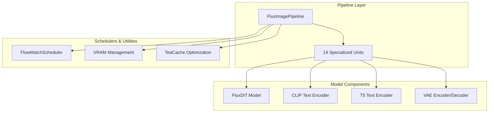
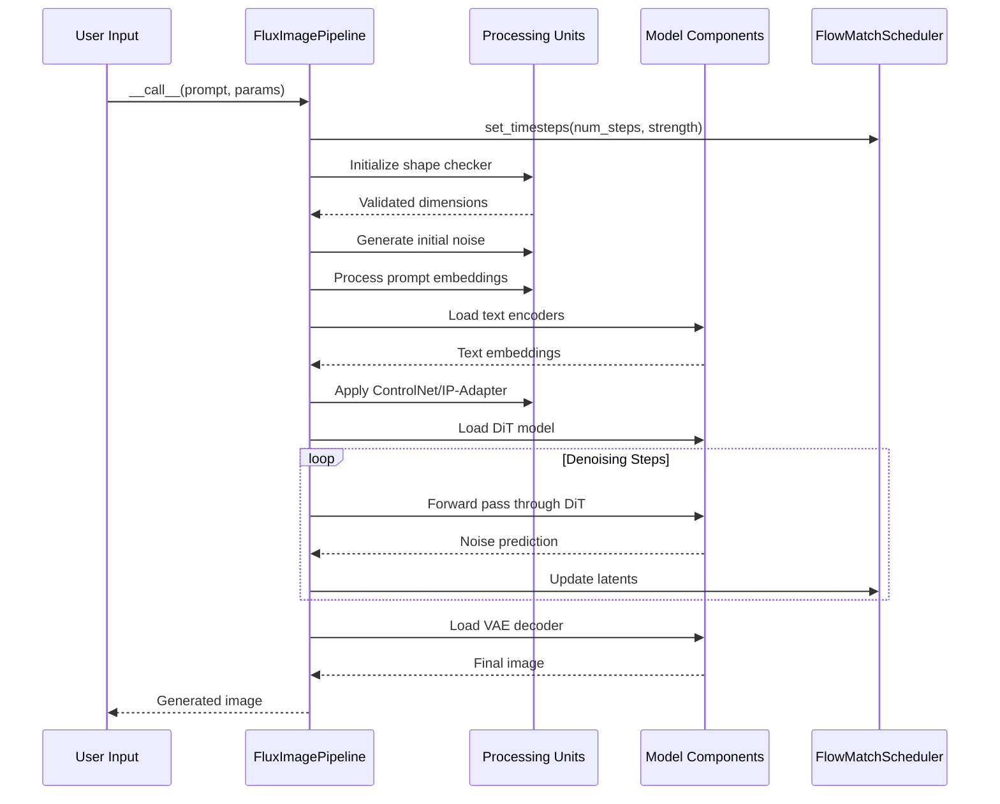
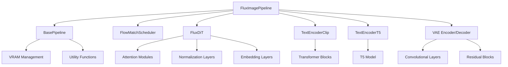

# Core Pipeline Architecture

<cite>
**Referenced Files in This Document**
- [flux_image.py](file://diffsynth/pipelines/flux_image.py)
- [base_pipeline.py](file://diffsynth/diffusion/base_pipeline.py)
- [flux_dit.py](file://diffsynth/models/flux_dit.py)
- [flux_text_encoder_clip.py](file://diffsynth/models/flux_text_encoder_clip.py)
- [flux_text_encoder_t5.py](file://diffsynth/models/flux_text_encoder_t5.py)
- [flux_vae.py](file://diffsynth/models/flux_vae.py)
- [flow_match.py](file://diffsynth/diffusion/flow_match.py)
- [layers.py](file://diffsynth/core/vram/layers.py)
</cite>

## Table of Contents
1. [Introduction](#introduction)
2. [Project Structure](#project-structure)
3. [Core Components](#core-components)
4. [Architecture Overview](#architecture-overview)
5. [Detailed Component Analysis](#detailed-component-analysis)
6. [Dependency Analysis](#dependency-analysis)
7. [Performance Considerations](#performance-considerations)
8. [Troubleshooting Guide](#troubleshooting-guide)
9. [Conclusion](#conclusion)

## Introduction

The FluxImagePipeline is a sophisticated image generation pipeline built on top of the BasePipeline framework, specifically designed for FLUX.1 models. It extends the foundational BasePipeline class to provide specialized functionality for text-to-image generation using advanced diffusion techniques. The pipeline implements a modular architecture with 14 specialized units that handle different aspects of the image generation process, from input processing through denoising to final image decoding.

This documentation provides a comprehensive analysis of the FluxImagePipeline architecture, explaining how it leverages FlowMatchScheduler for time stepping, dual text encoders (CLIP and T5), DiT model for diffusion, VAE encoder/decoder for latent space operations, and integrated VRAM management for efficient memory usage.

## Project Structure

The FluxImagePipeline implementation follows a well-organized modular structure:

**Diagram sources**
- [flux_image.py:57-107](file://diffsynth/pipelines/flux_image.py#L57-L107)
- [base_pipeline.py:61-85](file://diffsynth/diffusion/base_pipeline.py#L61-L85)

**Section sources**
- [flux_image.py:57-107](file://diffsynth/pipelines/flux_image.py#L57-L107)
- [base_pipeline.py:61-85](file://diffsynth/diffusion/base_pipeline.py#L61-L85)

## Core Components

### FluxImagePipeline Class

The FluxImagePipeline class serves as the main orchestrator for FLUX.1 image generation. It extends BasePipeline and implements a comprehensive set of features:

**Key Features:**
- **Dual Text Encoding**: Uses both CLIP and T5 encoders for rich text understanding
- **Advanced Diffusion**: Implements FlowMatchScheduler for precise time stepping
- **Modular Architecture**: 14 specialized units for different processing stages
- **Memory Management**: Integrated VRAM optimization with automatic model loading/unloading
- **Flexible Input Support**: Handles various input types including images, prompts, and control signals

**Initialization Parameters:**
- `device`: Target device for computation
- `torch_dtype`: Data type for model operations
- `height_division_factor`: Image dimension constraints (16x16 for FLUX)
- `width_division_factor`: Image dimension constraints (16x16 for FLUX)

**Section sources**
- [flux_image.py:57-107](file://diffsynth/pipelines/flux_image.py#L57-L107)

### BasePipeline Foundation

The BasePipeline class provides the foundational infrastructure for all pipelines in the system:

**Core Responsibilities:**
- Device and dtype management
- Shape validation and resizing
- Model loading and VRAM management
- Noise generation utilities
- Common preprocessing functions

**Key Methods:**
- `check_resize_height_width()`: Validates and adjusts image dimensions
- `preprocess_image()`: Converts PIL images to tensors
- `load_models_to_device()`: Manages model memory efficiently
- `generate_noise()`: Creates Gaussian noise for initialization

**Section sources**
- [base_pipeline.py:61-115](file://diffsynth/diffusion/base_pipeline.py#L61-L115)

## Architecture Overview

The FluxImagePipeline implements a sophisticated multi-stage architecture that processes inputs through a series of specialized units before generating the final image output.

**Diagram sources**
- [flux_image.py:180-291](file://diffsynth/pipelines/flux_image.py#L180-L291)
- [flow_match.py:214-225](file://diffsynth/diffusion/flow_match.py#L214-L225)

**Section sources**
- [flux_image.py:180-291](file://diffsynth/pipelines/flux_image.py#L180-L291)

## Detailed Component Analysis

### FlowMatchScheduler Implementation

The FlowMatchScheduler provides sophisticated time stepping mechanisms for FLUX.1 models:

**Key Features:**
- **Adaptive Time Stepping**: Supports multiple scheduling strategies
- **Denoising Strength Control**: Allows fine-tuned noise addition
- **Shift Parameter**: Controls the distribution of timesteps
- **Template-based Configuration**: Supports different model architectures

**FLUX.1 Specific Settings:**
- Default shift value: 3.0
- Sigma range: [0.003/1.002, 1.0]
- Training timestep count: 1000

**Section sources**
- [flow_match.py:20-31](file://diffsynth/diffusion/flow_match.py#L20-L31)

### Dual Text Encoders

The pipeline uses two complementary text encoders for enhanced text understanding:

#### CLIP Text Encoder
- **Purpose**: Provides pooled embeddings for global text understanding
- **Architecture**: 12-layer transformer with 768-dimensional embeddings
- **Vocabulary**: 49,408 tokens
- **Output**: Pooled embeddings for classifier-free guidance

#### T5 Text Encoder  
- **Purpose**: Generates detailed sequence embeddings for context
- **Architecture**: Large-scale T5 encoder with 4096-dimensional hidden states
- **Vocabulary**: 32,128 tokens
- **Output**: Full sequence embeddings for attention mechanisms

**Section sources**
- [flux_text_encoder_clip.py:75-113](file://diffsynth/models/flux_text_encoder_clip.py#L75-L113)
- [flux_text_encoder_t5.py:5-44](file://diffsynth/models/flux_text_encoder_t5.py#L5-L44)

### DiT Model Architecture

The FluxDiT model implements a hybrid architecture combining joint and single transformer blocks:

**Architecture Components:**
- **RoPE Embeddings**: Rotary position embeddings for spatial awareness
- **Joint Transformer Blocks**: 19 blocks for text-image interaction
- **Single Transformer Blocks**: 38 blocks for image refinement
- **Attention Mechanisms**: Multi-head attention with RMS normalization
- **AdaLayerNorm**: Adaptive layer normalization for conditioning

**Key Features:**
- **Patch-based Processing**: Processes images in 2x2 patches
- **Positional Encoding**: Combines text and image positional information
- **Entity Control**: Supports masked attention for region-specific editing
- **Gradient Checkpointing**: Memory-efficient training support

**Section sources**
- [flux_dit.py:277-399](file://diffsynth/models/flux_dit.py#L277-L399)

### VAE Encoder/Decoder

The Variational Autoencoder handles latent space operations:

#### VAE Encoder
- **Input**: RGB images (3 channels)
- **Output**: 16-channel latent representations
- **Architecture**: Downsampling network with residual connections
- **Processing**: Group normalization with SiLU activations

#### VAE Decoder  
- **Input**: 16-channel latent representations
- **Output**: RGB images (3 channels)
- **Architecture**: Upsampling network with attention blocks
- **Scaling Factors**: Custom scaling and shifting parameters

**Section sources**
- [flux_vae.py:296-435](file://diffsynth/models/flux_vae.py#L296-L435)

### VRAM Management System

The pipeline includes sophisticated memory management for handling large models:

**Core Components:**
- **AutoWrappedLinear**: Wraps linear layers with VRAM management
- **State Management**: Tracks model states (offloaded, loaded, preparing)
- **Disk Offloading**: Supports disk-based model storage
- **Automatic Loading**: Intelligent model loading based on usage patterns

**Memory Optimization Strategies:**
- **Lazy Loading**: Models loaded only when needed
- **Selective Computation**: Only required parameters moved to GPU
- **FP8 Support**: Optional float8 precision for reduced memory usage
- **LoRA Integration**: Efficient parameter updates without full model reload

**Section sources**
- [layers.py:271-437](file://diffsynth/core/vram/layers.py#L271-L437)

### 14 Specialized Processing Units

The pipeline implements 14 specialized units, each handling specific aspects of the generation process:

1. **FluxImageUnit_ShapeChecker**: Validates and adjusts image dimensions
2. **FluxImageUnit_NoiseInitializer**: Generates initial noise tensors
3. **FluxImageUnit_PromptEmbedder**: Processes text prompts through encoders
4. **FluxImageUnit_InputImageEmbedder**: Handles input image encoding
5. **FluxImageUnit_ImageIDs**: Generates positional IDs for attention
6. **FluxImageUnit_EmbeddedGuidanceEmbedder**: Processes guidance parameters
7. **FluxImageUnit_Kontext**: Handles contextual image references
8. **FluxImageUnit_InfiniteYou**: Identity preservation for face generation
9. **FluxImageUnit_ControlNet**: Applies ControlNet conditioning
10. **FluxImageUnit_IPAdapter**: Integrates IP-Adapter features
11. **FluxImageUnit_EntityControl**: Region-specific editing capabilities
12. **FluxImageUnit_NexusGen**: Advanced text-image generation
13. **FluxImageUnit_TeaCache**: Caching optimization for faster inference
14. **FluxImageUnit_Flex**: Flexible inpainting and control

**Section sources**
- [flux_image.py:86-104](file://diffsynth/pipelines/flux_image.py#L86-L104)

## Dependency Analysis

The FluxImagePipeline has a well-defined dependency structure that ensures proper component interaction:

**Diagram sources**
- [flux_image.py:15-22](file://diffsynth/pipelines/flux_image.py#L15-L22)
- [base_pipeline.py:1-12](file://diffsynth/diffusion/base_pipeline.py#L1-L12)

**Section sources**
- [flux_image.py:15-22](file://diffsynth/pipelines/flux_image.py#L15-L22)

## Performance Considerations

### Memory Optimization

The pipeline implements several strategies for optimal memory usage:

1. **Model Offloading**: Automatically offloads unused models to CPU/disk
2. **Tiled Processing**: Splits large images into tiles for processing
3. **Gradient Checkpointing**: Reduces memory during training
4. **Mixed Precision**: Supports FP16/BF16/FP8 computation

### Inference Speed

Several optimizations improve inference performance:

1. **TeaCache**: Caches intermediate results to avoid recomputation
2. **Model Compilation**: Optional torch.compile integration
3. **Batch Processing**: Efficient batch operations where possible
4. **Early Stopping**: Configurable step limits for faster generation

### Scalability

The architecture supports various deployment scenarios:

1. **Low VRAM**: Automatic model offloading for limited hardware
2. **High Performance**: Full model loading for maximum speed
3. **Multi-GPU**: Potential for distributed processing
4. **Cloud Deployment**: Container-friendly architecture

## Troubleshooting Guide

### Common Issues and Solutions

**Memory Errors:**
- Enable VRAM management: `pipe.vram_management_enabled = True`
- Reduce image resolution or batch size
- Use tiled processing for large images

**Performance Issues:**
- Enable TeaCache: Set `tea_cache_l1_thresh` parameter
- Use model compilation: `pipe.compile_pipeline()`
- Optimize LoRA settings for your use case

**Quality Problems:**
- Adjust CFG scale for better prompt adherence
- Modify denoising strength for different quality levels
- Check text encoder settings and tokenization

**Section sources**
- [flux_image.py:109-117](file://diffsynth/pipelines/flux_image.py#L109-L117)

## Conclusion

The FluxImagePipeline represents a sophisticated implementation of modern image generation technology, combining advanced diffusion techniques with practical engineering considerations. Its modular architecture allows for easy extension and customization while maintaining high performance and memory efficiency.

Key strengths of the architecture include:

- **Comprehensive Feature Set**: Supports numerous advanced features like ControlNet, IP-Adapter, and entity control
- **Memory Efficiency**: Sophisticated VRAM management enables running large models on limited hardware
- **Flexibility**: Modular design allows easy integration of new components
- **Performance**: Multiple optimization strategies ensure fast inference times
- **Scalability**: Architecture supports various deployment scenarios from low-end GPUs to cloud environments

The pipeline's design demonstrates best practices in modern AI system architecture, providing a solid foundation for both research and production deployments of FLUX.1 models.