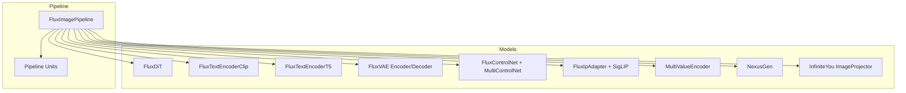
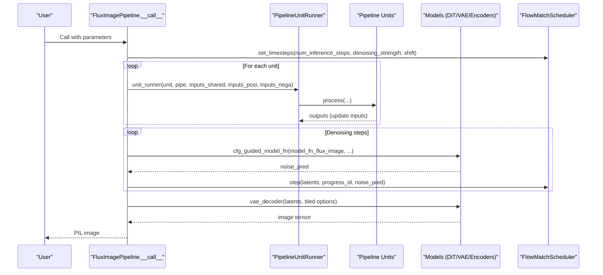
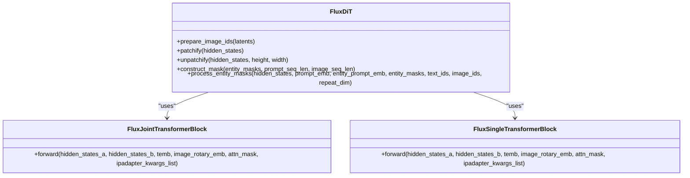
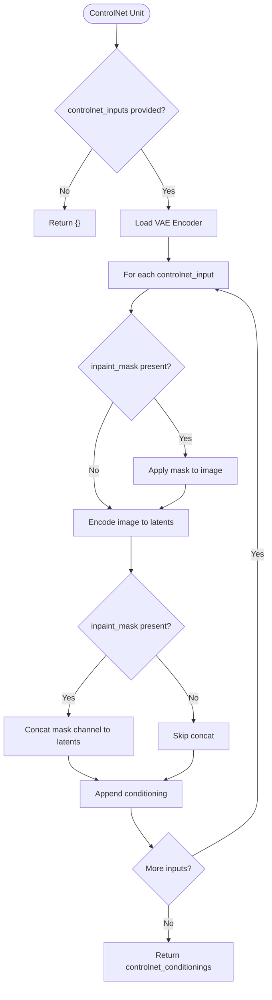

# FLUX Image Pipeline

<cite>
**Referenced Files in This Document**
- [flux_image.py](file://diffsynth/pipelines/flux_image.py)
- [base_pipeline.py](file://diffusion/base_pipeline.py)
- [flux_dit.py](file://diffsynth/models/flux_dit.py)
- [flux_text_encoder_clip.py](file://diffsynth/models/flux_text_encoder_clip.py)
- [flux_text_encoder_t5.py](file://diffsynth/models/flux_text_encoder_t5.py)
- [flux_vae.py](file://diffsynth/models/flux_vae.py)
- [flux_controlnet.py](file://diffsynth/models/flux_controlnet.py)
- [flux_ipadapter.py](file://diffsynth/models/flux_ipadapter.py)
- [flux_value_control.py](file://diffsynth/models/flux_value_control.py)
- [nexus_gen.py](file://diffsynth/models/nexus_gen.py)
- [flux_infiniteyou.py](file://diffsynth/models/flux_infiniteyou.py)
</cite>

## Table of Contents
1. Introduction
2. Project Structure
3. Core Components
4. Architecture Overview
5. Detailed Component Analysis
6. Dependency Analysis
7. Performance Considerations
8. Troubleshooting Guide
9. Conclusion

## Introduction
This document explains the FLUX image pipeline implementation and how FluxImagePipeline extends BasePipeline to provide specialized functionality for FLUX.1 models. It covers the complete inference workflow, including dual text encoders (CLIP and T5), image processing, ControlNet integration, IP-Adapter support, VAE decoding, and a comprehensive set of pipeline units that enable advanced features such as Kontext images, entity control, NexusGen integration, Flex inpainting, InfiniteYou face recognition, value control, and LoRA encoding. Parameter handling, VRAM management strategies, and performance optimization techniques specific to FLUX models are also documented.

## Project Structure
The FLUX pipeline is implemented as a modular pipeline with:
- A base pipeline framework providing unit orchestration, VRAM management, and common utilities.
- Specialized pipeline units for each feature (shape checking, noise initialization, prompt embedding, input image processing, ControlNet, IP-Adapter, entity control, NexusGen, TeaCache, Flex, Step1x, ValueControl, LoRA).
- Model components for DiT, text encoders (CLIP/T5), VAE, ControlNet, IP-Adapter, value controller, NexusGen, and InfiniteYou projector.

**Diagram sources**
- [flux_image.py](file://diffsynth/pipelines/flux_image.py)
- [base_pipeline.py](file://diffusion/base_pipeline.py)
- [flux_dit.py](file://diffsynth/models/flux_dit.py)
- [flux_text_encoder_clip.py](file://diffsynth/models/flux_text_encoder_clip.py)
- [flux_text_encoder_t5.py](file://diffsynth/models/flux_text_encoder_t5.py)
- [flux_vae.py](file://diffsynth/models/flux_vae.py)
- [flux_controlnet.py](file://diffsynth/models/flux_controlnet.py)
- [flux_ipadapter.py](file://diffsynth/models/flux_ipadapter.py)
- [flux_value_control.py](file://diffsynth/models/flux_value_control.py)
- [nexus_gen.py](file://diffsynth/models/nexus_gen.py)
- [flux_infiniteyou.py](file://diffsynth/models/flux_infiniteyou.py)

**Section sources**
- [flux_image.py](file://diffsynth/pipelines/flux_image.py)
- [base_pipeline.py](file://diffusion/base_pipeline.py)

## Core Components
- FluxImagePipeline orchestrates the full inference flow, manages model loading, VRAM, and runs pipeline units sequentially.
- BasePipeline provides shared utilities: shape checks, preprocessing, noise generation, CFG guidance, step scheduling, and VRAM-aware model on/offloading.
- FluxDiT implements the diffusion transformer with joint/single attention blocks, RoPE embeddings, patchify/unpatchify, and entity mask handling.
- Dual text encoders: CLIP produces pooled embeddings; T5 produces sequence embeddings.
- VAE encoder/decoder handle latent space transformations with tiled inference support.
- ControlNet integrates multiple conditionings with per-step scaling and optional inpaint masks.
- IP-Adapter injects image-derived cross-attention keys/values via SigLIP vision encoder.
- ValueController appends learned value embeddings to text embeddings.
- NexusGen generates or edits embeddings based on reference images and prompts.
- InfiniteYou processor prepares identity embeddings from an ID image using a projector.

**Section sources**
- [flux_image.py](file://diffsynth/pipelines/flux_image.py)
- [base_pipeline.py](file://diffusion/base_pipeline.py)
- [flux_dit.py](file://diffsynth/models/flux_dit.py)
- [flux_text_encoder_clip.py](file://diffsynth/models/flux_text_encoder_clip.py)
- [flux_text_encoder_t5.py](file://diffsynth/models/flux_text_encoder_t5.py)
- [flux_vae.py](file://diffsynth/models/flux_vae.py)
- [flux_controlnet.py](file://diffsynth/models/flux_controlnet.py)
- [flux_ipadapter.py](file://diffsynth/models/flux_ipadapter.py)
- [flux_value_control.py](file://diffsynth/models/flux_value_control.py)
- [nexus_gen.py](file://diffsynth/models/nexus_gen.py)
- [flux_infiniteyou.py](file://diffsynth/models/flux_infiniteyou.py)

## Architecture Overview
The pipeline follows a unit-driven architecture where each unit computes intermediate data required by subsequent steps. The main call method sets up the scheduler, collects inputs, runs units, performs CFG-guided denoising iterations, and decodes latents to images.

**Diagram sources**
- [flux_image.py](file://diffsynth/pipelines/flux_image.py)
- [base_pipeline.py](file://diffusion/base_pipeline.py)

**Section sources**
- [flux_image.py](file://diffsynth/pipelines/flux_image.py)
- [base_pipeline.py](file://diffusion/base_pipeline.py)

## Detailed Component Analysis

### FluxImagePipeline and Inference Workflow
- Initializes scheduler, tokenizers, text encoders, DiT, VAE, ControlNet, IP-Adapter, NexusGen, InfiniteYou, and LoRA components.
- Defines a fixed order of pipeline units ensuring correct data dependencies.
- The __call__ method constructs shared, positive, and negative inputs, executes units, then iteratively denoises with CFG guidance and finally decodes.

Key responsibilities:
- Shape normalization and validation.
- Noise initialization and latent preparation.
- Prompt embedding via CLIP and T5.
- Input image encoding and latent mixing.
- Optional features: Kontext, EntityControl, ControlNet, IP-Adapter, NexusGen, Flex, Step1x, ValueControl, LoRA.

**Section sources**
- [flux_image.py](file://diffsynth/pipelines/flux_image.py)

### BasePipeline Utilities
- Provides preprocess_image, vae_output_to_image, generate_noise, load_models_to_device, cfg_guided_model_fn, and step scheduling helpers.
- Implements VRAM management through onload/offload hooks and device caching.

**Section sources**
- [base_pipeline.py](file://diffusion/base_pipeline.py)

### FluxDiT (Diffusion Transformer)
- Joint and single transformer blocks with AdaLayerNorm and RMSNorm.
- RoPE positional embeddings and patchify/unpatchify operations.
- Entity mask construction and attention masking for multi-entity control.
- Supports IP-Adapter injection via q/k/v interactions.

**Diagram sources**
- [flux_dit.py](file://diffsynth/models/flux_dit.py)

**Section sources**
- [flux_dit.py](file://diffsynth/models/flux_dit.py)

### Text Encoders (CLIP and T5)
- CLIP encoder returns pooled embeddings suitable for guidance conditioning.
- T5 encoder returns sequence embeddings for rich textual context.
- Both are used by the PromptEmbedder unit to produce prompt_emb, pooled_prompt_emb, and text_ids.

**Section sources**
- [flux_text_encoder_clip.py](file://diffsynth/models/flux_text_encoder_clip.py)
- [flux_text_encoder_t5.py](file://diffsynth/models/flux_text_encoder_t5.py)
- [flux_image.py](file://diffsynth/pipelines/flux_image.py)

### VAE Encoder/Decoder
- Encoder reduces images to 16-channel latents; decoder reconstructs images from latents.
- Tiled inference supports large images by splitting into tiles and blending with overlap masks.

**Section sources**
- [flux_vae.py](file://diffsynth/models/flux_vae.py)
- [flux_image.py](file://diffsynth/pipelines/flux_image.py)

### ControlNet Integration
- MultiControlNet aggregates multiple ControlNet models with per-control scaling and temporal gating (start/end).
- Supports inpaint masks by modifying input images and concatenating masks into latents.

**Diagram sources**
- [flux_image.py](file://diffsynth/pipelines/flux_image.py)
- [flux_controlnet.py](file://diffsynth/models/flux_controlnet.py)

**Section sources**
- [flux_image.py](file://diffsynth/pipelines/flux_image.py)
- [flux_controlnet.py](file://diffsynth/models/flux_controlnet.py)

### IP-Adapter Support
- Uses SigLIP vision encoder to extract image embeddings.
- MLP projects embeddings into tokens injected into DiT attention via k/v pairs.
- Scale controls strength of image influence.

**Section sources**
- [flux_ipadapter.py](file://diffsynth/models/flux_ipadapter.py)
- [flux_image.py](file://diffsynth/pipelines/flux_image.py)

### Entity Control (EliGen-style)
- Encodes entity prompts and masks to create attention masks that restrict cross-attention between entities and regions.
- Supports enabling entity control on negative branch for CFG.

**Section sources**
- [flux_image.py](file://diffsynth/pipelines/flux_image.py)

### NexusGen Integration
- Generates target image embeddings from instruction and optional reference image.
- Produces text_ids aligned with grid embeddings for editing or generation modes.

**Section sources**
- [nexus_gen.py](file://diffsynth/models/nexus_gen.py)
- [flux_image.py](file://diffsynth/pipelines/flux_image.py)

### Flex Inpainting
- Combines inpaint image, mask, and optional control image into a concatenated conditioning.
- Supports stopping control at a specific timestep.

**Section sources**
- [flux_image.py](file://diffsynth/pipelines/flux_image.py)

### InfiniteYou Face Recognition
- Processes ID image through a projector to obtain identity embeddings.
- Guidance parameter modulates influence.

**Section sources**
- [flux_infiniteyou.py](file://diffsynth/models/flux_infiniteyou.py)
- [flux_image.py](file://diffsynth/pipelines/flux_image.py)

### Value Control
- Appends value embeddings to text embeddings and corresponding text_ids.
- Supports multiple value encoders concatenated.

**Section sources**
- [flux_value_control.py](file://diffsynth/models/flux_value_control.py)
- [flux_image.py](file://diffsynth/pipelines/flux_image.py)

### LoRA Encoding
- Hot-loading LoRA weights into wrapped linear layers when VRAM management is enabled.
- Fusing LoRA into base model otherwise.

**Section sources**
- [base_pipeline.py](file://diffusion/base_pipeline.py)
- [flux_image.py](file://diffsynth/pipelines/flux_image.py)

## Dependency Analysis
The pipeline exhibits clear separation of concerns:
- BasePipeline provides core utilities and VRAM management.
- FluxImagePipeline composes units and models.
- Each model component encapsulates its own logic and can be independently loaded/offloaded.

```mermaid
graph TB
BP["BasePipeline"] --> FP["FluxImagePipeline"]
FP --> U1["ShapeChecker"]
FP --> U2["NoiseInitializer"]
FP --> U3["PromptEmbedder"]
FP --> U4["InputImageEmbedder"]
FP --> U5["ImageIDs"]
FP --> U6["EmbeddedGuidanceEmbedder"]
FP --> U7["Kontext"]
FP --> U8["InfiniteYou"]
FP --> U9["ControlNet"]
FP --> U10["IPAdapter"]
FP --> U11["EntityControl"]
FP --> U12["NexusGen"]
FP --> U13["TeaCache"]
FP --> U14["Flex"]
FP --> U15["Step1x"]
FP --> U16["ValueControl"]
FP --> U17["LoRAEncode"]
FP --> M1["FluxDiT"]
FP --> M2["CLIP Encoder"]
FP --> M3["T5 Encoder"]
FP --> M4["VAE Encoder/Decoder"]
FP --> M5["ControlNet(s)"]
FP --> M6["IP-Adapter"]
FP --> M7["Value Controller"]
FP --> M8["NexusGen"]
FP --> M9["InfiniteYou Projector"]
```

**Diagram sources**
- [flux_image.py](file://diffsynth/pipelines/flux_image.py)
- [base_pipeline.py](file://diffusion/base_pipeline.py)

**Section sources**
- [flux_image.py](file://diffsynth/pipelines/flux_image.py)
- [base_pipeline.py](file://diffusion/base_pipeline.py)

## Performance Considerations
- VRAM Management:
  - Use load_models_to_device to selectively offload/onload models during inference.
  - Enable VRAM management on models supporting it; pipeline auto-detects capability.
- Tiled Inference:
  - VAE encoder/decoder support tiled mode to reduce memory usage for large images.
  - Tile size and stride can be tuned for speed vs. memory trade-offs.
- Compilation:
  - Compile DiT blocks for repeated computation paths to accelerate inference.
- CFG Guidance:
  - When cfg_scale != 1.0, both positive and negative branches are computed; consider reducing steps or enabling optimizations.
- LoRA Hot-loading:
  - Prefer hot-loading over fusing when VRAM management is enabled to avoid recomputation.

[No sources needed since this section provides general guidance]

## Troubleshooting Guide
Common issues and resolutions:
- VRAM errors:
  - Ensure VRAM management is enabled on models; use load_models_to_device appropriately.
  - Reduce tile_size or increase tile_stride for VAE operations.
- Shape mismatches:
  - Height/width must be divisible by 16; pipeline rounds up automatically but verify inputs.
- ControlNet mask alignment:
  - Ensure inpaint masks match input image resolution; pipeline resizes internally but incorrect aspect ratios may cause artifacts.
- IP-Adapter scale too high:
  - Adjust ipadapter_scale to balance image influence; excessive values can distort content.
- Entity masks not applied:
  - Verify masks are binary and correctly sized to latent dimensions; ensure entity prompts are provided.

**Section sources**
- [flux_image.py](file://diffsynth/pipelines/flux_image.py)
- [base_pipeline.py](file://diffusion/base_pipeline.py)

## Conclusion
The FLUX image pipeline provides a robust, modular framework for high-quality image generation and editing. By extending BasePipeline with specialized units and integrating powerful models like DiT, dual text encoders, ControlNet, IP-Adapter, and more, it enables flexible control over generation outcomes. With built-in VRAM management, tiled inference, and compilation support, it balances performance and memory efficiency. Users can configure diverse features such as Kontext images, entity masks, Flex inpainting, and various control mechanisms to achieve precise creative control.