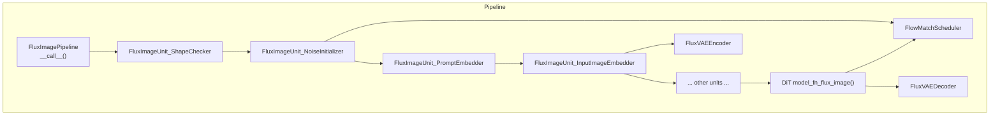
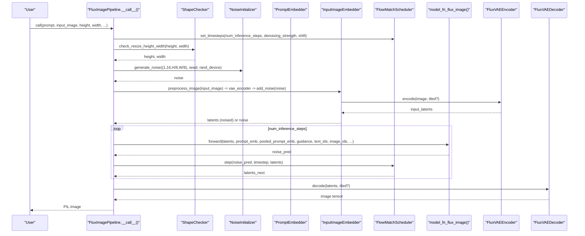
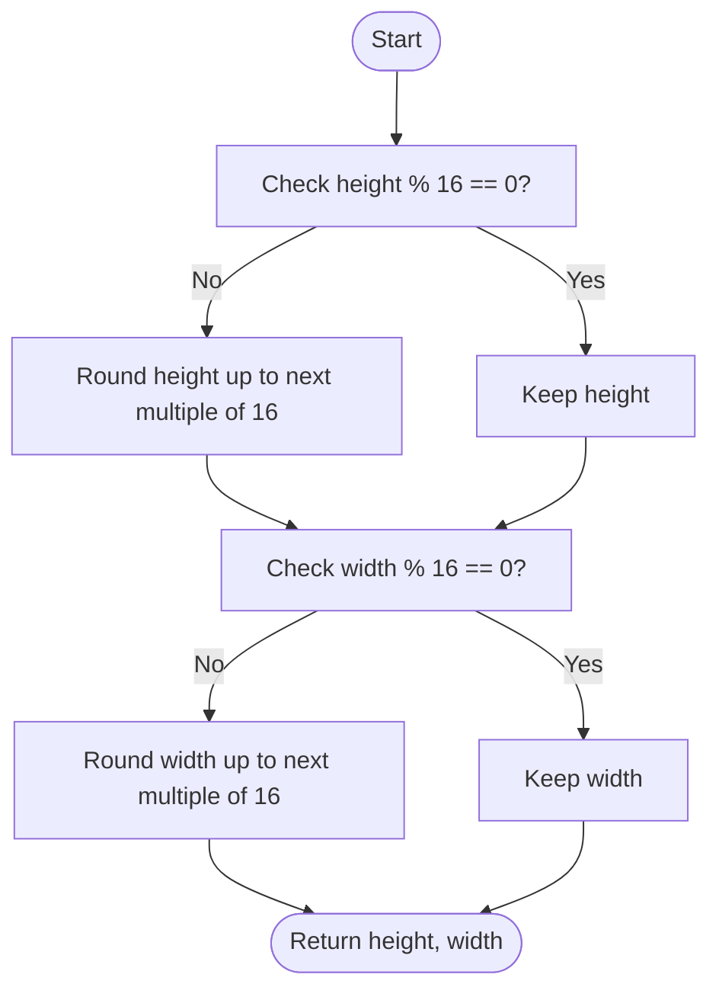
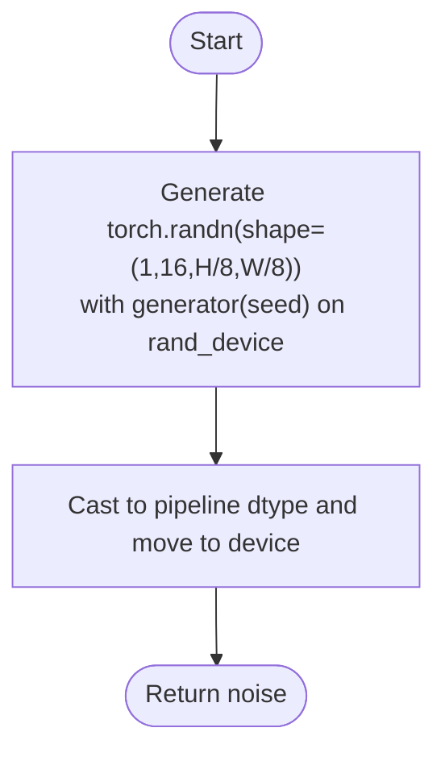
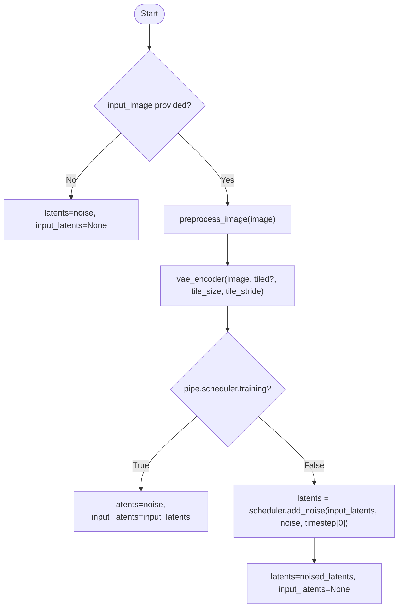
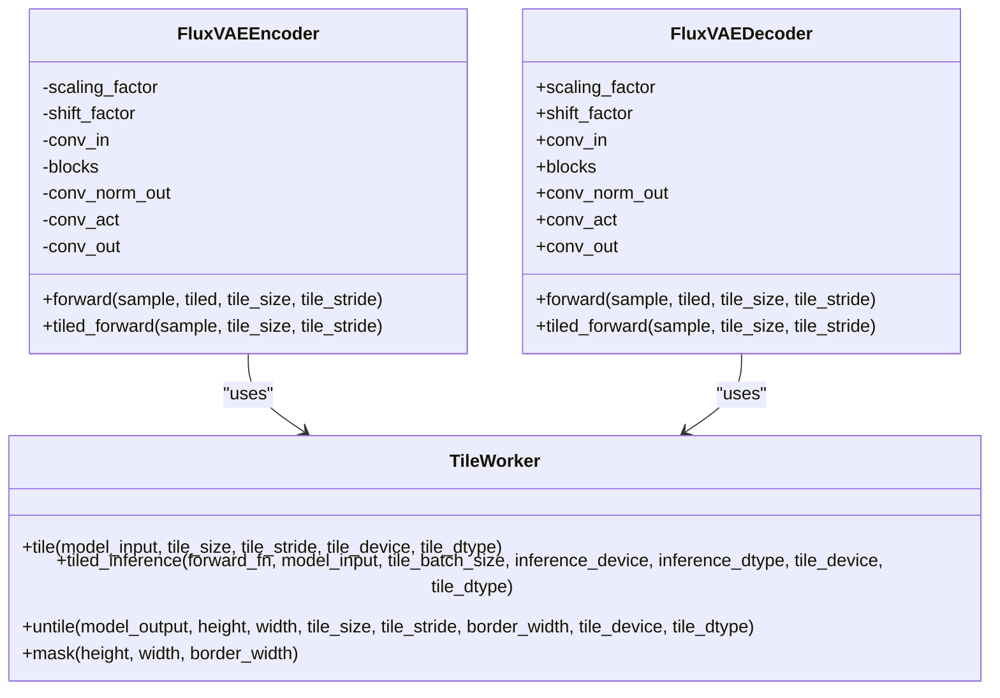
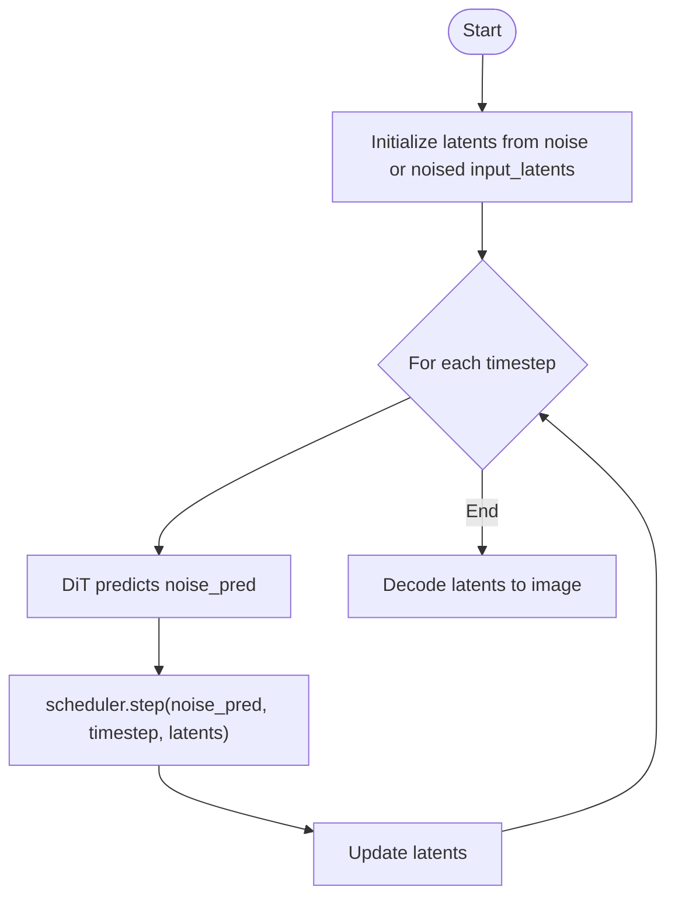
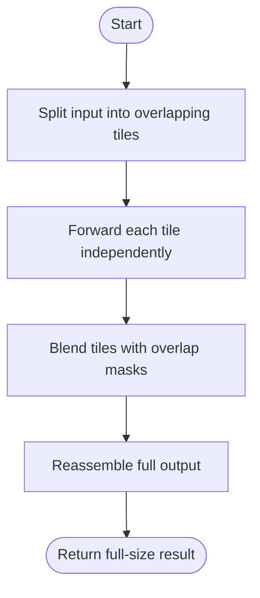
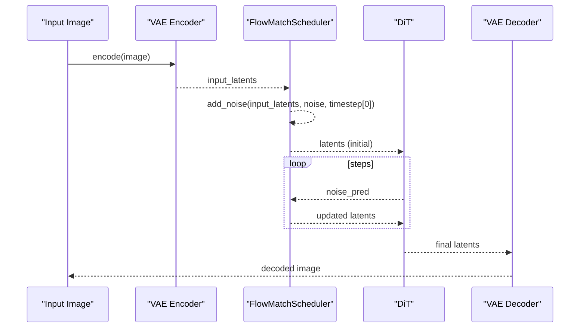
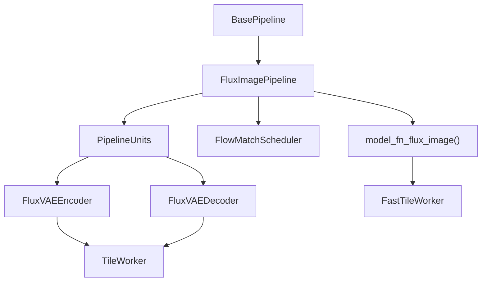

# Image Processing Units

<cite>
**Referenced Files in This Document**
- [flux_image.py](file://diffsynth/pipelines/flux_image.py)
- [base_pipeline.py](file://diffsynth/diffusion/base_pipeline.py)
- [flow_match.py](file://diffsynth/diffusion/flow_match.py)
- [flux_vae.py](file://diffsynth/models/flux_vae.py)
</cite>

## Table of Contents
1. [Introduction](#introduction)
2. [Project Structure](#project-structure)
3. [Core Components](#core-components)
4. [Architecture Overview](#architecture-overview)
5. [Detailed Component Analysis](#detailed-component-analysis)
6. [Dependency Analysis](#dependency-analysis)
7. [Performance Considerations](#performance-considerations)
8. [Troubleshooting Guide](#troubleshooting-guide)
9. [Conclusion](#conclusion)

## Introduction
This document explains the image processing units used in the FLUX pipeline, focusing on:
- FluxImageUnit_ShapeChecker for dimension validation and resolution constraints
- FluxImageUnit_NoiseInitializer for random noise generation
- FluxImageUnit_InputImageEmbedder for input image encoding via the VAE encoder
It also covers the VAE encoding process, latent space manipulation, noise addition strategies, shape requirements, memory optimization techniques, tiled processing for large images, and the relationship between input images, latents, and the denoising loop.

## Project Structure
The FLUX image pipeline is implemented as a sequence of PipelineUnits that transform shared inputs into positive/negative conditioning and intermediate tensors required by the DiT model. The key files are:
- Pipeline orchestration and unit runner: base_pipeline.py
- FLUX-specific units and model function: flux_image.py
- Flow matching scheduler and noise scheduling: flow_match.py
- VAE encoder/decoder with tiled support: flux_vae.py

**Diagram sources**
- [flux_image.py:57-106](file://diffsynth/pipelines/flux_image.py#L57-L106)
- [flux_image.py:294-333](file://diffsynth/pipelines/flux_image.py#L294-L333)
- [base_pipeline.py:61-115](file://diffsynth/diffusion/base_pipeline.py#L61-L115)
- [flow_match.py:214-252](file://diffsynth/diffusion/flow_match.py#L214-L252)
- [flux_vae.py:368-434](file://diffsynth/models/flux_vae.py#L368-L434)

**Section sources**
- [flux_image.py:57-106](file://diffsynth/pipelines/flux_image.py#L57-L106)
- [base_pipeline.py:61-115](file://diffsynth/diffusion/base_pipeline.py#L61-L115)

## Core Components
- FluxImageUnit_ShapeChecker: Ensures height and width satisfy the model’s divisibility constraints (height_division_factor=16, width_division_factor=16). It rounds up to multiples of 16 if needed.
- FluxImageUnit_NoiseInitializer: Generates Gaussian noise at the latent resolution (C=16, H=H_in/8, W=W_in/8), using a seed and device control.
- FluxImageUnit_InputImageEmbedder: Encodes an optional input image through the VAE encoder to produce input_latents; during inference it mixes these latents with noise according to the scheduler’s first timestep to obtain initial latents.

These units operate within a pipeline where each unit declares its inputs and outputs, enabling automatic data dependency management and selective model loading.

**Section sources**
- [flux_image.py:294-333](file://diffsynth/pipelines/flux_image.py#L294-L333)
- [base_pipeline.py:97-115](file://diffsynth/diffusion/base_pipeline.py#L97-L115)
- [base_pipeline.py:182-187](file://diffsynth/diffusion/base_pipeline.py#L182-L187)

## Architecture Overview
The FLUX pipeline composes multiple units to prepare all conditioning and latents before the DiT denoising loop. The denoising loop uses a FlowMatchScheduler to schedule sigmas and timesteps, while the VAE handles image-to-latent and latent-to-image conversions. Tiled processing is available for both VAE and DiT to reduce memory usage for large images.

**Diagram sources**
- [flux_image.py:180-291](file://diffsynth/pipelines/flux_image.py#L180-L291)
- [flux_image.py:294-333](file://diffsynth/pipelines/flux_image.py#L294-L333)
- [flow_match.py:214-252](file://diffsynth/diffusion/flow_match.py#L214-L252)
- [flux_vae.py:368-434](file://diffsynth/models/flux_vae.py#L368-L434)
- [flux_vae.py:296-366](file://diffsynth/models/flux_vae.py#L296-L366)

## Detailed Component Analysis

### FluxImageUnit_ShapeChecker
- Purpose: Validate and adjust height and width so they are divisible by 16 (FLUX DiT requires this due to patching and downsampling factors).
- Behavior: Calls the base pipeline’s shape checker which rounds up to the nearest multiple of 16 when necessary.
- Output: height, width (possibly adjusted).

**Diagram sources**
- [base_pipeline.py:97-115](file://diffsynth/diffusion/base_pipeline.py#L97-L115)
- [flux_image.py:294-301](file://diffsynth/pipelines/flux_image.py#L294-L301)

**Section sources**
- [flux_image.py:294-301](file://diffsynth/pipelines/flux_image.py#L294-L301)
- [base_pipeline.py:97-115](file://diffsynth/diffusion/base_pipeline.py#L97-L115)

### FluxImageUnit_NoiseInitializer
- Purpose: Generate initial Gaussian noise at the latent resolution for the diffusion process.
- Latent shape: (B=1, C=16, H=height//8, W=width//8).
- Randomness: Controlled by seed and rand_device; final tensor is cast to the pipeline dtype and moved to the computation device.

**Diagram sources**
- [base_pipeline.py:182-187](file://diffsynth/diffusion/base_pipeline.py#L182-L187)
- [flux_image.py:304-311](file://diffsynth/pipelines/flux_image.py#L304-L311)

**Section sources**
- [flux_image.py:304-311](file://diffsynth/pipelines/flux_image.py#L304-L311)
- [base_pipeline.py:182-187](file://diffsynth/diffusion/base_pipeline.py#L182-L187)

### FluxImageUnit_InputImageEmbedder
- Purpose: Encode an optional input image to latents and mix with noise to initialize the denoising trajectory.
- Steps:
  - If no input image: return noise as latents and input_latents=None.
  - Preprocess image to tensor (normalized to [-1,1], B,C,H,W).
  - Encode via FluxVAEEncoder (supports tiled mode).
  - During training: return noise as latents and input_latents for loss computation.
  - During inference: compute latents = scheduler.add_noise(input_latents, noise, timestep=first_timestep).

**Diagram sources**
- [flux_image.py:314-333](file://diffsynth/pipelines/flux_image.py#L314-L333)
- [flow_match.py:246-252](file://diffsynth/diffusion/flow_match.py#L246-L252)
- [flux_vae.py:368-434](file://diffsynth/models/flux_vae.py#L368-L434)

**Section sources**
- [flux_image.py:314-333](file://diffsynth/pipelines/flux_image.py#L314-L333)
- [flow_match.py:246-252](file://diffsynth/diffusion/flow_match.py#L246-L252)
- [flux_vae.py:368-434](file://diffsynth/models/flux_vae.py#L368-L434)

### VAE Encoding Process and Latent Space Manipulation
- Encoder:
  - Input: RGB image normalized to [-1,1] with shape (B,C,H,W).
  - Output: latent tensor with C=16 channels, spatial size reduced by factor 8 relative to input.
  - Supports tiled_forward for memory-efficient encoding of large images.
- Decoder:
  - Input: latent tensor (C=16).
  - Output: RGB image tensor (C=3), converted back to PIL.Image by the pipeline.
  - Also supports tiled_forward for decoding large latents.

Memory optimization:
- Both encoder and decoder expose tiled_forward methods that split the input into overlapping tiles, process them independently, and reassemble with blending masks to avoid boundary artifacts.

**Diagram sources**
- [flux_vae.py:368-434](file://diffsynth/models/flux_vae.py#L368-L434)
- [flux_vae.py:296-366](file://diffsynth/models/flux_vae.py#L296-L366)
- [flux_vae.py:5-106](file://diffsynth/models/flux_vae.py#L5-L106)

**Section sources**
- [flux_vae.py:368-434](file://diffsynth/models/flux_vae.py#L368-L434)
- [flux_vae.py:296-366](file://diffsynth/models/flux_vae.py#L296-L366)
- [flux_vae.py:5-106](file://diffsynth/models/flux_vae.py#L5-L106)

### Noise Addition Strategies and Denoising Loop
- FlowMatchScheduler:
  - Computes sigmas and timesteps based on template (FLUX.1 default).
  - add_noise(original_samples, noise, timestep): linearly interpolates between original samples and noise using sigma at the given timestep.
  - step(model_output, timestep, sample): advances the sample along the flow using sigma differences.
- Denoising loop:
  - For each timestep, the DiT predicts noise; the scheduler updates latents accordingly.
  - Optional inpaint mask blending can be applied to steer the update toward the expected value at the masked region.

**Diagram sources**
- [flow_match.py:214-252](file://diffsynth/diffusion/flow_match.py#L214-L252)
- [base_pipeline.py:220-226](file://diffsynth/diffusion/base_pipeline.py#L220-L226)
- [flux_image.py:273-291](file://diffsynth/pipelines/flux_image.py#L273-L291)

**Section sources**
- [flow_match.py:214-252](file://diffsynth/diffusion/flow_match.py#L214-L252)
- [base_pipeline.py:220-226](file://diffsynth/diffusion/base_pipeline.py#L220-L226)
- [flux_image.py:273-291](file://diffsynth/pipelines/flux_image.py#L273-L291)

### Tiled Processing for Large Images
- VAE:
  - TileWorker splits inputs into overlapping tiles, processes each tile, and reassembles using blending masks to smooth boundaries.
- DiT:
  - FastTileWorker implements a similar strategy for the DiT forward pass, allowing large latents to be processed in chunks without exceeding memory limits.

**Diagram sources**
- [flux_vae.py:5-106](file://diffsynth/models/flux_vae.py#L5-L106)
- [flux_image.py:947-997](file://diffsynth/pipelines/flux_image.py#L947-L997)

**Section sources**
- [flux_vae.py:5-106](file://diffsynth/models/flux_vae.py#L5-L106)
- [flux_image.py:947-997](file://diffsynth/pipelines/flux_image.py#L947-L997)

### Relationship Between Input Images, Latents, and Denoising
- Input images are encoded to latents via the VAE encoder.
- During inference, latents are initialized by mixing input_latents with noise according to the scheduler’s first timestep (controlled by denoising_strength).
- The DiT iteratively denoises latents across scheduled timesteps.
- Finally, the VAE decoder reconstructs the image from the final latents.

**Diagram sources**
- [flux_image.py:314-333](file://diffsynth/pipelines/flux_image.py#L314-L333)
- [flow_match.py:246-252](file://diffsynth/diffusion/flow_match.py#L246-L252)
- [flux_vae.py:368-434](file://diffsynth/models/flux_vae.py#L368-L434)
- [flux_vae.py:296-366](file://diffsynth/models/flux_vae.py#L296-L366)

## Dependency Analysis
- BasePipeline provides core utilities:
  - check_resize_height_width: enforces divisibility by 16.
  - preprocess_image/vae_output_to_image: I/O normalization.
  - generate_noise: RNG setup and casting.
  - step: scheduler integration for denoising updates.
- FluxImagePipeline wires together units and models:
  - Units declare inputs/outputs and optional model names to load on demand.
  - model_fn_flux_image orchestrates DiT forward, ControlNet, Flex, Step1x, Kontext, IP-Adapter, etc., and supports tiled mode.
- FlowMatchScheduler defines noise schedules and operations (add_noise, step, return_to_timestep).
- FluxVAEEncoder/Decoder implement tiled processing for memory efficiency.

**Diagram sources**
- [base_pipeline.py:61-115](file://diffsynth/diffusion/base_pipeline.py#L61-L115)
- [flux_image.py:57-106](file://diffsynth/pipelines/flux_image.py#L57-L106)
- [flux_image.py:1000-1203](file://diffsynth/pipelines/flux_image.py#L1000-L1203)
- [flow_match.py:214-252](file://diffsynth/diffusion/flow_match.py#L214-L252)
- [flux_vae.py:5-106](file://diffsynth/models/flux_vae.py#L5-L106)

**Section sources**
- [base_pipeline.py:61-115](file://diffsynth/diffusion/base_pipeline.py#L61-L115)
- [flux_image.py:57-106](file://diffsynth/pipelines/flux_image.py#L57-L106)
- [flux_image.py:1000-1203](file://diffsynth/pipelines/flux_image.py#L1000-L1203)
- [flow_match.py:214-252](file://diffsynth/diffusion/flow_match.py#L214-L252)
- [flux_vae.py:5-106](file://diffsynth/models/flux_vae.py#L5-L106)

## Performance Considerations
- Resolution constraints: Height and width must be multiples of 16; otherwise, they are rounded up automatically.
- Memory optimization:
  - Use tiled=True for VAE encoder/decoder and DiT forward to process large images in tiles.
  - VRAM management: Models can be offloaded/onloaded dynamically; only necessary modules are kept in memory during specific phases.
  - Gradient checkpointing: Used inside DiT blocks to reduce activation memory during training/inference.
- Precision: Pipeline defaults to bfloat16 for computation; ensure consistent dtype handling across units.
- Scheduler tuning: sigma_shift and denoising_strength influence noise levels and convergence speed.

[No sources needed since this section provides general guidance]

## Troubleshooting Guide
- Shape errors: Ensure height and width are multiples of 16; the pipeline will round up automatically but may affect aspect ratio.
- Out-of-memory: Enable tiled processing for VAE and DiT; reduce tile_size/tile_stride appropriately; use VRAM management features.
- Incorrect denoising behavior: Verify denoising_strength and scheduler settings; check that add_noise is called with the correct first timestep during initialization.
- Input preprocessing: Confirm images are normalized to [-1,1] and have correct channel order (RGB); the pipeline handles conversion internally.

**Section sources**
- [base_pipeline.py:97-115](file://diffsynth/diffusion/base_pipeline.py#L97-L115)
- [flux_image.py:314-333](file://diffsynth/pipelines/flux_image.py#L314-L333)
- [flow_match.py:246-252](file://diffsynth/diffusion/flow_match.py#L246-L252)
- [flux_vae.py:5-106](file://diffsynth/models/flux_vae.py#L5-L106)

## Conclusion
The FLUX pipeline’s image processing units provide robust dimension validation, flexible noise initialization, and efficient VAE-based image encoding. Together with FlowMatchScheduler and tiled processing, they enable high-quality image generation even for large resolutions while managing memory effectively. Understanding the relationships between input images, latents, and the denoising loop is key to integrating custom preprocessing, control signals, and optimizations.

[No sources needed since this section summarizes without analyzing specific files]